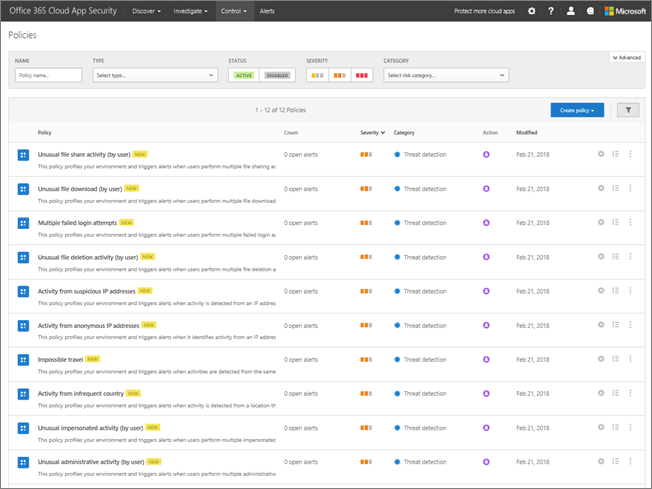
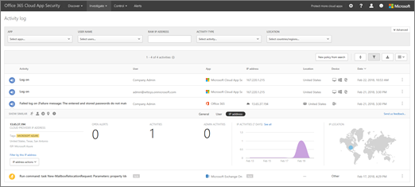

# Office 365 Cloud App Security 변칙 검색 정책

Office 365 고급 보안 관리 Office 365 클라우드 응용 프로그램 보안 되었습니다.
  
|평가 * *\>**|계획 * *\>**|배포 * *\>**|사용률 * * *|
|:-----|:-----|:-----|:-----|
|[평가 시작 합니다.](office-365-cas-overview.md)   |[계획을 시작합니다](get-ready-for-office-365-cas.md)   |여기는!    [다음 단계](integrate-your-siem-server-with-office-365-cas.md)   |[활용 하 여 시작](utilization-activities-for-ocas.md)   |
   
[Microsoft 클라우드 앱 보안 릴리스 116](new-in-office-365-cas-2018.md#office-365-cloud-app-security-release-116-3)부터는 Office 365 클라우드 응용 프로그램 보안 정책이 포함 됩니다 여러 미리 정의 된 예외 검색 ("특별") 사용자 및 엔터티 동작 분석 (UEBA) 및 (ML)을 학습 하는 컴퓨터를 포함 하는.
  

  
이러한 예외 감지 정책은 사용자 및 컴퓨터 및 네트워크에 연결 된 장치에서 다양 한 행동 비정상 상태를 대상으로 하는 즉시 감지를 제공 하 여 즉시 결과 제공 합니다. 또한 새 정책 조사 프로세스의 속도 및 진행 중인 위협 요소를 포함 하는데 도움이 되는 클라우드 앱 보안 검색 엔진에서 더 많은 데이터를 표시 합니다.
  
Office 365 전역 관리자 또는 보안 관리자, 검토, 수 있으며 필요한 경우에 Office 365 클라우드 응용 프로그램 보안 함께 사용할 수 있는 기본 정책을 수정 수 있습니다.
  
 > [!IMPORTANT]
> 초기 학습 기간 7 (7) 일 하는 동안에 비정상적인 동작 경고가 트리거되 하지는 방법이 있습니다. 예외 감지 알고리즘 false 양의 알림 메시지 수를 줄이는 최적화 됩니다. 
  
## 시작하기 전에

다음 사항을 확인합니다.
  
- 조직에 [Office 365 클라우드 응용 프로그램 보안](office-365-cas-overview.md)및 서비스를 [설정](turn-on-office-365-cas.md)합니다.
    
- Office 365 환경에 대 한 [감사 로깅](turn-audit-log-search-on-or-off.md) 기능이 켜 집니다. 
    
- 전역 관리자 또는 Office 365에 대 한 보안 관리자는 합니다.
    
## 예외 감지 정책 보기

1. 전역 관리자 또는 보안 관리자, 포털로 이동 하는 클라우드 응용 프로그램 보안 ([https://portal.cloudappsecurity.com](https://portal.cloudappsecurity.com))에 로그인 하 고 있습니다. 이 Office 365 클라우드 앱 보안 정책 페이지로 이동 합니다.
    
2. **유형** 목록에서 **예외 감지 정책**을 선택 합니다. 조직의 기본 (또는 기존) 예외 감지 정책이 표시 됩니다. 
  
3. 검토 또는 해당 설정을 편집 하는 정책을 선택 합니다.
    
4. **업데이트**를 선택하여 변경 내용을 저장합니다. 
    
## 예외 감지 정책에 대 한 자세한 내용은

예외 감지 정책은 자동으로 활성화 됩니다. 그러나 Office 365 클라우드 응용 프로그램 보안에 검색 알림은 일부 예외 하는 동안 발생 하는 7 일간의는 초기 학습 기간이 있습니다. 그런 다음 각 세션 활동을 때 사용자가 현재, IP 주소, 장치, 지난 달 및 이러한 활동의 위험 점수를 통해 검색 등을과 비교 됩니다. 이러한 감지를 사용 하면 사용자 환경 프로필 및 조직의 활동에 습득 된 초기 계획 관련 하 여 경고를 발생 하는 추론 예외 검색 엔진의 일부인 합니다. 또한 이러한 감지 가양성을 줄이는 사용자 및 로그의 패턴을 프로 파일링을 설계 하는 컴퓨터 학습 알고리즘을 활용 합니다.
  
비정상 상태는 사용자 활동을 검사 하 여 검색 됩니다. 위험 위험한 IP 주소, 로그인 오류, 관리 작업, 비활성 계정, 위치, 불가능 한 출장, 장치 및 사용자 에이전트 및 활동 속도 같은 여러 위험 요소 별로 그룹화 하 여 30 개 다른 위험 표시기를 확인 하 여 계산 됩니다.
  
정책 결과에 따라, 보안 경고는 트리거됩니다. Office 365 클라우드 응용 프로그램 보안 Office 365의 모든 사용자 세션을 확인 하 고는 다른 사용자의 일반 작업 나 조직의 초기 계획에서 변경 내용이 있을 때마다 사용자에 게 알려줍니다.
  
다음 표에서 기본 예외 탐지 정책, 수행 하는 기능 및 작동 하는 방법을 설명 합니다.
  
|**예외 감지 정책 이름**|**작동 방법**|
|:-----|:-----|
|불가능 한 출장    |두 사용자 활동을 식별 (단일 또는 여러 세션은)에서 들어오는 지리적으로 멀리 떨어져 있는 위치에서 시간 보다 짧은 기간 내 것이 라인으로 전환한 있는지 여부를 나타내는, 둘째 첫번째 위치에서 이동 하기 사용자는 서로 다른 사용자는 동일한 자격 증명 사용 하는 것입니다. 분명 한 "가양성" 불가능 한 출장 조건 예: Vpn 및 조직의 다른 사용자가 정기적으로 사용 되는 위치를 무시 하는 알고리즘을 학습 하는 컴퓨터 기술을 활용 하는이 감지 합니다. 이 검색에 새 사용자의 작업 패턴을 학습 해당 하는 동안 7 일간의는 초기 학습 기간이 있습니다.    |
|자주 사용 하지 않는 국가에서 활동    |새로 추가 되거나 자주 사용 하지 않는 위치를 확인 하려면 과거의 작업 위치를 고려 합니다. 예외 검색 엔진은 조직에서 사용자가 사용 하는 이전 위치에 대 한 정보를 저장 합니다. 알림은 활동 하지 최근에 되거나 전혀 방문 되는 사용자 또는 조직에서 모든 사용자가 있는 위치에서 발생할 때 트리거됩니다.    |
|익명 IP 주소에서 활동    |사용자가 익명 프록시 IP 주소로 식별 된 IP 주소에서 활성을 식별 합니다. 이러한 프록시를 자신의 장치의 IP 주소를 숨기려면 고 나쁜 용도로 사용할 수 있음 사용자에 게 사용 됩니다. "가양성", 조직에서 사용자가 널리 사용 되는 잘못 태그가 지정 된 IP 주소와 같은 감소 하는 알고리즘을 학습 하는 컴퓨터 기술을 활용 하는이 감지 합니다.    |
|의심 스러운 IP 주소에서 활동    |사용자가 Microsoft Threat 인텔리전스 하 여 위험한로 식별 된 IP 주소에서 활성을 식별 합니다. 이러한 IP 주소 봇 C와 같은 악의적인 활동에 관련 된&amp;C, 손상 된 계정을 나타낼 수 있습니다. "가양성", 조직에서 사용자가 널리 사용 되는 잘못 태그가 지정 된 IP 주소와 같은 감소 하는 알고리즘을 학습 하는 컴퓨터 기술을 활용 하는이 감지 합니다.    |
|(사용자별) 비정상적인 활동    | 다음과 같이 이상한 작업을 수행 하는 사용자를 식별 합니다.     -다중 파일 다운로드     -파일 공유 작업     -파일 삭제 작업     -가장 활동     -관리 작업     이러한 정책은 제품을 찾음 활동에 대 한 학습, 초기 계획 관련 하 여 단일 세션 내에서 위반 시도에서 일으킬 수 있는 이러한 감지 패턴에 프로필의 사용자가 로그온 하는 알고리즘을 학습 하는 컴퓨터를 활용 하 고 가양성을 줄입니다. 이러한 감지를 사용 하면 사용자 환경 프로필 및 조직의 활동에 습득 된 초기 계획 관련 하 여 경고를 발생 하는 추론 예외 검색 엔진의 일부인 합니다.    |
|여러 실패 한 로그인 시도    |단일 세션에서 여러 로그인 시도 실패 한 사용자를 식별 하 여 다른 초기 학습 관련 하 여 위반 시도에 나타낼 수 있습니다는 합니다.    |
   
## 문제 분류 예외 감지 경고

알림 형태로,으로 이러한 경고를 신속 하 게 분류할 수 있으며 먼저 처리 결정할지 수 있습니다. 경고에 대 한 상황에 맞는 필요 큰 그림을 참조 하 고 여부 악의적인 자료는 하지만 실제로 확인할 수 있습니다. 다음 절차를 사용 하 여 알림을 살펴보기 (영문)을 시작 합니다.
  
1. 전역 관리자 또는 보안 관리자, 포털로 이동 하는 클라우드 응용 프로그램 보안 ([https://portal.cloudappsecurity.com](https://portal.cloudappsecurity.com))에 로그인 하 고 있습니다. 
    
2. 대화 알림을 보려면 **경고** 선택 합니다. 
    
3. 경고에 대 한 컨텍스트를 가져오려면 다음이 단계를 따릅니다.
    
4. **조사** 선택 \> **활동 로그**합니다.
    
5. 사용자 또는 IP 주소와 같은 항목을 선택 합니다. 이렇게 하면 내리도록 용지함을 열립니다. 
  
6. 내리도록 용지함 **유사 항목 표시** 섹션에 있는 아이콘 등의 사용 가능한 명령를 클릭 합니다.  
  
7. 선택한 항목에 대 한 정보를 계속 해당 항목에 대 한 세부 정보를 탐색 하 여 확보 합니다.
    
여러 실패 한 로그인에 대 한 알림, 의심 스러운 될 수도 있고 실제로 수 있고 잠재적-대입 공격을 나타낼 수 있습니다. 그러나 이러한 알림을 심각 하지 않은 true 양수 되도록 알림을 발생 시 키 하는 응용 프로그램 잘못 구성 될 수도 있습니다. 추가 의심 스러운 활동이 포함 된 다중 실패 로그인 알림이 표시 되 면 손상 된 계정이 더 높은 확률이 됩니다. 예, 다중 실패 로그인 경고 손상의 두 강력한 지표에 IP 주소 및 불가능 한 출장 활동 뒤 활동에는 경우를 가정해 보겠습니다. 동일한 사용자 데이터의 exfiltration 수행 공격자의 표시기 자주 변경 되는 대용량 다운로드 작업을 수행할를 확인할 수 있습니다. Office 365 클라우드 앱 보기 및 대화 알림을 분류할 하 고 보안을 조치를 취할에서 탐색할 수 하는 등의 필요한 부분입니다.
  
## 다음 단계

- [SIEM 서버 통합](integrate-your-siem-server-with-office-365-cas.md)
    
- [검토 및 알림 작업을 수행 합니다.](review-office-365-cas-alerts.md)
    
- [관리를 단순화 하 여 IP 주소를 그룹화](group-your-ip-addresses-in-ocas.md)
    

