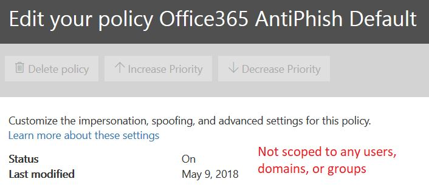

# <a name="anti-spoofing-protection-in-office-365"></a>Office 365의 스푸핑 방지 보호 기능

이 문서에서는 Office 365가 위조된 보낸 사람 도메인, 즉 스푸핑된 도메인을 사용하는 피싱 공격을 줄이는 방법에 대해 설명합니다. 메시지를 분석하고 표준 전자 메일 인증 방법이나 다른 보낸 사람 신뢰도 기술을 이용해서는 인증될 수 없는 메시지를 차단하여 이 작업을 수행합니다. 이 변경 사항은 Office 365의 조직이 피싱 공격에 노출된 수를 줄이기 위해 구현되었습니다.
  
또한 이 문서는 이러한 변경 사항이 발생한 이유, 고객이 변경에 대비할 수 있는 방법, 손상된 메시지를 보는 방법, 메시지에 대해 보고하는 방법, 잘못된 탐지를 완화하는 방법 및 Microsoft에 보내는  사람이 이 변경 사항에 대비할 수 있는 방법에 대해서도 설명합니다.
  
초기에 Microsoft의 스푸핑 방지 기술은 Office 365 Enterprise E5 구독이 있거나 해당 구독에 대한 Office 365 ATP(Advanced Threat Protection) 추가 기능을 구입 한 조직에 배포되었습니다. 2018 년 10월을 기준으로 Microsoft는 Exchange Online Protection(EOP)을 지닌 조직으로 보호를 확대했습니다. 또한 모든 필터가 서로에게서 배우는 방식 때문에 Outlook.com 사용자에게도 영향을 줄 수 있습니다.
  
## <a name="how-spoofing-is-used-in-phishing-attacks"></a>피싱 공격에서 스푸핑 사용 방법

사용자 보호와 관련해 Microsoft는 피싱 위협을 심각한 위험으로 간주합니다. 스팸 발송자와 피싱 사용자가 일반적으로 사용하는 기술 중 하나는 발신자가 위조 된 스푸핑이며 실제 발신자가 아닌 다른 사람이 메시지를 보낸 것처럼 보입니다. 이 기법은 사용자 자격 증명을 얻기 위해 고안된 피싱 캠페인에서 주로 사용됩니다. Microsoft의 스푸핑 방지 기술은 특히 Outlook과 같은 전자 메일 클라이언트에 나타나는 '보는 사람: 머리글'의 위조 여부를 검사합니다. Microsoft가 보낸 사람: 머리글이 스푸핑되었을 확률이 높다고 확신하는 경우, 이 메시지를 스푸핑으로 식별합니다.
  
스푸핑 메시지는 실제 사용자에게 두 가지 부정적인 영향을 미칩니다.
  
### <a name="1-spoofed-messages-deceive-users"></a>1. 위조 메시지의 사용자 기만
  
첫째, 스푸핑된 메시지는 사용자가 링크를 클릭하고 자격 증명을 포기하거나 맬웨어를 다운로드하거나 민감한 콘텐츠가 있는 메시지에 회신하도록 할 수 있습니다(후자는 비즈니스 전자 메일 손상이라고 함). 예를 들어 다음은 스푸핑된 발신자가 포함된 msoutlook94@service.outlook.com이라는 피싱 메일입니다.
  

  
위의 메일은 실제로 service.outlook.com에서 발송되지 않았지만 마치 그런 것처럼 보이도록 phisher에 의해 스푸핑되었습니다. 이 메일은 사용자가 메시지 안의 링크를 클릭하도록 유도합니다.
  
다음 예시는 contoso.com을 스푸핑합니다.
  

  
이 메시지는 적법한 것처럼 보이지만 실제로는 스푸핑입니다. 이 피싱 메시지는 피싱의 하위 범주인 비즈니스 전자 메일 손상의 한 종류입니다.

### <a name="2-users-confuse-real-messages-for-fake-ones"></a>2. 사용자가 실제 메시지를 가짜 메시지로 오인
  
둘째, 스푸핑된 메시지는 피싱 메시지에 대해 알고 있지만 실제 메시지와 스푸핑된 메시지의 차이를 알 수 없는 사용자에게 불확실성을 유발합니다. 예를 들어, 다음은 Microsoft 보안 계정 전자 메일 주소에서 발송된 실제 암호 재설정의 예입니다.
  

  
위의 메시지는 Microsoft에서 발송되었지만 사용자는 링크를 클릭해 자격 증명을 포기하거나 맬웨어를 다운로드하게 하고 또는 중요한 콘텐츠가 포함된 메시지에 회신하도록 만드는 피싱 메시지를 받는 데 익숙합니다.  실제 암호 재설정과 가짜 암호 변경의 차이점을 알기 어렵기 때문에 많은 사용자가 이러한 메시지를 무시하거나 스팸으로 신고하고 또는 불필요하게 Microsoft에 이를 누락된 피싱(Phishing) 메시지로 다시 보고합니다.

스푸핑을 중단하기 위해 이메일 필터링 업계에서는 [SPF](https://docs.microsoft.com/office365/SecurityCompliance/set-up-spf-in-office-365-to-help-prevent-spoofing), [DKIM](https://docs.microsoft.com/office365/SecurityCompliance/use-dkim-to-validate-outbound-email) 및 [DMARC](https://docs.microsoft.com/office365/SecurityCompliance/use-dmarc-to-validate-email)와 같은 전자 메일 인증 프로토콜을 개발했습니다. DMARC는 SPF를 통과한 도메인 또는 DKIM를 통해 사용자가 전자 메일 클라이언트에서 볼 수 있는 메시지 보낸 사람(위의 예에서는 service.outlook.com, outlook.com 및 accountprotection.microsoft.com)을 검사해 스푸핑을 방지합니다. 즉, 사용자가 보는 도메인은 인증되었으므로 스푸핑되지 않습니다. 더 자세한 내용은 이 문서의 "*전자 메일 인증만으로 스푸핑을 막을 수 없는 이유 이해하기"* 섹션을 참조하십시오.
  
그러나 문제는 전자 메일 인증 레코드가 선택 사항이며 의무가 아니라는 것입니다. 따라서 microsoft.com 및 skype.com과 같은 강력한 인증 정책을 사용하는 도메인은 스푸핑으로부터 보호되지만, 인증 정책을 약하게 게시하거나 전혀 정책을 게시하지 않는 도메인은 스푸핑의 대상이 됩니다. 2018년 3월 현재 Fortune지 500대 기업 의 도메인 중 9%만이 강력한 전자 메일 인증 정책을 발표했습니다. 나머지 91%는 피셔가 스푸핑을 할 수 있으며 전자 메일 필터가 다른 정책을 사용하여 이를 탐지하지 않는 한 최종 사용자에게 전달되어 사용자를 속일 수 있습니다.
  

  
Fortune 500 대 기업에 속하지 않은 중소 규모 기업의 전자 메일 인증 정책 강화 비율은 낮고, 이 비율은 북미 및 서유럽 이외의 지역에서는 더 낮습니다.
  
이는 기업이 전자 메일 인증의 작동 방식을 알지 못하는 반면 피싱 사기업은 이를 이해하고 그 한계를 활용하기 때문에 큰 문제입니다.
  
SPF, DKIM, DMARC 설치에 대한 내용은 이 문서 뒷편의 "*Office 365 고객"* 섹션을 참조하십시오. 
  
## <a name="stopping-spoofing-with-implicit-email-authentication"></a>암시적 전자 메일 인증 스푸핑 중지

피싱 및 스피어 피싱은 큰 문제이고 강력한 전자 메일 인증 정책은 제한적으로 채택되어 있으므로 Microsoft는 고객 보호 기능에 투자를 계속하고 있습니다. 따라서 Microsoft는 *암시적인 전자 메일 인증*으로 앞서나가고 있습니다. 도메인이 인증하지 않으면 Microsoft는 전자 메일 인증 레코드를 게시 한 것처럼 처리하고 통과하지 못하면 그에 맞게 처리합니다. 
  
이를 위해 Microsoft는 보낸 사람 신뢰도, 보낸 사람/받는 사람 기록, 동작 분석 및 기타 고급 기술을 비롯한 일반 전자 메일 인증에 대한 다양한 확장 기능을 구축했습니다. 전자 메일 인증을 게시하지 않는 도메인에서 보낸 메시지는 합법적임을 나타내는 다른 신호가 포함되어 있지 않으면 스푸핑으로 표시됩니다.
  
이를 통해 최종 사용자는 보낸 전자 메일이 스푸핑되지 않았다고 확신할 수 있고 보낸 사람은 아무도 자신의 도메인을 가장하지 못한다는 확신을 가질 수 있으며 Office 365 고객은 가장 보호와 같은 더 우수한 보호 기능을 제공할 수 있습니다.
  
Microsoft의 일반 공지 사항을 확인ㅎ려면 [피싱의 세계 2장 - Office 365의 향상된 스푸핑 방지](https://techcommunity.microsoft.com/t5/Security-Privacy-and-Compliance/Schooling-A-Sea-of-Phish-Part-2-Enhanced-Anti-spoofing/ba-p/176209)를 참조하십시오.
  
## <a name="identifying-that-a-message-is-classified-as-spoofed"></a>메시지가 스푸핑로 분류되는지 식별

### <a name="composite-authentication"></a>복합 인증

SPF, DKIM 및 DMARC는 모두 유용하지만 메시지에 명시적인 인증 레코드가 없는 경우 충분한 인증 상태를 전달하지 못합니다. 따라서 Microsoft는 여러 신호를 복합 인증이라는 단일 값 또는 간략히 compauth로 결합한 알고리즘을 개발했습니다. Office 365의 고객은 메시지 머리글의 *Authentication-Results* 머리글에 스탬프된 compauth 값을 확인할 수 있습니다. 
  
```
Authentication-Results:
  compauth=<fail|pass|softpass|none> reason=<yyy>

```

|**CompAuth 결과**|**설명**|
|:-----|:-----|
|실패|메시지가 명시적 인증(DNS에 명시적으로 도메인 게시 레코드 전송) 또는 암시적 인증(도메인 전송이 DNS에 레코드를 게시하지 않아 Office 365에서 레코드를 게시한 것처럼 결과를 삽입)에 실패했습니다.|
|통과|메시지가 명시적 인증 (DMARC 또는 [최상의 추측 통과 DMARC ](https://blogs.msdn.microsoft.com/tzink/2015/05/06/what-is-dmarc-bestguesspass-in-office-365)) 또는 높은 신뢰성을 가진 암시적 인증(도메인은 전자 메일 인증 레코드를 게시하지 않지만 Office 365는 메시지가 적법할 가능성이 높음을 나타내는 강력한 백엔드 신호를 가짐)을 통과했습니다.|
|softpass|메시지는 낮은 - 중간 신뢰도를 가진 암시적 인증(보내는 도메인은 전자 메일 인증을 게시하지 않지만 Office 365는 메시지가 합법적이지만 신호의 강도가 약함을 나타내는 백엔드 신호를 가짐)을 통과했습니다.|
|없음|메시지가 인증되지 않았지만(인증되었지만 정렬되지 않음), 발신자 신뢰도 또는 기타 요인으로 인해 복합 인증이 적용되지 않았습니다.|
   
|||
|:-----|:-----|
|**이유**|**설명**|
|0xx|메시지가 복합 인증에 실패했습니다.<br/>**000**이면 메시지 거부 또는 격리과 함께 메시지가DMARC에 실패합니다.  <br/>**001**이면 메시지가 암시적 전자 메일 인증에 실패합니다. 이는 보내는 도메인에 전자 메일 인증 레코드가 게시되지 않았거나 인증 레코드가 경우에는 실패 정책이 약함(SPF soft fail 또는 중립, p=none인 DMARC 정책)을 의미합니다.  <br/>**002**은 보낸 사람/도메인 쌍에 대해 스푸핑된 전자 메일을 보내는 것을 명시적으로 금지하는 정책을 가지고 있음을 의미합니다. 이 설정은 관리자가 수동으로 설정합니다.  <br/>**010**은 메시지가 거부 또는 격리 작업과 함께 DMARC에서 실패했음을 의미하며 전송 도메인은 조직에서 허용하는 도메인 중 하나입니다(이는 자체 대 자체 또는 내부 조직, 스푸핑의 일부).  <br/>**011**은 메시지가 암시적 전자 메일 인증에 실패했음을 의미하며 전송 도메인은 조직에서 허용하는 도메인 중 하나입니다(이는 자체 대 자체 또는 내부 조직, 스푸핑의 일부).|
|기타 모든 코드(1xx, 2xx, 3xx, 4xx, 5xx)|메시지가 암시적 인증을 통과한 이유나 인증이 없지만 조치가 적용되지 않은 이유에 대한 다양한 내부 코드에 해당합니다.|
   
메시지의 머리글을 보고 관리자 또는 최종 사용자는 Office 365가 어떻게 보낸 사람이 스푸핑되었을 가능성이 있다는 결론을 내렸는지 확인할 수 있습니다.
  
### <a name="differentiating-between-different-types-of-spoofing"></a>다양한 유형의 스푸핑 구분

Microsoft는 두 가지 유형의 스푸핑 메시지를 구분합니다.
  
 **조직 내 스푸핑**
  
자체 스푸핑이라고도 하며 보낸 사람: 주소의 도메인이받는 사람 도메인과 동일하거나 일치할 때(수신자 도메인이 조직의 [수락 도메인](https://technet.microsoft.com/ko-KR/library/jj945194%28v=exchg.150%29.aspx) 중 하나인 경우) 또는 보낸 사람: 주소의 도메인이 동일한 조직의 일부인 경우에 발생합니다.
  
예를 들어, 다음은 동일한 도메인(contoso.com)의 보낸 사람과 받는 사람입니다. 이 페이지에서 스팸봇 수확을 방지하기 위해 전자 메일 주소에 공백이 삽입됩니다.
  
발신자: 보낸 사람@contoso.com 
  
수신자: 받는 사람@contoso.com
  
다음에는 보낸 사람 도메인과 받는 사람 도메인이 조직 도메인(fabrikam.com)과 정렬되어 있습니다.
  
발신자: 보낸 사람@ foo.fabrikam.com
  
수신자: 받는 사람@ bar.fabrikam.com
  
다음의 보낸 사람 도메인과 받는 사람 도메인은 다릅니다(microsoft.com 및 bing.com). 하지만 이들은 동일한 조직에 속합니다(즉, 둘 다 조직의 수락 도메인의 일부).
  
발신자: 보낸 사람@microsoft.com
  
수신자: 받는 사람@bing.com
  
조직 내 스푸핑에 실패한 메시지에는 머리글에 다음 값이 포함됩니다.
  
X-Forefront-Antispam-Report: ...CAT:SPM/HSPM/PHSH;...SFTY:9.11
  
CAT은 메시지의 범주이며 일반적으로 SPM(스팸)으로 스탬프 처리되지만 때에 따라 메시지에서 패턴 유형이 어떻게 다르게 나타나는지에 따라 HSPM(높은 신뢰성을 가진 스팸) 또는 PHISH(피싱)일 수 있습니다.
  
SFTY는 메시지의 안전 수준이며 첫 번째 숫자 (9)는 메시지가 피싱을 의미하고 점 (11) 뒤에 오는 두 번째 숫자 집합은 조직 내 스푸핑을 의미합니다.
  
조직 내 스푸핑에 대한 복합 인증의 구체적인 이유 코드는 없으며 향후 2018년 내에 스탬프 처리될 예정입니다(일정 미정).
  
 **도메인 간 스푸핑**
  
이 문제는 보낸 사람: 주소의 보내는 도메인이 받는 조직의 외부 도메인인 경우에 발생합니다. 도메인 간 스푸핑으로 인해 복합 인증에 실패하는 메시지에는 머리글에 다음과 같은 값이 포함됩니다.
  
Authentication-Results: … compauth=fail reason=000/001
  
X-Forefront-Antispam-Report: ...CAT:SPOOF;...SFTY:9.22
  
두 경우 모두 다음의 빨간색 안전 팁이 메시지에 스탬프 처리되거나 받는 사람 사서함의 언어에 맞게 사용자 지정되어 있습니다.
  

  
보낸 사람: 주소를 봐야만 받는 사람 전자 메일이 무엇인지 파악하거나 전자 메일 머리말을 검사해야만 조직 내 및 도메인 간 스푸핑을 구분할 수 있습니다.
  
## <a name="how-customers-of-office-365-can-prepare-themselves-for-the-new-anti-spoofing-protection"></a>Office 365의 고객이 새로운 스푸핑 방지 기능에 대비할 수 있는 방법

### <a name="information-for-administrators"></a>관리자에 대한 정보

Office 365의 조직 관리자는 여러 가지 중요한 정보를 알고 있어야 합니다.
  
### <a name="understanding-why-email-authentication-is-not-always-enough-to-stop-spoofing"></a>전자 메일 인증만으로 스푸핑을 막지 못하는 이유를 이해해야 합니다.

새로운 스푸핑 방지 보호 기능은 전자 메일 인증(SPF, DKIM 및 DMARC)을 사용하여 메시지를 스푸핑으로 표시하지 않습니다. 일반적인 예는 보내는 도메인이 SPF 레코드를 게시한 적이 없는 경우입니다. SPF 레코드가 없거나 잘못 설정된 경우 보낸 메시지는 메시지가 합법적이라고 표시하는 백엔드 인텔리전스가 없는 한 스푸핑된 것으로 표시됩니다.
  
예를 들어 스푸핑 방지가 설치되기 이전의 메시지는 SPF 레코드, DKIM 레코드 및 DMARC 레코드 없이 다음과 같이 보일 수 있습니다. 
  
```
Authentication-Results: spf=none (sender IP is 1.2.3.4)
  smtp.mailfrom=example.com; contoso.com; dkim=none
  (message not signed) header.d=none; contoso.com; dmarc=none
  action=none header.from=example.com;
From: sender @ example.com
To: receiver @ contoso.com
```
스푸핑 방지 후 Office 365 Enterprise E5, EOP 또는 ATP를 사용하는 경우 compauth 값이 스탬핑 처리됩니다.
  
```
Authentication-Results: spf=none (sender IP is 1.2.3.4)
  smtp.mailfrom=example.com; contoso.com; dkim=none
  (message not signed) header.d=none; contoso.com; dmarc=none
  action=none header.from=example.com; compauth=fail reason=001
From: sender @ example.com
To: receiver @ contoso.com

```

example.com이 SPF 레코드는 설정하고 DKIM 레코드를 설정하지 않은 채 이 문제를 해결한 경우, SPF를 통과한 도메인이 보낸 사람 : 주소의 도메인과 일치하기 때문에 복합 인증이 통과됩니다. 
  
```
Authentication-Results: spf=pass (sender IP is 1.2.3.4)
  smtp.mailfrom=example.com; contoso.com; dkim=none
  (message not signed) header.d=none; contoso.com; dmarc=bestguesspass
  action=none header.from=example.com; compauth=pass reason=109
From: sender @ example.com
To: receiver @ contoso.com
```

또는 SPF 레코드가 아닌 DKIM 레코드를 설정하는 경우 전달된 DKIM-서명의 도메인이 보낸 사람: 주소의 도메인과 일치하기 때문에 복합 인증을 통과합니다. 
  
```
Authentication-Results: spf=none (sender IP is 1.2.3.4)
  smtp.mailfrom=example.com; contoso.com; dkim=pass
  (signature was verified) header.d=outbound.example.com;
  contoso.com; dmarc=bestguesspass action=none
  header.from=example.com; compauth=pass reason=109
From: sender @ example.com
To: receiver @ contoso.com
```

그러나 피셔는 SPF 및 DKIM을 설치하고 자체 도메인으로 메시지에 서명하지만 보낸 사람: 주소에서는 다른 도메인을 지정할 수 있습니다. SPF나 DKIM 모두 보낸 사람: 주소에서 도메인을 정렬할 필요가 없으므로, example.com이 DMARC 레코드를 게시하지 않으면 이는  DMARC를 사용하여 스푸핑으로 표시되지 않습니다. 
  
```
Authentication-Results: spf=pass (sender IP is 5.6.7.8)
  smtp.mailfrom=maliciousDomain.com; contoso.com; dkim=pass
  (signature was verified) header.d=maliciousDomain.com;
  contoso.com; dmarc=none action=none header.from=example.com;
From: sender @ example.com
To: receiver @ contoso.com
```

전자 메일 클라이언트 (Outlook, 웹상의 Outlook 또는 기타 전자 메일 클라이언트)에서는 SPF 또는 DKIM의 도메인이 아닌 보낸 사람: 도메인만 표시되며, 이는 메시지가 실제로는 maliciousDomain.com에서 왔지만 사용자는 메시지가 example.com에서 왔다고 착각하도록 할 수 있습니다.
  

  
따라서 Office 365에서는 보낸 사람: 주소의 도메인이 SPF 또는 DKIM 서명의 도메인과 일치해야 하며 그렇지 않은 경우 메시지가 합법적임을 나타내는 다른 내부 신호가 포함되어 있어야 합니다. 그렇지 않으면 메시지는 compauth 실패가 될 것입니다. 
  
```
Authentication-Results: spf=none (sender IP is 5.6.7.8)
  smtp.mailfrom=maliciousDomain.com; contoso.com; dkim=pass
  (signature was verified) header.d=maliciousDomain.com;
  contoso.com; dmarc=none action=none header.from=contoso.com;
  compauth=fail reason=001
From: sender@contoso.com
To: someone@example.com
```

따라서 Office 365 스푸핑 방지는 인증이 없는 도메인과 인증을 설정하지만 보낸 사람: 주소에서 사용자가 메시지의 보낸 사람이라고 보고 믿는 내용과 일치하지 않는 도메인으로부터 보호합니다. 이는 조직 외부의 도메인과 조직 내의 도메인에 모두 해당됩니다.
  
따라서 만약 메시지가 SPF와 DKIM을 통과하더라도 복합 인증에 실패하고 스푸핑된 것으로 표시된 수신했다면 이는 SPF와 DKIM을 통과한 도메인이 보낸 사람: 주소의 도메인과 정렬되지 않았기 때문입니다.
  
### <a name="understanding-changes-in-how-spoofed-emails-are-treated"></a>스푸핑된 전자 메일을 처리하는 방법의 변경 내용 이해

현재 Office 365-ATP 및 비 ATP의 모든 조직에 대해 거부 또는 격리 정책으로 DMARC에 실패한 메시지는 스팸으로 표시되고, 일반적으로 높은 신뢰도의 스팸 작업 또는 때로는 일반적인 스팸 작업을 받게 됩니다(다른 스팸 규칙이 이를 먼저 스팸을 파악하는지에 따라). 조직 내 스푸핑 탐지는 일반적인 스팸 조치를 취합니다. 이 동작은 활성화할 필요가 없으며 비활성화할 수도 없습니다.
  
그러나 도메인 간 스푸핑 메시지의 경우 이 변경 전에 정기적인 스팸, 피싱 및 맬웨어 검사를 수행하고, 필터의 다른 부분에서 의심스러운 것으로 확인되면 스팸, 피싱 또는 맬웨어로 표시합니다. 새로운 도메인 간 스푸핑 보호 기능을 사용하면 인증할 수 없는 메시지는 기본적으로 안티 피싱 \>안티 스푸핑 정책에 정의된 작업을 수행합니다. 정의되지 않은 경우 사용자 정크 메일 폴더로 이동됩니다. 경우에 따라, 더 의심스러운 메시지는 메시지에 빨간색 보안 팁이 추가됩니다.
  
이로 인해 이전에 스팸으로 표시되었던 일부 메시지가 여전히 스팸으로 표시되지만, 이제는 빨간색 보안 팁도 함께 표시됩니다. 그 외의 경우에는 이전에 스팸이 아닌 것으로 표시된 메시지에 빨간색 안전 팁이 추가된 스팸(CAT : SPOOF)으로 표시되기 시작합니다. 이 밖의 경우에는 스팸 및 피싱을 격리 저장소로 옮기는 고객이 스팸 메일 폴더로 이동하는 모습을 보게 될 것입니다(이 작업은 변경될 수 있습니다. [스푸핑 방지 설정 변경](#changing-your-anti-spoofing-settings)을 참조하십시오).
  
메시지를 스푸핑할 수 방법은 매우 다양합니다(이 문서 앞부분의 [여러 가지 유형의 스푸핑 구분](#differentiating-between-different-types-of-spoofing) 참조). 그러나 Office 365에서 이러한 메시지를 처리하는 방식은 아직 통합되지 않았습니다. 다음 표에서 새로운 작업인 도메인 간 스푸핑 보호 기능이 포함된 간략한 요약본을 확인할 수 있습니다. 
  
|**스푸핑 유형**|**범주**|**안전 팁 추가?**|**적용 대상**|
|:-----|:-----|:-----|:-----|
|DMARC 실패(격리 또는 거부)  <br/> |HSPM(기본)도 SPM 또는 PHSH일 수 있습니다.  <br/> |아니오(아직 아님)  <br/> |모든 Office 365 고객, Outlook.com  <br/> |
|자체  <br/> |SPM  <br/> |예  <br/> |모든 Office 365 조직, Outlook.com  <br/> |
|도메인 간  <br/> |스푸핑  <br/> |예  <br/> |Office 365 고급 위협 보호 기능 및 E5 고객  <br/> |

### <a name="changing-your-anti-spoofing-settings"></a>스푸핑 방지 설정 변경

(도메인 간) 스푸핑 방지 설정을 만들거나 업데이트하려면 보안 &amp; 준수 센터의 위협 관리 \> 정책 탭에서 스팸 방지 \> 스푸핑 방지 설정으로 이동하십시오. 피싱 방지 설정을 생성한 적이 없다면 다음 중 하나를 만들어야 합니다.
  

  
이전에 설정을 생성한 적이 있다면, 이를 선택하여 수정할 수 있습니다.
  

  
방금 만든 정책을 선택하고 [스푸핑 인텔리전스에 대해 자세히 알아보기](learn-about-spoof-intelligence.md)에서 설명된 단계를 따라 진행합니다.
  

  

  
PowerShell을 사용하여 새로운 정책 생성하기: 
  
```powershell
$org = Get-OrganizationConfig
$name = "My first anti-phishing policy for " + $org.Name
# Note: The name should not exclude 64 characters, including spaces.
# If it does, you will need to pick a smaller name.
# Next, create a new anti-phishing policy with the default values
New-AntiphishPolicy -Name $Name
# Select the domains to scope it to
# Multiple domains are specified in a comma-separated list
$domains = "domain1.com, domain2.com, domain3.com"
# Next, create the anti-phishing rule, scope it to the anti-phishing rule
New-AntiphishRule -Name $name -AntiphishPolicy $name -RecipientDomainIs $domains
```

그 다음 [설정-AntiphishPolicy](https://docs.microsoft.com/powershell/module/exchange/advanced-threat-protection/Set-AntiPhishPolicy?view=exchange-ps)의 설명서에 따라 PowerShell을 사용하여 피싱 방지 정책 매개 변수를 수정할 수 있습니다. $name을 매개 변수로 지정할 수 있습니다.
  
```powershell
Set-AntiphishPolicy -Identity $name <fill in rest of parameters>
```

향후 2018년에 기본 정책을 만드는 대신 조직의 모든 수신자에게 적용되는 정책이 만들어질 예정이므로 수동으로 지정하지 않아도 됩니다 (아래 스크린 샷은 최종 구현 전에 변경 될 수 있습니다).
  

  
사용자가 생성하는 정책과 달리 기본 정책을 삭제하거나 우선 순위를 수정하거나 범위를 지정할 사용자, 도메인 또는 그룹을 선택할 수 없습니다.
  

  
PowerShell을 사용하여 기본 보호 설정하기:
  
```powershell
$defaultAntiphishPolicy = Get-AntiphishPolicy | ? {$_.IsDefault -eq $true}
Set-AntiphishPolicy -Identity $defaultAntiphishPolicy.Name -EnableAntispoofEnforcement <$true|$false>
```

Office 365 앞에 다른 메일 서버가 있는 경우에만 스푸핑 방지 보호를 해제해야 합니다(자세한 내용은 스푸핑 방지를 해제하기 위한 합법적인 시나리오를 참조하십시오).
  
```powershell
$defaultAntiphishPolicy = Get-AntiphishiPolicy | ? {$_.IsDefault $true}
Set-AntiphishPolicy -Identity $defaultAntiphishPolicy.Name -EnableAntispoofEnforcement $false 

```
> [!IMPORTANT]
> 전자 메일 경로의 첫 번째 홉이 Office 365이고 합법적인 전자 메일이 너무 많이 스푸핑으로 표시된 경우에는 먼저 스푸핑된 전자 메일을 도메인에 보낼 수있는 보낸 사람을 설정해야 합니다(*"인증되지 않은 전자 메일을 보내는 합법적인 보낸 사람 관리하기"* 섹션을 참조하십시오). 여전히 너무 많은 오탐지가 발생하는 경우(즉, 스팸으로 분류된 합법적인 메시지가 너무 많은 경우), 스푸핑 방지 기능을 해제하지 않는 것이 좋습니다. 대신 높은 수준의 보호 대신 기본을 선택하는 것이 좋습니다. 조직을 스푸핑된 전자 메일에 노출시켜 장기적으로 훨씬 높은 비용을 부담하는 것보다 오탐지를 이용하는 것이 좋습니다.

### <a name="managing-legitimate-senders-who-are-sending-unauthenticated-email"></a>인증되지 않은 이메일을 보내는 합법적인 보낸 사람 관리

Office 365는 조직에 인증되지 않은 전자 메일을 보내는 사람을 추적합니다. 서비스가 보낸 사람이 합법적이지 않다고 생각하면 *compauth* 실패로 표시합니다. 메시지에 적용된 스푸핑 방지 정책에 따라 다르지만 이는 SPOOF로 분류될 것입니다.
  
그러나 관리자는 Office 365의 결정을 번복하여 스푸핑 된 전자 메일을 보낼 수 있는 보낸 사람을 지정할 수 있습니다.
  
**방법 1 - 조직에서 도메인을 소유한 경우 전자 메일 인증 **을 설정합니다.
  
이 방법은 여러 명의 테넌트를 소유하거나 이들과 상호 작용하는 경우 조직 내 스푸핑 및 도메인 간 스푸핑 문제를 해결하는 데 사용할 수 있습니다. 또한 사용자가 Office 365 내의 다른 고객과 다른 공급업체에서 호스팅되는 타사에게 보내는 도메인 간 스푸핑 문제를 해결할 수 있습니다.
  
자세한 내용은 [Office 365 고객](#customers-of-office-365)을 참조하십시오.

**방법 2 - 스푸핑 인텔리전스를 사용하여 인증되지 않은 이메일의 허용된 보낸 사람 구성**
  
또한 [스푸핑 인텔리전스](https://support.office.com/article/Learn-more-about-spoof-intelligence-978c3173-3578-4286-aaf4-8a10951978bf)를 사용하여 보낸 사람이 인증되지 않은 메시지를 조직에 전송하도록 허용할 수 있습니다. 
  
외부 도메인의 경우 스푸핑 된 사용자는 보낸 사람 주소의 도메인이고 보내는 인프라는 보내는 IP 주 (/24 CIDR 범위로 나눈 값) 또는 PTR 레코드의 조직 도메인입니다 (아래 스크린 샷에서 보내는 IP는 PTR 레코드가 outbound.mail.protection.outlook.com인 131.107.18.4일 수 있으며, 보내는 인프라의 경우 outlook.com으로 표시됩니다).
  
이 보낸 사람이 인증되지 않은 전자 메일을 보낼 수 있도록 허용하려면 **아니요**를 **예**로 변경하십시오.
  

  
PowerShell을 사용하여 특정 보낸 사람이 도메인을 스푸핑하도록 허용할 수도 있습니다.
  
```powershell
$file = "C:\My Documents\Summary Spoofed Internal Domains and Senders.csv"
```

```powershell
Get-PhishFilterPolicy -Detailed -SpoofAllowBlockList -SpoofType External | Export-CSV $file
```


  
이전 이미지에서는 이 스크린 샷을 맞추기 위해 추가 줄 바꿈이 추가되었습니다. 일반적으로 모든 값은 한 줄에 표시됩니다.
  
파일을 편집하고 outlook.com 및 bing.com에 해당하는 줄을 찾은 다음 AllowedToSpoof 항목을 아니요에서 예로 변경하십시오.
  

  
파일을 저장하고 실행합니다.
  
```powershell
$UpdateSpoofedSenders = Get-Content -Raw "C:\My Documents\Spoofed Senders.csv"
Set-PhishFilterPolicy -Identity Default -SpoofAllowBlockList $UpdateSpoofedSenders
```

이제 bing.com이 \* .outlook.com에서 인증되지 않은 이메일을 보낼 수 있습니다.

**방법 3 - 보낸 사람/받는 사람 쌍에 대한 허용 항목 만들기**
  
특정 보낸 사람에 대해 모든 스팸 필터링을 우회하도록 선택할 수도 있습니다. 자세한 내용은 [Office 365 의 허용 목록에 보낸 사람을 안전하게 추가하는 방법](https://blogs.msdn.microsoft.com/tzink/2017/11/29/how-to-securely-add-a-sender-to-an-allow-list-in-office-365/)을 참조하십시오.
  
이 방법을 사용하면 스팸 및 일부 피싱 필터링(맬웨어 필터링 제외)을 건너 뜁니다.
  
**방법 4 - 보낸 사람에게 연락하여 전자 메일 인증을 설정하도록 요청**
  
스팸 및 피싱의 문제 때문에 보낸 사람이 모두 전자 메일 인증을 설정하는 것이 좋습니다. 보내는 도메인의 관리자를 알고 있는 경우 전자 메일 인증 레코드를 설정하도록 요청하여 재정의를 추가할 필요가 없도록 하십시오. 자세한 내용은 이 문서 뒷부분의 [Office 365 고객이 아닌 도메인 관리자](#administrators-of-domains-that-are-not-office-365-customers)"를 참조하십시오. 
  
처음에는 도메인을 인증 받기가 어려울 수 있지만 시간이 지남에 따라 더 많은 이메일 필터가 정킹 또는 전자 메일 거부를 시작하면 더 나은 전달을 보장하기 위해 적절한 레코드를 설정하게 됩니다.
  
### <a name="viewing-reports-of-how-many-messages-were-marked-as-spoofed"></a>스푸핑으로 표시된 메시지 수에 대한 보고서 보기

스푸핑 방지 정책을 사용하면 위협 조사 및 응답 기능을 사용하여 피싱으로 표시된 메시지 수에 대한 정보를 얻을 수 있습니다. 이렇게 하려면 위협 관리 \> 탐색기 아래의 보안 &amp; 준수 센터(SCC)로 가서 피싱으로보기를 설정하고 보낸 사람 도메인 또는 보호 상태별로 그룹화합니다.
  

  
다양한 보고서와 상호 작용하여 스푸핑으로 표시된 메시지 등 피싱으로 표시된 수를 확인할 수 있습니다. 자세한 내용은 [Office 365 위협 조사 및 응답 시작하기](get-started-with-ti.md)를 참조하십시오.
  
다른 유형의 피싱(일반 피싱, 도메인 또는 사용자 가장 등)과 달리 스푸핑으로 인해 표시된 메시지를 아직 분리할 수 없습니다. 그러나 나중에 보안 &amp; 준수 센터를 통해 이 작업을 수행할 수 있습니다. 일단 이 보고서를 사용하면 실패한 인증으로 인해 스푸핑으로 표시되는 합법적인 보내는 도메인을 식별할 수 있습니다.
  
다음 스크린 샷은 이 데이터의 형태에 대한 제안이지만 릴리스될 때에는 변경될 수 있습니다.
  

  
비 ATP 및 E5 고객의 경우, 이 보고서는 나중에 Threat Protection Status(TPS) 보고서에서 볼 수 있지만 최소 24시간이 지연됩니다. 이 페이지는 보안 &amp; 준수 센터에 통합되어 업데이트됩니다.
  
### <a name="predicting-how-many-messages-will-be-marked-as-spoof"></a>얼마나 많은 메시지가 스푸핑으로 표시될지 예측

Office 365에서 스푸핑 방지 적용을 해제하거나 기본 또는 높음 적용으로 설정을 업데이트하면 다양한 설정에서 메시지 처리 방식이 어떻게 변경되는지 확인할 수 있습니다. 즉, 스푸핑 방지가 해제되어 있을 경우 기본으로 전환하면 스푸핑으로 탐지될 메시지 수를 확인할 수 있습니다. 기본 설정인 경우 이를 높음으로 바꾸면 얼마나 많은 메시지가 스푸핑으로 탐지될지 확인할 수 있습니다.
  
이 기능은 현재 개발 중입니다. 자세한 내용이 정의되면 이 페이지는 보안 및 규정 준수 센터의 스크린 샷과 PowerShell 예제로 업데이트됩니다.
  

  

  
### <a name="understanding-how-spam-phishing-and-advanced-phishing-detections-are-combined"></a>스팸, 피싱 및 고급 피싱 탐지가 결합되는 방법 이해

ATP의 유무에 관계없이 Exchange Online을 사용하는 조직에서는 메시지가 맬웨어, 스팸, 높은 신뢰성의 스팸, 피싱 및 대량으로 분류 될 때 수행할 작업을 지정할 수 있습니다. ATP 고객을 위한 ATP 피싱 방지 정책 및 EOP 고객을위한 피싱 방지 정책, 메시지가 여러 가지 탐지 유형(예: 맬웨어, 피싱 및 사용자 위장)에 부딪 힐 수 있다는 점을 감안할 때, 어떤 정책이 적용되는지에 대해 혼동이 있을 수 있습니다.
  
일반적으로 메시지에 적용되는 정책은 CAT(범주) 속성의 X-Forefront-Antispam-Report 머리글에서 식별됩니다.
  
|**우선 순위**|**정책**|**범주**|**어디서 관리되나요?**|**적용 대상**|
|:-----|:-----|:-----|:-----|:-----|
|1  <br/> |맬웨어  <br/> |MALW  <br/> |[맬웨어 정책](configure-anti-malware-policies.md) <br/> |모든 조직  <br/> |
|2  <br/> |피싱  <br/> |PHSH  <br/> |[스팸 필터 정책 구성](configure-your-spam-filter-policies.md) <br/> |모든 조직  <br/> |
|3  <br/> |높은 정확도 스팸  <br/> |HSPM  <br/> |[스팸 필터 정책 구성](configure-your-spam-filter-policies.md) <br/> |모든 조직  <br/> |
|4  <br/> |스푸핑  <br/> |스푸핑  <br/> |[피싱 방지 정책](https://go.microsoft.com/fwlink/?linkid=864553), [스푸핑 인텔리전스](learn-about-spoof-intelligence.md) <br/> |모든 조직  <br/> |
|5  <br/> |스팸  <br/> |SPM  <br/> |[스팸 필터 정책 구성](configure-your-spam-filter-policies.md) <br/> |모든 조직  <br/> |
|6  <br/> |대량  <br/> |대량  <br/> |[스팸 필터 정책 구성](configure-your-spam-filter-policies.md) <br/> |모든 조직  <br/> |
|7  <br/> |도메인 가장  <br/> |DIMP  <br/> |[Office 365 ATP 피싱 방지 및 피싱 방지 정책 설정](set-up-anti-phishing-policies.md) <br/> |ATP가 있는 조직만  <br/> |
|8  <br/> |사용자 가장  <br/> |UIMP  <br/> |[Office 365 ATP 피싱 방지 및 피싱 방지 정책 설정](set-up-anti-phishing-policies.md) <br/> |ATP가 있는 조직만 <br/> |

여러 개의 서로 다른 피싱 방지 정책이 있는 경우 우선 순위가 가장 높은 정책이 적용됩니다. 예를 들어, 두 개의 정책이 있다고 가정합니다.

|**정책**|**우선 순위**|**사용자/도메인 가장**|**스푸핑 방지**|
|:-----|:-----|:-----|:-----|
|A  <br/> |1  <br/> |켜짐  <br/> |해제  <br/> |
|B  <br/> |2  <br/> |해제  <br/> |켜짐  <br/> |

메시지가 들어와서 스푸핑 및 사용자 가장으로 식별되고 동일한 사용자 집합이 정책 A 및 정책 B로 범위가 지정되면 메시지는 스푸핑으로 취급되지만 스푸핑 방지가 해제되어 있으므로 아무런 조치도 적용되지 않습니다 S스푸핑은 사용자 가장 (8)보다 높은 우선 순위 (4)에서 실행됩니다.
  
다른 유형의 피싱 정책을 적용하려면 다양한 정책을 적용할 사용자의 설정을 조정해야 합니다.
  
### <a name="legitimate-scenarios-to-disable-anti-spoofing"></a>스푸핑 방지를 사용하지 않도록 설정하는 합법적인 시나리오

스푸핑 방지는 피싱 공격으로부터 고객을 더욱 효과적으로 보호하므로 스푸핑 방지 기능을 해제하지 않는 것이 매우 좋습니다. 이를 사용 중지하면 일부 단기간 오 판정을 해결할 수 있지만 장기적으로 더 많은 위험에 노출됩니다. 발신자 측에서 인증을 설정하거나 피싱 정책을 조정하는 데 드는 비용은 일반적으로 일회성 이벤트이거나 최소한의 주기적인 유지 관리 만 필요합니다. 그러나 데이터가 노출되거나 자산이 손상된 피싱 공격으로부터 복구하는 비용은 훨씬 높습니다.
  
이러한 이유로 스푸핑 방지를 비활성화하는 것보다 스푸핑 방지 오작동을 통해 작업하는 것이 좋습니다.
  
그러나 메시지 스레딩에 추가 메일 필터링 제품이 있고 Office 365가 전자 메일 경로의 첫 번째 홉이 아닌 경우 스푸핑 방지를 해제해야 하는 적법한 시나리오가 있습니다.
  

  
다른 서버는 Exchange 온 프레미스 메일 서버, Ironport와 같은 메일 필터링 장치 또는 다른 클라우드 호스팅 서비스일 수 있습니다.
  
받는 사람 도메인의 MX 레코드가 Office 365를 가리키지 않으면 Office 365가 수신도메인의 MX 레코드를 조회하고 다른 서비스를 가리키는 경우 안티 스푸핑을 억제하므로 이를 해제할 필요가 없습니다. 앞쪽에서 도메인에 다른 서버가 있는지 여부를 모르는 경우 MX 도구 상자와 같은 웹 사이트를 사용하여 MX 레코드를 찾을 수 있습니다. 그것은 다음과 같이 말할 수 있습니다.
  

  
이 도메인에는 Office 365를 가리키지 않는 MX 레코드가 있으므로 Office 365는 스푸핑 방지 실행을 적용하지 않습니다.
  
그러나 받는 사람 도메인 *의 MX 레코드가 Office 365를 가리키는 경우 *, Office 365 앞에 다른 서비스가 있더라도 스푸핑 방지를 해제해야합니다. 가장 일반적인 예는 받는 사람 다시 쓰기를 사용하는 것입니다. 
  

  
도메인 contoso.com의 MX 레코드는 온 프레미스 서버를 가리키며 도메인 @office365.contoso.net의 MX 레코드는 \* .protection.outlook.com 또는  MX 레코드의 \* .eo.outlook.com를 포함하므로 Office 365를 가리킵니다.
  

  
받는 사람 도메인의 MX 레코드가 Office 365를 가리키지 않는 경우와 받는 사람 다시 쓰기를 거친 경우를 구별해야 합니다. 이 두 경우의 차이점을 밝히는 것이 중요합니다.
  
보낸 도메인에서 보낸 사람이 다시 작성되었는지 여부를 잘 모르는 경우 메시지 머리글을 보고 확인할 수 있습니다.
  
a) 먼저, 인증 결과 머리글에서 받는 사람 도메인에 대한 메시지의 머리글을 확인합니다.
  
```
Authentication-Results: spf=fail (sender IP is 1.2.3.4)
  smtp.mailfrom=example.com; office365.contoso.net; dkim=fail
  (body hash did not verify) header.d=simple.example.com;
  office365.contoso.net; dmarc=none action=none
  header.from=example.com; compauth=fail reason=001
```

받는 사람 도메인은 위의 굵은 빨간색 텍스트(이 경우 Office 365.contoso.net)에 있습니다. 이는 받는 사람: 머리글:에 있는 받는 사람과 다를 수 있습니다.
  
받는 사람: 받는 사람 \< recipient@contoso.com\>
  
실제 받는 사람 도메인의 MX 레코드 조회를 수행합니다. \*.protection.outlook.com, mail.messaging.microsoft.com, \*.eo.outlook.com 또는 mail.global.frontbridge.com이 포함되어 있으면 MX가 Office 365를 가리키는 것을 의미합니다.
  
이러한 값이 포함되어 있지 않으면 MX가 Office 365를 가리키지 않는다는 의미입니다. 이를 확인하는 데 사용할 수있는 도구는 MX 도구 상자입니다.
  
이 특정 예제에서 다음은 받는 사람: 머리글이었기 때문에 받는 사람과 비슷한 도메인인 contoso.com이 온 프레미어 서버를 가리키는 MX 레코드 포인트를 가지고 있음을 나타냅니다.
  

  
그러나 실제로 받는 사람은 office365.contoso.net이며 MX 레코드는 Office 365를 가리킵니다.
  

  
따라서 이 메시지는 받는 사람이 다시 썼을 것으로 추정됩니다.
  
b) 둘째, 받는 사람 재작성의 일반적인 사용 사례를 구분해야 합니다. 받는 사람 도메인을 \*.onmicrosoft.com으로 다시 작성하려면 대신 이를 \*.mail.onmicrosoft.com으로 다시 작성하십시오.
  
다른 서버 뒤에 라우팅되는 최종 수신자 도메인을 식별하고 받는 사람 도메인의 MX 레코드가 실제로 Office 365를 가리키는 경우(DNS 레코드에 게시된 것처럼) 스푸핑 방지를 해제할 수 있습니다.
  
라우팅 경로에서 도메인의 첫 번째 홉이 Office 365인 경우 하나 이상의 서비스 뒤에있을 때에만 스푸핑 방지를 해제하지 않아야 함을 기억하십시오.
  
### <a name="how-to-disable-anti-spoofing"></a>스푸핑 방지 해제 방법

피싱 방지 정책을 이미 만들었으면 EnableAntispoofEnforcement 매개 변수를 $false로 설정하십시오.
  
```
$name = "<name of policy>"
Set-AntiphishPolicy -Identity $name -EnableAntiSpoofEnforcement $false

```

사용하지 않을 정책의 이름을 모르는 경우 다음과 같이 표시할 수 있습니다.
  
```
Get-AntiphishPolicy | fl Name
```

기존의 피싱 방지 정책이 없는 경우 하나의 정책을 만들고 사용 해제할 수 있습니다(정책이 없어도 스푸핑 방지가 적용됨, 사용자를 위해 향후 2018년에 기본 정책이 생성될 예정이며 사용자는 기본 정책을 생성하는 대신 비활성화할 수 있음). 여러 단계에서 이 작업을 수행해야 합니다.
  
```
$org = Get-OrganizationConfig
$name = "My first anti-phishing policy for " + $org.Name
# Note: If the name is more than 64 characters, you will need to choose a smaller one
```

```
# Next, create a new anti-phishing policy with the default values
New-AntiphishPolicy -Name $Name
# Select the domains to scope it to
# Multiple domains are specified in a comma-separated list
$domains = "domain1.com, domain2.com, domain3.com"
# Next, create the anti-phishing rule, scope it to the anti-phishing rule
New-AntiphishRule -Name $name -AntiphishPolicy -RecipientDomainIs $domains
# Finally, scope the anti-phishing policy to the domains
Set-AntiphishPolicy -Identity $name -EnableAntispoofEnforcement $false

```

스푸핑 방지를 사용하지 않도록 설정하는 것은 cmdlet을 통해서만 가능합니다(나중에 보안 &amp; 준수 센터에서 사용할 수 있습니다). PowerShell에 액세스 할 수 없는 경우 지원 티켓을 만드십시오.
  
Office 365로 보낼 때 간접 라우팅을 수행하는 도메인에만 이 규칙을 적용해야 합니다. 오탐지로 인해 스푸핑 방지를 해지 않도록 유의하십시오. 장기적으로는 이를 통해 작업하는 것이 더 낫습니다.
  
### <a name="information-for-individual-users"></a>개별 사용자를 위한 정보

개별 사용자가 안티 스푸핑 안전 팁과 상호 작용하는 방법이 제한되어 있습니다. 그러나 일반적인 시나리오를 해결하기 위해 수행할 수 있는 작업이 몇 가지 있습니다.
  
### <a name="common-scenario-1---mailbox-forwarding"></a>일반적인 시나리오 #1-사서함 전달

다른 전자 메일 서비스를 사용하여 전자 메일을 Office 365 또는 Outlook.com으로 전달하는 경우 전자 메일이 스푸핑으로 표시되고 빨간색 안전 팁이 표시될 수 있습니다. 전달자가 Outlook.com, Office 365, Gmail 또는 [ARC 프로토콜](https://arc-spec.org)을 사용하는 다른 서비스 중 하나일 때 Office 365 및 Outlook.com는 자동으로 이 문제를 해결할 계획입니다. 그러나 해당 수정 사항이 배포될 때까지 사용자는 전달 옵션을 사용하지 않고 연결된 계정 기능을 사용하여 메시지를 직접 가져와야 합니다.
  
Office 365에서 연결된 계정을 설정하려면 Office 365 웹 인터페이스 \> 메일 \> 메일 \> 계정 \> 연결된 계정의 오른쪽 위 모서리에 있는 기어 아이콘을 선택하십시오.
  

  
Outlook.com에서 프로세스는 기어 아이콘 \> 옵션 \> 메일 \> 계정 \> 연결된 계정입니다.
  
### <a name="common-scenario-2---discussion-lists"></a>일반적인 시나리오 #2 - 토론 목록

토론 목록은 메시지를 전달하고 내용을 수정하는 방식으로 인해 스푸핑 방지에 문제가 있는 것으로 알려져 있지만 당초 보낸 사람: 주소는 그대로 유지합니다.
  
예를 들어 이메일 주소가 user@contoso.com이고 Bird Watching에 관심이 있으며 토론 목록 birdwatchers@example.com에 참여한다고 가정합니다. 토론 목록에 메시지를 보내면 다음과 같이 보낼 수 있습니다.
  
**보낸 사람:** 이진민 \<사용자@contoso.com\> 
  
**받는 사람:** Birdwatcher의 토론 목록 \<birdwatchers@example.com\> 
  
**제목:** 산 정상에서 바라보는 파란색 제비의 장관 레이니어 이번 주 
  
이번 주에 레이니어 산에서 이 광경을 확인하고 싶은  사람이 있습니까?
  
전자 메일 목록이 메시지를 받으면 메시지 서식을 지정하고 내용을 수정한 후 여러 전자 메일 받은 사람의 참가자로 구성된 토론 목록의 나머지 구성원에게 전자 메일 목록을 재생합니다.
  
**보낸 사람:** 이진민 \<사용자@contoso.com\> 
  
**받는 사람:** Birdwatcher의 토론 목록 \<birdwatchers@example.com\> 
  
**제목:** [새 구경] 산 정상에서 바라보는 파란색 제비의 장관 레이니어 이번 주 
  
이번 주에 레이니어 산에서 이 광경을 확인하고 싶은  사람이 있습니까?
  
---
  
Birdwatchers 토론 목록에 이 메시지가 전송되었습니다. 구독은 언제든지 취소할 수 있습니다.
  
위에서 재생된 메시지의 보낸 사람: 주소(user@contoso.com)는 같지만 제목 줄에 태그를 추가하고 메시지의 맨 아래에 바닥글을 추가하여 원래 메시지가 수정되었습니다. 이러한 유형의 메시지 수정은 메일링 목록에서 일반적이며 오탐지를 초래할 수 있습니다.
  
귀하 또는 귀하의 조직 구성원이 메일링 목록의 관리자인 경우 스푸핑 방지 검사를 통과하도록 구성할 수 있습니다.
  
- DMARC.org의 FAQ를 확인하십시오. [메일링 목록을 운영 중이며 DMARC와 상호 운용하고 싶습니다. 어떻게 해야합니까? ](https://dmarc.org/wiki/FAQ#I_operate_a_mailing_list_and_I_want_to_interoperate_with_DMARC.2C_what_should_I_do.3F)

- 이 블로그 게시물의 지침을 읽으십시오: [메일링 목록 운영자가 DMARC와 상호 작용하여 실패를 방지하는 팁](https://blogs.msdn.microsoft.com/tzink/2017/03/22/a-tip-for-mailing-list-operators-to-interoperate-with-dmarc-to-avoid-failures/)

- ARC를 지원하기 위해 메일링 목록 서버에 업데이트를 설치하는 것을 고려한다면 [https://arc-spec.org](https://arc-spec.org/)을 참조하십시오.

메일링 목록에 대한 소유권 없는 경우
  
- 위의 옵션 중 하나를 구현하도록 메일링 목록의 관리자에게 요청할 수 있습니다(메일링 목록이 중계되는 도메인에 대해 이메일 인증을 설정해야 함)

- 이메일 클라이언트에 메일 함 규칙을 만들어 메시지를받은 편지함으로 이동할 수 있습니다. 인증되지 않은 전자 메일을 보내는 합법적인 보낸 사람 관리 섹션에서 설명한 대로 조직의 관리자에게 허용 규칙을 설정하거나 재정의하도록 요청할 수도 있습니다

- Office 365에서 지원 티켓을 만들어 메일링 목록에 대한 재정의를 만들어 합법적인 것으로 처리할 수 있습니다

### <a name="other-scenarios"></a>다른 시나리오

1. 위의 일반적인 시나리오 중 어느 것도 사용자의 상황에 해당하지 않는 경우 Microsoft에 이 메시지를 오탐지로 보고하십시오. 자세한 내용은 이 문서 뒷부분의 [스팸 또는 비스팸 메일을 Microsoft에 다시 보고하는 방법](#how-can-i-report-spam-or-non-spam-messages-back-to-microsoft) 섹션을 참조하십시오. 

2. 전자 메일 관리자에게 문의하여 Microsoft 지원 티켓으로 사용할 수도 있습니다. Microsoft 엔지니어링 팀은 메시지가 스푸핑으로 표시된 이유를 조사합니다.

3. 또한 보낸 사람이 누구인지 알고 악의적으로 스푸핑되지 않은 것으로 확신하는 경우 보낸 사람에게 회신하여 인증하지 않은 메일 서버에서 메시지를 보내고 있음을 나타낼 수 있습니다. 이로 인해 원래 보낸 사람이 IT 관리자에게 연락하여 필요한 전자 메일 인증 레코드를 설정할 수 있습니다.
  
충분한 수의 보낸 사람이 도메인 소유자에게 전자 메일 인증 레코드를 설정해야한다고 회신하면 이들은 작업을 수행하게 됩니다. Microsoft는 도메인 소유자와 함께 필요한 레코드를 게시하기도 하지만 개별 사용자가 요청할 때 더 많은 도움을줍니다.

4. 필요에 따라 보낸 사람을 수신 허용 - 보낸 사람 목록에 추가하십시오. 그러나 피셔가 이 계정을 스푸핑하면 해당 계정은 사서함으로 전달된다는 점을 기억하십시오. 따라서 이 옵션은 자주 사용하서는 안 됩니다.

## <a name="how-senders-to-microsoft-should-prepare-for-anti-spoofing-protection"></a>Microsoft에 보낸 사람이 스푸핑 방지 보호에 대비하는 방법

사용자가 현재 Microsoft, Office 365 또는 Outlook.com에 메시지를 보내는 관리자인 경우 전자 메일이 올바르게 인증되었는지 확인해야 합니다. 그렇지 않으면 스팸 또는 피싱으로 표시될 수 있습니다.
  
### <a name="customers-of-office-365"></a>Office 365의 고객

Office 365 고객이고 Office 365를 사용하여 아웃 바운드 전자 메일을 보내는 경우:
  
- 도메인에 대해 [스푸핑을 방지할 수 있도록 Office 365에서 SPF 설정](set-up-spf-in-office-365-to-help-prevent-spoofing.md)

- 기본 도메인의 경우 [DKIM을 사용하여 Office 365에서 사용자 지정 도메인에서 전송한 발신 이메일을 확인](use-dkim-to-validate-outbound-email.md)

- [합법적인 발신자를 확인하기 위해 도메인에서 DMARC 레코드 설정](use-dmarc-to-validate-email.md)을 고려합니다.

Microsoft는 SPF, DKIM 및 DMARC 각각에 대한 세부 구현 지침을 제공하지 않습니다. 그러나 온라인 게시된 정보는 매우 많습니다. 조직에서 전자 메일 인증 레코드를 설정할 수 있도록 지원하는 제3자 회사도 있습니다.
  
### <a name="administrators-of-domains-that-are-not-office-365-customers"></a>Office 365 고객이 아닌 도메인 관리자

도메인 관리자이지만 Office 365 고객이 아닌 경우:
  
- 도메인의 보내는 IP 주소를 게시하려면 SPF를 설정하고, DKIM(사용 가능한 경우)도 설정하여 메시지에 디지털 서명을 해야 합니다. DMARC 레코드 설정도 고려할 수 있습니다.

- 사용자를 대신하여 전자 메일을 전송하는 대량 메일 발신자가 있는 경우 발신자 주소의 보낸 사람 도메인(자신이 속한 경우)이 SPF 또는 DMARC를 통과하는 도메인과 정렬되도록 전자 메일을 보내야 합니다.

- 온 프레미스 메일 서버가 있거나 Software-as-a-service 공급자에서 보내는 경우 또는 Microsoft Azure, GoDaddy, Rackspace, Amazon Web Services나 이와 유사한 클라우드 호스팅 서비스에서 보내는 경우, 해당 서비스가 추가되도록 해야 합니다.

- ISP에서 호스팅하는 소규모 도메인인 경우 ISP에서 제공 한 지침에 따라 SPF 레코드를 설정해야 합니다. 대부분의 ISP는 이러한 유형의 지침을 제공하며 회사의 지원 페이지에서 확인할 수 있습니다.

- 이전에 전자 메일 인증 레코드를 게시할 필요가 없었고 제대로 작동했더라도, 전자 메일 인증 레코드를 게시하여 Microsoft에 보내야 합니다. 이를 통해 사용자는 피싱 퇴치 작업에 동참하게 되며 사용자 또는 사용자가 메시지를 보내는 조직 중 어느 하나가 피싱받을 가능성을 줄입니다.

### <a name="what-if-you-dont-know-who-sends-email-as-your-domain"></a>누가 도메인으로 전자 메일을 보내는지 모르는 경우에는 어떻게 해야 합니까?

많은 도메인은 보낸 사람이 누구인지 모르기 때문에 SPF 레코드를 게시하지 않습니다. 이는 문제가 되지 않습니다. 보내는 사람을 모두 알 필요는 없습니다. 대신, 특히 회사 트래픽이있는 곳에서 알고 있는 SPF 레코드를 게시하고 중립 SPF 정책인 all을 게시하여 작업을 시작해야 합니다.
  
example.com IN TXT "v=spf1 include:spf.example.com ?all"
  
중립적인 SPF 정책은 기업 인프라에서 나오는 전자 메일이 다른 모든 전자 메일 수신자에서 이메일 인증을 통과한다는 것을 의미합니다. 귀하가 모르는 발신자가 보낸 이메일은 중립으로 돌아가며 SPF 레코드를 전혀 게시하지 않은 것과 유사합니다.
  
Office 365로 전송할 때 회사 트래픽에서 오는 전자 메일은 인증된 것으로 표시되지만 출처를 알 수 없는 전자 메일은 (Office 365에서 암시 적으로 인증할 수 있는지 여부에 따라) 여전히 스푸핑으로 표시될 수 있습니다. 그러나 이는 모든 전자 메일이 스푸핑으로 표시되던 문제를 Office 365이 개선한 사항에 해당합니다.
  
대체 정책 ?all을 통해 SPF 레코드를 시작한 후에 점차적으로 인프라를 더 많이 포함시킨 다음 더 엄격한 정책을 게시할 수 있습니다. 
  
### <a name="what-if-you-are-the-owner-of-a-mailing-list"></a>메일링 목록의 소유자라면 어떻게 될까요?

[공통 시나리오 # 2 - 토론 목록](#common-scenario-2---discussion-lists) 섹션을 참조하십시오.
  
### <a name="what-if-you-are-an-infrastructure-provider-such-as-an-internet-service-provider-isp-email-service-provider-esp-or-cloud-hosting-service"></a>인터넷 서비스 공급자(ISP), 이메일 서비스 공급자(ESP) 또는 클라우드 호스팅 서비스와 같은 인프라 공급자의 경우에는 어떻게 해야 합니까?

도메인 전자 메일을 호스팅하고 전자 메일을 보내거나 전자 메일을 보낼 수있는 호스팅 인프라를 제공하는 경우 다음을 수행해야 합니다.
  
- 고객이 SPF 레코드에 게시 할 내용을 자세히 설명하는 문서를 보유하고 있는지 확인하십시오.

- 고객이 명시적으로 설정하지 않은 경우에도 아웃 바운드 전자 메일에서 DKIM 서명에 서명하는 것을 고려해보십시오(기본 도메인으로 서명). DKIM 서명을 사용하여 이메일을 이중 서명 할 수도 있습니다(고객 도메인을 설정한 경우 한 번, 회사의 DKIM 서명을 사용하는 경우 두 번째 서명).

플랫폼에서 발생하는 전자 메일을 인증하더라도 Microsoft에 대한 제공 가능성은 보장되지 않지만 적어도 Microsoft가 인증되지 않았기 때문에 전자 메일을 스팸으로 처리하지 않도록 합니다. Outlook.com에서 전자 메일을 필터링하는 방법에 대한 자세한 내용은 [Outlook.com 전자 메일 관리자 페이지](https://postmaster.live.com/pm/postmaster.aspx)를 참조하십시오.
  
서비스 공급자 모범 사례에 대한 자세한 내용은 [M3AAWG 모바일 메시징 모범 사례 서비스 제공자](https://www.m3aawg.org/sites/default/files/M3AAWG-Mobile-Messaging-Best-Practices-Service-Providers-2015-08.pdf)를 참조하십시오.
  
## <a name="frequently-asked-questions"></a>질문과 대답

### <a name="why-is-microsoft-making-this-change"></a>왜 Microsoft는 이러한 변경을 수행하는 이유는 무엇입니까?

피싱 공격의 영향으로 인해 전자 메일 인증이 15년 이상 지속되었기 때문에 Microsoft는 합법적인 전자 메일 손실 위험보다 인증되지 않은 전자 메일을 지속적으로 받을 위험이 높다고 생각합니다.
  
### <a name="will-this-change-cause-legitimate-email-to-be-marked-as-spam"></a>이 변경으로 합법적인 전자 메일이 스팸으로 표시됩니까?

처음에는 스팸으로 표시되는 일부 메시지가 표시됩니다. 그러나 시간이 지남에 따라 보낸 사람은 조정할 것이며, 이에 따라 스푸핑된 것으로 잘못 표시된 메일의 양은 대부분의 이메일 경로에서 무시해도 될 수준이 될 것입니다.
  
Microsoft 자체는 처음에 다른 고객들에게 배포하기 몇 주 전에 이 기능을 채택했습니다. 처음에는 혼란이 있었지만 점차적으로 감소했습니다.
  
### <a name="will-microsoft-bring-this-feature-to-outlookcom-and-non-advanced-threat-protection-customers-of-office-365"></a>Microsoft는 Office 365의 Outlook.com 및 비 Advanced Threat Protection 고객에게 이 기능을 제공합니까?

초기에 Microsoft의 스푸핑 방지 기술은 Office 365 Enterprise E5 구독이 있거나 해당 구독에 대한 Office 365 ATP(Advanced Threat Protection) 추가 기능을 구입 한 조직에 배포되었습니다. 2018년 10월을 기준으로 Microsoft는 Exchange Online Protection(EOP)을 지닌 조직으로 보호를 확대했습니다. 나중에 Outlook.com을 위해 릴리스할 수도 있습니다. 그러나 그렇게 하면 보고 및 사용자 지정 재정의와 같이 적용되지 않는 기능이 있을 수 있습니다.
  
### <a name="how-can-i-report-spam-or-non-spam-messages-back-to-microsoft"></a>스팸 또는 비스팸 메시지를 Microsoft에 다시 보고하려면 어떻게 합니까?

[Outlook용 보고서 메시지 추가 기능](https://support.office.com/article/use-the-report-message-add-in-b5caa9f1-cdf3-4443-af8c-ff724ea719d2)을 사용하거나 이것이 설치되어 있지 않은 경우 [분석용 Microsoft에 스팸, 스팸 방지 및 피싱 사기 메시지를 제출](https://technet.microsoft.com/ko-KR/library/jj200769%28v=exchg.150%29.aspx)할 수 있습니다.
  
### <a name="im-a-domain-administrator-who-doesnt-know-who-all-my-senders-are"></a>저는 도메인 관리자이고 나의 보낸 사람을 모두 다 알지 못합니다.

[Office 365 고객이 아닌 도메인 관리자](#administrators-of-domains-that-are-not-office-365-customers)를 참조하십시오.
  
### <a name="what-happens-if-i-disable-anti-spoofing-protection-for-my-organization-even-though-office-365-is-my-primary-filter"></a>Office 365가 기본 필터인데도 조직의 스푸핑 방지 기능을 해제하면 어떻게 됩니까?

피싱 및 스팸 메일을 놓치는 경우가 많아질 것이므로 이는 권장하지 않습니다. 모든 피싱이 스푸핑이 되는 것은 아니며 모든 스푸핑이 누락되지는 않습니다. 그러나 사용자의 위험은 스푸핑 방지를 사용하는 고객보다 높습니다.
  
### <a name="does-enabling-anti-spoofing-protection-mean-i-will-be-protected-from-all-phishing"></a>스푸핑 방지 기능을 사용하면 모든 피싱으로부터 보호받을 수 있습니까?

안타깝게도 피싱 공격자는 손상된 계정과 같은 다른 기술을 사용하거나 무료 서비스 계정을 설정하기 때문에 적응할 수 없습니다. 그러나 Office 365의 보호 레이어가 함께 작동하고 서로 위에 구축되기 때문에 피싱 방지 기능은 다른 유형의 피싱 방법을 탐지하는 데 훨씬 효과적입니다.
  
### <a name="do-other-large-email-receivers-block-unauthenticated-email"></a>다른 대형 전자 메일 수신자가 인증되지 않은 전자 메일을 차단합니까?

거의 모든 대형 전자 메일 수신자는 기존의 SPF, DKIM 및 DMARC를 구현합니다. 일부 수신자에는 그 표준보다 엄격한 다른 검사가 있지만 인증되지 않은 전자 메일을 차단하고 이를 스푸핑으로 취급하는 Office 365는 거의 없습니다. 그러나 대부분의 업계에서는 이러한 특정 유형의 전자 메일에 대해 점점 더 엄격 해지고 있습니다. 특히 피싱 문제 때문입니다.
  
### <a name="do-i-still-need-the-advanced-spam-filtering-option-enabled-for-spf-hard-fail-if-i-enable-anti-spoofing"></a>스푸핑 방지를 활성화하면 "SPF 하드 실패"에 대해 고급 스팸 필터링 옵션이 계속 설정되어 있어야 합니까?

아니요, 이 옵션은 더 이상 필요하지 않습니다. 이는 스푸핑 방지 기능이 SPF 하드 실패 뿐 아니라 훨씬 더 광범위한 기준을 고려하기 때문입니다. 스푸핑 방지를 사용하고 SPF 하드 실패 옵션을 사용하도록 설정한 경우 더 많은 오탐지가 발생할 것입니다. 스팸이나 피싱을 추가로 포착하지 않아도되고 대부분 오탐지가 발생하기 때문에 이 기능을 비활성화하는 것이 좋습니다.
  
### <a name="does-sender-rewriting-scheme-srs-help-fix-forwarded-email"></a>보낸 사람 다시 작성 구상(SRS)이 전달된 전자 메일을 수정하는 데 도움이 됩니까?

SRS는 전달된 전자 메일 문제를 부분적으로만 수정합니다. SMTP MAIL FROM를 다시 쓰면 SRS는 전달된 메시지가 다음 대상에서 SPF를 통과하도록 할 수 있습니다. 그러나 스푸핑 방지는 MAIL FROM 또는 DKIM 서명 도메인(또는 다른 신호)과 함께 보낸 사람: 주소를 기반으로하기 때문에 전달된 전자 메일이 스푸핑으로 표시되는 것을 방지하기에 충분하지 않습니다.