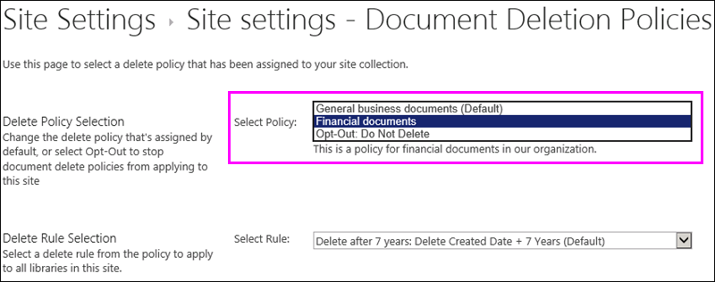

# 사이트에 문서 삭제 정책 적용 또는 제거

조직은 규정 준수, 법률 및 기타 규정 때문에 특정 기간 동안 문서 보존이 필요한 경우가 많습니다. 그렇지만 필요 이상으로 오랫동안 문서를 보존하면 조직은 법적 위험에 노출될 수 있습니다. 이러한 이유로 조직은 사이트에 대해 문서 삭제 정책을 만들었을 수 있습니다. 예를 들어 일반 비즈니스 문서는 만들고 5년 후에 삭제해야 할 수도 있습니다.
  
조직에 따라 다음과 같은 문서 삭제 정책이 사용될 수 있습니다.
  
- **필수** 사이트 소유자는 사이트에 자동으로 적용 되는 필수 정책을 거부할 수 없으며 합니다. 
    
- **기본** 기본 정책은 사이트에 자동으로 적용되지만 사이트 소유자는 다음 작업을 수행할 수 있습니다. 
    
  - 사용 가능한 다른 정책을 선택합니다.
    
  - 사이트의 콘텐츠에 적합하지 않은 정책은 완전히 거부합니다.
    
- **필수 및 기본이 아님** 이 경우 사이트에 정책이 자동으로 적용되지 않으며 사이트 소유자가 직접 적용해야 합니다. 
    
문서 삭제 정책에는 규칙이 둘 이상 포함될 수 있습니다. 예를 들어, 만든 지 1년 후에 문서를 삭제하도록 지정하는 규칙도 있고, 마지막으로 수정된 지 1년 후에 문서를 삭제하도록 지정하는 규칙도 있을 수 있습니다. 정책에 규칙이 둘 이상 포함되어 있는 경우 사이트에 가장 적합한 규칙을 선택할 수 있습니다. 삭제 규칙은 사이트 내의 모든 라이브러리에 적용됩니다. 한 사이트에서 한 번에 하나의 정책 및 규칙만 활성 상태일 수 있습니다. 정책과 마찬가지로, 규칙도 기본 규칙으로 설정할 수 있으므로 기본 규칙은 정책이 적용될 때 자동으로 적용됩니다.
  
마지막으로 문서 삭제 정책은 상속됩니다. 사이트에 대해 정책이나 규칙을 선택하면 선택한 항목이 모든 하위 사이트에 상속됩니다. 물론 하위 사이트 소유자가 다른 정책이나 규칙을 선택하여 상속을 끊을 수 있습니다. 정책이나 규칙을 선택할 때는 사이트 아래의 모든 하위 사이트의 콘텐츠를 고려해야 합니다.
  
## 사이트 모음에서 사용할 수 있는 문서 삭제 정책을 확인합니다.

조직에서 사이트 모음마다 다른 정책을 할당할 수도 있습니다. 사이트 모음 수준에서 사이트 모음 소유자는 해당 사이트 모음에서 사용할 수 있는 모든 문서 삭제 정책을 볼 수 있습니다. 해당 정책이 사이트 모음 서식 파일(즉 이 서식 파일에서 만든 모든 사이트 모음)이나 이러한 특정 사이트 모음에서만 사용하도록 설정되었을 수 있습니다.
  
1. 오른쪽 위 모서리에서 사이트 모음에서 최상위 사이트에서 **설정** [기어 아이콘]를 선택 \> **사이트 설정**합니다.
    
2. **사이트 모음 관리** 에서 \> **문서 삭제 정책**입니다.
    
    > [!NOTE]
    > **문서 삭제 정책** 링크는 사이트 모음에 정책을 할당 하지 않은 경우에 표시 되지 않습니다. 링크 정책은 사이트에 할당 된 후에 즉시 나타나지 또한- **문서 삭제 정책** 링크를 표시 하는 정책이 할당 되는 경우에서 24 시간까지 걸릴 수 있습니다. 
  
3. 이 페이지에서는 다음을 확인할 수 있습니다.
    
  - 현재 할당된 정책 및 관련된 규칙. 정책을 선택하면 오른쪽 창에 규칙이 표시됩니다.
    
  - 기본 정책(있는 경우)은 **기본** 열에 **예**가 표시됩니다. 
    
  - 정책이 **필수**로 할당된 경우에는 목록 아래에 메시지가 표시됩니다.
    
이 목록은 보기 전용입니다. 사이트 모음 소유자는 사용 가능한 모든 정책 및 규칙을 볼 수 있습니다. 정책을 적용하려면 다음 섹션을 참조하세요.
  

  
## 사이트에 문서 삭제 정책 적용 또는 제거

사이트 소유자나 사이트 모음 소유자의 경우 사이트에 적용하거나 완전히 거부할 수 있는 정책이 만들어져 있을 것입니다.
  
1. 오른쪽 위 모서리에서 **설정** [기어 아이콘]를 선택 \> **사이트 설정**합니다.
    
2. **사이트 관리** 에서 \> **문서 삭제 정책**입니다.
    
    > [!NOTE]
    > **문서 삭제 정책** 링크는 사이트 모음에 정책을 할당 하지 않은 경우에 표시 되지 않습니다. 링크 정책은 사이트에 할당 된 후에 즉시 나타나지 또한- **문서 삭제 정책** 링크를 표시 하는 정책이 할당 되는 경우에서 24 시간까지 걸릴 수 있습니다. 
  
3. 다음 중 하나를 수행합니다.
    
  - **정책을 적용 하려면** 정책을 선택 \> 해당 정책에서 규칙을 선택 \> **저장**합니다.
    
    한 사이트에서 한 번에 하나의 정책 및 규칙만 활성 상태일 수 있습니다. 조직에서 선택할 수 있는 여러 정책 및 규칙을 제공할 수도 있고 하나의 정책이나 규칙만 제공할 수도 있습니다.
    
    
  
  - **정책을 거부 하려면** 선택 **옵트아웃: 삭제 확인을 수행** \> **저장**합니다.
    
    사이트 소유자는 문서 삭제 정책을 사이트의 콘텐츠에 적용할 수 없다고 판단할 경우 해당 정책을 거부할 수 있습니다. 그렇지만 **필수**로 표시된 정책은 거부할 수 없습니다.
    
    
  
## 문서 삭제 정책은 다른 정책을 재정의함

사이트에서 콘텐츠를 보존하거나 삭제하기 위한 다른 정책이 사용될 수 있습니다.
  
- 사이트 모음의 콘텐츠 형식 정책
    
- 목록 또는 라이브러리에 대한 정보 관리 정책
    
이미 콘텐츠 형식 정책 또는 정보 관리 정책을 사용 하 여 목록 또는 라이브러리에 대 한 사이트에 문서 삭제 정책을 적용 하는 경우 문서 삭제 정책을 적용 되는 동안 해당 정책이 무시 됩니다. 다른 정책이 무시 되는 경우 메시지가 표시 됩니다는 "이이 사이트에서 콘텐츠를 사용 하 여 문서 삭제 정책" 합니다.
  
즉, 사이트에서 구조화된 콘텐츠용으로 만들어진 정책(정보 관리 정책 및 콘텐츠 형식 정책)이나 구조화되지 않은 콘텐츠용으로 만들어진 정책(문서 삭제 정책)만 사용하도록 계획하는 것이 좋습니다. 문서 삭제 정책을 거부하면 경고가 표시되지 않으며 다른 유형의 정책이 계속 작동합니다.
  
사이트 정책은 문서 삭제 정책의 영향을 받지 않습니다.
  
### 콘텐츠 형식 정책이 무시되는지 여부 확인

사이트를 사용 하는 경우 콘텐츠 형식 정책 하 고 이제이 메시지를 표시, 해당 정책이 더이상 적용 됩니다. 콘텐츠 형식 정책을 복원 하려면를 사용할 수 있는 옵트아웃 사용할 경우 앞에서 설명한 대로 사이트, 문서 삭제 정책을 제거할 수 있습니다. 옵트아웃할 수 있는 옵션이 있으면 문서 삭제 정책을 필수 이며 조직에서 규정 준수 관리자에 게 문의 해야 합니다.
  
1. 오른쪽 위 모서리에서 **설정** [기어 아이콘]를 선택 \> **사이트 설정**합니다.
    
2. **사이트 관리** 에서 \> **콘텐츠 형식 정책 서식 파일**입니다.
    
    
  
### 정보 관리 정책이 무시되는지 여부 확인

사이트에 정보 관리 정책 사용 이제이 메시지를 표시 하는 경우 해당 정책이 더이상 적용 됩니다. 정보 관리 정책을 복원 하려면를 사용할 수 있는 옵트아웃 사용할 경우 앞에서 설명한 대로 사이트, 문서 삭제 정책을 제거할 수 있습니다. 옵트아웃할 수 있는 옵션이 있으면 문서 삭제 정책을 필수 이며 조직에서 규정 준수 관리자에 게 문의 해야 합니다.
  
- 목록 또는 라이브러리의 리본 메뉴에 대 한 \> **라이브러리** 탭 \> **라이브러리 설정** \> **사용 권한 및 관리에서** \> **정보 관리 정책 설정**합니다.
    
    
  
## 참고 항목

[문서 삭제 정책 개요](document-deletion-policies.md)
  
[문서 삭제 정책 만들기](create-a-document-deletion-policy.md)

