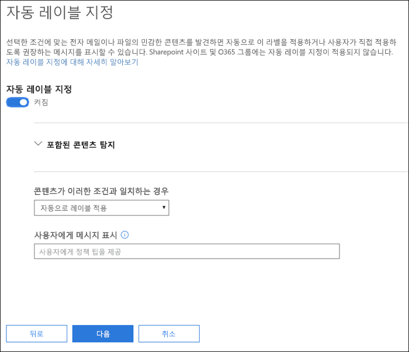
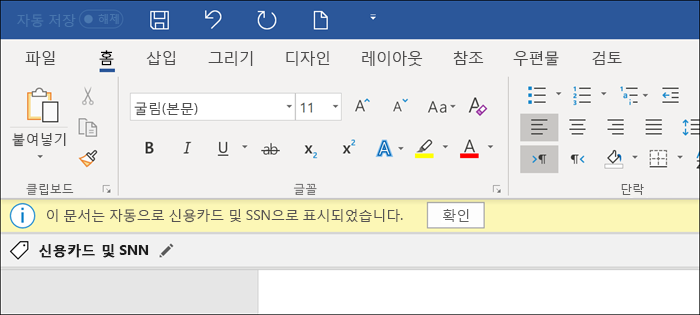
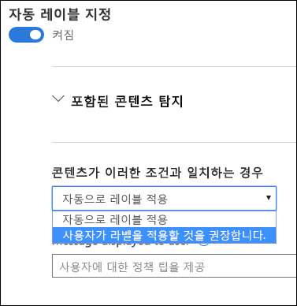
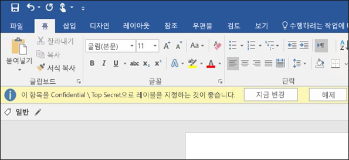

# 민감도 레이블을 콘텐츠에 자동으로 적용Apply a sensitivity label to content automatically

민감도 레이블을 만들 때 민감한 정보가 포함된 콘텐츠에 해당 레이블을 자동으로 할당하거나 사용자에게 권장 레이블을 적용하라는 메시지를 표시할 수 있습니다.When you create a sensitivity label, you can automatically assign that label to content containing sensitive information, or you can prompt users to apply the label that you recommend.

콘텐츠에 자동으로 민감도 레이블을 적용하는 기능도 다음과 같은 이유로 중요합니다.The ability to apply sensitivity labels to content automatically is important because:

- 사용자에게 모든 분류를 교육할 필요가 없습니다.You don't need to train your users on all of your classifications.

- 모든 콘텐츠를 올바르게 분류하기 위해 사용자에게 의존할 필요가 없습니다.You don't need to rely on users to classify all content correctly.

- 사용자가 더 이상 정책을 알아야 할 필요가 없으며, 그 대신 업무에 집중할 수 있습니다.Users no longer need to know about your policies - they can instead focus on their work.

> [!NOTE]
> 레이블을 자동으로 적용하는 기능을 사용하려면 Azure Information Protection P2 구독이 필요합니다. 이 기능을 사용하려면 [Azure Information Protection 통합 레이블 클라이언트 ](https://docs.microsoft.com/ko-KR/azure/information-protection/rms-client/install-unifiedlabelingclient-app)를 다운로드하고 설치해야 합니다. 우리는 Azure Information Protection 통합 레이블 클라이언트가 필요하지 않도록 Office 앱에서 이 기능에 대한 기본 지원을 마련하고 있습니다. 또한 통합 레이블 클라이언트는 Windows에서만 실행되므로 아직 이 기능은 Mac, iOS 및 Android에서는 지원되지 않습니다.The capability to apply labels automatically requires an Azure Information Protection P2 subscription. To use this feature, you must [Download and install the Azure Information Protection unified labeling client](https://docs.microsoft.com/ko-KR/azure/information-protection/rms-client/install-unifiedlabelingclient-app). We're working on native support for this feature in Office apps, so that it won't require the Azure Information Protection unified labeling client. Also, the unified labeling client runs only on Windows, so this feature is not yet supported on Mac, iOS, and Android.

## 조건에 따라 자동으로 민감도 레이블 적용Apply a sensitivity label automatically based on conditions

민감도 레이블의 가장 강력한 기능 중 하나는 특정 조건과 일치하는 콘텐츠에 자동으로 레이블을 적용하는 기능입니다. 이 경우 조직의 사용자는 민감도 레이블을 적용할 필요가 없습니다. Office 365에서 이러한 작업을 자동으로 수행합니다.One of the most powerful features of sensitivity labels is the ability to apply them automatically to content that matches certain conditions. In this case, people in your organization don't need to apply the sensitivity labels - Office 365 does the work for them.
   
특정 종류 민감 정보가 포함된 콘텐츠에 대해 민감도 레이블을 자동으로 적용하도록 선택할 수 있습니다. 민감도 레이블을 자동으로 적용하도록 구성하면 DLP(데이터 손실 방지) 정책을 만들 때처럼 민감 정보 유형 목록이 나타납니다. 예를 들어 신용 카드 번호나 주민등록번호와 같이 고객의 개인 식별 정보(PII)가 포함된 모든 컨텐츠에 고기밀 레이블을 자동으로 적용할 수 있습니다.You can choose to apply sensitivity labels to content automatically when that content contains specific types of sensitive information. When you configure a sensitivity label to be applied automatically, you see the same list of sensitive information types as when you create a data loss prevention (DLP) policy. So you can, for example, automatically apply a Highly Confidential label to any content that contains customers' personally identifiable information (PII), such as credit card numbers or social security numbers. 

민감 정보 유형을 선택하면 인스턴스 수 또는 일치 정확도를 변경하여 조건을 구체화 할 수 있습니다. 자세한 내용은 [ 규칙을 조정하여 더욱 쉽게 또는 더욱 일치하기 어렵게 하기](data-loss-prevention-policies.md#tuning-rules-to-make-them-easier-or-harder-to-match)를 확인하십시오.After you choose your sensitive informaton types, you can refine your condition by changing the instance count or match accuracy. For more information, see [Tuning rules to make them easier or harder to match](data-loss-prevention-policies.md#tuning-rules-to-make-them-easier-or-harder-to-match).

또한 조건이 모든 중요한 정보 유형을 감지해야하는지 또는 그 중 하나만 감지해야하는지 여부를 선택할 수 있습니다. 조건을 보다 유연하게 또는 복잡하게 만들려면 그룹을 추가하고 그룹 간에 논리 연산자를 사용할 수 있습니다. 자세한 내용은 [ 그룹화 및 논리 연산자](data-loss-prevention-policies.md#grouping-and-logical-operators)를 참조하십시오.Further, you can choose whether a condition must detect all of the sensitive infromation types, or just one of them. And to make your conditions more flexible or complex, you can add groups and use logical operators between the groups. For more information, see [Grouping and logical operators](data-loss-prevention-policies.md#grouping-and-logical-operators).

민감도 레이블이 자동으로 적용되면 사용자는 Office 앱에서 알림을 보게 됩니다. \*\* OK \*\*를 선택하여 알림을 닫을 수 있습니다.When a sensitivity label is automatically applied, the user sees a notification in their Office app. They can choose **OK** to dismiss the notification.

## 사용자가 민감도 레이블을 적용할 것을 권장합니다Recommend that the user apply a sensitivity label

원하는 경우 민감한 레이블을 자동으로 콘텐츠에 적용하는 대신 사용자에게 레이블을 적용하도록 권장할 수 있습니다. 이 옵션은 사용자가 분류 및 관련 보호를 수락하거나 레이블이 자신의 문서 또는 이메일에 적합하지 않은 경우 권장 사항을 취소할 수 있는 유연성을 제공합니다.If you prefer, instead of applying a sensitivity label automatically to content, you can recommend to your users that they apply the label. This option provides your users the flexibility of accepting the classification and any associated protection, or dismissing the recommendation if the label is not suitable for their document or email.

권장 레이블은 Word, PowerPoint 및 Excel에서 지원됩니다(또한 Azure Information Proteciton 통합 레이블 클라이언트가 설치되어 있어야 합니다). Outlook에서 권장 레이블을 지원하기 위해 노력하고 있습니다.Note that recommended labels are supported in Word, PowerPoint, and Excel (and require that the Azure Information Protection unified labeling client is installed). We're working on support for recommended labels in Outlook.

다음은 사용자 지정 정책 팁을 사용하여 레이블을 맞춤 정책 팁과 함께 권장 작업으로 적용하도록 조건을 구성 할때 프롬프트가 표시되는 예입니다. 정책 팁에 표시될 텍스트를 선택할 수 있습니다.Here's an example of a prompt when you configure a condition to apply a label as a recommended action, with a custom policy tip. You can choose what text is displayed in the policy tip.

## 자동 또는 권장 레이블이 적용되는 방식How automatic or recommended labels are applied

- 자동 레이블 지정은 문서를 저장할 때 Word, Excel 및 PowerPoint에 적용되고 전자 메일을 보낼 때는 Outlook에 적용됩니다. 이러한 조건은 문서 및 전자 메일, 머리글 및 바닥글의 본문 텍스트에 있는 중요한 정보를 탐지하지만 전자 메일의 제목 줄이나 첨부 파일에서는 해당되지 않습니다.Automatic labeling applies to Word, Excel, and PowerPoint when documents are saved, and to Outlook when emails are sent. These conditions detect sensitive information in the body text in documents and emails, and to headers and footers -- but not in the subject line or attachments of email.

- 이전에 수동으로 레이블을 지정했거나 상위 분류로 자동 분류한 문서 및 전자 메일에는 자동 분류를 사용할 수 없습니다. 문서 또는 전자 메일에는 단일 보존 레이블 이외에 단일 민감도 레이블만 적용될 수 있습니다.You cannot use automatic classification for documents and emails that were previously manually labeled, or previously automatically labeled with a higher classification. Remember, a document or email can have only a single sensitivity label applied to it (in addition to a single retention label).

- 권장 분류는 문서를 저장할 때 Word, Excel 및 PowerPoint에 적용됩니다. 저희는 Outlook에서 권장 레이블 지정을 지원하기 위해 노력하고 있습니다.Recommended classification applies to Word, Excel, and PowerPoint when documents are saved. We're working on support for recommended labeling in Outlook.

- 이전에 상위 분류로 분류 문서에는 권장 분류를 사용할 수 없습니다. 이 경우 콘텐츠가 이미 상위 분류로 분류된 때에는 사용자는 추천 및 정책 팁이 포함된 메시지를 확인하지 못합니다.You cannot use recommended classification for documents that were previously labeled with a higher classification. In this case, when the content's already labeled with a higher classification, the user won't see the prompt with the recommendation and policy tip.

## 두 개 이상 레이블에 적용했을 때 여러 조건의 평가 방식How multiple conditions are evaluated when they apply to more than one label

레이블은 정책에서 지정한 위치에 따라 평가되도록 정렬됩니다. 먼저 배치된 레이블은 가장 낮은 위치에 있고(가장 민감하지 않음) 마지막에 위치한 레이블은 가장 높은 위치에 배치됩니다(가장 민감합니다). 우선 순위에 대한 자세한 내용은 [레이블 우선 순위 (순서 관련 문제)](sensitivity-labels.md#label-priority-order-matters)를 참조하십시오.The labels are ordered for evaluation according to their position that you specify in the policy: The label positioned first has the lowest position (least sensitive) and the label positioned last has the highest position (most sensitive). For more information on priority, see [Label priority (order matters)](sensitivity-labels.md#label-priority-order-matters).

## 상위 레이블이 자동으로 적용되거나 권장되도록 구성하지 않음Don't configure a parent label to be applied automatically or recommended

상위 레이블(하위 레이블이 있는 레이블)은 콘텐츠에 적용할 수 없습니다.Remember, a parent label (a label with sublabels) can't be applied to content. 상위 레이블은 Azure Information Protection 통합 레이블 지정 클라이언트를 사용하는 Office 앱에서 콘텐츠에 적용되지 않으므로 상위 레이블이 자동으로 적용되거나 권장되도록 구성하지 않도록 합니다.Make sure that you don't configure a parent label to be auto-applied or recommended, because the parent label won't be applied to content in Office apps that use the Azure Information Protection unified labeling client. 상위 레이블 및 하위 레이블에 대한 자세한 내용은 [하위 레이블(레이블 그룹화)](sensitivity-labels.md#sublabels-grouping-labels)을 참조하세요.For more information on parent labels and sublabels, see [Sublabels (grouping labels)](sensitivity-labels.md#sublabels-grouping-labels).
