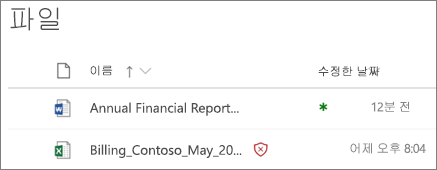
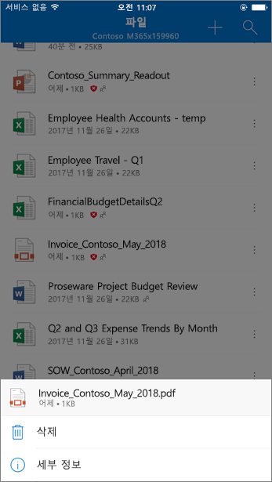
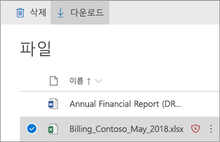

# SharePoint, OneDrive 및 Microsoft Teams에 대한 Office 365 ATP

## SharePoint, OneDrive 및 팀이 Microsoft Office 365 ATP의 개요 (영문)

파일 공유를 정기적으로 사용자 및 SharePoint, OneDrive 및 Microsoft 팀을 사용 하 여 공동 작업을 수행 합니다. [Office 365 고급 위협 보호](office-365-atp.md) ATP ()와 함께 조직 보다 안전한 방식으로 공동 작업할 수 있습니다. ATP를 검색 하 고 팀 사이트 및 문서 라이브러리에서 악성으로 식별 되는 파일을 차단 합니다.  
  
## 작업 방법

SharePoint Online에서 파일, 비즈니스 및 Microsoft 팀의 비즈니스용 OneDrive 악성으로 확인 되었습니다, 그리고 ATP 직접 해당 파일을 잠그는 파일 저장소와 통합 됩니다. 다음 그림 라이브러리에서 감지 된 악의적인 파일의 예를 보여줍니다.
  

  
차단 된 파일은 문서 라이브러리 및 웹, 모바일, 또는 데스크톱 응용 프로그램에 계속 표시 되지만 차단 된 파일 열기, 복사, 이동 하거나 수 없습니다, 공유 합니다. 사용자 수, 차단 된 파일을 삭제 되지만 합니다. 다음 사용자의 모바일 장치에서 다음과 같은 어떤 하는 예제:
  

  
Office 365를 구성 하는 방법에 따라 사용자 수도 있고 차단 된 파일을 다운로드 하는 기능을 없을 수도 있습니다. 차단 된 파일을 다운로드 하의 모습 사용자의 모바일 장치에서 다음과 같습니다.
  

  
자세한 내용은, [SharePoint, OneDrive 및 팀이 Microsoft Office 365 ATP 설정](turn-on-atp-for-spo-odb-and-teams.md)을 참조 합니다.
  
## 이러한 사항을 염두합니다

- ATP는 회사 또는 팀이 Microsoft에 대 한 SharePoint Online, OneDrive에서 모든 단일 파일을 검색 하지 않습니다. 의도적인 것입니다. 파일에서 스마트 한 추론 방식 및 위협 신호 함께 공유 및 관람객 활동 이벤트를 사용 하 여 악의적인 파일을 식별 하는 프로세스를 통해 비동기적으로 검색 됩니다.

- SharePoint 사이트에 [현대 경험](https://docs.microsoft.com/sharepoint/guide-to-sharepoint-modern-experience)을 사용 하도록 구성 되었는지 확인 합니다. 악의적인 및 차단 된 파일을 식별 되는 사용자 되었다는 현대 경험 하지만 하지 클래식 보기에서 볼 수 있습니다. ATP 보호 적용 현대 경험 나 기본 보기, 사용 여부 그러나 파일이 차단 되는 시각적 표시기는 현대 환경에만 존재 합니다.
    
- SharePoint Online에서 악의적으로 식별 되는 파일, 회사 또는 Microsoft 팀의 비즈니스용 OneDrive 위협 탐색기 ( [Office 365 위협 인텔리전스](office-365-ti.md)의 일부) 및 [Office 365 고급 위협 보호에 대 한 보고서](view-reports-for-atp.md) 에서 표시 됩니다.
    
- ATP는 조직의 전체 위협 보호 전략의 스팸 방지 및 맬웨어 방지 보호 기능으로 안전 링크와 안전한 첨부 파일을 포함 하는 일부입니다. 자세한 내용은 [Office 365의 위협 으로부터 보호](protect-against-threats.md)를 참조 하십시오.
    
- SharePoint Online 관리자가 악성으로 검색 되는 파일을 다운로드 하는 사용자의 사용 여부를 확인할 수 있습니다. 이 DisallowInfectedFileDownload 매개 변수를 사용 하 여 Set-spotenant PowerShell cmdlet을 실행 하 여 작업은 수행 ( [SharePoint, OneDrive 및 팀이 Microsoft Office 365 ATP 설정](turn-on-atp-for-spo-odb-and-teams.md)참조).
    
## 온라인 격리 SharePoint에 대 한 ATP에, 비즈니스 및 Microsoft 팀의 비즈니스용 OneDrive

 가능한 가장 늦은 년 5 월 2018, 보안에서 [격리](quarantine-email-messages.md) 기능에에서 시작 &amp; 준수 센터는 하기 위해 확장 된 ATP SharePoint에 대 한 온라인으로 비즈니스 및 Microsoft 팀의 비즈니스용 OneDrive 합니다.
  
때 SharePoint Online에서 파일, 회사 또는 Microsoft 팀의 비즈니스용 OneDrive 열거나 공유에서 파일을 차단 하는 ATP 외에도 악의적인으로 식별 된, 격리 된 항목 목록에 해당 파일이 포함 됩니다. (보안에서 &amp; 준수 센터, **위협 관리로** 이동 \> **검토** \> **격리** 하 고 **콘텐츠**에 대 한 필터입니다.) 
  
조직의 Office 365 보안 팀의 일부 이며는 데 필요한 경우 [Office 365 보안에 할당 된 사용 권한을 &amp; 준수 센터](permissions-in-the-security-and-compliance-center.md), 다운로드, 릴리스, 보고 및 ATP 하 여 악성으로 검색 되는 파일을 삭제할 수 있습니다 격리 됩니다.
  
- **릴리스 및 보고** 파일을 SharePoint, OneDrive, 또는 Microsoft 팀의 ATP 블록 파일에 해당 하는 팀 사이트 또는 문서 라이브러리에서 제거합니다. 그러면 사용자가 열기, 공유 및 파일을 다운로드 하려면 수입니다. 및 파일을 **Microsoft에 보고서 보내기** 옵션을 선택 하는 경우 Microsoft에 가양성으로 보고 됩니다. 
    
- 격리;에서 파일을 제거 하 **는 파일을 삭제** 그러나 열거나 공유 파일은 여전히 못 차단 됩니다. 파일 (SharePoint Online, 회사 또는 Microsoft 팀의 비즈니스용 OneDrive) 해당 문서 라이브러리 또는 팀 사이트에도 삭제 해야 합니다. 
    
- **파일을 다운로드 하** 는 다운로드 하 고 모든 가양성에 대 한 파일을 분석할 수 있습니다. 
    
## 다음 단계

1. [SharePoint, OneDrive 및 팀이 Microsoft Office 365 ATP 설정](turn-on-atp-for-spo-odb-and-teams.md)
    
2. [SharePoint, OneDrive, 또는 팀이 Microsoft에서 감지 된 악의적인 파일에 대 한 정보 보기](malicious-files-detected-in-spo-odb-or-teams.md)
    
