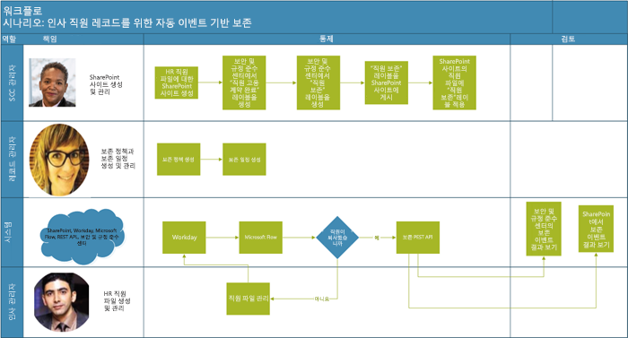
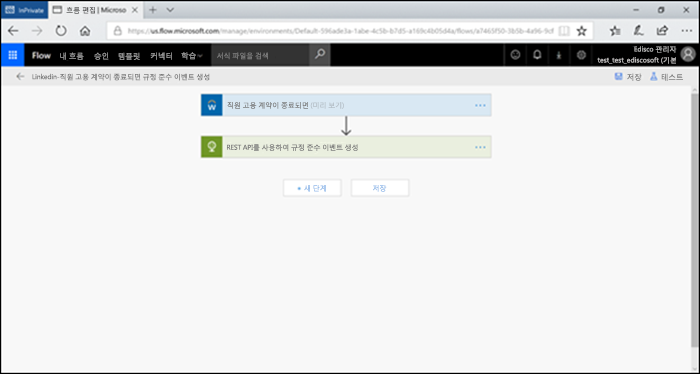
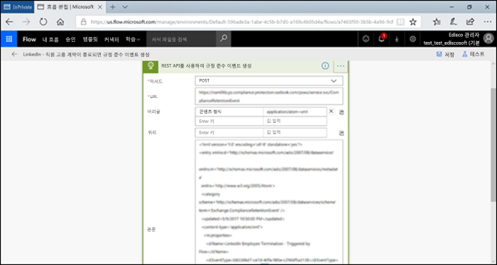
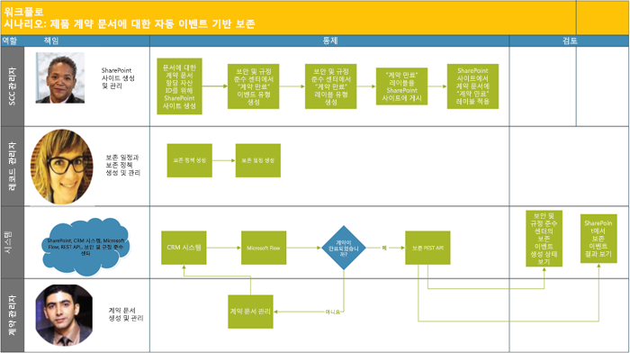
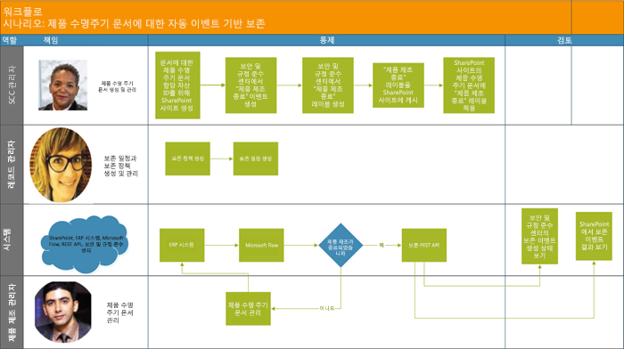

# 이벤트 기반 보존 자동화Automate event-based retention

조직의 컨텐츠가 폭발적으로 증가하고 ROT(중복, 구식, 사소)가 될 가능성은 심각한 문제입니다. 법률, 비즈니스 및 규정 준수 문제를 지속적으로 충족하려면 기업은 중요한 정보를 보관하고 보호할 수 있어야하며 관련 정보를 신속하게 찾을 수 있어야 합니다. 중요하고 관련성 있는 정보만 보유하는 것이 비즈니스 성공의 열쇠입니다.The explosion of content in organizations and how it can become ROT (redundant, obsolete, trivial) is serious business. To continue to meet legal, business, and regulatory compliance challenges, businesses must be able to keep and protect important information and quickly find what’s relevant. Retaining only important, pertinent information is key to a business’s success.

따라서 조직에서는 Office 365 보안 및 준수 센터의 보존 솔루션을 활용할 수 있습니다. 보관은 [보존 레이블](labels.md)을 이용하여 시작할 수 있습니다. 보존 레이블에는 [특정 이벤트에 보존 기간을 적용 ](event-driven-retention.md)할 수 있는 옵션이 있습니다. 일반적으로 보존 기간은 콘텐츠의 생성 날짜 또는 최종 수정 날짜와 같은 알려진 날짜를 기반으로 합니다. 그러나 조직에서는 직원이 퇴사한 후 7년이 경과한 경우와 같은 이벤트 발생에 따라 콘텐츠를 삭제해야 합니다.Hence organizations can take advantage of retention solutions in the Office 365 Security & Compliance Center. Retention can be triggered by using [retention labels](labels.md). A retention label has the option to [base the retention period on a specific event](event-driven-retention.md). Typically, the retention period is based on a known date, such as the creation date or last modified date for the content. However, organizations also have requirements to dispose of content based on the occurrence of an event, such as 7 years after an employee leaves an organization.

규정을 준수하는 콘텐츠 처리를 보장하려면 이벤트 발생시기를 알아야 합니다. 콘텐츠의 양이 급속히 증가함에 따라 콘텐츠를 적시에 적법한 방법으로 보유하고 폐기하는 일이 어려워지고 있습니다.In order to ensure compliant disposal of content, it is imperative to know when an event takes place. With the volume of content increasing rapidly, it is becoming challenging to retain and dispose content in a timely and compliant manner.

이벤트 기반 보존은 이 문제점을 해결합니다. 이 항목에서는 Microsoft 365 REST API를 사용하여 이벤트를 통한 보존을 자동화하는 비즈니스 프로세스 흐름을 설정하는 방법에 대해 설명합니다.Event-based retention solves this problem. This topic explains how to set up your business process flows to automate retention through events by using the Microsoft 365 REST API.

## 이벤트 기반 보존에 대한 설명About event-based retention

조직의 규모는 크거나 적정하거나 작을 수 있습니다. 일상적으로 생성되고 관리되는 비즈니스 문서, 법률 문서, 직원 파일, 계약서 및 제품 문서의 수는 급격히 증가하고 있습니다.An organization can be small, medium, or large. The number of business documents, legal documents, employee files, contracts, and product documents that get created and managed on a day to day basis is increasing dramatically.

예를 들어, 매일, 수십, 수백 명의 직원이 조직에 가입하고 퇴사합니다. HR 부서에서는 비즈니스 요구 사항에 따라 직원 관련 문서를 계속 작성, 업데이트 또는 삭제합니다. 이 프로세스는 비즈니스에 대해 개괄적으로 명시된 다양한 보존 정책의 적용을 받습니다.For example, each day, tens and hundreds of employees are joining and leaving organizations. The HR department continues to create, update, or delete employee-related documents as per business requirements. This process is subject to the different retention policies outlined for the business:

- \*\* 컨텐츠 보유 기간은 컨텐츠 작성, 최종 수정 또는 레이블 지정 날짜와 같은 알려진 날짜\*\* 일 수 있습니다. 예를 들어, 문서를 작성한 후 7 년 동안 문서를 보존한 다음 삭제할 수 있습니다.**The period of retention for content can be a known date** such as the date the content was created, last modified or labeled. For example, you might retain documents for seven years after they're created and then delete them.

- **콘텐츠 보유 기간은 알 수 없는 날짜가 될 수도 있습니다**. 예를 들어 보존 레이블을 사용하면 직원이 조직을 떠나는 경우와 같이 특정 유형의 이벤트가 발생할 때에 대해 보존 기간을 설정할 수 있습니다.**The period of retention of content can also be an unknown date**. For example, with retention labels, you can also base a retention period on when a specific type of event occurs, such as an employee leaving the organization.

이벤트가 보유 기간의 시작을 트리거하고 해당 이벤트 유형에 적용된 레이블이 있는 모든 컨텐츠는 레이블의 보유 조치를 받습니다. 이를 이벤트 기반 보존이라고합니다. 자세한 내용은 [이벤트 기반 보존 개요](event-driven-retention.md)를 참조하십시오.The event triggers the start of the retention period, and all content with a label applied for that type of event get the label's retention actions enforced on them. This is called event-based retention - to learn more, see [Overview of event-driven retention](event-driven-retention.md).

## 이벤트 기반 보존 설정Set up event-based retention

이 절에서는 콘텐츠를 보존하기 전에 수행해야 할 작업에 대해 설명합니다.This section describes what needs to be done prior to retaining content.

### 역할 확인Identify records management roles

효과적이고 효율적인 비즈니스 문서 보존을 담당하는 레코드 관리 작업을 수행하는 조직 안의 다양한 역할을 식별합니다.Identify the different roles in an organization that perform Record Management tasks that would be responsible for effective and efficient retention of business documents.

  | **가상 사용자****Persona**| **역할****Role**|
  | - | - |
  | 보안 및 준수 센터 관리자Security & Compliance Center | SharePoint에 보존 이벤트 유형, 보존 레이블 및 레코드 리포지토리를 만듭니다.Creates Retention Event types, Retention labels and Record repositories in SharePoint |
  | 레코드 관리자Records manager                                  | 보존 정책과 보존 일정 지침 및 준수 세부사항을 제공합니다.Provides Retention Policies and Retention Schedules guidance and compliance details   |
  | 시스템 관리자(회사)System Admin (business)                          | Microsoft 365에서 작동하도록 외부 시스템을 설정하고 관리합니다.Sets up and manages external systems to work with Microsoft 365                       |
  | 정보 근로자Information Worker                               | 비즈니스 프로세스(HR, 재무, IT 등)의 수명 주기를 관리합니다.Manages the lifecycle of their business process (HR, Finance, IT etc)                 |

### 보안 및 준수 센터 설정Set up the Security & Compliance Center
  
1. 규정 준수 관리자는 종업원 해지, 계약 만료 또는 제품 제조 종료와 같은 이벤트 유형을 생성합니다([이벤트 보존 조항](https://docs.microsoft.com/ko-KR/office365/securitycompliance/event-driven-retention)의 단계별 프로세스 참조) Compliance admin creates an event type – for example, Employee Termination or Contract Expiration or End of Product Manufacturing (Please refer to step by step process in [Event retention article](https://docs.microsoft.com/ko-KR/office365/securitycompliance/event-driven-retention)
    
1. 규정 준수 관리자는 이벤트를 기반으로 보존 레이블을 만들고 레이블을 이벤트 유형과 연결합니다.Compliance admin creates a retention label based on an event and associates the label with an event type
    
1. 보존 레이블에 대해 다음과 같이 4종류의 트리거가 있습니다.There are 4 types of triggers for retention labels:
            
    1. 만든 날짜Create date
                
    1. 마지막으로 수정한 날짜Last modified date
                
    1. 레이블 날짜(콘텐츠 레이블이 지정 된 때)Label date (when the content was labeled)
                
    1. 이벤트 기반Event-based relevancy
    
1. 규정 준수 관리자가 레이블을 게시합니다Compliance admin publishes the label

### SharePoint 설정Set up SharePoint Online
   
레코드 저장소를 만들기 위해 규정 준수 관리자는 다음 작업을 수행합니다.To create a records repository, the compliance admin:

1. SharePoint 사이트를 생성합니다.Creates a site master.

1. 다음 중 하나를 수행합니다.Either one of the following:
        
    - SharePoint 라이브러리 만들기: 라이브러리 수준에서 이벤트 기반 레이블을 설정합니다. 자세한 내용은 [ SharePoint 라이브러리, 폴더 또는 문서 집합의 모든 콘텐츠에 기본 보존 레이블 적용](labels.md#applying-a-default-retention-label-to-all-content-in-a-sharepoint-library-folder-or-document-set)을 참조하십시오.Creates a SharePoint library: Set event-based label at the library level. For more information, see [Applying a default retention label to all content in a SharePoint library, folder, or document set](labels.md#applying-a-default-retention-label-to-all-content-in-a-sharepoint-library-folder-or-document-set).
          
    - SharePoint에서 문서 집합을 설정합니다. 자세한 내용은 [문서 집합 소개](https://support.office.com/ko-KR/article/Introduction-to-Document-Sets-3DBCD93E-0BED-46B7-B1BA-B31DE2BCD234)를 참조하십시오.Sets up a Document set in SharePoint. For more information, see [Introduction to document sets](https://support.office.com/ko-KR/article/Introduction-to-Document-Sets-3DBCD93E-0BED-46B7-B1BA-B31DE2BCD234).
      
1. 자산 ID(자산 ID는 조직에서 사용하는 제품 이름 또는 코드입니다. 예를 들어 사원 번호도 자산 ID가 될 수 있습니다)를 각 직원 문서 세트에 할당합니다(자산 ID를 폴더에 할당하면 해당 폴더의 모든 항목이 자동으로 동일한 자산 ID를 상속받게 됩니다. 이는 모든 항목의 보존 기간이 동일한 이벤트에 의해 트리거 될 수 있음을 의미합니다.Assigns Asset Id (asset ID is a product name or code used by the organization, for example, Employee number can be an asset id) to each employee document set (By assigning the asset ID to the folder, every item in that folder automatically inherits the same asset ID. This means all the items can have their retention period triggered by the same event.

## 이벤트 기반 보존을 트리거하는 방법Ways to trigger event-based retention

두 가지 방법으로 이벤트 기반 보존을 트리거할 수 있습니다.There are two ways in which event-based retention can be triggered:

- **보안 및 컴플라이언스 센터 UI 사용** 이 기능은 한 번에 적은 컨텐츠를 유지하거나 보존을 트리거하는 빈도가 월 단위 또는 연 단위처럼 빈번하지 않은 경우 사용할 수 있는 프로세스입니다. 이 방법에 대한 자세한 내용은 [이벤트 기반 보존 개요](event-driven-retention.md)를 참조하십시오. 그러나 이처럼 보존을 트리거하는 방법은 시간이 많이 걸리고 오류가 발생하기 쉽기 때문에 확장성이 떨어집니다. 따라서 보존을 트리거하는 완벽한 자동화 솔루션은 데이터의 보안 및 준수를 향상시킬 수 있습니다.**Using Security & Compliance Center UI** This is a process that can be used to retain less content at a time or the frequency to trigger retention is not often, such as monthly or yearly. For more information on this method, see [Overview of event-driven retention](event-driven-retention.md). However, this way to trigger retention can be time-consuming and prone to error, thus stunting scalability. Therefore, an automated, seamless solution to trigger retention can enhance the security and compliance of data.

- \*\* M365 REST API 사용\*\* 이 프로세스는 대용량의 콘텐츠를 한 번에 보존 및/또는 보존을 트리거하는 빈도가 일일 또는 주간과 같이 빈번한 경우에 사용할 수 있습니다. 이 흐름은 기간 업무(LOB) 시스템에서 이벤트가 발생하면이를 감지 한 다음 보안 및 규정 준수 센터에서 관련 이벤트를 자동으로 만듭니다. UI가 발생할 때마다 UI에 수동으로 이벤트를 만들 필요가 없습니다.**Using a M365 REST API** This process can be used when large amounts of content are to be retained at a time and/or the frequency to trigger retention is often such as daily or weekly. The flow detects when an event occurs in your line-of-business system, and then automatically creates a related event in the Security & Compliance Center. You don't need to manually create an event in the UI each time one occurs.

REST API를 사용할 수 있는 옵션은 다음과 같이 두 가지가 있습니다.There are two options for using the REST API:

- \*\* Microsoft Flow 또는 유사 애플리케이션\*\*을 사용하여 이벤트 발생을 자동으로 트리거할 수 있습니다. Microsoft Flow를 통해 다른 시스템과의 연결을 조정할 수 있습니다. 사용자 지정 솔루션이 없어도 Microsoft Flow를 사용할 수 있습니다.**Microsoft Flow or a similar application** can be used to trigger the occurrence of an event automatically. Microsoft Flow is an orchestrator for connecting to other systems. Using Microsoft Flow does not require a custom solution.

- **REST API를 호출하는 PowerShell 또는 HTTP 클라이언트** PowerShell (버전 6 이상)을 사용하여 Microsoft 365 REST API를 호출하여 이벤트를 만듭니다.**PowerShell or an HTTP client to call REST API** Using PowerShell (version 6 or higher) to call Microsoft 365 REST API to create events. 

Rest API는 서비스 자원에 대한 작성/검색/갱신/삭제 액세스를 제공하는 HTTP 조작(메소드) 세트를 지원하는 서비스 엔드 포인트입니다. 자세한 정보는 [ REST API 요청/응답 구성 요소](https://docs.microsoft.com/ko-KR/rest/api/gettingstarted/#components-of-a-rest-api-requestresponse). 이 경우 Microsoft 365 REST API를 사용하여 POST 및 GET 메서드를 사용하여 이벤트를 만들고 검색 할 수 있습니다.A Rest API is a service endpoint that supports sets of HTTP operations (methods), which provide create/retrieve/update/delete access to the service's resources - for more information, see [Components of a REST API request/response](https://docs.microsoft.com/ko-KR/rest/api/gettingstarted/#components-of-a-rest-api-requestresponse). In this case, by using the Microsoft 365 REST API, events can be created and retrieved using operations (methods) POST and GET.

## 예제 시나리오Example large list scenarios

다음과 같은 시나리오를 고려해 봅시다.Let’s consider the following scenarios.

### 시나리오 1: 조직을 떠나는 직원Scenario 1: Employees leaving the organization 

조직은 직원 한 명당 수많은 직원 관련 문서를 작성하고 저장합니다. 이 서류들은 각 직원의 고용 기간 동안 관리되고 유지됩니다. 그러나 직원이 조직을 떠나거나 고용이 해지되는 경우 조직은 법률 및 비즈니스 요구사항에 따라 해당 직원의 문서를 규정된 기간 동안 보유해야 합니다.An organization creates and stores numerous employee related documents per employee. These documents are managed and retained during the employment of each employee. However, when the employee leaves the organization or the employment is terminated, the organization is obligated by legal and business requirements to retain the documents of that employee for a stipulated period.

이제 여러 명의 직원이 매일 조직을 떠나는 경우 조직에서는 매일 수천 개의 문서가 아니라도 수백 가지의 보존 시계를 트리거해야 합니다.Now if multiple employees leave the organization every day, the organization must trigger the retention clock of hundreds if not thousands of documents each day.

이 외에도 직원 보유 기간은 직원 기록의 유형에 따라 종업원의lotus jam 근무 종료일자 + 일수, 개월수 또는 연수로 계산해야 합니다. 예를 들어, 동일한 직원에 대한 근로자 보상과 수당 서류의 보존 기간이 서로 다를 수 있습니다.In addition to this, the retention period needs to be calculated for each of these employees as Employee termination date + number of days, months or years based on the type of the employee record. For example, worker’s compensation of the employee vs benefits filings of the same employee may need different retention.

아래 다이어그램은 단일 이벤트와 연관된 레이블이 어떻게 여러 개가 존재할 수 있는지 보여줍니다. 여기서 Worker 's compensation 레이블 아래의 모든 파일과 Employee benefits 레이블 아래의 모든 파일은 조직을 떠나는 직원이라는 단일 이벤트와 연관됩니다. 이러한 서로 다른 파일에는 서로 다른 보존 시계가 있습니다. 따라서 직원이 조직을 떠날 때 각 레이블 내의 파일에는 다른 보존 기간이 적용됩니다. 각 종업원의 개별 파일 유형 또는 레이블에 대해 이러한 다양한 보존 시계를 실행하는 것은 매우 어려운 작업입니다. 여러 직원에게이 작업을 수행한다고 가정해 보십시오.The diagram below shows how there can be multiple labels that are associated with a single event. Here all the files under Worker’s compensation label and all the files under Employee benefits label are both associated with a single event which is the employee leaving the organization. Each of these different files have different retention clocks. So, when an employee leaves the organization, these files within each label experience a different retention period. To trigger all these different retention clocks for each file type or label for each employee is a very challenging task. Imagine doing this for multiple employees.

따라서 여러 직원에 대해 서로 다른 보존 시계를 트리거하는 자동화된 프로세스는 시간을 절약해주고 오류가 없으며 매우 효율적입니다.Hence an automated process to trigger these different retention clocks for multiple employees will be time-saving, error-free and extremely efficient .

**이 시나리오에 대한 자동 이벤트 기반 보유 구성:****Configuring Automated Event Based Retention for this scenario:**

  - 관리자는 문서 집합에 Jane Doe, John Smith와 같은 직원 폴더를 생성합니다.Admin c reates employee folders to the Document set such as Jane Doe, John Smith.

  - 관리자는 수당, 급여, 근로 보상 등과 같은 직원 파일을 각 직원 폴더에 추가합니다.Admin adds employee files such as Benefits, Payroll, Worker’s Compensation to each employee folder

  - 관리자는 각 직원 폴더에 자산 Id를 할당합니다.Admin assigns Asset Id to each employee folder. 

  - SCC 관리자 lSCC Admin l

  - 보안 및 준수 센터로 이동ogs into the Security & Compliance Center

  - SCC 관리자는 보안 및 규정 준수 센터에서 "직원 고용 계약 종료", "직원 채용" 이벤트와 같은 직원 관련 이벤트 유형을 생성합니다.SCC Admin creates employee related events types such as “Employee Termination”, “Employee Hire” events in Security and Compliance Center.

  - SCC 관리자는 보안 및 규정 준수 센터에서 "직원 보존"레이블을 만듭니다.SCC Admin creates “Employee Retention” label in Security and Compliance Center.

  - 이 "직원 보존"레이블은 SharePoint의 직원 파일에 수동 또는 자동으로게시되고 적용됩니다.This “Employee Retention” label is published and applied manually or automatically to the employee files in SharePoint

  - Workday와 같은 HR 관리 시스템은 Microsoft Flow와 함께 정기적으로 실행되어 직원 파일을 관리할 수 있습니다.HR Management System like Workday can work with Microsoft Flow to run periodically to manage employee files

  - 직원이 조직을 떠난 경우 Flow는 특정 직원의 파일에 대한 보존 시계를 시작할 M365 이벤트 기반 보존 REST API를 트리거합니다.If an employee has left the organization, the Flow will trigger the M365 Event Based Retention REST API that will begin the retention clock on the specific employee’s files.

#### Microsoft Flow 사용Using Microsoft Flow

1단계- Flow를 생성하여 Microsoft 365 REST API를 사용하는 이벤트를 만듭니다.Step 1- Create a flow to create an event using the Microsoft 365 REST API

##### 이벤트 만들기Step 5: Create an event

REST API를 호출하는 샘플 코드Sample code to call the REST API

<table>
<thead>
<tr class="header">
<th>메서드Method</th>
<th>POSTpost</th>
<th></th>
</tr>
</thead>
<tbody>
<tr class="odd">
<td>URLURL</td>
<td>https://ps.compliance.protection.outlook.com/psws/service.svc/ComplianceRetentionEvent)</td>
<td></td>
</tr>
<tr class="even">
<td>머리글Headers</td>
<td>Content-TypeContent-Type</td>
<td>application/atom+xmlapplication/atom+xml</td>
</tr>
<tr class="odd">
<td>본문Body</td>
<td>
&lt;?xml version='1.0' encoding='utf-8' standalone='yes'?&gt;&lt;?xml version='1.0' encoding='utf-8' standalone='yes'?&gt;

&lt;entry xmlns:d='http://schemas.microsoft.com/ado/2007/08/dataservices'&lt;entry xmlns:d='http://schemas.microsoft.com/ado/2007/08/dataservices'

xmlns:m='http://schemas.microsoft.com/ado/2007/08/dataservices/metadata'xmlns:m='http://schemas.microsoft.com/ado/2007/08/dataservices/metadata'

xmlns='http://www.w3.org/2005/Atom'&gt;xmlns='http://www.w3.org/2005/Atom'&gt;

&lt;category scheme='http://schemas.microsoft.com/ado/2007/08/dataservices/scheme' term='Exchange.ComplianceRetentionEvent' /&gt;&lt;category scheme='http://schemas.microsoft.com/ado/2007/08/dataservices/scheme' term='Exchange.ComplianceRetentionEvent' /&gt;

&lt;updated&gt;9/9/2017 10:50:00 PM&lt;/updated&gt;&lt;updated&gt;9/9/2017 10:50:00 PM&lt;/updated&gt;

&lt;content type='application/xml'&gt;&lt;content type='application/xml'&gt;

&lt;m:properties&gt;&lt;m:properties&gt;

&lt;d:Name&gt;Employee Termination &lt;/d:Name&gt;&lt;d:Name&gt;Employee Termination &lt;/d:Name&gt;

&lt;d:EventType&gt;99e0ae64-a4b8-40bb-82ed-645895610f56&lt;/d:EventType&gt;&lt;d:EventType&gt;99e0ae64-a4b8-40bb-82ed-645895610f56&lt;/d:EventType&gt;

&lt;d:SharePointAssetIdQuery&gt;1234&lt;/d:SharePointAssetIdQuery&gt;&lt;d:SharePointAssetIdQuery&gt;1234&lt;/d:SharePointAssetIdQuery&gt;

&lt;d:EventDateTime&gt;2018-12-01T00:00:00Z &lt;/d:EventDateTime&gt;&lt;d:EventDateTime&gt;2018-12-01T00:00:00Z &lt;/d:EventDateTime&gt;

&lt;/m:properties&gt;&lt;/m:properties&gt;

&lt;/content&gt;&lt;Content&gt;

&lt;/entry&gt;Entry
</td>
<td></td>
</tr>
<tr class="even">
<td>인증Authentication</td>
<td>기본Basic</td>
<td></td>
</tr>
<tr class="odd">
<td>사용자 이름Username</td>
<td>“Complianceuser”“Complianceuser”</td>
<td></td>
</tr>
<tr class="even">
<td>암호Password</td>
<td>“Compliancepassword”“Compliancepassword”</td>
<td></td>
</tr>
</tbody>
</table>

##### 사용 가능한 매개 변수Available switches and parameters

<table>
<thead>
<tr class="header">
<th><strong>매개 변수</strong><strong>Parameters</strong></th>
<th><strong>설명</strong><strong>Description</strong></th>
<th><strong>참고</strong><strong>Notes</strong></th>
</tr>
</thead>
<tbody>
<tr class="odd">
<td>&lt;d:Name&gt;&lt;/d:Name&gt;&lt;d:Name&gt;&lt;/d:Name&gt;</td>
<td>이벤트에 대해 고유한 이름을 제공하고,Provide a unique name for the event,</td>
<td>후행 공백 및 다음 문자를 사용할 수 없습니다. % \*\&amp; &lt; &gt; | # ? , : ;Cannot contain trailing spaces, and the following characters: % \* \ &amp; &lt; &gt; | # ? , : ;</td>
</tr>
<tr class="even">
<td>&lt;d:EventType&gt;&lt;/d:EventType&gt;&lt;d:EventType&gt;&lt;/d:EventType&gt;</td>
<td>이벤트 유형 이름(또는 Guid)을 입력합니다.Enter event type name (or Guid),</td>
<td>예제: "직원 고용 계약 완료". 이벤트 유형은 보존 레이블과 관련되어야 합니다.Example: “Employee termination”. Event type has to be associated with a retention label.</td>
</tr>
<tr class="odd">
<td>&lt;d:SharePointAssetIdQuery&gt;&lt;/d:SharePointAssetIdQuery&gt;&lt;d:SharePointAssetIdQuery&gt;&lt;/d:SharePointAssetIdQuery&gt;</td>
<td>“ComplianceAssetId:”와 직원 Id를 입력합니다.Enter “ComplianceAssetId:” + employee Id</td>
<td>예제:&quot;ComplianceAssetId:12345&quot;Example:&quot;ComplianceAssetId:12345&quot;</td>
</tr>
<tr class="even">
<td>&lt;d:EventDateTime&gt;&lt;/d:EventDateTime&gt;&lt;d:EventDateTime&gt;&lt;/d:EventDateTime&gt;</td>
<td>이벤트 날짜 및 시간Event Date and Time</td>
<td>
형식: yyyy-MM-ddTHH:mm:ssZ, 예제:Format: yyyy-MM-ddTHH:mm:ssZ, Example:

2018-12-01T00:00:00Z2018-12-01T00:00:00Z
</td>
</tr>
</tbody>
</table>

##### 응답코드Response codes

| **응답 코드****Response code** | **설명****Description**       |
| ----------------- | --------------------- |
| 302302 seconds               | 리디렉션Redirect              |
| 2012:01               | 만든 날짜Created               |
| 403403               | 인증 실패Authorization Failed  |
| 401401               | 인증 실패Authentication Failed Message |

##### 이벤트를 시간 범위를 기준으로 설정Get Events based on time range

<table>
<thead>
<tr class="header">
<th>메서드Method</th>
<th>GETGet</th>
<th></th>
</tr>
</thead>
<tbody>
<tr class="odd">
<td>URLURL</td>
<td><ol start="4" type="1">
<li>
https://ps.compliance.protection.outlook.com/psws/service.svc/ComplianceRetentionEvent?BeginDateTime=2019-01-11&amp;EndDateTime=2019-01-16https://ps.compliance.protection.outlook.com/psws/service.svc/ComplianceRetentionEvent?BeginDateTime=2019-01-11&amp;EndDateTime=2019-01-16
</li>
</ol></td>
<td></td>
</tr>
<tr class="even">
<td>머리글Headers</td>
<td>Content-TypeContent-Type</td>
<td>application/atom+xmlapplication/atom+xml</td>
</tr>
<tr class="odd">
<td></td>
<td></td>
<td></td>
</tr>
<tr class="even">
<td>인증Authentication</td>
<td>기본Basic</td>
<td></td>
</tr>
<tr class="odd">
<td>사용자 이름Username</td>
<td>“Complianceuser”“Complianceuser”</td>
<td></td>
</tr>
<tr class="even">
<td>암호Password</td>
<td>“Compliancepassword”“Compliancepassword”</td>
<td></td>
</tr>
</tbody>
</table>

##### 응답코드Response codes

| **응답 코드****Response code** | **설명****Description**                   |
| ----------------- | --------------------------------- |
| 200200 GB               | 확인, atom + xml의 이벤트 목록OK, A list of events in atom+ xml |
| 404404 errors               | 찾을 수 없음Not found                         |
| 302302 seconds               | 리디렉션Redirect                          |
| 401401               | 인증 실패Authorization Failed              |
| 403403               | 인증 실패Authentication Failed Message             |

##### 이벤트 ID로 가져오기Get an event by ID

| 메서드Method         | GETGet   |                      |
| -------------- | ------------------------------------------------------------------------------------------------------------------------------------------------------------------------------------------------------------------------------------------------------------------ | -------------------- |
| URLURL            | [https://ps.compliance.protection.outlook.com/psws/service.svc/ComplianceRetentionEvent(‘174e9a86-74ff-4450-8666-7c11f7730f66’)](https://ps.compliance.protection.outlook.com/psws/service.svc/ComplianceRetentionEvent\('174e9a86-74ff-4450-8666-7c11f7730f66'\))[https://ps.compliance.protection.outlook.com/psws/service.svc/ComplianceRetentionEvent(‘174e9a86-74ff-4450-8666-7c11f7730f66’)](https://ps.compliance.protection.outlook.com/psws/service.svc/ComplianceRetentionEvent\('174e9a86-74ff-4450-8666-7c11f7730f66'\)) |                      |
| Headerheader         | Content-TypeContent-Type                                                                                                                                                                                                                                                       | application/atom+xmlapplication/atom+xml |
| 인증Authentication | 기본Basic                                                                                                                                                                                                                                                              |                      |
| 사용자 이름Username       | “Complianceuser”“Complianceuser”                                                                                                                                                                                                                                                   |                      |
| 암호Password       | “Compliancepassword”“Compliancepassword”                                                                                                                                                                                                                                               |                      |

##### 응답코드Response codes

| **응답 코드****Response code** | **설명****Description**                                      |
| ----------------- | ---------------------------------------------------- |
| 200200 GB               | 확인, 응답 본문에 atom + xml 이벤트가 포함되어 있습니다.OK, The response body contains the event in atom+xml |
| 404404 errors               | 찾을 수 없음Not found                                            |
| 302302 seconds               | 리디렉션Redirect                                             |
| 401401               | 인증 실패Authorization Failed                                 |
| 403403               | 인증 실패Authentication Failed Message                                |

##### 이벤트 이름으로 받기Get an event by name

| 메서드Method         | GETGet       |                      |
| -------------- | -------------------------------------------------------------------------------------------------------------------------------------------- | -------------------- |
| URLURL            | <https://ps.compliance.protection.outlook.com/psws/service.svc/ComplianceRetentionEvent('EventByRESTPost-2226bfebcc2841a8968ba71f9516b763')> |                      |
| 머리글Headers        | Content-TypeContent-Type                                                                                                                                 | application/atom+xmlapplication/atom+xml |
| 인증Authentication | 기본Basic                                                                                                                                        |                      |
| 사용자 이름Username       | “Complianceuser”“Complianceuser”                                                                                                                             |                      |
| 암호Password       | “Compliancepassword”“Compliancepassword”                                                                                                                         |                      |

##### 응답코드Response codes

| **응답 코드****Response code** | **설명****Description**                                      |
| ----------------- | ---------------------------------------------------- |
| 200200 GB               | 확인, 응답 본문에 atom + xml 이벤트가 포함되어 있습니다.OK, The response body contains the event in atom+xml |
| 404404 errors               | 찾을 수 없음Not found                                            |
| 302302 seconds               | 리디렉션Redirect                                             |
| 401401               | 인증 실패Authorization Failed                                 |
| 403403               | 인증 실패Authentication Failed Message                                |

#### PowerShell(ver.6 이상) 또는 HTTP 클라이언트 사용Using PowerShell (ver.6 or higher) or any HTTP client

1단계: PowerShell에 연결합니다.Step 1: Connect to Exchange Online using remote PowerShell

2단계: 다음 스크립트를 실행합니다.Step 2: Run the following script.

<table>
<tbody>
<tr class="odd">
<td>
param([string]$baseUri)param([string]$baseUri)

$userName = &quot;admin@o365ediscoverydemo.onmicrosoft.com&quot;$userName = &quot;admin@o365ediscoverydemo.onmicrosoft.com&quot;

$password = &quot;EDiscoO365Demo&quot;$password = &quot;EDiscoO365Demo&quot;

$securePassword = ConvertTo-SecureString $password -AsPlainText -Force$securePassword = ConvertTo-SecureString $password -AsPlainText -Force

$credentials = New-Object System.Management.Automation.PSCredential($userName, $securePassword)$credentials = New-Object System.Management.Automation.PSCredential($userName, $securePassword)

$EventName=&quot;EventByRESTPost-$(([Guid]::NewGuid()).ToString('N'))&quot;$EventName=&quot;EventByRESTPost-$(([Guid]::NewGuid()).ToString('N'))&quot;

호스트 쓰기 &quot;시작하여 다음의 이름으로 이벤트 생성: $EventName&quot;Write-Host &quot;Start to create an event with name: $EventName&quot;

$body = &quot;&lt;?xml version='1.0' encoding='utf-8' standalone='yes'?&gt;$body = &quot;&lt;?xml version='1.0' encoding='utf-8' standalone='yes'?&gt;

&lt;entry xmlns:d='http://schemas.microsoft.com/ado/2007/08/dataservices'&lt;entry xmlns:d='http://schemas.microsoft.com/ado/2007/08/dataservices'

xmlns:m='http://schemas.microsoft.com/ado/2007/08/dataservices/metadata'xmlns:m='http://schemas.microsoft.com/ado/2007/08/dataservices/metadata'

xmlns='http://www.w3.org/2005/Atom'&gt;xmlns='http://www.w3.org/2005/Atom'&gt;

&lt;category scheme='http://schemas.microsoft.com/ado/2007/08/dataservices/scheme' term='Exchange.ComplianceRetentionEvent' /&gt;&lt;category scheme='http://schemas.microsoft.com/ado/2007/08/dataservices/scheme' term='Exchange.ComplianceRetentionEvent' /&gt;

&lt;updated&gt;7/14/2017 2:03:36 PM&lt;/updated&gt;&lt;updated&gt;7/14/2017 2:03:36 PM&lt;/updated&gt;

&lt;content type='application/xml'&gt;&lt;content type='application/xml'&gt;

&lt;m:properties&gt;&lt;m:properties&gt;

&lt;d:Name&gt;$EventName&lt;/d:Name&gt;&lt;d:Name&gt;$EventName&lt;/d:Name&gt;

&lt;d:EventType&gt;e823b782-9a07-4e30-8091-034fc01f9347&lt;/d:EventType&gt;&lt;d:EventType&gt;e823b782-9a07-4e30-8091-034fc01f9347&lt;/d:EventType&gt;

&lt;d:SharePointAssetIdQuery&gt;'ComplianceAssetId:123'&lt;/d:SharePointAssetIdQuery&gt;&lt;d:SharePointAssetIdQuery&gt;'ComplianceAssetId:123'&lt;/d:SharePointAssetIdQuery&gt;

&lt;/m:properties&gt;&lt;/m:properties&gt;

&lt;/content&gt;&lt;Content&gt;

&lt;/entry&gt;&quot;Entry

$event = $null$event = $null

시도try{

{

$event = Invoke-RestMethod -Body $body -Method 'POST' -Uri &quot;$baseUri/ComplianceRetentionEvent&quot; -ContentType &quot;application/atom+xml&quot; -Authentication Basic -Credential $credentials -MaximumRedirection 0$event = Invoke-RestMethod -Body $body -Method 'POST' -Uri &quot;$baseUri/ComplianceRetentionEvent&quot; -ContentType &quot;application/atom+xml&quot; -Authentication Basic -Credential $credentials -MaximumRedirection 0

}

catchcatch{

{

$response = $_.Exception.Response$response = $_.Exception.Response

if($response.StatusCode -eq &quot;Redirect&quot;)if($response.StatusCode -eq &quot;Redirect&quot;)

{

$url = $response.Headers.Location$url = $response.Headers.Location

Write-Host &quot;redirected to $url&quot;Write-Host &quot;redirected to $url&quot;

$event = Invoke-RestMethod -Body $body -Method 'POST' -Uri $url -ContentType &quot;application/atom+xml&quot; -Authentication Basic -Credential $credentials -MaximumRedirection 0$event = Invoke-RestMethod -Body $body -Method 'POST' -Uri $url -ContentType &quot;application/atom+xml&quot; -Authentication Basic -Credential $credentials -MaximumRedirection 0

}

}

$event | fl \*$event | fl \*
</td>
</tr>
</tbody>
</table>

#### 두 옵션 모두에서 결과 확인하기Verify the outcome in both options

1단계: 보안 및 준수 센터로 이동합니다.Go to the Security & Compliance Center

2 단계 : 데이터 거버넌스에서 이벤트를 클릭합니다.Step 2: Click on Events under Data Governance

3 단계: 이벤트를 생성되었는지 확인합니다.Step 3: Verify Event has been created.

마찬가지로 이벤트 기반 보존을 자동화하는 위의 옵션을 다음 시나리오에도 사용할 수 있습니다.Similarly, the above options to automate event based retention can be used for the following scenarios as well.

### 시나리오 2: 계약 만료Scenario 2: Contracts Expiring

조직은 고객, 공급 업체 및 파트너와의 단일 계약에 대해 여러 레코드를 보유할 수 있습니다. 이러한 문서는 SharePoint와 같은 문서 라이브러리에있을 수 있습니다. 장기 구매 계약이 끝나면 계약과 연관된 문서의 보존 기간이 시작됩니다. 예를 들어 계약과 관련된 모든 기록은 계약이 만료된 때로부터 5년간 보관해야합니다. 5 년 보존 기간을 트리거시키는 이벤트는 계약기간 만료입니다.An organization can have multiple records for a single contract with customers, vendors and partners. These documents can reside in a document library like SharePoint. The ending of a contract determines the start of the retention period of the documents associated with the contract. For example: all records related to contracts need to be retained for five years from the time the contract expires. The event that triggers the five-year retention period is the expiration of the contract.

CRM(고객 관계 관리) 시스템은 Microsoft 365와 함께 작동하고 계약 문서의 보존을 트리거 할 수 있습니다.A Customer Relationship Management (CRM) system can work with Microsoft 365 and trigger retention of Contract documents

**이 시나리오에 대한 자동 이벤트 기반 보유 구성:****Configuring Automated Event Based Retention for this scenario:**

  - 관리자는 각 계약 유형별로 다양한 폴더가 있는 SharePoint 라이브러리를 만듭니다.Admin creates a SharePoint library with various folders for each contract type.

  - 관리자는 라이센스 계약, 개발 계약과 같은 계약 파일을 각 계약 폴더에 추가합니다.Admin adds contract files such as License Contracts, Development Contracts to each contract folder

  - 관리자는 각 계약 폴더에 자산 Id를 할당합니다.Admin assigns Asset Id to each contract folder

  - SCC 관리자는 보안 및 준수 센터로 로그인합니다.SCC Admin logs into the Security & Compliance Center

  - SCC 관리자는 보안 및 규정 준수 센터에서 “계약 생성”, “계약 만료” 등과 같은 계약 관련 이벤트 유형을 생성합니다.SCC Admin creates contract related events types such as “Contract Creation”, “Contract Expiration” events in Security and Compliance Center.

  - SCC 관리자는 보안 및 규정 준수 센터에서 "계약 만료" 레이블을 만듭니다.SCC Admin creates “Contract Expiration” label in Security and Compliance Center.

  - 이 "계약 만료 " 레이블은 SharePoint의 계약 파일에 수동 또는 자동으로 게시되고 적용됩니다.This “ Contract Expiration” label is published and applied manually or automatically to the contract files in SharePoint

  - 계약 관리 시스템은 Microsoft Flow 또는 이와 유사한 응용 프로그램과 함께 정기적으로 실행되어 계약 파일을 관리할 수 있습니다.Contract Management System can work with Microsoft Flow or a similar application to run periodically to manage contract files

  - 계약이 만료되면 Microsoft Flow는 M365 이벤트 기반 보존 REST API를 트리거하여 특정 계약의 파일에 대한 보존 시계를 시작합니다.If a contract expires, Microsoft Flow will trigger the M365 Event Based Retention REST API that will begin the retention clock on the specific contract’s files.

### 시나리오 3: 제품 제조 종료Scenario 3: End of Product Manufacturing

제품 라인을 다르게 생산하는 제조 회사는 많은 종류의 제조 사양 및 가격 책정 문서를 작성합니다. 제품이 더 이상 제조되지 않게 되면 이 제품과 관련된 모든 사양 및 문서를 제품 수명 만료 후 일정한 기간 동안 보존해야 합니다.A manufacturing company that produces different lines of products creates many manufacturing specifications and pricing documents. When the product is no longer manufactured, all specifications and documents linked to this product need to be retained for a specific period after the end of the lifetime of the product.

ERP(Enterprise Resource Planning) 시스템은 Microsoft 365 및 Microsoft Flow와 함께 사용해 보존을 트리거할 수 있습니다.An Enterprise Resource Planning (ERP) system can work with Microsoft 365 and Microsoft Flow to trigger retention.

**이 시나리오에 대한 이벤트 기반 자동 보존 구성하기:****Configuring Automated Event Based Retention for this scenario:**

  - 관리자는 제품 1, 제품 2 등과 같이 문서 집합에 제품 폴더를 만듭니다.Admin creates product folders in the Document set such as Product 1, Product 2, etc.

  - 관리자는 제조 사양, 제품 가격, 제품 라이센스와 같은 제품 파일을 각 제품 폴더에 추가합니다.Admin adds product files such as Manufacturing Specifications, Product Pricing, Product licensing to each product folder

  - 관리자는 각 제품폴더에 자산 Id를 할당합니다.Admin assigns Asset Id to each productfolder.

  - SCC 관리자는 보안 및 준수 센터로 로그인합니다.SCC Admin logs into the Security & Compliance Center

  - SCC 관리자는 보안 및 준수 센터에서 "제품 제조 시작", "제품 제조 종료"와 같은 직원 관련 이벤트 유형을 생성합니다.SCC Admin creates employee related events types such as “Start of Product Manufacturing”, “End of Product Manufacturing” events in Security and Compliance Center.

  - SCC 관리자는 보안 및 규정 준수 센터에서 "제품 제조 종료" 레이블을 만듭니다.SCC Admin creates “End of Product Manufacturing” label in Security and Compliance Center.

  - 이 "제품 제조 종료" 레이블은 SharePoint의 제품 파일에 수동 또는 자동으로 게시되고 적용됩니다.This “ End of Product Manufacturing” label is published and applied manually or automatically to the product files in SharePoint

  - ERP 시스템은 Microsoft Flow 또는 이와 유사한 응용 프로그램과 함께 정기적으로 실행되어 제품 파일을 관리할 수 있습니다.ERP Systems can work with Microsoft Flow or similar applications to run periodically to manage product files

  - 제품 제조가 끝나면 Microsoft Flow는 M365 이벤트 기반 보존 REST API를 트리거하여 특정 제품의 파일에 대한 보존 시계를 시작합니다.If the manufacturing of a product ends, Microsoft Flow will trigger the M365 Event Based Retention REST API that will begin the retention clock on the specific product’s files.

## 부록Appendix

### Redirect 302 응답 결과를 이용하여 REST API 호출Using Redirect 302 response results to call the REST API

1.  REST API URL <https://ps.compliance.protection.outlook.com/psws/service.svc/ComplianceRetentionEvent>을 사용하여 POST 보존 이벤트 호출 호출 (전역 관리자 권한 필요)Invoke a POST retention event call using the REST API URL <https://ps.compliance.protection.outlook.com/psws/service.svc/ComplianceRetentionEvent> (Global Admin permissions are required)

2.  응답 코드를 확인하십시오. URL이 302인 경우 응답 헤더의 위치 속성에서 리디렉션 된 URL을 가져옵니다.Check the response code. If it’s 302, then get the redirected URL from Location property of the response header

3.  리디렉션된 URL을 사용하여 POST 보존 이벤트 호출을 다시 호출하십시오.Invoke the POST retention event call again using the redirected URL.

## 크레딧Credits

이 주제의 검토자:This topic was reviewed by:

Antonio MaioAntonio Maio Microsoft Office 앱 및 서비스 MVPMicrosoft Office Apps and Services MVP  Antonio.Maio@Protiviti.comAntonio.Maio@Protiviti.com
