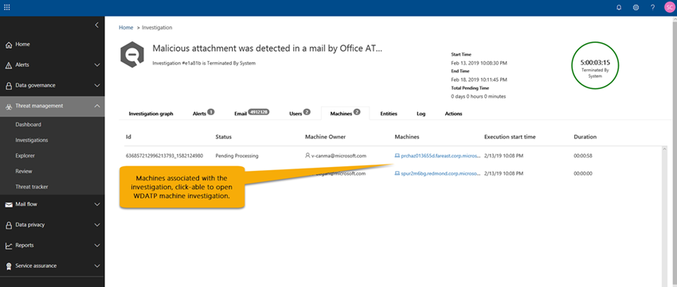

# Office 365 위협 인텔리전스를 사용한 자동화 된 조사 및 응답 (AIR)Automated Investigation and Response (AIR) with Office 365 Threat Intelligence

자동화 된 조사 및 응답 (AIR) ( [Office 365 위협 조사 및 응답 기능](office-365-ti.md)에 예정 됨)-오늘 발생 하는 잘 알려진 위협에 대해 자동 조사 및 업데이트를 실행할 수 있습니다.Automated Investigation and Response (AIR) (coming soon to [Office 365 Threat investigation and response capabilities](office-365-ti.md)) enables you to run automated investigation and remediation to well-known threats that exist today. 이 문서를 읽으면 AIR에 대 한 개요를 확인 하 고 조직은 위협을 보다 효율적이 고 효율적으로 완화 하는 데 도움이 될 수 있습니다.Read this article to get an overview of AIR and how it can help your organization mitigate threats more effectively and efficiently. AIR을 사용할 수 있는 경우에 대 한 자세한 내용은 [Microsoft 365 로드맵](https://www.microsoft.com/microsoft-365/roadmap)Tolearn를 참조 하세요.Tolearn more about when AIR will be available, see the [Microsoft 365 Roadmap](https://www.microsoft.com/microsoft-365/roadmap).

## 경고Alerts

[경고](alert-policies.md#viewing-alerts) 는 보안 운영 팀 워크플로에서 문제를 대응 하기 위한 트리거를 나타냅니다.[Alerts](alert-policies.md#viewing-alerts) represent triggers for Security Operations team workflows for incident response. 조사에 대 한 적절 한 알림 집합의 우선 순위를 지정 하 여 위협에 대 한 위협이 발생 하지 않도록 합니다.Prioritizing the right set of alerts for investigation while making sure no threats are unaddressed is challenging. 경고에 대 한 조사가 수동으로 수행 되 면 보안 운영 팀이 엔터티 (예: 콘텐츠, 장치 및 사용자)를 위협 으로부터 찾아서 상호 연결 해야 합니다.When investigations into alerts are performed manually, Security Operations teams must hunt and correlate entities (e.g. content, devices and users) at risk from threats. 이러한 작업과 워크플로는 시간을 많이 소비 하며 여러 도구와 시스템을 포함 합니다.Such tasks and workflows are very time consuming and involve multiple tools and systems. AIR을 사용 하는 경우 조사 및 응답은 보안 대응 playbook 자동으로 트리거하는 주요 보안 및 위협 관리 경고로 자동화 됩니다.With AIR, investigation and response are automated into key security and threat management alerts that trigger your security response playbooks automatically. 

알림을 보려면 Office 365 보안 & 준수 센터에서 경고 \*\*\*\* > **보기 경고**를 선택 합니다.To view alerts, in the Office 365 Security & Compliance Center, choose **Alerts** > **View alerts**.

 

알림을 선택 하 여 세부 정보를 확인 하 고, **보기 조사** 링크를 사용 하 여 해당 [조사](#investigation-graph)로 이동 합니다.Select an alert to view its details, and from there, use the **View investigation** link to go to the corresponding [investigation](#investigation-graph).

## 보안 playbookSecurity playbooks

보안 playbook는 Microsoft Threat Protection의 자동화 핵심에 있는 백 엔드 정책입니다.Security playbooks are back-end policies that are at the heart of automation in Microsoft Threat Protection. AIR에서 제공 되는 보안 playbook은 일반적인 실제 보안 시나리오를 기반으로 합니다.The security playbooks provided in AIR are based on common real-world security scenarios. 조직 내에서 경고가 트리거될 때 보안 playbook 자동으로 실행 됩니다.A security playbook is launched automatically when an alert is triggered within your organization. 알림이 트리거되어 연결 된 playbook 자동으로 실행 됩니다.Once the alert triggers, the associated playbook is run automatically. playbook에서 조사를 실행 하 여 연결 된 모든 메타 데이터 (전자 메일 메시지, 사용자, 제목, 보낸 사람 등)를 보고, 결과에 따라 조직의 보안 팀이 제어 및 완화할 수 있는 일련의 작업을 권장 합니다. 위협입니다.The playbook runs an investigation, looking at all the associated metadata (including email messages, users, subjects, senders, etc.) and, based on its findings, recommends a set of actions that your organization's security team can take to control and mitigate the threat. 

AIR에서 제공 하는 보안 playbook은 조직이 현재 직면 하 고 있는 가장 빈번한 위협을 처리 하도록 설계 되었습니다.The security playbooks you'll get with AIR are designed to tackle the most frequent threats that organizations face today. Microsoft 자산을 보호 하는 데 도움이 되는 사용자를 비롯 하 여 보안 작업 및 사건 대응 팀의 입력을 기반으로 합니다.They're based on input from Security Operations and Incident Response teams, including those who help defend Microsoft assets.

### 보안 playbook가 단계별로 롤아웃 됨Security playbooks are rolling out in phases

AIR의 일환으로 보안 playbook가 단계별로 배포 됨As part of AIR, security playbooks are rolling out in phases

- **1 단계 (2019 년 4 월)**: playbooks에는 보안 관리자가 검토 하 고 승인할 추천 사항이 포함 되어 있습니다.**Phase 1 (April 2019)**: Playbooks include recommendations that security administrators review and approve. 

- **2 단계 (6 월 2019)**: 보안 관리자는 관리 상호 작용 없이 보안 playbook가 자동으로 작업을 수행할 수 있도록 허용 하는 옵션을 갖게 됩니다.**Phase 2 (June 2019)**: Security administrators will have the option to allow security playbooks to take action automatically, without administrative interaction.

1 단계에는 다음과 같은 playbooks가 포함 됩니다.Phase 1 will include the following playbooks:
- 사용자가 보고 한 피싱 메시지User-reported phish message
- URL 결과 change and ATP 안전한 링크 차단 재정의를 클릭 합니다.URL click verdict change and ATP Safe Links block override
- 맬웨어 ZAPMalware ZAP
- 피싱 ZAPPhish ZAP
- 수동 조사 (탐색기 사용)Manual investigations (using Explorer)

2 단계에 대 한 몇 가지 더 많은 playbook 계획 됩니다.Several more playbooks are planned for Phase 2.

### playbooks에는 조사 및 권장 사항이 포함 되어 있습니다.Playbooks include investigation and recommendations

각 playbook에는 다음이 포함 됩니다.Each playbook includes: 
- 루트 조사를a root investigation, 
- 다른 잠재적 위협을 사냥 하는 단계steps to hunt down other potential threats, and 
- 권장 되는 위협 수정recommended threat remediation.

각 상위 단계에는 위협에 대 한 심층적이 고 자세한 응답을 제공 하기 위해 실행 되는 여러 하위 단계가 포함 됩니다.Each high-level step includes many sub-steps that are executed to provide a deep, detailed, and exhaustive response to threats.

## 예: 사용자가 보고 한 피싱 메시지Example: User-reported phish message

조직의 사용자가 전자 메일 메시지를 전송 하 고 [outlook 또는 outlook Web Access 용 보고서 메시지 추가 기능](enable-the-report-message-add-in.md)을 사용 하 여 Microsoft에 보고 하는 경우When a user in your organization submits an email message and reports it to Microsoft by using the [Report Message add-in for Outlook or Outlook Web Access](enable-the-report-message-add-in.md). 이는 조사 playbook를 자동으로 시작 하는 시스템 기반 정보 알림을 트리거합니다.This triggers a system-based informational alert that automatically launches the investigation playbook.

루트 조사 단계에서는 전자 메일의 다양 한 측면을 평가 합니다.During the root investigation phase, various aspects of the email are assessed. 다음과 같은 다양한 알고리즘과 방법이 있습니다.These include:
- 사용할 수 있는 위협의 유형에 대 한 결정A determination about what type of threat it might be;
- 보낸 사람Who sent it;
- 전자 메일이 전송 되는 위치 (보내는 인프라)Where the email was sent from (sending infrastructure);
- 전자 메일의 다른 인스턴스가 배달 되거나 차단 되었는지 여부Whether other instances of the email were delivered or blocked;
- 분석가의 평가An assessment from our analysts;
- 전자 메일이 알려진 캠페인과 연결 되어 있는지 여부Whether the email is associated with any known campaigns;
- 등이 있습니다.and more.

루트 조사가 완료 된 후에는 playbook에서 수행할 권장 작업 목록을 제공 합니다.After the root investigation is complete, the playbook provides a list of recommended actions to take.
  
다음으로 몇 가지 구하기 단계가 실행 됩니다.Next, several hunting steps are executed:

- 다른 전자 메일 클러스터의 유사한 전자 메일 메시지가 검색 됩니다.Similar email messages in other email clusters are searched.
- 신호가 [Windows Defender ATP](https://docs.microsoft.com/windows/security/threat-protection/windows-defender-atp/windows-defender-advanced-threat-protection)와 같은 다른 플랫폼과 공유 됩니다.The signal is shared with other platforms, such as [Windows Defender ATP](https://docs.microsoft.com/windows/security/threat-protection/windows-defender-atp/windows-defender-advanced-threat-protection).
- 사용자가 의심 스러운 전자 메일 메시지를 클릭 했는지 여부가 결정 됩니다.A determination is made on whether any users have clicked through on the suspicious email message.
- 사용자가 보고 하는 다른 유사한 메시지가 있는지 확인 하기 위해 Office 365 [EOP](eop/exchange-online-protection-eop.md) 및 [ATP](office-365-atp.md) 전체에서 확인을 수행 합니다.A check is done across Office 365 [EOP](eop/exchange-online-protection-eop.md) and [ATP](office-365-atp.md) to see if there are any other similar messages reported by users.
- 사용자가 손상 되었는지 확인 하는 검사를 수행 합니다.A check is done to see if a user has been compromised. 이 검사에서는 [Microsoft Cloud App Security](https://docs.microsoft.com/cloud-app-security) 및 [Azure Active Directory](https://docs.microsoft.com/azure/active-directory)에서 발생 하는 신호를 활용 하 여 관련 된 이벤트 또는 경고를 상관 시킵니다.This check leverages signals across [Microsoft Cloud App Security](https://docs.microsoft.com/cloud-app-security) and [Azure Active Directory](https://docs.microsoft.com/azure/active-directory), correlating any related events or alerts. 

사냥 단계에서는 위험과 위협이 다양 한 구하기 단계에 할당 됩니다.During the hunting phase, risks and threats are assigned to various hunting steps.  

재구성은 playbook의 마지막 단계입니다.Remediation is the final phase of the playbook. 이 단계에서는 조사 및 구하기 단계를 기반으로 하 여 수정 단계를 수행 합니다.During this phase, remediation steps are taken, based on theinvestigation and hunting phases.  

## 시작Getting started

office 365 전역 관리자 또는 보안 관리자로 조사에 액세스 하려면 office 365 security & 준수 센터 ([https://protection.office.com](https://protection.office.com))로 이동 하 여 로그인 합니다.To access your investigations, as an Office 365 global administrator or security administrator, Go to the Office 365 Security & Compliance Center ([https://protection.office.com](https://protection.office.com)) and sign in. 다음 중 하나를 수행합니다.Then, do one of the following:

- 왼쪽 탐색에서 **위협 관리** > **조사**로 이동 합니다.In the left navigation, go to **Threat management** > **Investigations**.

    또는or

- 보안 & 준수 센터에서 **위협 관리** > **대시보드로**이동 하 여 위협 관리 대시보드를 방문 합니다.Visit the Threat management dashboard (In the Security & Compliance Center, go to **Threat management** > **Dashboard**).

무선 위젯은 [보안 대시보드의](security-dashboard.md)위쪽에 표시 됩니다.Your AIR widgets will appear across the top of the [Security Dashboard](security-dashboard.md). 시작 하려면 위젯을 선택 합니다.Select a widget to get started.

### 자동화 된 조사Automated investigations

자동화 된 조사 페이지에 조직의 조사 및 현재 상태가 표시 됩니다.The automated investigations page shows your organization's investigations and their current states.

 
  
예를 들어 다음을 수행할 수 있습니다.You can:
- 조사로 직접 이동 합니다 ( **조사 ID**선택).Navigate directly to an investigation (select an **Investigation ID**).
- 필터를 적용 합니다.Apply filters. **조사 유형**, **시간 범위**, **상태**또는 이들의 조합 중에서 선택 합니다.Choose from **Investigation Type**, **Time range**, **Status**, or a combination of these.
- 데이터를 CSV 파일로 내보냅니다.Export the data to a CSV file.

### 조사 그래프Investigation graph

특정 조사를 열면 조사 그래프 페이지가 표시 됩니다.When you open a specific investigation, you see the investigation graph page. 이 페이지에는 전자 메일 메시지, 사용자 (및 해당 활동), 트리거된 알림의 일부로 자동 조사 되는 장치 등의 다양 한 엔터티가 모두 표시 됩니다.This page shows all the different entities: email messages, users (and their activities), and devices that were automatically investigated as part of the alert that was triggered.

예를 들어 다음을 수행할 수 있습니다.You can:
- 현재 조사에 대 한 시각적 개요를 볼 수 있습니다.Get a visual overview of the current investigation.
- 조사 시간에 대 한 요약을 봅니다.View a summary of the investigation timings.
- 시각화에서 노드를 선택 하 여 해당 노드의 세부 정보를 확인 합니다.Select a node in the visualization to view details for that node.
- 위쪽에서 탭을 선택 하 여 해당 탭의 세부 정보를 확인 합니다.Select a tab across the top to view details for that tab.

### 경고 조사Alert investigation

조사에 대 한 **알림** 탭에서 조사와 관련 된 모든 경고를 볼 수 있습니다.On the **Alerts** tab for an investigation, you can see all of the alerts relevant to the investigation. 세부 정보에는 조사를 트리거한 경고와 확인에 상관 된 위험한 로그인, 대량 다운로드 등의 기타 알림이 포함 됩니다.Details include the alert that triggered the investigation and other alerts, such as risky sign-in, mass download, etc., that are correlated to the investigation. 이 페이지에서는 보안 분석가가 개별 경고에 대 한 추가 세부 정보를 볼 수도 있습니다.From this page, a security analyst can also view additional details on individual alerts.

예를 들어 다음을 수행할 수 있습니다.You can:
- 현재 트리거하는 경고 및 관련 경고에 대 한 시각적 개요를 볼 수 있습니다.Get a visual overview of the current triggering alert and any associated alerts.
- 목록에서 알림을 선택 하 여 전체 알림 세부 정보를 표시 하는 플라이 아웃 페이지를 엽니다.Select an alert in the list to open a fly-out page that shows full alert details.

### 전자 메일 조사Email investigation

조사를 위해 **전자 메일** 탭에서 조사 중에 식별 된 모든 전자 메일 클러스터를 볼 수 있습니다.On the **Email** tab for an investigation, you can see all the email clusters identified as part of the investigation. 

조직의 사용자가 보내고 받는 전자 메일 양이 주어 지 면Given the sheer volume of email that users in an organization send and receive, the process of 
- 메시지 헤더, 본문, URL 및 첨부 파일의 비슷한 특성에 따라 전자 메일 메시지를 클러스터링 합니다.clustering email messages based on similar attributes from a message header, body, URL and attachment; 
- 악성 전자 메일과 좋은 전자 메일을 구분 합니다. 한separating malicious email from the good email; and 
- 악성 전자 메일 메시지에 대 한 작업 수행taking action on malicious email messages 

몇 시간 정도 걸릴 수 있습니다.can take many hours. 이제 AIR에서이 프로세스를 자동화 하 여 조직의 보안 팀 시간과 노력을 절약 합니다.AIR now automates this process, saving your organization's security team time and effort. 

예를 들어 다음과 같은 이미지를 고려해 보십시오.As an example, consider the following image. 세 개의 전자 메일 메시지 중 첫 번째 클러스터는 피싱 것으로 간주 됩니다.The first cluster of three email messages were deemed to be phish. 이러한 메시지 중 일부는 초기 검색 중에 피싱으로 식별 되었기 때문에 같은 IP 및 주체를 포함 하는 유사한 메시지가 있는 다른 클러스터가 발견 되어 악성으로 간주 됩니다.Another cluster of similar messages with the same IP and subject was found and is considered to be malicious, as some of them were identified as phish during initial detection. 

예를 들어 다음을 수행할 수 있습니다.You can:
- 현재 클러스터링 결과 및 발견 된 위협에 대 한 시각적 개요를 볼 수 있습니다.Get a visual overview of the current clustering results and threats found.
- 클러스터 엔터티 또는 위협 목록을 클릭 하 여 전체 알림 세부 정보를 표시 하는 플라이 아웃 페이지를 엽니다.Click a cluster entity or a threat list to open a fly-out page that shows the full alert details.

### 사용자 조사User investigation

**사용자** 탭에서는 조사의 일부로 식별 된 모든 사용자를 볼 수 있습니다.On the **Users** tab, you can see all the users identified as part of the investigation. 

예를 들어 다음 이미지에서 AIR은 생성 된 새 받은 편지함 규칙을 기반으로 하는 손상 및 예외 표시등을 식별 했습니다.For example, in the following image, AIR has identified indicators of compromise and anomalies based on a new inbox rule that was created. 조사에 대 한 자세한 내용은이 탭 내의 자세한 보기를 통해 확인할 수 있습니다.Additional details (evidence) of the investigation are available through detailed views within this tab.

예를 들어 다음을 수행할 수 있습니다.You can:
- 발견 된 사용자 결과 및 위험에 대 한 시각적 개요를 확인 하세요.Get a visual overview of identified user results and risks found.
- 전체 알림 세부 정보를 표시 하는 플라이 아웃 페이지를 열 사용자를 선택 합니다.Select a user to open a fly-out page that shows the full alert details.

### 컴퓨터 조사Machine investigation

**컴퓨터** 탭에서 조사 과정으로 식별 된 모든 컴퓨터를 볼 수 있습니다.On the **Machines** tab, you can see all the machines identified as part of the investigation. 

조사 과정에서 AIR은 전자 메일 위협의 상관 관계를 장치에 맞게 합니다.As part of the investigation, AIR correlates email threats to devices. 예를 들어 조사를 통해 조사를 위해 [Windows Defender ATP](https://docs.microsoft.com/windows/security/threat-protection/windows-defender-atp/windows-defender-advanced-threat-protection) 에 파일 해시를 전달 합니다.For example, an investigation passes a file hash across to [Windows Defender ATP](https://docs.microsoft.com/windows/security/threat-protection/windows-defender-atp/windows-defender-advanced-threat-protection) to investigate. 이렇게 하면 사용자에 대 한 관련 시스템을 자동으로 조사 하 고 클라우드 및 장치 전체에서 위협이 해결 되도록 할 수 있습니다.This allows for automated investigation of relevant machines for your users and helps to ensure that threats are addressed both in the cloud and across your devices. 

예를 들어 다음을 수행할 수 있습니다.You can:
- 발견 된 현재 컴퓨터 및 위협에 대 한 시각적 개요를 볼 수 있습니다.Get a visual overview of the current machines and threats found.
- 컴퓨터를 선택 하 여 관련 [Windows Defender ATP 조사](https://docs.microsoft.com/windows/security/threat-protection/windows-defender-atp/automated-investigations-windows-defender-advanced-threat-protection)에 대 한 보기를 엽니다.Select a machine to open a view that into the related [Windows Defender ATP investigations](https://docs.microsoft.com/windows/security/threat-protection/windows-defender-atp/automated-investigations-windows-defender-advanced-threat-protection).

### 엔터티 조사Entity investigation

**엔터티** 탭에서 조사 중에 식별 된 모든 컴퓨터를 볼 수 있습니다.On the **Entities** tab, you can see all the machines identified as part of the investigation. 

여기에서 조사 된 엔터티를 볼 수 있습니다.Here, you can see the investigated entities. 전자 메일 메시지, 클러스터, IP 주소, 사용자 등의 엔터티 유형에 대 한 세부 정보를 볼 수 있습니다.You can see details of the types of entities, such as email messages, clusters, IP addresses, users, and more. 또한 분석 된 엔터티 수와 각 엔터티가 연결 된 위협을 볼 수 있습니다.You can also see how many entities were analyzed, and the threats that were associated with each. 

예를 들어 다음을 수행할 수 있습니다.You can:
- 발견 된 조사 엔터티 및 위협에 대 한 시각적 개요를 확인 하세요.Get a visual overview of the investigation entities and threats found.
- 엔터티를 선택 하 여 관련 엔터티 세부 정보를 표시 하는 플라이 아웃 페이지를 엽니다.Select an entity to open a fly-out page that shows the related entity detail.

### Playbook 로그Playbook log

**로그** 탭에서는 조사 중에 발생 한 모든 playbook 단계를 볼 수 있습니다.On the **Log** tab, you can see all the playbook steps that have occurred during the investigation. 로그는 AIR의 일부로, Office 365 위협 인텔리전스 기능에 의해 완료 된 모든 작업의 전체 인벤토리를 캡처합니다.The log captures a complete inventory of all actions completed by Office 365 Threat Intelligence capabilities as part of AIR. 작업 자체, 설명, 실제 시작 날짜를 포함 하 여 수행 된 모든 단계를 명확 하 게 확인할 수 있습니다.It provides a clear view of all the steps taken, including the Action itself, a description and the duration of the actual from start to finish. 

예를 들어 다음을 수행할 수 있습니다.You can:
- playbook 수행 된 단계에 대 한 시각적 개요를 참조 하세요.Get see a visual overview of the playbook steps taken.
- 결과를 CSV 파일로 내보냅니다.Export the results to a CSV file.
- 보기를 필터링 합니다.Filter the view.

### 권장 작업Recommended actions

조사가 완료 된 후에 수정이 권장 되는 모든 playbook 작업을 **작업** 탭에서 확인할 수 있습니다.On the **Actions** tab, you can see all the playbook actions that are recommended for remediation after the investigation has completed. 

작업 조사를 마칠 때까지 Microsoft에서 권장 하는 모든 단계의 전체 목록을 캡처합니다.Actions capture a complete list of all the steps Microsoft recommends you take at the end of a investigation. 하나 이상의 작업을 선택 하 여 여기에서 수정 작업을 수행할 수 있습니다.You can take remediation actions here by selecting one or more actions. **승인을** 클릭 하면 재구성을 시작할 수 있습니다.Clicking **Approve** will allow remediation to begin. 적절 한 사용 권한이 필요할 수도 있습니다.(Appropriate permissions might be required. 예를 들어 보안 독자는 작업을 볼 수 있지만 승인 하지는 않습니다.For example, a Security Reader can view actions but not approve them.)  

예를 들어 다음을 수행할 수 있습니다.You can:
- playbook 권장 작업에 대 한 시각적 개요를 볼 수 있습니다.Get a visual overview of the playbook-recommended actions.
- 단일 작업 또는 여러 작업을 선택 합니다.Select a single action or multiple actions.
- 권장 작업을 승인 합니다.Approve recommended actions. 이러한 작업은 설명과 함께 즉시 시작 됩니다.(These are started immediately with comments.)
- 결과를 CSV 파일로 내보냅니다.Export the results to a CSV file.
- 보기를 필터링 합니다.Filter the view.

## 공기를 얻는 방법How to get AIR

현재는 AIR이 미리 보기에 있습니다.Currently, AIR is in preview. 출시 될 때 AIR은 다음 구독에 포함 됩니다.When released, AIR will be included in the following subscriptions:

- Microsoft 365 Enterprise E5Microsoft 365 Enterprise E5
- Office 365 Enterprise E5Office 365 Enterprise E5
- Microsoft Threat ProtectionMicrosoft Threat Protection
- Office 365 Advanced Threat Protection 계획 2Office 365 Advanced Threat Protection Plan 2

기능 가용성에 대 한 자세한 내용은 [Microsoft 365 로드맵](https://www.microsoft.com/microsoft-365/roadmap)를 참조 하세요.To learn more about feature availability, visit the [Microsoft 365 Roadmap](https://www.microsoft.com/microsoft-365/roadmap).
