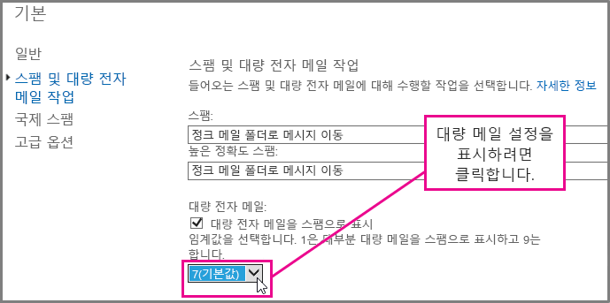
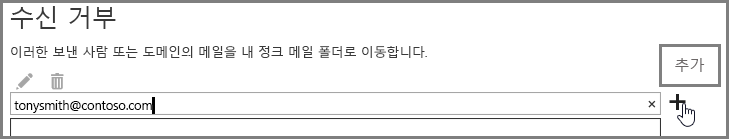

# <a name="block-email-spam-with-the-office-365-spam-filter-to-prevent-false-negative-issues"></a><span data-ttu-id="b19b3-103">Office 365 스팸 필터로 전자 메일 스팸을 차단하여 거짓 부정 문제 방지</span><span class="sxs-lookup"><span data-stu-id="b19b3-103">Block email spam with the Office 365 spam filter to prevent false negative issues</span></span>

<span data-ttu-id="b19b3-p101">EOP(Exchange Online Protection)는 스팸 및 맬웨어로부터 조직을 보호하는 데 도움이 되는 클라우드 기반 전자 메일 필터링 서비스입니다. Office 365에 사서함이 있는 경우 이미 기본적으로 EOP에 의해 보호되고 있는 것입니다.</span><span class="sxs-lookup"><span data-stu-id="b19b3-p101">Exchange Online Protection (EOP) is a cloud-based email filtering service that helps protect your organization against spam and malware. If you have mailboxes in Office 365, they are already protected by default with EOP.</span></span> 
  
<span data-ttu-id="b19b3-p102">Office 365 스팸 필터를 조정하여 스팸 및 정크 메일 메시지가 차단되도록 할 수 있습니다. 이렇게 하면 전자 메일 스팸이 사용자 사서함으로 전송되도록 허용하는 거짓 부정 문제를 방지하는 데 도움이 됩니다. Exchange Online 또는 EOP(Exchange Online Protection) 관리자는 다음 단계에 따라 Office 365 스팸 방지 필터를 조정하고, 스팸이 사용자 받은 편지함으로 배달되지 않도록 합니다.</span><span class="sxs-lookup"><span data-stu-id="b19b3-p102">You can help to ensure spam and junk messages are blocked by adjusting your Office 365 spam filter. This helps to prevent the false negative issue, where email spam is allowed through to a user inbox. As an Exchange Online or Exchange Online Protection (EOP) administrator, use the following steps to adjust your Office 365 anti-spam filter and help prevent spam from being delivered to your user's inboxes.</span></span>
  
## <a name="customize-the-office-365-anti-spam-filter-with-these-settings"></a><span data-ttu-id="b19b3-109">이러한 설정을 사용하여 Office 365 스팸 방지 필터 사용자 지정</span><span class="sxs-lookup"><span data-stu-id="b19b3-109">Customize the Office 365 anti-spam filter with these settings</span></span>

<span data-ttu-id="b19b3-p103">관리자는 몇 가지 Office 365 스팸 필터 설정을 사용하여 전자 메일 스팸이 사용자 받은 편지함으로 전송되지 않도록 할 수 있습니다. 여기에 나열된 옵션을 사용할 경우 Office 365 스팸 필터로 전자 메일 스팸을 보다 잘 차단하고 거짓 부정 메시지를 방지할 수 있습니다. 이 컨텍스트에서 거짓 부정이란 사용자 받은 편지함에 전송되는 전자 메일 스팸 또는 정크 메일 메시지를 나타냅니다.</span><span class="sxs-lookup"><span data-stu-id="b19b3-p103">An Admin can use several Office 365 spam filter settings to help prevent email spam from being sent to a user inbox. The Office 365 spam filter will become better able to block email spam and prevent false negative messages if you use the options listed here. In this context, a false negative refers to email spam or junk messages that are getting sent to a user inbox.</span></span>
  
### <a name="block-ip-addresses-with-a-connection-filter"></a><span data-ttu-id="b19b3-113">연결 필터를 사용하여 IP 주소 차단</span><span class="sxs-lookup"><span data-stu-id="b19b3-113">Block IP addresses with a connection filter</span></span>

<span data-ttu-id="b19b3-114">연결 필터 IP 차단 목록에 보낸 사람의 IP 주소를 추가하여 Office 365 스팸 필터를 사용자 지정합니다.</span><span class="sxs-lookup"><span data-stu-id="b19b3-114">Customize your Office 365 spam filter by adding the sender IP address to the connection filter IP block list:</span></span>
  
1. <span data-ttu-id="b19b3-115">[메시지 헤더 분석기](https://go.microsoft.com/fwlink/p/?LinkId=306583)에 설명된 대로 Outlook 또는 Outlook Web App과 같은 메일 클라이언트에서 차단하려는 메시지의 헤더를 가져옵니다.</span><span class="sxs-lookup"><span data-stu-id="b19b3-115">Obtain the headers for the message you want to block in your mail client such as Outlook or Outlook Web App, as described in [Message Header Analyzer](https://go.microsoft.com/fwlink/p/?LinkId=306583).</span></span>
    
2. <span data-ttu-id="b19b3-116">[메시지 헤더 분석기](https://testconnectivity.microsoft.com/?tabid=mha)를 사용하거나 수동으로 X-Forefront-Antispam-Report 헤더에서 CIP 태그 다음에 나오는 IP 주소를 검색합니다.</span><span class="sxs-lookup"><span data-stu-id="b19b3-116">Search for the IP address following the CIP tag in the X-Forefront-Antispam-Report header using the [message header analyzer](https://testconnectivity.microsoft.com/?tabid=mha) or manually.</span></span> 
    
3. <span data-ttu-id="b19b3-117">[연결 필터 정책 구성](https://technet.microsoft.com/ko-KR/library/jj200718%28v=exchg.150%29.aspx)의 "EAC를 사용하여 기본 연결 필터 정책 편집"에 나와 있는 단계에 따라 IP 차단 목록에 IP 주소를 추가합니다.</span><span class="sxs-lookup"><span data-stu-id="b19b3-117">Add the IP address to the IP Block list by following the steps in "Use the EAC to edit the default connection filter policy" in [Configure the Connection Filter Policy](https://technet.microsoft.com/ko-KR/library/jj200718%28v=exchg.150%29.aspx).</span></span>
    
### <a name="block-bulk-mail-with-transport-rules-or-the-spam-filter"></a><span data-ttu-id="b19b3-118">전송 규칙 또는 스팸 필터를 사용하여 대량 메일 차단</span><span class="sxs-lookup"><span data-stu-id="b19b3-118">Block bulk mail with transport rules or the spam filter</span></span>

<span data-ttu-id="b19b3-p104">스팸이 회보나 프로모션과 같이 주로 대량 메일인가요? [전송 규칙을 사용하여 적극적으로 대량 전자 메일 메시지를 필터링](https://technet.microsoft.com/ko-KR/library/dn720438%28v=exchg.150%29.aspx)하거나 스팸 필터의 [고급 스팸 필터링 옵션](https://technet.microsoft.com/ko-KR/library/jj200750%28v=exchg.150%29.aspx)에서 **에서 대량 메일** 설정을 사용하도록 설정한 경우 Office 365에서 스팸 필터를 사용자 지정할 수 있습니다. Exchange 관리 센터에서 **보호** \> **콘텐츠 필터**를 클릭한 다음 조정하려는 필터 정책을 두 번 클릭하여 시작합니다. **스팸 및 대량 전자 메일 작업**을 클릭하고 다음과 같이 설정을 조정합니다.</span><span class="sxs-lookup"><span data-stu-id="b19b3-p104">Is the spam primarily bulk mail, for example, newsletters or promotions? You can customize the spam filter in Office 365 if you [Use transport rules to aggressively filter bulk email messages](https://technet.microsoft.com/ko-KR/library/dn720438%28v=exchg.150%29.aspx) or turn on the **Bulk mail** setting in your spam filter's [Advanced Spam Filtering Options](https://technet.microsoft.com/ko-KR/library/jj200750%28v=exchg.150%29.aspx). In the Exchange Admin center, get started by clicking **Protection** \> **Content filter** and then double click the filter policy you want to adjust. Click **Spam and bulk mail actions** to adjust the settings, as shown here.</span></span> 
  

  
### <a name="block-email-spam-using-spam-filter-block-lists"></a><span data-ttu-id="b19b3-124">스팸 필터 차단 목록을 사용하여 전자 메일 스팸 차단</span><span class="sxs-lookup"><span data-stu-id="b19b3-124">Block email spam using spam filter block lists</span></span>

<span data-ttu-id="b19b3-p105">[스팸 필터 정책을 구성](https://technet.microsoft.com/ko-KR/library/jj200684%28v=exchg.150%29.aspx)하여 스팸 필터의 보낸 사람 차단 목록에 보낸 사람 주소를 추가하거나 도메인 차단 목록에 도메인을 추가합니다. 스팸 필터 차단 목록에 있는 보낸 사람 또는 도메인에서 보낸 전자 메일은 스팸으로 표시됩니다.</span><span class="sxs-lookup"><span data-stu-id="b19b3-p105">[Configure your spam filter policies](https://technet.microsoft.com/ko-KR/library/jj200684%28v=exchg.150%29.aspx) to add the sender address to the sender block list or domain to the domain block list in the spam filter. Emails from a sender or domain on a spam filter block list will marked as spam.</span></span> 
  
### <a name="advanced-spam-filtering-options"></a><span data-ttu-id="b19b3-127">고급 스팸 필터링 옵션</span><span class="sxs-lookup"><span data-stu-id="b19b3-127">Advanced Spam Filtering Options</span></span>

<span data-ttu-id="b19b3-128">[스팸 필터 정책을 구성](https://technet.microsoft.com/ko-KR/library/jj200684%28v=exchg.150%29.aspx)하고 추가 [고급 스팸 필터링 옵션](https://technet.microsoft.com/ko-KR/library/jj200750%28v=exchg.150%29.aspx)을 사용하도록 설정합니다.</span><span class="sxs-lookup"><span data-stu-id="b19b3-128">[Configure your spam filter policies](https://technet.microsoft.com/ko-KR/library/jj200684%28v=exchg.150%29.aspx) and turn on additional [Advanced Spam Filtering Options](https://technet.microsoft.com/ko-KR/library/jj200750%28v=exchg.150%29.aspx).</span></span>
  
<span data-ttu-id="b19b3-p106">전체 조직에 적용되는 추가 스팸 설정에 대해서는 [수신 허용 목록 또는 기타 방법으로 스팸으로 표시된 거짓 부정 전자 메일 차단](prevent-email-from-being-marked-as-spam-0.md)을 참조하세요. 관리자 수준의 제어 능력이 있고 거짓 부정을 방지하려는 경우에 유용합니다.</span><span class="sxs-lookup"><span data-stu-id="b19b3-p106">For more spam settings that apply to the whole organization, take a look at [Prevent false positive email marked as spam with a safelist or other techniques](prevent-email-from-being-marked-as-spam-0.md). This is helpful if you have administrator-level control and you want to prevent false positives.</span></span>
  
## <a name="email-users-can-also-help-ensure-that-false-negative-and-email-spam-is-blocked-with-office-365-spam-filter"></a><span data-ttu-id="b19b3-131">전자 메일 사용자도 Office 365 스팸 필터로 거짓 부정 및 전자 메일 스팸이 차단되도록 할 수 있습니다.</span><span class="sxs-lookup"><span data-stu-id="b19b3-131">Email users can also help ensure that false negative and email spam is blocked with Office 365 spam filter</span></span>

<span data-ttu-id="b19b3-p107">사용자에게 [Outlook](https://go.microsoft.com/fwlink/p/?LinkId=270065) 또는 [Outlook Web App](https://go.microsoft.com/fwlink/p/?LinkId=294862)에서 차단된 보낸 사람 목록에 스팸 보낸 사람 주소를 추가하도록 할 경우 거짓 부정 및 정크 메일을 방지하려는 Office 365 스팸 방지 노력에 도움이 됩니다. 여기에 표시된 것처럼 먼저 Outlook Web App에서 **설정** \> **옵션** \> **차단 또는 허용**을 클릭하고 **수신 거부** 목록에 해당 주소를 추가합니다.</span><span class="sxs-lookup"><span data-stu-id="b19b3-p107">It will help your Office 365 anti-spam efforts to prevent false negatives and junk mail if you tell your users to add the spam sender address to their blocked sender list in [Outlook](https://go.microsoft.com/fwlink/p/?LinkId=270065) or [Outlook Web App](https://go.microsoft.com/fwlink/p/?LinkId=294862). In Outlook Web App, get started by clicking **Settings** \> **Options** \> **Block or allow**, and then adding the address to the **Blocked senders** list, as shown here.</span></span> 
  

  
> [!NOTE]
> <span data-ttu-id="b19b3-135">수신 허용 - 보낸 사람 목록에 대한 자세한 내용은 [수신 허용 - 보낸 사람 및 수신 거부 목록 FAQ](https://technet.microsoft.com/ko-KR/library/dn133608%28v=exchg.150%29.aspx)를 참조하세요.</span><span class="sxs-lookup"><span data-stu-id="b19b3-135">For more detailed information about safe sender lists, see [Safe Sender and Blocked Sender Lists FAQ](https://technet.microsoft.com/ko-KR/library/dn133608%28v=exchg.150%29.aspx).</span></span> 
  
<span data-ttu-id="b19b3-p108">이 하위 섹션의 이전 단락은 EOP를 온-프레미스 전자 메일 시스템을 보호하기 위한 서비스로 또는 하이브리드 전자 메일 배포의 일부로 사용하는 고객에게만 적용됩니다. [Exchange Online Protection 홈 페이지](https://products.office.com/ko-KR/exchange/exchange-email-security-spam-protection)에서 EOP에 대해 자세히 알아보세요.</span><span class="sxs-lookup"><span data-stu-id="b19b3-p108">The previous paragraphs in this subsection applies only to customers who use EOP as service to protect on-premises email systems or as part of a hybrid email deployment. Learn more about EOP at the [Exchange Online Protection home page](https://products.office.com/ko-KR/exchange/exchange-email-security-spam-protection).</span></span>
  
## <a name="eop-only-customers-set-up-the-office-365-spam-filter-to-block-email-spam"></a><span data-ttu-id="b19b3-138">EOP 전용 고객: 전자 메일 스팸을 차단하도록 Office 365 스팸 필터 설정</span><span class="sxs-lookup"><span data-stu-id="b19b3-138">EOP-only customers: Set up the Office 365 spam filter to block email spam</span></span>

<span data-ttu-id="b19b3-p109">온-프레미스 사서함을 사용하는 EOP 전용 고객: 정크 메일 폴더로 메시지 이동 기본 동작에 대해 스팸 필터를 설정하는 경우, 스팸이 각 사용자의 정크 메일 폴더로 라우팅되는지 확인에 제공된 필수 단계를 따르세요. 여기에서 별도 항목으로 제공되는 Exchange 관리 셸 명령과 셸 시작 방법에 대한 일반 정보의 링크를 사용하여 단계를 쉽게 수행할 수 있습니다.</span><span class="sxs-lookup"><span data-stu-id="b19b3-p109">For EOP-only customers with on-premises mailboxes: If you setup a spam filter for the default action, Move message to Junk Email folder, follow the required steps provided in Ensure that spam is routed to each user's Junk Email folder. We've tried to make this easy by providing the Exchange Management Shell commands in a separate topic, as well as a link to more general information about how to get started with the shell.</span></span>
  
<span data-ttu-id="b19b3-p110">디렉터리 동기화를 통해 사용자 설정과 서비스를 동기화하여 수신 거부 목록을 적용하면 거짓 부정 전자 메일 스팸을 방지할 수 있습니다. 자세한 내용은 EOP에서 메일 사용자 관리에 나와 있는 “디렉터리 동기화를 사용하여 메일 사용자 관리”를 참조하세요.</span><span class="sxs-lookup"><span data-stu-id="b19b3-p110">It will help you to avoid false negative email spam if you sync user settings with the service via directory synchronization to ensure that your blocked senders are respected. For more information, see "Use directory synchronization to manage mail users" in Manage mail users in EOP.</span></span>
  
## <a name="eop-only-customers-who-are-not-using-directory-synchronization"></a><span data-ttu-id="b19b3-143">디렉터리 동기화를 사용하지 않는 EOP 전용 고객</span><span class="sxs-lookup"><span data-stu-id="b19b3-143">EOP-only customers who are not using directory synchronization</span></span>

<span data-ttu-id="b19b3-p111">EOP 서비스는 서비스에서 정보가 공유되는 경우 사용자의 수신 허용 및 수신 거부를 존중하도록 설계되었습니다. EOP 고객이 Outlook을 사용하지만 사용자가 Office 365에 동기화되도록 디렉터리 동기화를 구성하지 않은 경우, 수신 거부를 사용하여 사용자의 받은 편지함으로 메시지가 배달되지 않도록 할 수 있습니다. 그러나 다음과 같은 경우 일부 Exchange 메일 흐름 규칙을 설정해야 할 수 있습니다.</span><span class="sxs-lookup"><span data-stu-id="b19b3-p111">The EOP service is designed to honor the user's safe and blocked senders, if the information has been shared with the service. If you are an EOP customer using Outlook, but do not have Directory Synchronization configured to sync your users to Office 365, you can still stop messages from being delivered to your users' inbox using blocked senders. However, you may have to set up some Exchange mail flow rules in the following situations:</span></span>
  
- <span data-ttu-id="b19b3-147">메시지가 EOP를 통해 일반적인 스팸 필터링을 통과한 다음 로컬 온-프레미스 Exchange 서버로 배달되고, EOP에서 SCL 1-4(스팸 아님)의 스팸 결과를 할당하는 경우, 사용자의 로컬 수신 거부 목록은 EOP 스팸 필터 결과를 무시하고 메시지를 정크 메일 폴더로 배달합니다.</span><span class="sxs-lookup"><span data-stu-id="b19b3-147">If a message goes through regular spam filtering through EOP and then is delivered to a local on-premises Exchange server, and EOP assigns a spam verdict of SCL 1-4 (non-spam), then your users' local blocked senders list will override the EOP spam filter verdict and deliver it to their junk email folder.</span></span>
    
- <span data-ttu-id="b19b3-p112">Exchange 메일 흐름 규칙에 따라 또는 IP 주소나 도메인이 허용 목록에 있기 때문에 EOP의 메시지가 SCL -1로 할당되는 경우, SCL이 커넥터를 사용하여 온-프레미스 Exchange 서버로 전파됩니다. 이 경우 사용자의 수신 거부 목록이 적용되지 않습니다. 이를 변경하기 위해 SCL을 0으로 설정하는 로컬 메일 흐름 규칙을 만들 수 있습니다. 이렇게 하면 Outlook에서 사용자의 로컬 수신 거부 목록을 적용합니다.</span><span class="sxs-lookup"><span data-stu-id="b19b3-p112">If a message in EOP is assigned SCL -1 by an Exchange mail flow rule or because the IP address or domain is in your allow list, the SCL is propagated to the on-premise Exchange server using connectors. In this case, your user's blocked senders list will not be enforced. To change this, you can create a local mail flow rule that sets the SCL to 0. This will cause Outlook to enforce your user's local blocked senders list.</span></span>
    
<span data-ttu-id="b19b3-152">**수신 거부 목록을 사용하여 사용자의 받은 편지함으로 메시지가 배달되지 않도록 메일 흐름 규칙을 설정하려면**</span><span class="sxs-lookup"><span data-stu-id="b19b3-152">**To set up a mail flow rule to stop messages from being delivered to your users' inbox by using the blocked senders list**</span></span>
  
1. <span data-ttu-id="b19b3-p113">온-프레미스 서버에서 Exchange 관리 셸을 엽니다. 온-프레미스 Exchange 조직에서 이 셸을 여는 방법을 확인하려면 [Exchange 관리 셸 열기](https://technet.microsoft.com/library/dd638134%28v=exchg.160%29.aspx)를 참조하세요.</span><span class="sxs-lookup"><span data-stu-id="b19b3-p113">To learn how to open the Exchange Management Shell in your on-premises Exchange organization, see [Open the Exchange Management Shell](https://technet.microsoft.com/library/dd638134%28v=exchg.160%29.aspx).</span></span>
    
2. <span data-ttu-id="b19b3-155">SCL -1로 표시된 모든 메시지의 SCL을 업데이트하려면 다음 명령을 실행하여 콘텐츠 필터링된 스팸 메시지를 정크 메일 폴더로 라우팅합니다.</span><span class="sxs-lookup"><span data-stu-id="b19b3-155">Run the following command to route content-filtered spam messages to the Junk Email folder in order to update the SCL on every message that was marked with SCL -1:</span></span>
    
  ```
  New-TransportRule "NameForRule" -HeaderContainsMessageHeader "X-Forefront-Antispam-Report" -HeaderContainsWords "SCL:-1" -SetSCL 0
  ```

    <span data-ttu-id="b19b3-p114">SCL이 온-프레미스 Exchange 서버에서 0이기 때문에 스팸이 아닌 전자 메일은 사용자의 받은 편지함으로 배달되지만 사용자의 로컬 수신 거부 목록에 대해서는 정크 메일로 보낼 수 있습니다. EOP에서 스팸 격리를 사용하는 경우, 사용자의 수신 허용 목록에 있는 보내는 사람이 스팸으로 식별되고 격리로 전송될 수 있습니다. 그러나 로컬 사서함에서 정크 메일 폴더를 사용하는 경우, 수신 허용 - 보낸 사람에 대해 받은 편지함으로 배달될 수 있습니다.</span><span class="sxs-lookup"><span data-stu-id="b19b3-p114">Because the SCL is 0 in your on-premises Exchange server, non-spam will be delivered to your users' inboxes but still allow for users' local blocked senders list to send them to junk email. If you are using spam quarantine in EOP, it is still possible that senders who are on your user's safe list will be identified as spam and sent to quarantine. If you are using the Junk Mail Folder in your local mailbox, however, this will allow delivery to the Inbox for safe senders.</span></span>

> [!WARNING]
> <span data-ttu-id="b19b3-p115">메일 흐름 규칙을 사용하여 SCL 값을 0(또는 -1 외의 다른 값)으로 변경하는 경우 모든 Outlook 정크 메일 옵션이 메시지에 적용됩니다. 즉, 수신 차단 목록과 수신 허용 목록이 존중되지만, 수신 차단 목록이나 허용 목록의 주소가 없는 메시지는 클라이언트 측 정크 메일 필터 프로세스에 의해 잠재적으로 정크로 표시됩니다. Outlook에서 수신 차단 목록 및 수신 허용 목록을 처리하도록 하고 싶지만 클라이언트 측 정크 메일 필터는 사용하고 싶지 않은 경우 Outlook 정크 메일 옵션의 “자동 필터링 기능 사용하지 않음” 옵션을 설정해야 합니다. “자동 필터링 기능 사용하지 않음”은 최신 버전의 Outlook에서 기본 옵션이지만 클라이언트 측 정크 메일 필터가 메시지에 적용되지 않도록 이 설정을 확인해야 합니다. 관리자는 [Outlook: 정크 메일 UI 및 필터링 메커니즘을 비활성화하는 정책 설정](https://support.microsoft.com/ko-KR/kb/2180568)의 지침에 따라 Outlook 정크 메일 필터링 비활성화를 적용할 수 있습니다.</span><span class="sxs-lookup"><span data-stu-id="b19b3-p115">If you use a mail flow rule to change the SCL value to 0 (or any value other than -1), then all of the Outlook junk mail options will apply to the message. This means that blocked and safe lists will be honored, but also means that messages that do not have addresses from the blocked or safe lists will potentially be marked as junk by the client side junk mail filter processing. If you want to have Outlook process the blocked and safe lists, but not use the client side junk mail filter, you must set the option to "No Automatic Filtering" in Outlook Junk Mail Options. "No Automatic Filtering" is the default option in the latest versions of Outlook, but you should confirm that the this setting is in place to ensure the client side junk mail filter is not applied to the messages. As an administrator, you can enforce disabling the Outlook Junk Email filtering by following the instructions in [Outlook: Policy setting to disable the Junk E-mail UI and filtering mechanism](https://support.microsoft.com/ko-KR/kb/2180568).</span></span>
  
## <a name="see-also"></a><span data-ttu-id="b19b3-164">참고 항목</span><span class="sxs-lookup"><span data-stu-id="b19b3-164">See Also</span></span>
<span data-ttu-id="b19b3-165"><a name="BKMK_please_comment"> </a></span><span class="sxs-lookup"><span data-stu-id="b19b3-165"></span></span>

[<span data-ttu-id="b19b3-166">Office 365 전자 메일 스팸 방지 보호</span><span class="sxs-lookup"><span data-stu-id="b19b3-166">Office 365 email anti-spam protection</span></span>](anti-spam-protection.md)
  
[<span data-ttu-id="b19b3-167">수신 허용 목록 또는 기타 방법으로 스팸으로 표시된 거짓 부정 전자 메일 차단</span><span class="sxs-lookup"><span data-stu-id="b19b3-167">Prevent false positive email marked as spam with a safelist or other techniques</span></span>](prevent-email-from-being-marked-as-spam-0.md)
  

