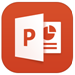

# Office 365의 기본 제공 모바일 장치 관리 기능Capabilities of built-in Mobile Device Management for Office 365

Office 365에 대 한 모바일 장치 관리 보안을 유지 하 고 Iphone, Ipad, Androids, 조직에서 사용이 허가 된 Office 365 사용자가 사용 하는 Windows Phone와 같은 모바일 장치를 관리할 수 있습니다. 조직의 Office 365 전자 메일 및 지원 되는 모바일 장치 및 앱에 대 한 문서에 대 한 액세스 제어는 데 도움이 되는 설정을 사용 하 여 모바일 장치 관리 정책을 만들 수 있습니다. 장치를 분실 하거나 도난당, 하는 경우 조직의 중요 한 정보를 제거 하려면 장치를 원격으로 완전히 제거할 수 있습니다.Mobile Device Management for Office 365 can help you secure and manage mobile devices like iPhones, iPads, Androids, and Windows Phones used by licensed Office 365 users in your organization. You can create mobile device management policies with settings that can help control access to your organization's Office 365 email and documents for supported mobile devices and apps. If a device is lost or stolen, you can remotely wipe the device to remove sensitive organizational information.
    
Office 365에 대 한 MDM에 포함 된 것 보다 더 많은 기능을 필요 합니까? Microsoft Intune에 필요한 정보를 참조: [Office 365 및 Microsoft Intune MDM 간에 선택](choose-between-mdm-and-intune.md)합니다.Need more functionality than is included in MDM for Office 365? See if Microsoft Intune has what you need: [Choose between MDM for Office 365 and Microsoft Intune](choose-between-mdm-and-intune.md).
  
## 지원되는 장치Supported devices

MDM Office 365에 대 한를 사용 하 여 보호 하 고 다음과 같은 유형의 장치를 관리할 수 있습니다.You can use MDM for Office 365 to secure and manage the following types of devices.
  
- Windows Phone 8.1 +Windows Phone 8.1+
    
- iOS 7.1 이상 버전iOS 7.1 or later versions
    
- iPad 4 이상 버전Android 4 or later versions
    
- Windows 8.1\*Windows 8.1\*
    
- Windows 8.1 RT\*Windows 8.1 RT\*
    
- Windows 10\*\*Windows 10\*\*
    
- Windows 10 Mobile\*\*Windows 10 Mobile\*\*
    
\*Windows 8.1 및 Windows 8.1 RT 장치에 대 한 액세스 제어 Exchange ActiveSync 개로 제한 됩니다.\* Access control for Windows 8.1 and Windows 8.1 RT devices is limited to Exchange ActiveSync.
  
\*\*Azure Active Directory에 가입 하 여 조직의 모바일 장치 관리 서비스에 등록 하는 장치가 필요 합니다.\*\* Requires the device to be joined to Azure Active Directory and be enrolled in the mobile device management service of your organization.
  
조직의 사용자에 게 Office 365에 대 한 모바일 장치 관리에서 지원 하지 않는 모바일 장치를 사용 하는 경우에 조직의 데이터를 보다 안전 하 게 하려면 해당 장치에 대 한 Office 365 전자 메일에 대 한 Exchange ActiveSync 응용 프로그램 액세스를 차단 하는 것이 좋습니다. Exchange ActiveSync를 차단 하기 위한 단계: [장치 액세스 설정 관리를](manage-device-access-settings.md)참조 하십시오.If people in your organization use mobile devices that aren't supported by Mobile Device Management for Office 365, you might want to block Exchange ActiveSync app access to Office 365 email for those devices, to help make your organization's data more secure. Steps for blocking Exchange ActiveSync: See [Manage device access settings](manage-device-access-settings.md).
  
## Office 365 전자 메일 및 문서에 대한 액세스 제어Access control for Office 365 email and documents

다양 한 유형의 다음 표에 모바일 장치에 대 한 지원 되는 앱에는 사용자가 있는 사용자의 장치에 적용 되는 새로운 모바일 장치 관리 정책을 있고 사용자는 장치를 이전에 등록 하지 않은 Office 365에 대 한 MDM에 등록 하 라는 메시지가 나타납니다. 사용자의 장치 정책에 부합 하지 않는 경우 이러한 응용 프로그램에서 Office 365 리소스에 액세스 하지 못하도록 차단 되었을 사용자 설정에 따라 어떻게 하면 정책 또는 액세스할 수 있는 있지만 Office 365 정책 위반을 보고 합니다.The supported apps for the different types of mobile devices in the following table will prompt users to enroll in MDM for Office 365 where there is a new mobile device management policy that applies to a user's device and the user hasn't previously enrolled the device. If a user's device doesn't comply with a policy, depending on how you set the policy up, a user might be blocked from accessing Office 365 resources in these apps, or they might have access but Office 365 will report a policy violation.
  
||**Windows Phone 8.1 +****Windows Phone 8.1+**|**iOS 7.1+****iOS 7.1+**|**Android 4+****Android 4+**|
|:-----|:-----|:-----|:-----|
|**Exchange****Exchange**   Exchange ActiveSync에는 기본 제공 전자 메일 및 Exchange ActiveSync 버전 14.1 이상 사용 하는 TouchDown, 같은 제 3 자 앱 포함 됩니다.Exchange ActiveSync includes built-in email and third-party apps, like TouchDown, that use Exchange ActiveSync Version 14.1 or later.    |Exchange ActiveSyncExchange ActiveSync    Exchange 메일Exchange Mail    |Exchange ActiveSyncExchange ActiveSync    메일Mail    |Exchange ActiveSyncExchange ActiveSync    전자 메일Email    |
|**Office** 및 **비즈니스용 OneDrive****Office** and **OneDrive for Business**   |지원되는 앱 없음No supported apps    |OutlookOutlook    OneDriveOneDrive    WordWord    ExcelExcel    PowerPointPowerPoint    |**휴대폰 및 태블릿:****On phones and tablets:**   OutlookOutlook    OneDriveOneDrive    WordWord    ExcelExcel    PowerPointPowerPoint    **휴대폰만 해당:****On phones only:**   Office MobileOffice Mobile    |
   
> [!NOTE]
>  IOS 7.1 및 그 이후 버전에 대 한 지원 iPhone 및 iPad 장치를 포함합니다. > BlackBerry 장치 관리는 Office 365에 대 한 모바일 장치 관리를 통해 지원 되지 않습니다. BlackBerry Business Cloud Services (BBCS)에서 BlackBerry 사용 하 여 BlackBerry 장치를 관리할 수 있습니다. > 사용자를 등록 하 고 없습니다 차단 또는 Office 365 SharePoint 사이트, Office Online의 문서 또는 Outlook Web App에서 전자 메일에 액세스 하는 모바일 브라우저를 사용 하는 경우 정책 위반에 대 한 보고 하 라는 메시지가 표시 되지 않습니다.Support for iOS 7.1 and later versions includes iPhone and iPad devices. >  Management of BlackBerry devices isn't supported by Mobile Device Management for Office 365. Use BlackBerry Business Cloud Services (BBCS) from BlackBerry to manage BlackBerry devices. >  Users won't be prompted to enroll and won't be blocked or reported for policy violation if they use the mobile browser to access Office 365 SharePoint sites, documents in Office Online, or email in Outlook Web App. 
  
다음 다이어그램은 새 장치를 가진 사용자가 Office 365에 대 한 MDM 함께 컨트롤의 액세스는 지원 되는 응용 프로그램에 로그인 할 때 수행 하는 작업을 표시 합니다. 사용자가 장치를 등록할 때까지 응용 프로그램에서 Office 365 리소스에 액세스 하지 못하도록 차단 됩니다.The following diagram shows what happens when a user with a new device signs in to an app that supports access control with MDM for Office 365. The user is blocked from accessing Office 365 resources in the app until they enroll their device.
  

  
> [!NOTE]
> 정책 및 액세스 규칙을 Office 365에 대 한 MDM에서 만든 Exchange ActiveSync 모바일 장치 사서함 정책 및 Exchange 관리 센터에서 만든 장치 액세스 규칙을 재정의 합니다. 장치는 Office 365에 대 한 MDM에 등록 되, 후 Exchange ActiveSync 모바일 장치 사서함 정책 또는 장치 액세스 규칙을 모두 장치에 적용 되는 무시 됩니다. Exchange ActiveSync에 대 한 자세한 내용은, [Exchange Online의 Exchange ActiveSync](https://go.microsoft.com/fwlink/p/?LinkId=524380)를 참조 하십시오.Policies and access rules created in MDM for Office 365 will override Exchange ActiveSync mobile device mailbox policies and device access rules created in the Exchange admin center. After a device is enrolled in MDM for Office 365, any Exchange ActiveSync mobile device mailbox policy or device access rule applied to the device will be ignored. To learn more about Exchange ActiveSync, see [Exchange ActiveSync in Exchange Online](https://go.microsoft.com/fwlink/p/?LinkId=524380). 
  
## 모바일 장치에 대한 정책 설정Policy settings for mobile devices

켜져 특정 설정을 사용 하 여 액세스를 차단 하기 위한 정책을 만드는 경우 사용자가 [Office 365 전자 메일 및 문서에 대 한 액세스 제어](#access-control-for-office-365-email-and-documents)에 나열 된 지원 되는 응용 프로그램을 사용 하는 경우 Office 365 리소스에 액세스 하지 못하도록 차단 됩니다. 이러한 섹션에 사용자가 Office 365 리소스에 액세스 하지 못하도록 차단할 수 있는 설정은 다음과 같습니다.If you create a policy to block access with certain settings turned on, users will be blocked from accessing Office 365 resources when using a supported app that is listed in [Access control for Office 365 email and documents](#access-control-for-office-365-email-and-documents). The settings that can block users from accessing Office 365 resources are in these sections:
  
- 보안Security
    
- 암호화Encryption
    
- 암호 해독Jail broken
    
- 관리되는 전자 메일 프로필Managed email profile
    
예, 다음 다이어그램은 등록 된 장치와 사용자가 장치에 적용 되는 모바일 장치 관리 정책에서 보안 설정을 준수 사용 하지 않을 때 수행 되는 작업을 표시 합니다. 사용자가 Office 365에 대 한 MDM 함께 컨트롤의 액세스는 지원 되는 응용 프로그램에 로그인 합니다. 해당 장치 보안 설정을 준수 때까지 응용 프로그램에서 Office 365 리소스에 액세스 하지 못하도록 차단 합니다.For example, the following diagram shows what happens when a user with an enrolled device isn't compliant with a security setting in a mobile device management policy that applies to their device. The user signs in to an app that supports access control with MDM for Office 365. They are blocked from accessing Office 365 resources in the app until their device complies with the security setting.
  

  
다음 섹션에는 안전 하 게 보호 하 고 조직의 Office 365 리소스에 연결 하는 모바일 장치를 관리 하는데 사용할 수 정책 설정을 나열 합니다.The following sections list the policy settings you can use to help secure and manage mobile devices that connect to your organization's Office 365 resources. 
  
### 보안 설정Security settings

|**설정 이름****Setting name**|**Windows Phone 8.1 +****Windows Phone 8.1+**|**iOS 7.1+****iOS 7.1+**|**Android 4+****Android 4+**|**삼성 Knox****Samsung Knox**|
|:-----|:-----|:-----|:-----|:-----|
|암호 요구Require a password    |✔✔    |✔✔    |✔✔    |✔✔    |
|단순 암호 방지Prevent simple password    |✔✔    |✔✔    |✖✖    |✖✖    |
|영숫자 암호 필요Require an alphanumeric password    |✔✔    |✔✔    |✖✖    |✖✖    |
|최소 암호 길이Minimum password length    |✔✔    |✔✔    |✔✔    |✔✔    |
|장치 데이터가 지워지기 전 로그인 오류 횟수Number of sign-in failures before device is wiped    |✔✔    |✔✔    |✔✔    |✔✔    |
|장치가 잠기기 전 비활성화 시간(분)Minutes of inactivity before device is locked    |✔✔    |✔✔    |✔✔    |✔✔    |
|암호 만료(일)Password expiration (days)    |✔✔    |✔✔    |✔✔    |✔✔    |
|암호 기록 저장 및 재사용 금지Remember password history and prevent reuse    |✔✔    |✔✔    |✔✔    |✔✔    |
   
### 암호화 설정Encryption settings

|**설정 이름****Setting name**|**Windows Phone 8.1 +****Windows Phone 8.1+**|**iOS 7.1+****iOS 7.1+**|**Android 4+****Android 4+**|**삼성 Knox****Samsung Knox**|
|:-----|:-----|:-----|:-----|:-----|
|장치에 데이터 암호화 필요Require data encryption on devices    |Windows Phone 8.1은 이미 암호화되어 있으므로 암호화를 해제할 수 없습니다.Windows Phone 8.1 is already encrypted and cannot be unencrypted    |✖✖    |✔✔    |✔\*✔\*    |
   
\*삼성 Knox와 저장소 카드에서 암호화를 요청할 수 있습니다.\* With Samsung Knox, you can also require encryption on storage cards.
  
### 암호 해독 설정Jail broken setting

|**설정 이름****Setting name**|**Windows Phone 8.1 +****Windows Phone 8.1+**|**iOS 7.1+****iOS 7.1+**|**Android 4+****Android 4+**|**삼성 Knox****Samsung Knox**|
|:-----|:-----|:-----|:-----|:-----|
|장치 암호를 해독하거나 루팅할 수 없음Device cannot be jail broken or rooted    |✖✖    |✔✔    |✔✔    |✔✔    |
   
### 관리되는 전자 메일 프로필 옵션Managed email profile option

다음 옵션은 사용자가 수동으로 만든된 전자 메일 프로필을 사용 하 여 하는 경우 Office 365 전자 메일에 액세스 하지 못하도록 차단할 수 있습니다. 전자 메일에 액세스할 수 있으려면 iOS 장치에서 사용자 프로필을 수동으로 만든된 전자 메일을 삭제 해야 합니다. 프로필을 삭제 하 한 후 새 프로필을 장치에 자동으로 만들어집니다.The following option can block users from accessing their Office 365 email if they're using a manually created email profile. Users on iOS devices must delete their manually created email profile before they can access their email. After they delete the profile, a new profile will be automatically created on the device.
  
|**설정 이름****Setting name**|**Windows Phone 8.1 +****Windows Phone 8.1+**|**iOS 7.1+****iOS 7.1+**|**Android 4+****Android 4+**|**삼성 Knox****Samsung Knox**|
|:-----|:-----|:-----|:-----|:-----|
|전자 메일 프로필이 관리됨Email profile is managed    |✖✖    |✔✔    |✖✖    |✖✖    |
   
### 클라우드 설정Cloud settings

|**설정 이름****Setting name**|**Windows Phone 8.1 +****Windows Phone 8.1+**|**iOS 7.1+****iOS 7.1+**|**Android 4+****Android 4+**|**삼성 Knox****Samsung Knox**|
|:-----|:-----|:-----|:-----|:-----|
|암호화된 백업 필요Require encrypted backup    |✖✖    |✔✔    |✖✖    |✖✖    |
|클라우드 백업 차단Block cloud backup    |✖✖    |✔✔    |✖✖    |✖✖    |
|문서 동기화 차단Block document synchronization    |✖✖    |✔✔    |✖✖    |✖✖    |
|사진 동기화 차단Block photo synchronization    |✖✖    |✔✔    |✖✖    |✖✖    |
|Google 백업 허용Allow Google backup    |해당 없음N/A    |해당 없음N/A    |✖✖    |✔✔    |
|Google 계정 자동 동기화를 허용 합니다.Allow Google account auto sync    |해당 없음N/A    |해당 없음N/A    |✖✖    |✔✔    |
   
### 시스템 설정System settings

|**설정 이름****Setting name**|**Windows Phone 8.1 +****Windows Phone 8.1+**|**iOS 7.1+****iOS 7.1+**|**Android 4+****Android 4+**|**삼성 Knox****Samsung Knox**|
|:-----|:-----|:-----|:-----|:-----|
|화면 캡처 차단Block screen capture    |✔✔    |✔✔    |✖✖    |✔✔    |
|장치에서 진단 데이터 전송 차단Block sending diagnostic data from device    |✔✔    |✔✔    |✖✖    |✔✔    |
   
### 응용 프로그램 설정Application settings

|**설정 이름****Setting name**|**Windows Phone 8.1 +****Windows Phone 8.1+**|**iOS 7.1+****iOS 7.1+**|**Android 4+****Android 4+**|**삼성 Knox****Samsung Knox**|
|:-----|:-----|:-----|:-----|:-----|
|장치에서 비디오 회의 차단Block video conferences on device    |✖✖    |✔✔    |✖✖    |✖✖    |
|응용 프로그램 저장소에 대한 액세스 차단Block access to application store    |✔✔    |✔✔    |✖✖    |✔✔    |
|응용 프로그램 저장소에 액세스할 때 암호 필요Require password when accessing application store    |✖✖    |✔✔    |✖✖    |✖✖    |
   
### 장치 기능 설정Device capabilities settings

|**설정 이름****Setting name**|**Windows Phone 8.1 +****Windows Phone 8.1+**|**iOS 7.1+****iOS 7.1+**|**Android 4+****Android 4+**|**삼성 Knox****Samsung Knox**|
|:-----|:-----|:-----|:-----|:-----|
|이동식 저장소와 연결 차단Block connection with removable storage    |✔✔    |✖✖    |✖✖    |✔✔    |
|Bluetooth 연결 차단Block Bluetooth connection    |✔✔    |✖✖    |✖✖    |✔✔    |
   
### 추가 설정Additional settings

PowerShell cmdlet을 사용 하 여 다음과 같은 추가 정책 설정을 설정할 수 있습니다. 자세한 내용은 참조 [Office 365 보안 &amp; 준수 센터 cmdlet](https://go.microsoft.com/fwlink/p/?LinkId=827804)합니다.You can set the following additional policy settings by using PowerShell cmdlets. For more information, see [Office 365 Security &amp; Compliance Center cmdlets](https://go.microsoft.com/fwlink/p/?LinkId=827804).
  
|**설정 이름****Setting name**|**Windows Phone 8.1 +****Windows Phone 8.1+**|**iOS 7.1+****iOS 7.1+**|**Android 4 + (삼성 Knox 포함)****Android 4+ (including Samsung Knox)**|
|:-----|:-----|:-----|:-----|
|CameraEnabledCameraEnabled    |✔✔    |✔✔    |✔✔    |
|RegionRatingsRegionRatings    |✖✖    |✔✔    |✖✖    |
|MoviesRatingsMoviesRatings    |✖✖    |✔✔    |✖✖    |
|TVShowsRatingTVShowsRating    |✖✖    |✔✔    |✖✖    |
|AppsRatingsAppsRatings    |✖✖    |✔✔    |✖✖    |
|AllowVoiceDialingAllowVoiceDialing    |✖✖    |✔✔    |✖✖    |
|AllowVoiceAssistantAllowVoiceAssistant    |✖✖    |✔✔    |✖✖    |
|AllowAssistantWhileLockedAllowAssistantWhileLocked    |✖✖    |✔✔    |✖✖    |
|AllowPassbookWhileLockedAllowPassbookWhileLocked    |✖✖    |✔✔    |✖✖    |
|MaxPasswordGracePeriodMaxPasswordGracePeriod    |✖✖    |✔✔    |✖✖    |
|PasswordQualityPasswordQuality    |✖✖    |✖✖    |✔✔    |
|SystemSecurityTLSSystemSecurityTLS    |✖✖    |✔✔    |✖✖    |
|WLANEnabledWLANEnabled    |✔✔    |✖✖    |✖✖    |
   
### Windows에서 지원 되는 설정Settings supported by Windows

모바일 장치도이 등록 하 여 Windows 8.1 및 Windows 10 장치를 관리할 수 있습니다. 해당 정책을 배포한 후 Windows 8.1 RT 및 Windows 10 RT 장치와 사용자가 처음 Office 365 전자 메일에 액세스 하는 기본 제공 전자 메일 응용 프로그램을 사용할 때 Office 365에 대 한 MDM에 등록 하 필요 합니다.You can manage Windows 8.1 and Windows 10 devices by enrolling them as mobile devices. After an applicable policy is deployed, users with Windows 8.1 RT and Windows 10 RT devices will be required to enroll in MDM for Office 365 the first time they use the built-in email app to access their Office 365 email. 
  
다음 설정으로 모바일 장치 등록 된 Windows 8.1 및 Windows 10 장치에 대 한 지원 됩니다. 사용자가 Office 365 리소스에 액세스 하지 못하도록 차단 되지 않음이 설정은 합니다.The following settings are supported for Windows 8.1 and Windows 10 devices that are enrolled as mobile devices. These setting won't block users from accessing Office 365 resources.
  
 **보안 설정****Security settings**
  
- 영숫자 암호 필요Require an alphanumeric password
    
- 최소 암호 길이Minimum password length
    
- 장치 데이터가 지워지기 전 로그인 오류 횟수Number of sign-in failures before device is wiped
    
- 장치가 잠기기 전 비활성화 시간(분)Minutes of inactivity before device is locked
    
- 암호 만료(일)Password expiration (days)
    
- 암호 기록 저장 및 재사용 금지Remember password history and prevent reuse
    
 **시스템 설정****System settings**
  
장치에서 진단 데이터 전송 차단Block sending diagnostic data from device
  
 **추가 설정****Additional settings**
  
PowerShell cmdlet을 사용하여 다음의 추가 정책 설정을 지정할 수 있습니다.You can set the following additional policy settings by using PowerShell cmdlets:
  
- AllowConvenienceLogonAllowConvenienceLogon
    
- UserAccountControlStatusUserAccountControlStatus
    
- FirewallStatusFirewallStatus
    
- AutoUpdateStatusAutoUpdateStatus
    
- AntiVirusStatusAntiVirusStatus
    
- AntiVirusSignatureStatusAntiVirusSignatureStatus
    
- SmartScreenEnabledSmartScreenEnabled
    
- WorkFoldersSyncUrlWorkFoldersSyncUrl
    
## 원격으로 모바일 장치의 데이터 지우기Remotely wipe a mobile device

 중요 한 조직 데이터를 제거 하 고 **보안에서에서 있는 지우기 기능을 수행 하 여 조직의 Office 365 리소스에 대 한 액세스를 방지할 수 있는 장치를 분실 하거나 도난당, 하는 경우 &amp; 준수 센터\>데이터 손실 방지\>장치 관리**합니다. 만 조직 구성 데이터를 제거 하려면 선택적 지우기 또는 장치에서 모든 정보를 삭제 하 고 공장 설정으로 복원할 수 있는 전체 지우기 기능을 수행할 수 있습니다.If a device is lost or stolen, you can remove sensitive organizational data and help prevent access to your organization's Office 365 resources by doing a wipe from **Security &amp; Compliance center\>Data loss prevention\>Device management**. You can do a selective wipe to remove only organizational data or a full wipe to delete all information from a device and restore it to its factory settings.
  
자세한 내용은 [Office 365의 모바일 장치 지우기 시도](https://go.microsoft.com/fwlink/p/?LinkId=518157)참조 하십시오.For more information, see [Wipe a mobile device in Office 365](https://go.microsoft.com/fwlink/p/?LinkId=518157).
  
## 참고 항목See also

[Office 365의 모바일 장치 관리 개요Overview of Mobile Device Management for Office 365](overview-of-mdm.md)
  
[장치 보안 정책 만들기 및 배포Create and deploy device security policies](create-device-security-policies.md)

