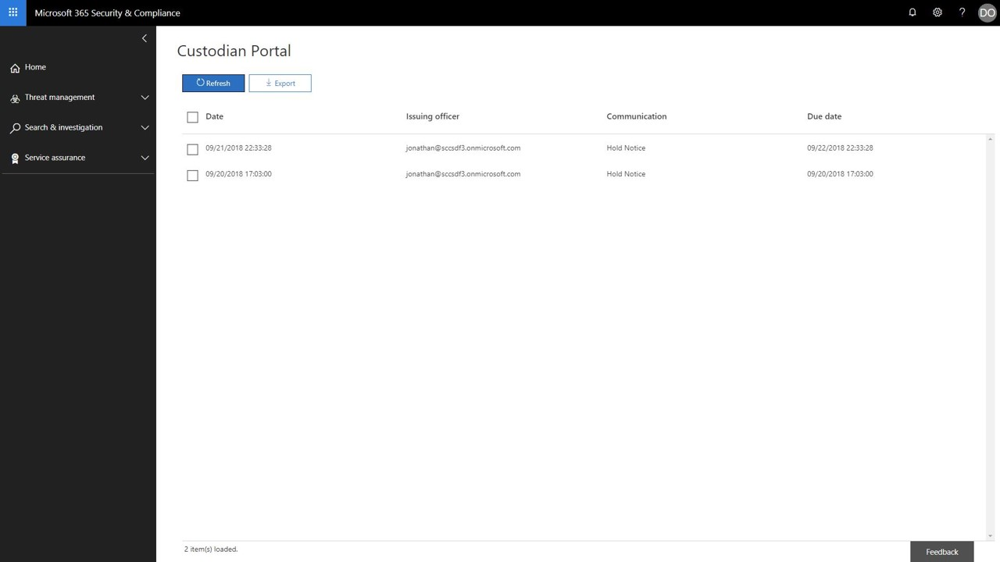

# 보류 알림 승인Acknowledge a hold notification 
규정 요청 또는 조사에 응답할 때 custodians에 게 알려야 하 고, ESI (전자적으로 저장 된 정보)를 보존 하 고, 활성 또는 즉시 법적 관계를 유지 해야 할 수도 있습니다.When responding to a regulatory request or investigation, you may be required to  inform custodians of their obligation to preserve electronically stored information (ESI) as well as any material that may be relevant to an active or imminent legal matter. 합법적인 팀이 전송 된 후에는 각 custodian에 게 제공 되 고, 읽고, 이해 했으며, 지정 된 지침을 준수 하기로 합의 해야 합니다.Once sent, legal teams must know that each custodian has received, read, and understood, and agreed to comply with the given instructions.

custodians와 관련 된 시간, 비용 및 노력을 줄이기 위해 고급 eDiscovery (미리 보기)를 사용 하면 전자 메일을 통해 법적 보존 알림을 보내고 추가 작업을 수행할 수 있습니다.To help reduce the time, cost, and effort of following up with your custodians,  Advanced eDiscovery (Preview) allows you to send and follow-up on legal hold notifications through email. 전자 메일 알림 외에도 각 custodian에는 개별화 준수 포털에 대 한 액세스 권한이 있으며,이를 통해 custodians가 의무 상태 변경 사항에 대 한 알림을 받을 수 있습니다.In addition to email notices, each custodian will also have access to an individualized Compliance Portal, allowing custodians to be kept informed of changes to their obligation status.

## 전자 메일 알림Email notifications
법적 보존 알림이 실행 되 면 각 custodian는 정의 된 법적 보존 통지를 포함 하는 고유한 개인 설정 전자 메일을 수신 하 고 지침을 추가 합니다.Once a Legal Hold Notification has been issued, each custodian will receive a unique and personalized email containing your defined legal hold notice and added instructions. 

> [!Tip] 
> 기본 제공 [통신 편집기](using-communications-editor.md) 를 사용 하 여 custodians에서 해당 알림을 승인 하거나 전자 메일에서 직접 준수 포털에 액세스 하도록 하는 방법을 참조 하세요.See how you can use the built-in  [Communication Editor](using-communications-editor.md) to allow your custodians to acknowledge their notice or access their Compliance Portal directly from their email.

법적 보존 알림 구성에 따라 custodians에 다음과 같은 알림이 표시 될 수 있습니다.Based on the configuration of your legal hold notification, your custodians may receive the following notices: 

- **발급 알림** -custodian로 전송 되는 첫 번째 알림입니다.**Issuance notice** - This is the first notice sent to your custodian. 여기에는 메시지 끝에 추가 공지와 함께 발급 지침이 포함 됩니다.This will contain your issuance instructions as well as the hold notice appended to the end of your message.

- **미리 알림** -이 옵션을 사용 하도록 설정 하면 지정 된 빈도 및 간격에 따라 미리 알림 알림이 custodians로 전송 됩니다.**Reminder notice** - If enabled, a reminder notice will be sent to your custodians based on the specified frequency and interval. 미리 알림은 custodian가 알림을 승인할 때까지 또는 미리 알림 수가 모두 소모 될 때까지 계속 전송 됩니다.The reminders will continue to be sent either until the custodian has acknowledged their notice or until the number of reminders have been exhausted.

- **에스컬레이션 알림** -이 옵션을 사용 하도록 설정 하는 경우 미리 알림 알림이 모두 포함 된 후에는 custodian 및 관리자에 게 에스컬레이션 알림이 전송 됩니다.**Escalation notice** - If enabled, an escalation notice will be sent to your custodian and their manager after the reminder notices have been exhausted. 시스템은 alloted 에스컬레이션이 완료 되거나 custodian가 해당 보존 알림을 받을 때까지 에스컬레이션 알림을 자동으로 보냅니다.The system will automatically send escalation notices until the alloted escalations have been completed or until the custodian acknowledges their hold notification.

- **알림 다시** 표시-조사 과정을 진행 하는 동안 보존 공지의 내용이 업데이트 되 면 업데이트 된 공지가 자동으로 custodian로 전송 됩니다.**Re-issue notice** - During the course of an investigation, if the contents of the hold notice are updated, then the updated notice will automatically be sent to the custodian.

- **릴리스 알림** -custodian이 사례에서 출시 되 면 릴리스 알림을 받게 됩니다.**Release notice** - When a custodian is released from the case, they will be sent the release notice. 

## 준수 포털Compliance Portal
각 custodian에는 전자 메일 알림 외에 고유한 준수 포털에 대 한 액세스 권한이 있습니다.In addition to the email notifications, each custodian will also have access to a unique Compliance Portal. 포털을 통해 각 custodian에서 활성 보류 알림을 보고, 액세스 하 고, 승인할 수 있습니다.Through the portal, each custodian will be able to view, access, and acknowledge their active hold notifications.

