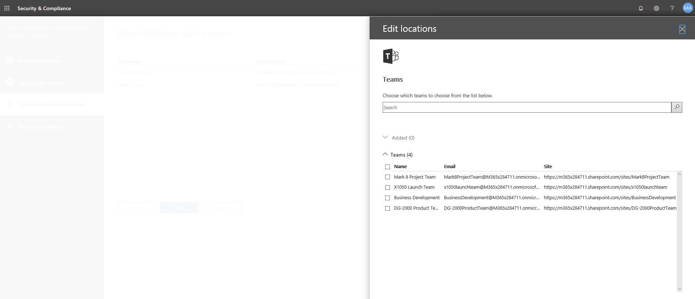

# 고급 eDiscovery 사례에 custodians 추가Add custodians to an Advanced eDiscovery case

고급 eDiscovery의 기본 제공 custodian 관리 도구를 사용 하 여 custodians 관리를 위한 워크플로를 조정 하 고 사례와 연결 된 관련 custodial 데이터 원본을 식별 합니다.Use the built-in custodian management tool in Advanced eDiscovery to coordinate your workflows around managing custodians and identifying relevant, custodial data sources associated with a case. Custodian를 추가 하면 시스템에서 Exchange 사서함 및 비즈니스용 OneDrive 계정을 자동으로 식별 하 고 유지 합니다.When you add a custodian, the system can automatically identify and place a hold on their Exchange mailbox and OneDrive for Business account. 조사 프로세스를 진행 하는 동안 custodian에서 액세스 하거나 참여 하는 추가 데이터 원본 (예: 사서함, 사이트 또는 팀)을 식별할 수도 있습니다.During the discovery process of your investigation, you might also identify additional data sources (such as mailboxes, sites, or Teams) that a custodian accessed or contributed to. 이러한 상황에서는 custodian 관리 도구를 사용 하 여 해당 데이터 원본을 특정 custodian에 연결할 수 있습니다.In this situation, you can use the custodian management tool to associate those data sources will a specific custodian. Custodians를 사례에 추가 하 고 다른 데이터 원본을 이러한 원본과 연결한 후에는 데이터를 빠르게 보존 하 고 custodial 데이터를 검색할 수 있습니다.After you add custodians to a case and associate other data source with them, you can quickly preserve data and search the custodial data.

고급 eDiscovery 사례에서 custodians을 추가 하 고 관리 하려면 다음 워크플로를 사용 합니다.Use the following workflow to add and manage custodians in Advanced eDiscovery cases. 

## 시작하기 전에Before you begin

Custodians를 사례에 추가 하려면 eDiscovery 관리자 역할 그룹의 구성원 이어야 합니다.To add custodians to a case, you must be a member of the eDiscovery Manager role group. 이렇게 하면 custodians를 사례에 추가 하 고 custodial 데이터 원본에 대 한 보류를 수행 하는 데 필요한 권한이 제공 됩니다.This will provide you with the necessary permissions to add custodians to a case and place a hold on the custodial data sources.

## 1 단계: 잠재 custodians 추가Step 1: Add potential custodians

첫 번째 단계는 custodians를 식별 하 고 사례에 추가 하는 것입니다.The first step is to identify and add custodians to the case.

1. **고급 eDiscovery** 홈 페이지에서 custodians를 추가할 사례를 클릭 합니다.On the **Advanced eDiscovery** home page, click the case the you want to add custodians to. 
 
2. **Custodians** 탭을 클릭 하 고 **+ 추가 Custodians**를 클릭 합니다.Click the **Custodians** tab and then click **+ Add custodians**.

3. 사례에 추가할 custodians를 찾습니다.Find the custodians to add  to the case. 조직의 Azure Active Directory에서 사용자를 표시 하려면 사용자 이름의 첫 부분을 입력 합니다.Type the first part of a person's name to display users from your organization's Azure Active Directory. 올바른 사용자를 찾았으면 이름을 클릭 하 여 목록에 추가 합니다.When you find the correct person, click their name to add them to the list.

   
 
4. 관련 custodians를 모두 추가한 후 **다음** 을 클릭 하 여 custodians의 기본 데이터 원본을 선택 합니다.After added all the relevant custodians, click **Next** to select the custodians' primary data sources.
  
## 2 단계: custodian 데이터 원본 선택Step 2: Select custodian data sources

Custodians을 추가한 후에는 custodian 도구를 통해 각 custodian에서 소유 하는 기본 데이터 원본을 확인할 수 있습니다. 특히 이러한 데이터 위치는 custodian의 Exchange 사서함 및 OneDrive 계정입니다.After adding custodians, the custodian tool will help you identify the primary data sources owned by each custodian; specifically these data locations are the custodian's Exchange mailbox and OneDrive account. 

Custodian 데이터 원본을 확인 하려면 다음을 수행 합니다.To identify custodian data sources: 

1. 모든 custodians에 대 한 Exchange 사서함을 선택 하려면 열 맨 위에 있는 **exchange** 확인란을 클릭 합니다.To select the Exchange mailbox for all custodians, click the **Exchange** checkbox at the top of the column. 그런 다음 특정 custodian의 확인란을 선택 취소 하 여 사서함을 custodial 위치로 제거할 수 있습니다.Note that you can then unselect the checkbox for any specific custodian to remove a mailbox as a custodial location. 또는 열 맨 위에 있는 **Exchange** 확인란을 선택 하지 않은 채로 둔 다음 개별 custodians에 대 한 확인란을 선택할 수 있습니다.Alternatively, you can leave the **Exchange** checkbox at the top of the column unselected and then select the checkbox for individual custodians. 
 
   
 
2. Custodians의 OneDrive 계정에 대해 동일한 작업을 반복 합니다.Repeat the same thing for the custodians' OneDrive accounts. 

    Custodian 데이터 원본을 선택한 후에는 자동으로 이러한 데이터 원본을 식별 하 고 확인 한 다음 custodians와 연결 된 데이터 원본으로이를 사례에 추가 합니다.After select the custodian data sources, they system automatically attempts to identify and verify these data sources, and then adds them to the case as data sources associated with the custodians.
 
4. **다음** 을 클릭 하 여 대/소문자를 구분 하 여 추가 데이터 원본을 custodians에 연결 합니다.Click **Next** to begin associating additional data sources to the custodians in the case.

## 3 단계: 추가 데이터 원본을 custodian에 연결Step 3: Associate additional data sources to a custodian

조사 중인 사례에 따라 특정 custodian에 액세스할 수 있는 사서함, custodian가 현재 속해 있는 Office 365 그룹 또는 custodian에도 액세스 한 사이트에 대 한 콘텐츠를 검색 하 고 보존 해야 할 수도 있습니다.Depending on the case you're investigating, you may also need to search (and preserve content in) mailboxes that a specific custodian may have accessed, Office 365 groups that a custodian is currently a member of, or sites that a custodian has also accessed. 따라서 이전 단계에서 지정한 기본 custodian 데이터 원본 외에, 사례에서 추가 Office 365 데이터 원본을 custodian에 연결할 수도 있습니다.So in addition to the primary custodian data sources that you specified in the previous step, you can also associate additional Office 365 data sources with a custodian in the case. 

사서함, 사이트 또는 팀을 특정 custodian에 매핑하려면 다음을 수행 합니다.To map mailboxes, sites, or teams to a specific custodian:

1. **추가 데이터 원본 선택** 페이지에서 특정 custodian 행에 **추가** 를 클릭 합니다.On the **Select additional data sources** page, click **Add** in the row for the specific custodian. 
  
   

2. 플라이 아웃 페이지에서 다음 Office 365 서비스의 데이터 원본을 지정할 수 있습니다.On the flyout page, you can specify a data source from any the following Office 365 services:
  
   -  **Exchange 전자 메일** - **사용자, 그룹 또는 팀 선택을** 클릭 한 다음 **사용자, 그룹 또는 팀 선택을** 클릭 합니다.**Exchange email** - Click **Choose users, groups, or Teams** and then click **Choose users, groups, or teams** again. 검색 상자를 사용 하 여 custodian와 연결할 사서함을 찾습니다.Use the search box to find mailboxes to associate with the custodian. 선택한 custodian에 할당할 사서함을 지정 하려면 검색 상자를 사용 하 여 사용자 사서함 및 메일 그룹을 찾습니다.To specify mailboxes to assign to the selected custodian, use the search box to find user mailboxes and distribution groups. 또한 Office 365 그룹 또는 Microsoft 팀에 연결 된 사서함을 할당할 수 있습니다.You can also assign the associated mailbox for an Office 365 group or a Microsoft Team. 사용자, 그룹, 팀 확인란을 선택 하 고 **선택을**클릭 한 후 **완료**를 클릭 합니다.Select the user, group, team check box, click **Choose**, and then click **Done**.

        > [!NOTE]
        > 사용자, 그룹 또는 팀 선택을 클릭 하 여 사서함을 지정 하는 경우 표시 되는 사서함 선택은 비어 있습니다.When you click Choose users, groups, or teams to specify mailboxes, the mailbox picker that's displayed is empty. 이것은 성능을 향상시키기 위한 것입니다.This is by design to enhance performance. 이 목록에 사서함을 추가 하려면 검색 상자에 이름 또는 별칭 (최소 3 자)을 입력 합니다.To add mailbox to this list, type a name or alias (a minimum of 3 characters) in the search box.
     
     - **Sharepoint 사이트** - **사이트 선택을** 클릭 한 다음 **사이트 선택을** 다시 클릭 하 여 조직의 SharePoint 사이트 목록을 표시 합니다.**SharePoint sites** - Click **Choose sites** and then click **Choose sites** again to display a list of SharePoint sites in your organization. 사이트를 custodian와 연결 하려면 목록에서 사이트를 선택 하거나, Office 365 그룹, Microsoft 팀 또는 OneDrive 계정과 연결 된 사이트 또는 다른 사이트의 URL을 입력할 수 있습니다.To associate a site with the custodian, you can select a site in the list or you can type the URL of a different site or a site associated with a Office 365 group, Microsoft Team, or a OneDrive account.
     
     - **팀** - **팀 선택을** 클릭 한 다음 **팀 선택을** 다시 클릭 하 여 Custodian가 현재 구성원 인 Microsoft 팀 목록을 표시 합니다.**Teams** – Click **Choose teams** and then click **Choose teams** again to display a list of Microsoft Teams that the custodian is a currently member of. Custodian에 추가할 팀을 선택 합니다.Select the Teams that you would like to add to your custodian. 선택한 후에는 시스템에서 자동으로 &를 확인 하 여 해당 Microsoft 팀과 연결 된 SharePoint 사이트 및 그룹 사서함을 선택 합니다.Once selected, the system will automatically identify & select the associated SharePoint site and Group Mailbox associated to that Microsoft Team. **선택을**클릭 하 고 **완료**를 클릭 합니다.Click **Choose**, and then click **Done**.

       
        
      > [!NOTE]
      > 추가 팀을 custodian에 연결 하려면 **Exchange 메일** 및 **SharePoint 사이트** 위치를 사용 하 여 팀과 연결 된 사서함과 사이트를 개별적으로 추가 해야 합니다.To associate an additional team with a custodian, you have to separately add the mailbox and site associated with the team by using the **Exchange mail** and **SharePoint sites** locations.

추가 데이터 원본을 custodians와 연결한 후에는 **추가 데이터 원본 선택 페이지**에서 각 custodian와 연관 된 사서함, 사이트 및 팀의 총 수를 볼 수 있습니다.After you have finished associating additional data sources with the custodians, you can view the total number of mailboxes, sites, and teams associated with each custodian on the **Select additional data sources page**. 특정 custodian 관련 데이터 원본을 완료 하면이 연결이 유지 관리 되 고 eDiscovery 워크플로의 컬렉션, 처리 및 검토 단계 중에 사용 됩니다.When you've finalized the relevant data sources for a specific custodian, this association will be maintained and used during the collection, processing, and review stages in eDiscovery workflow.

## 4 단계: custodians를 보류에 배치Step 4: Place custodians on hold

사례에 추가할 custodians 및 데이터 원본을 완성 한 후에는 필요에 따라 custodians 중 일부 또는 전체를 보류할 수 있습니다.After you've finalized the custodians and data sources to add to the case, you can optionally place some or all of the custodians on hold. Custodian을 보류할 때 custodian에 연결 된 모든 콘텐츠 위치의 모든 콘텐츠는 보류를 제거 하거나에서 custodian를 해제할 때까지 보존 됩니다.When you place a custodian on hold, all content in all content locations that are associated to the custodian is preserved until you remove the hold or release the custodian from the. 경우에 따라 custodians를 보류 하지 않고 대/소문자에 추가할 수 있습니다.In some cases, you may want to add custodians to a case without placing them on hold.

Custodians 및 데이터 원본을 보류 하려면 다음을 수행 합니다.To place the custodians and data sources on hold:

1. **선택한 custodians** 페이지를 유지 하려면 열 맨 위에 있는 **보류** 확인란을 클릭 하 여 모든 custodians을 보류 상태로 둡니다.On the **Place a hold on the selected custodians** page, click the **Hold** checkbox at the top of the column to place all custodians on hold. 그런 다음 보류에서 제거할 특정 custodian의 확인란을 선택 취소할 수 있습니다.Note that you can then unselect the checkbox for any specific custodian to remove from the hold. 또는 열 맨 위에 있는 **보류** 확인란을 선택 하지 않은 상태로 둔 다음 개별 custodians에 대 한 확인란을 선택할 수 있습니다.Alternatively, you can leave the **Hold** checkbox at the top of the column unselected and then select the checkbox for individual custodians. 
 
   

2. Custodian 보류 선택 사항을 확인 하 고 **완료**를 클릭 합니다.Verify the custodian hold selections and then click **Complete**.

A custodian를 설치 하지 않으면 custodian 및 연결 된 데이터 원본이 사례에 추가 되지만 해당 데이터 원본의 콘텐츠가 보존 되지 않습니다.If you don't place a a hold a custodian, the custodian and their associated data sources will be added to the case but the content in those data sources will not be placed on hold.

Custodian가 보존 된 후에는 모든 custodial 원본이 포함 된 custodian 보류 정책이 자동으로 만들어집니다.After a custodian is placed on hold, a custodian hold policy that contains all custodial sources will be automatically created. 이 정책을 보려면 다음을 수행 합니다.To view this policy:

1. 사례 **홈** 페이지에서 **보류** 탭을 클릭 한 다음 **CustodianHold**를 클릭 합니다.On the **Home** page of the case, click the **Holds** tab and then click **CustodianHold-Guid**,  

2. 플라이 아웃 페이지에서 **보류 편집** 을 클릭 하 여 보류 된 모든 custodian 데이터 원본을 확인 합니다.On the flyout page, click **Edit hold** to view all the custodian data sources that are placed on hold.

