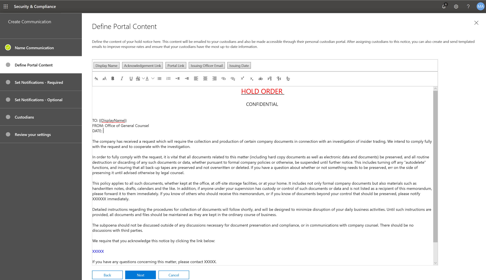

# 법적 보존 알림 만들기Create a legal hold notice

조직에서는 Advanced eDiscovery (Preview) custodian 통신을 사용 하 여 custodians와 통신 하는 방법에 대 한 워크플로를 관리할 수 있습니다.Using Advanced eDiscovery (Preview) custodian communications, organizations can manage their workflow around communicating with custodians. 합법적인 팀은 통신 도구를 통해 법적 보존 알림을 체계적으로 전송, 수집 및 추적할 수 있습니다.Through the Communications tool, legal teams can systematically send, collect, and track legal hold notifications. 또한 유연한 만들기 프로세스를 사용 하면 팀에서 custodians로 전송 되는 알림의 콘텐츠 및 보존 알림 워크플로를 사용자 지정할 수 있습니다.The flexible creation process also allows teams to customize the hold notification workflow and the content in the notices sent to custodians. 

이 문서에서는 보류 알림 워크플로의 단계를 간략하게 설명 합니다.The article outlines the steps in the hold notification workflow.

## 1 단계: 통신 정보 지정Step 1: Specify communication details

첫 번째 단계는 법적 보존 공지와 기타 custodian 통신에 대 한 적절 한 세부 정보를 지정 하는 것입니다.The first step is to specify the appropriate details for legal hold notices or other custodian communications. 

1. 보안 & 준수 센터에서 **eDiscovery > Advanced eDiscovery (Preview)** 로 이동 하 여 조직의 사례 목록을 표시 합니다.In the Security & Compliance Center, go to **eDiscovery > Advanced eDiscovery (Preview)** to display the list of cases in your organization.
   
2. **통신** 탭을 클릭 한 다음 **새 통신**을 클릭 합니다.Click the **Communications** tab, and then click **New communication**.
   
3. **이름 통신** 페이지에서 다음 (필수) 통신 정보를 지정 합니다.On the **Name communication** page, specify the following (required) communication details.

    - **Name**: 통신의 이름입니다.**Name**: This is the name for the communication.
    
    - **발급**관리자: 드롭다운 목록에 사례 구성원 목록이 표시 됩니다.**Issuing officer**: The dropdown list displays a list of a case members. custodians로 전송 되는 각 알림은 지정 된 발급 관리자를 대신 하 여 전송 됩니다.Each notice sent to custodians will be sent on behalf of the specified issuing officer.

4. **다음**을 클릭합니다.Click **Next**.

## 2 단계: 포털 콘텐츠 정의Step 2: Define the portal content

다음으로 보류 공지의 내용을 만들고 추가할 수 있습니다.Next, you can create and add the content of the hold notice. **통신 만들기** 마법사의 **포털 콘텐츠 정의** 페이지에서 보류 주의 내용을 지정 합니다.On the **Define portal content** page in the **Create communication** wizard, specify the contents of the hold notice. 이 콘텐츠는 발급, 다시 발급, 미리 알림 및 에스컬레이션 공지에 자동으로 추가 됩니다.This content will be automatically appended to the Issuance, Re-Issue, Reminder, and Escalation notices. 또한이 콘텐츠는 custodian의 준수 포털에 표시 됩니다.Additionally, this content will appear in the custodian's Compliance Portal. 

포털 콘텐츠를 만들려면 다음을 수행 합니다.To create the portal content:

1. 포털 콘텐츠의 텍스트 상자에 입력 하거나 다른 문서에서 잘라내어 붙여 넣습니다.Type (or cut and paste from another document) your hold notice in the textbox for the portal content. 

2. 공지 사항에 merge 변수를 삽입 하 여 공지를 사용자 지정 하 고 Custodian 준수 포털을 공유 합니다.Insert merge variables into your notice to customize the notice and share the Custodian Compliance Portal.

3. **다음**을 클릭합니다.Click **Next**.

  >[!Tip]
  >포털 콘텐츠의 콘텐츠 및 형식을 사용자 지정 하는 방법에 대 한 자세한 내용은 [통신 편집기 사용](using-communications-editor.md)을 참조 하십시오.To learn more about how to can customize the content and format of the portal content, see [Use the Communications Editor](using-communications-editor.md).

## 3 단계: 필요한 알림 설정Step 3: Set the required notifications

보존 공지의 내용을 정의한 후에는 알림 프로세스를 보내고 관리 하는 방법에 대 한 워크플로를 설정할 수 있습니다.After you've defined the contents of the hold notice, you can set up the workflows around sending and managing the notification process. 알림은 custodians을 사용 하 여 알림 및 추가 작업으로 전송 되는 전자 메일 메시지입니다.Notifications are email messages that are sent to notify and follow-up with custodians. 통신에 추가 되는 모든 custodian에는 동일한 알림이 표시 됩니다.Every custodian added to the communication will receive the same notification. 

보류 알림을 설정 하 고 보내려면 발급, 다시 발급, 릴리스 알림 등을 포함 해야 합니다.To set up and send a hold notice, you must include Issuance, Re-Issuance, and Release notifications.

### 발급 알림Issuance notification 

통신을 만든 후에는 지정 된 발급 담당자가 **발급 알림을** 시작 합니다.After the communication is created, the **Issuance Notification** is initiated by the specified Issuing Officer. 이 발급 알림은 사용자에 게 보존 의무를 알리기 위해 custodian로 전송 되는 첫 번째 통신입니다.The Issuance notification is the first communication sent to the custodian to inform them about their preservation obligations. 

발급 알림을 만들려면 다음을 수행 합니다.To create an issuance notification:

1. **발급** 타일에서 **편집**을 클릭 합니다.In the **Issuance** tile, click **Edit**.
   
2. 필요한 경우 **참조** 및 **숨은** 참조 필드에 추가 사례 구성원 또는 직원을 추가 합니다.If necessary, add additional case members or staff to the **Cc** and **Bcc** fields. 이러한 필드에 여러 사용자를 추가 하려면 전자 메일 주소를 세미콜론으로 구분 합니다.To add multiple users to these fields, separate email addresses with a semi-colon.
   
3. 알림의 **제목을** 지정 합니다 (필수).Specify the **Subject** for the notice (required).
   
4. custodian에 제공할 콘텐츠 또는 추가 지침을 지정 합니다 (필수).Specify the contents or additional instructions that you would like to provide to the custodian (required). 2 단계에서 정의한 포털 콘텐츠가 발급 알림의 끝에 추가 됩니다.Note that the portal content you defined in Step 2 is added to the end of the issuance notice. 
   
5. **저장**을 클릭합니다.Click **Save** 

### 재발급 알림Re-Issuance notification 

사례가 진행 됨에 따라 custodians는 이전에 지시 된 것 보다 더 많은 데이터를 보존 해야 할 수 있습니다.As the case progresses, custodians may be required to preserve additional or less data than was previously instructed. 보존 공지의 내용을 업데이트 한 후에는 재 발급 알림을 통해 custodians에 게 보존 의무 변경 사항에 대 한 알림이 표시 됩니다.After you update the contents of the hold notice, the re-issuance notification alerts the  custodians about the changes to their preservation obligations.

재 발급 알림을 만들려면 다음을 수행 합니다.To create a re-issuance notification: 

1. **재발급** 타일에서 **편집**을 클릭 합니다.In the **Reissue** tile, click **Edit**.
   
2. 필요한 경우 **참조** 및 **숨은** 참조 필드에 추가 사례 구성원 또는 직원을 추가 합니다.If necessary, add additional case members or staff to the **Cc** and **Bcc** fields. 이러한 필드에 여러 사용자를 추가 하려면 전자 메일 주소를 세미콜론으로 구분 합니다.To add multiple users to these fields, separate email addresses with a semi-colon.
   
3. 알림의 **제목을** 지정 합니다 (필수).Specify the **Subject** for the notice (required).
   
4. custodian에 제공할 콘텐츠 또는 추가 지침을 지정 합니다 (필수).Specify the contents or additional instructions that you would like to provide to the custodian (required). 2 단계에서 정의한 포털 콘텐츠가 재발급 공지의 끝에 추가 됩니다.Note that the portal content you defined in Step 2 is added to the end of the re-issuance notice.
   
5. **저장**을 클릭합니다.Click **Save**.

>[!Note]
>보존 알림을 수정 하면 재 발급 알림이 해당 공지에 할당 된 모든 custodians 자동으로 전송 됩니다.If a hold notification is modified, the re-issuance notification will be automatically sent to all custodians assigned to the notice. 알림을 보낸 후에는 custodians에 게 해당 보존 알림을 다시 승인할 것인지 묻는 메시지가 표시 됩니다.After the notification is sent, custodians will be asked to re-acknowledge their hold notice. 미리 알림 또는 단계적 워크플로를 설정한 경우에도 다시 시작 됩니다.If you have set up any reminder or escalation workflows, these will also re-start. 

### 릴리스 알림Release notification

문제가 해결 된 후 또는 custodian이 더 이상 콘텐츠를 보존 하지 않는 경우 사례에서 custodian를 해제할 수 있습니다.After a matter is resolved or if a custodian is no longer subject to preserve content, you can release the custodian from a case. 이전에 custodian에서 보류 알림을 발급 한 경우 릴리스 알림을 사용 하 여 custodians에 게 해당 의무에서 출시 되었음을 알릴 수 있습니다.If the custodian was previously issued a hold notice, the release notification can be used to alert custodians that they have been released from their obligation.

릴리스 알림을 만들려면 다음을 수행 합니다.To create a release notification: 

1. **릴리스** 타일에서 **편집**을 클릭 합니다.In the **Release** tile, click **Edit**.
   
2. 필요한 경우 **참조** 및 **숨은** 참조 필드에 추가 사례 구성원 또는 직원을 추가 합니다.If necessary, add additional case members or staff to the **Cc** and **Bcc** fields. 이러한 필드에 여러 사용자를 추가 하려면 전자 메일 주소를 세미콜론으로 구분 합니다.To add multiple users to these fields, separate email addresses with a semi-colon.
   
3. 알림의 **제목을** 지정 합니다 (필수).Specify the **Subject** for the notice (required).
   
4. custodian에 제공할 콘텐츠 또는 추가 지침을 지정 합니다 (필수).Specify the contents or additional instructions that you would like to provide to the custodian (required).
   
5. **저장** 을 클릭 하 고 다음 단계로 이동 합니다.Click **Save** and go to the next step. 

## 반드시 4 단계: 선택적 알림 설정(Optional) Step 4: Set the optional notifications

선택적으로 자동화 된 미리 알림 및 에스컬레이션 알림을 만들고 예약 하 여 응답 하지 않는 custodians를 포함 하도록 워크플로를 단순화할 수 있습니다.Optionally, you can simplify the workflow for following up with unresponsive custodians by creating and scheduling automated reminder and escalation notifications.

### 기한이Reminders

보류 알림을 보낸 후에는 미리 알림 워크플로를 정의 하 여 응답 하지 않는 custodians를 추가할 수 있습니다.After you have sent a hold notification, you can follow-up with unresponsive custodians by defining a reminder workflow. 

미리 알림을 예약 하려면:To schedule reminders:

1. **미리 알림** 타일에서 **편집**을 클릭 합니다.In the **Reminder** tile, click **Edit**.
   
2. **상태** 전환 (필수)을 설정 하 여 **미리 알림** 워크플로를 사용 하도록 설정 합니다.Enable the **Reminder** workflow by turning on the **Status** toggle (required).
   
3. **미리 알림 간격 (일)** 을 지정 합니다 (필수).Specify the **Reminder interval (in days)** (required). 다음은 첫 번째 및 후속 미리 알림 알림을 보내기 전까지 기다릴 일 수입니다.This is the number of days to wait before sending the first and follow-up reminder notifications. 예를 들어 미리 알림 간격을 7 일로 설정한 경우 처음 알림을 처음에 발급 한 후 7 일 후에 첫 번째 미리 알림이 전송 됩니다.For example, if you set the reminder interval to 7 days, then the first reminder would be sent 7 days after the hold notification was initially issued. 이후의 모든 미리 알림도 7 일 마다 전송 됩니다.All subsequent reminders would also be sent every 7 days.
   
4. **미리 알림 개수** 를 지정 합니다 (필수).Specify the **Number of reminders** (required). 이 필드는 응답 하지 않는 custodians 보낼 미리 알림 개수를 지정 합니다.This field specifies how many reminders to send to un-responsive custodians. 예를 들어 미리 알림 수를 3으로 설정 하는 경우 custodian에 미리 알림이 최대 3 개 표시 됩니다.For example, if you set the number of reminders to 3, then a custodian would receive a maximum of 3 reminders. custodian가 보존 알림을 승인 하면 미리 알림이 해당 사용자에 게 더 이상 전송 되지 않습니다.After a custodian acknowledges the hold notification, reminders will no longer be sent to that user.
   
5. 알림의 **제목을** 지정 합니다 (필수).Specify the **Subject** for the notice (required). 
   
6. custodian에 제공할 콘텐츠 또는 추가 지침을 지정 합니다 (필수).Specify the contents or additional instructions that you would like to provide to the custodian (required). 2 단계에서 정의한 포털 콘텐츠가 미리 알림 알림의 끝에 추가 됩니다.Note that the portal content you defined in Step 2 is added to the end of the reminder notice.
   
7. **저장** 을 클릭 하 고 다음 단계를 진행 합니다.Click **Save** and go the the next step.

### 에스컬레이션이Escalations 

경우에 따라 응답 하지 않는 custodians 추가 작업을 수행 해야 하는 경우도 있습니다.In some situations, you may need additional ways to follow-up with unresponsive custodians. custodian에서 지정 된 미리 알림 개수를 받은 후 보류 알림을 승인 하지 않으면 법적 팀이 워크플로를 지정 하 여 custodian 및 해당 관리자에 게 단계적으로 공지 알림을 보내도록 할 수 있습니다.If a custodian doesn't acknowledge a hold notification after receiving the specified number of reminders, the legal team can specify a workflow to automatically send an escalation notice to the custodian and their manager.

에스컬레이션을 예약 하려면To schedule escalations:

1. **에스컬레이션** 타일에서 **편집**을 클릭 합니다.In the **Escalation** tile, click **Edit**.
   
2. **상태** 전환 기능을 설정 하 여 **에스컬레이션** 워크플로를 사용 하도록 설정 합니다.Enable the **Escalation** workflow by turning on the **Status** toggle.
   
3. **에스컬레이션 간격 (일)** 을 지정 합니다 (필수).Specify the **Escalation interval (in days)** (required). 
   
4. **에스컬레이션 수** (필수)를 지정 합니다.Specify the **Number of escalations** (required). 이 필드는 응답 하지 않는 custodians 보낼 에스컬레이션 수를 지정 합니다.This field specifies how many escalations to send to un-responsive custodians. 예를 들어 에스컬레이션 수를 3으로 설정 하는 경우 에스컬레이션 알림이 custodian로 전송 되 고 관리자에 게 최대 3 회 보내집니다.For example, if you set the number of escalations to 3, then an escalation notice would be sent to the custodian and their manager a maximum of 3 times. custodian가 보존 알림을 승인 하면 에스컬레이션이 더 이상 전송 되지 않습니다.After a custodian acknowledges the hold notification, escalations will no longer be sent. 
   
5. 알림의 **제목을** 지정 합니다 (필수).Specify the **Subject** for the notice (required). 
   
6. custodian에 제공할 콘텐츠 또는 추가 지침을 지정 합니다 (필수).Specify the contents or additional instructions that you would like to provide to the custodian (required). 2 단계에서 정의한 포털 콘텐츠가 에스컬레이션 알림의 끝에 추가 됩니다.Note that the portal content you defined in Step 2 is added to the end of the escalation notice.
   
7. **저장** 을 클릭 하 고 다음 단계를 진행 합니다.Click **Save** and go the the next step.
   
## 5 단계: custodians 할당Step 5: Assign custodians 

알림의 콘텐츠를 완성 한 후에는 알림을 보낼 custodians을 선택 합니다.After you have finalized the content for notifications, select the custodians that you would like to send the notifications. 

custodians를 추가 하려면To add custodians:

1. 이름 옆에 있는 확인란을 클릭 하 여 통신에 custodians를 할당 합니다.Assign custodians to the communication by clicking the checkbox next to their name.

    통신을 만든 후에는 알림 워크플로가 선택한 custodians에 자동으로 적용 됩니다.After the communication is created, the notification workflow will automatically apply to the selected custodians.
   
2. **다음** 을 클릭 하 여 통신 설정 및 세부 정보를 검토 합니다.Click **Next** to review the communication settings and details.
 
>[!NOTE]
>사례에 추가 된 custodians 및 사례 내에서 다른 알림을 보내지 않은 사용자만 추가할 수 있습니다.You can only add custodians who have been added to the case and haven't been sent another notification within the case.

## 6 단계: 설정 검토Step 6: Review settings

설정을 검토 하 고 **보내기를** 클릭 하 여 통신을 완료 하면 시스템에서 발급 알림을 보내 통신 워크플로를 자동으로 시작 합니다.After you review the settings and click **Send** to complete the communication, the system will automatically start the communication workflow by sending the issuance notice.
