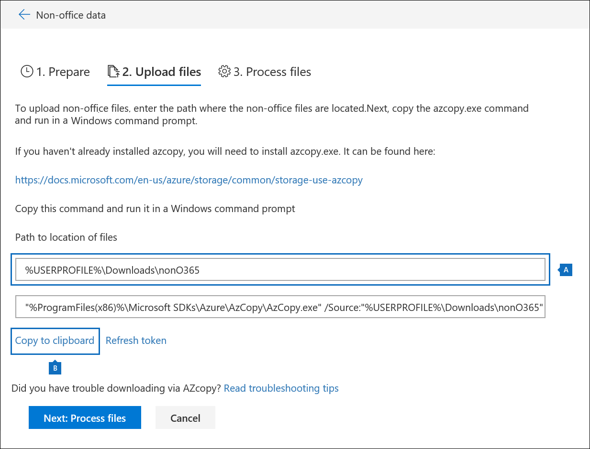
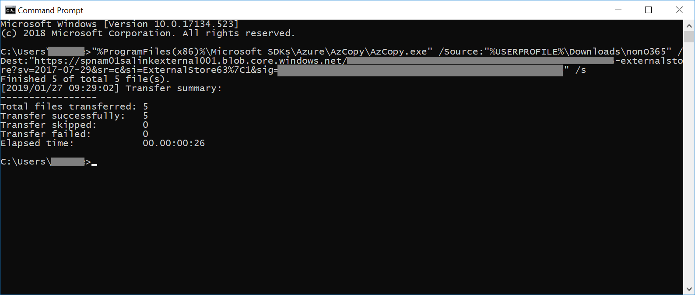
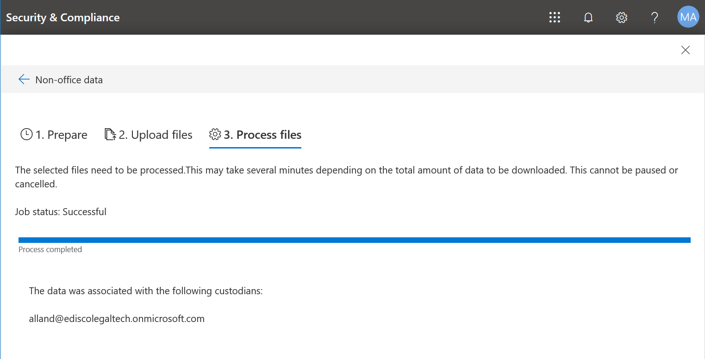

# 작업 집합으로 Office 365가 아닌 데이터 로드Load non-Office 365 data into a working set

Office 365 고급 eDiscovery와 분석 해야할 수 있는 모든 문서는 Office 365에서 live 됩니다. 비-Office 365 콘텐츠가 포함 된 고급 eDiscovery로 분석 되어 있으므로 작업 집합으로 Office 365에서 살고 있지는 문서를 업로드할 수 있는 고급 eDiscovery의 기능을 가져옵니다. 이 절차를 분석을 위해 고급 eDiscovery에 Office 365가 아닌 문서를 가져오는 방법을 보여줍니다.Not all documents that you may need to analyze with Office 365 Advanced eDiscovery will live in Office 365. With the Non-Office 365 content import feature in Advanced eDiscovery you can upload documents that don't live in Office 365 into a working set so it is analyzed with Advanced eDiscovery. This procedure shows you how to bring your non-Office 365 documents into Advanced eDiscovery for analysis.

>[!Note]
>Advanced eDiscovery를 사용하려면 Office 365 E3의 고급 준수 추가 기능이나 조직을 위한 E5 구독이 필요합니다. 이 요금제가 없는 상태에서 Advanced eDiscovery를 사용하려는 경우에는 Office 365 Enterprise E5 평가판을 등록할 수 있습니다.Advanced eDiscovery requires an Office 365 E3 with the Advanced Compliance add-on or an E5 subscription for your organization. If you don't have that plan and want to try Advanced eDiscovery, you can sign up for a trial of Office 365 Enterprise E5.

## 시작하기 전에Before you begin
이 절차의 설명에 따라 업로드 비 Office 365 기능을 사용 하 여가 있어야 합니다.Using the upload Non-Office 365 feature as described in this procedure requires that you have:
* Office 365 E3 준수 고급 추가 기능 또는 e 5 구독An Office 365 E3 with Advanced Compliance add-on or E5 subscription
* Office 365가 아닌 콘텐츠가 업로드 될 모든 custodians 고급 준수 추가 기능 또는 e 5 라이선스 E3 있어야All custodians whose non-Office 365 content will be uploaded must have E3 with Advanced Compliance add-on or E5 licenses
* 기존 eDiscovery 사례An existing eDiscovery case
* 더불어 당 하나의 폴더가 있으면 폴더의 이름은이 형식 *alias@domainname* 폴더에 업로드 하는 것에 대 한 파일을 모두 수집 합니다. 사용자가 Office 365 별칭 및 도메인 *alias@domainname* 이어야 합니다. 루트 폴더에 있는 모든 *alias@domainname* 폴더를 수집할 수 있습니다. 루트 폴더만 *alias@domainname* 폴더를 포함할 수, 루트 폴더에 없는 느슨한 파일 이어야 합니다.All the files for uploading gathered into folders where there is one folder per custodian and the folders' name is in this format *alias@domainname* . The *alias@domainname* must be users Office 365 alias and domain. You can collect all the *alias@domainname* folders into a root folder. The root folder can only contain the *alias@domainname* folders, there must be no loose files in the root folder
* EDiscovery 관리자 또는 eDiscovery 관리자가 Microsoft Azure 저장소 도구를 Office 365가 아닌 콘텐츠 폴더 구조에 대 한 액세스 권한이 있는 컴퓨터에 설치 되는 계정입니다.An account that is either an eDiscovery Manager or eDiscovery Administrator Microsoft Azure Storage Tools installed on a computer that has access to the non-Office 365 content folder structure.
* AzCopy, 설치 여기에서 수행할 수 있습니다.https://docs.microsoft.com/en-us/azure/storage/common/storage-use-azcopyInstall AzCopy, you can do this from here: https://docs.microsoft.com/en-us/azure/storage/common/storage-use-azcopy

## 고급 eDiscovery에 Office 365가 아닌 콘텐츠를 업로드 합니다.Upload non-Office 365 content into Advanced eDiscovery
1. EDiscovery 관리자 또는 eDiscovery 관리자, 고급 eDiscovery 후에 Office 365가 아닌 데이터를 업로드는 대/소문자를 엽니다.  **집합 (영문)** 탭을 클릭 한 다음 비 Office 365 데이터를 로드 하려는 작업 집합을 선택 합니다.  작업 집합을 아직 만들지 않은 경우 그렇게 지금 수행할 수 있습니다.  마지막으로 클릭 하 고 **수행 하는 작업 관리 설정** 되지 않은 Office 365 데이터 섹션에서 **보기 업로드**As an eDiscovery Manager or eDiscovery Administrator, open Advanced eDiscovery, then the case that the non-Office 365 data will be uploaded to.  Click the **Working sets** tab, then select the working set you wish to load the Non-Office 365 data to.  If you have not already created a working set, you can do so now.  Finally, click **Manage workings set** then **View uploads** in the Non-Office 365 data section

2. 비-Office 365 데이터 가져오기 마법사를 시작 하려면 **파일 업로드** 단추를 클릭 합니다.Click the **Upload files** button to start the Non-Office 365 data import wizard.

3. 마법사의 첫번째 단계는 단순히 파일을 업로드 하도록에 대 한 보안 Azure blob를 준비 합니다.  준비 compelted 후에을 클릭 하 고 **다음: 파일을 업로드할** 단추.The first step in the wizard simply prepares a secure Azure blob for the files to be uploaded.  Once preparation is compelted, click the **Next: Upload files** button.

 
4. **파일 업로드** 단계에서 **파일의 위치에 대 한 경로**지정 이것이 가져오기 (영문)에 계획 되지 않은 Office 365 데이터입니다.  명령은 제대로 업데이트는 AzCopy를 통해 올바른 위치를 설정 합니다.In the **Upload files** step, specify the **Path to location of files**, this is where the Non-Office 365 data you plan on importing is located.  Setting the correct location ensures the AzCopy command is properly updated.

> [!NOTE]
> AzCopy 아직 설치 하지 않은 경우 여기에서이 수행할 수 있습니다.https://docs.microsoft.com/en-us/azure/storage/common/storage-use-azcopyIf you have not already installed AzCopy, you can do this from here: https://docs.microsoft.com/en-us/azure/storage/common/storage-use-azcopy

5. **클립보드에 복사** 링크를 클릭 하 여 미리 정의 된 명령에 복사 합니다. Windows 명령 프롬프트를 시작 하 고 명령 붙여넣고 enter 키를 누릅니다.  다음 단계에 대 한 보안 Azure blob 저장소에 파일을 업로드 됩니다.Copy the predefined command by clicking the **Copy to clipboard** link. Start a windows command prompt, paste the command and press enter.  The files will be uploaded to the secure Azure blob storage for the next step.

6. 마지막으로, 보안 & 준수에 다시 반환 하 고 클릭 하 고 **다음: 파일을 처리** 단추.  이 처리, 텍스트 추출 및 업로드 된 파일의 인덱싱 시작 됩니다.  처리 여기 또는 **작업** 탭에서의 진행률을 추적할 수 있습니다.  완료 되 면 새 파일 작업 집합에서 제공 됩니다.  처리가 완료 되 면 마법사를 취소할 수 있습니다.Finally, return back to the Security & Compliance and click the **Next: Process files** button.  This will initiate processing, text extraction and indexing of the uploaded files.  You can track the progress of processing here or in the **Jobs** tab.  Once completed, the new files will be available in the working set.  Once processing is complete, you can dismiss the wizard.

