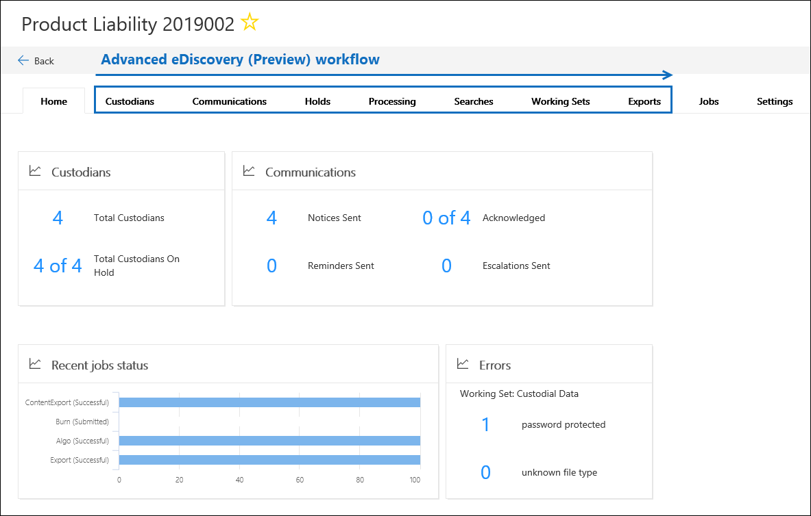

# Microsoft 365의 고급 eDiscovery 솔루션 개요

Microsoft 365의 고급 eDiscovery 솔루션은 Office 365의 기존 eDiscovery 및 분석 기능을 기반으로 작성 되었습니다. *Advanced eDiscovery*라는이 새로운 솔루션은 조직의 내부 및 외부 조사에 응답 하는 콘텐츠를 보존, 수집, 검토, 분석 및 내보내기 위한 종단 간 워크플로를 제공 합니다. 또한 법률 팀에서 법적 보존 알림 워크플로 전체를 관리 하 여 사례와 관련 된 custodians와 통신할 수 있습니다. 

## EDRM과 맞춤

기본 제공 되는 고급 eDiscovery 워크플로는 EDRM (전자식 Discovery Reference Model)에 의해 개요 된 eDiscovery 프로세스와 정렬 됩니다. 

(Edrm.net의 이미지 원본 관례입니다. 원본 이미지는 Creative Creative commons 특성 3.0이 아니라 Ported 라이선스를 통해 사용할 수 있습니다.

높은 수준에서 고급 eDiscovery는 EDRM 워크플로를 지 원하는 방법에 대해 설명 합니다.

- **식별** -조사에서 관심 있는 잠재적 사용자를 확인 한 후에는 조사와 관련 된 정보를 custodians ( *데이터 custodians*라고도 함)로 고급 기능에 추가할 수 있습니다. eDiscovery 사례 사용자가 custodians로 추가 된 후에는 custodian 문서를 보존, 수집 및 검토 하기가 쉽습니다.

- **보존** – 조사와 관련 된 데이터를 보존 하 고 보호 하기 위해 고급 eDiscovery를 사용 하 여 custodians와 연결 된 데이터 원본을 적절 하 게 유지할 수 있습니다. Custodial 되지 않은 데이터를 보류로 설정할 수도 있습니다. 또한 Advanced eDiscovery에는 custodians에 법적 보존 알림을 전송 하 고 해당 승인을 추적할 수 있는 기본 제공 되는 통신 워크플로가 포함 되어 있습니다.

- **컬렉션** -조사와 관련 된 데이터 원본을 식별 하 고 유지 한 후에는 고급 eDiscovery 검색에서 기본 제공 검색 도구를 사용 하 여 custodial 데이터 원본 (및 비 custodial 데이터 원본)에서 실시간 데이터를 수집할 수 있습니다. 해당 하는 경우 (해당 하는 경우) 사례와 관련이 있을 수 있습니다.

- **처리** -사례와 관련 된 모든 데이터를 수집한 후에는 이후 검토 및 분석을 위해이 프로세스를 처리 합니다. 고급 eDiscovery에서는 컬렉션 단계에서 식별 한 원본 위치 데이터가 Azure 저장소 위치 ( *검토 집합*이라고 함)로 복사 되어 사례 데이터에 대 한 정적 보기가 제공 됩니다. 
 
- **검토** -데이터를 검토 집합에 추가한 후 특정 문서를 보고 사례와 관련성이 가장 높은 데이터를 줄이기 위해 다른 쿼리를 실행할 수 있습니다. 또한 주석을 달고 특정 문서에 태그를 지정할 수 있습니다.
 
- **분석** -Advanced eDiscovery는 확인 하는 것이 적절 하지 않은 검토 집합에서 데이터를 추가로 cull 수 있도록 하는 통합 분석 도구를 제공 합니다. 또한 정보를 보다 효율적으로 구성 하 여 검토 프로세스를 보다 쉽게 수행할 수 있도록 하 여 관련 데이터의 양을 줄이는 것 외에도 eDiscovery는 콘텐츠를 구성할 수 있도록 하 여 법적 검토 비용을 절감할 수 있습니다.

- **프로덕션** 및 **프레젠테이션** -준비가 완료 되 면 검토 집합에서 법률 검토를 위해 문서를 내보낼 수 있습니다. 기본 형식이 나 EDRM으로 지정 된 형식으로 문서를 내보내서 타사 검토 응용 프로그램으로 가져올 수 있습니다.

## 고급 eDiscovery 워크플로

다음 섹션에서는 고급 eDiscovery에서 기본 제공 워크플로의 각 단계에 대해 설명 합니다. 다음 스크린샷에서는 *제품 책임 2019002*라는 사례에 대 한 **홈** 탭을 보여 줍니다. 참고 페이지 맨 위에 있는 워크플로 탭은 EDRM 프로세스에 맞게 시퀀싱 됩니다. 

Advanced eDiscovery의 종단 간 워크플로에 대 한 자세한 내용은이 [Microsoft 메커니즘 비디오](https://go.microsoft.com/fwlink/?linkid=2066133)를 참조 하세요. 

## Custodians 관리

**Custodians** 탭을 사용 하 여 대/소문자에서 원하는 사람으로 식별 된 사용자를 추가 하 고 관리 합니다. Custodians를 추가 하는 경우 custodian 데이터 원본에 법적 보존을 배치 하 고 custodians와 통신 하 고 custodian 데이터 원본을 검색 하 여 사례와 관련 된 콘텐츠를 수집 하는 것과 같은 관련 작업을 빠르게 수행할 수 있습니다. 사례가 진행 됨에 따라 custodians에서 새 custodians를 추가 하거나 릴리스를 쉽게 추가할 수 있습니다. 자세한 내용은 [Advanced eDiscovery에서 custodians 사용](managing-custodians.md)을 참조 하십시오.

## 법적 보존 알림 관리

**통신** 탭을 사용 하 여 사례에서 custodians와 통신 하는 프로세스를 관리 합니다. 법적 고 지 사항에서는 사례와 관련 된 모든 콘텐츠를 보존 하도록 custodians에 지시 합니다. 법률 팀은 custodians에서 수신, 읽기 및 승인 된 알림을 추적할 수 있어야 합니다. 고급 eDiscovery의 통신 워크플로를 사용 하면 custodians에서 보류 알림을 승인 하지 못할 경우 초기 알림, 미리 알림, 릴리스 알림 및 에스컬레이션을 만들고 보낼 수 있습니다. 자세한 내용은 [Advanced eDiscovery에서 통신에](managing-custodian-communications.md)대 한 작업을 참조 하세요.

## 콘텐츠 보존 관리

Custodian를 사례에 추가할 때 custodial 데이터를 보유할 수 있습니다. **보류** 중 탭을 사용 하 여 custodians을 추가할 때 생성 되는 보류를 관리 하 고 사례와 연결 된 다른 법적 보존을 관리할 수 있습니다. 예를 들어 custodial이 아닌 데이터 원본을 확인 하 고 보류할 수 있습니다. 또한 사례에서 보류를 편집 하 고 쿼리 기반 유지로 설정 하 여 쿼리와 일치 하는 콘텐츠만 보존할 수 있습니다. 예를 들어 날짜 범위를 보류에 추가 하 여 특정 날짜 이내에 만들어진 콘텐츠만 유지 되도록 할 수 있습니다. 보류 중인 콘텐츠에 대 한 통계를 가져오거나 사례에 더 이상 관련 되지 않은 보류를 제거 하거나 삭제할 수도 있습니다. 자세한 내용은 [Advanced eDiscovery에서 보류 관리](managing-holds.md)를 참조 하세요.

## Custodian 데이터 인덱싱

Custodian 및 해당 custodial 데이터 원본을 사례에 추가 하면 custodian 데이터 원본의 모든 부분적으로 인덱싱된 항목이 *고급 인덱싱*프로세스에 의해 다시 인덱싱됩니다. 이를 통해 이미지, 지원 되지 않는 파일 형식 및 기타 잠재적으로 인덱싱되지 않은 콘텐츠와 같은 custodial 콘텐츠가 검색을 실행 하 여 사례에 대 한 데이터를 수집할 때 완벽 하 게 검색할 수 있습니다. **처리** 탭을 사용 하 여 *오류 수정 관리*라는 프로세스를 사용 하 여 고급 인덱싱의 상태를 모니터링 하 고 처리 오류를 해결 합니다. 자세한 내용은 [Advanced eDiscovery의 처리 오류 수정을](processing-data-for-case.md)참조 하세요.

## 사례 데이터 수집하기

검색 탭 **** 에서는 사례와 관련 된 콘텐츠에 대해 Office 365에서 현재 위치 custodial 및 비 custodial 데이터 원본을 검색 하는 검색을 만들 수 있습니다. 키워드와 조건을 사용 하 여 쿼리 기반 검색을 만들고 실행 하 여 사례와 관련 된 전자 메일 메시지 및 문서 집합을 식별 하 고 eDiscovery 워크플로의 이후 단계에서 더 자세히 검토 하 고 분석할 수 있습니다. 사례와 연결 된 검색을 하나 이상 만들 수 있습니다. 또한 검색 도구를 사용 하 여 예제 문서를 미리 보고 검색 통계를 확인 하 여 검색 결과를 구체화 하 고 개선 하는 데 도움이 될 수 있습니다. 검색 결과에 사례와 관련 된 모든 데이터가 포함 되어 있는 경우 추가 검토, 분석 및 culling에 대 한 검토 집합에 검색 결과를 추가 합니다. 자세한 내용은 [Advanced eDiscovery에서 사례 데이터 수집](collecting-data-for-ediscovery.md)을 참조 하십시오.

## 사례 데이터 검토 및 분석

**검토 집합** 탭을 사용 하 여 라이브 시스템에서 수집한 콘텐츠를 검토 하 고 분석 한 후 검토 집합에 추가 했습니다. *검토 집합* 은 해당 데이터의 정적 컬렉션 (즉, 데이터의 오프 라인 복사본)은 eDiscovery 워크플로의 이전 단계에서 수집한 custodial 데이터 (해당 하는 경우에는 custodial 데이터)를 모아 놓은 것입니다. 검색 결과를 검토 집합에 추가 하면 컨테이너에서 파일을 추출 하 고 메타 데이터를 추출 하 고 텍스트를 추출 하는 프로세스가 트리거됩니다. 이 프로세스가 완료 되 면 시스템은 custodians에서 수집한 모든 데이터의 새 인덱스를 작성 하 고이를 검토 집합에 추가 합니다. 데이터를 검토 집합에 추가한 후 쿼리를 더 많이 실행 하 여 사례 데이터의 범위를 좁히거나, 데이터를 텍스트로 보거나 네이티브 파일 형식으로 표시 하 고, 검토 집합에서 문서에 주석을 달고, 교정 하 고, 태그를 지정할 수 있습니다. 문서 중복, 전자 메일 스레딩 및 테마 식별과 같은 고급 분석을 수행할 수도 있습니다. 사례와 관련 된 데이터에만 culled 후에는 문서를 직접 다운로드 하거나 파일 메타 데이터, 주석 및 모든 태그와 함께 내보낼 수 있습니다. 자세한 내용은 다음을 참조하세요.

 -Advanced[ediscovery에서 사례 데이터 검토](reviewing-data-in-review-set.md) -[advanced ediscovery에서 검토 집합의 데이터 분석](analyzing-data-in-review-set.md)

## 검토 및 프레젠테이션으로 데이터 내보내기

검토 집합에서 데이터를 내보낸 후에는 내보내기 탭을 **** 사용 하 여 export 작업을 관리 하 고 검토 집합에서 데이터를 다운로드 합니다. 검토 집합을 내보낼 때 데이터는 Azure 저장 위치로 업로드 된 후 로컬 컴퓨터로 다운로드할 수 있습니다. 내보낸 데이터를 다운로드 하는 데 필요한 저장소 평가 키는 **내보내기** 탭에서 구할 수 있습니다. 자세한 내용은 [Advanced eDiscovery에서 케이스 데이터 내보내기를](exporting-data-ediscover20.md)참조 하십시오.

## 작업 관리

**작업** 탭을 사용 하 여 시작한 사례 관련 작업에 대 한 장기 실행 프로세스를 모니터링 합니다. 작업의 예로는 사례 데이터의 다시 인덱스, 검색 및 내보내기와 관련 된 내용이 있습니다. 예를 들어 여러 데이터 원본을 포함 하는 검색 **** 탭에 검색할 경우 **작업** 탭에이 검색 프로세스의 상태가 표시 됩니다. 자세한 내용은 [Advanced eDiscovery에서 작업 관리](managing-jobs-ediscovery20.md)를 참조 하세요.

## 사례 설정 구성

**설정** 탭을 사용 하 여 대/소문자 전체의 설정을 구성 합니다. 여기에는 사례에 구성원 추가, 사례 닫기 또는 삭제, 검색 및 분석 설정 구성 등이 포함 됩니다. 자세한 내용은 [Advanced eDiscovery에서 사례 설정 구성을](configuring-case-settings-ediscovery20.md)참조 하십시오.
