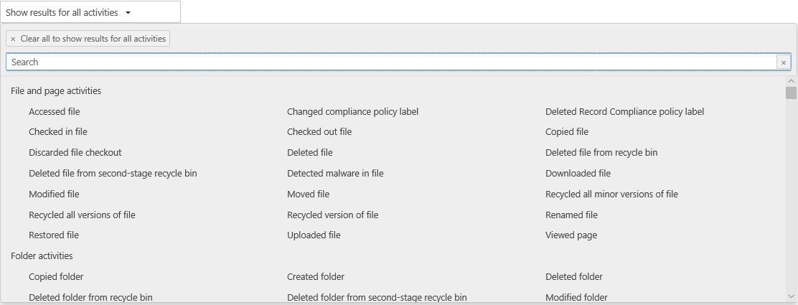

# custodian 감사 작업 보기View custodian audit activity

사용자가 특정 문서를 보거나 사서함에서 항목을 삭제 한 경우를 확인 해야 하나요?Need to find if a user viewed a specific document or purged an item from their mailbox? 이제 Advanced eDiscovery (Preview)가 보안 & 준수 센터의 기존 감사 로그 검색 도구와 통합 되었습니다.Advanced eDiscovery (Preview) is now integrated with the existing audit log search tool in the Security & Compliance Center. 이러한 임베디드 환경을 사용 하는 경우 Advanced eDiscovery (Preview) Custodian 관리 도구를 사용 하 여 사례 내에서 custodians에 대 한 작업을 쉽게 액세스 하 고 검색할 수 있습니다.Using this embedded experience, you can use the Advanced eDiscovery (Preview) Custodian Management tool to facilitate your investigation by easily accessing and searching the activity for custodians within your case.

## 시작하기 전에Before you begin

Office 365 감사 로그를 검색 하려면 Exchange Online에서 보기 전용 감사 로그 또는 감사 로그 역할을 할당 받아야 합니다.You have to be assigned the View-Only Audit Logs or Audit Logs role in Exchange Online to search the Office 365 audit log. 기본적으로 이러한 역할은 Exchange 관리 센터의 사용 권한 페이지에 있는 준수 관리 및 조직 관리 역할 그룹에 할당 됩니다.By default, these roles are assigned to the Compliance Management and Organization Management role groups on the Permissions page in the Exchange admin center. 사용자에 게 최소 수준의 권한으로 Advanced eDiscovery (미리 보기) 감사 로그를 검색할 수 있는 기능을 제공 하려면 Exchange Online에서 사용자 지정 역할 그룹을 만들고 보기 전용 감사 로그 또는 감사 로그 역할을 추가한 다음 사용자를 새 역할 gr의 구성원으로 추가 하면 됩니다. oupTo give a user the ability to search the Advanced eDiscovery (Preview) audit log with the minimum level of privileges, you can create a custom role group in Exchange Online, add the View-Only Audit Logs or Audit Logs role, and then add the user as a member of the new role group. 자세한 내용은 Exchange Online에서 역할 그룹 관리를 참조 하세요.For more information, see Manage role groups in Exchange Online.

> [!IMPORTANT]
> 보안 & 준수 센터의 사용 권한 페이지에서 사용자에 게 보기 전용 감사 로그 또는 감사 로그 역할을 할당 하면 Office 365 감사 로그를 검색할 수 없게 됩니다.If you assign a user the View-Only Audit Logs or Audit Logs role on the Permissions page in the Security & Compliance Center, they won't be able to search the Office 365 audit log. Exchange Online에서 사용 권한을 할당 해야 합니다.You have to assign the permissions in Exchange Online. 이는 감사 로그를 검색 하는 데 사용 되는 기본 cmdlet이 Exchange Online cmdlet 이기 때문입니다.This is because the underlying cmdlet used to search the audit log is an Exchange Online cmdlet.

## 1 단계: 고급 eDiscovery (미리 보기) 감사 로그 검색 만들기Step 1: Create an Advanced eDiscovery (Preview) audit log search

   1. **Security & 준수 센터 > Advanced eDiscovery (Preview)** 에서 기존 사례를 선택 합니다.Select an existing case from the **Security & Compliance Center > Advanced eDiscovery (Preview)**.
   
   2. **Custodians** 탭으로 이동 하 여 custodian을 선택 합니다.Navigate to the **Custodians** tab and select a custodian.
   
   3. custodian을 선택한 후Once you have selected a custodian, click    세부 정보 패널from the details panel.
   
   4. 다음 검색 조건을 구성 합니다.Configure the following search criteria:
      
      위한.a. **활동** -드롭다운 목록을 클릭 하 여 검색할 수 있는 활동을 표시 합니다.**Activities** - Click the drop-down list to display the activities that you can search for. 검색을 실행 한 후에는 선택한 활동에 대 한 감사 레코드만 표시 됩니다.After you run the search, only the audit records for the selected activities are displayed. **모든 작업에 대해 결과 표시** 를 선택 하면 다른 검색 조건을 충족 하는 모든 작업에 대 한 결과가 표시 됩니다.Selecting **Show results for all activities** will display results for all activities that meet the other search criteria.

      
      
      b.b. **시작 날짜 및 종료 날짜** -해당 기간 내에 발생 한 이벤트를 표시 하려면 날짜 및 시간 범위를 선택 합니다.**Start date and End date** - Select a date and time range to display the events that occurred within that period. 지난 7 일이 기본적으로 선택 됩니다.The last seven days are selected by default. 날짜와 시간은 utc (협정 세계시) 형식으로 표시 됩니다.The date and time are presented in Coordinated Universal Time (UTC) format. 지정할 수 있는 최대 날짜 범위는 1 년입니다.The maximum date range that you can specify is one year.
      
      &.c. 이 상자를 **Custodians** 클릭 한 다음 특정 custodian을 선택 하 여 검색 결과를 표시 합니다.**Custodians** - Click in this box and then select a specific custodian to display search results for. 이 상자에서 선택한 사용자가 수행한 선택한 작업에 대 한 감사 레코드가 결과 목록에 표시 됩니다.Audit records for the selected activity performed by the users you select in this box are displayed in the list of results.
      
   5. 누른Click     검색 조건을 사용 하 여 검색을 실행 하려면to run the search using your search criteria. 검색 결과가 로드 되 고 몇 분 후에 Custodian 작업 검색 페이지에서 결과 아래에 표시 됩니다.The search results are loaded, and after a few moments they are displayed under Results on the Custodian Activities search page. 

## 2 단계: 감사 로그 검색 결과 보기Step 2: View the audit log search results

감사 로그 검색의 결과는 Custodian 감사 로그 페이지의 결과 아래에 표시 됩니다.The results of an audit log search are displayed under Results on the Custodian Audit log page. 최대 5000 (최신) 이벤트는 150 이벤트 단위로 표시 됩니다.A maximum of 5,000 (newest) events are displayed in increments of 150 events. 더 많은 이벤트를 표시 하려면 결과 창에서 스크롤 막대를 사용 하거나 Shift + End를 눌러 다음 150 이벤트를 표시할 수 있습니다.To display more events you can use the scroll bar in the Results pane or you can press Shift + End to display the next 150 events.

결과에는 검색에서 반환 된 각 이벤트에 대 한 다음과 같은 정보가 포함 됩니다.The results contain the following information about each event returned by the search.
- **date**: 이벤트가 발생 한 날짜 및 시간 (UTC 형식)입니다.**Date**: The date and time (in UTC format) when the event occurred.

- **IP 주소**: 활동을 로깅할 때 사용 된 장치의 ip 주소입니다.**IP address**: The IP address of the device that was used when the activity was logged. IP 주소는 IPv4 또는 IPv6 주소 형식으로 표시 됩니다.The IP address is displayed in either an IPv4 or IPv6 address format.

- **사용자**: 이벤트를 트리거한 작업을 수행한 사용자 또는 서비스 계정입니다.**User**: The user (or service account) who performed the action that triggered the event.

- **활동**: 사용자가 수행 하는 작업입니다.**Activity**: The activity performed by the user. 이 값은 활동 드롭다운 목록에서 선택한 활동에 해당 합니다.This value corresponds to the activities that you selected in the Activities drop down list. exchange 관리자 감사 로그의 이벤트에 대해이 열의 값은 exchange cmdlet입니다.For an event from the Exchange admin audit log, the value in this column is an Exchange cmdlet.

- **Item**: 해당 활동의 결과로 만들어지거나 수정 된 개체입니다.**Item**: The object that was created or modified as a result of the corresponding activity. 예를 들어, 보거나 수정한 파일 또는 업데이트 된 사용자 계정입니다.For example, the file that was viewed or modified or the user account that was updated. 모든 활동에이 열에 대 한 값이 있는 것은 아닙니다.Not all activities have a value in this column.

- **세부 정보**: 활동에 대 한 추가 정보입니다.**Detail**: Additional detail about an activity. 다시 말하지만 모든 작업에는 값이 포함 되지 않습니다.Again, not all activities will have a value.

## 3 단계: 검색 결과 필터링Step 3: Filter the search results

정렬 외에도 감사 로그 검색의 결과를 필터링 할 수도 있습니다.In addition to sorting, you can also filter the results of an audit log search. 이를 통해 특정 사용자 또는 활동에 대 한 결과를 빠르게 필터링 할 수 있습니다.This can help you quickly filter the results for a specific user or activity. 

결과를 필터링 하려면To filter the results:

 1. 감사 로그 검색을 만들어 실행 합니다.Create and run an audit log search.
  
2. 결과가 표시 되 면 **필터 결과**를 클릭 합니다.When the results are displayed, click **Filter results**.
 
3. 각 열 머리글 아래에 키워드 상자가 표시 됩니다.Keyword boxes are displayed under each column header.
  
4. 필터링 하는 열에 따라 열 머리글 아래의 상자 중 하나를 클릭 하 고 단어 또는 구를 입력 합니다.Click one of the boxes under a column header and type a word or phrase, depending on the column you're filtering on. 결과가 동적으로 readjust 필터와 일치 하는 이벤트가 표시 됩니다.The results will dynamically readjust to display the events that match your filter.
  
5. 필터를 지우려면 필터 상자에서 **X** 를 클릭 하거나 **필터링 숨기기**를 클릭 하면 됩니다.To clear a filter, click the **X** in the filter box or just click **Hide filtering**.

## 검색 결과를 파일로 내보내기Export the search results to a file

감사 로그 검색 결과를 로컬 컴퓨터의 CSV (쉼표로 구분 된 값) 파일로 내보낼 수 있습니다.You can export the results of an audit log search to a comma separated value (CSV) file on your local computer. Microsoft Excel에서이 파일을 열고, 검색, 정렬, 필터링, 다중 값 셀이 포함 된 단일 열을 여러 열로 분할 등의 기능을 사용할 수 있습니다.You can open this file in Microsoft Excel and use features such as search, sorting, filtering, and splitting a single column (that contains multi-value cells) into multiple columns.

1. 감사 로그 검색을 실행 한 다음 원하는 결과가 나올 때까지 검색 조건을 수정 합니다.Run an audit log search, and then revise the search criteria until you have the desired results.
  
2. 결과 내보내기를 클릭 하 고 다음 옵션 중 하나를 선택 합니다.Click Export results and select one of the following options:

    - **로드 된 결과 저장:** **Custodian 감사 로그 검색** 페이지의 **결과** 에 표시 되는 항목만 내보내려면이 옵션을 선택 합니다.**Save loaded results:** Choose this option to export only the entries that are displayed under **Results** on the **Custodian Audit log search** page. 다운로드 되는 CSV 파일에는 페이지 (날짜, 사용자, 작업, 항목 및 세부 정보)에 표시 되는 것과 동일한 열 (및 데이터)이 포함 되어 있습니다.The CSV file that is downloaded contains the same columns (and data) displayed on the page (Date, User, Activity, Item, and Details). CSV 파일에는 감사 로그 항목에서 더 많은 정보가 포함 된 추가 열 ( **더 자세히**)이 포함 되어 있습니다.An additional column (titled **More**) is included in the CSV file that contains more information from the audit log entry. 감사 로그 검색 페이지에서 로드 되 고 볼 수 있는 것과 동일한 결과를 내보내기 때문에 최대 5000 개의 항목을 내보냅니다.Because you're exporting the same results that are loaded (and viewable) on the Audit log search page, a maximum of 5,000 entries are exported.
        
    - **모든 결과를 다운로드 합니다.** 검색 조건을 충족 하는 Office 365 감사 로그의 모든 항목을 내보내려면이 옵션을 선택 합니다.**Download all results:** Choose this option to export all entries from the Office 365 audit log that meet the search criteria. 많은 검색 결과 집합의 경우 **Custodian 감사 로그** 검색 페이지에 표시할 수 있는 5000 결과 외에도 감사 로그의 모든 항목을 다운로드 하려면이 옵션을 선택 합니다.For a large set of search results, choose this option to download all entries from the audit log in addition to the 5,000 results that can be displayed on the **Custodian Audit log** search page. 이 옵션은 감사 로그의 원시 데이터를 CSV 파일로 다운로드 하 고 감사 로그 항목에서 auditdata 라는 열에 대 한 추가 정보를 포함 합니다.This option will download the raw data from the audit log to a CSV file, and contains additional information from the audit log entry in a column named AuditData. 다른 옵션을 선택 하는 경우이 내보내기 옵션을 선택 하면 다운로드 한 파일 보다 훨씬 커질 수 있으므로 파일을 다운로드 하는 데 시간이 오래 걸릴 수도 있습니다.It may take longer to download the file if you choose this export option because the file may be much larger than the one that's downloaded if you choose the other option.
    
      > [!IMPORTANT]
      > 단일 감사 로그 검색에서 최대 5만 개의 항목을 CSV 파일에 다운로드할 수 있습니다.You can download a maximum of 50,000 entries to a CSV file from a single audit log search. 5만 항목이 CSV 파일에 다운로드 되는 경우 검색 조건을 충족 하는 이벤트가 5만 개 보다 많은 것으로 간주할 수 있습니다.If 50,000 entries are downloaded to the CSV file, you can probably assume there are more than 50,000 events that met the search criteria. 이 제한 보다 많은 시간을 내보내려면 날짜 범위를 사용 하 여 감사 로그 항목 수를 줄이십시오.To export more than this limit, try using a date range to reduce the number of audit log entries. 5만 개 보다 많은 항목을 내보내려면 날짜 범위가 더 작은 검색을 여러 개 실행 해야 할 수 있습니다.You might have to run multiple searches with smaller date ranges to export more than 50,000 entries.
        

3. 내보내기 옵션을 선택한 후에는 CSV 파일을 열거나 다운로드 폴더에 저장 하거나 특정 폴더에 저장 하 라는 메시지를 창 아래쪽에 표시 합니다.After you select an export option, a message is displayed at the bottom of the window that prompts you to open the CSV file, save it to the Downloads folder, or save it to a specific folder

감사 로그 검색 결과를 보거나 필터링 하거나 내보내는 방법에 대 한 자세한 내용은 [search the audit log in the Office 365 Security & 준수 센터](../search-the-audit-log-in-security-and-compliance.md)를 참조 하십시오.For more information about viewing, filtering, or exporting audit log search results, see [Search the audit log in the Office 365 Security & Compliance Center](../search-the-audit-log-in-security-and-compliance.md).
