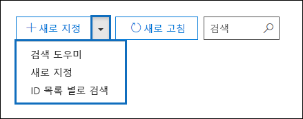
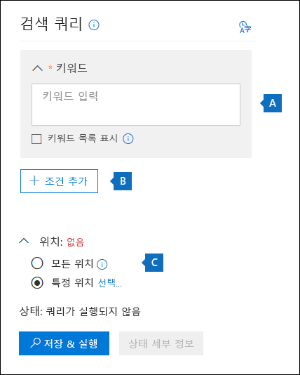
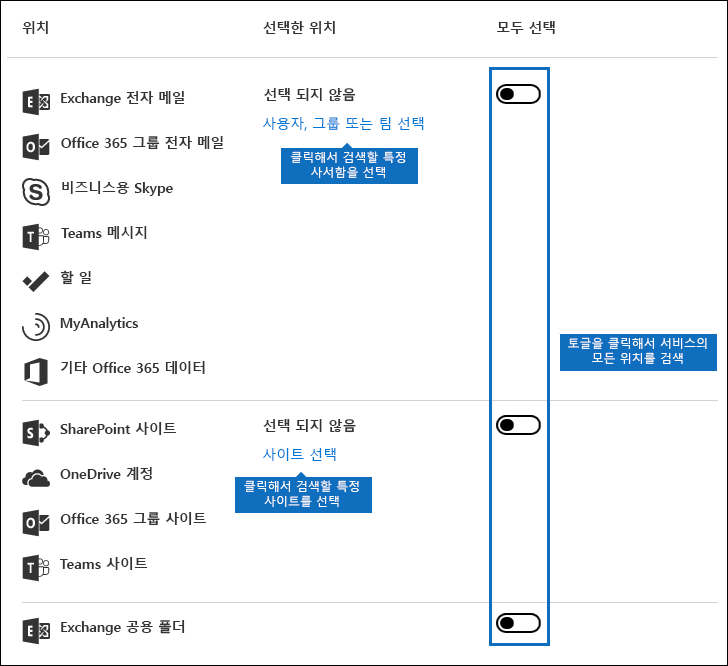
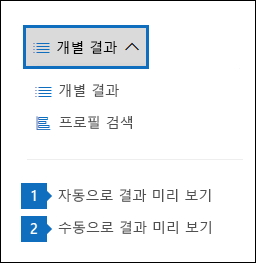
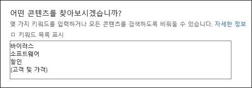
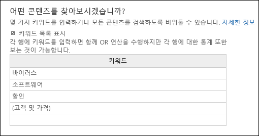
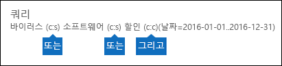
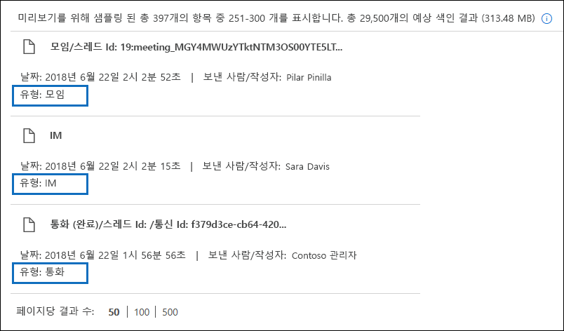
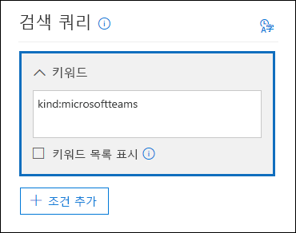
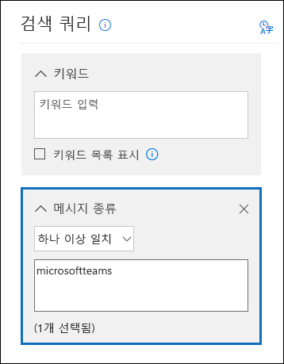

# <a name="content-search-in-office-365"></a><span data-ttu-id="5a2ac-106">Office 365의 콘텐츠 검색</span><span class="sxs-lookup"><span data-stu-id="5a2ac-106">Content Search in Office 365</span></span>

<span data-ttu-id="5a2ac-107">Office 365 또는 Microsoft 365의 준수 센터에서 콘텐츠 검색 eDiscovery 도구를 사용 하 여 Office 365 조 직에서 전자 메일, 문서 및 인스턴트 메시징 대화와 같은 원본 위치 항목을 검색할 수 있습니다.</span><span class="sxs-lookup"><span data-stu-id="5a2ac-107">You can use the Content Search eDiscovery tool in the compliance center in Office 365 or Microsoft 365 to search for in-place items such as email, documents, and instant messaging conversations in your Office 365 organization.</span></span> <span data-ttu-id="5a2ac-108">이 도구를 사용 하 여 다음 Office 365 서비스에서 항목을 검색 합니다.</span><span class="sxs-lookup"><span data-stu-id="5a2ac-108">Use this tool to search for items in these Office 365 services:</span></span>
  
- <span data-ttu-id="5a2ac-109">Exchange Online 사서함 및 공용 폴더</span><span class="sxs-lookup"><span data-stu-id="5a2ac-109">Exchange Online mailboxes and public folders</span></span>
    
- <span data-ttu-id="5a2ac-110">SharePoint Online 사이트 및 비즈니스용 OneDrive 계정</span><span class="sxs-lookup"><span data-stu-id="5a2ac-110">SharePoint Online sites and OneDrive for Business accounts</span></span>
    
- <span data-ttu-id="5a2ac-111">비즈니스용 Skype 대화</span><span class="sxs-lookup"><span data-stu-id="5a2ac-111">Skype for Business conversations</span></span>
    
- <span data-ttu-id="5a2ac-112">Microsoft Teams</span><span class="sxs-lookup"><span data-stu-id="5a2ac-112">Microsoft Teams</span></span> 
    
- <span data-ttu-id="5a2ac-113">Office 365 그룹</span><span class="sxs-lookup"><span data-stu-id="5a2ac-113">Office 365 Groups</span></span>
    
<span data-ttu-id="5a2ac-114">콘텐츠 검색을 실행 한 후에는 검색 프로필에 콘텐츠 위치 수와 예상 검색 결과 수가 표시 됩니다.</span><span class="sxs-lookup"><span data-stu-id="5a2ac-114">After you run a Content Search, the number of content locations and an estimated number of search results are displayed in the search profile.</span></span> <span data-ttu-id="5a2ac-115">또한 검색 쿼리와 일치 하는 항목이 가장 많은 콘텐츠 위치와 같은 통계를 빠르게 확인할 수 있습니다.</span><span class="sxs-lookup"><span data-stu-id="5a2ac-115">You can also quickly view statistics, such as the content locations that have the most items that match the search query.</span></span> <span data-ttu-id="5a2ac-116">검색을 실행 한 후 결과를 미리 보거나 로컬 컴퓨터로 내보낼 수 있습니다.</span><span class="sxs-lookup"><span data-stu-id="5a2ac-116">After you run a search, you can preview the results or export them to a local computer.</span></span>


## <a name="create-a-new-search"></a><span data-ttu-id="5a2ac-117">새 검색 만들기</span><span class="sxs-lookup"><span data-stu-id="5a2ac-117">Create a new search</span></span>

<span data-ttu-id="5a2ac-118">검색 결과를 미리 보고 내보낼 수 있도록 **콘텐츠 검색** 페이지에 대 한 액세스 권한을 보유 하려면 관리자, 규정 준수 책임자 또는 ediscovery 관리자가 Security _AMP_ 준수 센터에서 ediscovery 관리자 역할 그룹의 구성원 이어야 합니다.</span><span class="sxs-lookup"><span data-stu-id="5a2ac-118">To have access to the **Content search** page to run searches and preview and export search results, an administrator, compliance officer, or eDiscovery manager must be a member of the eDiscovery Manager role group in the Security & Compliance Center.</span></span> <span data-ttu-id="5a2ac-119">자세한 내용은 [eDiscovery 사용 권한 할당](assign-ediscovery-permissions.md)을 참조 하십시오.</span><span class="sxs-lookup"><span data-stu-id="5a2ac-119">For more information, see [Assign eDiscovery permissions](assign-ediscovery-permissions.md).</span></span>
  
1. <span data-ttu-id="5a2ac-120">으로 이동 [https://protection.office.com](https://protection.office.com) 하 고 Office 365 전자 메일 주소 및 암호를 사용 하 여 로그인 합니다.</span><span class="sxs-lookup"><span data-stu-id="5a2ac-120">Go to [https://protection.office.com](https://protection.office.com) and sign in using your Office 365 email address and password.</span></span>
    
2. <span data-ttu-id="5a2ac-121">**콘텐츠 검색** **검색** \> 을 클릭 합니다.</span><span class="sxs-lookup"><span data-stu-id="5a2ac-121">Click **Search** \> **Content search**.</span></span>
    
3. <span data-ttu-id="5a2ac-122">**검색** 페이지에서  **새 검색**옆의 화살표를 클릭 합니다.</span><span class="sxs-lookup"><span data-stu-id="5a2ac-122">On the **Search** page, click the arrow next to  **New search**.</span></span> 
    
    
  
    <span data-ttu-id="5a2ac-124">내부 DNS 조회 탭에서는 내부 메일 배달을 위해 메일 서버의 주소를 확인할 때 이 서버에 설치된 네트워크 어댑터에 구성되어 있는 DNS 서버를 사용할지 또는 특정 DNS 서버를 사용할지를 지정할 수 있습니다. 내부 DNS 서버는 조직 내에서 서버의 IP 주소를 확인하는 데 사용됩니다.</span><span class="sxs-lookup"><span data-stu-id="5a2ac-124">You can choose one of the following options:</span></span>
    
    - <span data-ttu-id="5a2ac-125">**안내가** 제공 되는 검색-이 옵션을 선택 하면 검색을 만드는 과정을 안내 하는 마법사가 시작 됩니다.</span><span class="sxs-lookup"><span data-stu-id="5a2ac-125">**Guided search** - This option starts a wizard that guides you through the creating the search.</span></span> <span data-ttu-id="5a2ac-126">콘텐츠 위치를 선택 하 고 검색 쿼리를 작성 하는 사용자 인터페이스는 **새 검색** 옵션과 동일 합니다.</span><span class="sxs-lookup"><span data-stu-id="5a2ac-126">The user interface to select content locations and build the search query are the same as the **New search** option.</span></span> 
    
    - <span data-ttu-id="5a2ac-127">**새** 검색-이 옵션은 새 검색을 만들기 위해 업데이트 된 사용자 인터페이스를 표시 합니다.</span><span class="sxs-lookup"><span data-stu-id="5a2ac-127">**New search** - This option displays an updated user interface to create a new search.</span></span> <span data-ttu-id="5a2ac-128">**새 검색**을 클릭 하는 경우이 옵션이 기본 옵션입니다.</span><span class="sxs-lookup"><span data-stu-id="5a2ac-128">This is the default option if you click **New search**.</span></span>
    
    - <span data-ttu-id="5a2ac-129">**ID 목록으로 검색** -이 옵션을 사용 하면 Exchange id 목록으로 특정 전자 메일 메시지 및 기타 사서함 항목을 검색할 수 있습니다.</span><span class="sxs-lookup"><span data-stu-id="5a2ac-129">**Search by ID List** - This option lets you search for specific email messages and other mailbox items using a list of Exchange IDs.</span></span> <span data-ttu-id="5a2ac-130">ID 목록 검색을 만들려면 검색할 특정 사서함 항목을 식별 하는 CSV (쉼표로 구분 된 값) 파일을 전송 합니다.</span><span class="sxs-lookup"><span data-stu-id="5a2ac-130">To create an ID list search (formally called a targeted search), you submit a comma separated value (CSV) file that identifies the specific mailbox items to search for.</span></span> <span data-ttu-id="5a2ac-131">자세한 내용은 [Office 365에서 ID 목록 콘텐츠 검색에 대 한 CSV 파일 준비를](csv-file-for-an-id-list-content-search.md)참조 하세요.</span><span class="sxs-lookup"><span data-stu-id="5a2ac-131">For instructions, see [Prepare a CSV file for an ID list Content Search in Office 365](csv-file-for-an-id-list-content-search.md).</span></span>
    
    <span data-ttu-id="5a2ac-132">이 절차의 나머지 단계는 기본 새 검색 워크플로를 따릅니다.</span><span class="sxs-lookup"><span data-stu-id="5a2ac-132">The remainder of the steps in this procedure will follow the default new search workflow.</span></span>
    
4. <span data-ttu-id="5a2ac-133">드롭다운 목록에서 **새 검색** 을 클릭 합니다.</span><span class="sxs-lookup"><span data-stu-id="5a2ac-133">Click **New search** in the drop-down list.</span></span> 
    
5. <span data-ttu-id="5a2ac-134">**검색 쿼리**아래에서 다음 항목을 지정 합니다.</span><span class="sxs-lookup"><span data-stu-id="5a2ac-134">Under **Search query**, specify the following things.</span></span>
    
    
  
   - <span data-ttu-id="5a2ac-136">**검색할 키워드** 상자에 검색 쿼리를 입력 합니다. \*\*\*\*</span><span class="sxs-lookup"><span data-stu-id="5a2ac-136">**Keywords to search for** - Type a search query in **Keywords** box.</span></span> <span data-ttu-id="5a2ac-137">키워드, 메시지 속성(보낸 날짜 및 받은 날짜) 또는 문서 속성(예: 파일 이름 또는 문서를 마지막으로 변경한 날짜)을 지정할 수 있습니다.</span><span class="sxs-lookup"><span data-stu-id="5a2ac-137">You can specify keywords, message properties such as sent and received dates, or document properties such as file names or the date that a document was last changed.</span></span> <span data-ttu-id="5a2ac-138">**And**, **OR**, **NOT**및 **NEAR**과 같은 부울 연산자를 사용 하는 보다 복잡 한 쿼리를 사용할 수 있습니다.</span><span class="sxs-lookup"><span data-stu-id="5a2ac-138">You can use a more complex queries that use a Boolean operator, such as **AND**, **OR**, **NOT**, and **NEAR**.</span></span> <span data-ttu-id="5a2ac-139">문서에서 중요 한 정보 (예: 주민 등록 번호)를 검색 하거나 외부에서 공유한 문서를 검색할 수도 있습니다.</span><span class="sxs-lookup"><span data-stu-id="5a2ac-139">You can also search for sensitive information (such as social security numbers) in documents, or search for documents that have been shared externally.</span></span> <span data-ttu-id="5a2ac-140">키워드 상자를 비워 두면 지정 된 콘텐츠 위치에 있는 모든 콘텐츠가 검색 결과에 포함 됩니다.</span><span class="sxs-lookup"><span data-stu-id="5a2ac-140">If you leave the keyword box empty, all content located in the specified content locations will be included in the search results.</span></span>
    
      <span data-ttu-id="5a2ac-141">또는 **키워드 목록 표시** 확인란을 클릭 하 고 각 행에 키워드를 입력할 수 있습니다.</span><span class="sxs-lookup"><span data-stu-id="5a2ac-141">Alternatively, you can click the **Show keyword list** checkbox and the type a keyword in each row.</span></span> <span data-ttu-id="5a2ac-142">이 작업을 수행 하는 경우 각 행의 키워드는 생성 되는 검색 쿼리의 **OR** 연산자와 유사한 기능을 하는 논리 연산자 ( **c:s**)에 의해 연결 됩니다.</span><span class="sxs-lookup"><span data-stu-id="5a2ac-142">If you do this, the keywords on each row are connected by a logical operator ( **c:s**) that is similar in functionality to the **OR** operator in the search query that's created.</span></span> 
    
      <span data-ttu-id="5a2ac-143">키워드 목록을 사용 하는 이유</span><span class="sxs-lookup"><span data-stu-id="5a2ac-143">Why use the keyword list?</span></span> <span data-ttu-id="5a2ac-144">각 키워드와 일치 하는 항목의 수를 보여 주는 통계를 가져올 수 있습니다.</span><span class="sxs-lookup"><span data-stu-id="5a2ac-144">You can get statistics that show how many items match each keyword.</span></span> <span data-ttu-id="5a2ac-145">이를 통해 가장 효과적이 고 효과적인 키워드를 빠르게 확인할 수 있습니다.</span><span class="sxs-lookup"><span data-stu-id="5a2ac-145">This can help you quickly identify which keywords are the most (and least) effective.</span></span> <span data-ttu-id="5a2ac-146">행에 괄호를 사용 하 여 키워드로 묶은 키워드 구를 사용할 수도 있습니다.</span><span class="sxs-lookup"><span data-stu-id="5a2ac-146">You can also use a keyword phrase (surrounded by parentheses) in a row.</span></span> <span data-ttu-id="5a2ac-147">검색 통계에 대 한 자세한 내용은 [콘텐츠 검색 결과에 대 한 키워드 통계 보기](view-keyword-statistics-for-content-search.md)를 참조 하십시오.</span><span class="sxs-lookup"><span data-stu-id="5a2ac-147">For more information about search statistics, see [View keyword statistics for Content Search results](view-keyword-statistics-for-content-search.md).</span></span>

    > [!NOTE]
    > <span data-ttu-id="5a2ac-148">큰 키워드 목록으로 인해 발생 하는 문제를 줄이기 위해 이제는 키워드 목록에서 최대 20 개의 행으로 제한 됩니다.</span><span class="sxs-lookup"><span data-stu-id="5a2ac-148">To help reduce issues caused by large keyword lists, you're now limited to a maximum of 20 rows in the keyword list.</span></span>
    
    - <span data-ttu-id="5a2ac-149">**조건** -검색 조건을 추가 하 여 검색 범위를 좁히고 보다 구체화 된 결과 집합을 반환할 수 있습니다.</span><span class="sxs-lookup"><span data-stu-id="5a2ac-149">**Conditions** - You can add search conditions to narrow a search and return a more refined set of results.</span></span> <span data-ttu-id="5a2ac-150">각 조건은 검색 쿼리에 검색을 시작할 때 만들어지고 실행 되는 절을 추가 합니다.</span><span class="sxs-lookup"><span data-stu-id="5a2ac-150">Each condition adds a clause to the search query that is created and run when you start the search.</span></span> <span data-ttu-id="5a2ac-151">조건은 **AND** 연산자의 기능과 유사한 논리 연산자 ( **c:c**)에 의해 키워드 상자에 지정 된 키워드 쿼리에 논리적으로 연결 됩니다.</span><span class="sxs-lookup"><span data-stu-id="5a2ac-151">A condition is logically connected to the keyword query (specified in the keyword box) by a logical operator ( **c:c**) that is similar in functionality to the **AND** operator.</span></span> <span data-ttu-id="5a2ac-152">즉, 항목은 키워드 쿼리와 결과에 포함할 하나 이상의 조건을 만족 해야 합니다.</span><span class="sxs-lookup"><span data-stu-id="5a2ac-152">That means that items have to satisfy both the keyword query and one or more conditions to be included in the results.</span></span> <span data-ttu-id="5a2ac-153">조건은 이런 방식으로 결과 범위를 좁히는 데 도움이 됩니다.</span><span class="sxs-lookup"><span data-stu-id="5a2ac-153">This is how conditions help to narrow your results.</span></span> <span data-ttu-id="5a2ac-154">검색 쿼리에 사용할 수 있는 조건에 대 한 목록 및 설명은 [키워드 쿼리 및 검색 조건의 콘텐츠 검색](keyword-queries-and-search-conditions.md#search-conditions)에서 "검색 조건" 섹션을 참조 하십시오.</span><span class="sxs-lookup"><span data-stu-id="5a2ac-154">For a list and description of conditions that you can use in a search query, see the "Search conditions" section in [Keyword queries and search conditions for Content Search](keyword-queries-and-search-conditions.md#search-conditions).</span></span>
    
       - <span data-ttu-id="5a2ac-155">**위치** -검색할 콘텐츠 위치를 선택 합니다.</span><span class="sxs-lookup"><span data-stu-id="5a2ac-155">**Locations** - Choose the content locations to search.</span></span>
    
      - <span data-ttu-id="5a2ac-156">**모든 위치** -이 옵션을 사용 하 여 조직의 모든 콘텐츠 위치를 검색 합니다.</span><span class="sxs-lookup"><span data-stu-id="5a2ac-156">**All locations** - Use this option to search all content locations in your organization.</span></span> <span data-ttu-id="5a2ac-157">모든 Exchange 사서함의 전자 메일 (모든 비활성 사서함, 모든 Office 365 그룹의 사서함, 모든 Microsoft 팀의 사서함), 모든 비즈니스용 Skype 대화, 모든 SharePoint 및 비즈니스용 OneDrive 사이트 (사이트 포함)가 포함 됩니다. 모든 Office 365 그룹 및 Microsoft 팀) 및 모든 Exchange 공용 폴더의 항목</span><span class="sxs-lookup"><span data-stu-id="5a2ac-157">This includes email in all Exchange mailboxes (including all inactive mailboxes, mailboxes for all Office 365 Groups, mailboxes for all Microsoft Teams), all Skype for Business conversations, all SharePoint and OneDrive for Business sites (including the sites for all Office 365 Groups and Microsoft Teams), and items in all Exchange public folders.</span></span>
    
      - <span data-ttu-id="5a2ac-158">**특정 위치** -특정 콘텐츠 위치를 검색 하려면이 옵션을 사용 합니다.</span><span class="sxs-lookup"><span data-stu-id="5a2ac-158">**Specific locations** - Use this option to search specific content locations.</span></span> <span data-ttu-id="5a2ac-159">모든 Exchange 사서함을 검색 하거나 모든 SharePoint 사이트를 검색 하는 등 특정 Office 365 서비스의 모든 콘텐츠 위치를 검색 하거나, 표시 되는 Office 365 서비스에서 특정 위치를 검색할 수 있습니다.</span><span class="sxs-lookup"><span data-stu-id="5a2ac-159">You can search all content locations for a specific Office 365 service (such as searching all Exchange mailboxes or search all SharePoint sites) or you can search specific locations in any of the Office 365 services that are displayed.</span></span> 
    
        
  
         <span data-ttu-id="5a2ac-161">검색할 Exchange 사서함 목록에 메일 그룹을 추가할 수도 있습니다.</span><span class="sxs-lookup"><span data-stu-id="5a2ac-161">Note that you can also add distribution groups to the list of Exchange mailboxes to search.</span></span> <span data-ttu-id="5a2ac-162">메일 그룹의 경우 그룹 구성원의 사서함이 검색 됩니다.</span><span class="sxs-lookup"><span data-stu-id="5a2ac-162">For distribution groups, the mailboxes of group members are searched.</span></span> <span data-ttu-id="5a2ac-163">동적 메일 그룹은 지원 되지 않습니다.</span><span class="sxs-lookup"><span data-stu-id="5a2ac-163">Note that dynamic distribution groups aren't supported.</span></span>
    
       <span data-ttu-id="5a2ac-164">**중요:** 모든 사서함 위치나 특정 사서함을 검색 하면 콘텐츠 검색 결과를 내보낼 때 사용자 사서함에 저장 된 MyAnalytics 및 기타 Office 365 응용 프로그램의 데이터가 포함 됩니다.</span><span class="sxs-lookup"><span data-stu-id="5a2ac-164">**Important:** When you search all mailbox locations or just specific mailboxes, data from MyAnalytics and other Office 365 applications that's saved to user mailboxes will be included when you export the results of a Content Search.</span></span> <span data-ttu-id="5a2ac-165">이 데이터는 예상 검색 결과에 포함 되지 않으며 미리 보기에 사용할 수 없습니다.</span><span class="sxs-lookup"><span data-stu-id="5a2ac-165">This data will not be included in the estimated search results and it won't be available for preview.</span></span> <span data-ttu-id="5a2ac-166">검색 결과를 내보내고 다운로드 하는 경우에만 포함 됩니다. "콘텐츠 검색에 대 한 자세한 정보" 섹션에서 [MyAnalytics 및 기타 Office 365 응용 프로그램에서 데이터 내보내기를](#exporting-data-from-myanalytics-and-other-office-365-applications) 참조 하세요.</span><span class="sxs-lookup"><span data-stu-id="5a2ac-166">It will only be included when you export and download the search results; see [Exporting data from MyAnalytics and other Office 365 applications](#exporting-data-from-myanalytics-and-other-office-365-applications) in the "More information about content search" section.</span></span> 
    
6. <span data-ttu-id="5a2ac-167">검색 쿼리를 설정한 후에는 **저장 &amp; 실행**을 클릭 합니다.</span><span class="sxs-lookup"><span data-stu-id="5a2ac-167">After you've set up your search query, click **Save &amp; run**.</span></span>
    
7. <span data-ttu-id="5a2ac-168">**검색 저장** 페이지에서 검색의 이름과 검색을 식별 하는 데 도움이 되는 선택적 설명을 입력 합니다.</span><span class="sxs-lookup"><span data-stu-id="5a2ac-168">On the **Save search** page, type a name for the search, and an optional description that helps identify the search.</span></span> <span data-ttu-id="5a2ac-169">검색 이름은 조직에서 고유 해야 합니다.</span><span class="sxs-lookup"><span data-stu-id="5a2ac-169">Note that the name of the search has to be unique in your organization.</span></span> 
    
8. <span data-ttu-id="5a2ac-170">**저장** 을 클릭 하 여 검색을 시작 합니다.</span><span class="sxs-lookup"><span data-stu-id="5a2ac-170">Click **Save** to start the search.</span></span> 
    
    <span data-ttu-id="5a2ac-171">검색을 저장 하 고 실행 한 후에는 검색에서 반환 된 결과가 결과 창에 표시 됩니다.</span><span class="sxs-lookup"><span data-stu-id="5a2ac-171">After you save and run the search, any results returned by the search are displayed in the results pane.</span></span> <span data-ttu-id="5a2ac-172">미리 보기 설정을 구성한 방법에 따라 검색 결과가 표시 되거나, **결과 미리** 보기를 클릭 하 여 확인 해야 합니다.</span><span class="sxs-lookup"><span data-stu-id="5a2ac-172">Depending on how you have the preview setting configured, the search results are display or you have to click **Preview results** to view them.</span></span> <span data-ttu-id="5a2ac-173">자세한 내용은 다음 섹션을 참조 하십시오.</span><span class="sxs-lookup"><span data-stu-id="5a2ac-173">See the next section for details.</span></span> 
    
<span data-ttu-id="5a2ac-174">이 콘텐츠 검색에 다시 액세스 하거나 **콘텐츠 검색** 페이지에 나열 된 다른 콘텐츠 검색에 액세스 하려면 검색을 선택 하 고 **열기**를 클릭 합니다.</span><span class="sxs-lookup"><span data-stu-id="5a2ac-174">To access this content search again or access other content searches listed on the **Content search** page, select the search and then click **Open**.</span></span> 
  
<span data-ttu-id="5a2ac-175">결과를 지우거 나 새 검색을 만들려면 추가 아이콘  **새 검색**을 클릭 합니다.</span><span class="sxs-lookup"><span data-stu-id="5a2ac-175">To clear the results or create a new search, click  **New search**.</span></span> 

  
## <a name="preview-search-results"></a><span data-ttu-id="5a2ac-176">검색 결과 미리 보기</span><span class="sxs-lookup"><span data-stu-id="5a2ac-176">Preview search results</span></span>

<span data-ttu-id="5a2ac-177">검색 결과를 미리 보는 데 사용할 수 있는 두 가지 구성 설정은 다음과 같습니다.</span><span class="sxs-lookup"><span data-stu-id="5a2ac-177">There are two configuration settings for previewing search results.</span></span> <span data-ttu-id="5a2ac-178">새 검색을 실행 하거나 기존 검색을 연 후에는 \* \* 개별 결과 \* \*를 클릭 하 여 다음 미리 보기 설정을 볼 수 있습니다.</span><span class="sxs-lookup"><span data-stu-id="5a2ac-178">After you run a new a new search or open an existing search, click \*\* Individual results \*\* to view the following preview settings:</span></span> 
  

  
1. <span data-ttu-id="5a2ac-180">**자동으로 결과 미리 보기** -이 설정은 검색을 실행 한 후 검색 결과를 표시 합니다.</span><span class="sxs-lookup"><span data-stu-id="5a2ac-180">**Preview results automatically** - This setting displays the search results after you a run a search.</span></span>
    
2. <span data-ttu-id="5a2ac-181">**결과를 수동으로 미리 보기** -이 설정은 검색 결과 창에 자리 표시자를 표시 하 고 검색 결과를 표시 하기 위해 클릭 해야 하는 **결과 미리 보기** 단추를 표시 합니다.</span><span class="sxs-lookup"><span data-stu-id="5a2ac-181">**Preview results manually** - This setting displays placeholders in the search results pane, and displays the **Preview results** button that you have to click to display the search results.</span></span> <span data-ttu-id="5a2ac-182">이 설정은 기본 설정입니다. 기존 검색을 열 때 검색 결과를 자동으로 표시 하지 않고 검색 성능을 향상 시킬 수 있습니다.</span><span class="sxs-lookup"><span data-stu-id="5a2ac-182">This is the default setting; it helps enhance search performance by not automatically displaying the search results when you open an existing search.</span></span> 
    
<span data-ttu-id="5a2ac-183">미리 볼 수 있는 항목 수에 대 한 제한이 있습니다.</span><span class="sxs-lookup"><span data-stu-id="5a2ac-183">There are limits related to how many items are available to be previewed.</span></span> <span data-ttu-id="5a2ac-184">자세한 내용은 [콘텐츠 검색에 대 한 제한을](limits-for-content-search.md)참조 하세요.</span><span class="sxs-lookup"><span data-stu-id="5a2ac-184">For more information, see [Limits for Content Search](limits-for-content-search.md).</span></span> 
  
<span data-ttu-id="5a2ac-185">미리 볼 수 있는 지원 되는 파일 형식 목록은 "콘텐츠 검색에 대 한 자세한 정보" 섹션에서 [검색 결과 미리 보기](#previewing-search-results) 를 참조 하십시오.</span><span class="sxs-lookup"><span data-stu-id="5a2ac-185">For a list of supported file types that can be previewed, see [Previewing search results](#previewing-search-results) in the "More information about content search" section.</span></span> <span data-ttu-id="5a2ac-186">파일 형식이 미리 보기에 지원 되지 않거나 문서 복사본을 다운로드 하는 경우에는 **원본 파일 다운로드** 를 클릭 하 여 로컬 컴퓨터에 다운로드할 수 있습니다.</span><span class="sxs-lookup"><span data-stu-id="5a2ac-186">If a file type isn't supported for preview or to download a copy of a document, you can click **Download original file** to download it to your local computer.</span></span> <span data-ttu-id="5a2ac-187">.Aspx 웹 페이지의 경우 페이지에 대 한 액세스 권한이 없을 수 있지만 페이지의 URL이 포함 됩니다.</span><span class="sxs-lookup"><span data-stu-id="5a2ac-187">For .aspx Web pages, the URL for the page is included though you might not have permissions to access the page.</span></span> 
  
<span data-ttu-id="5a2ac-188">또한 인덱싱되지 않은 항목은 미리 보기에서 사용할 수 없습니다.</span><span class="sxs-lookup"><span data-stu-id="5a2ac-188">Also note that unindexed items aren't available for previewing.</span></span>
  
## <a name="view-information-and-statistics-about-a-search"></a><span data-ttu-id="5a2ac-189">검색에 대 한 정보 및 통계 보기</span><span class="sxs-lookup"><span data-stu-id="5a2ac-189">View information and statistics about a search</span></span>

<span data-ttu-id="5a2ac-190">콘텐츠 검색을 만들고 실행 한 후에는 예상 검색 결과에 대 한 통계 정보를 볼 수 있습니다.</span><span class="sxs-lookup"><span data-stu-id="5a2ac-190">After you create and run a content search, you can view statistics about the estimated search results.</span></span> <span data-ttu-id="5a2ac-191">여기에는 검색 결과에 대 한 요약, 검색 쿼리와 일치 하는 항목이 있는 콘텐츠 위치 수 및 가장 일치 하는 항목이 있는 콘텐츠 위치의 이름이 포함 된 쿼리 통계 등이 있습니다.</span><span class="sxs-lookup"><span data-stu-id="5a2ac-191">This includes a summary of the search results, the query statistics such as the number of content locations with items that match the search query, and the name of content locations that have the most matching items.</span></span> <span data-ttu-id="5a2ac-192">하나 이상의 콘텐츠 검색에 대 한 통계를 표시할 수 있습니다.</span><span class="sxs-lookup"><span data-stu-id="5a2ac-192">You can display statistics for one or more content searches.</span></span> <span data-ttu-id="5a2ac-193">이렇게 하면 여러 검색에 대 한 결과를 빠르게 비교 하 고 검색 쿼리의 효율성을 결정할 수 있습니다.</span><span class="sxs-lookup"><span data-stu-id="5a2ac-193">This lets you to quickly compare the results for multiple searches and make decisions about the effectiveness of your search queries.</span></span>
  
<span data-ttu-id="5a2ac-194">또한 검색 통계 및 키워드 통계를 CSV 파일에 다운로드할 수 있습니다.</span><span class="sxs-lookup"><span data-stu-id="5a2ac-194">You can also download the search statistics and keyword statistics to a CSV file.</span></span> <span data-ttu-id="5a2ac-195">이렇게 하면 Excel의 필터링 및 정렬 기능을 사용 하 여 결과를 비교 하 고 보고서를 검색 결과에 대해 준비할 수 있습니다.</span><span class="sxs-lookup"><span data-stu-id="5a2ac-195">This lets you use the filtering and sorting features in Excel to compare results, and prepare reports for your search results.</span></span>
  
<span data-ttu-id="5a2ac-196">검색 통계를 보려면:</span><span class="sxs-lookup"><span data-stu-id="5a2ac-196">To view search statistics:</span></span>
  
1. <span data-ttu-id="5a2ac-197">**콘텐츠 검색** 페이지에서 **열기** 를 클릭 한 다음 통계를 보려는 검색을 클릭 합니다.</span><span class="sxs-lookup"><span data-stu-id="5a2ac-197">On the **Content search** page, click **Open** and then click the search that you want to view the statistic for.</span></span> 
    
2. <span data-ttu-id="5a2ac-198">플라이 아웃 페이지에서 **쿼리 열기**를 클릭 합니다.</span><span class="sxs-lookup"><span data-stu-id="5a2ac-198">On the fly out page, click **Open query**.</span></span> 
    
3. <span data-ttu-id="5a2ac-199">**개별 결과** 드롭다운 목록에서 **검색 프로필**을 클릭 합니다.</span><span class="sxs-lookup"><span data-stu-id="5a2ac-199">In the **Individual results** drop down list, click **Search profile**.</span></span>
    
4. <span data-ttu-id="5a2ac-200">**유형** 드롭다운 목록에서 보려는 검색 통계에 따라 다음 옵션 중 하나를 클릭 합니다.</span><span class="sxs-lookup"><span data-stu-id="5a2ac-200">In the **Type** drop down list, click one of the following options depending on the search statistics you want to view.</span></span> 
    
  - <span data-ttu-id="5a2ac-201">**요약** -검색 된 각 콘텐츠 위치 유형에 대 한 통계를 표시 합니다.</span><span class="sxs-lookup"><span data-stu-id="5a2ac-201">**Summary** - Displays statistics for each type of content locations searched.</span></span> <span data-ttu-id="5a2ac-202">이 콘텐츠는 검색 쿼리와 일치 하는 항목을 포함 하는 콘텐츠 위치의 수와 검색 결과 항목의 총 수와 크기를 표시 합니다.</span><span class="sxs-lookup"><span data-stu-id="5a2ac-202">This contents the number of content locations that contained items that matched the search query, and the total number and size of search result items.</span></span> <span data-ttu-id="5a2ac-203">기본 설정입니다.</span><span class="sxs-lookup"><span data-stu-id="5a2ac-203">This is the default setting.</span></span>
    
  - <span data-ttu-id="5a2ac-204">**쿼리** -검색 쿼리에 대 한 통계를 표시 합니다.</span><span class="sxs-lookup"><span data-stu-id="5a2ac-204">**Queries** - Displays statistics about the search query.</span></span> <span data-ttu-id="5a2ac-205">여기에는 쿼리 통계를 적용할 수 있는 콘텐츠 위치의 유형, 검색 쿼리의 일부 ( **기본** 설정은 전체 검색 쿼리를 나타냄), 항목을 포함 하는 콘텐츠 위치의 수를 포함 합니다. 검색 쿼리와 일치 하 고 검색 쿼리와 일치 하는 찾은 총 개수와 크기 및 항목 (지정 된 콘텐츠 위치)</span><span class="sxs-lookup"><span data-stu-id="5a2ac-205">This includes the type of content location the query statistics are applicable to, part of the search query the statistics are applicable to (note that **Primary** indicates the entire search query), the number of the content locations that contain items that match the search query, and the total number and size and items that were found (in the specified content location) that match the search query.</span></span> <span data-ttu-id="5a2ac-206">인덱싱되지 않은 항목 (부분적으로 인덱싱된 항목이 라고도 함)에 대 한 통계도 표시 됩니다.</span><span class="sxs-lookup"><span data-stu-id="5a2ac-206">Note that statistics for unindexed items (also called partially indexed items) are also displayed.</span></span> <span data-ttu-id="5a2ac-207">그러나 사서함에서 부분적으로 인덱싱된 항목만 통계에 포함 됩니다.</span><span class="sxs-lookup"><span data-stu-id="5a2ac-207">However, only partially indexed items from mailboxes are included in the statistics.</span></span> <span data-ttu-id="5a2ac-208">SharePoint 및 OneDrive에서 부분적으로 인덱싱된 항목은 통계에 포함 되지 않습니다.</span><span class="sxs-lookup"><span data-stu-id="5a2ac-208">Partially indexed items from SharePoint and OneDrive are not included in the statistics.</span></span>
    
  - <span data-ttu-id="5a2ac-209">**상위 위치** -검색 된 각 콘텐츠 위치에서 search 쿼리와 일치 하는 항목 수에 대 한 통계를 표시 합니다.</span><span class="sxs-lookup"><span data-stu-id="5a2ac-209">**Top locations** - Displays statistics about the number of items that match the search query in each content location that was searched.</span></span> <span data-ttu-id="5a2ac-210">주요 1000 위치가 표시 됩니다.</span><span class="sxs-lookup"><span data-stu-id="5a2ac-210">The top 1,000 locations are displayed.</span></span>
    
<span data-ttu-id="5a2ac-211">검색 통계에 대 한 자세한 내용은 [콘텐츠 검색 결과에 대 한 키워드 통계 보기](view-keyword-statistics-for-content-search.md)를 참조 하십시오.</span><span class="sxs-lookup"><span data-stu-id="5a2ac-211">For more detailed information about search statistics, see [View keyword statistics for Content Search results](view-keyword-statistics-for-content-search.md).</span></span>
  
  
## <a name="export-search-results"></a><span data-ttu-id="5a2ac-212">검색 결과 내보내기</span><span class="sxs-lookup"><span data-stu-id="5a2ac-212">Export search results</span></span>

<span data-ttu-id="5a2ac-213">검색이 성공적으로 실행 된 후에는 검색 결과를 로컬 컴퓨터로 내보낼 수 있습니다.</span><span class="sxs-lookup"><span data-stu-id="5a2ac-213">After a search is successfully run, you can export the search results to a local computer.</span></span> <span data-ttu-id="5a2ac-214">전자 메일 결과를 내보낼 때 사용자 컴퓨터에 PST 파일 또는 개별 메시지 (.msg 파일)로 다운로드할 수 있습니다.</span><span class="sxs-lookup"><span data-stu-id="5a2ac-214">When you export email results, they can be downloaded to your computer as PST files or as individual messages (.msg files).</span></span> <span data-ttu-id="5a2ac-215">SharePoint 및 OneDrive 사이트에서 콘텐츠를 내보낼 때 기본 Office 문서의 복사본을 내보냅니다.</span><span class="sxs-lookup"><span data-stu-id="5a2ac-215">When you export content from SharePoint and OneDrive sites, copies of native Office documents are exported.</span></span> <span data-ttu-id="5a2ac-216">내보낸 검색 결과에 추가 문서 및 보고서도 포함되어 있습니다.</span><span class="sxs-lookup"><span data-stu-id="5a2ac-216">There are also additional documents and reports that are included with the exported search results.</span></span> <span data-ttu-id="5a2ac-217">실제 항목이 아닌 검색 결과 보고서만 내보낼 수도 있습니다.</span><span class="sxs-lookup"><span data-stu-id="5a2ac-217">You can also just export the search results report and not the actual items.</span></span>
  
<span data-ttu-id="5a2ac-218">검색 결과를 내보내려면 다음을 수행 합니다.</span><span class="sxs-lookup"><span data-stu-id="5a2ac-218">To export search results:</span></span>
  
1. <span data-ttu-id="5a2ac-219">**콘텐츠 검색** 페이지에서 검색 결과를 내보내려는 검색을 클릭 합니다.</span><span class="sxs-lookup"><span data-stu-id="5a2ac-219">On the **Content search** page, click the search that you want to export the search results for.</span></span> 
    
2. <span data-ttu-id="5a2ac-220">플라이 아웃 페이지에서 검색 결과 아이콘  **더**내보내기를 클릭 한 다음 **결과 내보내기를**클릭 합니다.</span><span class="sxs-lookup"><span data-stu-id="5a2ac-220">On the fly out page, click  **More**, and then click **Export results**.</span></span> <span data-ttu-id="5a2ac-221">검색 결과 보고서를 내보낼 수도 있습니다.</span><span class="sxs-lookup"><span data-stu-id="5a2ac-221">Note that you can also export a search results report.</span></span>
    
3. <span data-ttu-id="5a2ac-222">**결과 내보내기** 페이지의 섹션을 완료 합니다.</span><span class="sxs-lookup"><span data-stu-id="5a2ac-222">Complete the sections on the **Export results** fly out page.</span></span> <span data-ttu-id="5a2ac-223">스크롤 막대를 사용 하 여 모든 내보내기 옵션을 확인 해야 합니다.</span><span class="sxs-lookup"><span data-stu-id="5a2ac-223">Be sure to use the scroll bar to view all export options.</span></span> 
    
<span data-ttu-id="5a2ac-224">자세한 지침 및 문제 해결 팁은 다음을 참조 하십시오.</span><span class="sxs-lookup"><span data-stu-id="5a2ac-224">For more detailed instructions and troubleshooting tips, see:</span></span>
  
- [<span data-ttu-id="5a2ac-225">콘텐츠 검색 결과 내보내기</span><span class="sxs-lookup"><span data-stu-id="5a2ac-225">Export Content Search results</span></span>](export-search-results.md)
    
- [<span data-ttu-id="5a2ac-226">콘텐츠 검색 보고서 내보내기</span><span class="sxs-lookup"><span data-stu-id="5a2ac-226">Export a Content Search report</span></span>](export-a-content-search-report.md)
    
  
## <a name="more-information-about-content-search"></a><span data-ttu-id="5a2ac-227">콘텐츠 검색에 대 한 추가 정보</span><span class="sxs-lookup"><span data-stu-id="5a2ac-227">More information about content search</span></span>

<span data-ttu-id="5a2ac-228">콘텐츠 검색에 대 한 자세한 내용은 다음 섹션을 참조 하십시오.</span><span class="sxs-lookup"><span data-stu-id="5a2ac-228">See the following sections for more information about content searches.</span></span>
  
[<span data-ttu-id="5a2ac-229">콘텐츠 검색 제한</span><span class="sxs-lookup"><span data-stu-id="5a2ac-229">Content search limits</span></span>](#content-search-limits)
  
[<span data-ttu-id="5a2ac-230">검색 쿼리 작성</span><span class="sxs-lookup"><span data-stu-id="5a2ac-230">Building a search query</span></span>](#building-a-search-query)
  
[<span data-ttu-id="5a2ac-231">OneDrive 계정 검색</span><span class="sxs-lookup"><span data-stu-id="5a2ac-231">Searching OneDrive accounts</span></span>](#searching-onedrive-accounts)
  
[<span data-ttu-id="5a2ac-232">Microsoft 팀 및 Office 365 그룹 검색</span><span class="sxs-lookup"><span data-stu-id="5a2ac-232">Searching Microsoft Teams and Office 365 Groups</span></span>](#searching-microsoft-teams-and-office-365-groups)
  
[<span data-ttu-id="5a2ac-233">비활성 사서함 검색</span><span class="sxs-lookup"><span data-stu-id="5a2ac-233">Searching inactive mailboxes</span></span>](#searching-inactive-mailboxes)
  
[<span data-ttu-id="5a2ac-234">검색 결과 미리 보기</span><span class="sxs-lookup"><span data-stu-id="5a2ac-234">Previewing search results</span></span>](#previewing-search-results)
  
[<span data-ttu-id="5a2ac-235">부분적으로 인덱싱된 항목</span><span class="sxs-lookup"><span data-stu-id="5a2ac-235">Partially indexed items</span></span>](#partially-indexed-items)
  
[<span data-ttu-id="5a2ac-236">MyAnalytics 및 기타 Office 365 응용 프로그램에서 데이터 내보내기</span><span class="sxs-lookup"><span data-stu-id="5a2ac-236">Exporting data from MyAnalytics and other Office 365 applications</span></span>](#exporting-data-from-myanalytics-and-other-office-365-applications)
  
### <a name="content-search-limits"></a><span data-ttu-id="5a2ac-237">콘텐츠 검색 제한</span><span class="sxs-lookup"><span data-stu-id="5a2ac-237">Content search limits</span></span>

- <span data-ttu-id="5a2ac-238">콘텐츠 검색 기능에 적용 되는 제한에 대 한 자세한 내용은 [limits For Content search](limits-for-content-search.md)를 참조 하십시오.</span><span class="sxs-lookup"><span data-stu-id="5a2ac-238">For a description of the limits that are applied to the Content Search feature, see [Limits for Content Search](limits-for-content-search.md).</span></span>
    
- <span data-ttu-id="5a2ac-239">Microsoft는 모든 Office 365 조직에서 실행 하는 콘텐츠 검색에 대 한 성능 정보를 수집 합니다.</span><span class="sxs-lookup"><span data-stu-id="5a2ac-239">Microsoft collects performance information for Content Searches run by all Office 365 organizations.</span></span> <span data-ttu-id="5a2ac-240">검색 쿼리의 복잡도에 따라 검색 시간에 영향을 줄 수 있지만 검색에 걸리는 시간에 영향을 주는 가장 큰 요인은 검색 되는 사서함 수입니다.</span><span class="sxs-lookup"><span data-stu-id="5a2ac-240">While the complexity of the search query can impact search times, the biggest factor that affects how long searches take is the number of mailboxes searched.</span></span> <span data-ttu-id="5a2ac-241">Microsoft는 검색 시간에 대 한 서비스 수준 계약을 제공 하지 않지만 다음 표에는 검색에 포함 된 사서함 수에 따른 콘텐츠 검색에 대 한 평균 검색 시간이 나와 있습니다.</span><span class="sxs-lookup"><span data-stu-id="5a2ac-241">Although Microsoft doesn't provide a Service Level Agreement for search times, the following table lists average search times for a Content Search based on the number of mailboxes included in the search.</span></span>
    
|<span data-ttu-id="5a2ac-242">**사서함의 수**</span><span class="sxs-lookup"><span data-stu-id="5a2ac-242">**Number of mailboxes**</span></span>|<span data-ttu-id="5a2ac-243">**평균 검색 시간**</span><span class="sxs-lookup"><span data-stu-id="5a2ac-243">**Average search time**</span></span>|
|:-----|:-----|
|<span data-ttu-id="5a2ac-244">100</span><span class="sxs-lookup"><span data-stu-id="5a2ac-244">100</span></span>  <br/> |<span data-ttu-id="5a2ac-245">30초</span><span class="sxs-lookup"><span data-stu-id="5a2ac-245">30 seconds</span></span>  <br/> |
|<span data-ttu-id="5a2ac-246">1,000</span><span class="sxs-lookup"><span data-stu-id="5a2ac-246">1,000</span></span>  <br/> |<span data-ttu-id="5a2ac-247">45 초</span><span class="sxs-lookup"><span data-stu-id="5a2ac-247">45 seconds</span></span>  <br/> |
|<span data-ttu-id="5a2ac-248">10,000</span><span class="sxs-lookup"><span data-stu-id="5a2ac-248">10,000</span></span>  <br/> |<span data-ttu-id="5a2ac-249">4분</span><span class="sxs-lookup"><span data-stu-id="5a2ac-249">4 minutes</span></span>  <br/> |
|<span data-ttu-id="5a2ac-250">25000</span><span class="sxs-lookup"><span data-stu-id="5a2ac-250">25,000</span></span>  <br/> |<span data-ttu-id="5a2ac-251">10분</span><span class="sxs-lookup"><span data-stu-id="5a2ac-251">10 minutes</span></span>  <br/> |
|<span data-ttu-id="5a2ac-252">5만</span><span class="sxs-lookup"><span data-stu-id="5a2ac-252">50,000</span></span>  <br/> |<span data-ttu-id="5a2ac-253">20분</span><span class="sxs-lookup"><span data-stu-id="5a2ac-253">20 minutes</span></span>  <br/> |
|<span data-ttu-id="5a2ac-254">100,000</span><span class="sxs-lookup"><span data-stu-id="5a2ac-254">100,000</span></span>  <br/> |<span data-ttu-id="5a2ac-255">25분</span><span class="sxs-lookup"><span data-stu-id="5a2ac-255">25 minutes</span></span>  <br/> |
  
### <a name="building-a-search-query"></a><span data-ttu-id="5a2ac-256">검색 쿼리 작성</span><span class="sxs-lookup"><span data-stu-id="5a2ac-256">Building a search query</span></span>

<span data-ttu-id="5a2ac-257">검색 쿼리를 만드는 방법, 부울 검색 연산자 및 검색 조건 사용 및 조직 외부의 사용자와 공유 되는 콘텐츠 검색에 대 한 자세한 내용은 [키워드 쿼리 및 검색 조건를 참조 하세요. 콘텐츠 검색의 경우 ](keyword-queries-and-search-conditions.md)</span><span class="sxs-lookup"><span data-stu-id="5a2ac-257">For detailed information about creating a search query, using Boolean search operators and search conditions, and searching for sensitive information types and content shared with users outside your organization, see [Keyword queries and search conditions for Content Search ](keyword-queries-and-search-conditions.md).</span></span>
  
<span data-ttu-id="5a2ac-258">키워드 목록을 사용 하 여 검색 쿼리를 만들 때 다음과 같은 사항을 염두에 두어야 합니다.</span><span class="sxs-lookup"><span data-stu-id="5a2ac-258">Keeping the following things in mind when using the keyword list to create a search query.</span></span>
  
- <span data-ttu-id="5a2ac-259">**키워드 목록 표시** 확인란을 선택한 다음 별도의 행에 각 키워드를 입력 하 여 각 행의 키워드 (또는 키워드 구문)가 **or** 연산자로 연결 되는 검색 쿼리를 만들어야 합니다.</span><span class="sxs-lookup"><span data-stu-id="5a2ac-259">You have to select the **Show keyword list** checkbox and then type each keyword in a separate row to create a search query where the keywords (or keyword phrases) in each row are connected by the **OR** operator.</span></span> <span data-ttu-id="5a2ac-260">키워드 상자에 키워드 목록을 붙여넣거나 키워드를 입력 한 후 **enter** 키를 누르면 **or** 연산자로 연결 되지 않습니다.</span><span class="sxs-lookup"><span data-stu-id="5a2ac-260">If you just paste a list of keywords in the keyword box or press the **Enter** key after typing a keyword, they won't be connected by the **OR** operator.</span></span> <span data-ttu-id="5a2ac-261">다음은 키워드 목록을 추가 하는 잘못 된 예제와 올바른 예입니다.</span><span class="sxs-lookup"><span data-stu-id="5a2ac-261">Here are incorrect and correct example of adding a list of keywords.</span></span> 
    
    <span data-ttu-id="5a2ac-262">**틀린**</span><span class="sxs-lookup"><span data-stu-id="5a2ac-262">**Incorrect**</span></span>
    
    
  
    <span data-ttu-id="5a2ac-264">**맞는**</span><span class="sxs-lookup"><span data-stu-id="5a2ac-264">**Correct**</span></span>
    
    
  
- <span data-ttu-id="5a2ac-266">Excel 파일 또는 일반 텍스트 파일에서 키워드나 키워드 구문 목록을 준비한 다음 키워드 목록에 목록을 복사 하 여 붙여 넣을 수도 있습니다.</span><span class="sxs-lookup"><span data-stu-id="5a2ac-266">You can also prepare a list of keywords or keyword phrases in an Excel file or a plain text file, and then copy and paste your list in to the keyword list.</span></span> <span data-ttu-id="5a2ac-267">이 작업을 수행 하려면 **키워드 목록 표시** 확인란을 선택 해야 합니다.</span><span class="sxs-lookup"><span data-stu-id="5a2ac-267">To do this, you have to select the **Show keyword list** check box.</span></span> <span data-ttu-id="5a2ac-268">그런 다음 키워드 목록의 첫 번째 행을 클릭 하 고 목록을 붙여 넣습니다.</span><span class="sxs-lookup"><span data-stu-id="5a2ac-268">Then, click the first row in the keyword list and paste your list.</span></span> <span data-ttu-id="5a2ac-269">Excel 또는 텍스트 파일의 각 줄이 키워드 목록의 별도의 행에 붙여 넣어집니다.</span><span class="sxs-lookup"><span data-stu-id="5a2ac-269">Each line from the Excel or text file will be pasted in to separate row in the keyword list.</span></span> 
    
- <span data-ttu-id="5a2ac-270">키워드 목록을 사용 하 여 쿼리를 만든 후에는 검색 쿼리 구문을 확인 하 여 검색 쿼리를 의도 한 대로 수행 하는 것이 좋습니다.</span><span class="sxs-lookup"><span data-stu-id="5a2ac-270">After you create a query using the keyword list, it's a good idea to verify the search query syntax to make the search query is what you intended.</span></span> <span data-ttu-id="5a2ac-271">세부 정보 창에서 **query** 아래에 표시 된 검색 쿼리의 키워드는 텍스트 **(c:s)** 로 구분 됩니다.</span><span class="sxs-lookup"><span data-stu-id="5a2ac-271">In the search query that's displayed under **Query** in the details pane, the keywords are separated by the text **(c:s)**.</span></span> <span data-ttu-id="5a2ac-272">이는 **OR** 연산자와 기능의 유사 논리 연산자로 키워드를 연결 함을 나타냅니다.</span><span class="sxs-lookup"><span data-stu-id="5a2ac-272">This indicates that the keywords are connected by a logical operator similar in functionality to the **OR** operator.</span></span> <span data-ttu-id="5a2ac-273">마찬가지로 검색 쿼리에 조건이 포함 된 경우 키워드와 조건은 텍스트 **(c:c)** 로 구분 됩니다.</span><span class="sxs-lookup"><span data-stu-id="5a2ac-273">Similarly, if your search query includes conditions, the keywords and the conditions are separated by the text **(c:c)**.</span></span> <span data-ttu-id="5a2ac-274">이는 키워드가 **and** 연산자와 유사한 논리 연산자를 사용 하 여 조건에 연결 됨을 나타냅니다.</span><span class="sxs-lookup"><span data-stu-id="5a2ac-274">This indicates that the keywords are connected to the conditions with a logical operator similar in functionality to the **AND** operator.</span></span> <span data-ttu-id="5a2ac-275">다음은 키워드 목록과 조건을 사용할 때 발생 하는 세부 정보 창에 표시 되는 검색 쿼리의 예입니다.</span><span class="sxs-lookup"><span data-stu-id="5a2ac-275">Here's an example of the search query (displayed in the Details pane) that results when using the keyword list and a condition.</span></span> 
    
    
  
- <span data-ttu-id="5a2ac-277">콘텐츠 검색을 실행 하면 Office 365에서 검색 쿼리를 자동으로 검사 하 여 지원 되지 않는 문자를 확인 하 고, 대문자로 표시할 수 없는 부울 연산자를 찾습니다.</span><span class="sxs-lookup"><span data-stu-id="5a2ac-277">When you run a content search, Office 365 automatically checks your search query for unsupported characters and for Boolean operators that might not be capitalized.</span></span> <span data-ttu-id="5a2ac-278">지원 되지 않는 문자는 대개 숨겨지고 대개 검색 오류가 발생 하거나 의도 하지 않은 결과를 반환 합니다.</span><span class="sxs-lookup"><span data-stu-id="5a2ac-278">Unsupported characters are often hidden and typically cause a search error or return unintended results.</span></span> <span data-ttu-id="5a2ac-279">검사 되는 지원 되지 않는 문자에 대 한 자세한 내용은 [콘텐츠 검색 쿼리 확인에서 오류](check-your-content-search-query-for-errors.md)를 참조 하세요.</span><span class="sxs-lookup"><span data-stu-id="5a2ac-279">For more information about the unsupported characters that are checked, see [Check your Content Search query for errors](check-your-content-search-query-for-errors.md).</span></span>
    
- <span data-ttu-id="5a2ac-280">영어 이외의 문자에 대 한 키워드를 포함 하는 검색 쿼리 (예: 중국어 문자)가 있는 경우 콘텐츠 검색](media/8d4b60c8-e1f1-40f9-88ae-ee2a7eca0886.png) 에서 **쿼리 언어-국가/지역** and select a language-country culture code value for the search.</span></span> <span data-ttu-id="5a2ac-281">기본 언어/지역은 중립입니다.</span><span class="sxs-lookup"><span data-stu-id="5a2ac-281">Note that the default language/region is neutral.</span></span> <span data-ttu-id="5a2ac-282">콘텐츠 검색에 대 한 언어 설정을 변경 해야 하는지 어떻게 확인할 수 있나요?</span><span class="sxs-lookup"><span data-stu-id="5a2ac-282">How can you tell if you need to change the language setting for a content search?</span></span> <span data-ttu-id="5a2ac-283">검색 중인 영어가 아닌 문자가 포함 된 콘텐츠 위치가 있는 경우 검색 결과가 반환 되지 않으면 언어 설정이 원인일 수 있습니다.</span><span class="sxs-lookup"><span data-stu-id="5a2ac-283">If you're certain content locations contain the non-English characters you're searching for, but the search returns no results, the language setting might be the cause.</span></span> 
  
### <a name="searching-onedrive-accounts"></a><span data-ttu-id="5a2ac-284">OneDrive 계정 검색</span><span class="sxs-lookup"><span data-stu-id="5a2ac-284">Searching OneDrive accounts</span></span>

- <span data-ttu-id="5a2ac-285">조직의 OneDrive 사이트에 대 한 Url 목록을 수집 하려면 [조직의 모든 onedrive 위치 목록 만들기](https://support.office.com/article/8e200cb2-c768-49cb-88ec-53493e8ad80a)를 참조 하세요.</span><span class="sxs-lookup"><span data-stu-id="5a2ac-285">To collect a list of the URLs for the OneDrive sites in your organization, see [Create a list of all OneDrive locations in your organization](https://support.office.com/article/8e200cb2-c768-49cb-88ec-53493e8ad80a).</span></span> <span data-ttu-id="5a2ac-286">이 문서에 나와 있는 스크립트는 모든 OneDrive 사이트의 목록이 포함 된 텍스트 파일을 만듭니다.</span><span class="sxs-lookup"><span data-stu-id="5a2ac-286">This script in this article creates a text file that contains a list of all OneDrive sites.</span></span> <span data-ttu-id="5a2ac-287">이 스크립트를 실행 하려면 SharePoint Online 관리 셸을 설치 하 고 사용 해야 합니다.</span><span class="sxs-lookup"><span data-stu-id="5a2ac-287">To run this script, you'll have to install and use the SharePoint Online Management Shell.</span></span> <span data-ttu-id="5a2ac-288">조직의 내 사이트 도메인에 대 한 URL을 검색 하려는 각 OneDrive 사이트로 추가 해야 합니다.</span><span class="sxs-lookup"><span data-stu-id="5a2ac-288">Be sure to append the URL for your organization's MySite domain to each OneDrive site that you want to search.</span></span> <span data-ttu-id="5a2ac-289">모든 OneDrive를 포함 하는 도메인입니다. 예를 `https://contoso-my.sharepoint.com`들면입니다.</span><span class="sxs-lookup"><span data-stu-id="5a2ac-289">This is the domain that contains all your OneDrive; for example,  `https://contoso-my.sharepoint.com`.</span></span> <span data-ttu-id="5a2ac-290">다음은 사용자의 OneDrive 사이트에 대 한 URL의 예 `https://contoso-my.sharepoint.com/personal/sarad_contoso_onmicrosoft.com`입니다.</span><span class="sxs-lookup"><span data-stu-id="5a2ac-290">Here's an example of a URL for a user's OneDrive site:  `https://contoso-my.sharepoint.com/personal/sarad_contoso_onmicrosoft.com`.</span></span>
    
    <span data-ttu-id="5a2ac-291">드문 경우 이지만 사용자의 UPN (사용자 계정 이름)이 변경 되는 경우에는 해당 OneDrive 위치에 대 한 URL도 새 UPN을 통합 하도록 변경 됩니다.</span><span class="sxs-lookup"><span data-stu-id="5a2ac-291">In the rare case that a person's user principal name (UPN) is changed, the URL for their OneDrive location will also be changed to incorporate the new UPN.</span></span> <span data-ttu-id="5a2ac-292">이 경우에는 사용자의 새 OneDrive URL을 추가 하 고 이전 항목을 제거 하 여 콘텐츠 검색을 수정 해야 합니다.</span><span class="sxs-lookup"><span data-stu-id="5a2ac-292">If this happens, you'll have to modify a content search by adding the user's new OneDrive URL and removing the old one.</span></span>
  
### <a name="searching-microsoft-teams-and-office-365-groups"></a><span data-ttu-id="5a2ac-293">Microsoft 팀 및 Office 365 그룹 검색</span><span class="sxs-lookup"><span data-stu-id="5a2ac-293">Searching Microsoft Teams and Office 365 Groups</span></span>

<span data-ttu-id="5a2ac-294">Office 365 그룹 또는 Microsoft 팀에 연결 된 사서함을 검색할 수 있습니다.</span><span class="sxs-lookup"><span data-stu-id="5a2ac-294">You can search the mailbox that's associated with an Office 365 Group or a Microsoft Team.</span></span> <span data-ttu-id="5a2ac-295">Microsoft 팀은 Office 365 그룹을 기반으로 구축 되므로 매우 유사 합니다.</span><span class="sxs-lookup"><span data-stu-id="5a2ac-295">Because Microsoft Teams are built on Office 365 Groups, searching them is very similar.</span></span> <span data-ttu-id="5a2ac-296">두 경우 모두 그룹 또는 팀 사서함만 검색 됩니다. 그룹 또는 팀 구성원의 사서함이 검색 되지 않습니다.</span><span class="sxs-lookup"><span data-stu-id="5a2ac-296">In both cases, only the group or team mailbox is searched; the mailboxes of the group or team members aren't searched.</span></span> <span data-ttu-id="5a2ac-297">검색 하려면 검색에 구체적으로 추가 해야 합니다.</span><span class="sxs-lookup"><span data-stu-id="5a2ac-297">To search them, you have to specifically add them to the search.</span></span>
  
<span data-ttu-id="5a2ac-298">Microsoft 팀 및 Office 365 그룹에서 콘텐츠를 검색할 때는 다음 사항을 염두에 두어야 합니다.</span><span class="sxs-lookup"><span data-stu-id="5a2ac-298">Keep the following things in mind when searching for content in Microsoft Teams and Office 365 Groups.</span></span>
  
- <span data-ttu-id="5a2ac-299">Microsoft 팀 및 Office 365 그룹에 있는 콘텐츠를 검색 하려면 팀 이나 그룹과 연결 된 사서함 및 SharePoint 사이트를 지정 해야 합니다.</span><span class="sxs-lookup"><span data-stu-id="5a2ac-299">To search for content located in Microsoft Teams and Office 365 Groups, you have to specify the mailbox and SharePoint site that are associated with a team or group.</span></span>
    
- <span data-ttu-id="5a2ac-300">Exchange Online에서 **remove-unifiedgroup** cmdlet을 실행 하 여 Microsoft Team 또는 Office 365 그룹의 속성을 볼 수 있습니다.</span><span class="sxs-lookup"><span data-stu-id="5a2ac-300">Run the **Get-UnifiedGroup** cmdlet in Exchange Online to view properties for a Microsoft Team or an Office 365 Group.</span></span> <span data-ttu-id="5a2ac-301">이 방법을 사용 하면 팀 이나 그룹과 연결 된 사이트의 URL을 가져올 수 있습니다.</span><span class="sxs-lookup"><span data-stu-id="5a2ac-301">This is a good way to get the URL for the site that's associated with a team or a group.</span></span> <span data-ttu-id="5a2ac-302">예를 들어 다음 명령은 선임 리더십 팀 이라는 Office 365 그룹에 대해 선택 된 속성을 표시 합니다.</span><span class="sxs-lookup"><span data-stu-id="5a2ac-302">For example, the following command displays selected properties for an Office 365 Group named Senior Leadership Team:</span></span> 
    
  ```
  Get-UnifiedGroup "Senior Leadership Team" | FL DisplayName,Alias,PrimarySmtpAddress,SharePointSiteUrl
  DisplayName            : Senior Leadership Team
  Alias                  : seniorleadershipteam
  PrimarySmtpAddress     : seniorleadershipteam@contoso.onmicrosoft.com
  SharePointSiteUrl      : https://contoso.sharepoint.com/sites/seniorleadershipteam
  
  ```

    > [!NOTE]
    > <span data-ttu-id="5a2ac-303">**Remove-unifiedgroup** cmdlet을 실행 하려면 Exchange Online에서 보기 전용 받는 사람 역할을 할당 받거나 보기 전용 받는 사람 역할이 할당 된 역할 그룹의 구성원 이어야 합니다.</span><span class="sxs-lookup"><span data-stu-id="5a2ac-303">To run the **Get-UnifiedGroup** cmdlet, you have to be assigned the View-Only Recipients role in Exchange Online or be a member of a role group that's assigned the View-Only Recipients role.</span></span> 
  
- <span data-ttu-id="5a2ac-304">사용자의 사서함을 검색할 때 사용자가 구성원으로 속해 있는 Microsoft Team 또는 Office 365 그룹은 검색 되지 않습니다.</span><span class="sxs-lookup"><span data-stu-id="5a2ac-304">When a user's mailbox is searched, any Microsoft Team or Office 365 Group that the user is a member of won't be searched.</span></span> <span data-ttu-id="5a2ac-305">마찬가지로 Microsoft 팀 이나 Office 365 그룹을 검색할 때 지정한 그룹 사서함 및 그룹 사이트만 검색 됩니다. 그룹 구성원의 사서함 및 비즈니스용 OneDrive 계정은 검색에 명시적으로 추가 하지 않으면 검색 되지 않습니다.</span><span class="sxs-lookup"><span data-stu-id="5a2ac-305">Similarly, when you search a Microsoft Team or an Office 365 Group, only the group mailbox and group site that you specify is searched; the mailboxes and OneDrive for Business accounts of group members aren't searched unless you explicitly add them to the search.</span></span>
    
- <span data-ttu-id="5a2ac-306">Microsoft 팀 또는 Office 365 그룹의 구성원 목록을 가져오려면 Microsoft 365 관리 센터의 **홈 \> 그룹** 페이지에서 해당 속성을 볼 수 있습니다.</span><span class="sxs-lookup"><span data-stu-id="5a2ac-306">To get a list of the members of a Microsoft Team or an Office 365 Group, you can view the properties on the **Home \> Groups** page in the Microsoft 365 admin center.</span></span> <span data-ttu-id="5a2ac-307">또는 Exchange Online PowerShell에서 다음 명령을 실행할 수도 있습니다.</span><span class="sxs-lookup"><span data-stu-id="5a2ac-307">Alternatively, you can run the following command in Exchange Online PowerShell:</span></span> 
    
  ```
  Get-UnifiedGroupLinks <group or team name> -LinkType Members | FL DisplayName,PrimarySmtpAddress 
  ```

    > [!NOTE]
    > <span data-ttu-id="5a2ac-308">**Add-unifiedgrouplinks** cmdlet을 실행 하려면 Exchange Online에서 보기 전용 받는 사람 역할을 할당 받거나 보기 전용 받는 사람 역할이 할당 된 역할 그룹의 구성원 이어야 합니다.</span><span class="sxs-lookup"><span data-stu-id="5a2ac-308">To run the **Get-UnifiedGroupLinks** cmdlet, you have to be assigned the View-Only Recipients role in Exchange Online or be a member of a role group that's assigned the View-Only Recipients role.</span></span> 
  
- <span data-ttu-id="5a2ac-309">Microsoft 팀 채널의 일부인 대화는 Microsoft 팀과 연결 된 사서함에 저장 됩니다.</span><span class="sxs-lookup"><span data-stu-id="5a2ac-309">Conversations that are part of a Microsoft Teams channel are stored in the mailbox that's associated with the Microsoft Team.</span></span> <span data-ttu-id="5a2ac-310">마찬가지로 팀 구성원이 채널에서 공유 하는 파일은 팀의 SharePoint 사이트에 저장 됩니다.</span><span class="sxs-lookup"><span data-stu-id="5a2ac-310">Similarly, files that team members share in a channel are stored on the team's SharePoint site.</span></span> <span data-ttu-id="5a2ac-311">따라서 대화 및 채널에서 파일을 검색 하려면 콘텐츠 위치로 Microsoft 팀 사서함 및 SharePoint 사이트를 추가 해야 합니다.</span><span class="sxs-lookup"><span data-stu-id="5a2ac-311">Therefore, you have to add the Microsoft Team mailbox and SharePoint site as a content location to search conversations and files in a channel.</span></span>
    
- <span data-ttu-id="5a2ac-312">또는 Microsoft 팀의 채팅 목록에 포함 된 대화는 채팅에 참가 하는 사용자의 Exchange Online 사서함에 저장 됩니다.</span><span class="sxs-lookup"><span data-stu-id="5a2ac-312">Alternatively, conversations that are part of the Chat list in Microsoft Teams are stored in the Exchange Online mailbox of the users who participate in the chat.</span></span> <span data-ttu-id="5a2ac-313">사용자가 채팅 대화에서 공유 하는 파일은 파일을 공유 하는 사용자의 비즈니스용 OneDrive 계정에 저장 됩니다.</span><span class="sxs-lookup"><span data-stu-id="5a2ac-313">And files that a user shares in Chat conversations are stored in the OneDrive for Business account of the user who shares the file.</span></span> <span data-ttu-id="5a2ac-314">따라서 채팅 목록에서 대화 및 파일을 검색 하려면 개별 사용자 사서함과 비즈니스용 OneDrive 계정을 콘텐츠 위치로 추가 해야 합니다.</span><span class="sxs-lookup"><span data-stu-id="5a2ac-314">Therefore, you have to add the individual user mailboxes and OneDrive for Business accounts as content locations to search conversations and files in the Chat list.</span></span>
    
    > [!NOTE]
    > <span data-ttu-id="5a2ac-315">Exchange 하이브리드 배포에서 온-프레미스 사서함이 있는 사용자는 Microsoft 팀의 채팅 목록에 속하는 대화에 참가할 수 있습니다.</span><span class="sxs-lookup"><span data-stu-id="5a2ac-315">In an Exchange hybrid deployment, users with an on-premises mailbox might participate in conversations that are part of the Chat list in Microsoft Teams.</span></span> <span data-ttu-id="5a2ac-316">이 경우에는 온-프레미스 사서함이 있는 사용자에 대해 이러한 대화의 콘텐츠가 클라우드 기반 저장소 영역 ( *온-프레미스 사용자를 위해 클라우드 기반 사서함*)으로 저장 되므로 검색이 가능 합니다.</span><span class="sxs-lookup"><span data-stu-id="5a2ac-316">In this case, content from these conversations is also searchable because it's saved to a cloud-based storage area (called a *cloud-based mailbox for on-premises users*) for users who have an on-premises mailbox.</span></span> <span data-ttu-id="5a2ac-317">자세한 내용은 [Office 365에서 온-프레미스 사용자를 위해 클라우드 기반 사서함 검색](search-cloud-based-mailboxes-for-on-premises-users.md)을 참조 하세요.</span><span class="sxs-lookup"><span data-stu-id="5a2ac-317">For more information, see [Searching cloud-based mailboxes for on-premises users in Office 365](search-cloud-based-mailboxes-for-on-premises-users.md).</span></span>
  
- <span data-ttu-id="5a2ac-318">모든 Microsoft 팀 또는 팀 채널에는 노트 기록 및 공동 작업을 위한 Wiki가 포함 되어 있습니다.</span><span class="sxs-lookup"><span data-stu-id="5a2ac-318">Every Microsoft Team or team channel contains a Wiki for note-taking and collaboration.</span></span> <span data-ttu-id="5a2ac-319">Wiki 콘텐츠가 .mht 형식의 파일에 자동으로 저장 됩니다.</span><span class="sxs-lookup"><span data-stu-id="5a2ac-319">The Wiki content is automatically saved to a file with a .mht format.</span></span> <span data-ttu-id="5a2ac-320">이 파일은 팀의 SharePoint 사이트에 있는 팀 위 키 데이터 문서 라이브러리에 저장 됩니다.</span><span class="sxs-lookup"><span data-stu-id="5a2ac-320">This file is stored in the Teams Wiki Data document library on the team's SharePoint site.</span></span> <span data-ttu-id="5a2ac-321">콘텐츠 검색 도구를 사용 하 여 팀의 SharePoint 사이트를 검색할 콘텐츠 위치로 지정 하 여 Wiki를 검색할 수 있습니다.</span><span class="sxs-lookup"><span data-stu-id="5a2ac-321">You can use the Content Search tool to search the Wiki by specifying the team's SharePoint site as the content location to search.</span></span> 
    
    > [!NOTE]
    > <span data-ttu-id="5a2ac-322">Microsoft Team 또는 Channel (팀의 SharePoint 사이트 검색 시)에 대 한 Wiki를 검색 하는 기능은 2017 년 6 월 22 일에 릴리스 되었습니다.</span><span class="sxs-lookup"><span data-stu-id="5a2ac-322">The capability to search the Wiki for a Microsoft Team or Channel (when you search the team's SharePoint site) was released on June 22, 2017.</span></span> <span data-ttu-id="5a2ac-323">해당 날짜에 저장 되거나 업데이트 된 Wiki 페이지를 검색할 수 있습니다.</span><span class="sxs-lookup"><span data-stu-id="5a2ac-323">Wiki pages that were saved or updated on that date or after are available to be searched.</span></span> <span data-ttu-id="5a2ac-324">해당 날짜를 검색에 사용할 수 없도록 마지막으로 저장 하거나 업데이트 한 Wiki 페이지</span><span class="sxs-lookup"><span data-stu-id="5a2ac-324">Wiki pages last saved or updated before that date aren't available for search.</span></span> 
 
- <span data-ttu-id="5a2ac-325">Microsoft 팀 채널의 모임 및 통화에 대 한 요약 정보도 모임 또는 통화에 전화를 거는 사용자의 사서함에 저장 됩니다.</span><span class="sxs-lookup"><span data-stu-id="5a2ac-325">Summary information for meetings and calls in a Microsoft Teams channel are also stored in the mailboxes of users who dialed into the meeting or call.</span></span> <span data-ttu-id="5a2ac-326">즉, 콘텐츠 검색을 사용 하 여 이러한 요약 레코드를 검색할 수 있습니다.</span><span class="sxs-lookup"><span data-stu-id="5a2ac-326">This means you can use Content Search to search these summary records.</span></span> <span data-ttu-id="5a2ac-327">요약 정보는 다음과 같습니다.</span><span class="sxs-lookup"><span data-stu-id="5a2ac-327">Summary information includes:</span></span> 
  - <span data-ttu-id="5a2ac-328">모임 또는 통화의 날짜, 시작 시간, 종료 시간 및 기간</span><span class="sxs-lookup"><span data-stu-id="5a2ac-328">Date, start time, end time, and duration of a meeting or call</span></span>

  - <span data-ttu-id="5a2ac-329">각 참가자가 모임 또는 통화에 가입 하거나 떠난 날짜 및 시간입니다.</span><span class="sxs-lookup"><span data-stu-id="5a2ac-329">The date and time when each participant joined or left the meeting or call</span></span>

  - <span data-ttu-id="5a2ac-330">음성 메일에 전송 되는 통화</span><span class="sxs-lookup"><span data-stu-id="5a2ac-330">Calls sent to voice mail</span></span>

  - <span data-ttu-id="5a2ac-331">누락 되거나 응답 하지 않은 통화</span><span class="sxs-lookup"><span data-stu-id="5a2ac-331">Missed or unanswered calls</span></span>

  - <span data-ttu-id="5a2ac-332">두 개의 개별 통화로 표시 되는 통화 전송</span><span class="sxs-lookup"><span data-stu-id="5a2ac-332">Call transfers, which are represented as two separate calls</span></span>

  <span data-ttu-id="5a2ac-333">모임 및 통화 요약 레코드를 검색할 수 있도록 하려면 최대 8 시간이 걸릴 수 있습니다.</span><span class="sxs-lookup"><span data-stu-id="5a2ac-333">Note that it can take up to 8 hours for meeting and call summary records to be available to be searched.</span></span>

  <span data-ttu-id="5a2ac-334">검색 결과에서 모임 요약은 **유형 필드**에서 **모임** 으로 식별 됩니다. 통화 요약은 **통화**로 식별 됩니다.</span><span class="sxs-lookup"><span data-stu-id="5a2ac-334">In the search results, meeting summaries are identified as **Meeting** in the **Type field**; call summaries are identified as **Call**.</span></span> <span data-ttu-id="5a2ac-335">또한 팀 채널 및 1xN 채팅에 포함 된 대화는 **유형** 필드에서 **메신저로** 식별 됩니다.</span><span class="sxs-lookup"><span data-stu-id="5a2ac-335">Additionally, conversations that are part of a Teams channel and 1xN chats are identified as **IM** in the **Type** field.</span></span>
  
  

- <span data-ttu-id="5a2ac-337">**Kind** email 속성 또는 **메시지 종류** 검색 조건을 사용 하 여 Microsoft 팀의 콘텐츠를 구체적으로 검색할 수 있습니다.</span><span class="sxs-lookup"><span data-stu-id="5a2ac-337">You can use the **Kind** email property or the **Message kind** search condition to search specifically for content in Microsoft Teams.</span></span> 
  - <span data-ttu-id="5a2ac-338">키워드 검색 쿼리의 일부로 **Kind** 속성을 사용 하려면 검색 쿼리의 **키워드** 상자에를 입력 `kind:microsoftteams`합니다.</span><span class="sxs-lookup"><span data-stu-id="5a2ac-338">To use the **Kind** property as part of the keyword search query, in the **Keywords** box of a search query, type `kind:microsoftteams`.</span></span>

    
  
  - <span data-ttu-id="5a2ac-340">검색 조건을 사용 하려면 **메시지 종류** 조건을 추가 하 고 값 `microsoftteams`을 사용 합니다.</span><span class="sxs-lookup"><span data-stu-id="5a2ac-340">To use a search condition, add the **Message kind** condition and use the value `microsoftteams`.</span></span> 

    

<span data-ttu-id="5a2ac-342">조건은 **and** 연산자에 의해 키워드 쿼리에 논리적으로 연결 됩니다.</span><span class="sxs-lookup"><span data-stu-id="5a2ac-342">Note that conditions are logically connected to the keyword query by the **AND** operator.</span></span> <span data-ttu-id="5a2ac-343">즉, 항목은 검색 결과에 반환 될 키워드 쿼리와 검색 조건과 모두 일치 해야 합니다.</span><span class="sxs-lookup"><span data-stu-id="5a2ac-343">That means an item must match both the keyword query and the search condition to be returned in the search results.</span></span> <span data-ttu-id="5a2ac-344">자세한 내용은 [키워드 쿼리 및 콘텐츠 검색에 대 한 검색 조건](keyword-queries-and-search-conditions.md#guidelines-for-using-conditions) 에서 "조건을 사용 하기 위한 지침" 섹션을 참조 하십시오.</span><span class="sxs-lookup"><span data-stu-id="5a2ac-344">For more information, see the "Guidelines for using conditions" section in [Keyword queries and search conditions for Content Search.](keyword-queries-and-search-conditions.md#guidelines-for-using-conditions)</span></span>

  
### <a name="searching-inactive-mailboxes"></a><span data-ttu-id="5a2ac-345">비활성 사서함 검색</span><span class="sxs-lookup"><span data-stu-id="5a2ac-345">Searching inactive mailboxes</span></span>

<span data-ttu-id="5a2ac-346">콘텐츠 검색에서 비활성 사서함을 검색할 수 있습니다.</span><span class="sxs-lookup"><span data-stu-id="5a2ac-346">You can search inactive mailboxes in a content search.</span></span> <span data-ttu-id="5a2ac-347">조직의 비활성 사서함 목록을 가져오려면 Exchange Online PowerShell에서 명령을 `Get-Mailbox -InactiveMailboxOnly` 실행 합니다.</span><span class="sxs-lookup"><span data-stu-id="5a2ac-347">To get a list of the inactive mailboxes in your organization, run the command  `Get-Mailbox -InactiveMailboxOnly` in Exchange Online PowerShell.</span></span> <span data-ttu-id="5a2ac-348">또는 보안 & 준수 센터에서 **데이터 거 버 넌 스** \> **보존** 으로 이동한 다음 **기타** \> **비활성 사서함**을 클릭할 수 있습니다.</span><span class="sxs-lookup"><span data-stu-id="5a2ac-348">Alternatively, you can go to **Data governance** \> **Retention** in the Security & Compliance Center, and then click **More** \> **Inactive mailboxes**.</span></span>
  
<span data-ttu-id="5a2ac-349">비활성 사서함을 검색할 때는 다음과 같은 몇 가지 사항을 염두에 두어야 합니다.</span><span class="sxs-lookup"><span data-stu-id="5a2ac-349">Here are a few things to keep in mind when searching inactive mailboxes.</span></span>
  
- <span data-ttu-id="5a2ac-350">콘텐츠 검색에 사용자 사서함이 포함 된 경우 해당 사서함이 비활성 상태가 되 면 검색을 다시 실행할 때 비활성 사서함이 계속 검색 됩니다.</span><span class="sxs-lookup"><span data-stu-id="5a2ac-350">If a content search includes a user mailbox and that mailbox is then made inactive, the content search will continue to search the inactive mailbox when you re-run the search after it becomes inactive.</span></span>
    
- <span data-ttu-id="5a2ac-351">일부 경우에는 사용자에 게 활성 사서함과 SMTP 주소가 같은 비활성 사서함이 있을 수 있습니다.</span><span class="sxs-lookup"><span data-stu-id="5a2ac-351">In some cases, a user may have an active mailbox and an inactive mailbox that have the same SMTP address.</span></span> <span data-ttu-id="5a2ac-352">이 경우에는 콘텐츠 검색 위치로 선택한 특정 사서함만 검색 됩니다.</span><span class="sxs-lookup"><span data-stu-id="5a2ac-352">In this case, only the specific mailbox that you select as a location for a content search will be searched.</span></span> <span data-ttu-id="5a2ac-353">즉, 사용자의 사서함을 검색에 추가 하는 경우에는 활성 및 비활성 사서함이 모두 검색 된다고 가정할 수 없습니다. 검색에 명시적으로 추가 하는 사서함만 검색 됩니다.</span><span class="sxs-lookup"><span data-stu-id="5a2ac-353">In other words, if you add a user's mailbox to a search, you can't assume that both their active and inactive mailboxes will be searched; only the mailbox that you explicitly add to the search will be searched.</span></span>
    
- <span data-ttu-id="5a2ac-354">활성 사서함과 비활성 사서함을 같은 SMTP 주소로 사용 하지 않는 것이 좋습니다.</span><span class="sxs-lookup"><span data-stu-id="5a2ac-354">We strongly recommend that you avoid having an active mailbox and inactive mailbox with the same SMTP address.</span></span> <span data-ttu-id="5a2ac-355">비활성 사서함에 현재 할당 되어 있는 SMTP 주소를 다시 사용 해야 하는 경우 비활성 사서함을 복구 하거나 비활성 사서함의 내용을 활성 사서함 (또는 활성 사서함의 보관 함)로 복원 하는 것이 좋습니다. 비활성 사서함</span><span class="sxs-lookup"><span data-stu-id="5a2ac-355">If you need to reuse the SMTP address that is currently assigned to an inactive mailbox, we recommend that you recover the inactive mailbox or restore the contents of an inactive mailbox to an active mailbox (or the archive of an active mailbox), and then delete the inactive mailbox.</span></span> <span data-ttu-id="5a2ac-356">자세한 내용은 다음 항목 중 하나를 참조 하십시오.</span><span class="sxs-lookup"><span data-stu-id="5a2ac-356">For more information, see one of the following topics:</span></span>
    
  - [<span data-ttu-id="5a2ac-357">Office 365에서 비활성 사서함 복구</span><span class="sxs-lookup"><span data-stu-id="5a2ac-357">Recover an inactive mailbox in Office 365</span></span>](recover-an-inactive-mailbox.md)
    
  - [<span data-ttu-id="5a2ac-358">Office 365에서 비활성 사서함 복원</span><span class="sxs-lookup"><span data-stu-id="5a2ac-358">Restore an inactive mailbox in Office 365</span></span>](restore-an-inactive-mailbox.md)
    
  - [<span data-ttu-id="5a2ac-359">Office 365에서 비활성 사서함 삭제</span><span class="sxs-lookup"><span data-stu-id="5a2ac-359">Delete an inactive mailbox in Office 365</span></span>](delete-an-inactive-mailbox.md)

  
### <a name="previewing-search-results"></a><span data-ttu-id="5a2ac-360">검색 결과 미리 보기</span><span class="sxs-lookup"><span data-stu-id="5a2ac-360">Previewing search results</span></span>

<span data-ttu-id="5a2ac-361">미리 보기 창에서 지원 되는 파일 형식을 미리 볼 수 있습니다.</span><span class="sxs-lookup"><span data-stu-id="5a2ac-361">You can preview supported file types in the preview pane.</span></span> <span data-ttu-id="5a2ac-362">파일 형식이 지원 되지 않는 경우에는 파일의 복사본을 로컬 컴퓨터에 다운로드 하 여 확인 해야 합니다.</span><span class="sxs-lookup"><span data-stu-id="5a2ac-362">If a file type isn't supported, you'll have to download a copy of the file to your local computer to view it.</span></span> <span data-ttu-id="5a2ac-363">다음 파일 형식은 검색 결과 창에서 지원 되며 미리 볼 수 있습니다.</span><span class="sxs-lookup"><span data-stu-id="5a2ac-363">The following file types are supported and can be previewed in the search results pane.</span></span>
  
- <span data-ttu-id="5a2ac-364">.txt, .html, mhtml</span><span class="sxs-lookup"><span data-stu-id="5a2ac-364">.txt, .html, .mhtml</span></span>
    
- <span data-ttu-id="5a2ac-365">.eml</span><span class="sxs-lookup"><span data-stu-id="5a2ac-365">.eml</span></span>
    
- <span data-ttu-id="5a2ac-366">.doc, .docx, .docm</span><span class="sxs-lookup"><span data-stu-id="5a2ac-366">.doc, .docx, .docm</span></span>
    
- <span data-ttu-id="5a2ac-367">. pptm, .pptx</span><span class="sxs-lookup"><span data-stu-id="5a2ac-367">.pptm, .pptx</span></span>
    
- <span data-ttu-id="5a2ac-368">.pdf</span><span class="sxs-lookup"><span data-stu-id="5a2ac-368">.pdf</span></span>
    
<span data-ttu-id="5a2ac-369">또한 다음과 같은 파일 컨테이너 유형이 지원 됩니다.</span><span class="sxs-lookup"><span data-stu-id="5a2ac-369">Additionally, the following file container types are supported.</span></span> <span data-ttu-id="5a2ac-370">미리 보기 창에서 컨테이너의 파일 목록을 볼 수 있습니다.</span><span class="sxs-lookup"><span data-stu-id="5a2ac-370">You can view the list of files in the container in the preview pane.</span></span>
  
- <span data-ttu-id="5a2ac-371">.zip</span><span class="sxs-lookup"><span data-stu-id="5a2ac-371">.zip</span></span>
    
- <span data-ttu-id="5a2ac-372">gzip</span><span class="sxs-lookup"><span data-stu-id="5a2ac-372">.gzip</span></span>
    
### <a name="partially-indexed-items"></a><span data-ttu-id="5a2ac-373">부분적으로 인덱싱된 항목</span><span class="sxs-lookup"><span data-stu-id="5a2ac-373">Partially indexed items</span></span>

- <span data-ttu-id="5a2ac-374">앞에서 설명한 것 처럼 사서함에서 부분적으로 인덱싱된 항목은 예상 검색 결과에 포함 됩니다. SharePoint 및 OneDrive에서 부분적으로 인덱싱된 항목은 예상 검색 결과에 포함 되지 않습니다.</span><span class="sxs-lookup"><span data-stu-id="5a2ac-374">As previously explained, partially indexed items in mailboxes are included in the estimated search results; partially indexed items from SharePoint and OneDrive are not included in the estimated search results.</span></span> 
    
- <span data-ttu-id="5a2ac-375">일부 항목이 검색 쿼리와 일치 하는 경우 (다른 메시지 또는 문서 속성이 검색 조건을 충족 함) 해당 항목은 초과 된 인덱싱되지 않은 항목 수에 포함 되지 않습니다.</span><span class="sxs-lookup"><span data-stu-id="5a2ac-375">If a partially item matches the search query (because other message or document properties meet the search criteria), it won't be included in the estimated number of unindexed items.</span></span> <span data-ttu-id="5a2ac-376">검색 기준으로 부분적으로 제외 된 항목은 해당 항목이 부분적으로 인덱싱된 항목의 예상 수에도 포함 되지 않습니다.</span><span class="sxs-lookup"><span data-stu-id="5a2ac-376">If an partially item is excluded by the search criteria, it also won't be included in the estimated number of partially indexed items.</span></span> <span data-ttu-id="5a2ac-377">자세한 내용은 [Office 365의 콘텐츠 검색에서 부분적으로 인덱싱된 항목](partially-indexed-items-in-content-search.md)을 참조 하세요.</span><span class="sxs-lookup"><span data-stu-id="5a2ac-377">For more information, see [Partially indexed items in Content Search in Office 365](partially-indexed-items-in-content-search.md).</span></span>
    
### <a name="exporting-data-from-myanalytics-and-other-office-365-applications"></a><span data-ttu-id="5a2ac-378">MyAnalytics 및 기타 Office 365 응용 프로그램에서 데이터 내보내기</span><span class="sxs-lookup"><span data-stu-id="5a2ac-378">Exporting data from MyAnalytics and other Office 365 applications</span></span>

- <span data-ttu-id="5a2ac-379">MyAnalytics의 데이터 (예: 사용자의 사서함에 있는 메일 및 일정 데이터를 기반으로 시간을 보내는 방법에 대 한 정보) 및 다른 Office 365 응용 프로그램의 데이터가 사용자의 클라우드 기반 사서함에 있는 숨겨진 위치 (IPM이 아닌 하위 트리의)에 저장 됩니다.</span><span class="sxs-lookup"><span data-stu-id="5a2ac-379">Data from MyAnalytics (such as insights on how users spend their time based on mail and calendar data in their mailbox) and data from other Office 365 applications is a saved to a hidden location (in a non-IPM subtree) in user's cloud-based mailbox.</span></span> <span data-ttu-id="5a2ac-380">콘텐츠 검색을 실행 한 후에는이 데이터가 예상 검색 결과, 쿼리 통계에 포함 되지 않으며 미리 볼 수 없습니다.</span><span class="sxs-lookup"><span data-stu-id="5a2ac-380">After you run a Content Search, this data isn't included in the estimated search results, the query statistics, and it isn't available for preview.</span></span> <span data-ttu-id="5a2ac-381">그러나 검색 결과를 내보낼 때이 데이터를 내보냅니다.</span><span class="sxs-lookup"><span data-stu-id="5a2ac-381">However this data will be exported when you export the results of a search.</span></span>
    
- <span data-ttu-id="5a2ac-382">MyAnalytics 데이터와 다른 Office 365 응용 프로그램의 데이터를 "기타 Office 365 data" 라는 폴더로 내보냅니다.</span><span class="sxs-lookup"><span data-stu-id="5a2ac-382">The MyAnalytics data and the data from other Office 365 applications is exported to a folder named "Other Office 365 data".</span></span> <span data-ttu-id="5a2ac-383">이 폴더에는 각 사용자의 하위 폴더가 포함 됩니다.</span><span class="sxs-lookup"><span data-stu-id="5a2ac-383">This folder includes subfolders for each user.</span></span>
  
