# <a name="create-a-custom-sensitive-information-type-in-office-365-security--compliance-center-powershell"></a>Office 365 보안 및 준수 센터 PowerShell에서 사용자 지정 중요한 정보 유형 만들기

Office 365의 DLP(데이터 손실 방지)에는 DLP 정책에서 바로 사용할 수 있는 많은 기본 제공 [중요한 정보 유형](what-the-sensitive-information-types-look-for.md)이 포함되어 있습니다. 이러한 기본 제공 유형은 신용 카드 번호, 은행 계좌 번호, 여권 번호 등을 식별하고 보호하는 데 도움이 될 수 있습니다. 
  
그렇지만 다른 유형의 중요한 정보(예: 조직 고유의 형식을 사용하는 직원 ID)를 식별하고 보호해야 할 경우 사용자 지정 중요한 정보 유형을 만들 수 있습니다. 중요한 정보 유형은 _규칙 패키지_라는 XML 파일에 정의됩니다.
  
이 항목에서는 고유한 사용자 지정 중요한 정보 유형을 정의하는 XML 파일을 만드는 방법을 보여 줍니다. 사용자는 정규식을 만드는 방법을 알아야 합니다. 한 가지 예로, 이 항목에서는 직원 ID를 식별하는 사용자 지정 중요한 정보 유형을 만듭니다. 이 예제 XML을 고유한 XML 파일의 시작점으로 사용할 수 있습니다.
  
잘 구성된 XML 파일을 만들었으면 Office 365 PowerShell을 사용하여 Office 365에 업로드할 수 있습니다. 그러면 DLP 정책에서 해당 사용자 지정 중요한 정보 유형을 사용하고 중요한 정보가 의도대로 감지되는지 테스트할 수 있습니다.

> [!NOTE]
> 또한 보안 및 준수 센터 UI에서 덜 복잡한 사용자 지정 중요한 정보 유형을 만들 수 있습니다. 자세한 내용은 [사용자 지정 중요한 정보 유형 만들기](create-a-custom-sensitive-information-type.md)를 참조하세요.

## <a name="important-disclaimer"></a>중요 고지 사항

고객 환경 및 콘텐츠 일치 요구의 차이 때문에 Microsoft 지원 서비스는 고객 콘텐츠 일치 정의(예: 사용자 지정 분류 또는 정규식 패턴(RegEx라고 함) 정의)를 제공하도록 지원할 수 없습니다. 고객 콘텐츠 일치 개발, 테스트 및 디버그를 위해 Office 365 고객은 내부 IT 리소스에 의존하거나 MCS(Microsoft 컨설팅 서비스)와 같은 외부 컨설팅 리소스에 의존해야 합니다. 지원 엔지니어는 이 기능에 대해 제한된 지원을 제공할 수 있지만 사용자 지정 콘텐츠 일치 개발이 고객의 요구나 의무를 이행할 것이라는 보장을 제공할 수 없습니다. 제공될 수 있는 지원 유형의 예로, 테스트 목적으로 샘플 정규식 패턴이 제공될 수 있습니다. 또는 지원 서비스는 단일 특정 콘텐츠 예제에서 예상대로 트리거되지 않는 기존 RegEx 패턴 문제를 해결하는 데 도움을 줄 수 있습니다.

 텍스트 처리에 사용되는 Boost.RegEx(이전에는 RegEx++라고 함) 엔진에 대한 자세한 내용은 [Boost.Regex 5.1.3](https://www.boost.org/doc/libs/1_68_0/libs/regex/doc/html/)을 참조하세요.
    
## <a name="sample-xml-of-a-rule-package"></a>규칙 패키지의 샘플 XML

다음은 이 항목에서 만들 규칙 패키지의 샘플 XML입니다. 요소와 특성은 다음 섹션에 설명됩니다.
  
```
<?xml version="1.0" encoding="UTF-16"?>
<RulePackage xmlns="http://schemas.microsoft.com/office/2011/mce">
<RulePack id="DAD86A92-AB18-43BB-AB35-96F7C594ADAA">
    <Version build="0" major="1" minor="0" revision="0"/>
    <Publisher id="619DD8C3-7B80-4998-A312-4DF0402BAC04"/>
    <Details defaultLangCode="en-us">
        <LocalizedDetails langcode="en-us">
            <PublisherName>Contoso</PublisherName>
            <Name>Employee ID Custom Rule Pack</Name>
            <Description>
            This rule package contains the custom Employee ID entity.
            </Description>
        </LocalizedDetails>
    </Details>
</RulePack>
<Rules>
<!-- Employee ID -->
    <Entity id="E1CC861E-3FE9-4A58-82DF-4BD259EAB378" patternsProximity="300" recommendedConfidence="70">
        <Pattern confidenceLevel="60">
            <IdMatch idRef="Regex_employee_id"/>
        </Pattern>
        <Pattern confidenceLevel="70">
            <IdMatch idRef="Regex_employee_id"/>
            <Match idRef="Func_us_date"/>
        </Pattern>
        <Pattern confidenceLevel="80">
            <IdMatch idRef="Regex_employee_id"/>
            <Match idRef="Func_us_date"/>
            <Any minMatches="1">
                <Match idRef="Keyword_badge" minCount="2"/>
                <Match idRef="Keyword_employee"/>
            </Any>
            <Any minMatches="0" maxMatches="0">
                <Match idRef="Keyword_false_positives_local"/>
                <Match idRef="Keyword_false_positives_intl"/>
            </Any>
        </Pattern>
    </Entity>
    <Regex id="Regex_employee_id">(\s)(\d{9})(\s)</Regex>
    <Keyword id="Keyword_employee">
        <Group matchStyle="word">
            <Term>Identification</Term>
            <Term>Contoso Employee</Term>
        </Group>
    </Keyword>
    <Keyword id="Keyword_badge">
        <Group matchStyle="string">
            <Term>card</Term>
            <Term>badge</Term>
            <Term caseSensitive="true">ID</Term>
        </Group>
    </Keyword>
    <Keyword id="Keyword_false_positives_local">
        <Group matchStyle="word">
            <Term>credit card</Term>
            <Term>national ID</Term>
        </Group>
    </Keyword>
    <Keyword id="Keyword_false_positives_intl">
        <Group matchStyle="word">
            <Term>identity card</Term>
            <Term>national ID</Term>
            <Term>EU debit card</Term>
        </Group>
    </Keyword>
    <LocalizedStrings>
        <Resource idRef="E1CC861E-3FE9-4A58-82DF-4BD259EAB378">
            <Name default="true" langcode="en-us">Employee ID</Name>
            <Description default="true" langcode="en-us">
            A custom classification for detecting Employee IDs.
            </Description>
            <Name default="true" langcode="de-de">Name for German locale</Name>
            <Description default="true" langcode="de-de">
            Description for German locale.
            </Description>
        </Resource>
    </LocalizedStrings>
</Rules>
</RulePackage>
```

## <a name="what-are-your-key-requirements-rule-entity-pattern-elements"></a>주요 요구 사항은 무엇인가요? [Rule, Entity, Pattern 요소]

시작하기 전에 규칙에 대한 XML 스키마의 기본 구조와 이 구조를 사용하여 올바른 콘텐츠를 식별하도록 사용자 지정 중요한 정보 유형을 정의하는 방법을 이해하면 도움이 됩니다.
  
규칙은 하나 이상의 엔터티(중요 한 정보 유형)를 정의하고, 각 엔터티는 하나 이상의 패턴을 정의합니다. 패턴은 전자 메일이나 문서와 같은 콘텐츠를 평가할 때 DLP가 검색하는 항목을 나타냅니다.
  
(용어에 대한 참고 사항: DLP 정책에 익숙한 경우 정책에 조건 및 작업으로 구성되는 하나 이상의 규칙이 포함되어 있다는 사실을 알고 있을 것입니다. 그렇지만 이 항목에서 XML 태그는 규칙을 사용하여 중요한 정보 유형이라고도 하는 엔터티를 정의하는 패턴을 나타냅니다. 따라서 이 항목에서는 규칙이 나올 경우 조건 및 작업이 아닌 중요한 정보 유형으로 간주합니다.)
  
### <a name="simplest-scenario-entity-with-one-pattern"></a>가장 간단한 시나리오: 하나의 패턴을 갖는 엔터티

다음은 가장 간단한 시나리오입니다. DLP 정책이 9자리 숫자로 구성된 조직의 직원 ID를 포함하는 콘텐츠를 식별하게 하려고 합니다. 따라서 패턴은 9자리 숫자를 식별하는 규칙에 포함된 정규식을 나타냅니다. 9자리 숫자를 포함하는 모든 콘텐츠는 해당 패턴을 충족합니다.
  
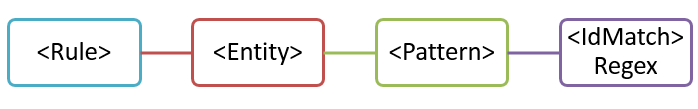
  
이 패턴은 간단하지만 9자리 숫자를 포함하는 콘텐츠를 일치시켜 직원 ID가 아닐 수 있는 많은 가양성을 식별할 수 있습니다.
  
### <a name="more-common-scenario-entity-with-multiple-patterns"></a>좀 더 일반적인 시나리오: 여러 패턴을 갖는 엔터티

이러한 이유로, 해당 엔터티(예: 9자리 숫자) 외에 뒷받침하는 증거(예: 키워드 또는 날짜)를 식별하는 패턴을 추가적으로 사용하여 엔터티를 정의하는 것이 좀 더 일반적입니다.
  
예를 들어, 직원 ID를 포함하는 콘텐츠를 식별할 확률을 높이기 위해, 채용 날짜도 식별하는 다른 패턴을 정의하고, 9자리 숫자 외에 채용 날짜와 키워드(예: “직원 ID”)를 둘 다 식별하는 또 다른 패턴을 정의할 수 있습니다.
  
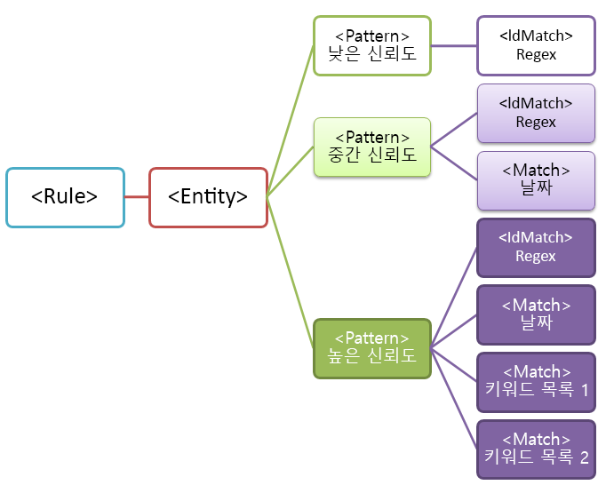
  
이 구조는 다음과 같은 몇 가지 중요한 측면을 갖습니다.
  
- 더 많은 증거를 요구하는 패턴일수록 신뢰도가 더 높습니다. 이러한 측면은 나중에 이 중요한 정보 유형을 DLP 정책에서 사용할 경우 신뢰도가 더 높은 좀 더 제한적인 작업(예: 콘텐츠 차단)과 신뢰도가 더 낮은 덜 제한적인 작업(예: 알림 보내기)을 사용할 수 있기 때문에 유용합니다.
    
- 지원 IdMatch 및 Match 요소는 실제로 Pattern이 아닌 Rule 요소의 자식인 regex 및 키워드를 참조합니다. 이러한 지원 요소는 Pattern에서 참조되지만 Rule에 포함됩니다. 즉, 정규식이나 키워드 목록과 같은 지원 요소를 한 번 정의하여 여러 엔터티 및 패턴에서 참조할 수 있습니다.
    
## <a name="what-entity-do-you-need-to-identify-entity-element-id-attribute"></a>어떤 엔터티를 식별해야 하나요? [Entity 요소, ID 특성]

엔터티는 잘 정의된 패턴을 갖는 신용 카드 번호와 같은 중요한 정보 유형입니다. 각 엔터티는 고유한 GUID를 해당 ID로 사용합니다.
  
### <a name="name-the-entity-and-generate-its-guid"></a>엔터티에 이름 지정 및 해당 GUID 생성

Rules 및 Entity 요소를 추가합니다. 그런 후 사용자 지정 엔터티의 이름(이 예제에서는 직원 ID)을 포함하는 주석을 추가합니다. 나중에 이 엔터티 이름을 지역화된 문자열 섹션에 추가합니다. 그러면 해당 이름이 DLP 정책을 만들 때 UI에 표시됩니다.
  
다음으로, 엔터티의 GUID를 생성합니다. GUID를 생성하는 방법에는 여러 가지가 있지만 PowerShell에서 [guid]::NewGuid()를 입력하여 쉽게 만들 수 있습니다. 나중에 엔터티 GUID 지역화된 문자열 섹션을 추가합니다.
  
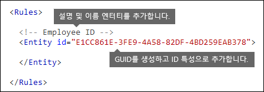
  
## <a name="what-pattern-do-you-want-to-match-pattern-element-idmatch-element-regex-element"></a>일치하려는 패턴은 어느 것인가요? [Pattern 요소, IdMatch 요소, Regex 요소]

패턴에는 중요한 정보 유형이 검색하는 항목 목록이 포함됩니다. 여기에는 regex, 키워드 및 기본 제공 함수(regex를 실행하여 날짜나 주소를 찾는 것과 같은 작업 수행)가 포함될 수 있습니다. 중요한 정보 유형은 고유한 신뢰도를 갖는 여러 패턴을 포함할 수 있습니다.
  
아래의 모든 패턴이 갖는 공통점은 모두가 공백 (\s) … (\s)으로 둘러싸인 9자리 숫자(\d{9})를 찾는 동일한 정규식을 참조한다는 것입니다. 이 정규식은 IdMatch 요소에서 참조되고 직원 ID 엔터티를 찾는 모든 패턴의 공통된 요구 사항입니다. IdMatch는 패턴이 직원 ID, 신용 카드 번호, 주민 등록 번호 등을 일치시킬 식별자입니다. Pattern 요소에는 IdMatch 요소가 1개만 있어야 합니다.
  
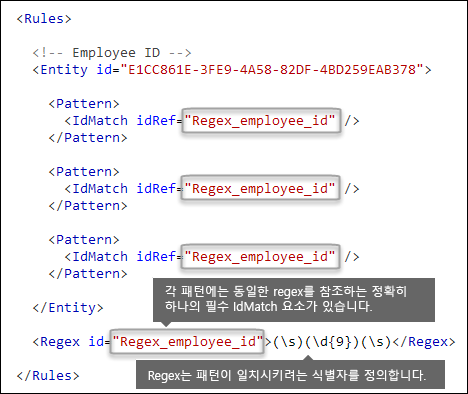
  
결과가 충족되면 패턴은 해당 개수 및 신뢰도를 반환합니다. 이 결과를 DLP 정책의 조건에서 사용할 수 있습니다. 중요한 정보 유형을 감지하는 조건을 DLP 정책에 추가하면 여기에 표시된 것처럼 개수 및 신뢰도를 편집할 수 있습니다. 신뢰도(일치 정확도라고도 함)는 이 항목의 뒷부분에서 설명합니다.
  
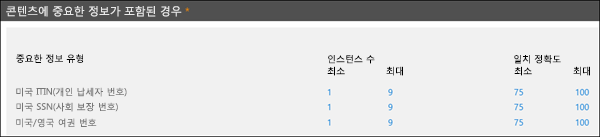
  
정규식을 만들 때 인식해야 하는 잠재적인 문제가 있을 수 있다는 사실을 고려해야 합니다. 예를 들어, 너무 많은 콘텐츠를 식별하는 regex를 작성하여 업로드하는 경우 성능에 영향을 줄 수 있습니다. 이러한 잠재적인 문제에 대한 자세한 내용은 뒷부분에 나오는 [인식해야 하는 잠재적인 유효성 검사 문제](#potential-validation-issues-to-be-aware-of)를 참조하세요.
  
## <a name="do-you-want-to-require-additional-evidence-match-element-mincount-attribute"></a>추가 증거를 요구하려고 하나요? [Match 요소, minCount 특성]

패턴은 IdMatch 외에 Match 요소를 사용하여 키워드, regex, 날짜 또는 주소와 같은 추가적인 증거를 요구할 수 있습니다.
  
하나의 패턴에 여러 Match 요소가 포함될 수 있으며, 이러한 요소는 Pattern 요소에 직접 포함되거나 Any 요소를 사용해서 조합하여 사용할 수 있습니다. Match 요소는 암시적 AND 연산자로 조인됩니다. 패턴이 일치하려면 모든 Match 요소가 충족되어야 합니다. Any 요소를 사용하여 AND 또는 OR 연산자를 도입할 수 있습니다(뒷부분에 나오는 섹션에서 자세한 내용 제공).
  
선택적인 minCount 특성을 사용하여 각 Match 요소에 대해 검색되어야 하는 일치 인스턴스 수를 지정할 수 있습니다. 예를 들어, 키워드 목록에서 두 개 이상의 키워드가 검색된 경우에만 패턴이 충족되도록 지정할 수 있습니다.
  
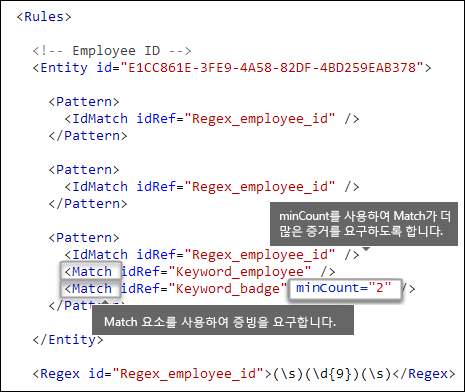
  
### <a name="keywords-keyword-group-and-term-elements-matchstyle-and-casesensitive-attributes"></a>키워드 [Keyword, Group 및 Term 요소, matchStyle 및 caseSensitive 특성]

직원 ID와 같은 중요한 정보를 식별할 경우 흔히 중요한 증거로 키워드를 사용할 수 있습니다. 예를 들어, 9자리 숫자를 일치시키는 것 외에도, "카드", "배지", "ID"와 같은 단어를 찾을 수 있습니다. 이렇게 하려면 Keyword 요소를 사용합니다. Keyword 요소에는 여러 패턴 또는 엔터티의 여러 Match 요소에서 참조할 수 있는 ID 특성이 있습니다.
  
키워드는 Group 요소에 Term 요소 목록으로 포함됩니다. Group 요소에는 다음과 같은 두 값 중 하나를 갖는 matchStyle 특성이 있습니다.
  
- **matchStyle="word"** word 일치는 공백 또는 다른 구분 기호로 둘러싸인 전체 단어를 식별합니다. 단어의 일부를 일치시키거나 아시아 언어의 단어를 일치시켜야 하는 경우가 아니면 항상 word를 사용하는 것이 좋습니다. 
    
- **matchStyle="string"** string 일치는 무엇으로 둘러싸여 있는지에 관계없이 문자열을 식별합니다. 예를 들어, "id"는 "bid" 및 "idea"를 일치시킵니다. 아시아 단어를 일치시키거나 키워드를 다른 문자열의 일부로 포함할 수 있는 경우에만 string을 사용합니다. 
    
마지막으로, 콘텐츠가 대소문자를 포함하는 키워드와 정확히 일치하도록 지정하려면 하도록 Term 요소의 caseSensitive 특성을 사용할 수 있습니다.
  
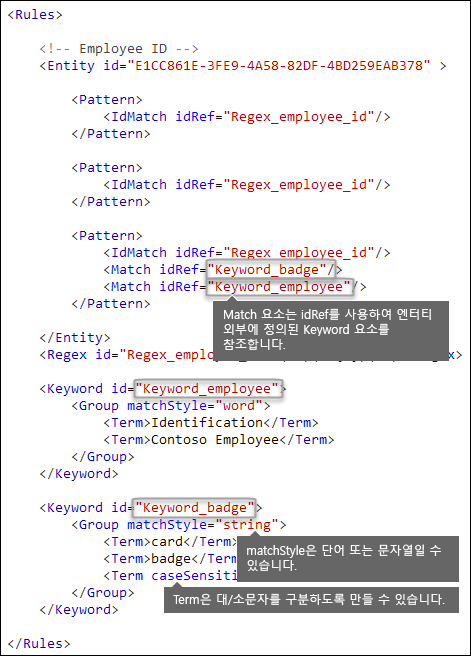
  
### <a name="regular-expressions-regex-element"></a>정규식 [Regex 요소]

이 예제에서 직원 ID 엔터티는 이미 IdMatch 요소를 사용하여 패턴, 즉 공백으로 둘러싸인 9자리 숫자에 대한 정규식을 참조합니다. 또한 패턴은 Match 요소를 사용하여 미국 우편 번호 형식의 5자리 또는 9자리 숫자와 같은 증빙을 식별하기 위해 추가 Regex 요소를 참조할 수 있습니다.
  
### <a name="additional-patterns-such-as-dates-or-addresses-built-in-functions"></a>날짜 또는 주소와 같은 추가 패턴 [기본 제공 함수]

기본 제공 중요한 정보 유형에 외에도, DLP에는 미국 날짜, 유럽 날짜, 만료 날짜 또는 미국 주소와 같은 증빙을 식별할 수 있는 기본 제공 함수도 포함되어 있습니다. DLP는 고유의 사용자 지정 함수 업로드를 지원하지 않지만, 사용자 지정 중요한 정보 유형을 만들 때 엔터티가 기본 제공 함수를 참조할 수 있습니다.
  
예를 들어, 직원 ID 배지에 채용 날짜가 있는 경우 이 사용자 지정 엔터티는 기본 제공 함수 `Func_us_date`를 날짜가 미국에서 일반적으로 사용되는 형식을 갖는 날짜를 식별할 수 있습니다. 
  
자세한 내용은 [DLP 함수가 찾는 항목](what-the-dlp-functions-look-for.md)을 참조하세요.
  
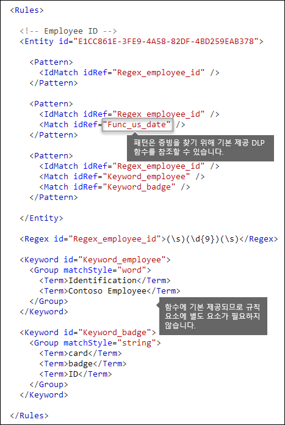
  
## <a name="different-combinations-of-evidence-any-element-minmatches-and-maxmatches-attributes"></a>다양한 증거 조합 [Any 요소, minMatches 및 maxMatches 특성]

Pattern 요소에서 모든 IdMatch 및 Match 요소는 암시적 AND 연산자로 조인됩니다. 즉, 패턴이 충족되기 위해서는 모든 일치 항목이 충족되어야 합니다. 그렇지만 Any 요소를 통해 Match 요소를 그룹화하여 좀 더 유연한 일치 논리를 만들 수 있습니다. 예를 들어, Any 요소를 사용하여 자식 Match 요소를 모두 일치시키거나 모두 일치시키지 않거나 정확한 하위 집합만 일치시킬 수 있습니다.
  
Any 요소에는 패턴이 일치되기 위해 충족되어야 하는 자식 Match 요소 수를 정의하는 데 사용할 수 있는 선택적 minMatches 및 maxMatches 특성이 있습니다. 이러한 특성은 일치를 위해 확인되는 증거 인스턴스 수가 아니라 충족되어야 하는 Match 요소의 수를 정의합니다. 특정 일치의 최소 인스턴스 수(예: 목록의 2개 키워드)를 정의하려면 Match 요소에 대해 minCount 특성을 사용합니다(위 내용 참조).
  
### <a name="match-at-least-one-child-match-element"></a>하나 이상의 자식 Match 요소 일치

최소 개수의 Match 요소만 충족되도록 요구하려는 경우 minMatches 특성을 사용할 수 있습니다. 실제로 Match 요소는 암시적 OR 연산자로 조인됩니다. 목록에서 미국 형식 날짜 또는 키워드가 발견되면 이 Any 요소가 충족됩니다.
  
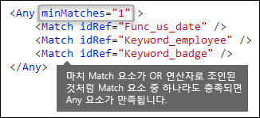
  
### <a name="match-an-exact-subset-of-any-children-match-elements"></a>자식 Match 요소의 정확한 하위 집합 일치

정확한 개수의 Match 요소가 충족되어야 하는 경우 minMatches 및 maxMatches를 같은 값으로 설정할 수 있습니다. 이 Any 요소는 정확히 하나의 날짜 또는 키워드가 검색되어야만 충족되며, 일치 항목 수가 더 있으면 패턴이 일치되지 않습니다.
  
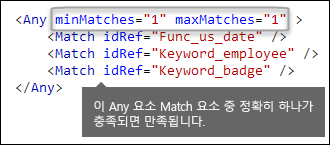
  
### <a name="match-none-of-children-match-elements"></a>어떤 자식 Match 요소와도 일치하지 않음

패턴이 충족되기 위해 특정 증거가 없어야 하는 경우 minMatches와 maxMatches를 0으로 설정할 수 있습니다. 이 방식은 키워드 목록 또는 가양성을 나타낼 수 있는 기타 증거가 있는 경우에 유용할 수 있습니다.
  
예를 들어, 직원 ID 엔터티는 키워드 "card"를 찾습니다. 이것인 "ID card"를 나타낼 수 있기 때문입니다. 카드가 "credit card" 구에만 나타나면 해당 콘텐츠의 “card”는 “ID card”를 의미하지 않을 수 있습니다. 따라서 패턴을 충족하기 위해 제외하려는 용어 목록에 "credit card"를 키워드로 추가할 수 있습니다.
  
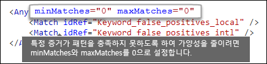
  
## <a name="how-close-to-the-entity-must-the-other-evidence-be-patternsproximity-attribute"></a>엔터티가 다른 증거와 얼마나 가까워야 하나요? [patternsProximity 특성]

중요한 정보 유형은 직원 ID를 나타나는 패턴을 찾으며, 해당 패턴의 일부로 “ID”와 같은 키워드 등을 중요 증거로 찾습니다. 이 증거에 더 가까울수록 패턴이 실제 직원 ID일 확률이 높습니다. Entity 요소의 필수 patternsProximity 특성을 사용하여 패턴의 다른 증거가 엔터티에 얼마나 가까워야 하는지 결정할 수 있습니다.
  
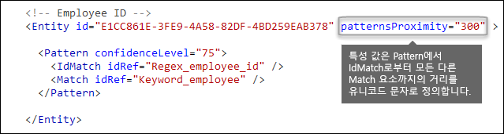
  
엔터티의 각 패턴에 대해, patternsProximity 특성 값은 해당 패턴에 대해 지정된 다른 모든 Match의 IdMatch 위치로부터 거리(유니코드 문자)를 정의합니다. 근접 범위는 IdMatch 위치에 의해 고정되며, 범위는 IdMatch의 좌우로 확장됩니다.
  
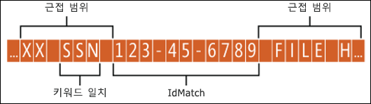
  
아래 예제에서는 근접 범위가 사용자 지정 엔터티에 대한 IdMatch 요소가 하나 이상의 키워드 또는 날짜 증빙 일치를 요구하는 패턴 일치에 어떤 영향을 미치는지를 보여 줍니다. ID2 및 ID3의 경우 근접 범위 내에서 증빙을 찾을 수 없거나 부분적인 증빙만 발견되므로 ID1만 일치합니다.
  
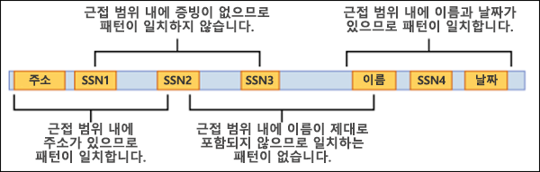
  
전자 메일의 경우 메시지 본문과 각 첨부 파일이 별도 항목으로 취급됩니다. 즉, 근접 범위는 이러한 각 항목이 범위 너머까지 확장되지 않습니다. 각 항목(첨부 파일 또는 본문) 내에 idMatch 및 증빙이 둘 다 있어야 합니다.
  
## <a name="what-are-the-right-confidence-levels-for-different-patterns-confidencelevel-attribute-recommendedconfidence-attribute"></a>여러 다른 패턴의 적정 신뢰도는 얼마나 되나요? [confidenceLevel 특성, recommendedConfidence 특성]

패턴이 더 많은 증거를 요구할수록 패턴이 일치될 때 실제 엔터티(예: 직원 ID)가 식별될 신뢰도는 더 높아집니다. 예를 들어, 매우 근접한 9자리 ID 숫자, 채용 날짜, 키워드를 요구하는 패턴의 경우 9자리 ID 숫자만 요구하는 패턴의 경우보다 신뢰도가 더 높습니다.
  
Pattern 요소에는 필수 confidencelevel 특성이 있습니다. confidenceLevel 값(1에서 100 사이의 정수)을 엔터티의 각 패턴에 대한 고유 ID로 생각할 수 있습니다. 즉, 엔터티의 패턴에는 다른 신뢰도가 할당되어야 합니다. 정수 정밀도 값은 중요하지 않습니다. 준수 팀에서 허용하는 숫자만 선택하면 됩니다. 사용자 지정 중요한 정보 유형을 업로드한 후 DLP 정책을 만든 후에 생성한 규칙의 조건에서 이러한 신뢰도를 참조할 수 있습니다.
  
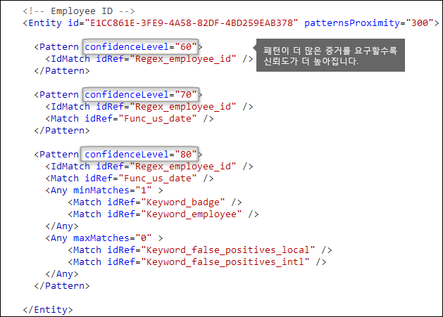
  
각 Pattern의 confidenceLevel 외에도, Entity에는 recommendedConfidence 특성이 있습니다. 권장되는 신뢰도 특성은 규칙의 기본 신뢰도로 생각할 수 있습니다. DLP 정책에서 규칙을 만들 경우 사용할 규칙의 신뢰도를 지정하지 않으면 규칙은 엔터티의 권장 신뢰도에 따라 일치됩니다.
  
## <a name="do-you-want-to-support-other-languages-in-the-ui-of-the-security-amp-compliance-center-localizedstrings-element"></a>보안 및 준수 센터의 UI에서 다른 언어를 지원하려고 하나요? [LocalizedStrings 요소]

준수 팀에서 Office 365 보안 및 준수 센터를 사용하여 다른 로캘 및 다른 언어로 DLP 정책을 만드는 경우 사용자 지정 중요한 정보 유형의 지역화된 이름 및 설명 버전을 제공할 수 있습니다. 준수 팀에서 지원되는 언어로 Office 365를 사용하는 경우 UI에 지역화된 이름이 표시됩니다.
  

  
Rules 요소는 사용자 지정 엔터티의 GUID를 참조하는 Resource 요소가 포함된 LocalizedStrings 요소를 포함해야 합니다. 마찬가지로, 각 Resource 요소는 각각이 langcode 특성을 사용하여 특정 언어에 대해 지역화된 문자열을 제공하는 하나 이상의 Name 및 Description 요소를 포함합니다.
  
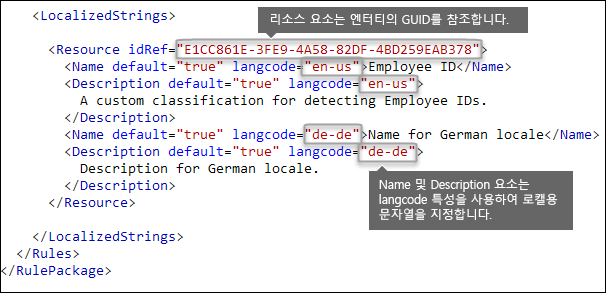
  
보안 및 준수 센터의 UI에 사용자 지정 중요한 정보 유형이 표시될 때만 지역화된 문자열을 사용합니다. 키워드 목록 또는 정규식의 다른 지역화된 버전을 제공할 때는 지역화된 문자열을 사용할 수 없습니다.
  
## <a name="other-rule-package-markup-rulepack-guid"></a>다른 규칙 패키지 태그 [RulePack GUID]

마지막으로, 각 RulePackage의 시작 부분에는 채워야 하는 일반적인 정보가 포함되어 있습니다. 다음 태그를 템플릿으로 사용하고 ". . ." 자리 표시자를 사용자 고유의 정보로 바꿀 수 있습니다.
  
가장 중요한 점은 RulePack의 GUID를 생성해야 한다는 것입니다. 그뿐 아니라 엔터티의 GUID를 생성했을 것입니다. 이 GUID는 RulePack의 두 번째 GUID입니다. GUID를 생성하는 방법에는 몇 가지가 있지만 PowerShell에서 [guid]::NewGuid()를 입력하여 쉽게 생성할 수 있습니다.
  
Version 요소도 중요합니다. 처음으로 규칙 패키지를 업로드하면, Office 365에서 버전 번호를 표시합니다. 나중에 규칙 패키지를 업데이트하고 새 버전을 업로드하는 경우 해당 버전 번호를 업데이트해야 합니다. 그렇지 않으면 Office 365에서 규칙 패키지를 배포하지 않습니다.
  
```
<?xml version="1.0" encoding="utf-16"?>
<RulePackage xmlns="http://schemas.microsoft.com/office/2011/mce">
  <RulePack id=". . .">
    <Version major="1" minor="0" build="0" revision="0" />
    <Publisher id=". . ." /> 
    <Details defaultLangCode=". . .">
      <LocalizedDetails langcode=" . . . ">
         <PublisherName>. . .</PublisherName>
         <Name>. . .</Name>
         <Description>. . .</Description>
      </LocalizedDetails>
    </Details>
  </RulePack>
  
 <Rules>
    . . .
 </Rules>
</RulePackage>

```

완료되면 RulePack 요소는 다음과 같습니다.
  
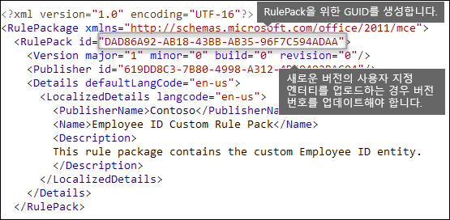
  
## <a name="changes-for-exchange-online"></a>Exchange Online의 변경

이전에는 Exchange Online PowerShell을 사용하여 DLP에 대한 사용자 지정 중요한 정보 유형을 가져왔습니다. 이제 사용자 지정 중요한 정보 유형은 Exchange 관리 센터와 보안 및 &amp;준수 센터 둘 다에서 사용할 수 있습니다. 이러한 기능 개선의 일부로, 보안 및 &amp;준수 센터 PowerShell을 사용하여 사용자 지정 중요한 정보 유형을 가져와야 하며, 더 이상 Exchange Powershell에서 가져올 수 없습니다. 사용자 지정 중요한 정보 유형은 이전과 마찬가지로 계속 작동하지만 보안 및 &amp;준수 센터의 사용자 지정 중요한 정보 유형에 대한 변경 내용이 Exchange 관리 센터에 반영되는 데 최대 1시간이 소요될 수 있습니다.
  
보안 및 &amp;준수 센터에서 `DlpSensitiveInformationTypeRulePackage` cmdlet을 사용하여 규칙 패키지를 업로드합니다. 이전에는 Exchange 관리 센터에서 `ClassificationRuleCollection` cmdlet을 사용했습니다. 
  
## <a name="upload-your-rule-package"></a>규칙 패키지 업로드

규칙 패키지를 업로드하려면 다음 단계를 수행합니다.
  
1. 유니코드 인코딩을 사용하여 .xml 파일로 저장합니다.
    
2. [Office 365 보안 및 준수 센터 PowerShell에 연결](http://go.microsoft.com/fwlink/p/?LinkID=799771)
    
3. 다음 구문을 사용합니다.

    ```
    New-DlpSensitiveInformationTypeRulePackage -FileData (Get-Content -Path "PathToUnicodeXMLFile" -Encoding Byte)
    ```

    이 예제에서는 C:\My Documents에서 MyNewRulePack.xml이라는 유니코드 XML 파일을 업로드합니다.

    ```
    New-DlpSensitiveInformationTypeRulePackage -FileData (Get-Content -Path "C:\My Documents\MyNewRulePack.xml" -Encoding Byte)
    ```

    구문과 매개 변수에 대한 자세한 내용은 [새로 만들기-DlpSensitiveInformationTypeRulePackage](https://docs.microsoft.com/powershell/module/exchange/policy-and-compliance-dlp/new-dlpsensitiveinformationtyperulepackage)를 참조하세요.

5. 새로운 중요한 정보 유형을 성공적으로 만들었는지 확인하려면 다음 단계를 수행합니다.

  - 다음 명령을 실행하고 새 규칙 패키지가 나열되지 않는지 확인합니다.

    ```
    Get-DlpSensitiveInformationTypeRulePackage
    ``` 

  - 다음 명령을 실행하고 중요한 정보 유형이 나열되지 않는지 확인합니다.

    ```
    Get-DlpSensitiveInformationType
    ``` 

    사용자 지정 중요한 정보 유형의 경우 게시자 속성 값은 Microsoft Corporation이 아닌 다른 값이 됩니다.

  - \<이름\>을 중요한 정보 유형의 이름 값(예: 직원 ID)으로 바꾸고 다음 명령을 실행합니다.

    ```
    Get-DlpSensitiveInformationType -Identity "<Name>"
    ```
    
## <a name="potential-validation-issues-to-be-aware-of"></a>인식해야 할 잠재적인 유효성 검사 문제

규칙 패키지 XML 파일을 업로드할 때 시스템은 XML의 유효성을 검사하고 알려진 잘못된 패턴 및 명확한 성능 문제를 확인합니다. 다음은 유효성 검사가 정규식에서 확인하는 몇 가지 알려진 문제입니다.
  
- 모든 항목을 일치시키는 "|" 표시는 비어 있는 일치로 간주되므로 정규식을 이 표시로 시작하거나 끝낼 수 없습니다.
    
    예를 들어, "|a" 또는 "b|"는 유효성 검사를 통과하지 못합니다.
    
- ".{0,m}" 패턴은 기능이 없고 성능을 저하시키기만 하므로 정규식을 이 패턴으로 시작하거나 끝낼 수 없습니다.
    
    예를 들어, ".{0,50}ASDF" 또는 "ASDF.{0,50}"는 유효성 검사를 통과하지 못합니다.
    
- ".{0,m}" 또는 ".{1,m}"을 그룹으로 사용할 수 없고, ".\*" 또는 ".+"를 그룹으로 사용할 수 없습니다.
    
    예를 들어, "(.{0,50000})"은 유효성 검사를 통과하지 못합니다.
    
- "{0,m}" 또는 "{1,m}" 리피터가 그룹으로 포함된 문자는 정규식에 사용할 수 없습니다.
    
    예를 들어, "(a\*)"는 유효성 검사를 통과하지 못합니다.
    
- 정규식을 ".{1,m}"으로 시작하거나 끝낼 수 없으며 "."만 사용해야 합니다.
    
    예를 들어, ".{1,m}asdf"는 유효성 검사를 통과하지 못하므로 ".asdf"만 사용해야 합니다.
    
- 바인딩되지 않은 리피터(예: "\*" 또는 "+")는 그룹으로 사용할 수 없습니다.
    
    예를 들어, "(xx)\*" 및 "(xx)+"는 유효성 검사를 통과하지 못합니다.
    
사용자 지정 중요한 정보 유형에 성능에 영향을 줄 수 있는 문제가 포함된 경우 업로드되지 않으며 다음 오류 메시지 중 하나가 표시될 수 있습니다.
  
- **예상보다 더 많은 콘텐츠와 일치하는 일반 수량자(예: '+', '\*')**
    
- **어설션 둘러보기**
    
- **일반 수량자와의 복잡한 그룹화**
    
## <a name="recrawl-your-content-to-identify-the-sensitive-information"></a>콘텐츠를 다시 크롤링하여 중요한 정보 식별

DLP는 검색 크롤러를 사용하여 사이트 콘텐츠에서 중요한 정보를 식별하고 분류합니다. SharePoint Online 및 비즈니스용 OneDrive 사이트의 콘텐츠는 업데이트될 때마다 자동으로 다시 크롤링됩니다. 하지만 기존의 모든 콘텐츠에 있는 새로운 사용자 지정 중요한 정보 유형을 식별하려면 해당 콘텐츠를 다시 크롤링해야 합니다.
  
Office 365에서 전체 테넌트의 다시 크롤링을 수동으로 요청할 수 없으나 사이트 모음, 목록 또는 라이브러리에 대해서는 다시 크롤링을 요청할 수 있습니다. [사이트, 라이브러리 또는 목록의 크롤링 및 다시 인덱싱을 수동으로 요청](https://support.office.com/article/9afa977d-39de-4321-b4ca-8c7c7e6d264e)을 참조하세요.
  
## <a name="remove-a-custom-sensitive-information-type"></a>사용자 지정 중요한 정보 유형 제거

**참고**: 사용자 지정 중요한 정보 유형을 제거하기 전에 DLP 정책이나 Exchange 메일 흐름 규칙(전송 규칙이라고도 함)이 중요한 정보 유형을 계속 참조하지 않는 것을 확인합니다.

보안 및 준수 센터 PowerShell에서 사용자 지정 중요한 정보 유형을 제거하는 두 가지 방법이 있습니다.

- **개별 사용자 지정 중요한 정보 유형 제거**: [사용자 지정 중요한 정보 유형 수정](#modify-a-custom-sensitive-information-type)에서 설명하는 방법을 사용합니다. 사용자 지정 중요한 정보 유형을 포함하는 사용자 지정 규칙 패키지를 내보내고 XML 파일에서 중요한 정보 유형을 제거하고 기존 사용자 지정 규칙 패키지에 업데이트된 XML 파일을 다시 가져옵니다.

- **사용자 지정 규칙 패키지 및 여기에 포함된 모든 사용자 지정 중요한 정보 유형 제거**: 이 방법은 이 섹션에 설명되어 있습니다.

1. [Office 365 보안 및 준수 센터 PowerShell에 연결](http://go.microsoft.com/fwlink/p/?LinkID=799771)

2. 사용자 지정 규칙 패키지를 제거하려면 다음 구문을 사용합니다.

    ```
    Remove-DlpSensitiveInformationTypeRulePackage -Identity "RulePackageIdentity"
    ```

    Name 값(모든 언어) 또는 `RulePack id` (GUID) 값을 사용하여 규칙 패키지를 식별할 수 있습니다.

    이 예제에서는 "Employee ID Custom Rule Pack"이라는 규칙 패키지를 제거합니다.

    ```
       Remove-DlpSensitiveInformationTypeRulePackage -Identity "Employee ID Custom Rule Pack"
    ```

    구문과 매개 변수에 대한 자세한 내용은 [제거-DlpSensitiveInformationTypeRulePackage](https://docs.microsoft.com/powershell/module/exchange/policy-and-compliance-dlp/remove-dlpsensitiveinformationtyperulepackage)를 참조하세요.

3. 사용자 지정 중요한 정보 유형을 성공적으로 제거했는지 확인하려면 다음 단계를 수행합니다.

  - 다음 명령을 실행하고 규칙 패키지가 더 이상 나열되지 않는지 확인합니다.

    ```
    Get-DlpSensitiveInformationTypeRulePackage
    ``` 

  - 다음 명령을 실행하고 제거된 규칙 패키지의 중요한 정보 유형이 더 이상 나열되지 않는지 확인합니다.

    ```
    Get-DlpSensitiveInformationType
    ``` 

    사용자 지정 중요한 정보 유형의 경우 게시자 속성 값은 Microsoft Corporation이 아닌 다른 값이 됩니다.

  - \<이름\>을 중요한 정보 유형의 이름 값(예: 직원 ID)으로 바꾸고 다음 명령을 실행하여 중요한 정보 유형이 더 이상 표시되지 않는지 확인합니다.

    ```
    Get-DlpSensitiveInformationType -Identity "<Name>"
    ```

## <a name="modify-a-custom-sensitive-information-type"></a>사용자 지정 중요한 정보 유형 수정

보안 및 준수 센터 PowerShell에서 사용자 지정 중요한 정보 유형을 수정하려면 다음을 수행해야 합니다.

1. XML 파일에 사용자 지정 중요한 정보 유형을 포함하는 기존 규칙 패키지를 내보냅니다. (또는 기존 XML 파일이 있는 경우이를 내보냅니다) 

2. 내보낸 XML 파일의 사용자 지정 중요한 정보 유형을 수정합니다.

3. 기존 규칙 패키지에 업데이트된 XML 파일을 다시 가져옵니다.

보안 및 준수 센터 PowerShell에 연결하려면 [Office 365 보안 및 준수 센터 PowerShell에 연결](http://go.microsoft.com/fwlink/p/?LinkID=799771)을 참조하세요.

#### <a name="step-1-export-the-existing-rule-package-to-an-xml-file"></a>1단계: XML 파일로 기존 규칙 패키지 내보내기

**참고**: XML 파일의 복사본이 있는 경우(예: XML 파일을 만들고 가져온 경우) 다음 단계로 건너 뛰고 XML 파일을 수정할 수 있습니다.

1. 사용자 지정 규칙 패키지를 아직 모르는 경우 다음 명령을 실행하여 사용자 지정 규칙 패키지의 이름을 찾습니다.

    ```
    Get-DlpSensitiveInformationTypeRulePackage
    ```

    **참고** : 기본 제공 민감한 정보 유형이 들어있는 기본 제공 규칙 패키지의 이름은 Microsoft Rule Package입니다. 보안 및 준수 센터 UI에서 만든 사용자 지정 중요한 정보 유형이 포함된 규칙 패키지의 이름은 Microsoft.SCCManaged.CustomRulePack입니다.

2. 다음 구문을 사용하여 사용자 지정 규칙 패키지를 변수에 저장합니다.

    ```
    $rulepak = Get-DlpSensitiveInformationTypeRulePackage -Identity "RulePackageName"
    ```

   예를 들어, 규칙 패키지의 이름이 "Employee ID Custom Rule Pack"인 경우 다음 명령을 실행합니다.

    ```
    $rulepak = Get-DlpSensitiveInformationTypeRulePackage -Identity "Employee ID Custom Rule Pack"
    ```

3. 다음 구문을 사용하여 사용자 지정 규칙 패키지를 변수로 내보냅니다.

    ```
    Set-Content -Path "XMLFileAndPath" -Encoding Byte -Value $rulepak.SerializedClassificationRuleCollection
    ```

    이 예제에서는 규칙 패키지를 C:\My Documents 폴더의 ExportedRulePackage.xml 파일로 내보냅니다.

    ```
    Set-Content -Path "C:\My Documents\ExportedRulePackage.xml" -Encoding Byte -Value $rulepak.SerializedClassificationRuleCollection
    ```

#### <a name="step-2-modify-the-sensitive-information-type-in-the-exported-xml-file"></a>2단계: 내보낸 XML 파일의 중요한 정보 유형 수정

XML 파일의 중요한 정보 유형 및 파일의 기타 요소는 이 항목의 앞부분에 설명되어 있습니다.

#### <a name="step-3-import-the-updated-xml-file-back-into-the-existing-rule-package"></a>3단계: 기존 규칙 패키지에 업데이트된 XML 파일 다시 가져오기

기존 규칙 패키지에 업데이트된 XML 파일을 다시 가져오려면 다음 구문을 사용합니다.

```
Set-DlpSensitiveInformationTypeRulePackage -Identity "RulePackageIdentity" -FileData (Get-Content -Path "PathToUnicodeXMLFile" -Encoding Byte)
```

Name 값 또는 `RulePack id` (GUID) 값을 사용하여 규칙 패키지를 식별할 수 있습니다.

이 예제에서는 MyUpdatedRulePack.xml이라는 업데이트된 유니 코드 XML 파일을 C:\My Documents에서 "Employee ID Custom Rule Pack"이라는 기존 규칙 패키지로 업로드합니다.

```
Set-DlpSensitiveInformationTypeRulePackage -Identity "Employee ID Custom Rule Pack" -FileData (Get-Content -Path "C:\My Documents\MyUpdatedRulePack.xml" -Encoding Byte)
```

구문과 매개 변수에 대한 자세한 내용은 [설정-DlpSensitiveInformationTypeRulePackage](https://docs.microsoft.com/powershell/module/exchange/policy-and-compliance-dlp/set-dlpsensitiveinformationtyperulepackage)를 참조하세요.

## <a name="reference-rule-package-xml-schema-definition"></a>참조: 규칙 패키지 XML 스키마 정의

이 태그를 복사하고, XSD 파일로 저장한 후 규칙 패키지 XML 파일의 유효성을 검사하는 데 사용할 수 있습니다.
  
```
<?xml version="1.0" encoding="utf-8"?>
<xs:schema xmlns:mce="http://schemas.microsoft.com/office/2011/mce"
           targetNamespace="http://schemas.microsoft.com/office/2011/mce" 
           xmlns:xs="http://www.w3.org/2001/XMLSchema"
           elementFormDefault="qualified"
           attributeFormDefault="unqualified"
           id="RulePackageSchema">
  <!-- Use include if this schema has the same target namespace as the schema being referenced, otherwise use import -->
  <xs:element name="RulePackage" type="mce:RulePackageType"/>
  <xs:simpleType name="LangType">
    <xs:union memberTypes="xs:language">
      <xs:simpleType>
        <xs:restriction base="xs:string">
          <xs:enumeration value=""/>
        </xs:restriction>
      </xs:simpleType>
    </xs:union>
  </xs:simpleType>
  <xs:simpleType name="GuidType" final="#all">
    <xs:restriction base="xs:token">
      <xs:pattern value="[0-9a-fA-F]{8}\-([0-9a-fA-F]{4}\-){3}[0-9a-fA-F]{12}"/>
    </xs:restriction>
  </xs:simpleType>
  <xs:complexType name="RulePackageType">
    <xs:sequence>
      <xs:element name="RulePack" type="mce:RulePackType"/>
      <xs:element name="Rules" type="mce:RulesType">
        <xs:key name="UniqueRuleId">
          <xs:selector xpath="mce:Entity|mce:Affinity|mce:Version/mce:Entity|mce:Version/mce:Affinity"/>
          <xs:field xpath="@id"/>
        </xs:key>
        <xs:key name="UniqueProcessorId">
          <xs:selector xpath="mce:Regex|mce:Keyword|mce:Fingerprint"></xs:selector>
          <xs:field xpath="@id"/>
        </xs:key>
        <xs:key name="UniqueResourceIdRef">
          <xs:selector xpath="mce:LocalizedStrings/mce:Resource"/>
          <xs:field xpath="@idRef"/>
        </xs:key>        
        <xs:keyref name="ReferencedRuleMustExist" refer="mce:UniqueRuleId">
          <xs:selector xpath="mce:LocalizedStrings/mce:Resource"/>
          <xs:field xpath="@idRef"/>
        </xs:keyref>
        <xs:keyref name="RuleMustHaveResource" refer="mce:UniqueResourceIdRef">
          <xs:selector xpath="mce:Entity|mce:Affinity|mce:Version/mce:Entity|mce:Version/mce:Affinity"/>
          <xs:field xpath="@id"/>
        </xs:keyref>
      </xs:element>
    </xs:sequence>
  </xs:complexType>
  <xs:complexType name="RulePackType">
    <xs:sequence>
      <xs:element name="Version" type="mce:VersionType"/>
      <xs:element name="Publisher" type="mce:PublisherType"/>
      <xs:element name="Details" type="mce:DetailsType">
        <xs:key name="UniqueLangCodeInLocalizedDetails">
          <xs:selector xpath="mce:LocalizedDetails"/>
          <xs:field xpath="@langcode"/>
        </xs:key>
        <xs:keyref name="DefaultLangCodeMustExist" refer="mce:UniqueLangCodeInLocalizedDetails">
          <xs:selector xpath="."/>
          <xs:field xpath="@defaultLangCode"/>
        </xs:keyref>
      </xs:element>
      <xs:element name="Encryption" type="mce:EncryptionType" minOccurs="0" maxOccurs="1"/>
    </xs:sequence>
    <xs:attribute name="id" type="mce:GuidType" use="required"/>
  </xs:complexType>
  <xs:complexType name="VersionType">
    <xs:attribute name="major" type="xs:unsignedShort" use="required"/>
    <xs:attribute name="minor" type="xs:unsignedShort" use="required"/>
    <xs:attribute name="build" type="xs:unsignedShort" use="required"/>
    <xs:attribute name="revision" type="xs:unsignedShort" use="required"/>
  </xs:complexType>
  <xs:complexType name="PublisherType">
    <xs:attribute name="id" type="mce:GuidType" use="required"/>
  </xs:complexType>
  <xs:complexType name="LocalizedDetailsType">
    <xs:sequence>
      <xs:element name="PublisherName" type="mce:NameType"/>
      <xs:element name="Name" type="mce:RulePackNameType"/>
      <xs:element name="Description" type="mce:OptionalNameType"/>
    </xs:sequence>
    <xs:attribute name="langcode" type="mce:LangType" use="required"/>
  </xs:complexType>
  <xs:complexType name="DetailsType">
    <xs:sequence>
      <xs:element name="LocalizedDetails" type="mce:LocalizedDetailsType" maxOccurs="unbounded"/>
    </xs:sequence>
    <xs:attribute name="defaultLangCode" type="mce:LangType" use="required"/>
  </xs:complexType>
  <xs:complexType name="EncryptionType">
    <xs:sequence>
      <xs:element name="Key" type="xs:normalizedString"/>
      <xs:element name="IV" type="xs:normalizedString"/>
    </xs:sequence>
  </xs:complexType>
  <xs:simpleType name="RulePackNameType">
    <xs:restriction base="xs:token">
      <xs:minLength value="1"/>
      <xs:maxLength value="64"/>
    </xs:restriction>
  </xs:simpleType>
  <xs:simpleType name="NameType">
    <xs:restriction base="xs:normalizedString">
      <xs:minLength value="1"/>
      <xs:maxLength value="256"/>
    </xs:restriction>
  </xs:simpleType>
  <xs:simpleType name="OptionalNameType">
    <xs:restriction base="xs:normalizedString">
      <xs:minLength value="0"/>
      <xs:maxLength value="256"/>
    </xs:restriction>
  </xs:simpleType>
  <xs:simpleType name="RestrictedTermType">
    <xs:restriction base="xs:string">
      <xs:minLength value="1"/>
      <xs:maxLength value="100"/>
    </xs:restriction>
  </xs:simpleType>
  <xs:complexType name="RulesType">
    <xs:sequence>
      <xs:choice maxOccurs="unbounded">
        <xs:element name="Entity" type="mce:EntityType"/>
        <xs:element name="Affinity" type="mce:AffinityType"/>
        <xs:element name="Version" type="mce:VersionedRuleType"/>
      </xs:choice>
      <xs:choice minOccurs="0" maxOccurs="unbounded">
        <xs:element name="Regex" type="mce:RegexType"/>
        <xs:element name="Keyword" type="mce:KeywordType"/>
        <xs:element name="Fingerprint" type="mce:FingerprintType"/>
        <xs:element name="ExtendedKeyword" type="mce:ExtendedKeywordType"/>
      </xs:choice>
      <xs:element name="LocalizedStrings" type="mce:LocalizedStringsType"/>
    </xs:sequence>
  </xs:complexType>
  <xs:complexType name="EntityType">
    <xs:sequence>
      <xs:element name="Pattern" type="mce:PatternType" maxOccurs="unbounded"/>
      <xs:element name="Version" type="mce:VersionedPatternType" minOccurs="0" maxOccurs="unbounded" />
    </xs:sequence>
    <xs:attribute name="id" type="mce:GuidType" use="required"/>
    <xs:attribute name="patternsProximity" type="mce:ProximityType" use="required"/>
    <xs:attribute name="recommendedConfidence" type="mce:ProbabilityType"/>
    <xs:attribute name="workload" type="mce:WorkloadType"/>
  </xs:complexType>
  <xs:complexType name="PatternType">
    <xs:sequence>
      <xs:element name="IdMatch" type="mce:IdMatchType"/>
      <xs:choice minOccurs="0" maxOccurs="unbounded">
        <xs:element name="Match" type="mce:MatchType"/>
        <xs:element name="Any" type="mce:AnyType"/>
      </xs:choice>
    </xs:sequence>
    <xs:attribute name="confidenceLevel" type="mce:ProbabilityType" use="required"/>
  </xs:complexType>
  <xs:complexType name="AffinityType">
    <xs:sequence>
      <xs:element name="Evidence" type="mce:EvidenceType" maxOccurs="unbounded"/>
      <xs:element name="Version" type="mce:VersionedEvidenceType" minOccurs="0" maxOccurs="unbounded" />
    </xs:sequence>
    <xs:attribute name="id" type="mce:GuidType" use="required"/>
    <xs:attribute name="evidencesProximity" type="mce:ProximityType" use="required"/>
    <xs:attribute name="thresholdConfidenceLevel" type="mce:ProbabilityType" use="required"/>
    <xs:attribute name="workload" type="mce:WorkloadType"/>
  </xs:complexType>
  <xs:complexType name="EvidenceType">
    <xs:sequence>
      <xs:choice maxOccurs="unbounded">
        <xs:element name="Match" type="mce:MatchType"/>
        <xs:element name="Any" type="mce:AnyType"/>
      </xs:choice>
    </xs:sequence>
    <xs:attribute name="confidenceLevel" type="mce:ProbabilityType" use="required"/>
  </xs:complexType>
  <xs:complexType name="IdMatchType">
    <xs:attribute name="idRef" type="xs:string" use="required"/>
  </xs:complexType>
  <xs:complexType name="MatchType">
    <xs:attribute name="idRef" type="xs:string" use="required"/>
    <xs:attribute name="minCount" type="xs:positiveInteger" use="optional"/>
    <xs:attribute name="uniqueResults" type="xs:boolean" use="optional"/>
  </xs:complexType>
  <xs:complexType name="AnyType">
    <xs:sequence>
      <xs:choice maxOccurs="unbounded">
        <xs:element name="Match" type="mce:MatchType"/>
        <xs:element name="Any" type="mce:AnyType"/>
      </xs:choice>
    </xs:sequence>
    <xs:attribute name="minMatches" type="xs:nonNegativeInteger" default="1"/>
    <xs:attribute name="maxMatches" type="xs:nonNegativeInteger" use="optional"/>
  </xs:complexType>
  <xs:simpleType name="ProximityType">
    <xs:union>
      <xs:simpleType>
        <xs:restriction base='xs:string'>
          <xs:enumeration value="unlimited"/>
        </xs:restriction>
      </xs:simpleType>
      <xs:simpleType>
        <xs:restriction base="xs:positiveInteger">
          <xs:minInclusive value="1"/>
        </xs:restriction>
      </xs:simpleType>
    </xs:union>
  </xs:simpleType>
  <xs:simpleType name="ProbabilityType">
    <xs:restriction base="xs:integer">
      <xs:minInclusive value="1"/>
      <xs:maxInclusive value="100"/>
    </xs:restriction>
  </xs:simpleType>
  <xs:simpleType name="WorkloadType">
    <xs:restriction base="xs:string">
      <xs:enumeration value="Exchange"/>
      <xs:enumeration value="Outlook"/>
    </xs:restriction>
  </xs:simpleType>
  <xs:simpleType name="EngineVersionType">
    <xs:restriction base="xs:token">
      <xs:pattern value="^\d{2}\.01?\.\d{3,4}\.\d{1,3}$"/>
    </xs:restriction>
  </xs:simpleType>
  <xs:complexType name="VersionedRuleType">
    <xs:choice maxOccurs="unbounded">
      <xs:element name="Entity" type="mce:EntityType"/>
      <xs:element name="Affinity" type="mce:AffinityType"/>
    </xs:choice>
    <xs:attribute name="minEngineVersion" type="mce:EngineVersionType" use="required" />
  </xs:complexType>
  <xs:complexType name="VersionedPatternType">
    <xs:sequence>
      <xs:element name="Pattern" type="mce:PatternType" maxOccurs="unbounded"/>
    </xs:sequence>
    <xs:attribute name="minEngineVersion" type="mce:EngineVersionType" use="required" />
  </xs:complexType>
  <xs:complexType name="VersionedEvidenceType">
    <xs:sequence>
      <xs:element name="Evidence" type="mce:EvidenceType" maxOccurs="unbounded"/>
    </xs:sequence>
    <xs:attribute name="minEngineVersion" type="mce:EngineVersionType" use="required" />
  </xs:complexType>
  <xs:simpleType name="FingerprintValueType">
    <xs:restriction base="xs:string">
      <xs:minLength value="2732"/>
      <xs:maxLength value="2732"/>
    </xs:restriction>
  </xs:simpleType>
  <xs:complexType name="FingerprintType">
    <xs:simpleContent>
      <xs:extension base="mce:FingerprintValueType">
        <xs:attribute name="id" type="xs:token" use="required"/>
        <xs:attribute name="threshold" type="mce:ProbabilityType" use="required"/>
        <xs:attribute name="shingleCount" type="xs:positiveInteger" use="required"/>
        <xs:attribute name="description" type="xs:string" use="optional"/>
      </xs:extension>
    </xs:simpleContent>
  </xs:complexType>
  <xs:complexType name="RegexType">
    <xs:simpleContent>
      <xs:extension base="xs:string">
        <xs:attribute name="id" type="xs:token" use="required"/>
      </xs:extension>
    </xs:simpleContent>
  </xs:complexType>
  <xs:complexType name="KeywordType">
    <xs:sequence>
      <xs:element name="Group" type="mce:GroupType" maxOccurs="unbounded"/>
    </xs:sequence>
    <xs:attribute name="id" type="xs:token" use="required"/>
  </xs:complexType>
  <xs:complexType name="GroupType">
    <xs:sequence>
      <xs:choice>
        <xs:element name="Term" type="mce:TermType" maxOccurs="unbounded"/>
      </xs:choice>
    </xs:sequence>
    <xs:attribute name="matchStyle" default="word">
      <xs:simpleType>
        <xs:restriction base="xs:NMTOKEN">
          <xs:enumeration value="word"/>
          <xs:enumeration value="string"/>
        </xs:restriction>
      </xs:simpleType>
    </xs:attribute>
  </xs:complexType>
  <xs:complexType name="TermType">
    <xs:simpleContent>
      <xs:extension base="mce:RestrictedTermType">
        <xs:attribute name="caseSensitive" type="xs:boolean" default="false"/>
      </xs:extension>
    </xs:simpleContent>
  </xs:complexType>
  <xs:complexType name="ExtendedKeywordType">
    <xs:simpleContent>
      <xs:extension base="xs:string">
        <xs:attribute name="id" type="xs:token" use="required"/>
      </xs:extension>
    </xs:simpleContent>
  </xs:complexType>
  <xs:complexType name="LocalizedStringsType">
    <xs:sequence>
      <xs:element name="Resource" type="mce:ResourceType" maxOccurs="unbounded">
      <xs:key name="UniqueLangCodeUsedInNamePerResource">
        <xs:selector xpath="mce:Name"/>
        <xs:field xpath="@langcode"/>
      </xs:key>
      <xs:key name="UniqueLangCodeUsedInDescriptionPerResource">
        <xs:selector xpath="mce:Description"/>
        <xs:field xpath="@langcode"/>
      </xs:key>
    </xs:element>
    </xs:sequence>
  </xs:complexType>
  <xs:complexType name="ResourceType">
    <xs:sequence>
      <xs:element name="Name" type="mce:ResourceNameType" maxOccurs="unbounded"/>
      <xs:element name="Description" type="mce:DescriptionType" minOccurs="0" maxOccurs="unbounded"/>
    </xs:sequence>
    <xs:attribute name="idRef" type="mce:GuidType" use="required"/>
  </xs:complexType>
  <xs:complexType name="ResourceNameType">
    <xs:simpleContent>
      <xs:extension base="xs:string">
        <xs:attribute name="default" type="xs:boolean" default="false"/>
        <xs:attribute name="langcode" type="mce:LangType" use="required"/>
      </xs:extension>
    </xs:simpleContent>
  </xs:complexType>
  <xs:complexType name="DescriptionType">
    <xs:simpleContent>
      <xs:extension base="xs:string">
        <xs:attribute name="default" type="xs:boolean" default="false"/>
        <xs:attribute name="langcode" type="mce:LangType" use="required"/>
      </xs:extension>
    </xs:simpleContent>
  </xs:complexType>
</xs:schema>

```

## <a name="more-information"></a>추가 정보

- [데이터 손실 방지 정책 개요](data-loss-prevention-policies.md)
    
- [중요한 정보 유형이 찾는 항목](what-the-sensitive-information-types-look-for.md)
    
- [DLP 함수가 찾는 항목](what-the-dlp-functions-look-for.md)
    

