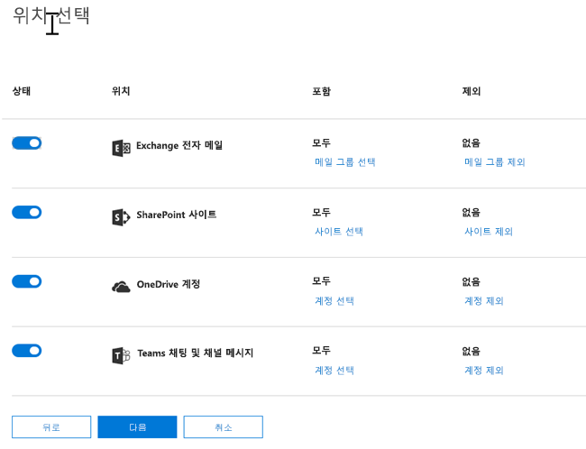
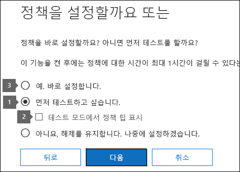

# 템플릿에서 DLP 정책 만들기

DLP 정책을 사용하여 가장 쉽고 가장 일반적인 방법은 Office 365에 포함된 템플릿 중 하나를 사용하는 것입니다. 이러한 서식 파일 중 하나를 그대로 사용 하거나 조직의 특정 규정 준수 요구 사항을 충족 하도록 규칙을 사용자 지정할 수 있습니다.
  
Office 365에는 광범위한 일반적인 규정 및 비즈니스 정책 요구를 충족하기 위해 바로 사용할 수 있는 40가지 이상의 템플릿이 포함되어 있습니다. 예를 들어 다음에 대한 DLP 정책 템플릿이 있습니다.
  
- GLBA(Gramm-Leach-Bliley Act)
    
- PCI-DSS(Payment Card Industry Data Security Standard)
    
- U.S. PII(United States Personally Identifiable Information)
    
- 미국 HIPAA(Health Insurance Act)
    
기존 규칙을 수정하거나 새로 추가하여 템플릿을 미세 조정할 수 있습니다. 예를 들어 새로운 유형의 중요한 정보를 규칙에 추가하거나, 한 규칙의 템플릿 수를 수정하여 트리거하기 더 어렵게 또는 더 쉽게 만들거나, 업무 정당성을 제공하여 규칙의 작업을 재정의할 수 있도록 하거나, 알림 및 사고 보고서를 받을 수 있는 사람을 변경할 수 있습니다. DLP 정책 템플릿은 여러 일반적인 규정 준수 시나리오에 대한 유연한 시작점입니다.
  
기본 규칙이 없는 사용자 지정 템플릿을 선택하고, 조직의 특정 규정 준수 요구에 맞게 DLP 정책을 처음부터 새로 구성할 수도 있습니다.
  
## 예: 모든 비즈니스용 OneDrive 사이트에서 중요 한 정보를 식별 하 고 조직 외부의 사용자에 대 한 액세스 제한

비즈니스용 OneDrive 계정을 통해 조직의 사용자가 쉽게 문서를 공동 작업 하 고 공유할 수 있습니다. 그러나 규정 준수 관리자는 비즈니스용 OneDrive 계정에 저장 된 중요 한 정보가 실수로 조직 외부의 사용자와 공유 될 수 있다는 것을 고려해 야 합니다. DLP 정책은 이러한 위험을 줄이는 데 도움이 될 수 있습니다.
  
이 예에서는 개별 Taxpayer 식별 번호 (ITIN), 주민 등록 번호 및 미국 여권 번호를 포함 하는 미국 PII 데이터를 식별 하는 DLP 정책을 만듭니다. 서식 파일을 사용 하 여 시작 하 고 조직의 규정 준수 요구 사항에 맞게 서식 파일을 수정 하는 것이 좋습니다.
  
- DLP 정책이 중요 한 데이터를 더 많이 보호 하도록 중요 한 정보 유형 (예를 들어, 은행 계좌 번호 및 미국 운전 면허 번호)을 추가 합니다.
    
- 중요 한 정보가 한 번만 발생 하 여 외부 사용자에 대 한 액세스를 제한할 수 있도록 정책을 보다 중요 하 게 만듭니다.
    
- 업무 정당성을 제공하거나 가양성을 보고하여 작업을 재정의할 수 있도록 합니다. 이러한 방식으로 중요 한 정보를 공유 하는 유효한 비즈니스 이유가 있는 경우 DLP 정책은 조직의 사용자가 작업을 수행 하는 것을 막지 못합니다.
    
### 템플릿에서 DLP 정책 만들기

1. [https://protection.office.com](https://protection.office.com)으로 이동합니다.
    
2. 회사 또는 학교 계정을 사용하여 Office 365에 로그인합니다. 현재는 Office 365 보안 &amp; 및 준수 센터에 있습니다.
    
3. 보안 &amp; 준수 센터 \> 왼쪽 탐색 \> **데이터 손실 방지** \> **정책** \> **+ 정책 만들기**
    
    
  
4. \> **다음**에 필요한 중요 한 정보 유형을 보호 하는 DLP 정책 템플릿을 선택 합니다.
    
    이 예에서는 보호 하려는 중요 한 정보의 유형이 대부분 포함 되어 있기 때문에 **개인 정보** \> 보호 및 **PII (개인 식별 정보) 데이터** 를 선택 합니다. 
    
    서식 파일을 선택 하는 경우 오른쪽에 설명 된 설명을 읽고 서식 파일에서 보호 하는 중요 한 정보 유형을 알 수 있습니다.
    
    
  
5. 정책 \> 이름을 **다음**으로 합니다.
    
6. DLP 정책으로 보호 하려는 위치를 선택 하려면 다음 중 하나를 수행 합니다.
    
  - \> **** **Office 365의 모든 위치를** 선택 합니다.
    
  - \> **다음**에 **특정 위치 선택을** 선택 합니다. 이 예에서는이를 선택 합니다.
    
    모든 Exchange 전자 메일 또는 모든 OneDrive 계정 등의 전체 위치를 포함 하거나 제외 하려면 해당 위치의 **상태** 를 전환 하거나 설정/해제 합니다. 
    
    특정 SharePoint 사이트 또는 비즈니스용 OneDrive 계정만 포함 하려면 **상태** 를 설정으로 전환한 다음 **포함** 아래의 링크를 클릭 하 여 특정 사이트 또는 계정을 선택 합니다. 사이트에 정책을 적용하면 해당 정책에 구성된 규칙이 해당 사이트의 모든 하위 사이트에 자동으로 적용됩니다. 
    
    
  
    이 예에서는 모든 비즈니스용 OneDrive 계정에 저장 된 중요 한 정보를 보호 하려면 **Exchange 전자 메일** 및 **SharePoint 사이트**에 대 한 **상태** 를 모두 해제 하 고 **OneDrive 계정**에 대 한 **상태** 를 유지 합니다.
    
7. **고급 설정** \> 사용 **다음**을 선택 합니다.
    
8. DLP 정책 템플릿에는 특정 유형의 중요한 정보를 검색하는 조건과 그에 따른 작업이 미리 정의된 규칙이 포함되어 있습니다. 기존 규칙을 편집, 삭제 또는 해제 하거나 새로 추가할 수 있습니다. 완료 되 면 **다음**을 클릭 합니다.
    
    
  
    이 예에서 미국 PII 데이터 서식 파일에는 다음과 같은 두 가지 미리 정의 된 규칙이 포함 되어 있습니다.
    
  - **낮은 콘텐츠의 양이 검색 됨 미국 PII** 이 규칙은 조직 외부의 사용자와 파일을 공유 하는 세 가지 유형의 중요 한 정보 (ITIN, SSN, 미국 여권 번호)가 각각 1 ~ 10 개까지 포함 된 파일을 찾습니다. 발견 된 경우 규칙은 기본 사이트 모음 관리자, 문서 소유자 및 문서를 마지막으로 수정한 사람에 게 전자 메일 알림을 보냅니다. 
    
  - **높은 양의 콘텐츠가 검색 됨 미국 PII** 이 규칙은 조직 외부의 사용자와 파일을 공유 하는 동일한 세 가지 중요 한 정보 유형이 각각 한 번 이상 발생 하는 파일을 찾습니다. 이 작업을 수행 하면 전자 메일 알림도 함께 전송 되 고 파일에 대 한 액세스가 제한 됩니다. 비즈니스용 OneDrive 계정의 콘텐츠에 대 한 기본 사이트 모음 관리자, 문서 소유자 및 문서를 마지막으로 수정한 사람을 제외한 모든 사용자에 대해 문서에 대 한 사용 권한이 제한 됩니다. 
    
    조직의 특정 요구 사항을 충족 하기 위해 중요 한 정보가 한 번 발생 하는 경우 외부 사용자에 대 한 액세스를 차단할 수 있도록 규칙을 보다 쉽게 트리거할 수 있습니다. 이러한 규칙을 확인 한 후에는 낮은 및 높은 수 규칙이 필요 하지 않음을 이해 하 고 중요 한 정보가 발견 되 면 액세스를 차단 하는 규칙을 하나만 사용 하면 됩니다.
    
    따라서 **낮은 양의 콘텐츠에서 검색 된 규칙 (미국 PII** \> **삭제 규칙**)을 확장 합니다.
    
    
  
9. 이제이 예에서는 두 가지 중요 한 정보 유형 (미국 은행 계좌 번호 및 미국 운전 면허 번호)을 추가 하 고, 사용자가 규칙을 재정의 하 고, 수를 발생으로 변경 해야 합니다. 이 모든 작업을 하나의 규칙을 편집 하 여 수행할 수 있으므로 **높은 양의 콘텐츠가 검색 된 미국 PII** \> **편집 규칙**을 선택 합니다.
    
    
  
10. 중요 한 정보 유형을 추가 하려면 **조건** 섹션 \> 에서 **유형 추가 또는 변경을 변경**합니다. 그런 다음 **추가 또는 변경 유형** \> 에서 **추가** \> 를 선택 하 고 **미국 은행 계좌 번호** 및 **미국 운전 면허 번호** \> **추가** \> **** 를 선택 합니다.
    
    
  
    
  
11. 개수 (규칙을 트리거하는 데 필요한 중요 한 정보의 인스턴스 수)를 변경 하려면 **인스턴스 개수** \> 에서 각 유형에 \> 대해 **최소값** 을 선택 하 고 1을 입력 합니다. 최소 개수는 비워 둘 수 없습니다. 최대 개수는 비어 있을 수 있습니다. 빈 **max** 값을 **any**로 변환 합니다.
    
    완료 되 면 모든 중요 한 정보 유형의 최소 개수가 **1** 이어야 하 고 최대 개수는 **any**여야 합니다. 즉, 이러한 유형의 중요 한 정보가 발생 하는 경우에는이 조건이 충족 됩니다.
    
    
  
12. 최종 사용자 지정 기능을 사용 하는 경우에는 DLP 정책이 유효한 비즈니스 정당성을 갖고 있거나 가양성이 발생 하는 경우 해당 사용자에 게 작업을 차단 하 여 차단 작업을 무시 하는 옵션을 포함 하도록 할 수 있습니다.
    
    **사용자 알림** 섹션에서이 규칙에 대 한 전자 메일 알림 및 정책 팁이 서식 파일에 기본적으로 설정 되어 있음을 확인할 수 있습니다. 
    
    **사용자 재정의** 섹션에서는 비즈니스 근거에 대 한 재정의가 설정 되어 있음을 확인할 수 있지만 가양성 보고서에 대 한 재정의는 사용 되지 않습니다. **규칙이 가양성으로 보고 되 면 자동으로 규칙 재정의를**선택 합니다.
    
    
  
13. 규칙 편집기의 위쪽에서이 규칙의 이름을 미국 pii가 검색 된 기본 **높은 볼륨** 에서 해당 중요 한 정보 유형에 서 발생 하는 모든 **콘텐츠로** 변경 했습니다. 
    
14. 규칙 편집기 \> 의 맨 아래에 **저장**합니다.
    
15. \> **다음**규칙에 대 한 조건 및 작업을 검토 하십시오.
    
    오른쪽에서 규칙에 대 한 **Status** 스위치를 확인 합니다. 전체 정책을 해제 하면 해당 정책에 포함 된 모든 규칙도 꺼집니다. 그러나 전체 정책을 해제 하지 않고 특정 규칙을 해제할 수 있습니다. 이 기능은 많은 수의 가양성을 생성하는 규칙을 조사해야 할 경우에 유용할 수 있습니다. 
    
16. 다음 페이지에서 다음 사항을 읽고 이해 한 다음 규칙을 켤 지, 아니면 먼저 \> **** 테스트를 수행할지를 선택 합니다.
    
     DLP 정책을 만들기 전에, 완전히 적용하지 않은 상태에서 서서히 롤아웃하면서 영향을 평가하고 효율성을 테스트하는 것이 좋습니다. 예를 들어 새 DLP 정책이 사용자가 작업을 완료 하는 데 필요한 수천 개의 문서에 대 한 액세스를 차단 하는 것을 원하지 않을 수 있습니다. 
    
    잠재적으로 큰 영향을 주는 DLP 정책을 만드는 경우에는 다음 순서를 따르는 것이 좋습니다.
    
17. 정책 설명이 없는 테스트 모드에서 시작하고 DLP 보고서를 사용하여 영향을 평가합니다. DLP 보고서를 사용하여 정책 일치의 횟수, 위치, 유형 및 심각도를 확인할 수 있습니다. 결과에 따라 필요에 맞게 규칙을 미세 조정할 수 있습니다. 테스트 모드에서 DLP 정책은 조직에서 작업하는 사용자의 생산성에 영향을 주지 않습니다. 
    
18. 알림 및 정책 팁을 사용하여 테스트 모드로 전환하여 사용자에게 규정 준수 정책을 교육하고 적용될 규칙을 준비하도록 할 수 있습니다. 이 단계에서 규칙을 미세 조정할 수 있도록 사용자에게 가양성을 보고하도록 요청할 수도 있습니다.
    
19. 규칙이 적용 되 고 콘텐츠가 보호 되도록 정책을 설정 합니다. DLP 보고서 및 문제 보고서나 알림을 계속 모니터링하여 결과가 의도한 대로 나타나는지 확인합니다. 
    
    
  
20. 이 정책 \> 에 대 한 설정을 검토 하 여 **만들기**를 선택 합니다.
    
DLP 정책을 만들고 켠 후에는 정책이 포함 된 모든 콘텐츠 원본 (예: SharePoint Online 사이트 또는 비즈니스용 OneDrive 계정)에 배포 되며 정책에서 해당 콘텐츠에 대 한 규칙을 자동으로 적용 하기 시작 합니다.
  
## DLP 정책의 상태 보기

언제 든 지 보안 &amp; 및 준수 센터의 **데이터 손실 방지** 섹션에 있는 **정책** 페이지에서 DLP 정책의 상태를 볼 수 있습니다. 여기에서 정책이 제대로 사용 또는 사용되지 않도록 설정되었는지 여부, 정책이 테스트 모드인지 여부 등의 중요 정보를 확인할 수 있습니다. 
  
아래에는 기타 상태와 해당 의미가 나와 있습니다.
  
|**상태**|**설명**|
|:-----|:-----|
|**켜는 중…**   |정책이 포함하는 콘텐츠 원본으로 배포 중입니다. 정책이 아직 모든 원본에 적용되지는 않았습니다.    |
|**테스트 중(알림 사용)**   |정책이 테스트 모드입니다. 규칙의 작업이 적용되지 않지만 정책 일치 항목은 수집되고 DLP 보고서를 사용하여 볼 수 있습니다. 정책 일치 항목에 대한 알림이 지정된 받는 사람에게 전송됩니다.    |
|**테스트 중(알림 사용 안 함)**   |정책이 테스트 모드입니다. 규칙의 작업이 적용되지 않지만 정책 일치 항목은 수집되고 DLP 보고서를 사용하여 볼 수 있습니다. 정책 일치 항목에 대한 알림이 지정된 받는 사람에게 전송되지 않습니다.    |
|**켜짐**   |정책이 활성 상태이며 적용됩니다. 정책이 모든 콘텐츠 원본으로 배포되었습니다.    |
|**끄는 중...**   |정책이 포함하는 콘텐츠 원본에서 제거 중입니다. 정책이 여전히 활성 상태이며 일부 원본에 적용될 수 있습니다. 정책을 끄는 데 45시간까지 소요될 수 있습니다.    |
|**해제**   |정책이 활성 상태가 아니며 적용되지 않습니다. 정책에 대한 설정(원본, 키워드, 기간 등)은 저장됩니다.    |
|**삭제 중 ...**   |정책이 삭제되는 중입니다. 정책이 활성 상태가 아니며 적용되지 않습니다.    |
   
## DLP 정책 끄기

언제 든 지 DLP 정책을 편집 하거나 해제할 수 있습니다. 정책을 해제 하면 정책의 모든 규칙이 사용 하지 않도록 설정 됩니다.
  
DLP 정책을 편집 하거나 해제 하려면 **정책** 페이지 \> 에서 정책 \> **편집 정책을**선택 합니다.
  

  
또한 정책을 편집한 다음 위에 설명 된 대로 해당 규칙의 **상태** 를 전환 하 여 각 규칙을 개별적으로 해제할 수 있습니다. 
  
## 추가 정보

- [데이터 손실 방지 정책 개요](data-loss-prevention-policies.md)
    
- [DLP 정책에 대한 알림 보내기 및 정책 팁 표시](use-notifications-and-policy-tips.md)
    
- [FCI 또는 기타 속성을 갖는 문서를 보호하는 DLP 정책 만들기](protect-documents-that-have-fci-or-other-properties.md)
    
- [DLP 정책 템플릿에 포함되는 내용](what-the-dlp-policy-templates-include.md)
    
- [중요 한 정보 유형 목록](what-the-sensitive-information-types-look-for.md)
    

