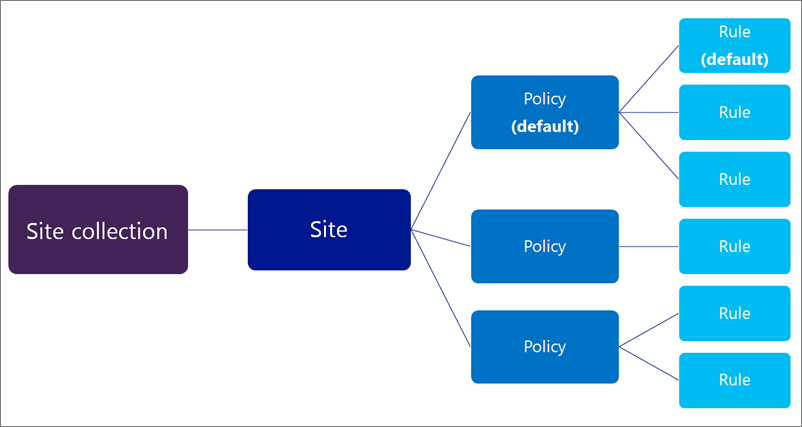
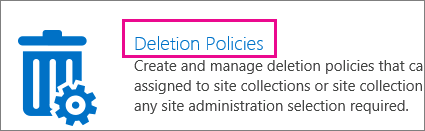
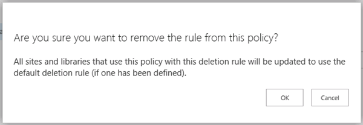

# 문서 삭제 정책 만들기

> [!IMPORTANT]
> 보존 정책 또는 보안에서 만든 레이블을 사용 하는 권장 앞으로 이동, &amp; 문서 삭제 정책 대신 준수 센터입니다. 문서 삭제 정책은 계속 보존 정책 나란히 작동 하지만를 유지 하거나 Office 365의 외부에서 콘텐츠를 삭제 해야 하는 경우 보존 정책을 사용 하는 것이 좋습니다. 자세한 내용은 [이러한 기능 대신 보존 정책 사용](retention-policies.md#use-a-retention-policy-instead-of-these-features)을 참조 하십시오. 
  
조직은 규정 준수, 법률 및 기타 규정 때문에 특정 기간 동안 문서 보존이 필요한 경우가 많습니다. 그렇지만 필요 이상으로 오랫동안 문서를 보존하면 조직은 법적 위험에 노출될 수 있습니다.
  
문서 삭제 정책을 사용 하 여 있습니다 사전 위험을 줄일 수 특정 기간 후 사이트의 문서를 삭제 하 여 — 등 비즈니스 5 년이 문서를 만든 후 사이트에 대 한 사용자의 OneDrive에서 문서 삭제할 수 있습니다. 
  
문서 삭제 정책을 만든 후에 사이트 모음 서식 파일에 할당하여 해당 서식 파일에서 만들어진 모든 사이트 모음에서 해당 정책을 사용하도록 할 수 있습니다. 또한 특정 사이트 모음에 정책을 할당하여 해당 사이트 모음에 대한 서식 파일에 할당되었을 수 있는 정책을 재정의할 수도 있습니다.
  

  
## 정책 템플릿

문서 삭제 정책을 처음부터 직접 만들거나, 샘플 정책 중 하나를 사용할 수 있습니다. 준수 정책 센터에는 그대로 사용할 수도 있고, 기준 정책으로 사용한 다음 이름을 바꾸거나 수정할 수 있는 샘플 정책이 포함되어 있습니다.
  

  
## 문서 삭제 정책 사용 방법의 예

사이트 모음 또는 사이트 모음 서식 파일 하나 이상의 정책을 할당 하 고 각 이러한 정책을 하나 이상의 규칙을 가질 수 있습니다. 그러나 사이트당를 활성화 하는 정책을 하나만 있을 수 및 언제 든 지 사이트 내에서 라이브러리에 대 한 활성 상태인 삭제 규칙을 하나만 있을 수 있습니다.
  

  
또한 정책을 필수 또는 기본으로 선택하고 삭제 규칙을 기본 규칙으로 선택할 수 있습니다. 
  
- **필수 정책** 정책을 필수 항목으로 표시 되 면 사이트 모음 또는 서식 파일에 정책은 하나만 할당할 수 있습니다. 정책을 기본으로 표시 되어야 합니다 하 고 모든 사이트에 적용 됩니다. 사이트 소유자는 정책을 거부할 수 없으며 합니다.
    
- **기본 정책** 정책을 기본으로 설정 되 면 해당 정책이 사이트 소유자가 필요 없는 작업에 할당 된 모든 사이트에 자동으로 활성 상태가 합니다.
    
- **기본 규칙** 삭제 규칙이 기본으로 설정 되 면 해당 정책을 사용 하는 사이트의 모든 라이브러리에 자동으로 적용 됩니다.
    
다음 예제에서는 필수 정책 또는 기본 정책과 규칙을 사용하게 되는 경우를 설명합니다.
  
### 예 1: 단일 규칙을 갖는 단일 정책을 사이트 모음 서식 파일에 적용

모든 비즈니스용 OneDrive 사이트 또는 모든 팀 사이트와 같이 광범위하고 구조화되지 않은 콘텐츠에 문서 삭제 정책을 적용하려고 할 수 있습니다. 단일 문서 삭제 정책이 사이트 모음 서식 파일에서 만든 모든 사이트에서 활성화되도록 하려면 다음을 수행합니다.
  
1. 단일 기본 삭제 규칙을 갖는 단일 정책을 만듭니다.
    
2. 정책을 필수 및 기본 정책으로 설정합니다.
    
3. 정책을 사이트 모음 서식 파일에 할당합니다.
    
이 예제에서 기본 삭제 규칙은 서식 파일에서 만든 모든 사이트 모음의 모든 라이브러리에 적용되고 사이트 소유자는 정책을 거부할 수 없습니다. 이것이 문서 삭제 정책을 광범위하고 엄격하게 적용하는 가장 간단한 방법입니다.
  

  
### 예 2: 사이트 모음 서식 파일에 여러 규칙을 갖는 단일 정책을 적용합니다

사이트 소유자가 사이트에 포함된 콘텐츠 유형을 가장 잘 아는 경우가 많으므로 사이트 소유자가 해당 사이트에 가장 적합한 삭제 규칙을 선택하도록 할 수 있습니다. 또한 사이트 소유자가 정책을 완전히 거부하도록 할 수도 있습니다.
  
정책을 거부하는 동시에 중앙에서는 계속 정책을 만들고 관리할 수 있습니다. 또한 하나의 정책 및 규칙을 기본으로 선택하여 사이트 소유자가 다른 정책을 선택하거나 정책을 거부할 때까지 한 가지 정책이 항상 적용되도록 선택할 수도 있습니다. 사이트 소유자에게 이러한 유연성을 제공하려면 다음을 수행합니다.
  
1. 여러 삭제 규칙이 있는 단일 정책을 만들고 규칙 하나를 기본 규칙으로 설정합니다.
    
2. 정책을 기본 정책으로 설정합니다.
    
3. 정책을 사이트 모음 서식 파일에 할당합니다.
    
사이트 소유자는 대체 삭제 규칙 중 하나를 선택하거나, 정책을 거부하거나, 아무 작업도 수행하지 않고 기본 정책 및 규칙이 되도록 할 수 있습니다.
  

  
### 예 3: 규칙을 하나 이상 갖는 여러 정책을 사이트 모음에 적용

이 예제에서는 사이트 소유자가 여러 정책 중에서 정책을 선택할 수 있고, 선택한 후에는 여러 규칙 중에서 선택할 수 있으므로 최대의 유연성이 허용됩니다. 하나의 정책 및 규칙을 기본으로 설정하므로 사이트 소유자가 다른 정책을 선택하거나 정책을 거부할 때까지 한 가지 정책이 항상 적용됩니다. 정책 및 규칙을 기본으로 설정하지 않으면 사이트 소유자가 정책 및 규칙을 선택하여 적용할 때까지 사이트의 문서 라이브러리에 대한 어떤 정책이나 규칙도 활성 상태가 되지 않습니다.
  
앞의 두 예제와 달리, 이러한 정책은 사이트 모음 서식 파일이 아닌 특정 사이트 모음에 할당됩니다. 즉, 정책을 특정 사이트 모음의 콘텐츠에 대해 좀 더 구체적으로 조정할 수 있습니다.
  
정책 및 규칙이 상속됩니다. 사이트 소유자는 사이트에 대한 정책과 규칙을 선택할 수 있으며 모든 하위 사이트는 상위 사이트에서 정책을 상속합니다. 그렇지만 하위 사이트 소유자는 다른 정책 및 규칙을 선택하여 상속을 끊을 수 있으며, 상속이 다시 끊어질 때까지 모든 하위 사이트에 해당 정책과 규칙이 적용됩니다.
  
이 시나리오를 설정하려면 다음을 수행합니다.
  
1. 각각이 규칙을 하나 이상 포함하는 여러 정책을 만듭니다.
    
2. 정책 및 규칙을 기본으로 설정합니다.
    
3. 정책을 특정 사이트 모음에 할당합니다.
    
또한 정책 및 규칙은 특정 사이트 모음에 맞게 조정되며 사이트 소유자는 자신의 사이트에 가장 적합한 정책 및 규칙을 선택하여 상속을 끊을 수 있습니다.
  

  
## 문서 삭제 정책 만들기

1. Office 365Security에서 &amp; 준수 센터의 **데이터 관리** 로 이동 \> **보존**합니다. **삭제**에서 **SharePoint Online 및 비즈니스용 OneDrive에 대 한 문서 삭제 정책 관리를**클릭 합니다. 새 브라우저 탭에서 문서 삭제 정책 센터를 엽니다.
    
    보안에서 이동 처음으로 &amp; 문서 삭제 정책 센터로 준수 센터, 정책 센터 자동으로 만들어집니다. 또는 [사이트 모음을](http://go.microsoft.com/fwlink/p/?LinkID=404342) 만들고 **엔터프라이즈** 탭에서 **규정 준수 정책 센터** 를 선택 하 여 정책 센터를 수동으로 만들 수 있습니다. 
    
2. **삭제 정책**을 선택 합니다.
    
    
  
3. **새 항목**을 선택합니다.
    
4. 정책 이름 및 설명을 입력합니다. 사이트 소유자는 이 이름과 설명을 기반으로 사이트의 정책을 선택할 수 있으므로 올바른 정책을 선택하도록 충분한 정보를 포함해야 합니다.
    
5. 규칙을 만들려면 **새로 만들기**를 선택합니다.
    
6. 이름을 입력하고 다음 옵션을 선택합니다.
    
  - 규칙 됩니다 영구적으로 문서를 삭제 또는 휴지통으로 삭제 여부를 선택 합니다. 휴지통 항목을 사이트에서 영구적으로 삭제 되기 전에 2 단계 보안 네트워크를 제공 합니다. 휴지통에 대 한 자세한 내용은 [휴지통을 비우거나 파일을 복원](http://go.microsoft.com/fwlink/p/?LinkID=404348)을 참조 하십시오.
    
  - 삭제 날짜를 문서가 만들어진 날짜부터 계산할지 또는 마지막으로 수정된 날짜부터 계산할지를 선택합니다.
    
  - 문서가 삭제될 기간으로 일, 월 또는 년 수를 입력합니다.
    
  - 규칙이 기본 규칙인지 여부를 선택합니다. 처음 만든 규칙이 기본 규칙으로 자동 설정됩니다. 기본 규칙은 해당 정책을 사용하는 사이트의 모든 라이브러리에 자동으로 적용됩니다.
    

  
7. **저장**을 클릭합니다.
    
8. 사이트 소유자가 사이트에 적용할 다른 규칙을 선택할 수 있도록 하려면 추가 규칙을 만듭니다. 사이트 소유자가 아무 작업도 수행하지 않을 경우 기본 규칙(있는 경우)이 적용됩니다.
    
9. 정책에서 규칙을 제거 하려면 규칙을 선택 하 고 **삭제**를 클릭 한 다음 **확인**을 클릭 합니다.
    
    > [!NOTE]
    > 규칙을 삭제 하 고 정책을 기본 규칙을 포함 하지 않습니다 이면 해당 정책에 대 한 규칙이 적용 될 예정-즉, 문서가 삭제 됩니다. 
  

  
## 문서 삭제 정책을 사이트 모음 서식 파일에 할당

사이트 모음 서식 파일에 정책을 할당해 기존 사이트 모음과 앞으로 만들어질 사이트 모음을 모두 포함하여, 해당 서식 파일에서 만드는 모든 사이트 모음에서 해당 정책을 사용할 수 있도록 합니다.
  
것 이라는 문서에 대해 지정 된 기간이 삭제 정책 의미 시간 이후에 문서를 만들거나 수정, 정책이 할당 된 이후 시간이 아니라 이해 하는 것이 중요 합니다. 사이트의 모든 문서 계산 되는 처음에 대 한 정책을 할당 하는 경우 하 고 조건을 만족 하는 경우 삭제 됩니다. 이 모든 기존 문서를 정책이 할당 된 후에 만든 단지 새 문서에 적용 됩니다.
  
1. 보안에서 &amp; 준수 센터의 **데이터 관리** 로 이동 \> **보존**합니다. **삭제**에서 **SharePoint Online 및 비즈니스용 OneDrive에 대 한 문서 삭제 정책 관리를**클릭 합니다. 새 브라우저 탭에서 문서 삭제 정책 센터를 엽니다.
    
2. **서식 파일에 대한 정책 할당**을 선택합니다.
    
    
  
3. **새 항목**을 선택합니다.
    
4. 다음 중 하나를 수행합니다.
    
  - 팀 사이트 서식 파일과 같은 사이트 모음 서식 파일에 정책을 할당하려면 **사이트 모음 서식 파일에 할당**을 선택하고 사이트 모음 서식 파일을 선택합니다.
    
  - 비즈니스에 대 한 사용자의 One Drive에 정책을 할당 하려면 **비즈니스 서식 파일에 대 한 OneDrive에 할당**을 아래에 강조 표시를 선택 합니다.
    
    > [!NOTE]
    > 사이트 모음 서식 파일에 정책을 할당하면 해당 서식 파일에서 만든 기존 사이트 모음과 앞으로 만들어질 사이트 모음 둘 다에서 해당 정책을 사용할 수 있습니다. 
  

  
5. **저장**을 클릭합니다.
    
    > [!NOTE]
    > 각 서식 파일에 할당 된 정책 집합이 하나만 가질 수 있습니다. 이 서식 파일에 할당 된 정책에 이미 없다는 오류가 표시 되 면 선택 **취소** \> 왼쪽된 탐색에서 **사이트 모음에 할당** 을 \> 보고 이미 지정 된 정책 집합을 관리 하는 사이트 모음을 선택 합니다. 할당 합니다. 
  
6. 할당 하 고 하나의 정책이 기본 정책 인지 여부를 선택 하려는 정책을 선택, **할당 된 정책 관리**를 선택 합니다. 기본 정책을 설정할 때 정책에 자동으로 할당 하는 모든 사이트 정책이 현재 작업이 사이트 소유자가 필요 하지 않습니다.
    
    
  
7. **저장**을 클릭합니다.
    
8. 사이트 소유자가 거부하도록 허용하지 않으면서 모든 사이트에 정책을 적용하려면 **필수 정책으로 표시**를 선택합니다. 필수 정책으로 지정하면 해당 정책 하나만 사이트 모음 서식 파일에 할당될 수 있습니다. 또한 해당 정책이 기본 정책으로 표시됩니다.
    
    이 옵션이 회색으로 표시되면 **할당된 정책 관리**를 선택한 후 정책이 하나 이상 할당되고 기본으로 설정되는지 확인합니다. 
    
9. **저장**을 클릭합니다.
    
## 문서 삭제 정책을 사이트 모음에 할당

특정 사이트 모음에 정책을 할당하여 해당 특정 사이트 모음에서만 정책을 사용하도록 할 수 있습니다. 즉, 사이트 모음의 콘텐츠에 더욱 유사하게 정책을 조정할 수 있습니다. 또한 특정 사이트 모음에 할당된 정책은 해당 사이트 모음에 대한 서식 파일에 할당된 모든 정책을 재정의합니다. 예를 들어 판매 부서 사이트 모음에 할당된 정책(팀 사이트 서식 파일에서 생성)은 팀 사이트 서식 파일에 할당된 모든 정책을 재정의합니다.
  
것 이라는 문서에 대해 지정 된 기간이 삭제 정책 의미 시간 이후에 문서를 만들거나 수정, 정책이 할당 된 이후 시간이 아니라 이해 하는 것이 중요 합니다. 사이트의 모든 문서 계산 되는 처음에 대 한 정책을 할당 하는 경우 하 고 조건을 만족 하는 경우 삭제 됩니다. 이 모든 기존 문서를 정책이 할당 된 후에 만든 단지 새 문서에 적용 됩니다.
  
1. 보안에서 &amp; 준수 센터의 **데이터 관리** 로 이동 \> **보존**합니다. **삭제**, 아래에서 **SharePoint Online 및 비즈니스용 OneDrive에 대 한 문서 삭제 정책 관리를**선택 합니다. 새 브라우저 탭에서 문서 삭제 정책 센터를 엽니다.
    
2. **사이트 모음에 대한 정책 할당**을 선택합니다.
    
    
  
3. **새 항목**을 선택합니다.
    
4. **Choose 사이트 모음을**선택 합니다. 이름 또는 URL로 사이트 모음에 대 한 검색 하 고, 사이트 모음을 선택 하 고 및 **저장**을 클릭 합니다.
    
    > [!NOTE]
    > 각 사이트 모음에 할당 된 정책 집합이 하나만 가질 수 있습니다. 이미이 사이트 모음에 할당 된 정책이 없다는 오류가 표시 되 면 선택 **취소** \> **사이트 모음에 할당** 하 고 사이트 모음 선택을 보고 하 여 이미 할당 된 정책 집합을 관리 합니다. 
  

  
5. 할당 하 고 하나의 정책이 기본 정책 인지 여부를 선택 하려는 정책을 선택, **할당 된 정책 관리**를 선택 합니다. 기본 정책을 설정할 때 정책에 자동으로 할당 하는 모든 사이트 정책이 현재 작업이 사이트 소유자가 필요 하지 않습니다.
    
    
  
6. **저장**을 클릭합니다.
    
7. 사이트 소유자가 거부하도록 허용하지 않으면서 모든 사이트에 정책을 적용하려면 **필수 정책으로 표시**를 선택합니다. 필수 정책으로 지정하면 해당 정책 하나만 사이트 모음에 할당될 수 있습니다. 또한 해당 정책이 기본 정책으로 표시됩니다.
    
    이 옵션이 회색으로 표시되면 **할당된 정책 관리**를 선택한 후 정책이 하나 이상 할당되고 기본으로 설정되는지 확인합니다. 
    
8. **저장**을 클릭합니다.
    
## 정책 할당 삭제

할당을 삭제하면 할당된 정책이 사이트 모음 또는 사이트 모음 서식 파일의 사이트에 더 이상 할당되지 않습니다.
  
1. 보안에서 &amp; 준수 센터의 **데이터 관리** 로 이동 \> **보존**합니다. **삭제**, 아래에서 **SharePoint Online 및 비즈니스용 OneDrive에 대 한 문서 삭제 정책 관리를**선택 합니다. 새 브라우저 탭에서 문서 삭제 정책 센터를 엽니다.
    
2. **서식 파일에 대한 정책 할당** 또는 **사이트 모음에 대한 정책 할당**을 선택합니다.
    
3. 배정 항목을 선택 하 고 **항목 삭제**를 클릭 합니다.
    
    
  
## 정책 삭제

사용 중인 정책을 삭제할 수 없습니다. 사이트 모음 및 해당 정책을 포함 하는 사이트 모음 서식 파일에 할당을 모두 삭제 하려면 먼저 필요한 정책을 삭제할 수 있습니다, 전에-이전 섹션을 참조 하십시오.
  
1. 보안에서 &amp; 준수 센터 \> **데이터 관리** 를 선택 \> 의 왼쪽된 탐색 영역에서 **보존** \> **삭제** 에서 \> SharePoint Online 및 OneDrive **관리 문서 삭제 정책 비즈니스를 위한**합니다. 새 브라우저 탭에서 문서 삭제 정책 센터를 엽니다.
    
2. 선택 * * 삭제 정책 * *.
    
    
  
3. 정책을 선택합니다.
    
4. 리본 메뉴에서 \> **항목** 탭 \> **정책을 제거**합니다.
    
    
  
5. 정책이 사용 되 고 있는 경우 여기에서 사용 하는 사이트 모음의 모든에서 정책을 제거 하려면 라는 수 나타납니다. 확실, **확인**을 선택 합니다.
    
    
  
## 참고 항목

[문서 삭제 정책 개요](document-deletion-policies.md)

[사이트에 문서 삭제 정책 적용 또는 제거](apply-or-remove-a-document-deletion-policy-for-a-site.md)
 

