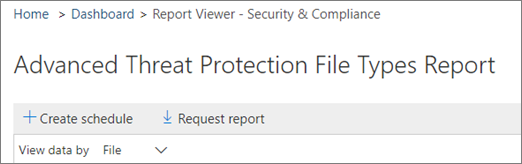

# 보안 &amp; 및 준수 센터에서 보고서 일정 만들기Create a schedule for a report in the Security &amp; Compliance Center

보안 &amp; 및 준수 센터에서는 조직의 보안 팀이 조직에 위협을 완화 하 고 문제를 해결 하는 데 도움이 되는 다양 한 [보고서와 정보](reports-and-insights-in-security-and-compliance.md) 를 제공 합니다.In the Security &amp; Compliance Center, several [reports and insights](reports-and-insights-in-security-and-compliance.md) are available to help your organization's security team mitigate and address threats to your organization. 조직의 보안 팀 구성원 인 경우 보고서에 대 한 일정을 만들 수 있습니다.If you're a member of your organization's security team, you can create a schedule for a report. 만든 일정에 따라 조직에 적합 한 사용자 지정 날짜 범위가 포함 될 수 있습니다.The schedule you create can include a custom date ranges to suit your organization. 
  
## 보고서에 대한 일정 만들기Create a schedule for a report

> [!IMPORTANT]
> 이 작업을 수행 하는 데 필요한 권한이 있는지 확인 합니다.Make sure that you have the necessary permissions to perform this task. 일반적으로 Office 365 전역 관리자, 보안 관리자 및 보안 독자는 보안 &amp; 및 준수 센터의 보고서에 액세스할 수 있습니다.In general, Office 365 global administrators, security administrators, and security readers can access reports in the Security &amp; Compliance Center. 사용 권한에 대 한 자세한 내용은 [Office 365 보안 &amp; 및 준수 센터의 사용 권한을](permissions-in-the-security-and-compliance-center.md)참조 하세요.To learn more about permissions, see [Permissions in the Office 365 Security &amp; Compliance Center](permissions-in-the-security-and-compliance-center.md).
  
1. [보안 &amp; 및 준수 센터](https://protection.office.com)에서 **보고서** \> **대시보드로**이동 합니다.In the [Security &amp; Compliance Center](https://protection.office.com), go to **Reports** \> **Dashboard**.
    
2. 다음 보고서 중 하나를 선택 합니다.Choose one of the following reports: 

    - DLP 정책 일치 항목DLP policy matches
    - Exchange 전송 규칙Exchange Transport Rule
    - DLP 가양성 및 재정의DLP false positives and overrides
    - Office 365 ATP 파일 형식Office 365 ATP file types
    - Office 365 ATP 메시지 처리Office 365 ATP message disposition
    - 전자 메일에서 발견 된 맬웨어Malware detected in email
    - 주요 맬웨어Top malware
    - 상위 보낸 사람 및 받는 사람Top senders and recipients
    - 스푸핑 감지Spoof detections
    - 스팸 감지Spam detections
    - 보내고 받은 전자 메일Sent and received email
    - DLP 인시던트DLP incidents
    - 암호화 보고서Encryption report

    이 예에서는 Advanced Threat Protection 파일 형식 보고서를 선택 합니다.For this example, we'll choose the Advanced Threat Protection File Types report.
    
3. 보고서의 왼쪽 위 모서리에서 **+ 일정 만들기**를 선택 합니다.In the upper left corner of the report, choose **+ Create schedule**. 
    
    

    (참고: 모든 보고서에 **+ 일정 만들기** 단추가 있는 것은 아닙니다.)(NOTE: Not all reports have the **+ Create schedule** button.)
  
    **일정 만들기** 대화 상자가 열립니다.The **Create schedule** dialog box opens. 
    
4. 기본 설정을 유지 하 고 **일정 만들기**를 선택 하거나 **일정 사용자 지정**을 선택 합니다.Keep the default settings and choose **Create schedule**, or choose **Customize schedule**.
    
    
  
    보고서 일정을 사용자 지정 하려는 경우 보고서의 빈도, 보낸 사람의 전자 메일 주소 및 받는 사람의 전자 메일 주소를 지정할 수 있습니다.If you choose to customize your report schedule, you can specify the report's frequency, a sender's email address, and a recipient's email address. 
    
보고서 일정을 만든 후에는 해당 보고서가 전자 메일을 통해 받는 사람의 전자 메일 주소로 자동으로 배달 됩니다.Once you have created a schedule for a report, that report will be delivered via email to recipients' email addresses automatically. 
  
## 관련 항목Related topics

[Office 365 보안 &amp; 및 준수 센터의 보고서 및 정보Reports and insights in the Office 365 Security &amp; Compliance Center](reports-and-insights-in-security-and-compliance.md)
  
[보안 &amp; 및 준수 센터에서 보고서에 대 한 일정 관리Manage schedules for reports in the Security &amp; Compliance Center](manage-schedules-for-multiple-reports.md)
  
[보안 &amp; 및 준수 센터에서 기존 보고서 다운로드Download existing reports in the Security &amp; Compliance Center](download-existing-reports.md)
  
[보안 &amp; 및 준수 센터에서 사용자 지정 보고서 다운로드Download a custom report in the Security &amp; Compliance Center](set-up-and-download-a-custom-report.md)
  

