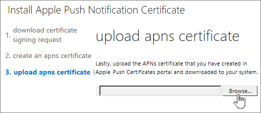

# IOS 장치용 APNs 인증서 만들기Create an APNs Certificate for iOS devices

 Office 365의 모바일 장치 관리에서 iPad 및 Iphone와 같은 iOS 장치를 관리 하려면 APNs 인증서를 만들어야 합니다.To manage iOS devices like iPad and iPhones in Mobile Device Management for Office 365 you must create an APNs certificate. 
  
이렇게 하려면 포털의 **설정** 링크에 있는 단계를 수행 합니다.To do this, follow the steps from the **Set up** link on the portal page. ( **보안 &amp; 및 준수 센터** \> **보안 정책** \> 으로 이동 **장치 관리** \> **설정을 관리**합니다.)(Go to **Security &amp; Compliance Center** \> **Security policies** \> **Device management** \> **Manage settings**.)
  

  
1. Next to **Configure a APNs Certificate for iOS devices**, select **Set up**.Next to **Configure a APNs Certificate for iOS devices**, select **Set up**.
    
2. Select **Download your CSR file** and save the Certificate signing request to a somewhere on your computer that you'll remember.Select **Download your CSR file** and save the Certificate signing request to a somewhere on your computer that you'll remember. 
    
    
  
3.  Select *\*Next*\*. Select **Next**.
    
4.  Create an APN certificate.Create an APN certificate.
    
  - Select **Apple APNS Portal** to open the Apple Push Certificates Portal. Select **Apple APNS Portal** to open the Apple Push Certificates Portal. 
    
    
  
  - Sign in with an Apple ID.Sign in with an Apple ID.
    
    > [!IMPORTANT]
    > Use a company Apple ID associated with an email account that will remain with your organization even if the user who manages the account leaves. Save this ID because you'll need to use the same ID when it's time to renew the certificate.Use a company Apple ID associated with an email account that will remain with your organization even if the user who manages the account leaves. Save this ID because you'll need to use the same ID when it's time to renew the certificate. 
  
  - Select **Create a Certificate** and accept the **Terms of Use**.Select **Create a Certificate** and accept the **Terms of Use**.
    
  - **Browse** to the Certificate signing request you downloaded to your computer from Office 365 and select **Upload**.**Browse** to the Certificate signing request you downloaded to your computer from Office 365 and select **Upload**.
    
  - **Download** the APN certificate created by the Apple Push Certificate Portal to your computer.**Download** the APN certificate created by the Apple Push Certificate Portal to your computer. 
    
    > [!TIP]
    > If you're having trouble downloading the certificate, refresh your browser.If you're having trouble downloading the certificate, refresh your browser. 
  
5. Go back to Office 365 and select **Next** to get to the **Upload APNS certificate** page.Go back to Office 365 and select **Next** to get to the **Upload APNS certificate** page. 
    
6.  Browse to the APN certificate you downloaded from the Apple Push Certificates Portal.Browse to the APN certificate you downloaded from the Apple Push Certificates Portal.
    
    
  
7. Select **Finish**.Select **Finish**.
    
**보안 &amp; 및 준수 센터** \> **보안 정책** \> 으로 돌아가기 **장치 관리** \> **설정을 관리** 하 여 설치를 완료 합니다.Go back to **Security &amp; Compliance Center** \> **Security policies** \> **Device management** \> **Manage settings** to complete setup. 
  

