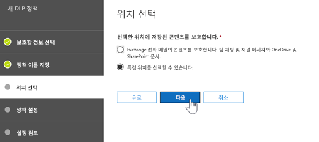
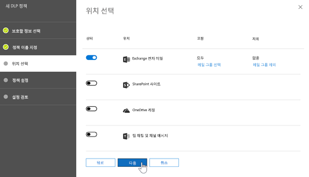
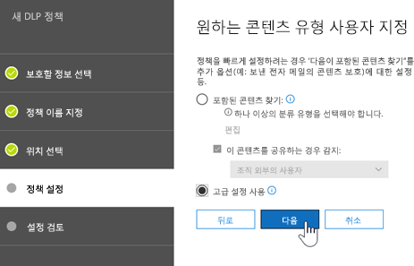
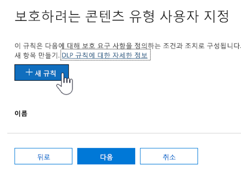
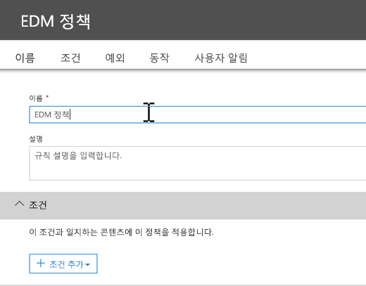
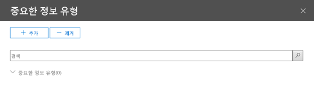

# <a name="create-custom-sensitive-information-types-with-exact-data-match-based-classification-preview"></a><span data-ttu-id="0d5fe-103">정확한 데이터 매치를 사용한 사용자 지정 중요한 정보 유형 만들기(미리 보기)</span><span class="sxs-lookup"><span data-stu-id="0d5fe-103">See Create a custom sensitive information type with Exact Data Match based classification (Preview).</span></span>

## <a name="overview"></a><span data-ttu-id="0d5fe-104">개요</span><span class="sxs-lookup"><span data-stu-id="0d5fe-104">Overview</span></span>

<span data-ttu-id="0d5fe-105">[사용자 지정 중요한 정보 유형](custom-sensitive-info-types.md)을 사용하면 중요한 정보를 의도하지 않거나 부적절하게 공유하는 것을 방지합니다.</span><span class="sxs-lookup"><span data-stu-id="0d5fe-105">[Custom sensitive information types](custom-sensitive-info-types.md) are used to help prevent inadvertent or inappropriate sharing of sensitive information.</span></span> <span data-ttu-id="0d5fe-106">관리자로서 [보안 및 준수 센터](create-a-custom-sensitive-information-type.md) 또는 [PowerShell](create-a-custom-sensitive-information-type-in-scc-powershell.md)을 사용하여 패턴, 증명(*employee*, *배지*, *ID* 등의 키워드), 문자 근접도(특정 패턴에서 증명과 문자가 근접한 정도) 및 신뢰 수준을 기반으로 사용자 지정 정보 유형을 정의할 수 있습니다.</span><span class="sxs-lookup"><span data-stu-id="0d5fe-106">As an administrator, you can use the [Security & Compliance Center](create-a-custom-sensitive-information-type.md) or [PowerShell](create-a-custom-sensitive-information-type-in-scc-powershell.md) to define a custom sensitive information type based on patterns, evidence (keywords such as *employee*, *badge*, *ID*, and so on), character proximity (how close evidence is to characters in a particular pattern), and confidence levels.</span></span> <span data-ttu-id="0d5fe-107">이러한 사용자 지정 중요한 정보 유형은 대부분의 조직에 필요한 비즈니스 요구 사항을 충족합니다.</span><span class="sxs-lookup"><span data-stu-id="0d5fe-107">Such custom sensitive information types meet business needs for many organizations.</span></span>

<span data-ttu-id="0d5fe-108">하지만 패컨과 근접도가 아니라 정확한 데이터 값을 사용하는 사용자 지정 중요 정보 유형의 경우에는 어떻게 할까요?</span><span class="sxs-lookup"><span data-stu-id="0d5fe-108">But what if you wanted a custom sensitive information type that uses exact data values, instead of patterns and proximity?</span></span> <span data-ttu-id="0d5fe-109">정확한 데이터 매치(EDM) 기반 분류를 사용하여 다음과 같이 설계된 사용자 지정 중요한 정보 유형을 만들 수 있습니다.</span><span class="sxs-lookup"><span data-stu-id="0d5fe-109">With Exact Data Match (EDM)-based classification, you can create a custom sensitive information type that is designed to:</span></span>
- <span data-ttu-id="0d5fe-110">동적이며 새로 고치기 가능</span><span class="sxs-lookup"><span data-stu-id="0d5fe-110">be dynamic and refreshable;</span></span>
- <span data-ttu-id="0d5fe-111">확장성 향상</span><span class="sxs-lookup"><span data-stu-id="0d5fe-111">be more scalable;</span></span>
- <span data-ttu-id="0d5fe-112">가양성 수 감소</span><span class="sxs-lookup"><span data-stu-id="0d5fe-112">result in fewer false-positives;</span></span>
- <span data-ttu-id="0d5fe-113">구조화된 중요한 데이터 사용</span><span class="sxs-lookup"><span data-stu-id="0d5fe-113">work with structured sensitive data;</span></span>
- <span data-ttu-id="0d5fe-114">중요한 정보를 더 안전하게 처리</span><span class="sxs-lookup"><span data-stu-id="0d5fe-114">handle sensitive information more securely; and</span></span>
- <span data-ttu-id="0d5fe-115">여러 Microsoft 클라우드 서비스와 사용 가능.</span><span class="sxs-lookup"><span data-stu-id="0d5fe-115">be used with several Microsoft cloud services.</span></span>


<span data-ttu-id="0d5fe-117">EDM 기반 분류를 사용하면 중요한 정보 데이터베이스의 정확한 값을 참조하는 사용자 지정 중요한 정보 유형을 만들 수 있습니다.</span><span class="sxs-lookup"><span data-stu-id="0d5fe-117">EDM-based classification enables you to create custom sensitive information types that refer to exact values in a database of sensitive information.</span></span> <span data-ttu-id="0d5fe-118">데이터베이스는 매일 또는 매주 새로 고칠 수 있으며 최대 1000만 개의 데이터 행을 포함할 수 있습니다.</span><span class="sxs-lookup"><span data-stu-id="0d5fe-118">The database can be refreshed daily or weekly, and it can contain up to 10 million rows of data.</span></span> <span data-ttu-id="0d5fe-119">직원, 환자 또는 고객이 계속 이동하고 기록이 변경됨에 따라 사용자 지정 중요 정보 유형을 적절하고 최신인 상태로 유지합니다.</span><span class="sxs-lookup"><span data-stu-id="0d5fe-119">So as employees, patients, or clients come and go, and records change, your custom sensitive information types remain current and applicable.</span></span> <span data-ttu-id="0d5fe-120">또한 EDM 기반 분류를 [데이터 손실 방지 정책](data-loss-prevention-policies.md)(DLP) 또는 [Microsoft Cloud App Security 파일 정책](https://docs.microsoft.com/cloud-app-security/data-protection-policies) 등의 정책과 사용할 수 있습니다.</span><span class="sxs-lookup"><span data-stu-id="0d5fe-120">And, you can use EDM-based classification with policies, such as [data loss prevention policies](data-loss-prevention-policies.md) (DLP) or [Microsoft Cloud App Security file policies](https://docs.microsoft.com/cloud-app-security/data-protection-policies).</span></span>

## <a name="required-licenses-and-permissions"></a><span data-ttu-id="0d5fe-121">필수 라이센스 및 사용 권한</span><span class="sxs-lookup"><span data-stu-id="0d5fe-121">Required licenses and permissions</span></span>

- <span data-ttu-id="0d5fe-122">이 문서에 설명된 작업을 수행하려면 전역 관리자, 준수 관리자 또는 Exchange Online 관리자여야 합니다.</span><span class="sxs-lookup"><span data-stu-id="0d5fe-122">You must be a global admin, compliance administrator, or Exchange Online administrator to perform the tasks described in this article.</span></span> <span data-ttu-id="0d5fe-123">DLP 권한에 관한 자세한 내용은 [권한](data-loss-prevention-policies.md#permissions)을 참조하세요.</span><span class="sxs-lookup"><span data-stu-id="0d5fe-123">To learn more about DLP permissions, see [Permissions](data-loss-prevention-policies.md#permissions).</span></span>

- <span data-ttu-id="0d5fe-124">일반적으로 사용 가능하게 되면 EDM 기반 분류가 다음 구독에 포함됩니다.</span><span class="sxs-lookup"><span data-stu-id="0d5fe-124">When generally available, EDM-based classification will be included in the following subscriptions:</span></span>
    - <span data-ttu-id="0d5fe-125">Office 365 E5</span><span class="sxs-lookup"><span data-stu-id="0d5fe-125">Office 365 Enterprise E5</span></span>
    - <span data-ttu-id="0d5fe-126">Microsoft 365 E5</span><span class="sxs-lookup"><span data-stu-id="0d5fe-126">Microsoft 365 E5</span></span>
    - <span data-ttu-id="0d5fe-127">Microsoft 365 정보 보호 및 규정 준수</span><span class="sxs-lookup"><span data-stu-id="0d5fe-127">Microsoft 365 Information Protection and Compliance</span></span>
    - <span data-ttu-id="0d5fe-128">Office 365 Advanced Compliance</span><span class="sxs-lookup"><span data-stu-id="0d5fe-128">Office 365 Advanced Compliance</span></span>

> [!NOTE]
> <span data-ttu-id="0d5fe-129">**[Office 365의 DLP](data-loss-prevention-policies.md)(Exchange Online 및 Microsoft Teams) 및 [Cloud App Security](https://docs.microsoft.com/cloud-app-security)의.EDM 기반 분류는 현재 미리 보기 상태에 있습니다.**</span><span class="sxs-lookup"><span data-stu-id="0d5fe-129">**EDM-based classification is currently in preview** for [DLP in Office 365](data-loss-prevention-policies.md) (with Exchange Online and Microsoft Teams) and [Cloud App Security](https://docs.microsoft.com/cloud-app-security).</span></span> <span data-ttu-id="0d5fe-130">조직에 [DLP 기능](https://docs.microsoft.com/office365/servicedescriptions/exchange-online-protection-service-description/messaging-policy-and-compliance-servicedesc#data-loss-prevention-dlp)이 있으면 EDM 기반 분류를 시도할 수 있습니다.</span><span class="sxs-lookup"><span data-stu-id="0d5fe-130">If your organization has [DLP capabilities](https://docs.microsoft.com/office365/servicedescriptions/exchange-online-protection-service-description/messaging-policy-and-compliance-servicedesc#data-loss-prevention-dlp), you can try EDM-based classification.</span></span> <span data-ttu-id="0d5fe-131">미리보기에 아직 참여하지 않은 경우 [Microsoft에 문의](https://resources.office.com/us-landing-spe-contactus.html?LCID=EN-US)하여 시작하세요.</span><span class="sxs-lookup"><span data-stu-id="0d5fe-131">If you are not already participating in the preview, [contact Microsoft](https://resources.office.com/us-landing-spe-contactus.html?LCID=EN-US) to get started.</span></span> 

## <a name="the-work-flow-at-a-glance"></a><span data-ttu-id="0d5fe-132">작업 흐름 한 눈에 보기</span><span class="sxs-lookup"><span data-stu-id="0d5fe-132">The work flow at a glance</span></span>

|<span data-ttu-id="0d5fe-133">단계</span><span class="sxs-lookup"><span data-stu-id="0d5fe-133">Phase</span></span>  |<span data-ttu-id="0d5fe-134">필요한 사항</span><span class="sxs-lookup"><span data-stu-id="0d5fe-134">What's needed</span></span>  |
|---------|---------|
|[<span data-ttu-id="0d5fe-135">1단계: EDM 기반 분류 설정</span><span class="sxs-lookup"><span data-stu-id="0d5fe-135">Part 1: Set up EDM-based classification</span></span>](#part-1-set-up-edm-based-classification)<br/><br/><span data-ttu-id="0d5fe-136">(필요한 대로 수행)</span><span class="sxs-lookup"><span data-stu-id="0d5fe-136">(As needed)</span></span><br/><span data-ttu-id="0d5fe-137">- [데이터베이스 스키마 편집](#editing-the-schema-for-edm-based-classification)</span><span class="sxs-lookup"><span data-stu-id="0d5fe-137">- [Edit the database schema](#editing-the-schema-for-edm-based-classification)</span></span> <br/><span data-ttu-id="0d5fe-138">- [스키마 제거](#removing-the-schema-for-edm-based-classification)</span><span class="sxs-lookup"><span data-stu-id="0d5fe-138">- [Remove the schema](#removing-the-schema-for-edm-based-classification)</span></span> |<span data-ttu-id="0d5fe-139">- 중요한 데이터에 대한 읽기 액세스 권한</span><span class="sxs-lookup"><span data-stu-id="0d5fe-139">- Read access to the sensitive data</span></span><br/><span data-ttu-id="0d5fe-140">- .xml 형식의 데이터베이스 스키마(예제 제공)</span><span class="sxs-lookup"><span data-stu-id="0d5fe-140">- Database schema in .xml format (example provided)</span></span><br/><span data-ttu-id="0d5fe-141">- .xml 형식의 규칙 패키지(예제 제공)</span><span class="sxs-lookup"><span data-stu-id="0d5fe-141">- Rule package in .xml format (example provided)</span></span><br/><span data-ttu-id="0d5fe-142">- 보안 및 준수 센터에 대한 관리자 권한(Windows PowerShell 사용)</span><span class="sxs-lookup"><span data-stu-id="0d5fe-142">- Admin permissions to the Security & Compliance Center (using PowerShell)</span></span> |
|[<span data-ttu-id="0d5fe-143">2단계: 중요한 데이터 색인화 및 업로드</span><span class="sxs-lookup"><span data-stu-id="0d5fe-143">Part 2: Index and upload the sensitive data</span></span>](#part-2-index-and-upload-the-sensitive-data)<br/><br/><span data-ttu-id="0d5fe-144">(필요한 대로 수행)</span><span class="sxs-lookup"><span data-stu-id="0d5fe-144">(As needed)</span></span><br/>[<span data-ttu-id="0d5fe-145">데이터 새로 고침</span><span class="sxs-lookup"><span data-stu-id="0d5fe-145">Refresh the data</span></span>](#refreshing-your-sensitive-information-database) |<span data-ttu-id="0d5fe-146">- 사용자 지정 보안 그룹 및 사용자 계정</span><span class="sxs-lookup"><span data-stu-id="0d5fe-146">- Custom security group and user account</span></span><br/><span data-ttu-id="0d5fe-147">- EDM 업로드 에이전트가 있는 컴퓨터에 대한 로컬 관리자 액세스 권한</span><span class="sxs-lookup"><span data-stu-id="0d5fe-147">- Local admin access to machine with EDM Upload Agent</span></span><br/><span data-ttu-id="0d5fe-148">- 중요한 데이터에 대한 읽기 액세스 권한</span><span class="sxs-lookup"><span data-stu-id="0d5fe-148">- Read access to the sensitive data</span></span><br/><span data-ttu-id="0d5fe-149">- 데이터를 새로 고치는 프로세스 및 일정</span><span class="sxs-lookup"><span data-stu-id="0d5fe-149">- Process and schedule for refreshing the data</span></span>|
|[<span data-ttu-id="0d5fe-150">3단계: Microsoft 클라우드 서비스로 EDM 기반 분류 사용</span><span class="sxs-lookup"><span data-stu-id="0d5fe-150">Part 3: Use EDM-based classification with your Microsoft cloud services</span></span>](#part-3-use-edm-based-classification-with-your-microsoft-cloud-services) |<span data-ttu-id="0d5fe-151">- DLP 포함 Office 365 구독</span><span class="sxs-lookup"><span data-stu-id="0d5fe-151">- Office 365 subscription with DLP</span></span><br/><span data-ttu-id="0d5fe-152">- EDM 기반 분류 기능 사용(미리 보기)</span><span class="sxs-lookup"><span data-stu-id="0d5fe-152">- EDM-based classification feature enabled (in preview)</span></span> |

## <a name="part-1-set-up-edm-based-classification"></a><span data-ttu-id="0d5fe-153">1단계: EDM 기반 분류 설정</span><span class="sxs-lookup"><span data-stu-id="0d5fe-153">Part 1: Set up EDM-based classification</span></span>

<span data-ttu-id="0d5fe-154">EDM 기반 분류를 설정하고 구성하려면 중요한 데이터를 .csv 형식으로 저장하고, 중요한 정보의 데이터베이스 스키마를 정의하며, 규칙 패키지를 만든 다음 스키마와 규칙 패키지를 업로드해야 합니다.</span><span class="sxs-lookup"><span data-stu-id="0d5fe-154">Setting up and configuring EDM-based classification involves saving sensitive data in .csv format, defining a schema for your database of sensitive information, creating a rule package, and then uploading the schema and rule package.</span></span>

### <a name="define-the-schema-for-your-database-of-sensitive-information"></a><span data-ttu-id="0d5fe-155">중요한 정보 데이터베이스의 스키마 정의</span><span class="sxs-lookup"><span data-stu-id="0d5fe-155">Define the schema for your database of sensitive information</span></span>

1. <span data-ttu-id="0d5fe-156">사용하려는 중요한 정보를 식별합니다.</span><span class="sxs-lookup"><span data-stu-id="0d5fe-156">Identify the sensitive information you want to use.</span></span> <span data-ttu-id="0d5fe-157">Microsoft Excel과 같은 앱에 데이터를 내보내고 .csv 형식으로 파일을 저장합니다.</span><span class="sxs-lookup"><span data-stu-id="0d5fe-157">Export the data to an app, such as Microsoft Excel, and save the file in .csv format.</span></span> <span data-ttu-id="0d5fe-158">데이터 파일은 다음과 같습니다.</span><span class="sxs-lookup"><span data-stu-id="0d5fe-158">The data file can include:</span></span>

    - <span data-ttu-id="0d5fe-159">최대 1000만 개의 중요한 데이터 행</span><span class="sxs-lookup"><span data-stu-id="0d5fe-159">Up to 10 million rows of sensitive data</span></span>
    - <span data-ttu-id="0d5fe-160">데이터 원본당 최대 32개의 열(필드)</span><span class="sxs-lookup"><span data-stu-id="0d5fe-160">Up to 32 columns (fields) per data source</span></span>

2. <span data-ttu-id="0d5fe-161">첫 번째 행에 EDM 기반 분류에 사용한 필드의 이름이 포함되도록 .csv 파일에 중요한 데이터를 구성합니다.</span><span class="sxs-lookup"><span data-stu-id="0d5fe-161">Structure the sensitive data in the .csv file such that the first row includes the names of the fields used for EDM-based classification.</span></span> <span data-ttu-id="0d5fe-162">.csv 파일에는 "ssn", "birthdate", "firstname", "lastname" 등의 필드 이름이 있을 수 있습니다.</span><span class="sxs-lookup"><span data-stu-id="0d5fe-162">In your .csv file, you might have field names, such as "ssn", "birthdate", "firstname", "lastname", and so on.</span></span> <span data-ttu-id="0d5fe-163">예를 들어 .csv 파일은 *PatientRecords.csv*라고 하며 해당 열에는 *PatientID*, *MRN*, *lastname*, *FirstName*, *SSN* 등이 포함되어 있습니다.</span><span class="sxs-lookup"><span data-stu-id="0d5fe-163">As an example, our .csv file is called *PatientRecords.csv*, and its columns include *PatientID*, *MRN*, *lastname*, *FirstName*, *SSN* and more.</span></span>

3. <span data-ttu-id="0d5fe-164">중요한 정보 데이터의 스키마를 .xml 형식으로 정의합니다(아래 예제와 비슷).</span><span class="sxs-lookup"><span data-stu-id="0d5fe-164">Define the schema for the database of sensitive information in .xml format (similar to our example below).</span></span> <span data-ttu-id="0d5fe-165">이 스키마 파일의 이름을 `edm.xml`로 지정하고 데이터베이스의 각 열에 `<Field name="" unique="" searchable=""/>` 구문을 사용하는 줄이 있도록 구성합니다.</span><span class="sxs-lookup"><span data-stu-id="0d5fe-165">Name this schema file `edm.xml`, and configure it such that for each column in the database, there is a line that uses the syntax `<Field name="" unique="" searchable=""/>`.</span></span> 

    - <span data-ttu-id="0d5fe-166">*필드 이름* 값에 열 이름을 사용합니다.</span><span class="sxs-lookup"><span data-stu-id="0d5fe-166">Use column names for *Field name* values.</span></span>
    - <span data-ttu-id="0d5fe-167">고유한 값을 포함하는 필드(주민등록번호, ID 번호 등)에는 *unique="true"* 를 사용합니다. 그렇지 않으면 *unique="false"* 를 사용합니다.</span><span class="sxs-lookup"><span data-stu-id="0d5fe-167">Use *unique="true"* for the fields that contain unique values (Social Security numbers, identification numbers, etc.); otherwise, use *unique="false"*.</span></span>
    - <span data-ttu-id="0d5fe-168">검색 가능하게 할 필드에는 *searchable="true"* 를 사용합니다.</span><span class="sxs-lookup"><span data-stu-id="0d5fe-168">Use *searchable="true"* for the fields that you want to be searchable.</span></span> <span data-ttu-id="0d5fe-169">검색 가능하게 할 필드는 데이터베이스당 5개 이하로 지정합니다.</span><span class="sxs-lookup"><span data-stu-id="0d5fe-169">Do not specify more than five fields per database to be searchable.</span></span> <span data-ttu-id="0d5fe-170">나머지는 모두 *searchable="false"* 여야 합니다.</span><span class="sxs-lookup"><span data-stu-id="0d5fe-170">All the rest should have *searchable="false"*.</span></span>  

    <span data-ttu-id="0d5fe-171">예를 들어 다음 .xml 파일에서는 5개의 필드(*PatientID*, *MRN*, *SSN*, *Phone* 및 *DOB*)가 검색 가능으로 지정된 환자 레코드 데이터베이스의 스키마를 정의합니다.</span><span class="sxs-lookup"><span data-stu-id="0d5fe-171">As an example, the following .xml file defines the schema for a patient records database, with five fields specified as searchable: *PatientID*, *MRN*, *SSN*, *Phone*, and *DOB*.</span></span> 
    
    <span data-ttu-id="0d5fe-172">(여기에 있는 예제를 복사, 수정 및 사용할 수 있습니다.)</span><span class="sxs-lookup"><span data-stu-id="0d5fe-172">(You can copy, modify, and use our example.)</span></span>
    
    <span data-ttu-id="0d5fe-173">\`\`\`<?xml version="1.0" encoding="utf-8"?> <EdmSchema xmlns="http://schemas.microsoft.com/office/2018/edm"></span><span class="sxs-lookup"><span data-stu-id="0d5fe-173"></span></span>
        <span data-ttu-id="0d5fe-174"><DataStore name="PatientRecords" description="환자 레코드의 스키마</span><span class="sxs-lookup"><span data-stu-id="0d5fe-174"><DataStore name="PatientRecords" description="Schema for patient records</span></span>" version="1">
            <span data-ttu-id="0d5fe-175"><Field name="PatientID" unique="false" searchable="true" /> <Field name="MRN" unique="false" searchable="true" /></span><span class="sxs-lookup"><span data-stu-id="0d5fe-175"></span></span>
            <Field name="FirstName" unique="false" searchable="false" />
            <Field name="LastName" unique="false" searchable="false" />
            <Field name="SSN" unique="false" searchable="true" />
            <Field name="Phone" unique="false" searchable="true" />
            <Field name="DOB" unique="false" searchable="true" />
            <Field name="Gender" unique="false" searchable="false" />
            <Field name="Address" unique="false" searchable="false" />
        </DataStore>
    </EdmSchema>
    ```

4. [Connect to Office 365 Security & Compliance Center PowerShell](https://docs.microsoft.com/powershell/exchange/office-365-scc/connect-to-scc-powershell/connect-to-scc-powershell?view=exchange-ps).

5. To upload the database schema, run the following cmdlets, one at a time:

    `$edmSchemaXml=Get-Content .\edm.xml -Encoding Byte -ReadCount 0`

    `New-DlpEdmSchema -FileData $edmSchemaXml -Confirm:$true`

    You will be prompted to confirm, as follows:

       Confirm
       Are you sure you want to perform this action?
       New EDM Schema for the data store 'patientrecords' will be imported.
       [Y] Yes  [A] Yes to All  [N] No  [L] No to All  [?] Help (default is "Y"):

    > [!TIP]
    > If you want your changes to occur without confirmation, in Step 5, use this cmdlet instead: `New-DlpEdmSchema -FileData $edmSchemaXml`
    
Now that the schema for your database of sensitive information is defined, the next step is to set up a rule package. Proceed to the section [Set up a rule package](#set-up-a-rule-package).

#### Editing the schema for EDM-based classification 

(As needed) If you want to make changes to your edm.xml file, such as changing which fields are used for EDM-based classification, follow these steps:

1. Edit your edm.mxl file (this is the file discussed in the [Define the schema](#define-the-schema-for-your-database-of-sensitive-information) section of this article).

2. [Connect to Office 365 Security & Compliance Center PowerShell](https://docs.microsoft.com/powershell/exchange/office-365-scc/connect-to-scc-powershell/connect-to-scc-powershell?view=exchange-ps).

3. To update your database schema, run the following cmdlets, one at a time:

    `$edmSchemaXml=Get-Content .\edm.xml -Encoding Byte -ReadCount 0`

    `Set-DlpEdmSchema -FileData $edmSchemaXml -Confirm:$true`

    You will be prompted to confirm, as follows:

       Confirm
       Are you sure you want to perform this action?
       EDM Schema for the data store 'patientrecords' will be updated.
       [Y] Yes  [A] Yes to All  [N] No  [L] No to All  [?] Help (default is "Y"):

    > [!TIP]
    > If you want your changes to occur without confirmation, in Step 3, use this cmdlet instead: `Set-DlpEdmSchema -FileData $edmSchemaXml`

#### Removing the schema for EDM-based classification

(As needed) If you want to remove the schema you're using for EDM-based classification, follow these steps:

1. [Connect to Office 365 Security & Compliance Center PowerShell](https://docs.microsoft.com/powershell/exchange/office-365-scc/connect-to-scc-powershell/connect-to-scc-powershell?view=exchange-ps).

2. Run the following PowerShell cmdlet, substituting the data store name of "patientrecords" with the one you want to remove:

    `Remove-DlpEdmSchema -Identity patientrecords`

     You will be prompted to confirm, as follows:
    
       Confirm
       Are you sure you want to perform this action?
       EDM Schema for the data store 'patientrecords' will be removed.
       [Y] Yes  [A] Yes to All  [N] No  [L] No to All  [?] Help (default is "Y"):
    
    > [!TIP]
    > If you want your changes to occur without confirmation, in Step 2, use this cmdlet instead: `Remove-DlpEdmSchema -Identity patientrecords -Confirm:$false`

### Set up a rule package

1. Create a rule package in .xml format (with Unicode encoding), similar to the following example. (You can copy, modify, and use our example.) 

   Recall from the previous procedure that our PatientRecords schema defines five fields as searchable: *PatientID*, *MRN*, *SSN*, *Phone*, and *DOB*. Our example rule package includes those fields and references the database schema file (edm.xml), with one *ExactMatch* items per searchable field. Consider the following ExactMatch item:

   ```
    <span data-ttu-id="0d5fe-176"><ExactMatch id = "E1CC861E-3FE9-4A58-82DF-4BD259EAB371" patternsProximity = "300" dataStore ="PatientRecords" recommendedConfidence = "65" > <Pattern confidenceLevel="65"> <idMatch matches = "SSN" classification = "U.S. Social Security Number (SSN)" /> </Pattern> </ExactMatch></span><span class="sxs-lookup"><span data-stu-id="0d5fe-176"></span></span>
   ```

    In this example, note the following:

    - The dataStore name references the .csv file we created earlier: **dataStore = "PatientRecords"**.
    - The idMatch value references a searchable field that is listed in the database schema file: **idMatch matches = "SSN"**.
    - The classification value references an existing or custom sensitive information type: **classification = "U.S. Social Security Number (SSN)"**. (In this case, we use the existing sensitive information type of U.S. Social Security Number.)

    When you set up your rule package, make sure to correctly reference your .csv file and edm.xml file. (You can copy, modify, and use our example.) 

    ```<?xml version="1.0" encoding="utf-8"?>
    <RulePackage xmlns="http://schemas.microsoft.com/office/2018/edm">
      <RulePack id="fd098e03-1796-41a5-8ab6-198c93c62b11">
        <Version build="0" major="2" minor="0" revision="0" />
        <Publisher id="eb553734-8306-44b4-9ad5-c388ad970528" />
        <Details defaultLangCode="en-us">
          <LocalizedDetails langcode="en-us">
            <PublisherName>IP DLP</PublisherName>
            <Name>Health Care EDM Rulepack</Name>
            <Description>This rule package contains the EDM sensitive type for health care sensitive types.</Description>
          </LocalizedDetails>
        </Details>
      </RulePack>
      <Rules>
        <ExactMatch id = "E1CC861E-3FE9-4A58-82DF-4BD259EAB371" patternsProximity = "300" dataStore ="PatientRecords" recommendedConfidence = "65" >
          <Pattern confidenceLevel="65">
            <idMatch matches = "SSN" classification = "U.S. Social Security Number (SSN)" />
          </Pattern>
          <Pattern confidenceLevel="75">
            <idMatch matches = "SSN" classification = "U.S. Social Security Number (SSN)" />
            <Any minMatches ="3" maxMatches ="100">
              <match matches="PatientID" />
              <match matches="MRN"/>
              <match matches="FirstName"/>
              <match matches="LastName"/>
              <match matches="Phone"/>
              <match matches="DOB"/>
            </Any>
          </Pattern>
        </ExactMatch>
        <LocalizedStrings>
          <Resource idRef="E1CC861E-3FE9-4A58-82DF-4BD259EAB371">
            <Name default="true" langcode="en-us">Patient SSN Exact Match.</Name>
            <Description default="true" langcode="en-us">EDM Sensitive type for detecting Patient SSN.</Description>
          </Resource>
        </LocalizedStrings>
      </Rules>
    </RulePackage>
    ```
    
2. <span data-ttu-id="0d5fe-177">다음 Windows PowerShell cmdlet을 한 번에 하나씩 실행하여 규칙 패키지를 업로드합니다.</span><span class="sxs-lookup"><span data-stu-id="0d5fe-177">Upload the rule package by running the following PowerShell cmdlets, one at a time:</span></span>

    `$rulepack=Get-Content .\rulepack.xml -Encoding Byte -ReadCount 0`

    `New-DlpSensitiveInformationTypeRulePackage -FileData $rulepack`

<span data-ttu-id="0d5fe-178">이 시점에서 EDM 기반 분류를 설정합니다.</span><span class="sxs-lookup"><span data-stu-id="0d5fe-178">At this point, you have set up EDM-based classification.</span></span> <span data-ttu-id="0d5fe-179">다음 단계로는 중요한 데이터를 색인화하고 색인화된 데이터를 업로드합니다.</span><span class="sxs-lookup"><span data-stu-id="0d5fe-179">The next step is to index the sensitive data, and then upload the indexed data.</span></span> 

## <a name="part-2-index-and-upload-the-sensitive-data"></a><span data-ttu-id="0d5fe-180">2단계: 중요한 데이터 색인화 및 업로드</span><span class="sxs-lookup"><span data-stu-id="0d5fe-180">Part 2: Index and upload the sensitive data</span></span>

<span data-ttu-id="0d5fe-181">이 단계에서는 사용자 지정 보안 그룹 및 사용자 계정을 설정하고 EDM 업로드 에이전트 도구를 설정합니다.</span><span class="sxs-lookup"><span data-stu-id="0d5fe-181">During this phase, you set up a custom security group and user account, and set up the EDM Upload Agent tool.</span></span> <span data-ttu-id="0d5fe-182">그런 다음 이 도구를 사용하여 중요한 데이터를 색인화하고 색인화된 데이터를 업로드합니다.</span><span class="sxs-lookup"><span data-stu-id="0d5fe-182">Then, you use the tool to index the sensitive data, and upload the indexed data.</span></span>

### <a name="set-up-the-security-group-and-user-account"></a><span data-ttu-id="0d5fe-183">보안 그룹 및 사용자 계정 설정</span><span class="sxs-lookup"><span data-stu-id="0d5fe-183">Set up the security group and user account</span></span>

1. <span data-ttu-id="0d5fe-184">전역 관리자로서 관리 센터([https://admin.microsoft.com](https://admin.microsoft.com))로 이동하여 `EDM_DataUploaders`라는 [보안 그룹 만들기](https://docs.microsoft.com/office365/admin/email/create-edit-or-delete-a-security-group?view=o365-worldwide)를 수행합니다.</span><span class="sxs-lookup"><span data-stu-id="0d5fe-184">As a global administrator, go to the admin center ([https://admin.microsoft.com](https://admin.microsoft.com)) and [create a security group](https://docs.microsoft.com/office365/admin/email/create-edit-or-delete-a-security-group?view=o365-worldwide) called `EDM_DataUploaders`.</span></span> 

2. <span data-ttu-id="0d5fe-185">하나 이상의 사용자를 *EDM_DataUploaders* 보안 그룹에 추가합니다.</span><span class="sxs-lookup"><span data-stu-id="0d5fe-185">Add one or more users to the *EDM_DataUploaders* security group.</span></span> <span data-ttu-id="0d5fe-186">(이러한 사용자가 중요한 정보 데이터베이스를 관리합니다.)</span><span class="sxs-lookup"><span data-stu-id="0d5fe-186">(These users will manage the database of sensitive information.)</span></span>

3. <span data-ttu-id="0d5fe-187">중요한 데이터를 관리하는 각 사용자가 EDM 업로드 에이전트에 사용되는 컴퓨터에서 로컬 관리자인지 확인합니다.</span><span class="sxs-lookup"><span data-stu-id="0d5fe-187">Make sure each user who is managing the sensitive data is a local admin on the machine used for the EDM Upload Agent.</span></span>

### <a name="set-up-the-edm-upload-agent"></a><span data-ttu-id="0d5fe-188">EDM 업로드 에이전트 설정</span><span class="sxs-lookup"><span data-stu-id="0d5fe-188">Set up the EDM Upload Agent</span></span>

> [!NOTE]
> <span data-ttu-id="0d5fe-189">이 절차를 시작하기 전에 *EDM_DataUploaders* 보안 그룹의 구성원이며 컴퓨터의 로컬 관리자인지 확인합니다.</span><span class="sxs-lookup"><span data-stu-id="0d5fe-189">Before you begin this procedure, make sure that you are a member of the *EDM_DataUploaders* security group and a local admin on your machine.</span></span>

1. <span data-ttu-id="0d5fe-190">[https://go.microsoft.com/fwlink/?linkid=2088639](https://go.microsoft.com/fwlink/?linkid=2088639)에서 EDM 업로드 에이전트를 다운로드하고 설치합니다.</span><span class="sxs-lookup"><span data-stu-id="0d5fe-190">Download and install the EDM Upload Agent at [https://go.microsoft.com/fwlink/?linkid=2088639](https://go.microsoft.com/fwlink/?linkid=2088639).</span></span> <span data-ttu-id="0d5fe-191">기본적으로 설치 위치는 `C:\Program Files\Microsoft\EdmUploadAgent`이어야 합니다.</span><span class="sxs-lookup"><span data-stu-id="0d5fe-191">By default, the installation location should be `C:\Program Files\Microsoft\EdmUploadAgent`.</span></span> 

2. <span data-ttu-id="0d5fe-192">EDM 업로드 에이전트에 권한을 부여하려면 Windows 명령 프롬프트를 열고(관리자로) 다음 명령을 실행합니다.</span><span class="sxs-lookup"><span data-stu-id="0d5fe-192">To authorize the EDM Upload Agent, open Windows Command Prompt (as an administrator), and then run the following command:</span></span>

    `EdmUploadAgent.exe /Authorize`

3. <span data-ttu-id="0d5fe-193">Office 365의 회사 또는 학교 계정을 사용하여 로그인합니다.</span><span class="sxs-lookup"><span data-stu-id="0d5fe-193">Sign in to Office 365 for business with your work or school account.</span></span>

<span data-ttu-id="0d5fe-194">다음 단계로는 EDM 업로드 에이전트를 사용하여 중요한 데이터를 색인화하고 색인화된 데이터를 업로드합니다.</span><span class="sxs-lookup"><span data-stu-id="0d5fe-194">The next step is to use the EDM Upload Agent to index the sensitive data, and then upload the indexed data.</span></span>

### <a name="index-and-upload-the-sensitive-data"></a><span data-ttu-id="0d5fe-195">중요한 데이터 색인화 및 업로드</span><span class="sxs-lookup"><span data-stu-id="0d5fe-195">Index and upload the sensitive data</span></span>

1. <span data-ttu-id="0d5fe-196">중요한 데이터 파일(여기에서 예제는 *PatientRecords.csv*임)을 컴퓨터의 로컬 드라이브에 저장합니다.</span><span class="sxs-lookup"><span data-stu-id="0d5fe-196">Save the sensitive data file (recall our example is *PatientRecords.csv*) to the local drive on the machine.</span></span> <span data-ttu-id="0d5fe-197">(예제 *PatientRecords.csv* 파일을 `C:\Edm\Data`에 저장했습니다.)</span><span class="sxs-lookup"><span data-stu-id="0d5fe-197">(We saved our example *PatientRecords.csv* file to `C:\Edm\Data`.)</span></span>

2. <span data-ttu-id="0d5fe-198">중요한 데이터를 색인화하려면 Windows 명령 프롬프트에서 다음 명령을 실행합니다.</span><span class="sxs-lookup"><span data-stu-id="0d5fe-198">To index the sensitive data, run the following command in Windows Command Prompt:</span></span>

    `EdmUploadAgent.exe /CreateHash /DataStoreName <DataStoreName> /DataFile <DataFilePath> /HashLocation <HashedFileLocation>`

    <span data-ttu-id="0d5fe-199">예제: **EdmUploadAgent.exe /CreateHash /DataStoreName PatientRecords /DataFile C:\Edm\Data\PatientRecords.csv /HashLocation C:\Edm\Hash**</span><span class="sxs-lookup"><span data-stu-id="0d5fe-199">Example: **EdmUploadAgent.exe /CreateHash /DataStoreName PatientRecords /DataFile C:\Edm\Data\PatientRecords.csv /HashLocation C:\Edm\Hash**</span></span> 

3. <span data-ttu-id="0d5fe-200">색인화된 데이터를 업로드하려면 Windows 명령 프롬프트에서 다음 명령을 실행합니다.</span><span class="sxs-lookup"><span data-stu-id="0d5fe-200">To upload the indexed data, run the following command in Windows Command Prompt:</span></span>

    `EdmUploadAgent.exe /UploadHash /DataStoreName <DataStoreName> /HashFile <HashedSourceFilePath>`

    <span data-ttu-id="0d5fe-201">예제: **EdmUploadAgent.exe /UploadHash /DataStoreName PatientRecords /HashFile C:\Edm\Hash\PatientRecords.EdmHash**</span><span class="sxs-lookup"><span data-stu-id="0d5fe-201">Example: **EdmUploadAgent.exe /UploadHash /DataStoreName PatientRecords /HashFile C:\Edm\Hash\PatientRecords.EdmHash**</span></span> 

4. <span data-ttu-id="0d5fe-202">중요한 데이터가 업로드되었는지 확인하려면 Windows 명령 프롬프트에서 다음 명령을 실행합니다.</span><span class="sxs-lookup"><span data-stu-id="0d5fe-202">To verify your sensitive data has been uploaded, run the following command in Windows Command Prompt:</span></span>

    `EdmUploadAgent.exe /GetDataStore`

    <span data-ttu-id="0d5fe-203">데이터 저장소 목록 및 마지막 업데이트 날짜가 다음과 비슷하게 표시됩니다.</span><span class="sxs-lookup"><span data-stu-id="0d5fe-203">You'll see a list of data stores and when they were last updated, similar to the following:</span></span> <br/>

5. <span data-ttu-id="0d5fe-205">계속하여 [중요한 정보 데이터베이스 새로 고침](#refreshing-your-sensitive-information-database)의 프로세스 및 일정을 설정합니다.</span><span class="sxs-lookup"><span data-stu-id="0d5fe-205">Proceed to set up your process and schedule for [Refreshing your sensitive information database](#refreshing-your-sensitive-information-database).</span></span>

<span data-ttu-id="0d5fe-206">이제 Microsoft 클라우드 서비스로 EDM 기반 분류를 사용할 준비가 되었습니다.</span><span class="sxs-lookup"><span data-stu-id="0d5fe-206">At this point, you are ready to use EDM-based classification with your Microsoft cloud services.</span></span> <span data-ttu-id="0d5fe-207">예를 들어 [EDM 기반 분류를 사용하여 DLP 정책을 설정](#to-create-a-dlp-policy-with-edm)할 수 있습니다.</span><span class="sxs-lookup"><span data-stu-id="0d5fe-207">For example, you can [set up a DLP policy using EDM-based classification](#to-create-a-dlp-policy-with-edm).</span></span> 

### <a name="refreshing-your-sensitive-information-database"></a><span data-ttu-id="0d5fe-208">중요한 정보 데이터베이스 새로 고침</span><span class="sxs-lookup"><span data-stu-id="0d5fe-208">Refreshing your sensitive information database</span></span>

<span data-ttu-id="0d5fe-209">중요한 정보 데이터베이스를 매일 또는 매주 새로 고칠 수 있으며, EDM 업로드 도구를 사용하여 중요한 데이터를 다시 색인화한 다음 색인화된 데이터를 다시 업로드할 수 있습니다.</span><span class="sxs-lookup"><span data-stu-id="0d5fe-209">You can refresh your sensitive information database daily or weekly, and the EDM Upload Tool can reindex the sensitive data and then reupload the indexed data.</span></span> 

1. <span data-ttu-id="0d5fe-210">중요한 정보 데이터베이스를 새로 고치는 빈도(매일 또는 매주)와 프로세스를 판별합니다.</span><span class="sxs-lookup"><span data-stu-id="0d5fe-210">Determine your process and frequency (daily or weekly) for refreshing the database of sensitive information.</span></span>

2. <span data-ttu-id="0d5fe-211">Microsoft Excel과 같은 앱에 중요한 데이터를 다시 내보내고 .csv 형식으로 파일을 저장합니다.</span><span class="sxs-lookup"><span data-stu-id="0d5fe-211">Re-export the sensitive data to an app, such as Microsoft Excel, and save the file in .csv format.</span></span> <span data-ttu-id="0d5fe-212">[중요한 데이터 색인화 및 업로드](#index-and-upload-the-sensitive-data)에 설명된 단계를 수행할 때 사용한 파일 이름과 위치를 동일하게 유지합니다.</span><span class="sxs-lookup"><span data-stu-id="0d5fe-212">Keep the same file name and location you used when you followed the steps described in [Index and upload the sensitive data](#index-and-upload-the-sensitive-data).</span></span>

    > [!NOTE]
    > <span data-ttu-id="0d5fe-213">.csv 파일의 구조(필드 이름)를 변경하지 않은 경우 데이터를 새로 고칠 때 데이터베이스 스키마 파일을 변경하지 않아도 됩니다.</span><span class="sxs-lookup"><span data-stu-id="0d5fe-213">If there are no changes to the structure (field names) of the .csv file, you won't need to make any changes to your database schema file when you refresh the data.</span></span> <span data-ttu-id="0d5fe-214">하지만 변경해야 하는 경우 [데이터베이스 스키마](#editing-the-schema-for-edm-based-classification)와 [규칙 패키지](#set-up-a-rule-package)를 적절하게 편집해야 합니다.</span><span class="sxs-lookup"><span data-stu-id="0d5fe-214">But if you must make changes, make sure to edit the [database schema](#editing-the-schema-for-edm-based-classification) and your [rule package](#set-up-a-rule-package) accordingly.</span></span>        

3. <span data-ttu-id="0d5fe-215">[작업 스케줄러](https://docs.microsoft.com/windows/desktop/TaskSchd/task-scheduler-start-page)를 사용하여 [중요한 데이터 색인화 및 업로드](#index-and-upload-the-sensitive-data) 절차의 2단계와 3단계를 자동화합니다.</span><span class="sxs-lookup"><span data-stu-id="0d5fe-215">Use [Task Scheduler](https://docs.microsoft.com/windows/desktop/TaskSchd/task-scheduler-start-page) to automate steps 2 and 3 in the [Index and upload the sensitive data](#index-and-upload-the-sensitive-data) procedure.</span></span> <span data-ttu-id="0d5fe-216">다음과 같은 여러 메서드를 사용하여 작업을 예약할 수 있습니다.</span><span class="sxs-lookup"><span data-stu-id="0d5fe-216">You can schedule tasks using several methods:</span></span>
    
    |<span data-ttu-id="0d5fe-217">메서드</span><span class="sxs-lookup"><span data-stu-id="0d5fe-217">Method</span></span>  |<span data-ttu-id="0d5fe-218">수행할 작업</span><span class="sxs-lookup"><span data-stu-id="0d5fe-218">What to do</span></span>  |
    |---------|---------|
    |<span data-ttu-id="0d5fe-219">Windows PowerShell</span><span class="sxs-lookup"><span data-stu-id="0d5fe-219">Windows PowerShell</span></span>     |<span data-ttu-id="0d5fe-220">[ScheduledTasks](https://docs.microsoft.com/powershell/module/scheduledtasks/?view=win10-ps) 문서와 이 문서에 있는 [예제 Windows PowerShell 스크립트](#example-powershell-script-for-task-scheduler)를 참조하세요.</span><span class="sxs-lookup"><span data-stu-id="0d5fe-220">See the [ScheduledTasks](https://docs.microsoft.com/powershell/module/scheduledtasks/?view=win10-ps) documentation and the [example PowerShell script](#example-powershell-script-for-task-scheduler) in this article</span></span>|
    |<span data-ttu-id="0d5fe-221">작업 스케줄러 API</span><span class="sxs-lookup"><span data-stu-id="0d5fe-221">Task Scheduler API</span></span> |<span data-ttu-id="0d5fe-222">[작업 스케줄러](https://docs.microsoft.com/windows/desktop/TaskSchd/using-the-task-scheduler) 문서를 참조하세요.</span><span class="sxs-lookup"><span data-stu-id="0d5fe-222">See the [Task Scheduler](https://docs.microsoft.com/windows/desktop/TaskSchd/using-the-task-scheduler) documentation</span></span> |
    |<span data-ttu-id="0d5fe-223">Windows 사용자 인터페이스</span><span class="sxs-lookup"><span data-stu-id="0d5fe-223">Windows user interface</span></span>     |<span data-ttu-id="0d5fe-224">Windows에서 **시작**을 클릭하고 `Task Scheduler`를 입력합니다.</span><span class="sxs-lookup"><span data-stu-id="0d5fe-224">In Windows, click **Start**, and type `Task Scheduler`.</span></span> <span data-ttu-id="0d5fe-225">그런 다음 결과 목록에서 **작업 스케줄러**를 마우스 오른쪽 단추로 클릭하고 **관리자로 실행**을 선택합니다.</span><span class="sxs-lookup"><span data-stu-id="0d5fe-225">Then, in the list of results, right-click **Task Scheduler**, and choose **Run as administrator**.</span></span>          |

#### <a name="example-powershell-script-for-task-scheduler"></a><span data-ttu-id="0d5fe-226">작업 스케줄러의 예제 Windows PowerShell 스크립트</span><span class="sxs-lookup"><span data-stu-id="0d5fe-226">Example PowerShell script for Task Scheduler</span></span>

<span data-ttu-id="0d5fe-227">이 절에서는 데이터를 색인화하고 색인화된 데이터를 업로드하는 작업을 예약하는 데 사용할 수 있는 예제 Windows PowerShell 스크립트가 포함되어 있습니다.</span><span class="sxs-lookup"><span data-stu-id="0d5fe-227">This section includes an example PowerShell script you can use to schedule your tasks for indexing data and uploading the indexed data:</span></span>

```powershell
param([string]$dataStoreName,[string]$fileLocation)
# Assuming current user is also the user context to run the task
$user = "$env:USERDOMAIN\$env:USERNAME"
$edminstallpath = 'C:\Program Files\Microsoft\EdmUploadAgent\'
$edmuploader = $edminstallpath + 'EdmUploadAgent.exe'
$csvext = '.csv'
$edmext = '.EdmHash'
# Assuming CSV file name is same as data store name
$dataFile = "$fileLocation\$dataStoreName$csvext"
$hashFile = "$fileLocation\$dataStoreName$edmext"
# Assuming location to store hash file is same as the location of csv file
$hashLocation = $fileLocation
$createHashArgs = '/CreateHash /DataStoreName ' + $dataStoreName + ' /DataFile ' + $dataFile + ' /HashLocation ' + $hashLocation
$uploadHashArgs = '/UploadHash /DataStoreName ' + $dataStoreName + ' /HashFile ' + $hashFile
# Set up actions associated with the task
$actions = @()
$actions += New-ScheduledTaskAction -Execute $edmuploader -Argument $createHashArgs -WorkingDirectory $edminstallpath
$actions += New-ScheduledTaskAction -Execute $edmuploader -Argument $uploadHashArgs -WorkingDirectory $edminstallpath
# Set up trigger for the task
$trigger = New-ScheduledTaskTrigger -Weekly -DaysOfWeek Sunday -At 2am
# Set up task settings
$principal = New-ScheduledTaskPrincipal -UserId $user -LogonType S4U -RunLevel Highest
$settings = New-ScheduledTaskSettingsSet -RunOnlyIfNetworkAvailable -StartWhenAvailable -WakeToRun
# Create the scheduled task
$scheduledTask = New-ScheduledTask -Action $actions -Principal $principal -Trigger $trigger -Settings $settings
# Get credentials to run the task
$creds = Get-Credential -UserName $user -Message "Enter credentials to run the task"
$password=[Runtime.InteropServices.Marshal]::PtrToStringAuto([Runtime.InteropServices.Marshal]::SecureStringToBSTR($creds.Password))
# Register the scheduled task
$taskName = 'EDMUpload_' + $dataStoreName
Register-ScheduledTask -TaskName $taskName -InputObject $scheduledTask -User $user -Password $password
```
## <a name="part-3-use-edm-based-classification-with-your-microsoft-cloud-services"></a><span data-ttu-id="0d5fe-228">3단계: Microsoft 클라우드 서비스로 EDM 기반 분류 사용</span><span class="sxs-lookup"><span data-stu-id="0d5fe-228">Part 3: Use EDM-based classification with your Microsoft cloud services</span></span>

<span data-ttu-id="0d5fe-229">또한 [Office 365 DLP 정책](data-loss-prevention-policies.md) 및 [Microsoft Cloud App Security 파일 정책](https://docs.microsoft.com/cloud-app-security/data-protection-policies)과 같은 정보 보호 기능과 함께 EDM 기반 분류를 사용할 수 있습니다.</span><span class="sxs-lookup"><span data-stu-id="0d5fe-229">You can use EDM-based classification with information protection features, such as [Office 365 DLP policies](data-loss-prevention-policies.md) and [Microsoft Cloud App Security file policies](https://docs.microsoft.com/cloud-app-security/data-protection-policies).</span></span> <span data-ttu-id="0d5fe-230">다음 절차에서는 Office 365 보안 및 준수 센터에서 만든 DLP 정책을 사용하여 EDM을 사용하는 방법을 설명합니다.</span><span class="sxs-lookup"><span data-stu-id="0d5fe-230">The following procedure describes how to use EDM with a DLP policy that is created in the Office 365 Security & Compliance Center.</span></span>

### <a name="to-create-a-dlp-policy-with-edm"></a><span data-ttu-id="0d5fe-231">EDM으로 DLP 정책 만들기</span><span class="sxs-lookup"><span data-stu-id="0d5fe-231">To create a DLP policy with EDM</span></span>

1. <span data-ttu-id="0d5fe-232">보안 및 준수 센터로 이동([https://protection.office.com](https://protection.office.com)).</span><span class="sxs-lookup"><span data-stu-id="0d5fe-232">Go to the Security & Compliance Center</span></span>

2. <span data-ttu-id="0d5fe-233">**데이터 손실 방지** > **정책**을 선택합니다.</span><span class="sxs-lookup"><span data-stu-id="0d5fe-233">Click **Data loss prevention** > **Policy**.</span></span>

3. <span data-ttu-id="0d5fe-234">**정책 만들기** > **사용자 지정** > **다음**을 선택합니다.</span><span class="sxs-lookup"><span data-stu-id="0d5fe-234">Choose **Create a policy** > **Custom** > **Next**.</span></span>

4. <span data-ttu-id="0d5fe-235">**정책 이름 지정** 탭에 이름과 설명을 지정하고 **다음**을 선택합니다.</span><span class="sxs-lookup"><span data-stu-id="0d5fe-235">On the **Name your policy** tab, specify a name and description, and then choose **Next**.</span></span>

5. <span data-ttu-id="0d5fe-236">**위치 선택** 탭에서 **특정 위치 선택 허용**을 선택하고 **다음**을 선택합니다.</span><span class="sxs-lookup"><span data-stu-id="0d5fe-236">On the **Choose locations** tab, select **Let me choose specific locations**, and then choose **Next**.</span></span><br/><span data-ttu-id="0d5fe-237"></span><span class="sxs-lookup"><span data-stu-id="0d5fe-237"></span></span><br/>

6. <span data-ttu-id="0d5fe-238">**상태** 열에서 **Exchange 전자 메일**만 선택하고 **다음**을 선택합니다.</span><span class="sxs-lookup"><span data-stu-id="0d5fe-238">In the **Status** column, select **Exchange email** only, and then choose **Next**.</span></span> <br/><span data-ttu-id="0d5fe-239"></span><span class="sxs-lookup"><span data-stu-id="0d5fe-239"></span></span><br/>

7. <span data-ttu-id="0d5fe-240">**정책 설정** 탭에서 **고급 설정 사용**을 선택하고 **다음**을 선택합니다.</span><span class="sxs-lookup"><span data-stu-id="0d5fe-240">On the **Policy settings** tab, choose **Use advanced settings**, and then choose **Next**.</span></span><br/><span data-ttu-id="0d5fe-241"></span><span class="sxs-lookup"><span data-stu-id="0d5fe-241"></span></span><br/>

8. <span data-ttu-id="0d5fe-242">**+ 새 규칙**을 선택합니다.</span><span class="sxs-lookup"><span data-stu-id="0d5fe-242">Choose **+ New rule**.</span></span><br/><span data-ttu-id="0d5fe-243"></span><span class="sxs-lookup"><span data-stu-id="0d5fe-243">![Create a query rule</span></span><br/>

9. <span data-ttu-id="0d5fe-244">**이름** 섹션에서 규칙의 이름과 설명을 지정합니다.</span><span class="sxs-lookup"><span data-stu-id="0d5fe-244">In the **Name and Type** section, enter a name and description for the Data Analysis view.</span></span><br/><span data-ttu-id="0d5fe-245"></span><span class="sxs-lookup"><span data-stu-id="0d5fe-245"></span></span><br/>

10. <span data-ttu-id="0d5fe-246">**조건** 섹션의 **+ 조건 추가** 목록에서 **콘텐츠에 중요한 유형 포함**을 선택합니다.</span><span class="sxs-lookup"><span data-stu-id="0d5fe-246">In the **Conditions** section, in the **+ Add a condition** list, choose **Content contains sensitive type**.</span></span><br/><span data-ttu-id="0d5fe-247"></span><span class="sxs-lookup"><span data-stu-id="0d5fe-247"></span></span><br/>

11. <span data-ttu-id="0d5fe-248">규칙 패키지를 설치할 때 만든 중요한 정보를 검색한 다음 **+ 추가**를 선택합니다.</span><span class="sxs-lookup"><span data-stu-id="0d5fe-248">Search for the sensitive information type you created when you set up your rule package, and then choose **+ Add**.</span></span><br/><span data-ttu-id="0d5fe-249"></span><span class="sxs-lookup"><span data-stu-id="0d5fe-249"></span></span><br/><span data-ttu-id="0d5fe-250">그런 다음 **완료**를 선택합니다.</span><span class="sxs-lookup"><span data-stu-id="0d5fe-250">Then choose **Done**.</span></span>

12. <span data-ttu-id="0d5fe-251">**사용자 알림**, **사용자 재정의**, **인시던트 보고서** 등의 규칙에 관한 옵션 선택을 완료한 다음 **저장**을 선택합니다.</span><span class="sxs-lookup"><span data-stu-id="0d5fe-251">Finish selecting options for your rule, such as **User notifications**, **User overrides**, **Incident reports**, and so on, and then choose **Save**.</span></span>

13. <span data-ttu-id="0d5fe-252">**정책 설정** 탭에서 규칙을 검토하고 **다음**을 선택합니다.</span><span class="sxs-lookup"><span data-stu-id="0d5fe-252">On the **Policy settings** tab, review your rules, and then choose **Next**.</span></span>

14. <span data-ttu-id="0d5fe-253">정책을 바로 설정할지, 테스트할지, 아니면 설정 해제한 상태로 유지할지 지정합니다.</span><span class="sxs-lookup"><span data-stu-id="0d5fe-253">Specify whether to turn on the policy right away, test it out, or keep it turned off.</span></span> <span data-ttu-id="0d5fe-254">그런 후 **다음**을 선택합니다.</span><span class="sxs-lookup"><span data-stu-id="0d5fe-254">Then choose **Next**.</span></span>

15. <span data-ttu-id="0d5fe-255">**설정 검토** 탭에서 정책을 검토합니다.</span><span class="sxs-lookup"><span data-stu-id="0d5fe-255">On the **Review your settings** tab, review your policy.</span></span> <span data-ttu-id="0d5fe-256">필요한 대로 변경합니다.</span><span class="sxs-lookup"><span data-stu-id="0d5fe-256">Make any needed modifications.</span></span> <span data-ttu-id="0d5fe-257">준비가 되면 **만들기**를 선택합니다.</span><span class="sxs-lookup"><span data-stu-id="0d5fe-257">When you're ready, choose **Create**.</span></span>

    > [!NOTE]
    > <span data-ttu-id="0d5fe-258">새로운 DLP 정책이 데이터 센터에 적용되는 데 1시간 정도 걸립니다.</span><span class="sxs-lookup"><span data-stu-id="0d5fe-258">Allow approximately one hour for your new DLP policy to work its way through your data center.</span></span>

## <a name="related-articles"></a><span data-ttu-id="0d5fe-259">관련 문서</span><span class="sxs-lookup"><span data-stu-id="0d5fe-259">Related articles</span></span>

[<span data-ttu-id="0d5fe-260">기본 제공 중요 정보 유형 및 해당 유형이 찾는 항목</span><span class="sxs-lookup"><span data-stu-id="0d5fe-260">Built-in sensitive information types and what they look for</span></span>](what-the-sensitive-information-types-look-for.md)

[<span data-ttu-id="0d5fe-261">사용자 지정 중요한 정보 유형</span><span class="sxs-lookup"><span data-stu-id="0d5fe-261">Custom sensitive information types</span></span>](custom-sensitive-info-types.md)

[<span data-ttu-id="0d5fe-262">DLP 정책 개요</span><span class="sxs-lookup"><span data-stu-id="0d5fe-262">Overview of DLP policies</span></span>](data-loss-prevention-policies.md)

[<span data-ttu-id="0d5fe-263">Microsoft Cloud App Security</span><span class="sxs-lookup"><span data-stu-id="0d5fe-263">Microsoft Cloud App Security</span></span>](https://docs.microsoft.com/cloud-app-security)
