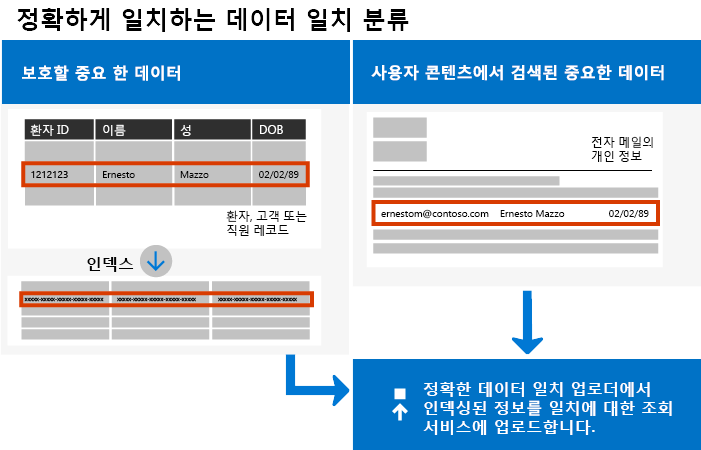
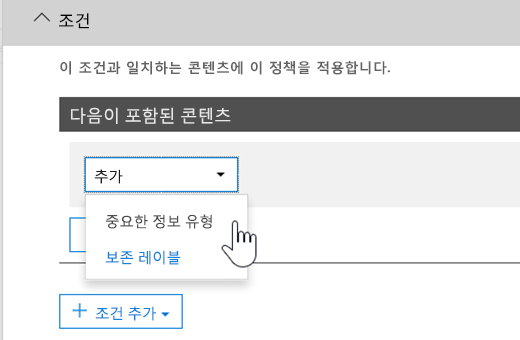

# <a name="create-custom-sensitive-information-types-with-exact-data-match-based-classification"></a>분류에 기반한 정확한 데이터 매치를 사용한 사용자 지정 중요한 정보 유형 만들기

## <a name="overview"></a>개요


  [사용자 지정 중요한 정보 유형](https://docs.microsoft.com/ko-KR/office365/securitycompliance/custom-sensitive-info-types)을 사용하면 중요한 정보를 의도하지 않거나 부적절하게 공유하는 것을 방지합니다. 관리자로서 [보안 및 준수 센터](https://docs.microsoft.com/ko-KR/office365/securitycompliance/create-a-custom-sensitive-information-type) 또는 [PowerShell](https://docs.microsoft.com/ko-KR/office365/securitycompliance/create-a-custom-sensitive-information-type-in-scc-powershell)을 사용하여 패턴, 증명( *직원*, *배지*, *ID* 등의 키워드), 문자 근접도(특정 패턴에서 증명과 문자가 근접한 정도) 및 신뢰 수준을 기반으로 사용자 지정 정보 유형을 정의할 수 있습니다. 이러한 사용자 지정 중요한 정보 유형은 대부분의 조직에 필요한 비즈니스 요구 사항을 충족합니다.

일반적인 패턴과만 일치하는 것이 아니라 정확한 데이터 값을 사용하는 사용자 지정 중요한 정보 유형의 경우에는 어떻게 할까요? 정확한 데이터 매치(EDM) 기반 분류를 사용하여 다음과 같이 설계된 사용자 지정 중요한 정보 유형을 만들 수 있습니다.

- 동적이며 새로 고치기 가능
- 확장성 향상
- 가양성 수 감소
- 구조화된 중요한 데이터 사용
- 중요한 정보를 더 안전하게 처리
- 여러 Microsoft 클라우드 서비스와 사용 가능.



EDM 기반 분류를 사용하면 중요한 정보 데이터베이스의 정확한 값을 참조하는 사용자 지정 중요한 정보 유형을 만들 수 있습니다. 데이터베이스는 매일 또는 매주 새로 고칠 수 있으며 최대 1000만 개의 데이터 행을 포함할 수 있습니다. 직원, 환자 또는 고객이 계속 이동하고 기록이 변경됨에 따라 사용자 지정 중요한 정보 유형을 적절하고 최신인 상태로 유지합니다. 또한 EDM 기반 분류를 [데이터 손실 방지 정책(DLP)](https://docs.microsoft.com/ko-KR/office365/securitycompliance/data-loss-prevention-policies) 또는 [Microsoft Cloud App Security 파일 정책](https://docs.microsoft.com/cloud-app-security/data-protection-policies) 등의 정책과 사용할 수 있습니다.

## <a name="required-licenses-and-permissions"></a>필수 라이선스 및 사용 권한

이 문서에 설명된 작업을 수행하려면 전역 관리자, 준수 관리자 또는 Exchange Online 관리자여야 합니다. DLP 권한에 관한 자세한 내용은  [사용 권한](https://docs.microsoft.com/ko-KR/office365/securitycompliance/data-loss-prevention-policies#permissions)을 참조하세요.

일반적으로 사용 가능하게 되면 EDM 기반 분류가 다음 구독에 포함됩니다.

- Office 365 E5
- Microsoft 365 E5
- Microsoft 365 정보 보호 및 규정 준수
- Office 365 Advanced Compliance

## <a name="the-work-flow-at-a-glance"></a>워크플로 한 눈에 보기

|단계  |필요한 사항  |
|---------|---------|
|[1단계: EDM 기반 분류 설정](#part-1-set-up-edm-based-classification)<br/><br/>(필요한 대로 수행)<br/>- [데이터베이스 스키마 편집](#editing-the-schema-for-edm-based-classification) <br/>- [스키마 제거](#removing-the-schema-for-edm-based-classification) |- 중요한 데이터에 대한 읽기 액세스 권한<br/>- .xml 형식의 데이터베이스 스키마(예제 제공)<br/>- .xml 형식의 규칙 패키지(예제 제공)<br/>- 보안 및 준수 센터에 대한 관리자 권한(Windows PowerShell 사용) |
|[2단계: 중요한 데이터 색인화 및 업로드](#part-2-index-and-upload-the-sensitive-data)<br/><br/>(필요한 대로 수행)<br/>[데이터 새로 고침](#refreshing-your-sensitive-information-database) |- 사용자 지정 보안 그룹 및 사용자 계정<br/>- EDM 업로드 에이전트가 있는 컴퓨터에 대한 로컬 관리자 액세스 권한<br/>- 중요한 데이터에 대한 읽기 액세스 권한<br/>- 데이터를 새로 고치는 프로세스 및 일정|
|[3단계: Microsoft 클라우드 서비스로 EDM 기반 분류 사용](#part-3-use-edm-based-classification-with-your-microsoft-cloud-services) |- DLP 포함 Office 365 구독<br/>- EDM 기반 분류 기능 사용 |

### <a name="part-1-set-up-edm-based-classification"></a>1단계: EDM 기반 분류 설정

EDM 기반 분류를 설정하고 구성하려면 중요한 데이터를 .csv 형식으로 저장하고, 중요한 정보의 데이터베이스 스키마를 정의하며, 규칙 패키지를 만든 다음 스키마와 규칙 패키지를 업로드해야 합니다.

#### <a name="define-the-schema-for-your-database-of-sensitive-information"></a>중요한 정보 데이터베이스의 스키마 정의

1. 사용하려는 중요한 정보를 식별합니다. Microsoft Excel과 같은 앱에 데이터를 내보내고 .csv 형식으로 파일을 저장합니다. 데이터 파일에는 최대 다음을 포함할 수 있습니다.
      - 최대 1000만 개의 중요한 데이터 행
      - 데이터 원본당 최대 32개의 열(필드)
      - 검색 가능으로 표시된 최대 5개의 열(필드)

2. 첫 번째 행에 EDM 기반 분류에 사용한 필드의 이름이 포함되도록 .csv 파일에 중요한 데이터를 구성합니다. .csv 파일에는 "ssn", "birthdate", "firstname", "lastname" 등의 필드 이름이 있을 수 있습니다. 예를 들어 .csv 파일은 *PatientRecords.csv*라고 하며 해당 열에는 *PatientID*, *MRN*, *LastName*, *FirstName*, *SSN* 등이 포함되어 있습니다.

3. 중요한 정보 데이터의 스키마를 .xml 형식으로 정의합니다(아래 예제와 비슷). 이 스키마 파일의 이름을 edm.xml로 지정하고 데이터베이스의 각 열에 \<Field name="" searchable=""/\> 구문을 사용하는 줄이 있도록 구성합니다.

      -  *Field name* 값에 열 이름을 사용합니다.
      - 최대 5개의 필드까지 검색할 수 있게 하려는 필드에 *searchable="true"* 를 사용합니다. 최소 하나의 필드를 검색 가능한 항목으로 지정해야 합니다.

예를 들어 다음 .xml 파일에서는 5개의 *필드(PatientID*, *MRN*, *SSN*, *Phone* 및 *DOB*)가 검색 가능으로 지정된 환자 레코드 데이터베이스의 스키마를 정의합니다.

(여기에 있는 예제를 복사, 수정 및 사용할 수 있습니다.)

 ```xml
<EdmSchema xmlns="http://schemas.microsoft.com/office/2018/edm">
      <DataStore name="PatientRecords" description="Schema for patient records" version="1">
            <Field name="PatientID" searchable="true" />
            <Field name="MRN" searchable="true" />
            <Field name="FirstName" />
            <Field name="LastName" />
            <Field name="SSN" searchable="true" />
            <Field name="Phone" searchable="true" />
            <Field name="DOB" searchable="true" />
            <Field name="Gender" />
            <Field name="Address" />
      </DataStore>
</EdmSchema>
```

4. [Office 365 보안 및 준수 센터 PowerShell에 연결](https://docs.microsoft.com/powershell/exchange/office-365-scc/connect-to-scc-powershell/connect-to-scc-powershell?view=exchange-ps)

5. 데이터베이스 스키마를 업로드 하려면 다음과 같은 cmdlet을 한 번에 하나씩 실행하십시오:

```powershell
$edmSchemaXml=Get-Content .\\edm.xml -Encoding Byte -ReadCount 0
New-DlpEdmSchema -FileData $edmSchemaXml -Confirm:$true
```

다음과 같이 확인하라는 메시지가 표시됩니다.

> 확인
>
> 이 작업을 수행하시겠습니까?
>
> 'patientrecords' 데이터 저장소의 새로운 EDM 스키마를 가져옵니다.
>
> \[Y\] 예 \[A\] 모두 예 \[N\] 아니요 \[L\] 모두 아니요 \[?\] 도움말(기본값: "Y"):

> [!TIP]
> 5단계에서 확인하지 않고 변경 사항을 적용하려면 New-DlpEdmSchema -FileData $edmSchemaXml 대신 해당 cmdlet을 사용하십시오.

> [!NOTE]
> EDMSchema를 추가 사항으로 업데이트하는 데 10~60분이 소요될 수 있습니다. 추가 사항을 사용하는 단계를 실행하기 전에 업데이트를 완료해야 합니다.

중요한 정보 데이터베이스에 대한 스키마가 정의되었으므로 다음 단계는 규칙 패키지를 설정하는 것입니다.  [규칙 패키지 설정하기](#set-up-a-rule-package) 섹션으로 이동하십시오.

#### <a name="editing-the-schema-for-edm-based-classification"></a>EDM 기반 분류에 대한 스키마 편집

EDM 기반 분류에 사용되는 필드를 변경하는 것과 같이 edm.xml 파일을 변경하려면 다음 단계를 수행하십시오.

1. edm.xml 파일을 편집하십시오.(해당 문서의 [스키마 정의](#define-the-schema-for-your-database-of-sensitive-information) 섹션에서 다루는 파일입니다.)

2. [Office 365 보안 및 준수 센터 PowerShell에 연결](https://docs.microsoft.com/powershell/exchange/office-365-scc/connect-to-scc-powershell/connect-to-scc-powershell?view=exchange-ps)

3. 데이터베이스 스키마를 업데이트하려면 다음과 같은 cmdlet을 한 번에 하나씩 실행하십시오:

```powershell
$edmSchemaXml=Get-Content .\\edm.xml -Encoding Byte -ReadCount 0
Set-DlpEdmSchema -FileData $edmSchemaXml -Confirm:$true
```

다음과 같이 확인하라는 메시지가 표시됩니다.

> 확인
>
> 이 작업을 수행하시겠습니까?
>
> 'patientrecords' 데이터 저장소의 새로운 EDM 스키마를 업데이트합니다.
>
> \[Y\] 예 \[A\] 모두 예 \[N\] 아니요 \[L\] 모두 아니요 \[?\] 도움말(기본값: "Y"):

> [!TIP]
> 3단계에서 확인하지 않고 변경 사항을 적용하려면 Set-DlpEdmSchema -FileData $edmSchemaXml 대신 해당 cmdlet을 사용하십시오.

> [!NOTE]
> EDMSchema를 추가 사항으로 업데이트하는 데 10~60분이 소요될 수 있습니다. 추가 사항을 사용하는 단계를 실행하기 전에 업데이트를 완료해야 합니다.

## <a name="removing-the-schema-for-edm-based-classification"></a>EDM 기반 분류에 대한 스키마 제거

(필요한 경우) EDM 기반 분류에 사용 중인 스키마를 제거하려면 다음 단계를 따르십시오:

1. [Office 365 보안 및 준수 센터 PowerShell에 연결](https://docs.microsoft.com/powershell/exchange/office-365-scc/connect-to-scc-powershell/connect-to-scc-powershell?view=exchange-ps)

2. 다음의 PowerShell cmdlet을 실행하여 "patientrecords"의 데이터 저장소 이름을 제거하고자 하는 것으로 대체하십시오.

```powershell
Remove-DlpEdmSchema -Identity patientrecords
```

다음과 같이 확인하라는 메시지가 표시됩니다.

> 확인
>
> 이 작업을 수행하시겠습니까?
>
> 'patientrecords' 데이터 저장소의 EDM 스키마를 제거합니다.
>
> \[Y\] 예 \[A\] 모두 예 \[N\] 아니요 \[L\] 모두 아니요 \[?\] 도움말(기본값: "Y"):

> [!TIP]
>  2단계에서 확인하지 않고 변경 사항을 적용하려면 Remove-DlpEdmSchema -Identity patientrecords -Confirm:$false 대신 해당 cmdlet을 사용하십시오.

### <a name="set-up-a-rule-package"></a>규칙 패키지 설정

1. 다음 예제와 같이 in .xml 형식(유니코드 인코딩 사용)에 규칙 패키지를 생성하십시오. (여기에 있는 예제를 복사, 수정 및 사용할 수 있습니다.)

규칙 패키지를 설정하는 경우 .csv 파일과 edm.xml 파일을 정확하게 참조하도록 하십시오. (여기에 있는 예제를 복사, 수정 및 사용할 수 있습니다.) 이 샘플 xml에서 EDM 중요 유형을 만들려면 다음 필드를 사용자 지정해야 합니다.

- 
  **RulePack ID & ExactMatch ID**: [New-GUID](https://docs.microsoft.com/ko-KR/powershell/module/microsoft.powershell.utility/new-guid?view=powershell-6)를  사용하여 GUID를 생성합니다.

- **Datastore**: 이 필드는 사용할 EDM 조회 데이터 저장소를 지정합니다. 구성된 EDM 스키마의 데이터 원본 이름을 입력합니다.

- **idMatch**: 이 필드는 EDM의 기본 요소를 가리킵니다.
  - Matches: 정확한 조회에 사용할 필드를 지정합니다. 데이터 저장소의 EDM 스키마에서 검색 가능한 필드 이름을 입력합니다.
  - Classification: 이 필드는 EDM 조회를 트리거하는 중요한 유형 일치를 지정합니다. 기존의 기본 제공 분류 또는 사용자 지정 분류의 이름 또는 GUID를 입력할 수 있습니다.

- **Match:** 이 필드는 idMatch의 근접성에서 찾은 추가 증명을 가리킵니다.
  - Matches: 데이터 저장소의 EDM 스키마에 필드 이름을 입력합니다.
- **리소스:** 이 섹션에서는 여러 로캘에서 중요한 유형의 이름과 설명을 지정합니다.
  - idRef: ExactMatch ID의 GUID를 입력합니다.
  - Name & des 스키마 설명 편집: 필요에 따라 사용자 지정합니다.

```xml
<RulePackage xmlns="http://schemas.microsoft.com/office/2018/edm">
  <RulePack id="fd098e03-1796-41a5-8ab6-198c93c62b11">
    <Version build="0" major="2" minor="0" revision="0" />
    <Publisher id="eb553734-8306-44b4-9ad5-c388ad970528" />
    <Details defaultLangCode="en-us">
      <LocalizedDetails langcode="en-us">
        <PublisherName>IP DLP</PublisherName>
        <Name>Health Care EDM Rulepack</Name>
        <Description>This rule package contains the EDM sensitive type for health care sensitive types.</Description>
      </LocalizedDetails>
    </Details>
  </RulePack>
  <Rules>
    <ExactMatch id = "E1CC861E-3FE9-4A58-82DF-4BD259EAB371" patternsProximity = "300" dataStore ="PatientRecords" recommendedConfidence = "65" >
      <Pattern confidenceLevel="65">
        <idMatch matches = "SSN" classification = "U.S. Social Security Number (SSN)" />
      </Pattern>
      <Pattern confidenceLevel="75">
        <idMatch matches = "SSN" classification = "U.S. Social Security Number (SSN)" />
        <Any minMatches ="3" maxMatches ="100">
          <match matches="PatientID" />
          <match matches="MRN"/>
          <match matches="FirstName"/>
          <match matches="LastName"/>
          <match matches="Phone"/>
          <match matches="DOB"/>
        </Any>
      </Pattern>
    </ExactMatch>
    <LocalizedStrings>
      <Resource idRef="E1CC861E-3FE9-4A58-82DF-4BD259EAB371">
        <Name default="true" langcode="en-us">Patient SSN Exact Match.</Name>
        <Description default="true" langcode="en-us">EDM Sensitive type for detecting Patient SSN.</Description>
      </Resource>
    </LocalizedStrings>
  </Rules>
</RulePackage>
```

1. 다음의 PowerShell cmdlet을 한 번에 하나씩 실행하여 규칙 패키지를 업로드하십시오.

```powershell
$rulepack=Get-Content .\\rulepack.xml -Encoding Byte -ReadCount 0
New-DlpSensitiveInformationTypeRulePackage -FileData $rulepack
```

이 시점에서 EDM 기반 분류를 설정합니다. 다음 단계로는 중요한 데이터를 색인화하고 색인화된 데이터를 업로드합니다.

PatientRecords 스키마가 검색 가능한 것으로 5개의 필드를 정의한 이전 절차에서 *PatientID*, *MRN*, *SSN*, *Phone* 및 *DOB*를 불러오십시오. 예제 규칙 패키지에는 해당 필드가 포함되어 있으며 검색 가능한 필드당 하나의 *ExactMatch* 항목과 함께 데이터베이스 스키마 파일(edm.xml)을 참조합니다. 다음의 ExactMatch 항목을 고려하십시오.

```xml
<ExactMatch id = "E1CC861E-3FE9-4A58-82DF-4BD259EAB371" patternsProximity = "300" dataStore ="PatientRecords" recommendedConfidence = "65" >
      <Pattern confidenceLevel="65">
        <idMatch matches = "SSN" classification = "U.S. Social Security Number (SSN)" />
      </Pattern>
      <Pattern confidenceLevel="75">
        <idMatch matches = "SSN" classification = "U.S. Social Security Number (SSN)" />
        <Any minMatches ="3" maxMatches ="100">
          <match matches="PatientID" />
          <match matches="MRN"/>
          <match matches="FirstName"/>
          <match matches="LastName"/>
          <match matches="Phone"/>
          <match matches="DOB"/>
        </Any>
      </Pattern>
    </ExactMatch>
```

해당 예제에서 다음과 같은 사항을 참고하십시오.

- 데이터 저장소 이름은 이전에 생성한 .csv 파일( **데이터 저장소 = "PatientRecords"**)을 참조합니다.

- idmatch 값은 데이터베이스 스키마 파일( **idMatch matches = "SSN"**)에 나열된 검색 가능한 필드를 참조합니다.

- 분류 값이 기존 또는 사용자 지정 중요한 정보 유형( **분류 = "미국 SSN(사회 보장 번호)"**)을 참조합니다. (이 경우 미국 주민 등록 번호의 기존의 중요한 정보 유형을 사용합니다.)

> [!NOTE]
> EDMSchema를 추가 사항으로 업데이트하는 데 10~60분이 소요될 수 있습니다. 추가 사항을 사용하는 단계를 실행하기 전에 업데이트를 완료해야 합니다.

### <a name="part-2-index-and-upload-the-sensitive-data"></a>2단계: 중요한 데이터 색인화 및 업로드

이 단계에서는 사용자 지정 보안 그룹 및 사용자 계정을 설정하고 EDM 업로드 에이전트 도구를 설정합니다. 그런 다음 이 도구를 사용하여 중요한 데이터를 색인화하고 색인화된 데이터를 업로드합니다.

#### <a name="set-up-the-security-group-and-user-account"></a>보안 그룹 및 사용자 계정 설정

1. 전역 관리자로서 관리 센터([https://admin.microsoft.com](https://admin.microsoft.com/))로 이동하여 EDM\_DataUploaders라는 [보안 그룹 만들기](https://docs.microsoft.com/office365/admin/email/create-edit-or-delete-a-security-group?view=o365-worldwide)를 수행합니다.

2. 한 명 이상의 사용자를 *EDM\_DataUploaders* 보안 그룹에 추가합니다. (이러한 사용자가 중요한 정보 데이터베이스를 관리합니다.)

3. 중요한 데이터를 관리하는 각 사용자가 EDM 업로드 에이전트에 사용되는 컴퓨터에서 로컬 관리자인지 확인합니다.

#### <a name="set-up-the-edm-upload-agent"></a>EDM 업로드 에이전트 설정

>[!NOTE]
> 이 절차를 시작하기 전에 *EDM\_DataUploaders* 보안 그룹의 구성원이며 컴퓨터의 로컬 관리자인지 확인합니다.

1. [EDM 업로드 에이전트](https://go.microsoft.com/fwlink/?linkid=2088639)를 다운로드하고 설치합니다. 기본적으로 설치 위치는 C:\\Program Files\\Microsoft\\EdmUploadAgent여야 합니다.

2. EDM 업로드 에이전트에 권한을 부여하려면 Windows 명령 프롬프트를 열고(관리자로) 다음 명령을 실행합니다.

    `EdmUploadAgent.exe /Authorize`

3. Office 365의 회사 또는 학교 계정을 사용하여 로그인합니다.

다음 단계로는 EDM 업로드 에이전트를 사용하여 중요한 데이터를 색인화하고 색인화된 데이터를 업로드합니다.

#### <a name="index-and-upload-the-sensitive-data"></a>중요한 데이터 색인화 및 업로드

중요한 데이터 파일(여기에서 예제는 *PatientRecords.csv*임)을 컴퓨터의 로컬 드라이브에 저장합니다. (예제 *PatientRecords.csv* 파일을 C:\\Edm\\Data에 저장했습니다.)

중요한 데이터를 색인화하고 업로드하려면 Windows 명령 프롬프트에서 다음 명령을 실행합니다.

`EdmUploadAgent.exe /UploadData /DataStoreName \<DataStoreName\> /DataFile \<DataFilePath\> /HashLocation \<HashedFileLocation\>`

예제: **EdmUploadAgent.exe /UploadData /DataStoreName PatientRecords /DataFile C:\\Edm\\Hash\\PatientRecords.csv /HashLocation C:\\Edm\\Hash**

격리된 환경에서 중요한 데이터의 인덱스를 분리하고 실행하려면 인덱스를 각각 실행하고 단계를 업로드합니다.

중요한 데이터를 색인화하려면 Windows 명령 프롬프트에서 다음 명령을 실행합니다.

`EdmUploadAgent.exe /CreateHash /DataFile \<DataFilePath\> /HashLocation \<HashedFileLocation\>`

예제: **EdmUploadAgent.exe /CreateHash /DataFile C:\\Edm\\Data\\PatientRecords.csv /HashLocation C:\\Edm\\Hash**

색인화된 데이터를 업로드하려면 Windows 명령 프롬프트에서 다음 명령을 실행합니다.

`EdmUploadAgent.exe /UploadHash /DataStoreName \<DataStoreName\> /HashFile \<HashedSourceFilePath\>`

예제: **EdmUploadAgent.exe /UploadHash /DataStoreName PatientRecords /HashFile C:\\Edm\\Hash\\PatientRecords.EdmHash**

중요한 데이터가 업로드되었는지 확인하려면 Windows 명령 프롬프트에서 다음 명령을 실행합니다.

`EdmUploadAgent.exe /GetDataStore`

데이터 저장소 목록 및 마지막 업데이트 날짜가 다음과 비슷하게 표시됩니다.

계속하여 [중요한 정보 데이터베이스 새로 고침](#refreshing-your-sensitive-information-database)의 프로세스 및 일정을 설정합니다.

이제 Microsoft 클라우드 서비스로 EDM 기반 분류를 사용할 준비가 되었습니다. 예를 들어 [EDM 기반 분류를 사용하여 DLP 정책을 설정](#to-create-a-dlp-policy-with-edm)할 수 있습니다.

#### <a name="refreshing-your-sensitive-information-database"></a>중요한 정보 데이터베이스 새로 고침

중요한 정보 데이터베이스를 매일 또는 매주 새로 고칠 수 있으며, EDM 업로드 도구를 사용하여 중요한 데이터를 다시 색인화한 다음 색인화된 데이터를 다시 업로드할 수 있습니다.

1. 중요한 정보 데이터베이스를 새로 고치는 빈도(매일 또는 매주)와 프로세스를 판별합니다.

2. Microsoft Excel과 같은 앱에 중요한 데이터를 다시 내보내고 .csv 형식으로 파일을 저장합니다.  [중요한 데이터 색인화 및 업로드](#index-and-upload-the-sensitive-data)에 설명된 단계를 수행할 때 사용한 파일 이름과 위치를 동일하게 유지합니다.

> [!NOTE]
> .csv 파일의 구조(필드 이름)를 변경하지 않은 경우 데이터를 새로 고칠 때 데이터베이스 스키마 파일을 변경하지 않아도 됩니다. 하지만 변경해야 하는 경우 데이터베이스 스키마와 규칙 패키지를 적절하게 편집해야 합니다.

3.  [작업 스케줄러](https://docs.microsoft.com/windows/desktop/TaskSchd/task-scheduler-start-page)를 사용하여 [중요한 데이터 색인화 및 업로드](#index-and-upload-the-sensitive-data) 절차의 2단계와 3단계를 자동화합니다. 다음과 같은 여러 방법을 사용하여 작업을 예약할 수 있습니다.

| **방법**             | **수행할 작업**                                                                                                                                                                                                                                                                                                                                                                                                                     |
| ---------------------- | ---------------------------------------------------------------------------------------------------------------------------------------------------------------------------------------------------------------------------------------------------------------------------------------------------------------------------------------------------------------------------------------------------------------------------------- |
| Windows PowerShell     |  [ScheduledTasks](https://docs.microsoft.com/powershell/module/scheduledtasks/?view=win10-ps) 문서와 이 문서에 있는 [예제 PowerShell 스크립트](#example-powershell-script-for-task-scheduler)를  참고하세요. |
| 작업 스케줄러 API     |  [작업 스케줄러](https://docs.microsoft.com/windows/desktop/TaskSchd/using-the-task-scheduler) 문서를 참조하세요.                                                                                                                                                                                                                                                                                |
| Windows 사용자 인터페이스 | Windows에서 **시작**을 클릭하고 작업 스케줄러를 입력합니다. 그런 다음 결과 목록에서 **작업 스케줄러**를 마우스 오른쪽 단추로 클릭하고 **관리자로 실행**을 선택합니다.                                                                                                                                                                                                                                                                           |

#### <a name="example-powershell-script-for-task-scheduler"></a>작업 스케줄러의 예제 Windows PowerShell 스크립트

이 섹션에서는 데이터를 색인화하고 색인화된 데이터를 업로드하는 작업을 예약하는 데 사용할 수 있는 예제 Windows PowerShell 스크립트가 포함되어 있습니다.

##### <a name="to-schedule-index-and-upload-in-a-combined-step"></a>인덱스를 예약하고 결합된 단계에 업로드하려면

```powershell
param(\[string\]$dataStoreName,\[string\]$fileLocation)
\# Assuming current user is also the user context to run the task
$user = "$env:USERDOMAIN\\$env:USERNAME"
$edminstallpath = 'C:\\Program Files\\Microsoft\\EdmUploadAgent\\'
$edmuploader = $edminstallpath + 'EdmUploadAgent.exe'
$csvext = '.csv'
\# Assuming CSV file name is same as data store name
$dataFile = "$fileLocation\\$dataStoreName$csvext"
\# Assuming location to store hash file is same as the location of csv file
$hashLocation = $fileLocation
$uploadDataArgs = '/UploadData /DataStoreName ' + $dataStoreName + ' /DataFile ' + $dataFile + ‘ /HashLocation’ + $hashLocation
\# Set up actions associated with the task
$actions = @()
$actions += New-ScheduledTaskAction -Execute $edmuploader -Argument $uploadDataArgs -WorkingDirectory $edminstallpath
\# Set up trigger for the task
$trigger = New-ScheduledTaskTrigger -Weekly -DaysOfWeek Sunday -At 2am
\# Set up task settings
$principal = New-ScheduledTaskPrincipal -UserId $user -LogonType S4U -RunLevel Highest
$settings = New-ScheduledTaskSettingsSet -RunOnlyIfNetworkAvailable -StartWhenAvailable -WakeToRun
\# Create the scheduled task
$scheduledTask = New-ScheduledTask -Action $actions -Principal $principal -Trigger $trigger -Settings $settings
\# Get credentials to run the task
$creds = Get-Credential -UserName $user -Message "Enter credentials to run the task"
$password=\[Runtime.InteropServices.Marshal\]::PtrToStringAuto(\[Runtime.InteropServices.Marshal\]::SecureStringToBSTR($creds.Password))
\# Register the scheduled task
$taskName = 'EDMUpload\_' + $dataStoreName
Register-ScheduledTask -TaskName $taskName -InputObject $scheduledTask -User $user -Password $password
```

#### <a name="to-schedule-index-and-upload-as-separate-steps"></a>인덱스를 예약하고 별도의 단계로 업로드하려면

```powershell
param(\[string\]$dataStoreName,\[string\]$fileLocation)
\# Assuming current user is also the user context to run the task
$user = "$env:USERDOMAIN\\$env:USERNAME"
$edminstallpath = 'C:\\Program Files\\Microsoft\\EdmUploadAgent\\'
$edmuploader = $edminstallpath + 'EdmUploadAgent.exe'
$csvext = '.csv'
$edmext = '.EdmHash'
\# Assuming CSV file name is same as data store name
$dataFile = "$fileLocation\\$dataStoreName$csvext"
$hashFile = "$fileLocation\\$dataStoreName$edmext"
\# Assuming location to store hash file is same as the location of csv file
$hashLocation = $fileLocation
$createHashArgs = '/CreateHash' + ' /DataFile ' + $dataFile + ' /HashLocation ' + $hashLocation
$uploadHashArgs = '/UploadHash /DataStoreName ' + $dataStoreName + ' /HashFile ' + $hashFile
\# Set up actions associated with the task
$actions = @()
$actions += New-ScheduledTaskAction -Execute $edmuploader -Argument $createHashArgs -WorkingDirectory $edminstallpath
$actions += New-ScheduledTaskAction -Execute $edmuploader -Argument $uploadHashArgs -WorkingDirectory $edminstallpath
\# Set up trigger for the task
$trigger = New-ScheduledTaskTrigger -Weekly -DaysOfWeek Sunday -At 2am
\# Set up task settings
$principal = New-ScheduledTaskPrincipal -UserId $user -LogonType S4U -RunLevel Highest
$settings = New-ScheduledTaskSettingsSet -RunOnlyIfNetworkAvailable -StartWhenAvailable -WakeToRun
\# Create the scheduled task
$scheduledTask = New-ScheduledTask -Action $actions -Principal $principal -Trigger $trigger -Settings $settings
\# Get credentials to run the task
$creds = Get-Credential -UserName $user -Message "Enter credentials to run the task"
$password=\[Runtime.InteropServices.Marshal\]::PtrToStringAuto(\[Runtime.InteropServices.Marshal\]::SecureStringToBSTR($creds.Password))
\# Register the scheduled task
$taskName = 'EDMUpload\_' + $dataStoreName
Register-ScheduledTask -TaskName $taskName -InputObject $scheduledTask -User $user -Password $password
```

### <a name="part-3-use-edm-based-classification-with-your-microsoft-cloud-services"></a>3단계: Microsoft 클라우드 서비스로 EDM 기반 분류 사용

Exchange Online용 Office 365 DLP(전자 메일), Business용 OneDrive(파일), Microsoft Teams(대화) 및 Microsoft Cloud App Security DLP 정책은 EDM 중요 정보 유형을 지원합니다.

다음 시나리오에 대한 EDM 중요 정보 유형은 현재 개발 중이지만 아직 사용할 수는 없습니다.

- SharePoint용 Office 365 DLP(파일)
- 민감도 레이블과 보존 레이블의 자동 분류

#### <a name="to-create-a-dlp-policy-with-edm"></a>EDM으로 DLP 정책 만들기

1. 보안 및 준수 센터로 이동([https://protection.office.com](https://protection.office.com/))합니다.

2.  **데이터 손실 방지** \> **정책**을 선택합니다.

3.  **정책 만들기** \> **사용자 지정** \> **다음**을 선택합니다.

4.  **정책 이름 지정** 탭에 이름과 설명을 지정하고 **다음**을 선택합니다.

5.  **위치 선택** 탭에서 **특정 위치 선택 허용**을 선택하고 **다음**을 선택합니다.

6.  **상태** 열에서 **Exchange 전자 메일, OneDrive 계정, Teams 채팅 및 채널 메시지** 를 선택하고  **다음**을 선택합니다. (참고: EDM은 현재 SharePoint 사이트에서 지원되지 않으며 DLP 정책은 EDM용 Sharepoint에서 파일을 검색하지 않습니다.)

7.  **정책 설정** 탭에서 **고급 설정 사용**을 선택하고 **다음**을 선택합니다.

8.  **+ 새 규칙**을 선택합니다.

9.  **이름** 섹션에서 규칙의 이름과 설명을 지정합니다.

10.  **조건** 섹션의 **+ 조건 추가** 목록에서 **콘텐츠에 중요한 유형 포함**을 선택합니다.<br/><br/>

11. 규칙 패키지를 설치할 때 만든 중요한 정보 유형을 검색한 다음  **+ 추가**를 선택합니다.  
    그런 다음 **완료**를 선택합니다.

12.  **사용자 알림**, **사용자 재정의**, **인시던트 보고서** 등의 규칙에 관한 옵션 선택을 완료한 다음 **저장**을 선택합니다.

13.  **정책 설정** 탭에서 규칙을 검토하고 **다음**을 선택합니다.

14. 정책을 바로 설정할지, 테스트할지, 아니면 설정 해제한 상태로 유지할지 지정합니다. 그런 후 **다음**을 선택합니다.

15.  **설정 검토** 탭에서 정책을 검토합니다. 필요한 대로 변경합니다. 준비가 되면 **만들기**를 선택합니다.

> [!NOTE]
> 새로운 DLP 정책이 데이터 센터에 적용되는 데 1시간 정도 걸립니다.

## <a name="related-articles"></a>관련 문서


  [기본 제공 중요 정보 유형 및 해당 유형이 찾는 항목](https://docs.microsoft.com/ko-KR/office365/securitycompliance/what-the-sensitive-information-types-look-for)


  [사용자 지정 중요한 정보 유형](https://docs.microsoft.com/ko-KR/office365/securitycompliance/custom-sensitive-info-types)


  [DLP 정책 개요](https://docs.microsoft.com/ko-KR/office365/securitycompliance/data-loss-prevention-policies)

[Microsoft Cloud App Security](https://docs.microsoft.com/cloud-app-security)


  [New-DlpEdmSchema](https://docs.microsoft.com/ko-KR/powershell/module/exchange/policy-and-compliance-dlp/new-dlpedmschema?view=exchange-ps)

## <a name="feedback"></a>피드백
GitHub 피드백을 사용할 수 있지만, 공개 사이트에서만 문제를 추가할 수 있습니다.
