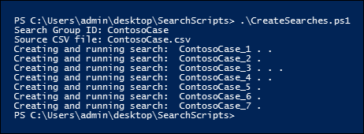

# <a name="create-report-on-and-delete-multiple-content-searches"></a>여러 콘텐츠 검색 만들기, 보고하기 및 삭제

 원본으로 사용 하는 데이터에 대 한 정보를 확인 하 고 검색의 다양성 및 품질을 확인할 때 검색 검색을 빠르게 만들고 보고 하는 것은 eDiscovery 및 조사에서 중요 한 단계입니다. 이를 위해 보안 & 준수 센터 PowerShell은 시간이 오래 걸리는 콘텐츠 검색 작업을 자동화 하기 위한 일련의 cmdlet을 제공 합니다. 이러한 스크립트를 통해 신속 하 고 간편 하 게 다양 한 검색을 만든 다음 해당 데이터의 양을 확인 하는 데 도움이 되는 예상 검색 결과의 보고서를 실행할 수 있습니다. 스크립트를 사용 하 여 각 검색 결과가 생성 되는 결과를 비교할 수도 있습니다. 이러한 스크립트는 데이터를 빠르고 효율적으로 식별 하 고 cull 하는 데 도움이 됩니다. 
  
## <a name="before-you-begin"></a>시작하기 전에

- 이 항목에서 설명 하는 스크립트를 실행 하려면 Security & 준수 센터에서 eDiscovery 관리자 역할 그룹의 구성원 이어야 합니다. 
    
- 1 단계에서 CSV 파일에 추가할 수 있는 조직 내 비즈니스용 OneDrive 사이트의 Url 목록을 수집 하려면 [조직에서 모든 OneDrive 위치 목록 만들기](https://support.office.com/article/Create-a-list-of-all-OneDrive-locations-in-your-organization-8e200cb2-c768-49cb-88ec-53493e8ad80a)를 참조 하십시오. 
    
- 이 항목에서 만드는 모든 파일을 동일한 폴더에 저장 해야 합니다. 이를 통해 스크립트를 보다 쉽게 실행할 수 있습니다.
    
- 스크립트에는 최소 오류 처리가 포함 되어 있습니다. 주요 목적은 여러 콘텐츠 검색을 빠르게 작성, 보고 및 삭제 하는 것입니다.
    
- 이 항목에서 제공된 샘플 스크립트는 Microsoft 표준 지원 프로그램 또는 서비스에서는 지원되지 않습니다. 샘플 스크립트는 어떠한 보증도 없이 "있는 그대로" 제공됩니다. Microsoft는 묵시적인 모든 보증(상품성 또는 특정 목적에의 적합성에 대한 묵시적인 보증을 포함하되 이에 제한되지 않음)을 부인합니다. 샘플 스크립트 및 문서의 사용 또는 수행으로 인해 발생하는 모든 위험은 사용자의 책임입니다. 어떠한 경우에도 Microsoft, 스크립트 작성자 또는 스크립트의 작성, 생산 또는 제공과 관련된 사람은 누구나 샘플 스크립트 또는 문서의 사용 또는 사용 불가능으로 인해 발생하는 모든 손해(수익에 대한 손실, 비즈니스 중단, 비즈니스 정보 손실 또는 기타 금전상의 손실을 포함하되 이에 제한되지 않음)에 대해 책임지지 않습니다. 이는 Microsoft가 이러한 손해가 발생할 가능성에 대해 알고 있었더라고 마찬가지입니다.
    
## <a name="step-1-create-a-csv-file-that-contains-information-about-the-searches-you-want-to-run"></a>1 단계: 실행할 검색에 대 한 정보가 포함 된 CSV 파일 만들기

이 단계에서 만드는 CSV (쉼표로 구분 된 값) 파일에는 검색 하려는 각 사용자에 대 한 행이 포함 됩니다. 사용자의 Exchange Online 사서함 (보관 사서함이 사용 하도록 설정 된 경우 포함) 및 해당 비즈니스용 OneDrive 사이트를 검색할 수 있습니다. 또는 사서함 또는 비즈니스용 OneDrive 사이트를 검색할 수도 있습니다. SharePoint Online 조직의 모든 사이트를 검색할 수도 있습니다. 3 단계에서 실행 하는 스크립트는 CSV 파일의 각 행에 대해 별도의 검색을 만듭니다. 
  
1. 메모장을 사용 하 여 다음 텍스트를 복사한 후 .txt 파일에 붙여 넣습니다. 이 파일을 로컬 컴퓨터의 폴더에 저장 합니다. 다른 스크립트도이 폴더에 저장 합니다.
    
    ```
    ExchangeLocation,SharePointLocation,ContentMatchQuery,StartDate,EndDate
    sarad@contoso.onmicrosoft.com,https://contoso-my.sharepoint.com/personal/sarad_contoso_onmicrosoft_com,(lawsuit OR legal),1/1/2000,12/31/2005
    sarad@contoso.onmicrosoft.com,https://contoso-my.sharepoint.com/personal/sarad_contoso_onmicrosoft_com,(lawsuit OR legal),1/1/2006,12/31/2010
    sarad@contoso.onmicrosoft.com,https://contoso-my.sharepoint.com/personal/sarad_contoso_onmicrosoft_com,(lawsuit OR legal),1/1/2011,3/21/2016
    ,https://contoso.sharepoint.com/sites/contoso,,,3/21/2016
    ,https://contoso-my.sharepoint.com/personal/davidl_contoso_onmicrosoft_com,,1/1/2015,
    ,https://contoso-my.sharepoint.com/personal/janets_contoso_onmicrosoft_com,,1/1/2015,
    ```

    파일의 첫 번째 행 또는 머리글 행에는 새 콘텐츠 검색을 만들기 위해 **ComplianceSearch** cmdlet (3 단계의 스크립트)에서 사용 하는 매개 변수가 나열 됩니다. 각 매개 변수 이름은 쉼표로 구분됩니다. 머리글 행에 공백이 없는지 확인 합니다. 머리글 행 아래의 각 행은 각 검색에 대 한 매개 변수 값을 나타냅니다. CSV 파일의 자리 표시자 데이터를 실제 데이터로 바꿔야 합니다. 
    
2. Excel에서 .txt 파일을 열고 다음 표의 정보를 사용 하 여 각 검색에 대 한 정보로 파일을 편집 합니다. 
    
    |**매개 변수**|**설명**|
    |:-----|:-----|
    | `ExchangeLocation` <br/> |사용자 사서함의 SMTP 주소입니다.  <br/> |
    | `SharePointLocation` <br/> |사용자의 비즈니스용 OneDrive 사이트 URL 또는 조직의 모든 사이트에 대 한 URL입니다. 비즈니스용 OneDrive 사이트의 URL에 대해 다음 ` https://<your organization>-my.sharepoint.com/personal/<user alias>_<your organization>_onmicrosoft_com `형식을 사용 합니다. 예:  `https://contoso-my.sharepoint.com/personal/sarad_contoso_onmicrosoft_com`.  <br/> |
    | `ContentMatchQuery` <br/> |검색에 대 한 검색 쿼리 검색 쿼리를 만드는 방법에 대 한 자세한 내용은 [키워드 쿼리 및 검색 조건을](keyword-queries-and-search-conditions.md)참조 하십시오.  <br/> |
    | `StartDate` <br/> |전자 메일의 경우 받는 사람이 또는 메시지를 받은 날짜나 보낸 사람이 보낸 날짜입니다. SharePoint 또는 비즈니스용 OneDrive 사이트에 대 한 문서에는 문서를 마지막으로 수정한 날짜 또는 그 이후의 날짜가 수정 되었습니다.  <br/> |
    | `EndDate` <br/> |전자 메일의 경우 사용자가 보낸 메시지를 보내거나 받은 날짜입니다. SharePoint 또는 비즈니스용 OneDrive 사이트에 대 한 문서는 마지막으로 문서를 수정한 날짜 또는 그 전에 발생 합니다.  <br/> |
   
3. Excel 파일을 로컬 컴퓨터의 폴더에 CSV 파일로 저장 합니다. 3 단계에서 만든 스크립트는이 CSV 파일의 정보를 사용 하 여 검색을 만듭니다. 
  
## <a name="step-2-connect-to-security--compliance-center-powershell"></a>2 단계: 보안 & 준수 센터 PowerShell에 연결

다음 단계는 조직의 보안 & 준수 센터 PowerShell에 연결 하는 것입니다.
  
1. 파일 이름 접미사. p s 1을 사용 하 여 Windows PowerShell 스크립트 파일에 다음 텍스트를 저장 합니다. 예를 `ConnectSCC.ps1`들면입니다. CSV 파일을 저장 한 폴더와 동일한 파일을 1 단계에서 저장 합니다.
    
    ```
    # Get login credentials 
    $UserCredential = Get-Credential 
    $Session = New-PSSession -ConfigurationName Microsoft.Exchange -ConnectionUri https://ps.compliance.protection.outlook.com/powershell-liveid -Credential $UserCredential -Authentication Basic -AllowRedirection 
    Import-PSSession $Session -AllowClobber -DisableNameChecking 
    $Host.UI.RawUI.WindowTitle = $UserCredential.UserName + " (Security & Compliance Center)" 
    ```

2. 로컬 컴퓨터에서 Windows PowerShell을 열고, 이전 단계에서 만든 스크립트가 있는 폴더로 이동한 다음 스크립트를 실행 합니다. 예를 들어:
    
    ```
    .\ConnectSCC.ps1
    ```
  
## <a name="step-3-run-the-script-to-create-and-start-the-searches"></a>3 단계: 스크립트를 실행 하 여 검색 만들기 및 시작

이 단계의 스크립트에서는 1 단계에서 만든 CSV 파일의 각 행에 대해 별도의 콘텐츠 검색을 만듭니다. 이 스크립트를 실행 하면 다음 두 가지 값을 입력 하 라는 메시지가 표시 됩니다.
  
- **검색 그룹 ID** -이 이름은 CSV 파일에서 만든 검색을 쉽게 구성 하는 방법을 제공 합니다. 만들어진 각 검색은 검색 그룹 ID를 사용 하 여 이름이 지정 되 고 검색 이름에 숫자가 추가 됩니다. 예를 들어 검색 그룹 ID에 대해 **ContosoCase** 를 입력 하면 **ContosoCase_1**, **ContosoCase_2**, **ContosoCase_3**등의 검색 이름이 됩니다. 입력 하는 이름은 대/소문자를 구분 합니다. 4 단계와 5 단계에서 검색 그룹 ID를 사용 하는 경우에는이를 만들 때와 동일한 대/소문자를 함께 사용 해야 합니다. 
    
- **CSV file** -1 단계에서 만든 CSV 파일의 이름입니다. 전체 파일 이름 사용을 포함 하 고 .csv 파일 확장명을 포함 해야 합니다. 예를 `ContosoCase.csv`들면입니다.
    
스크립트를 실행하려면

1. 파일 이름 접미사. p s 1을 사용 하 여 Windows PowerShell 스크립트 파일에 다음 텍스트를 저장 합니다. 예를 `CreateSearches.ps1`들면입니다. 다른 파일을 저장 한 동일한 폴더에 파일을 저장 합니다.
    
  ```Powershell
  # Get the Search Group ID and the location of the CSV input file
  $searchGroup = Read-Host 'Search Group ID'
  $csvFile = Read-Host 'Source CSV file'
    
  # Do a quick check to make sure our group name will not collide with other searches
  $searchCounter = 1
  import-csv $csvFile |
    ForEach-Object{
    
    $searchName = $searchGroup +'_' + $searchCounter
    $search = Get-ComplianceSearch $searchName -EA SilentlyContinue
    if ($search)
    {
        Write-Error "The Search Group ID conflicts with existing searches.  Please choose a search group name and restart the script."
        return
    }
    $searchCounter++
  }
    
  $searchCounter = 1
  import-csv $csvFile |
    ForEach-Object{
    
    # Create the query
    $query = $_.ContentMatchQuery
    if(($_.StartDate -or $_.EndDate))
    {
          # Add the appropriate date restrictions.  NOTE: Using the Date condition property here because it works across Exchange, SharePoint, and OneDrive for Business.
          # For Exchange, the Date condition property maps to the Sent and Received dates; for SharePoint and OneDrive for Business, it maps to Created and Modified dates.
          if($query)
          {
              $query += " AND"
          }
          $query += " ("
          if($_.StartDate)
          {
              $query += "Date >= " + $_.StartDate
          }
          if($_.EndDate)
          {
              if($_.StartDate)
              {
                  $query += " AND "
              }
              $query += "Date <= " + $_.EndDate
          }
          $query += ")"
    }
      
      # -ExchangeLocation can't be set to an empty string, set to null if there's no location.
      $exchangeLocation = $null
      if ( $_.ExchangeLocation)
      {
           $exchangeLocation = $_.ExchangeLocation
      }
    
    # Create and run the search        
    $searchName = $searchGroup +'_' + $searchCounter
    Write-Host "Creating and running search: " $searchName -NoNewline
    $search = New-ComplianceSearch -Name $searchName -ExchangeLocation $exchangeLocation -SharePointLocation $_.SharePointLocation -ContentMatchQuery $query
    
    # Start and wait for each search to complete
    Start-ComplianceSearch $search.Name
    while ((Get-ComplianceSearch $search.Name).Status -ne "Completed")
    {
        Write-Host " ." -NoNewline
        Start-Sleep -s 3
    }
    Write-Host ""
    
    $searchCounter++
  }
  ```

2. Windows PowerShell에서 이전 단계에서 스크립트를 저장 한 폴더로 이동한 후 스크립트를 실행 합니다. 예를 들어:
    
    ```Powershell
    .\CreateSearches.ps1
    ```

3. **검색 그룹 ID** 프롬프트에 검색 그룹 이름을 입력 하 고 enter 키를 누릅니다. **** 예를 `ContosoCase`들면입니다. 이 이름은 대/소문자를 구분 하므로 이후 단계에서 동일한 방식으로 입력 해야 합니다.
    
4. **원본 csv 파일** 프롬프트에 .csv 파일 확장명을 포함 하 여 csv 파일의 이름을 입력 합니다. 예를 `ContosoCase.csv`들면입니다.
    
5. Enter **** 키를 눌러 스크립트를 계속 실행 합니다. 
    
    이 스크립트는 검색 만들기 및 실행 진행률을 표시 합니다. 스크립트가 완료 되 면 프롬프트로 돌아옵니다. 
    
    
  
## <a name="step-4-run-the-script-to-report-the-search-estimates"></a>4 단계: 스크립트를 실행 하 여 검색 예측 보고

검색을 만든 후에는 3 단계에서 만든 각 검색의 검색 적중 횟수에 대 한 간단한 보고서를 표시 하는 스크립트를 실행 합니다. 보고서에는 각 검색의 결과 크기와 모든 검색의 총 방문 횟수 및 전체 크기가 포함 됩니다. 보고 스크립트를 실행 하면 검색 그룹 ID와 csv 파일에 보고서를 저장 하려는 경우 CSV 파일 이름을 입력 하 라는 메시지가 표시 됩니다.
  
1. 파일 이름 접미사. p s 1을 사용 하 여 Windows PowerShell 스크립트 파일에 다음 텍스트를 저장 합니다. 예를 `SearchReport.ps1`들면입니다. 다른 파일을 저장 한 동일한 폴더에 파일을 저장 합니다.
    
  ```Powershell
  $searchGroup = Read-Host 'Search Group ID'
  $outputFile = Read-Host 'Enter a file name or file path to save the report to a .csv file. Leave blank to only display the report'
  $searches = Get-ComplianceSearch | ?{$_.Name -clike $searchGroup + "_*"}
  $allSearchStats = @()
  foreach ($partialObj in $searches)
  {
      $search = Get-ComplianceSearch $partialObj.Name
      $sizeMB = [System.Math]::Round($search.Size / 1MB, 2)
      $searchStatus = $search.Status
      if($search.Errors)
      {
          $searchStatus = "Failed"
      }elseif($search.NumFailedSources -gt 0)
      {
          $searchStatus = "Failed Sources"
      }
      $searchStats = New-Object PSObject
      Add-Member -InputObject $searchStats -MemberType NoteProperty -Name Name -Value $search.Name
      Add-Member -InputObject $searchStats -MemberType NoteProperty -Name ContentMatchQuery -Value $search.ContentMatchQuery
      Add-Member -InputObject $searchStats -MemberType NoteProperty -Name Status -Value $searchStatus
      Add-Member -InputObject $searchStats -MemberType NoteProperty -Name Items -Value $search.Items
      Add-Member -InputObject $searchStats -MemberType NoteProperty -Name "Size" -Value $search.Size
      Add-Member -InputObject $searchStats -MemberType NoteProperty -Name "Size(MB)" -Value $sizeMB
      $allSearchStats += $searchStats
  }
  # Calculate the totals
  $allItems = ($allSearchStats | Measure-Object Items -Sum).Sum
  # Convert the total size to MB and round to the nearst 100th
  $allSize = ($allSearchStats | Measure-Object 'Size' -Sum).Sum
  $allSizeMB = [System.Math]::Round($allSize  / 1MB, 2)
  # Get the total successful searches and total of all searches
  $allSuccessCount = ($allSearchStats |?{$_.Status -eq "Completed"}).Count
  $allCount = $allSearchStats.Count
  $allStatus = [string]$allSuccessCount + " of " + [string]$allCount
  # Totals Row
  $totalSearchStats = New-Object PSObject
  Add-Member -InputObject $totalSearchStats -MemberType NoteProperty -Name Name -Value "Total"
  Add-Member -InputObject $totalSearchStats -MemberType NoteProperty -Name Status -Value $allStatus
  Add-Member -InputObject $totalSearchStats -MemberType NoteProperty -Name Items -Value $allItems
  Add-Member -InputObject $totalSearchStats -MemberType NoteProperty -Name "Size(MB)" -Value $allSizeMB
  $allSearchStats += $totalSearchStats
  # Just get the columns we're interested in showing
  $allSearchStatsPrime = $allSearchStats | Select-Object Name, Status, Items, "Size(MB)", ContentMatchQuery
  # Print the results to the screen
  $allSearchStatsPrime |ft -AutoSize -Wrap
  # Save the results to a CSV file
  if ($outputFile)
  {
      $allSearchStatsPrime | Export-Csv -Path $outputFile -NoTypeInformation
  }
  ```

2. Windows PowerShell에서 이전 단계에서 스크립트를 저장 한 폴더로 이동한 후 스크립트를 실행 합니다. 예를 들어:
    
    ```Powershell
    .\SearchReport.ps1
    ```

3. **검색 그룹 ID** 프롬프트에 검색 그룹 이름을 입력 하 고 enter 키를 누릅니다. **** 예를 `ContosoCase`들어 이 이름은 대/소문자를 구분 하므로 3 단계에서 스크립트를 실행할 때와 동일한 방식으로 입력 해야 합니다.
    
4. 보고서를 **csv 파일에 저장 하는 파일 경로 (보고서를 표시 하는 경우에는 비워 둠)** 를 선택 하 고 보고서를 csv 파일에 저장 하려면 전체 파일 이름 경로 (.csv 파일 확장명 포함)의 파일 이름을 입력 합니다. .csv 파일 확장명을 포함 한 CSV 파일의 이름입니다. 예를 `ContosoCaseReport.csv` 들어 현재 디렉터리에 파일을 저장 하거나 다른 폴더에 저장 하도록 입력할 수 `C:\Users\admin\OneDrive for Business\ContosoCase\ContosoCaseReport.csv` 있습니다. 또한 메시지를 비워 두면 보고서를 표시 하지만 파일에 저장 하지는 않습니다. 
    
5. **Enter** 키를 누릅니다.
    
    이 스크립트는 검색 만들기 및 실행 진행률을 표시 합니다. 스크립트가 완료 되 면 보고서가 표시 됩니다. 
    
    
  
> [!NOTE]
> 같은 사서함 이나 사이트가 검색 그룹에서 둘 이상의 검색에서 콘텐츠 위치로 지정 된 경우 보고서의 총 결과 (항목 수와 총 크기 모두)가 같은 항목에 대 한 결과를 포함할 수 있습니다. 이는 검색 그룹의 서로 다른 검색에 대 한 쿼리와 일치 하는 경우 동일한 전자 메일 메시지나 문서가 두 번 이상 계산 되기 때문입니다. 
  
## <a name="step-5-run-the-script-to-delete-the-searches"></a>5 단계: 스크립트를 실행 하 여 검색 삭제

검색을 많이 만들 수도 있으므로이 마지막 스크립트를 사용 하면 3 단계에서 만든 검색을 쉽게 삭제할 수 있습니다. 다른 스크립트와 마찬가지로이 방법 에서도 검색 그룹 ID를 입력 하 라는 메시지를 표시 합니다. 이 스크립트를 실행 하면 검색 이름에 검색 그룹 ID가 있는 모든 검색은 삭제 됩니다. 
  
1. 파일 이름 접미사. p s 1을 사용 하 여 Windows PowerShell 스크립트 파일에 다음 텍스트를 저장 합니다. 예를 `DeleteSearches.ps1`들면입니다. 다른 파일을 저장 한 동일한 폴더에 파일을 저장 합니다.
    
  ```Powershell
  # Delete all searches in a search group
  $searchGroup = Read-Host 'Search Group ID'
  Get-ComplianceSearch |
      ForEach-Object{
      # If the name matches the search group name pattern (case sensitive), delete the search
      if ($_.Name -cmatch $searchGroup + "_\d+")
      {
          Write-Host "Deleting search: " $_.Name
          Remove-ComplianceSearch $_.Name -Confirm:$false
      }
  }
  ```

2. Windows PowerShell에서 이전 단계에서 스크립트를 저장 한 폴더로 이동한 후 스크립트를 실행 합니다. 예를 들어:
    
    ```Powershell
    .\DeleteSearches.ps1
    ```

3. **검색 그룹 ID** 프롬프트에 삭제할 검색의 검색 그룹 이름을 입력 한 다음 enter 키를 누릅니다. **** 예를 `ContosoCase`들면입니다. 이 이름은 대/소문자를 구분 하므로 3 단계에서 스크립트를 실행할 때와 동일한 방식으로 입력 해야 합니다.
    
    스크립트에는 삭제 된 각 검색의 이름이 표시 됩니다.
    
    
