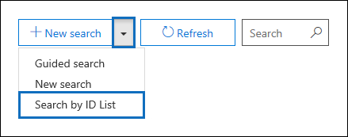

# Office 365에서 ID 목록 콘텐츠 검색에 대 한 CSV 파일 준비Prepare a CSV file for an ID list Content Search in Office 365

Exchange id 목록을 사용 하 여 특정 사서함 전자 메일 메시지 및 기타 사서함 항목을 검색할 수 있습니다.You can search for specific mailbox email messages and other mailbox items using a list of Exchange IDs. ID 목록 검색을 만들려면 검색할 특정 사서함 항목을 식별 하는 CSV (쉼표로 구분 된 값) 파일을 전송 합니다.To create an ID list search (formally called a targeted search), you submit a comma separated value (CSV) file that identifies the specific mailbox items to search for. 이 CSV 파일의 경우에는 **결과 .csv** 파일 또는 콘텐츠 검색 결과를 내보내거나 기존 콘텐츠 검색에서 콘텐츠 검색 보고서를 내보낼 때 포함 되는 **인덱싱되지 않은 항목 .csv** 파일을 사용 합니다.For this CSV file you use the **Results.csv** file or the **Unindexed Items.csv** file that are included when you export the Content Search results or export a Content Search report from and existing Content Search. 그런 다음 이러한 파일 중 하나를 편집 하 여 검색할 특정 항목을 표시 한 다음 새 ID 목록 검색을 만들고 CSV 파일을 제출 합니다.Then you edit one of these files to indicate the specific items to search for, and then create a new ID list search and submit the CSV file. 
  
ID 목록 검색을 만드는 프로세스에 대 한 간략 한 개요는 다음과 같습니다.Here's a quick overview of the process for creating an ID list search.
  
1. Security & 준수 센터에서 새 또는 guided Content Search를 만들고 실행 합니다.Create and run a new or guided Content Search in the Security & Compliance Center.
    
2. 콘텐츠 검색 결과를 내보내거나 콘텐츠 검색 보고서를 내보냅니다.Export the content search results or export the content search report. 자세한 내용은 다음을 참조하세요.For more information, see:
    
    - [콘텐츠 검색 결과 내보내기Export Content Search results](export-search-results.md)
    
    - [콘텐츠 검색 보고서 내보내기Export a Content Search report](export-a-content-search-report.md)
    
3. **결과 .csv** 파일 또는 **인덱싱되지 않은 항목 .csv** 를 편집 하 고 ID 목록 검색에 포함할 특정 사서함 항목을 식별 합니다.Edit the **Results.csv** file or the **Unindexed Items.csv** and identify the specific mailbox items that you want to include in the ID list search. ID 목록 검색에 대 한 CSV 파일을 준비 하는 방법에 대 한 [지침](#prepare-the-csv-file-for-an-id-list-search) 을 참조 하세요.See the [instructions](#prepare-the-csv-file-for-an-id-list-search) for preparing a CSV file for an ID list search. 
    
4. 새 ID 목록 검색 ( [지침](#create-an-id-list-search)참조)을 만들고 준비한 CSV 파일을 제출 합니다.Create a new ID list search (see the [instructions](#create-an-id-list-search)) and submit the CSV file that you prepared. 만들어진 검색 쿼리는 CSV 파일에서 선택한 항목만 검색 합니다.The search query that's created will only search for the items selected in the CSV file.
    
> [!NOTE]
> ID 목록 검색은 사서함 항목에 대해서만 지원 됩니다.ID list searches are only supported for mailbox items. ID 목록 검색에서는 SharePoint 및 OneDrive 문서를 검색할 수 없습니다.You can't search for SharePoint and OneDrive documents in an ID list search. 
  
 **ID 목록 검색을 만드는 이유****Why create an ID list search?** **결과 .csv** 파일의 메타 데이터를 기반으로 항목이 eDiscovery 요청에 응답 하는지 여부를 확인할 수 없는 경우 ID 목록 검색을 \*\*\*\* 사용 하 여 해당 항목을 찾아서 미리 본 다음 내보내서 조사 중인 사례에 응답 합니다.If you're unable to determine if an item is responsive to an eDiscovery request based on the metadata in the **Results.csv** or **Unindexed Items.csv** files, you can use an ID list search to find, preview, and then export that item to determine if it's responsive to the case you're investigating. ID 목록 검색은 일반적으로 인덱싱되지 않은 특정 항목 집합을 검색 하 고 반환 하는 데 사용 됩니다.ID list searches are typically used to search for and return a specific set of unindexed items. 
  
## ID 목록 검색을 위해 CSV 파일 준비Prepare the CSV file for an ID list search

콘텐츠 검색에 대 한 검색 결과 또는 보고서를 내보낸 후에는 다음 단계를 수행 하 여 ID 목록 검색에 대 한 CSV 파일을 준비할 수 있습니다.After you export the search results or report for a content search, you can perform the following steps to prepare the CSV file for an ID list search. 이 CSV 파일은 ID 목록 검색의 모든 항목을 식별 합니다.This CSV file will identify every item in the ID list search.
  
SharePoint 사이트 및 OneDrive 계정을 포함 하는 검색에서 CSV 파일을 사용할 수는 있지만 ID 목록 검색에 대 한 \*\* 사서함 항목만 선택할 수 있습니다.Note that you can use a CSV file from a search that included SharePoint sites and OneDrive accounts, but you can select  *only*  mailbox items for an ID list search. SharePoint 또는 OneDrive에서 문서를 선택 하면 ID 목록 검색을 만들 때 CSV 파일의 유효성 검사에 실패 합니다.If you select a document in SharePoint or OneDrive, the CSV file will fail validation when you create an ID list search. 
  
1. Excel에서 **.csv** 또는 인덱싱되지 않은 **항목 .csv** 파일을 엽니다.Open the **Results.csv** or **Unindexed Items.csv** file in Excel. 
    
2. 새 열을 삽입 하 고 **선택한 이름을 선택**합니다.Insert a new column and name it **Selected**. 열을 삽입 하는 위치는 중요 하지 않습니다.It doesn't matter where you insert the column. 편리 하 게 사용할 수 있도록 첫 번째 열의 왼쪽에 삽입 하는 것이 좋습니다.For convenience, consider inserting it to the left of the first column.
    
3. **선택** 된 열에서 검색 하려는 항목에 해당 하는 셀에 **예** 를 입력 합니다.In the **Selected** column, type **Yes** in the cell that corresponds to the item that you want to search for. 검색 하려는 모든 항목에 대해이 단계를 반복 합니다.Repeat this step for every item that you want to search for. 
    
    > [!IMPORTANT]
    > Excel에서 CSV 파일을 열면 **문서 ID** 열에 대 한 데이터 형식이 **일반**으로 변경 됩니다.When you open the CSV file in Excel, the data format for the **Document ID** column is changed to **General**. 이로 인해 항목의 문서 ID가 공학용 표기법으로 표시 됩니다.This results in displaying the document ID for an item in scientific notation. 예를 들어 문서 id가 "481037338205" 인 "4.81037 e + 11"로 표시 되는 경우에는 다음 단계를 수행 하 여 문서 id 열의 데이터 \*\*\*\* 형식을 **번호로** 변경 하 여 문서 id의 올바른 형식을 복원 해야 합니다.For example, the document ID of "481037338205" is displayed as "4.81037E+11" You have to perform the next steps to change the data format of the **Document ID** column to **Number** to restore the correct format for the document ID. 이 작업을 수행 하지 않으면 CSV 파일을 사용 하는 ID 목록 검색이 실패 합니다.If you don't do this, the ID list search that uses the CSV file will fail. 
  
4. 전체 **문서 ID** 열을 마우스 오른쪽 단추로 클릭 하 고 **셀 서식을**선택 합니다.Right-click the entire **Document ID** column and select **Format Cells**.
    
5. **범주** 상자에서 **숫자**를 클릭 합니다.In the **Category** box, click **Number**.
    
6. 소수 자릿수를 **0**으로 변경 하 고 **확인** 을 클릭 하 여 변경 내용을 저장 합니다.Change the number of decimal places to **0**, and then click **OK** to save your changes. 문서 ID 열의 값이 번호로 변경 됩니다.Notice that the values in the Document ID column are changed to numbers. 
    
    다음은 ID 목록 콘텐츠 검색을 위해 제출할 준비가 된 CSV 파일의 예입니다.Here's an example of the a CSV file that's ready to be submitted for a ID list content search.
    
    
  
7. CSV 파일을 저장 하거나 다른 \*\*\*\* 이름으로 저장을 사용 하 여 파일을 저장 합니다.Save the CSV file or use **Save As** to the save the file with different file name. 두 경우 모두 CSV 형식으로 파일을 저장 해야 합니다.In both cases, be sure to save the file with the CSV format. 
  
## ID 목록 검색 만들기Create an ID list search

다음 단계에서는 새 ID 목록 콘텐츠 검색을 만들고 이전 단계에서 준비한 CSV 파일을 제출 합니다.The next step is to create a new ID list Content Search and submit the CSV file that you prepared in the previous step.
  
> [!IMPORTANT]
> 콘텐츠 검색에서 결과 또는 보고서를 내보낸 후 2 일 이내에 ID 목록 검색을 만들어야 합니다.You should create an ID list search no more than 2 days after exporting the results or report from a Content Search. 검색 결과 또는 보고서가 2 일 보다 많이 내보내진 경우 검색 결과 또는 보고서를 다시 내보내 업데이트 된 CSV 파일을 생성 해야 합니다.If the search results or report where exported more than 2 days ago, you should re-export the search results or report to generate updated CSV files. 그런 다음 업데이트 된 CSV 파일 중 하나를 준비 하 여 ID 목록 검색을 만드는 데 사용할 수 있습니다.Then you can prepare one of the updated CSV files and use it to create an ID list search. 
  
1. 보안 & 준수 센터에서 **검색** \> **콘텐츠 검색**으로 이동 합니다.In the Security & Compliance Center, go to **Search** \> **Content search**.
    
2. **검색** 페이지에서 아이콘  **새로 만들기**옆에 있는 화살표를 클릭 한 다음 **ID 목록으로 검색**을 클릭 합니다.On the **Search** page, click the arrow next to  **New search**, and then click **Search by ID List**.
    
    
  
3. ID 목록 플라이 아웃을 **사용한 검색** 에서 검색 이름을 지정한 다음 선택적으로 설명 하 고, **찾아보기를** 클릭 하 고 이전 단계에서 준비한 CSV 파일을 선택 합니다.On the **Search by ID List** flyout, name the search (and optionally describe it) and then click **Browse** and select the CSV file that you prepared in the previous step. 
    
    Office 365에서 CSV 파일의 유효성을 검사 하려고 합니다.Office 365 attempts to validate the CSV file. 유효성 검사가 실패 하면 유효성 검사 오류를 해결 하는 데 도움이 될 수 있는 오류 메시지가 표시 됩니다.If the validation is unsuccessful, an error message is displayed that might help you troubleshoot the validation errors. ID 목록 검색을 만들려면 CSV 파일의 유효성을 검사 해야 합니다.The CSV file has to be successfully validated to create an ID list search.
    
4. CSV 파일의 유효성 검사가 완료 되 면 **검색** 을 클릭 하 여 ID 목록 검색을 만듭니다.After the CSV file is successfully validated, click **Search** to create the ID list search. 
    
    다음은 예상 검색 결과 및 ID 목록 검색에 대해 생성 되는 쿼리의 예입니다.Here's an example of the estimated search results and the query that's generated for an ID list search.
    
    
  
    ID 검색의 통계에 표시 되는 예상 항목 수는 CSV 파일에서 선택한 항목 수와 일치 해야 합니다.Note that the number of estimated items displayed in statistics for the ID search should match the number of items that you selected in the CSV file.
    
5. ID 목록 검색에서 반환 되는 항목을 미리 보거나 내보냅니다.Preview or export the items returned by the ID list search.
    
> [!NOTE]
> ID 목록 검색을 만든 후 사서함을 이동 하면 검색에 대 한 쿼리는 지정 된 항목을 반환 하지 않습니다.If you move a mailbox after creating an ID list search, the query for the search won't return the specified items. 사서함 항목에 대 한 **DocumentId** 속성은 사서함을 이동할 때 변경 되기 때문입니다.That's because the **DocumentId** property for mailbox items are changed when a mailbox is moved. 사용자가 ID 목록 검색을 만든 후 사서함이 이동 되는 경우는 드물지만 새 콘텐츠 검색을 만들거나 기존 콘텐츠 검색에 대 한 검색 결과를 업데이트 한 다음 검색 결과 또는 보고서를 내보내 사용할 수 있는 업데이트 된 CSV 파일을 생성 해야 합니다.  새 ID 목록 검색을 만들 수 있습니다.In the rare instance when a mailbox is moved after you create an ID list search, you should create a new content search (or update the search results for the existing content search) and then export the search results or report to generate updated CSV files that can be used to create a new ID list search. 
