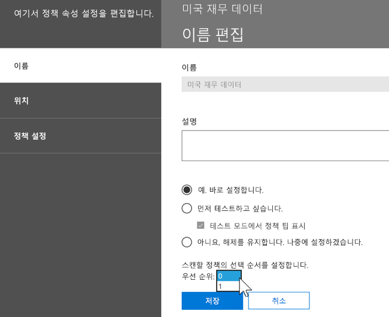
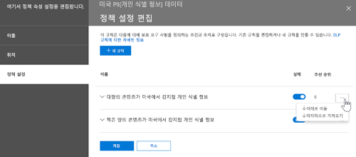

# 데이터 손실 방지 개요
<!-- this topic needs to be split into smaller, more coherent ones. It is confusing as it is. -->
> [!NOTE]
> 데이터 손실 방지 기능은 최근 Office 365 Advanced Compliance 라이선스 사용자에 대한 Microsoft Teams 채팅 및 채널 메시지에 추가되었으며, 이는 독립 실행형 옵션으로 제공되며 Office 365 E5 및 Microsoft 365 E5 규정 준수에 포함되어 있습니다. 라이선스 요구 사항에 대한 자세한 내용은 [Microsoft 365 테넌트 수준 서비스 라이선스 지침](https://docs.microsoft.com/office365/servicedescriptions/microsoft-365-service-descriptions/microsoft-365-tenantlevel-services-licensing-guidance)을 참고하십시오.

비즈니스 표준 및 산업 규정을 준수하려면 조직은 중요한 정보를 보호하고 부주의한 정보 공개를 방지해야 합니다. 중요한 정보에는 금융 데이터나 신용 카드 번호, 주민 등록 번호, 의료 기록과 같은 PII(개인 식별 정보)가 있습니다. Office 365 보안 &amp; 준수 센터의 DLP(데이터 손실 방지) 정책을 사용하여 Office 365 전체의 중요한 정보를 식별하고, 모니터링하고, 자동으로 보호할 수 있습니다.
  
DLP 정책을 사용하여 다음과 같은 작업을 수행할 수 있습니다:
  
- **Exchange Online, SharePoint Online, 비즈니스용 OneDrive 및 Microsoft Teams와 같은 다양한 위치에서 중요한 정보를 식별합니다.**
    
    예를 들어 비즈니스용 OneDrive 사이트에 저장되어 있는 신용 카드 번호가 포함된 모든 문서를 식별하거나 특정 사용자의 OneDrive 사이트를 모니터링할 수 있습니다.
    
- **중요한 정보의 우발적인 공유를 방지합니다. ** 
    
    예를 들어, 조직 외부의 사용자와 공유된 상태 레코드를 포함한 모든 문서 및 전자메일을 식별할 수 있습니다. 그 후에 자동으로 문서의 액세스를 차단하거나 전자메일이 발송되는 것을 차단할 수 있습니다.
    
- **데스크톱 버전의 Excel, PowerPoint 및 Word에서 중요한 정보를 모니터링하고 보호합니다.**
    
    Exchange Online, SharePoint Online 및 비즈니스용 OneDrive에서와 마찬가지로 해당 Office 데스크톱 프로그램에는 중요한 정보를 식별하고 DLP 정책을 적용하기 위해 동일한 기능이 제공되어 있습니다. DLP는 사용자가 해당 Office 프로그램에서 콘텐츠를 공유하는 경우 지속적인 모니터링을 제공합니다.
    
- **사용자가 자신의 작업흐름을 중단하지 않고 규정 준수 상태를 유지하도록 하는 방법을 안내합니다.**
    
    사용자에게 DLP 정책에 대해 교육하고 자신의 작업을 중단하지 않고 규정 준수 상태를 유지하도록 할 수 있습니다. 예를 들어 사용자가 중요한 정보를 포함하는 문서를 공유하려고 하면 DLP 정책은 전자 메일 알림을 보내고, 업무 정당성이 있을 경우 이 정책을 재정의할 수 있는 문서 라이브러리의 컨텍스트에서 정책 팁을 표시합니다. 웹 상의 Outlook, Outlook, Excel, PowerPoint 및 Word에도 동일한 정책 팁이 나타납니다.
    
- **조직의 DLP 정책과 일치하는 콘텐츠를 표시하는 DLP 보고서를 확인하십시오.**
    
    조직이 DLP 정책을 어떻게 준수하고 있는지를 평가하기 위해 시간에 따른 각 정책 및 규칙의 일치 횟수를 확인할 수 있습니다. DLP 정책에서 사용자가 정책 팁을 재정의하고 가양성을 보고할 수 있도록 허용하는 경우, 사용자가 보고한 항목을 확인할 수 있습니다.
    
Office 365 보안 &amp; 준수 센터의 데이터 손실 방지 페이지에서 DLP 정책을 생성하고 관리할 수 있습니다.
  

  
## DLP 정책에 포함된 내용

DLP 정책에는 다음과 같은 몇 가지 기본적인 사항이 포함됩니다.
  
- 콘텐츠를 보호할 위치: Microsoft Teams 채팅 및 채널 메시지 뿐만 아니라 Exchange Online, SharePoint Online 및 비즈니스 용 OneDrive 사이트와 같은 **위치**. 
    
- 다음으로 구성된 **규칙**을 적용하여 콘텐츠를 보호하는 시기 및 방법: 
    
  - **조건** 규칙을 적용하기 전에 내용이 일치해야 합니다. 예를 들어, 조직 외부의 사용자와 공유된 주민 등록 번호를 포함하는 콘텐츠만 찾도록 규칙을 구성할 수 있습니다. 
    
  - 조건에 일치하는 콘텐츠가 발견된 경우 규칙이 자동으로 수행하려는 **작업** 예를 들어 규칙을 문서에 대한 액세스를 차단하도록 구성할 수 있고 사용자와 규정 준수 책임자에게 전자 메일 알림을 보낼 수 있습니다. 
    
규칙을 사용하여 특정 보호 요구 사항을 충족한 다음, DLP 정책을 사용하여 특정 규정을 준수하는 데 필요한 모든 규칙과 같은 일반적인 보호 요구 사항을 그룹화할 수 있습니다.
  
예를 들어 HIPAA(Health Insurance Portability and Accountability Act)가 적용되는 정보의 현재 상태를 확인하는 데 도움이 되는 DLP 정책이 있을 수 있습니다. 해당 DLP 정책은 조직 외부의 사용자와 공유(조건)하는 중요한 정보가 포함된 모든 문서를 찾고 문서에 대한 액세스 차단 및 알림을 전송하여(작업) 모든 SharePoint Online 사이트 및 모든 비즈니스용 OneDrive 사이트(위치)에서 HIPAA 데이터(대상)를 보호하는 데 도움을 줄 수 있습니다. 해당 요구 사항은 개별 규칙으로 저장되며 관리 및 보고를 간소화하기 위해 DLP 정책으로 그룹화 됩니다.
  

  
### 위치

DLP 정책은 정보가 Exchange Online, SharePoint Online, 비즈니스용 OneDrive에 위치하는지 아니면 Microsoft Teams에 위치하는지 여부에 관계없이 Office 365 전체의 중요한 정보를 탐색하고 보호할 수 있습니다. Exchange 전자메일, Microsoft Teams 채팅 및 채널 메시지 그리고 모든 SharePoint 또는 OneDrive 라이브러리의 콘텐츠를 보호하거나 정책의 특정 위치를 선택할 수 있습니다.
  

  
특정 SharePoint 사이트 또는 OneDrive 계정을 포함하거나 제외하도록 선택하는 경우 DLP 정책은 이러한 포함 항목 및 제외 항목을 100개까지 포함할 수 있습니다. 해당 제한 사항에도 불구하고 조직 전체의 정책이나 전체 위치에 적용되는 정책을 적용하여 해당 제한 사항을 극복할 수 있습니다.
  
### 규칙

규칙은 조직의 콘텐츠에 비즈니스 요구사항을 적용한 것입니다. 정책은 하나 이상의 규칙을 포함하고 각 규칙은 조건 및 작업을 구성됩니다. 각 규칙에 대해 조건이 충족되면 작업이 자동으로 수행됩니다. 규칙은 각 정책에서 가장 우선순위가 높은 규칙부터 순차적으로 실행됩니다.
  
또한 규칙은 사용자(정책 팁 및 전자메일 알림 포함) 및 관리자(전자메일 사고 보고서 포함)에게 콘텐츠가 규칙과 일치함을 알리는 옵션을 제공합니다.
  
다음과 같이 규칙의 구성요소 및 각각에 대한 설명이 있습니다.
  

  
#### 조건

조건은 사용자가 찾고 있는 정보의 유형과 수행하는 시기를 결정하므로 중요합니다. 예를 들어 콘텐츠에 10보다 큰 숫자를 포함하지 않고 콘텐츠가 조직 외부의 사용자와 공유되지 않는 경우에는 여권 번호를 포함하는 콘텐츠를 무시하도록 선택할 수 있습니다.
  
조건은 사용자가 찾고 있는 중요한 정보의 유형이 무엇인지와 같은 **콘텐츠**에 중점을 두고 있습니다. 또한 문서를 공유하는 대상이 누구인지와 같은 **컨텍스트**에 중점을 두고 있습니다. 조건을 사용하여 위험 수준마다 다른 작업을 할당할 수 있습니다. 예를 들어 내부적으로 공유하는 중요한 콘텐츠는 조직 외부의 사용자와 공유되는 중요한 콘텐츠 보다 위험성이 더 낮고 더 적은 작업이 필요할 수 있습니다. 
  

  
이제 사용 가능한 조건을 통해 다음 사항의 여부를 확인할 수 있습니다.
  
- 콘텐츠가 중요한 정보 유형을 포함합니다.
    
- 콘텐츠가 레이블을 포함합니다. 더 자세한 내용은 아래의 [DLP 정책에서 레이블을 조건으로 사용하기](#using-a-label-as-a-condition-in-a-dlp-policy) 장을 참고하십시오.
    
- 콘텐츠를 조직 내부 또는 외부 사용자와 공유합니다.
    
#### 중요한 정보 유형

DLP 정책은 **중요한 정보 유형**으로 정의되어 있는 중요한 정보를 보호하는 데 도움을 줄 수 있습니다. Office 365에는 신용 카드 번호, 은행 계좌 번호, 국가 ID 번호 및 여권 번호 등 사용할 준비가 된 여러 다른 영역에 대한 일반적인 여러 중요 정보 유형에 대한 정의가 포함되어 있습니다. 
  

  
DLP 정책이 신용 카드 번호와 같은 중요한 정보 유형을 찾을 때 단순히 16자리 숫자만 찾는 것이 아닙니다. 중요한 각 정보 유형은 다음의 조합을 사용해서 정의되고 검색됩니다.
  
- 키워드
    
- 체크섬 또는 구성의 유효성을 검사하기 위한 내부 함수
    
- 패턴 일치를 찾기 위한 정규식의 평가
    
- 기타 콘텐츠 검사
    
성러한 정책은 사용자 작업을 중단시킬 수 있는 가양성의 수를 줄이는 동시에 DLP 검색 시 높은 수준의 정확도를 얻을 수 있도록 도와줍니다.
  
#### 작업

콘텐츠가 규칙에서 조건과 일치하는 경우 자동으로 콘텐츠를 보호하기 위한 작업을 적용할 수 있습니다.
  

  
현재 사용할 수 있는 작업으로 다음과 같은 작업을 수행할 수 있습니다:
  
- 사이트 콘텐츠에 있어서 **콘텐츠의 액세스를 제한하십시오**. 이는 문서에 대한 사용 권한이 주 사이트 컬렉션 관리자, 문서 소유자 및 문서를 마지막에 수정한 사용자를 제외한 모든 사람들에게 제한되어 있음을 의미합니다. 해당 사용자는 문서에서 중요한 정보를 제거하거나 다른 해결 조치를 취할 수 있습니다. 문서가 규정을 준수하는 경우 원래의 사용 권한은 자동으로 복원됩니다. 문서에 대한 액세스가 차단되면 해당 문서가 사이트 라이브러리에서 특수한 정책 팁 아이콘과 함께 나타납니다. 
    
    
  
    전자 메일 콘텐츠의 경우 이 작업은 메시지가 발송되지 않도록 차단합니다. DLP 규칙이 구성된 방식에 따라 발신자는 NDR 또는 (규칙이 알림을 사용하는 경우) 정책 팁 및/또는 전자 메일 알림을 볼 수 있습니다.
    
    
  
#### 사용자 알림 및 사용자 재정의

알림 및 재정의를 사용하여 사용자에 DLP 정책에 대해 교육하고 작업을 차단하지 않고도 규정을 준수할 수 있도록 지원할 수 있습니다. 예를 들어 사용자가 중요한 정보를 포함하는 문서를 공유하려고 하면 DLP 정책은 전자 메일 알림을 보내고, 업무 정당성이 있을 경우 이 정책을 재정의할 수 있는 문서 라이브러리의 컨텍스트에서 정책 팁을 표시합니다.
  

  
전자 메일의 경우 콘텐츠를 발송한 사람. 공유한 사람 또는 마지막으로 수정한 사람을 알릴 수 있으며, 사이트 콘텐츠의 경우 주 사이트 컬렉션 관리자 및 문서 소유자를 알릴 수 있습니다. 또한 전자 메일 알림에서 원하는 사람을 추가하거나 제거할 수 있습니다.
  
전자 메일 알림을 발송하는 것 외에도 사용자 알림에는 다음과 같은 정책 팁이 표시됩니다:
  
- Outlook 및 웹 상의 Outlook
    
- SharePoint Online 또는 비즈니스용 OneDrive 사이트에 대한 문서의 경우입니다.
    
- Excel, PowerPoint 및 Word에서 DLP 정책에 포함된 사이트에 문서가 저장되는 경우입니다.
    
전자 메일 알림 및 정책 팁은 콘텐츠가 DLP 정책과 충돌하는 이유를 설명합니다. 해당 항목을 선택하면 전자 메일 알림 및 정책 팁은 가양성을 보고하거나 업무 정당성을 제공하여 사용자가 규칙을 재정의할 수 있도록 합니다. 이를 통해 사용자에게 DLP 정책을 교육하고, 사람들이 해당 작업을 수행하지 못하도록 하는 방식으로 정책을 적용할 수 있습니다. 재정의 및 가양성에 대한 정보는 보고를 위해 기록되고(DLP 보고서에 대해서는 아래 참조) 사고 보고서(다음 섹션 참조)에 포함되므로 규정 준수 책임자는 정기적으로 이 정보를 검토할 수 있습니다.
  
다음은 비즈니스용 OneDrive 계정에서 보여지는 정책 팁의 예시입니다.
  

  
#### 사고 보고서

규칙이 일치하면 규정 준수 책임자(또는 다른 사용자)에게 사고 보고서와 이벤트에 대한 세부 정보를 보낼 수 있습니다. 이 보고서에는 일치된 항목에 관한 정보, 규칙과 일치한 실제 콘텐츠, 해당 콘텐츠를 마지막으로 수정한 사람이 포함됩니다. 전자 메일 메시지의 경우 보고서에는 DLP 정책과 일치하는 원본 메시지가 첨부 파일로 포함되어 있습니다.
  

  
## 그룹화 및 논리 연산자

일반적으로 DLP 정책에는 미국의 주민등록번호를 포함하는 모든 콘텐츠를 식별하는 것과 같은 간단한 요구사항을 가지고 있습니다. 하지만 다른 시나리오에서는 DLP 정책이 좀 더 느슨하게 정의된 데이터를 식별해야 할 수 있습니다.
  
예를 들어 미국 HIPAA(Health Insurance Portability and Accountability Act)를 적용받는 콘텐츠를 식별하려면 다음과 같은 정보를 찾아야 합니다:
  
- 미국 사회보장번호 또는 DEA(마약단속국) 번호와 같은 특정 유형의 중요한 정보를 포함하는 콘텐츠
    
    그리고
    
- 환자의 병력에 관한 커뮤니케이션 또는 환자에게 제공된 의료 서비스에 대한 설명과 같이 식별하기 더 어려운 콘텐츠 해당 콘텐츠를 식별하려면 국제질병분류(ICD-9-CM 또는 ICD-10-CM)처럼 아주 방대한 키워드 목록에서 일치하는 키워드가 필요합니다.
    
이렇게 느슨하게 정의된 데이터는 그룹화 및 논리 연산자(AND, OR)를 사용하여 쉽게 식별할 수 있습니다. DLP 정책을 만들 때는
  
- 중요한 정보 유형을 그룹화할 수 있습니다.
    
- 그룹에 포함된 중요한 정보 사이에 사용할 논리 연산자와 각 그룹 사이에 사용할 논리 연산자를 선택할 수 있습니다.
    
### 그룹 내의 연산자 선택

그룹 내에서 콘텐츠가 규칙에 일치하려면 해당 그룹의 조건을 모두 충족해야 하는지 또는 하나라도 충족하면 되는지 선택할 수 있습니다.
  

  
### 그룹 추가

그룹을 빠르게 추가할 수 있습니다. 그룹은 자체적인 조건과 연산자를 가질 수 있습니다.
  

  
### 그룹 사이의 연산자 선택

각 그룹 사이에서 콘텐츠가 규칙에 매칭되려면 그룹 하나의 조건만 충족해야 하는지 또는 모든 그룹의 조건을 충족해야 하는지 선택할 수 있습니다.
  
예를 들어 기본 제공되는 **미국 HIPAA** 정책에는 그룹 사이에서 **AND** 연산자를 사용하여 다음과 같은 정보가 포함된 콘텐츠를 식별하는 규칙이 있습니다. 
  
- 그룹 **PII 식별자**에서(하나 이상의 SSN 번호 **또는** DEA 번호) 
    
    **AND**
    
- 그룹 **의료 조건**에서(하나 이상의 ICD-9-CM 키워드 **또는** ICD-10-CM 키워드) 
    

  
## 규칙이 처리되는 우선 순위

정책의 규칙을 만들 때는 각 규칙에 만들어진 순서대로 우선 순위가 할당됩니다. 즉, 처음 만들어진 규칙에는 첫 번째 우선 순위가 할당되고 두 번째 만들어진 규칙에는 두 번째 우선 순위가 할당되는 식입니다. 
  

  
둘 이상의 DLP 정책을 설정한 후에는 하나 이상의 정책에 대해 우선 순위를 변경할 수 있습니다. 그러기 위해서는 정책을 선택하고 **정책 편집**을 선택한 다음 **우선 순위** 목록을 사용하여 우선 순위를 지정합니다.

콘텐츠를 규칙에 대해 평가할 때 규칙은 우선 순위대로 처리됩니다. 콘텐츠가 여러 규칙과 일치하는 경우 규칙은 우선 순위대로 처리되고 가장 제한적인 작업이 적용됩니다. 예를 들어 콘텐츠가 다음과 같은 규칙과 모두 일치하는 경우 우선 순위가 가장 높고 가장 제한적인 규칙 3이 적용됩니다:
  
- 규칙 1: 사용자에게 알리기만 함
    
- 규칙 2: 사용자에게 알리고, 액세스를 제한하고, 사용자 재정의를 허용함
    
- 규칙 3: 사용자에게 알리고, 액세스를 제한하고, 사용자 재정의를 허용하지 않음
    
- 규칙 4: 사용자에게 알리기만 함
    
- 규칙 5: 액세스를 제한함
    
- 규칙 6: 사용자에게 알리고, 액세스를 제한하고, 사용자 재정의를 허용하지 않음
    
이 예시에서 가장 제한적인 규칙만 적용되더라도 모든 규칙에 대한 일치 항목이 감사 로그에 기록되고 DLP 보고서에 표시됩니다.
  
정책 팁에 대한 자세한 내용은 다음을 참고하십시오:
  
- 가장 높은 우선 순위와 가장 제한적인 규칙의 정책 팁만 표시됩니다. 예를 들어 알림을 콘텐츠 액세스를 차단하는 규칙의 정책 팁은 단순히 알림을 보내는 규칙의 정책 팁보다 우선적으로 표시됩니다. 따라서 정책 팁이 단계별로 표시되지는 않습니다.
    
- 가장 제한적인 규칙의 정책 팁이 사용자의 규칙 재정의를 허용할 경우 이 규칙을 재정의하면 해당 콘텐츠가 일치하는 다른 모든 규칙이 함께 재정의됩니다.
    
## 더 쉽게 또는 더 어렵게 일치하도록 규칙 조정

DLP 정책을 만들고 설정한 후에 다음과 같은 문제가 발생하기도 합니다:
  
- 중요한 정보가 **아닌** 콘텐츠가 규칙과 너무 많이 일치합니다. 즉, 가양성이 너무 많습니다. 
    
- 중요한 정보가 **있는** 콘텐츠 중 규칙과 일치하는 콘텐츠가 너무 적습니다. 즉, 중요한 정보에 대한 보호 조치가 적용되고 있지 않습니다. 
    
이러한 문제를 해결하려면 콘텐츠가 규칙과 더 어렵게 또는 더 쉽게 일치하도록 인스턴스 수와 일치 정확도를 조정하여 규칙을 조정할 수 있습니다. 규칙에 사용되는 각 중요한 정보 유형에는 인스턴스 수와 일치 정확도가 둘 다 포함됩니다.
  
### 인스턴스 수

인스턴스 수는 콘텐츠가 규칙과 일치하기 위해 있어야 하는 특정 중요한 정보 유형의 발생 횟수를 의미합니다. 예를 들어, 다음의 경우에 아래와 같이 콘텐츠가 규칙에 일치합니다. 콘텐츠가 1에서 9사이의 고유한 미국 또는 영국의 여권 번호를 식별하는 경우.
  
인스턴스 수에는 중요한 정보 유형 및 키워드에 대해 **고유한** 일치 항목만 포함됩니다. 예를 들어 전자 메일에 동일한 신용 카드 번호가 10번 포함되는 경우 해당 10번은 신용 카드 번호의 단일 인스턴스로 계산됩니다. 
  
인스턴스 수를 사용하여 규칙을 조정하려는 경우 지침은 다음과 같이 간단합니다:
  
- 규칙이 더 쉽게 일치하도록 하려면 **최소** 개수를 줄이고(줄이거나) **최대** 개수를 늘립니다. 숫자 값을 삭제하여 **최대**를 **모두**로 설정할 수도 있습니다. 
    
- 규칙이 더 어렵게 일치하도록 하려면 **최소** 개수를 늘립니다. 
    
일반적으로 인스턴스 수가 낮은(예: 1-9) 규칙에서는 덜 제한적인 작업(예: 사용자 알림 보내기)을 사용합니다. 또한 인스턴스 수가 높은(예: 10-모두) 규칙에서는 더 제한적인 작업(예: 사용자 재정의를 허용하지 않고 콘텐츠에 대한 액세스 제한)을 사용합니다.
  

  
### 일치 정확도

위에서 설명한 것처럼, 중요한 정보 유형은 다양한 유형의 증거 결합을 통해 정의되고 검색됩니다. 일반적으로 중요한 정보 유형은 패턴이라는 이러한 여러 결합으로 정의됩니다. 증거가 덜 필요한 패턴은 일치 정확도(또는 신뢰 수준)가 낮은 데 반해 증거가 더 필요한 패턴은 일치 정확도(또는 신뢰 수준)가 높습니다. 모든 중요한 정보 유형에서 사용되는 실제 패턴 및 신뢰 수준에 대해 자세히 알아보려면 [중요한 정보 유형이 찾는 항목](what-the-sensitive-information-types-look-for.md)을 참조하세요.
  
예를 들어 신용 카드 번호라는 중요한 정보 유형은 다음과 같은 두 개의 패턴으로 정의됩니다.
  
- 다음이 필요한 65% 신뢰의 패턴:
    
  - 신용 카드 번호 형식의 숫자
    
  - 체크섬을 전달하는 숫자
    
- 다음이 필요한 85% 신뢰의 패턴:
    
  - 신용 카드 번호 형식의 숫자
    
  - 체크섬을 전달하는 숫자
    
  - 올바른 형식의 키워드 또는 만료 날짜
    
규칙에서 이러한 신뢰 수준(또는 일치 정확도)을 사용할 수 있습니다. 일반적으로 일치 정확도가 낮은 규칙에서는 덜 제한적인 작업(예: 사용자 알림 보내기)을 사용합니다. 또한 일치 정확도가 높은 규칙에서는 더 제한적인 작업(예: 사용자 재정의를 허용하지 않고 콘텐츠에 대한 액세스 제한)을 사용합니다.
  
콘텐츠에서 특정 중요한 정보 유형(예: 신용 카드 번호)이 식별되면 하나의 신뢰 수준만 반환된다는 사실을 이해해야 합니다:
  
- 모든 일치 항목이 단일 패턴인 경우 해당 패턴의 신뢰 수준이 반환됩니다.
    
- 두 개 이상의 패턴에 대한 일치 항목이 있는 경우(즉, 서로 다른 두 가지 신뢰 수준의 일치 항목이 있는 경우) 모든 단일 패턴보다 높은 신뢰 수준만 반환됩니다. 이는 까다로운 부분입니다. 예를 들어 신용 카드의 경우 65% 패턴과 85% 패턴이 둘 다 일치하면 더 많은 증거가 더 높은 신뢰를 의미하므로 해당 중요한 정보 유형에 대해 반환되는 신뢰 수준은 90%보다 높습니다.
    
따라서 신용 카드에 대한 상호 배타적인 두 가지 규칙(65% 일치 정확도에 대한 규칙 하나와 85% 일치 정확도에 대한 규칙 하나)을 만들려는 경우 일치 정확도의 범위는 다음과 같습니다. 첫 번째 규칙에서는 65% 패턴의 일치 항목만 선택합니다. 두 번째 규칙에서는 **하나 이상의** 85% 일치 항목을 선택하며 다른 낮은 신뢰의 일치 항목이 **잠재적으로 있을 수 있습니다.** 
  

  
해당 이유로 서로 다른 일치 정확도가 있는 규칙을 만들 때의 지침은 다음과 같습니다:
  
- 일반적으로 가장 낮은 신뢰 수준에서는 **최소**와 **최대**(범위 아님)에 같은 값을 사용합니다. 
    
- 일반적으로 가장 높은 신뢰 수준은 낮은 신뢰 수준 바로 위에서 100까지의 범위입니다.
    
- 일반적으로 그 사이에 있는 모든 신뢰 수준은 낮은 신뢰 수준 바로 위에서 높은 신뢰 수준 바로 아래까지의 범위입니다.
    
## 레이블을 DLP 정책의 조건으로 사용

레이블을 만든 후 다음을 수행할 수 있습니다.
<!-- what kind of label? -->
  
- **게시**하여 최종 사용자가 레이블을 보고 수동으로 레이블을 콘텐츠에 적용할 수 있도록 합니다. 
    
- 선택한 조건과 일치하는 콘텐츠에 **자동 적용**합니다. 
    
레이블에 대한 자세한 내용은 [보존 레이블 개요](labels.md)를 참고하십시오.
  
레이블을 생성한 후 해당 레이블을 DLP 정책에서 조건으로 사용할 수 있습니다. 예를 들어 다음과 같은 이유로 이렇게 하려고 할 수 있습니다.
  
- 조직의 사용자가 수동으로 레이블을 기밀 전자 메일 및 문서에 적용할 수 있도록 **기밀**이라는 레이블을 게시했습니다. 해당 레이블을 DLP 정책에서 조건으로 사용하여 **기밀**이라는 레이블이 지정된 콘텐츠가 조직 외부의 사람들과 공유되지 않도록 제한할 수 있습니다. 
    
- **알파인 하우스**라는 이름의 프로젝트에 대해 알파인 하우스라는 레이블을 만든 다음 해당 레이블을 “알파인 하우스”라는 키워드를 포함하는 콘텐츠에 자동으로 적용했습니다. 해당 레이블을 DLP 정책에서 조건으로 사용하여 최종 사용자가 이 콘텐츠를 조직 외부의 사람과 공유하려고 할 때 최종 사용자에게 정책 팁을 표시할 수 있습니다. 
    
- 기록 관리자가 기록으로 분류되어야 하는 콘텐츠에 수동으로 레이블을 적용할 수 있도록 **세금 기록**이라는 레이블을 게시했습니다. 해당 레이블을 DLP 정책에서 조건으로 사용하여 이 레이블이 있는 콘텐츠와 함께 다른 종류의 중요한 정보(예: ITIN 또는 SSN)를 찾고, **세금 기록**이라는 레이블이 지정된 콘텐츠에 보호 작업을 적용하고, DLP 보고서 및 감사 로그 데이터에서 DLP 정책에 대한 자세한 활동 보고서를 얻을 수 있습니다. 
    
- 경영진 그룹의 Exchange 사서함과 OneDrive 계정에 **경영진 리더십 팀 - 중요**이라는 레이블을 게시했습니다. 해당 레이블을 DLP 정책에서 조건으로 사용하여 동일한 콘텐츠 및 사용자 서브넷에 보존 작업과 보호 작업을 둘 다 적용할 수 있습니다. 
    
레이블을 DLP 규칙에서 조건으로 사용하여 특정 콘텐츠, 위치 또는 사용자 집합에 선택적으로 보호 작업을 적용할 수 있습니다.
  

### 민감도 레이블 지원이 곧 제공됩니다.

현재 보존 레이블만 조건으로 사용할 수 있습니다. [민감도 레이블](sensitivity-labels.md)은 사용할 수 없습니다. 현재 해당 조건에서 민감도 레이블 사용에 대한 지원을 연구하고 있습니다.
  
### 해당 기능이 다른 기능과 관련되는 방식

중요한 정보를 포함하는 콘텐츠에 다음과 같은 몇 가지 기능을 적용할 수 있습니다:
  
- [보존 레이블](labels.md#applying-a-retention-label-automatically-based-on-conditions) 및 [보존 정책](retention-policies.md)은 둘 다 해당 콘텐츠에 **보존** 작업을 적용할 수 있습니다. 
    
- DLP 정책은 해당 콘텐츠에 **보호** 작업을 적용할 수 있습니다. 또한 이러한 작업을 적용하기 전에 DLP 정책은 레이블을 포함하는 콘텐츠 외에 다른 조건이 충족되도록 요구할 수 있습니다. 
    

  
DLP 정책은 중요한 정보에 적용된 레이블 또는 보존 정책보다 풍부한 검색 기능을 갖습니다. DLP 정책은 중요한 정보를 포함하는 콘텐츠에 보호 작업을 적용할 수 있으며, 콘텐츠에서 중요한 정보가 제거되면 다음에 콘텐츠가 검색될 때 해당 보호 작업이 실행 취소됩니다. 그러나 중요한 정보를 포함하는 콘텐츠에 보존 정책 또는 레이블이 적용되면, 해당 적용은 중요한 정보가 제거되더라도 실행 취소되지 않는 일회성 작업입니다.
  
레이블을 DLP 정책에서 조건으로 사용하여 해당 레이블이 있는 콘텐츠에 보존 작업과 보호 작업을 둘 다 적용할 수 있습니다. 레이블을 포함하는 콘텐츠를 중요한 정보를 포함하는 콘텐츠와 정확히 같은 것으로 생각할 수 있습니다. 레이블 및 중요한 정보 유형은 콘텐츠에 작업을 적용할 수 있도록 해당 콘텐츠를 분류하는 데 사용되는 속성입니다.
  

  
## 간단한 설정과 고급 설정

DLP 정책을 생성할 때 간단한 설정과 고급 설정 중 하나를 선택하게 됩니다.
  
- **간단한 설정**을 사용하면 규칙 편집기를 사용하여 규칙을 만들거나 수정하지 않고도 대부분의 일반적인 유형의 DLP 정책을 손쉽게 만들 수 있습니다. 
    
- **고급 설정**을 사용하면 규칙 편집기로 DLP 정책의 모든 설정을 제어할 수 있습니다. 
    
걱정할 필요 없습니다. 간단한 설정과 고급 설정은 조건과 작업으로 구성된 규칙을 적용한다는 점에서 동일합니다. 간단한 설정에서는 규칙 편집기를 볼 수 없다는 점이 다릅니다. 간단한 설정을 사용하면 빠르고 간편하게 DLP 정책을 만들 수 있습니다.
  
### 간단한 설정

가장 일반적인 DLP 시나리오는 중요한 정보가 포함된 콘텐츠가 조직 밖의 사용자와 공유되지 않도록 보호하고, 콘텐츠에 액세스할 수 있는 사용자를 제한하거나, 최종 사용자 또는 관리자 알림을 발송하거나, 향후 조사를 위해 이벤트 감사를 수행하는 등의 자동 시정 조치를 취하는 정책을 만드는 것입니다. DLP는 중요한 정보가 우발적으로 공개되지 않도록 방지하는 데 사용됩니다.
  
DLP 정책을 만들 때 **간단한 설정 사용**을 선택하면 이러한 목적을 간편하게 달성할 수 있습니다. 간단한 설정에서는 규칙 편집기를 사용하지 않고도 대부분의 일반적인 DLP 정책을 구현하는 데 필요한 모든 것을 사용할 수 있습니다.
  

  
### 고급 설정

사용자 지정 DLP 정책을 만들어야 하는 경우에는 **고급 설정 사용**을 선택합니다.
  
고급 설정에서는 규칙 편집기를 사용하여 인스턴스 개수, 각 규칙의 일치 정확도(신뢰도 수준)를 비롯한 모든 옵션을 제어할 수 있습니다.
  
특정 장으로 건너뛰려면 규칙 편집기 상단의 탐색에 있는 항목을 클릭하여 해당 장으로 이동합니다.
  

  
## DLP 정책 템플릿

DLP 정책을 생성하는 첫 번째 단계는 보호할 정보를 선택하는 것입니다. DLP 템플릿을 사용하여 새로운 규칙 집합을 처음부터 새로 작성하고 기본적으로 포함해야 하는 정보 유형을 고민하는 데 필요한 시간이 단축됩니다. 그런 다음 조직의 특정 요구 사항에 맞게 해당 요구 사항을 추가하거나 수정하여 규칙을 미세 조정할 수 있습니다.
  
미리 구성된 DLP 정책 템플릿은 HIPAA 데이터, PCI-DSS 데이터, 금융서비스 현대화법(Gramm-Leach-Bliley Act) 데이터 또는 고유 PII(개인 식별 정보)와 같은 특정 유형의 중요한 정보를 검색하는 데 도움이 될 수 있습니다. 일반적인 유형의 중요한 정보를 쉽게 찾아 보호할 수 있도록 하기 위해 Office 365에 포함된 정책 템플릿에는 이미 시작하는 데 필요한 가장 일반적인 중요한 정보 유형이 포함되어 있습니다.
  

  
조직에 고유한 요구 사항이 있을 경우 **사용자 지정 정책** 옵션을 선택하여 DLP 정책을 처음부터 새로 만들 수 있습니다. 사용자 지정 정책은 비어 있으며, 미리 구성된 규칙이 포함되어 있지 않습니다. 
  
## 테스트 모드를 사용하여 점차적으로 DLP 정책 롤아웃

DLP 정책을 만든 후에는 완전히 적용하기 전에 서서히 롤아웃하면서 영향을 평가하고 효율성을 테스트하는 것이 좋습니다. 예를 들어 새 DLP 정책으로 인해 사용자들이 작업을 완료하기 위해 액세스해야 하는 많은 문서에 대한 액세스를 실수로 차단하는 것을 원치 않을 것입니다.
  
영향이 클 수 있는 DLP 정책을 생성하는 경우에는 다음과 같은 순서를 따르는 것이 좋습니다:
  
1. **정책 팁이 없는 테스트 모드에서 시작**하고 DLP 보고서 및 모든 사고 보고서를 사용하여 영향을 평가합니다. DLP 보고서를 사용하여 정책 일치의 횟수, 위치, 유형 및 심각도를 확인할 수 있습니다. 결과에 따라 필요에 맞게 규칙을 미세 조정할 수 있습니다. 테스트 모드에서 DLP 정책은 조직에서 작업하는 사용자의 생산성에 영향을 주지 않습니다. 
    
2. **알림 및 정책 팁을 사용하여 테스트 모드로 전환**하여 사용자에게 규정 준수 정책을 교육하고 적용될 규칙을 준비하도록 할 수 있습니다. 이 단계에서 규칙을 미세 조정할 수 있도록 사용자에게 가양성을 보고하도록 요청할 수도 있습니다. 
    
3. 규칙에서 작업이 적용되고 콘텐츠가 보호되도록 **정책에 대한 전체 적용을 시작합니다**. DLP 보고서 및 모든 사고 보고서나 알림을 계속 모니터링하여 결과가 의도한 대로 나타나는지 확인합니다. 
    

  
언제든지 DLP 정책을 종료할 수 있습니다. 이 경우 정책의 모든 규칙들이 영향을 받습니다. 하지만 규칙 편집기에서 상태를 전환하여 각 규칙을 개별적으로 종료할 수도 있습니다.
  

정책에서 여러 규칙의 우선 순위를 변경할 수도 있습니다. 이를 위해 편집할 정책을 엽니다. 규칙의 행에서 줄임표(**...**)를 선택하고 **아래로 이동** 또는 **마지막 규칙 가져오기**와 같은 옵션을 선택하십시오.

  
## DLP 보고서

DLP 정책을 만들고 설정한 후에는 의도한 대로 작동하는지와 규정 준수 상태를 유지하는 데 도움이 되는지 확인할 수 있습니다. DLP 보고서를 사용하면 시간에 따른 DLP 정책 및 규칙 일치 수와 가양성 및 재정의 수를 빠르게 확인할 수 있습니다. 각 보고서에 대해 위치, 시간 프레임에 따라 일치하는 항목을 필터링할 수 있으며 특정 정책, 규칙 또는 작업으로 범위를 좁힐 수도 있습니다.
  
DLP 보고서를 사용하면 비즈니스 통찰력을 얻고 다음을 수행할 수 있습니다.
  
- 특정 기간에 초점을 맞추고 스파이크 및 추세의 이유를 이해합니다.
    
- 조직의 규정 준수 정책을 위반하는 비즈니스 프로세스를 검색합니다.
    
- DLP 정책이 비즈니스에 미치는 영향을 이해합니다.
    
또한 DLP 보고서를 사용하여 실행 중에 DLP 정책을 미세 조정할 수 있습니다.
  

  
## DLP 정책이 작동하는 방식

DLP는 심도 깊은 콘텐츠 분석(단순 텍스트 검색 아님)을 사용하여 중요한 정보를 검색합니다. 이 심도 깊은 콘텐츠 분석은 키워드 일치, 사전 일치, 정규식 평가, 내부 함수 및 기타 방법을 사용하여 DLP 정책과 일치하는 콘텐츠를 검색합니다. 잠재적으로 데이터의 일부만 중요한 것으로 간주됩니다. DLP 정책은 나머지 콘텐츠로 작업하는 사람들에게 영향을 주거나 작업을 지연시키지 않으면서 해당 데이터를 식별 및 모니터링하고 자동으로 보호할 수 있습니다.
  
### 정책이 동기화됨

보안 &amp; 규정 준수 센터에서 DLP 정책을 만든 후 정책은 중앙 정책 저장소에 저장되며 다음을 포함하는 다양한 콘텐츠 원본과 동기화합니다:
  
- Exchange Online 및 웹 상 Outlook, Outlook
    
- 비즈니스용 OneDrive 사이트
    
- SharePoint Online 사이트
    
- Office 데스크톱 프로그램 (Excel, PowerPoint 및 Word)

- Microsoft 팀 채널 및 채팅 메시지
    
정책이 올바른 위치와 동기화된 후 콘텐츠를 평가하고 작업을 적용하기 시작합니다.
<!-- what is the time delay for first deployment of a policy and what is the sync schedule? -->
  
### 비즈니스용 OneDrive 및 SharePoint Online 사이트에서의 정책 평가

SharePoint Online 사이트 및 비즈니스용 OneDrive 사이트 전체에 걸쳐 문서는 지속적으로 변경됩니다. 즉 계속해서 생성되고, 편집되고, 공유됩니다. 즉, 문서는 언제든지 DLP 정책과 충돌을 일으키거나 정책을 준수할 수 있습니다. 예를 들어 한 사람이 자신의 팀 사이트에 중요한 정보를 포함하지 않는 문서를 업로드할 수 있습니다. 하지만 후에 다른 사람이 같은 문서를 편집하고 중요한 정보를 추가할 수 있습니다.
  
이러한 이유로 DLP 정책은 백그라운드에서 문서의 정책 일치 여부를 자주 확인합니다. 이러한 검사를 비동기 정책 평가로 간주할 수 있습니다.
<!-- what is the frequency? looks like it is tied to the search crawl schedule -->
  
#### 작업 방법
 
사용자가 사이트에서 문서를 추가하거나 변경하면 검색 엔진에서 콘텐츠를 검색하여 나중에 검색할 수 있도록 합니다. 이 과정이 진행되는 동안 콘텐츠에 중요한 정보가 있는지 그리고 공유되고 있는지 검색합니다. 발견된 모든 중요한 정보는 검색 인덱스에 안전하게 저장되므로, 일반 사용자가 아닌 규정 준수 팀만 액세스할 수 있습니다. 사용자가 설정한 각 DLP 정책은 백그라운드에서(비동기적) 실행되며 정책과 일치하는 모든 콘텐츠를 자주 검색하고 부주의한 누설이 일어나지 않도록 방지하는 작업을 적용합니다.
  

  
<!-- conflict with a DLP policy is bad wording --> 마지막으로 문서는 DLP 정책과 충돌할 수 있지만 DLP 정책을 준수할 수도 있습니다. 예를 들어 어떤 사람이 신용 카드 번호를 문서를 추가하는 경우 DLP 정책이 문서에 대한 액세스를 자동으로 차단할 수 있습니다. 하지만 나중에 이 사람이 중요한 정보를 제거하면 다음 번에 정책에 대해 문서가 평가될 때 작업(이 경우 차단)이 자동으로 실행 취소됩니다.
  
DLP는 인덱스를 지정할 수 있는 모든 콘텐츠를 평가합니다. 기본적으로 크롤링되는 파일 형식에 대한 자세한 내용은 [SharePoint Server의 크롤링되는 기본 파일 이름의 확장명 및 구문 분석되는 파일 형식](https://docs.microsoft.com/SharePoint/technical-reference/default-crawled-file-name-extensions-and-parsed-file-types)을 참고하십시오.
  
### Exchange, Outlook 및 웹 상 Outlook의 정책 평가

Exchange Online을 위치로 포함 하는 DLP 정책을 만드는 경우 해당 정책은 Office 365 보안 &amp; 준수 센터에서 Exchange Online으로 동기화 된 후 Exchange Online에서 웹 상 Outlook 및 Outlook으로 동기화 됩니다.
  
Outlook에서 메시지를 작성할 때 생성 중인 콘텐츠가 DLP 정책을 기준으로 평가됨에 따라 사용자에게 정책 팁이 표시됩니다. 메시지가 발생하면 정상적인 메일 흐름의 일부로서 DLP 정책을 기준으로 평가되며, 이와 함께 Exchange 메일 흐름 규칙(전송 규칙이라고도 함)과 Exchange 관리 센터에서 생성된 DLP 정책을 기준으로 평가됩니다. DLP 정책은 메시지와 첨부 파일을 모두 검색합니다.
  
### Office 데스크톱 프로그램의 정책 평가

<!-- same capability to identify sensitive information line conflates sensitive information types and such -->
Excel, PowerPoint 및 Word에는 중요한 정보를 식별하고 DLP 정책을 적용하는 SharePoint Online 및 비즈니스용 OneDrive와 동일한 기능이 있습니다. 해당 Office 프로그램은 중앙 정책 저장소에서 직접 해당 DLP 정책을 동기화한 후 사용자들이 DLP 정책에 포함된 사이트에서 연 문서로 작업할 때 DLP 정책을 기준으로 콘텐츠를 지속적으로 평가합니다.
  
Office의 DLP 정책 평가는 해당 콘텐츠를 사용하는 프로그램의 성능이나 사용자의 생산성에 영향을 미치지 않도록 고안되었습니다. 규모가 큰 문서에서 작업 중이거나 사용자의 컴퓨터가 다른 작업 중인 경우 정책 팁이 표시되는 데 몇 초 정도 걸릴 수 있습니다.

### Microsoft Teams의 정책 평가
 <!--what do you mean that it's synched to user accounts?  I thought DLP policies were applied to locations not users like sensitivity labels are  -->

Microsoft Teams를 위치로 포함하는 DLP 정책을 만드는 경우 해당 정책은 Office 365 보안 &amp; 준수 센터에서 사용자 계정 및 Microsoft Teams 채널과 채팅 메시지와 동기화 됩니다. DLP 정책을 구성 하는 방법에 따라 제3자가 Microsoft Teams 채팅 또는 채널 메시지에서 중요한 정보를 공유하려고 시도하는 경우 메시지가 차단되거나 취소될 수 있습니다. 그리고 중요한 정보를 포함하고 게스트(외부 사용자)와 공유되는 문서가 해당 사용자에게 열리지 않습니다. 더 자세한 내용은 [데이터 손실 방지 및 Microsoft Teams](dlp-microsoft-teams.md)를 참고하십시오.
 
## 사용 권한

DLP 정책을 만드는 규정 준수 팀의 구성원에게는 보안 &amp; 준수 센터에 대한 사용 권한이 필요합니다. 기본적으로 테넌트 관리자는 해당 위치에 액세스할 수 있으며, 테넌트 관리자의 사용 권한을 모두 주지 않으면서 준수 관리자 및 기타 사용자에게 보안 &amp; 준수 센터에 대한 액세스 권한을 부여할 수 있습니다. 이를 위해, 다음의 단계가 권장됩니다:
  
1. Office 365에서 그룹을 생성하고 규정 준수 책임자를 추가하십시오.
    
2. 보안 &amp; 준수 센터의 **사용 권한** 페이지에서 역할 그룹을 생성하십시오. 
    
3. 역할 그룹에 Office 365 그룹을 추가하십시오.
    
더 자세한 내용은 [Office 365 준수 센터 액세스 권한 부여하기](grant-access-to-the-security-and-compliance-center.md)를 참고하십시오.
  
이러한 정책은 DLP 정책을 만들고 적용하는 데만 필요합니다. 정책 적용을 위해서는 콘텐츠에 액세스하지 않아도 됩니다.
  
## DLP cmdlet 찾기

대부분의 보안 &amp; 준수 센터용 cmdlet을 사용하려면 다음의 단계를 따르십시오:
  
1. [원격 PowerShell을 사용하여 Office 365 보안 &amp; 준수 센터에 연결하십시오.](https://docs.microsoft.com/powershell/exchange/office-365-scc/connect-to-scc-powershell/connect-to-scc-powershell?view=exchange-ps)
    
2. 해당 [정책 및 준수-dlp cmdlet](https://docs.microsoft.com/powershell/module/exchange/policy-and-compliance-dlp/export-dlppolicycollection?view=exchange-ps) 중 하나를 사용하십시오.
    
하지만 DLP 보고서에서는 Exchange Online을 포함한 Office 365에서 데이터를 가져와야 합니다. 이러한 이유로 **DLP 보고서용 cmdlet은 보안 &amp; 준수 센터 Powershell이 아닌 Exchange Online Powershell에서 사용할 수 있습니다.** 따라서 DLP 보고서용 cmdlet을 사용하려면 다음의 단계가 필요합니다:
  
1. [원격 PowerShell을 사용하여 Exchange Online에 연결](https://docs.microsoft.com/powershell/exchange/exchange-online/connect-to-exchange-online-powershell/connect-to-exchange-online-powershell?view=exchange-ps)
    
2. 다음과 같은 DLP 보고서용 cmdlet 중 하나 사용
    
  - [Get-DlpDetectionsReport](https://docs.microsoft.com/powershell/module/exchange/policy-and-compliance-dlp/Get-DlpDetectionsReport?view=exchange-ps)
    
  - [Get-DlpDetailReport](https://docs.microsoft.com/powershell/module/exchange/policy-and-compliance-dlp/Get-DlpDetailReport?view=exchange-ps)
    
## 추가 정보

- [서식 파일에서 DLP 정책 만들기](create-a-dlp-policy-from-a-template.md)
    
- [DLP 정책에 대한 알림을 보내고 정책 팁 표시](use-notifications-and-policy-tips.md)
    
- [FCI 또는 기타 속성을 갖는 문서를 보호하는 DLP 정책 만들기](protect-documents-that-have-fci-or-other-properties.md)
    
- [DLP 정책 템플릿에 포함되는 내용](what-the-dlp-policy-templates-include.md)
    
- [What the sensitive information types look for](what-the-sensitive-information-types-look-for.md)(중요한 정보 유형이 찾는 항목)
    
- [DLP 기능이 찾는 항목](what-the-dlp-functions-look-for.md)
    
- [사용자 지정 중요한 정보 유형 만들기](create-a-custom-sensitive-information-type.md)
    

