# 데이터 손실 방지 정책 개요

비즈니스 표준 및 산업 규정을 준수하려면 조직에서는 중요한 정보를 보호하고 실수로 공개되지 않도록 해야 합니다. 조직 외부에 누출되지 않도록 하려는 중요한 정보의 예로는 금융 데이터나 신용 카드 번호, 주민 등록 번호, 의료 기록과 같은 PII(개인 식별 정보)가 있습니다. office 365 보안 &amp; 및 준수 센터의 DLP (데이터 손실 방지) 정책을 사용 하 여 office 365에서 중요 한 정보를 식별, 모니터링 및 자동으로 보호할 수 있습니다.
  
DLP 정책을 사용하여 다음 작업을 수행할 수 있습니다.
  
- **Exchange online, SharePoint online 및 비즈니스용 OneDrive와 같은 다양 한 위치에서 중요 한 정보를 식별 합니다.**
    
    예를 들어 비즈니스용 onedrive 사이트에 저장 된 신용 카드 번호가 포함 된 모든 문서를 식별 하거나 특정 사용자의 onedrive 사이트만 모니터링할 수 있습니다.
    
- **중요한 정보가 실수로 공유되지 않도록 합니다**. 
    
    예를 들어 조직 외부의 사용자와 공유 하는 상태 레코드가 포함 된 모든 문서 또는 전자 메일을 식별 한 다음 해당 문서에 대 한 액세스를 자동으로 차단 하거나 전자 메일이 전송 되지 않도록 차단할 수 있습니다.
    
- **데스크톱 버전의 Excel 2016, PowerPoint 2016 및 Word 2016에서 중요한 정보를 모니터링하고 보호합니다.**
    
    Exchange Online, SharePoint online 및 비즈니스용 OneDrive와 마찬가지로 이러한 Office 2016 데스크톱 프로그램은 중요 한 정보를 식별 하 고 DLP 정책을 적용 하는 것과 같은 기능을 포함 합니다. DLP는 사용자가 이러한 2016 Office 프로그램에서 콘텐츠를 공유하는 경우 지속적인 모니터링을 제공합니다.
    
- **사용자가 자신의 워크플로를 중단하지 않고 규정 준수 상태를 유지하도록 하는 방법을 알도록 도와줄 수 있습니다.**
    
    사용자에게 DLP 정책에 대해 교육하고 자신의 작업을 중단하지 않고 규정 준수 상태를 유지하도록 할 수 있습니다. 예를 들어 사용자가 중요한 정보를 포함하는 문서를 공유하려고 하면 DLP 정책은 전자 메일 알림을 보내고, 업무 정당성이 있을 경우 이 정책을 재정의할 수 있는 문서 라이브러리의 컨텍스트에서 정책 팁을 표시합니다. 같은 정책 팁이 웹용 outlook, outlook 2013 이상, Excel 2016, PowerPoint 2016 및 Word 2016에도 나타납니다.
    
- **조직의 dlp 정책과 일치 하는 콘텐츠를 표시 하는 DLP 보고서를 확인 합니다.**
    
    조직이 DLP 정책을 어떻게 준수하고 있는지를 평가하기 위해 시간에 따른 각 정책 및 규칙의 일치 횟수를 확인할 수 있습니다. DLP 정책을 사용 하 여 사용자가 정책 팁을 무시 하 고 가양성을 보고할 수 있는 경우 사용자가 보고 한 내용도 볼 수 있습니다.
    
Office 365 보안 &amp; 및 준수 센터의 데이터 손실 방지 페이지에서 DLP 정책을 만들고 관리 합니다.
  
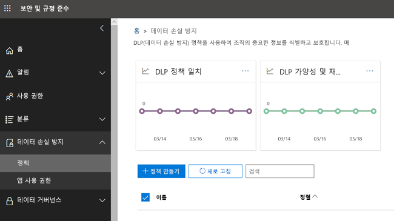
  
## DLP 정책에 포함된 내용

DLP 정책에는 다음과 같은 몇 가지 기본적인 사항이 포함됩니다.
  
- Exchange online, SharePoint Online 및 비즈니스용 OneDrive 사이트와 같은 콘텐츠 **위치** 를 보호할 수 있는 위치입니다. 
    
- 다음을 비롯하여 **규칙**을 적용하여 콘텐츠를 보호하는 경우 및 방법 
    
  - 규칙을 적용 하기 전에 콘텐츠가 일치 해야 하는 **조건** (예를 들어 조직 외부의 사용자와 공유 하는 사회 보장 번호가 포함 된 콘텐츠만 찾기) 
    
  - 조건과 일치하는 콘텐츠를 찾을 때 규칙이 자동으로 수행할 **작업**(예를 들어 문서에 대한 액세스를 차단하고 사용자 및 규정 준수 담당자 둘 다에게 전자 메일 알림 전송) 
    
규칙을 사용하여 특정 보호 요구 사항을 충족한 다음, DLP 정책을 사용하여 특정 규정을 준수하는 데 필요한 모든 규칙과 같은 일반적인 보호 요구 사항을 그룹화할 수 있습니다.
  
예를 들어 HIPAA(Health Insurance Portability and Accountability Act)가 적용되는 정보의 현재 상태를 확인하는 데 도움이 되는 DLP 정책이 있을 수 있습니다. 이 DLP 정책은 모든 SharePoint Online 사이트 및 모든 비즈니스용 OneDrive 사이트 (where)에서 조직 외부의 사용자와 공유 하는 모든 문서를 검색 하 여 해당 정보를 보호 하는 데 도움이 될 수 있습니다 ( 조건)을 선택한 다음 문서에 대 한 액세스를 차단 하 고 알림 (작업)을 보냅니다. 이러한 요구 사항은 개별 규칙으로 저장되고, 관리 및 보고를 단순화하기 위해 DLP 정책으로 함께 그룹화됩니다.
  
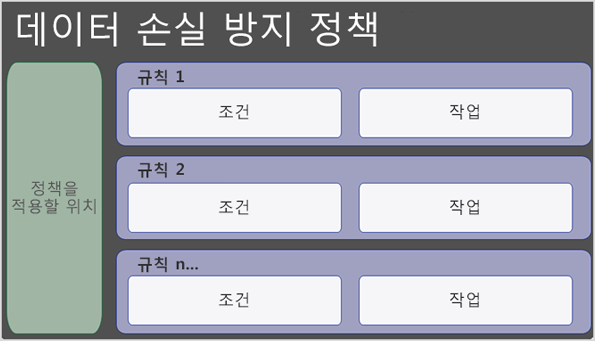
  
### 위치

DLP 정책은 정보를 Exchange Online, SharePoint Online 또는 비즈니스용 OneDrive에 있든 관계 없이 Office 365에서 중요 한 정보를 찾고 보호할 수 있습니다. 모든 SharePoint 사이트 또는 OneDrive 계정, 특정 사이트 또는 계정 또는 모든 사서함을 쉽게 보호할 수 있습니다. 아직 특정 사용자의 사서함만 선택할 수 있는 것은 아닙니다.
  

  
특정 SharePoint 사이트 또는 OneDrive 계정을 포함 하거나 제외 하는 경우 DLP 정책에는 포함 및 제외와 같은 100을 초과 하지 않을 수 있습니다. 이 제한이 있는 경우에도 조직 전체 정책이 나 전체 위치에 적용 되는 정책을 적용 하 여이 제한을 초과할 수 있다는 점을 이해 하는 것이 좋습니다.
  
### 규칙

규칙은 조직의 콘텐츠에 대 한 비즈니스 요구 사항을 적용 하는 것입니다. 정책은 하나 이상의 규칙을 포함하고 각 규칙은 조건 및 작업을 구성됩니다. 각 규칙에 대해 조건이 충족되면 작업이 자동으로 수행됩니다. 규칙은 각 정책에서 우선 순위가 가장 높은 규칙부터 시작 하 여 순차적으로 실행 됩니다.
  
또한 규칙은 사용자 (정책 팁 및 전자 메일 알림)와 콘텐츠가 규칙과 일치 하는 관리자 (전자 메일 문제 보고서)에 알리는 옵션도 제공 합니다.
  
아래에 설명 된 규칙의 구성 요소는 다음과 같습니다.
  

  
#### 조건

조건은 찾으려는 정보의 유형과 작업을 수행 해야 하는 경우를 결정 하는 것 이므로 중요 합니다. 예를 들어 콘텐츠에 숫자가 10 개 이상 있고 조직 외부의 사용자와 공유 되는 경우가 아니면 passport 번호가 포함 된 콘텐츠를 무시 하도록 선택할 수 있습니다.
  
사용 중인 중요 한 정보 유형, 문서와 공유 하는 사용자 등의 **상황**에 따라 **콘텐츠에**초점을 맞춥니다. 조건을 사용 하 여 다른 위험 수준에 서로 다른 작업을 할당할 수 있습니다. 예를 들어, 내부적으로 공유 되는 중요 한 콘텐츠는 위험 하 고, 조직 외부의 사용자와 공유 되는 중요 한 콘텐츠 보다 더 적은 작업이 필요 합니다. 
  
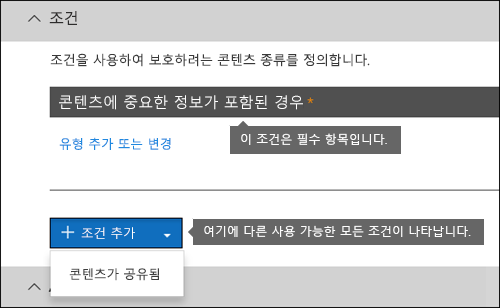
  
이제 조건을 사용하여 다음과 같은 경우인지 확인할 수 있습니다.
  
- 콘텐츠에 중요 한 유형의 정보가 포함 되어 있습니다.
    
- 콘텐츠에 레이블이 있습니다. 자세한 내용은 아래 섹션에서 [레이블을 DLP 정책의 조건으로 사용](data-loss-prevention-policies.md#label)하십시오.
    
- 콘텐츠가 조직 내부 또는 외부 사용자와 공유됩니다.
    
#### 중요한 정보 유형

DLP 정책은 중요 한 정보 **유형**으로 정의 된 중요 한 정보를 보호 하는 데 도움이 됩니다. Office 365에는 신용 카드 번호, 은행 계좌 번호, 국가 ID 번호 및 여권 번호 등 사용할 준비가 된 여러 다른 영역에 대한 일반적인 여러 중요 정보 유형에 대한 정의가 포함되어 있습니다. 
  
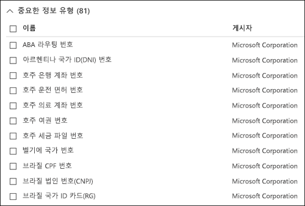
  
DLP 정책이 신용 카드 번호와 같은 중요 한 정보 유형을 찾을 때 16 자리 숫자는 찾지 않습니다. 중요한 각 정보 유형은 다음의 조합을 사용해서 정의되고 검색됩니다.
  
- 키워드
    
- 체크섬 또는 구성의 유효성을 검사하기 위한 내부 함수
    
- 패턴 일치를 찾기 위한 정규식의 평가
    
- 기타 콘텐츠 검사
    
이렇게 하면 peoples의 작업을 방해할 수 있는 가양성의 수를 줄이면서 DLP 검색에서 높은 수준의 정확성을 얻을 수 있습니다.
  
#### 동작

콘텐츠가 규칙의 조건과 일치 하는 경우 작업을 적용 하 여 콘텐츠를 자동으로 보호할 수 있습니다.
  
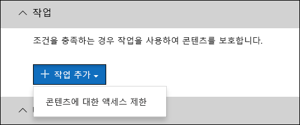
  
이제 사용 가능한 작업을 통해 다음을 수행할 수 있습니다.
  
- **콘텐츠에 대 한 액세스 제한** 사이트 콘텐츠의 경우 기본 사이트 모음 관리자, 문서 소유자 및 문서를 마지막으로 수정한 사람을 제외한 모든 사용자에 대해 문서에 대 한 사용 권한이 제한 됩니다. 이러한 사람은 문서에서 중요한 정보를 제거하거나 기타 작업을 수행할 수 있습니다. 문서가 규정을 준수하는 경우 원래 권한은 자동으로 복원됩니다. 문서 액세스가 차단되면 사이트의 라이브러리에서 해당 문서에는 특수한 정책 팁 아이콘이 표시됩니다. 
    
    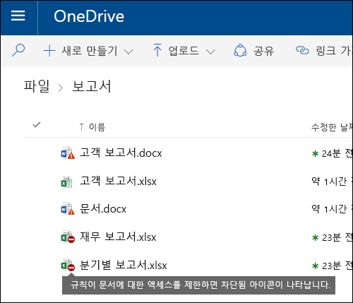
  
    전자 메일 콘텐츠의 경우이 동작은 메시지가 전송 되지 않도록 차단 합니다. DLP 규칙이 구성 된 방법에 따라 보낸 사람은 NDR을 보거나 규칙에서 알림을 사용 하는 경우 정책 팁 및/또는 전자 메일 알림을 볼 수 있습니다.
    
    
  
#### 사용자 알림 및 사용자 재정의

알림 및 재정의를 사용 하 여 사용자에 게 DLP 정책을 교육 하 고 작업을 차단 하지 않고 계속 준수 하도록 할 수 있습니다. 예를 들어 사용자가 중요한 정보를 포함하는 문서를 공유하려고 하면 DLP 정책은 전자 메일 알림을 보내고, 업무 정당성이 있을 경우 이 정책을 재정의할 수 있는 문서 라이브러리의 컨텍스트에서 정책 팁을 표시합니다.
  
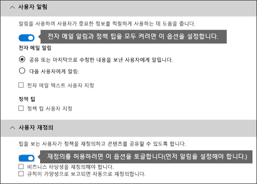
  
전자 메일은 콘텐츠를 전송, 공유 또는 마지막으로 수정한 사람, 사이트 콘텐츠의 경우 주 사이트 모음 관리자 및 문서 소유자에 게 알릴 수 있습니다. 또한 전자 메일 알림에서 선택한 사용자를 추가 하거나 제거할 수 있습니다.
  
전자 메일 알림을 보내는 것 외에도 사용자 알림은 정책 팁을 표시 합니다.
  
- outlook 2013 이상 및 웹용 outlook
    
- SharePoint Online 또는 비즈니스용 OneDrive 사이트의 문서
    
- Excel 2016, PowerPoint 2016 및 Word 2016에서 문서가 DLP 정책에 포함 된 사이트에 저장 되어 있는 경우
    
전자 메일 알림 및 정책 팁에서는 콘텐츠가 DLP 정책과 충돌 하는 이유를 설명 합니다. 해당 항목을 선택하면 전자 메일 알림 및 정책 팁은 가양성을 보고하거나 업무 정당성을 제공하여 사용자가 규칙을 재정의할 수 있도록 합니다. 이를 통해 사용자에게 DLP 정책을 교육하고, 사람들이 해당 작업을 수행하지 못하도록 하는 방식으로 정책을 적용할 수 있습니다. 재정의 및 가양성에 대한 정보는 보고를 위해 기록되고(DLP 보고서에 대해서는 아래 참조) 사고 보고서(다음 섹션 참조)에 포함되므로 규정 준수 책임자는 정기적으로 이 정보를 검토할 수 있습니다.
  
OneDrive for Business 계정의 정책 팁은 다음과 같습니다.
  

  
#### 사고 보고서

규칙이 일치 하는 경우 규정 준수 관리자 또는 선택한 모든 사용자에 게 이벤트 세부 정보와 함께 문제 보고서를 보낼 수 있습니다. 이 보고서에는 일치 된 항목에 대 한 정보, 해당 규칙과 일치 하는 실제 콘텐츠 및 콘텐츠를 마지막으로 수정한 사용자의 이름이 포함 되어 있습니다. 전자 메일 메시지의 경우 보고서에는 DLP 정책과 일치 하는 원본 메시지의 첨부 파일로도 포함 됩니다.
  
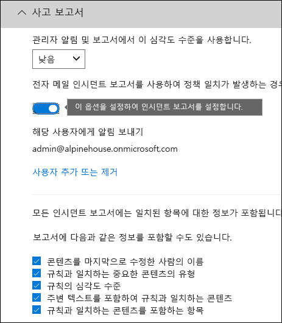
  
## 그룹화 및 논리 연산자

종종 DLP 정책에는 미국 주민 등록 번호를 포함 하는 모든 콘텐츠를 식별 하는 것과 같은 간단한 요구 사항이 있습니다. 그러나 다른 시나리오에서는 DLP 정책에서 더 느슨하게 정의 된 데이터를 식별 해야 할 수도 있습니다.
  
예를 들어, HIPAA (미국 의료 보험 Act)가 적용 되는 콘텐츠를 확인 하려면 다음 항목을 확인 해야 합니다.
  
- 미국 사회 보장 번호 또는 마약 적용 에이전시 (DEA) 번호와 같은 특정 유형의 중요 한 정보가 포함 된 콘텐츠입니다.
    
    한
    
- 제공 되는 의료 서비스에 대 한 환자 관리 또는 설명에 대 한 통신과 같이 식별 하기 어려운 콘텐츠입니다. 이 콘텐츠를 식별 하려면 Diseases의 국제 분류 (ICD-9cm 또는 ICD-10cm)와 같은 매우 큰 키워드 목록의 일치 키워드를 사용 해야 합니다.
    
그룹화 및 논리 연산자 (and, OR)를 사용 하 여 느슨하게 정의 된 데이터를 쉽게 식별할 수 있습니다. DLP 정책을 만들 때 다음을 수행할 수 있습니다.
  
- 중요 한 정보 유형을 그룹화 합니다.
    
- 그룹 내의 중요 한 정보 유형과 그룹 자체 간의 논리 연산자를 선택 합니다.
    
### 그룹 내에서 연산자 선택

그룹 내에서 해당 그룹의 조건을 규칙과 일치 시키기 위해 충족 해야 하는지 여부를 선택할 수 있습니다.
  
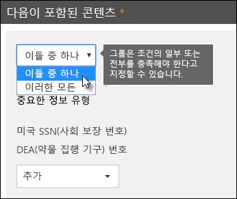
  
### 그룹 추가

그룹을 빠르게 추가 하 여 해당 그룹 내에 고유한 조건과 연산자를 포함할 수 있습니다.
  
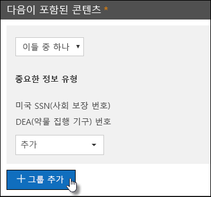
  
### 그룹 간 연산자 선택

그룹 간에 콘텐츠를 규칙과 일치 시키려면 한 그룹 또는 모든 그룹의 조건만 충족 해야 하는지 여부를 선택할 수 있습니다.
  
예를 들어 기본 제공 **미국 HIPAA** 정책에는 다음을 포함 하는 콘텐츠를 식별 하도록 그룹 간에 **AND** 연산자를 사용 하는 규칙이 있습니다. 
  
- **PII 식별자** 그룹 (하나 이상의 SSN 번호 **또는** DEA 번호) 
    
    **한**
    
- 그룹 **의료 조항** (하나 이상의 ICD-9-cm 키워드나 ICD 키워드) **** 
    
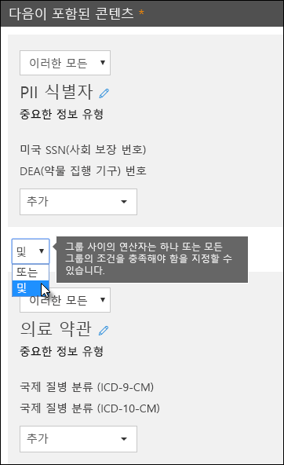
  
## 규칙이 처리 되는 우선 순위입니다.

정책에서 규칙을 만들 때 각 규칙의 우선 순위는 생성 되는 순서 대로 지정 되 고, 처음 만든 규칙은 우선 순위가 가장 높습니다. 규칙을 만든 후에는 삭제 하 고 다시 만드는 것을 제외 하 고는 해당 우선 순위를 변경할 수 없습니다.
  
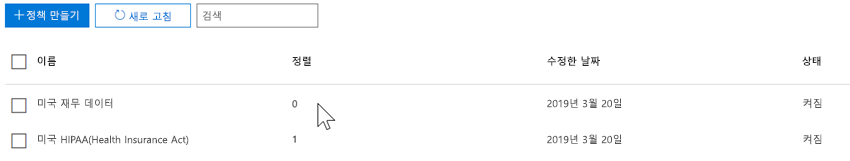
  
규칙을 기준으로 콘텐츠를 평가 하는 경우 규칙은 우선 순위에 따라 처리 됩니다. 콘텐츠가 여러 규칙과 일치 하는 경우 규칙은 우선 순위 순으로 처리 되 고 가장 제한적인 작업이 적용 됩니다. 예를 들어 콘텐츠가 다음 규칙과 모두 일치 하는 경우 규칙 3은 우선 순위가 가장 높고 가장 제한적인 규칙입니다.
  
- 규칙 1: 사용자에 게 알림
    
- 규칙 2: 사용자에 게 알리고, 액세스를 제한 하 고, 사용자 재정의를 허용 합니다.
    
- 규칙 3: 사용자에 게 알리고, 액세스를 제한 하며, 사용자 재정의를 허용 하지 않습니다.
    
- 규칙 4: 사용자에 게 알림
    
- 규칙 5: 액세스 제한
    
- 규칙 6: 사용자에 게 알리고, 액세스를 제한 하며, 사용자 재정의를 허용 하지 않습니다.
    
이 예에서는 모든 규칙에 대 한 일치가 감사 로그에 기록 되며 가장 제한적인 규칙만 적용 되더라도 DLP 보고서에 표시 됩니다.
  
정책 팁과 관련 하 여 다음 사항을 확인 합니다.
  
- 가장 높은 우선 순위의 정책 팁만 표시 됩니다. 예를 들어 알림을 콘텐츠 액세스를 차단하는 규칙의 정책 팁은 단순히 알림을 보내는 규칙의 정책 팁보다 우선적으로 표시됩니다. 따라서 정책 팁이 단계별로 표시되지는 않습니다.
    
- 가장 제한적인 규칙의 정책 팁이 사용자의 규칙 재정의를 허용할 경우 이 규칙을 재정의하면 해당 콘텐츠가 일치하는 다른 모든 규칙이 함께 재정의됩니다.
    
## 보다 쉽고 편리 하 게 사용할 수 있는 조정 규칙

사용자가 DLP 정책을 만들고 켠 후에는 다음과 같은 문제가 발생할 수도 있습니다.
  
- 중요 한 정보가 **아닌** 콘텐츠가 규칙과 일치 하는 경우 (즉, 가양성이 너무 많음) 
    
- 중요 한 정보가 규칙과 **** 일치 하는 콘텐츠가 너무 적으면 중요 한 정보에는 보호 작업이 적용 되지 않습니다. 
    
이러한 문제를 해결 하기 위해 인스턴스 수와 일치 정확도를 조정 하 여 규칙을 조정 하면 콘텐츠를 규칙과 일치 시킬 수 있습니다. 규칙에 사용 되는 각 중요 한 정보 유형에는 인스턴스 수와 일치 정확도가 모두 있습니다.
  
### 인스턴스 수

인스턴스 수는 해당 규칙과 일치 하는 콘텐츠에 대해 제공 해야 하는 특정 유형의 중요 한 정보 발생 수를 의미 합니다. 예를 들어, 1 ~ 9 고유 미국 또는 영국 사이에 있는 경우 콘텐츠는 아래와 같이 표시 된 규칙과 일치 합니다. passport 번호가 식별 됩니다.
  
인스턴스 수에는 중요 한 정보 유형 및 키워드에 대 한 **고유** 일치만 포함 됩니다. 예를 들어 전자 메일에 동일한 신용 카드 번호가 10 번 포함 되어 있는 경우 10 개 항목이 신용 카드 번호의 단일 인스턴스로 계산 됩니다. 
  
인스턴스 수를 사용 하 여 규칙을 조정 하려면 다음과 같은 지침이 단순 합니다.
  
- 규칙을 보다 쉽게 찾을 수 있도록 **최소** 개수를 줄이거나 **최대** 개수를 늘립니다. 숫자 값을 삭제 하 여 **** **max** 로 설정할 수도 있습니다. 
    
- 규칙 일치가 더 어렵게 하려면 **최소** 개수를 늘립니다. 
    
일반적으로 인스턴스 수가 낮은 규칙 (예: 1-9)에는 사용자 알림 보내기와 같은 덜 제한적인 작업을 사용 합니다. 또한 사용자 재정의를 허용 하지 않고 콘텐츠에 대 한 액세스를 제한 하는 것과 같은 더 제한적인 작업을 사용 하는 경우 인스턴스 수가 더 높은 규칙 (예: 10 개)
  
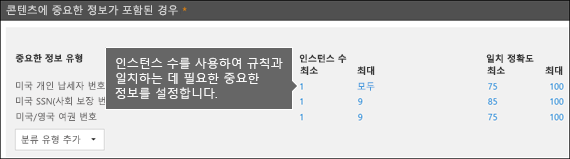
  
### 정확도 일치

위에서 설명한 것 처럼 중요 한 정보 유형은 서로 다른 유형의 증명을 조합 하 여 정의 되 고 검색 됩니다. 일반적으로 중요 한 정보 유형은 패턴 이라는 여러 조합에 의해 정의 됩니다. 보다 적은 증거를 필요로 하는 패턴의 경우 일치 하는 정확도 (또는 신뢰 수준)가 더 높고 자세한 증거를 필요로 하는 패턴의 경우 일치 하는 정확도 (또는 신뢰 수준)가 더 높은 것입니다. 모든 중요 한 정보 유형에 서 사용 되는 실제 패턴 및 신뢰 수준에 대 한 자세한 내용은 [중요 한 정보 유형이 찾는 항목](what-the-sensitive-information-types-look-for.md)을 참조 하십시오.
  
예를 들어 신용 카드 번호 라는 중요 한 정보 유형은 다음과 같은 두 가지 패턴으로 정의 됩니다.
  
- 다음 요구 사항이 충족 되는 65% 신뢰도가 있는 패턴
    
  - 신용 카드 번호 형식의 숫자입니다.
    
  - 체크섬을 통과 하는 숫자입니다.
    
- 다음 요구 사항이 충족 되는 85% 신뢰도가 있는 패턴
    
  - 신용 카드 번호 형식의 숫자입니다.
    
  - 체크섬을 통과 하는 숫자입니다.
    
  - 올바른 형식의 키워드나 만료 날짜입니다.
    
규칙에서 이러한 신뢰 수준 (또는 정확성 일치)을 사용할 수 있습니다. 일반적으로 일치 정확도가 낮은 규칙에서 사용자 알림 보내기와 같은 덜 제한적인 작업을 사용 합니다. 또한 사용자 재정의를 허용 하지 않고 콘텐츠에 대 한 액세스를 제한 하는 것과 같은 더 제한적인 작업을 사용 하는 것은 일치 하는 정확도가 더 높은 규칙입니다.
  
신용 카드 번호와 같은 특정 유형의 중요 한 정보가 콘텐츠에서 식별 되 면 단일 신뢰 수준만 반환 되는 것을 이해 하는 것이 중요 합니다.
  
- 모든 일치 항목이 단일 패턴에 대 한 것 이면 해당 패턴의 신뢰 수준이 반환 됩니다.
    
- 두 개 이상의 패턴에 대해 일치 하는 것이 있는 경우 (즉 서로 다른 신뢰 수준과 일치 하는 일치가 있는 경우) 단일 패턴에 비해 신뢰도 수준이 높은 것이 반환 됩니다. 이는 까다로운 부분입니다. 예를 들어 신용 카드에서 65%와 85% 패턴이 모두 일치 하는 경우, 더 많은 증거가 있다는 것을 의미 하기 때문에 해당 중요 한 정보 유형에 대해 반환 되는 신뢰 수준은 90% 보다 큽니다.
    
따라서 신용 카드에 대해 두 개의 상호 배타적인 규칙을 만들고, 65% 일치 정확성을 확인 하 고, 85% 일치 정확성을 사용할 경우 일치 하는 항목의 범위는 다음과 같습니다. 첫 번째 규칙은 65% 패턴과 일치 하는 항목만 선택 합니다. 두 번째 규칙은 **하나 이상의** 85% 일치 항목과 일치 하 고 더 낮은 신뢰도 일치를 **가질 수 있습니다** . 
  
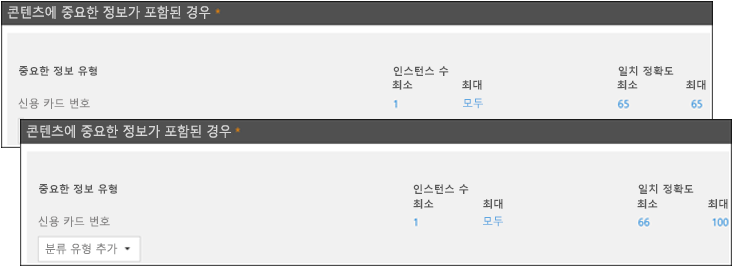
  
이와 같은 이유로, 서로 다른 match accuracies를 사용 하 여 규칙을 만드는 지침은 다음과 같습니다.
  
- 신뢰도가 가장 낮은 수준에는 일반적으로 범위가 아닌 **최소값** 및 **최대값** 에 같은 값이 사용 됩니다. 
    
- 신뢰도가 가장 높은 수준은 일반적으로 낮은 신뢰도 수준에서 100 까지의 범위입니다.
    
- 신뢰할 수 있는 신뢰 수준 간의 범위는 일반적으로 낮은 신뢰 수준 바로 아래에서 높은 신뢰도 수준 바로 아래 까지입니다.
    
## 레이블을 DLP 정책의 조건으로 사용

레이블을 만든 후 다음을 수행할 수 있습니다.
  
- 최종 사용자가 콘텐츠에 레이블을 표시 하 고 콘텐츠를 수동으로 적용할 수 있도록 **게시** 합니다. 
    
- 선택한 조건과 일치 하는 콘텐츠에 **자동으로 적용** 합니다. 
    
레이블에 대 한 자세한 내용은 [보존 레이블 개요](labels.md)를 참조 하세요.
  
레이블을 만든 후에는 해당 레이블을 DLP 정책의 조건으로 사용할 수 있습니다. 예를 들어 다음과 같은 이유로이 작업을 수행할 수 있습니다.
  
- 조직의 사용자가 기밀 전자 메일 및 문서에 레이블을 수동으로 적용할 수 있도록 **기밀**이라는 레이블을 게시 했습니다. 이 레이블을 DLP 정책의 조건으로 사용 하 여 **기밀** 을 유지 하는 콘텐츠를 조직 외부의 사용자와 공유 하지 못하도록 제한할 수 있습니다. 
    
- 해당 이름의 프로젝트에 대해 **알파인 house** 라는 레이블을 만든 다음 해당 레이블을 "알파인 집" 이라는 키워드가 포함 된 콘텐츠에 자동으로 적용 합니다. 이 레이블을 DLP 정책의 조건으로 사용 하 여이 콘텐츠를 조직 외부의 사용자와 공유 하려고 할 때 최종 사용자에 게 정책 팁을 표시할 수 있습니다. 
    
- 레코드 관리자가 레코드를 분류 해야 하는 콘텐츠에 레이블을 수동으로 적용할 수 있도록 **세금 레코드**라는 레이블을 게시 했습니다. 이 레이블을 DLP 정책의 조건으로 사용 하 여 itins 또는 ssns와 같은 기타 유형의 중요 한 정보와 함께이 레이블로 콘텐츠를 찾을 수 있습니다. **세금 기록**이라는 콘텐츠에 보호 작업을 적용 합니다. 그리고 dlp 보고서 및 감사 로그 데이터에서 dlp 정책에 대 한 자세한 활동 보고서를 확인 하세요. 
    
- **Executive 리더십 팀 구분** 이라는 레이블을 Exchange 사서함 및 임원 그룹의 OneDrive 계정에 게시 했습니다. 이 레이블을 DLP 정책의 조건으로 사용 하 여 동일한 콘텐츠 및 사용자 하위 집합에 대해 보존 및 보호 작업을 둘 다 적용할 수 있습니다. 
    
DLP 규칙의 조건으로 레이블을 사용 하 여 특정 콘텐츠, 위치 또는 사용자 집합에 대해 선택적으로 보호 작업을 적용할 수 있습니다.
  
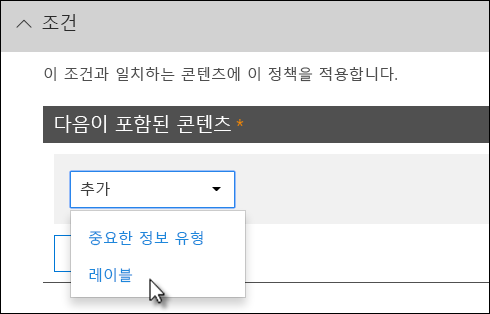

### 민감도 레이블이 지원 됨

현재 보존 레이블만 [우편물 종류 레이블이](sensitivity-labels.md)아닌 조건으로 사용할 수 있습니다. 현재이 조건에서 민감도 레이블 사용을 지원 하 고 있습니다.
  
### 이 기능이 다른 기능과 어떤 관련이 있는지를 설명 합니다.

중요 한 정보가 포함 된 콘텐츠에는 다음과 같은 몇 가지 기능이 적용 될 수 있습니다.
  
- [보존 레이블과](labels.md#applying-a-retention-label-automatically-based-on-conditions) [보존 정책은](retention-policies.md) 모두이 콘텐츠에 대해 **보존** 작업을 적용할 수 있습니다. 
    
- DLP 정책은이 콘텐츠에 대 한 **보호** 작업을 적용할 수 있습니다. 이러한 작업을 적용 하기 전에 먼저 DLP 정책을 통해 레이블이 포함 된 콘텐츠 외에 다른 조건이 충족 되도록 해야 할 수 있습니다. 
    
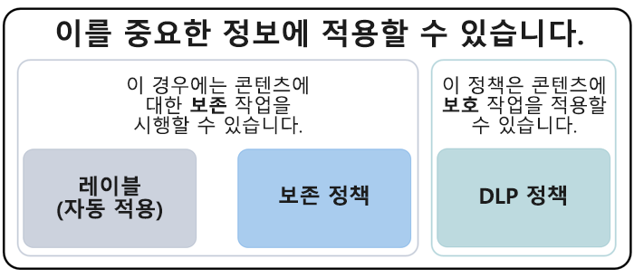
  
DLP 정책은 중요 한 정보에 적용 되는 레이블 또는 보존 정책 보다 더 다양 한 검색 기능을 제공 합니다. DLP 정책은 중요 한 정보가 포함 된 콘텐츠에 대 한 보호 작업을 적용할 수 있으며, 중요 한 정보를 콘텐츠에서 제거 하면 다음에 콘텐츠를 검색할 때 해당 보호 작업이 취소 됩니다. 그러나 중요 한 정보가 포함 된 콘텐츠에 보존 정책이 나 레이블을 적용 하는 경우에는 중요 한 정보가 제거 되어도 실행 취소 되지 않는 일회성 동작이 됩니다.
  
레이블을 DLP 정책의 조건으로 사용 하면 해당 레이블을 사용 하 여 콘텐츠에 대 한 보존 및 보호 작업을 둘 다 적용할 수 있습니다. 중요 한 정보가 포함 된 콘텐츠 (레이블 및 중요 한 정보 유형 모두)가 콘텐츠를 분류 하는 데 사용 되는 속성 이기 때문에 해당 콘텐츠에 대해 작업을 적용할 수 있습니다.
  
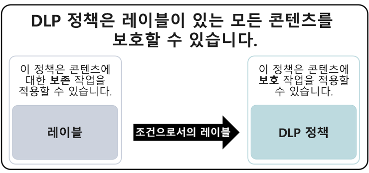
  
## 단순 설정 및 고급 설정 비교

DLP 정책을 만들 때 simple 또는 advanced 설정 중에서 선택 합니다.
  
- **간단한 설정을** 통해 규칙 편집기를 사용 하지 않고 규칙을 만들거나 수정 하는 방법으로 가장 일반적인 유형의 DLP 정책을 쉽게 만들 수 있습니다. 
    
- **고급 설정** 규칙 편집기를 사용 하 여 DLP 정책의 모든 설정을 완벽 하 게 제어할 수 있습니다. 
    
조건 및 작업에 영향을 주는 규칙을 적용 하 여 규칙 편집기를 볼 수는 있지만,이 경우에도 마찬가지로, 단순 설정 및 고급 설정은 정확히 동일 하 게 작동 합니다. 이는 DLP 정책을 만드는 빠른 방법입니다.
  
### 단순 설정

지금까지 가장 일반적인 DLP 시나리오는 중요 한 정보가 포함 된 콘텐츠를 조직 외부의 사용자와 공유 하는 것을 방지 하 고 콘텐츠에 액세스할 수 있는 사람을 제한 하는 등의 자동 해결 작업을 수행 하는 정책을 만드는 것입니다. 최종 사용자 또는 관리자 알림을 보내며 나중에 조사를 위해 이벤트를 감사 합니다. 사용자는 DLP를 사용 하 여 중요 한 정보가 실수로 공개 되지 않도록 합니다.
  
이러한 목표를 단순화 하기 위해 DLP 정책을 만들 때 **단순 설정 사용**을 선택할 수 있습니다. 이러한 설정은 규칙 편집기로 이동 하지 않고도 가장 일반적인 DLP 정책을 구현 하는 데 필요한 모든 항목을 제공 합니다.
  
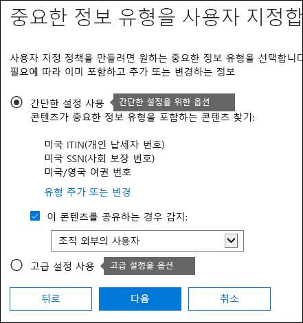
  
### 고급 설정

사용자 지정 된 DLP 정책을 더 만들어야 하는 경우에는 **고급 설정 사용**을 선택 하면 됩니다.
  
고급 설정에는 각 규칙에 대 한 인스턴스 수 및 일치 정확도 (신뢰 수준)를 비롯 하 여 모든 가능한 옵션에 대 한 모든 권한이 있는 규칙 편집기가 제공 됩니다.
  
섹션으로 빠르게 이동 하려면 위쪽 탐색 모음에서 항목을 클릭 하 여 아래의 해당 섹션으로 이동 합니다.
  
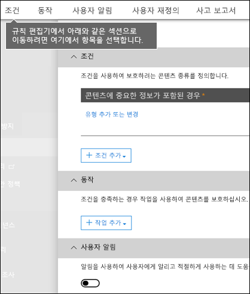
  
## DLP 정책 템플릿

DLP 정책을 만드는 첫 번째 단계는 보호할 정보를 선택 하는 것입니다. DLP 서식 파일로 시작 하 여 새 규칙 집합을 처음부터 새로 작성 하 고, 기본적으로 포함 될 정보 유형을 파악 합니다. 그런 다음 이러한 요구 사항을 추가 하거나 수정 하 여 조직의 특정 요구 사항에 맞게 규칙을 미세 조정할 수 있습니다.
  
미리 구성 된 DLP 정책 템플릿을 사용 하면 HIPAA 데이터, 금융-gramm-leach-bliley-gramm-leach-bliley Act 데이터, 심지어 로캘별 개인 식별 정보 (P.I.)와 같은 특정 유형의 중요 한 정보를 쉽게 검색할 수 있습니다. 일반적인 유형의 중요한 정보를 쉽게 찾아 보호할 수 있도록 하기 위해 Office 365에 포함된 정책 템플릿에는 이미 시작하는 데 필요한 가장 일반적인 중요한 정보 유형이 포함되어 있습니다.
  
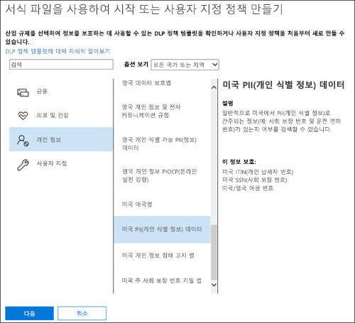
  
조직에는 고유한 특정 요구 사항이 있을 수 있으며,이 경우 **사용자 지정 정책** 옵션을 선택 하 여 DLP 정책을 처음부터 새로 만들 수 있습니다. 사용자 지정 정책은 비어 있고 premade 규칙이 포함 되어 있지 않습니다. 
  
## 테스트 모드를 사용하여 점차적으로 DLP 정책 롤아웃

DLP 정책을 만든 후에는 완전히 적용하기 전에 서서히 롤아웃하면서 영향을 평가하고 효율성을 테스트하는 것이 좋습니다. 예를 들어 사용자가 작업을 완료 하기 위해 액세스 해야 하는 수천 개의 문서에 대 한 액세스를 새 DLP 정책에서 실수로 차단 하는 것을 원하지 않을 수 있습니다.
  
잠재적으로 큰 영향을 주는 DLP 정책을 만드는 경우에는 다음 순서를 따르는 것이 좋습니다.
  
1. **정책 설명이 없는 테스트 모드로 시작한** 다음 DLP 보고서 및 모든 문제 보고서를 사용 하 여 영향을 평가 합니다. DLP 보고서를 사용하여 정책 일치의 횟수, 위치, 유형 및 심각도를 확인할 수 있습니다. 결과에 따라 필요에 맞게 규칙을 미세 조정할 수 있습니다. 테스트 모드에서 DLP 정책은 조직에서 작업하는 사용자의 생산성에 영향을 주지 않습니다. 
    
2. **알림 및 정책 팁을 사용하여 테스트 모드로 전환**하여 사용자에게 규정 준수 정책을 교육하고 적용될 규칙을 준비하도록 할 수 있습니다. 이 단계에서 규칙을 미세 조정할 수 있도록 사용자에게 가양성을 보고하도록 요청할 수도 있습니다. 
    
3. 규칙의 작업이 적용 되 고 콘텐츠가 보호 되도록 **정책에 대 한 전체 적용을 시작** 합니다. DLP 보고서 및 문제 보고서나 알림을 계속 모니터링하여 결과가 의도한 대로 나타나는지 확인합니다. 
    

  
언제든지 정책의 모든 규칙에 적용되는 DLP 정책을 끌 수 있습니다. 그러나 규칙 편집기에서 상태를 전환 하 여 각 규칙을 개별적으로 끌 수도 있습니다.
  
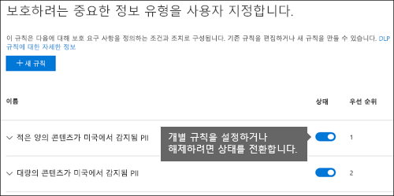
  
## DLP 보고서

DLP 정책을 만들고 켠 후에는 해당 정책이 의도 한 대로 작동 하 고 준수 상태를 유지 하도록 하는 것이 좋습니다. DLP 보고서를 사용하면 시간에 따른 DLP 정책 및 규칙 일치 수와 가양성 및 재정의 수를 빠르게 확인할 수 있습니다. 각 보고서에 대해 위치, 시간 프레임에 따라 일치하는 항목을 필터링할 수 있으며 특정 정책, 규칙 또는 작업으로 범위를 좁힐 수도 있습니다.
  
DLP 보고서를 사용하면 비즈니스 통찰력을 얻고 다음을 수행할 수 있습니다.
  
- 특정 기간에 초점을 맞추고 스파이크 및 추세의 이유를 이해합니다.
    
- 조직의 규정 준수 정책을 위반 하는 비즈니스 프로세스를 검색 합니다.
    
- DLP 정책이 비즈니스에 미치는 영향을 이해합니다.
    
또한 DLP 보고서를 사용하여 실행 중에 DLP 정책을 미세 조정할 수 있습니다.
  
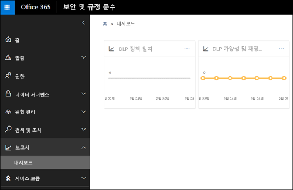
  
## DLP 정책이 작동하는 방식

DLP는 심도 깊은 콘텐츠 분석(단순 텍스트 검색 아님)을 사용하여 중요한 정보를 검색합니다. 이 심도 깊은 콘텐츠 분석은 키워드 일치, 사전 일치, 정규식 평가, 내부 함수 및 기타 방법을 사용하여 DLP 정책과 일치하는 콘텐츠를 검색합니다. 잠재적으로 데이터의 일부만 중요한 것으로 간주됩니다. DLP 정책은 나머지 콘텐츠로 작업하는 사람들에게 영향을 주거나 작업을 지연시키지 않으면서 해당 데이터를 식별 및 모니터링하고 자동으로 보호할 수 있습니다.
  
### 정책이 동기화됨

보안 &amp; 및 준수 센터에서 DLP 정책을 만든 후에는 중앙 정책 저장소에 저장 된 후 다음을 비롯 한 다양 한 콘텐츠 원본과 동기화 합니다.
  
- Exchange Online, 웹에서 outlook 및 outlook 2013 이상
    
- 비즈니스용 OneDrive 사이트
    
- SharePoint Online 사이트
    
- Office 2016 데스크톱 프로그램(Excel 2016, PowerPoint 2016 및 Word 2016)
    
정책이 올바른 위치와 동기화 되 면 콘텐츠를 평가 하 고 작업을 적용 하기 시작 합니다.
  
### 비즈니스용 OneDrive 및 SharePoint Online 사이트에서의 정책 평가

모든 SharePoint Online 사이트 및 비즈니스용 OneDrive 사이트에서 문서는 지속적으로 변경 되며, 계속 해 서 만들어지고 편집 되 고 공유 됩니다. 즉, 문서를 언제 든 지 충돌 하거나 DLP 정책을 준수 하도록 할 수 있습니다. 예를 들어 사용자가 팀 사이트에 중요 한 정보가 포함 되지 않은 문서를 업로드할 수 있지만 나중에 다른 사람이 같은 문서를 편집 하 고 중요 한 정보를 추가할 수 있습니다.
  
이러한 이유로 DLP 정책은 백그라운드에서 문서의 정책 일치 여부를 자주 확인합니다. 이러한 검사를 비동기 정책 평가로 간주할 수 있습니다.
  
작동 방식은 다음과 같습니다. 누군가가 사이트에서 문서를 추가하거나 변경하면 검색 엔진이 해당 콘텐츠를 검색하므로 사용자가 나중에 검색할 수 있습니다. 이 문제가 발생 하는 동안에도 콘텐츠가 중요 한 정보를 검색 하 고 공유 되는지 확인 합니다. 발견 되는 중요 한 정보는 검색 인덱스에 안전 하 게 저장 되므로 준수 팀만 액세스할 수 있고 일반적인 사용자에 게는 액세스 하지 않아도 됩니다. 백그라운드에서 사용 하도록 설정 된 각 DLP 정책 (비동기적으로)이 검색을 자주 실행 하 여 정책과 일치 하는 모든 콘텐츠를 확인 하 고 실수로 인 한 누수 로부터 보호 하기 위해 작업을 적용 하는 경우
  
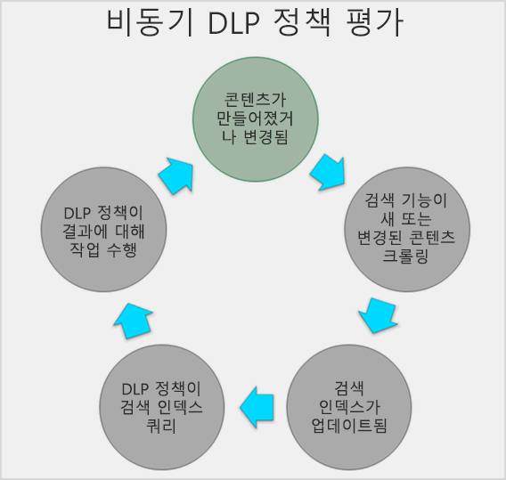
  
마지막으로 문서는 DLP 정책과 충돌할 수 있지만 DLP 정책을 준수할 수도 있습니다. 예를 들어 어떤 사람이 신용 카드 번호를 문서를 추가하는 경우 DLP 정책이 문서에 대한 액세스를 자동으로 차단할 수 있습니다. 하지만 나중에 이 사람이 중요한 정보를 제거하면 다음 번에 정책에 대해 문서가 평가될 때 작업(이 경우 차단)이 자동으로 실행 취소됩니다.
  
DLP는 인덱싱할 수 있는 모든 콘텐츠를 평가합니다. 기본적으로 크롤링되는 파일 형식에 대 한 자세한 내용은 [기본 크롤링 파일 이름 확장명 및 구문 분석 된 파일 형식 (SharePoint Server 2013](https://go.microsoft.com/fwlink/p/?LinkID=627430))을 참조 하십시오.
  
### Exchange Online, outlook 2013 이상 및 웹용 Outlook의 정책 평가

exchange online을 위치로 포함 하는 DLP 정책을 만드는 경우에는 정책이 Office 365 보안 &amp; 준수 센터에서 exchange online으로 동기화 되 고 exchange online에서 웹 및 outlook 2013 이상 버전의 outlook으로 설정 됩니다.
  
Outlook에서 메시지를 작성할 때 만들어지는 콘텐츠가 DLP 정책에 대해 평가 되는 동안 사용자는 정책 팁을 볼 수 있습니다. 그리고 메시지가 전송 된 후에는 exchange 메일 흐름 규칙 (전송 규칙이 라고도 함) 및 exchange 관리 센터에서 만든 DLP 정책 (자세한 내용은 다음 섹션 참조)과 함께 dlp 정책에 대 한 전자 메일 흐름의 일반적인 부분으로 평가 됩니다. DLP 정책은 메시지와 첨부 파일을 모두 검색 합니다.
  
### Office 2016 데스크톱 프로그램의 정책 평가

Excel 2016, PowerPoint 2016 및 Word 2016에는 SharePoint Online 및 비즈니스용 OneDrive와 동일하게 중요한 정보를 식별하고 DLP 정책을 적용하는 기능이 있습니다. 이러한 Office 2016 프로그램은 해당 dlp 정책을 중앙 정책 저장소에서 직접 동기화 한 다음 사용자가 dlp 정책에 포함 된 사이트에서 연 문서를 사용할 때 dlp 정책에 대해 콘텐츠를 지속적으로 평가 합니다.
  
Office 2016의 DLP 정책 평가는 해당 콘텐츠를 사용하는 프로그램의 성능이나 사용자의 생산성에 영향을 미치지 않도록 고안되었습니다. 대규모 문서에서 작업 중이거나 사용자의 컴퓨터가 사용 중인 경우 정책 팁이 표시 되는 데 몇 초 정도 걸릴 수 있습니다.
  
## 사용 권한

준수 팀의 구성원에 게는 DLP 정책을 만들 사용자의 보안 &amp; 및 준수 센터에 대 한 사용 권한이 필요 합니다. 기본적으로 테 넌 트 관리자는이 위치에 액세스할 수 있으며, 규정 준수 관리자 및 기타 사용자에 게는 모든 &amp; 테 넌 트 관리 권한을 부여 하지 않고도 보안 준수 센터에 대 한 액세스를 제공 합니다. 이렇게 하려면 다음을 수행 하는 것이 좋습니다.
  
1. Office 365에서 그룹을 만들고 규정 준수 책임자를 추가합니다.
    
2. 보안 &amp; 및 준수 센터의 **사용 권한** 페이지에서 역할 그룹을 만듭니다. 
    
3. Office 365 그룹을 역할 그룹에 추가합니다.
    
자세한 내용은 [Give users access to the Office 365 Compliance Center](grant-access-to-the-security-and-compliance-center.md)을 참조하세요.
  
이러한 정책은 DLP 정책을 만들고 적용하는 데만 필요합니다. 정책 적용을 위해서는 콘텐츠에 액세스하지 않아도 됩니다.
  
## DLP cmdlet 찾기

보안 &amp; 및 준수 센터에 대 한 cmdlet을 대부분 사용 하려면 다음 작업을 수행 해야 합니다.
  
1. [원격 PowerShell을 사용하여 Office 365 보안 및 준수 센터에 연결](http://go.microsoft.com/fwlink/?LinkID=799771&amp;clcid=0x409)
    
2. 다음 [Office 365 보안 &amp; 및 준수 센터 cmdlet](http://go.microsoft.com/fwlink/?LinkID=799772&amp;clcid=0x409) 사용
    
그러나 DLP 보고서는 Exchange Online을 포함 하 여 Office 365 간에 데이터를 가져올 필요가 있습니다. 따라서 DLP 보고서용 cmdlet은 보안 &amp; 및 준수 센터 powershell이 아닌 Exchange Online Powershell에서 사용할 수 있습니다. 따라서 DLP 보고서에 대해 cmdlet을 사용 하려면 다음을 수행 해야 합니다.
  
1. [Connect to Exchange Online using remote PowerShell](http://go.microsoft.com/fwlink/?LinkID=799773&amp;clcid=0x409)(원격 PowerShell을 사용하여 Exchange Online에 연결)
    
2. DLP 보고서에 대해 다음 cmdlet 중 하나를 사용 합니다.
    
  - [get-dlpdetectionsreport](http://go.microsoft.com/fwlink/?LinkID=799774&amp;clcid=0x409)
    
  - [get-dlpdetailreport](http://go.microsoft.com/fwlink/?LinkID=799775&amp;clcid=0x409)
    
## 추가 정보

- [템플릿에서 DLP 정책 만들기](create-a-dlp-policy-from-a-template.md)
    
- [DLP 정책에 대한 알림 보내기 및 정책 팁 표시](use-notifications-and-policy-tips.md)
    
- [FCI 또는 기타 속성을 갖는 문서를 보호하는 DLP 정책 만들기](protect-documents-that-have-fci-or-other-properties.md)
    
- [DLP 정책 템플릿에 포함되는 내용](what-the-dlp-policy-templates-include.md)
    
- [중요한 정보 유형이 찾는 항목](what-the-sensitive-information-types-look-for.md)
    
- [DLP 함수가 찾는 항목](what-the-dlp-functions-look-for.md)
    
- [사용자 지정 중요한 정보 유형 만들기](create-a-custom-sensitive-information-type.md)
    

