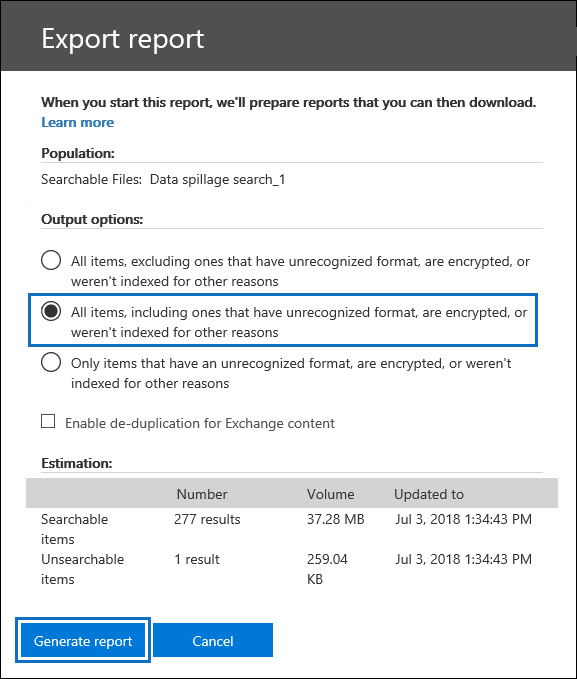

# <a name="ediscovery-solution-series-data-spillage-scenario---search-and-purge"></a><span data-ttu-id="2e902-103">eDiscovery 솔루션 시리즈: 데이터 유출 시나리오-검색 및 삭제</span><span class="sxs-lookup"><span data-stu-id="2e902-103">eDiscovery solution series: Data spillage scenario - Search and purge</span></span>

 <span data-ttu-id="2e902-104">**데이터 유출 무엇 이며 주의 해야 하는 이유는 무엇 인가요?**</span><span class="sxs-lookup"><span data-stu-id="2e902-104">**What is data spillage and why should you care?**</span></span> <span data-ttu-id="2e902-105">데이터 유출 기밀 문서가 신뢰할 수 없는 환경으로 릴리스될 때 발생 합니다.</span><span class="sxs-lookup"><span data-stu-id="2e902-105">Data spillage is when a confidential document is released into an untrusted environment.</span></span> <span data-ttu-id="2e902-106">데이터 유출 인시던트가 검색 되는 경우에는 유출의 크기와 위치를 신속 하 게 평가 하 고 그에 대 한 사용자 작업을 조사한 다음 시스템에서 분산 데이터를 영구적으로 제거 하는 것이 중요 합니다.</span><span class="sxs-lookup"><span data-stu-id="2e902-106">When a data spillage incident is detected, it's important to quickly assess the size and locations of the spillage, examine user activities around it,  and then permanently purge the spilled data from the system.</span></span> 
  
## <a name="data-spillage-scenario"></a><span data-ttu-id="2e902-107">데이터 유출 시나리오</span><span class="sxs-lookup"><span data-stu-id="2e902-107">Data spillage scenario</span></span>

<span data-ttu-id="2e902-108">Contoso의 잠재 고객 정보 보안 담당자입니다.</span><span class="sxs-lookup"><span data-stu-id="2e902-108">You’re a lead information security officer at Contoso.</span></span> <span data-ttu-id="2e902-109">직원 들이 전자 메일을 통해 여러 사용자와 고도로 기밀 문서를 공유 하는 데이터 유출 상황에 대 한 정보를 제공 합니다.</span><span class="sxs-lookup"><span data-stu-id="2e902-109">You are informed of a data spillage situation where an employee unknowingly shared a highly confidential document with multiple people through email.</span></span> <span data-ttu-id="2e902-110">내부적으로 또는 외부적으로이 문서를 받은 사람을 빠르게 평가 하려는 경우</span><span class="sxs-lookup"><span data-stu-id="2e902-110">You want to quickly assess who received this document internally and externally.</span></span> <span data-ttu-id="2e902-111">확인 한 후 사례 결과를 다른 investigators와 공유 하 고 Office 365에서 데이터를 영구적으로 제거 하려고 합니다.</span><span class="sxs-lookup"><span data-stu-id="2e902-111">Once identified, you would like to share case findings with other investigators to review, and then permanently remove the data from Office 365.</span></span> <span data-ttu-id="2e902-112">조사가 완료 된 후에는 나중에 참조할 수 있도록 영구 제거 증거 및 기타 사례 정보가 포함 된 보고서를 생성 하려고 합니다.</span><span class="sxs-lookup"><span data-stu-id="2e902-112">After the investigation is complete, you want to generate a report with the evidence of permanent removal and other case details for any future reference.</span></span>
  
### <a name="scope-of-this-article"></a><span data-ttu-id="2e902-113">이 문서의 범위</span><span class="sxs-lookup"><span data-stu-id="2e902-113">Scope of this article</span></span>

<span data-ttu-id="2e902-114">이 문서에서는 Office 365에서 메시지를 영구적으로 제거 하 여 액세스 하거나 복구할 수 없도록 하는 방법에 대 한 지침 목록을 제공 합니다.</span><span class="sxs-lookup"><span data-stu-id="2e902-114">This document provides a list of instructions on how to permanently remove a message from Office 365 so that it's not accessible or recoverable.</span></span> <span data-ttu-id="2e902-115">삭제 된 항목 보존 기간이 만료 될 때까지 메시지를 삭제 하 고 복구할 수 있도록 하려면 [Office 365 조 직에서 전자 메일 메시지 검색 및 삭제](search-for-and-delete-messages-in-your-organization.md)를 참조 하세요.</span><span class="sxs-lookup"><span data-stu-id="2e902-115">To delete a message and make it recoverable until the deleted item retention period expires, see [Search for and delete email messages in your Office 365 organization](search-for-and-delete-messages-in-your-organization.md).</span></span>
  
## <a name="workflow-for-managing-data-spillage-incidents"></a><span data-ttu-id="2e902-116">데이터 유출 인시던트를 관리 하기 위한 워크플로</span><span class="sxs-lookup"><span data-stu-id="2e902-116">Workflow for managing data spillage incidents</span></span>

<span data-ttu-id="2e902-117">데이터 유출 인시던트를 관리 하는 방법은 다음과 같습니다.</span><span class="sxs-lookup"><span data-stu-id="2e902-117">Here's a how to manage a data spillage incident:</span></span>


  
[<span data-ttu-id="2e902-119">반드시 1 단계: 사례에 액세스 하 고 준수 경계를 설정할 수 있는 사용자 관리</span><span class="sxs-lookup"><span data-stu-id="2e902-119">(Optional) Step 1: Manage who can access the case and set compliance boundaries</span></span>](#optional-step-1-manage-who-can-access-the-case-and-set-compliance-boundaries)<br/>
[<span data-ttu-id="2e902-120">2 단계: eDiscovery 사례 만들기</span><span class="sxs-lookup"><span data-stu-id="2e902-120">Step 2: Create an eDiscovery case</span></span>](#step-2-create-an-ediscovery-case)<br/>
[<span data-ttu-id="2e902-121">3 단계: 분산 된 데이터 검색</span><span class="sxs-lookup"><span data-stu-id="2e902-121">Step 3: Search for the spilled data</span></span>](#step-3-search-for-the-spilled-data)<br/>
[<span data-ttu-id="2e902-122">4 단계: 사례 결과 검토 및 유효성 검사</span><span class="sxs-lookup"><span data-stu-id="2e902-122">Step 4: Review and validate case findings</span></span>](#step-4-review-and-validate-case-findings)<br/>
[<span data-ttu-id="2e902-123">5 단계: 메시지 추적 로그를 사용 하 여 데이터의 공유 방식 확인</span><span class="sxs-lookup"><span data-stu-id="2e902-123">Step 5: Use message trace log to check how spilled data was shared</span></span>](#step-5-use-message-trace-log-to-check-how-spilled-data-was-shared)<br/>
[<span data-ttu-id="2e902-124">6 단계: 사서함 준비</span><span class="sxs-lookup"><span data-stu-id="2e902-124">Step 6: Prepare the mailboxes</span></span>](#step-6-prepare-the-mailboxes)<br/>
[<span data-ttu-id="2e902-125">7 단계: 데이터를 영구적으로 삭제</span><span class="sxs-lookup"><span data-stu-id="2e902-125">Step 7: Permanently delete the spilled data</span></span>](#step-7-permanently-delete-the-spilled-data)<br/>
[<span data-ttu-id="2e902-126">8 단계: 확인, 삭제 증거 제공 및 감사</span><span class="sxs-lookup"><span data-stu-id="2e902-126">Step 8: Verify, provide a proof of deletion, and audit</span></span>](#step-8-verify-provide-a-proof-of-deletion-and-audit)<br/>

## <a name="things-to-know-before-you-start"></a><span data-ttu-id="2e902-127">시작 하기 전에 알아야 할 사항</span><span class="sxs-lookup"><span data-stu-id="2e902-127">Things to know before you start</span></span>

- <span data-ttu-id="2e902-128">사서함이 대기 중일 때 삭제 된 메시지는 보존 기간이 만료 되거나 보류가 릴리스될 때까지 복구 가능한 항목 폴더에 남아 있습니다.</span><span class="sxs-lookup"><span data-stu-id="2e902-128">When a mailbox is on hold, a deleted message remains in the Recoverable Items folder until the retention period expires or the hold is released.</span></span> <span data-ttu-id="2e902-129">[6 단계](#step-6-prepare-the-mailboxes) 사서함에서 보존을 제거 하는 방법에 대해 설명 합니다.</span><span class="sxs-lookup"><span data-stu-id="2e902-129">[Step 6](#step-6-prepare-the-mailboxes) describes how to remove hold from the mailboxes.</span></span> <span data-ttu-id="2e902-130">보류를 제거 하기 전에 레코드 관리 또는 법률 부서에 문의 하세요.</span><span class="sxs-lookup"><span data-stu-id="2e902-130">Check with your records management or legal departments before removing the hold.</span></span> <span data-ttu-id="2e902-131">조직에 보류 중인 사서함 또는 데이터 유출 인시던트가 우선적으로 적용 되는지 여부를 정의 하는 정책이 있을 수 있습니다.</span><span class="sxs-lookup"><span data-stu-id="2e902-131">Your organization might have a policy that defines whether a mailbox on hold or a data spillage incident takes priority.</span></span> 
    
- <span data-ttu-id="2e902-132">데이터 유출 investigator에서 액세스할 수 있는 사람을 검색 하 고 관리할 수 있는 사용자 사서함을 제어 하려면 준수 경계를 설정 하 고 [1 단계](#optional-step-1-manage-who-can-access-the-case-and-set-compliance-boundaries)에서 설명 하는 사용자 지정 역할 그룹을 만들 수 있습니다.</span><span class="sxs-lookup"><span data-stu-id="2e902-132">To control which user mailboxes an data spillage investigator can search and manage who can access the case, you can set up compliance boundaries and create a custom role group, which is described in [Step 1](#optional-step-1-manage-who-can-access-the-case-and-set-compliance-boundaries).</span></span> <span data-ttu-id="2e902-133">이 작업을 수행 하려면 조직 관리 역할 그룹의 구성원 이거나 역할 관리 역할을 할당 받아야 합니다.</span><span class="sxs-lookup"><span data-stu-id="2e902-133">To do this, you have to be a member of the Organization Management role group or be assigned the role management role.</span></span> <span data-ttu-id="2e902-134">조직의 관리자가 이미 준수 경계를 설정한 경우에는 1 단계를 생략할 수 있습니다.</span><span class="sxs-lookup"><span data-stu-id="2e902-134">If you or in administrator in your organization has already set compliance boundaries, you can skip Step 1.</span></span>
    
- <span data-ttu-id="2e902-135">사례를 만들려면 eDiscovery 관리자 역할 그룹의 구성원 이거나 사례 관리 역할이 할당 된 사용자 지정 역할 그룹의 구성원 이어야 합니다.</span><span class="sxs-lookup"><span data-stu-id="2e902-135">To create a case, you must be a member of the eDiscovery Manager role group or be a member of a custom role group that's assigned the Case Management role.</span></span> <span data-ttu-id="2e902-136">구성원이 아닌 경우 Office 365 관리자에 게 [eDiscovery 관리자 역할 그룹에 추가](assign-ediscovery-permissions.md)해 달라고 요청 하세요.</span><span class="sxs-lookup"><span data-stu-id="2e902-136">If you're not a member, ask an Office 365 administrator to [add you to the eDiscovery manager role group](assign-ediscovery-permissions.md).</span></span>
    
- <span data-ttu-id="2e902-137">조직에 분산 된 데이터를 삭제 하려면 Exchange Online PowerShell에서 [검색-DeleteContent](https://docs.microsoft.com/powershell/module/exchange/mailboxes/Search-Mailbox?view=exchange-ps) 명령을 사용 해야 합니다.</span><span class="sxs-lookup"><span data-stu-id="2e902-137">To delete data that's spilled into your organization, you need to use the [Search-Mailbox -DeleteContent](https://docs.microsoft.com/powershell/module/exchange/mailboxes/Search-Mailbox?view=exchange-ps) command in Exchange Online PowerShell.</span></span> <span data-ttu-id="2e902-138">또한 *DeleteContent* 매개 변수를 사용 하려면 사서함 가져오기 내보내기 역할이 할당 된 Exchange Online의 역할 그룹 구성원 이어야 합니다.</span><span class="sxs-lookup"><span data-stu-id="2e902-138">Additionally, to use the  *DeleteContent* parameter, you also have to be a member of a role group in Exchange Online that's assigned the Mailbox Import Export role.</span></span> <span data-ttu-id="2e902-139">[역할 그룹 관리](https://technet.microsoft.com/library/jj657480%28v=exchg.150%29.aspx)의 "역할 그룹에 역할 추가" 섹션을 참조 하세요.</span><span class="sxs-lookup"><span data-stu-id="2e902-139">See the "Add a role to a role group" section in [Manage role groups](https://technet.microsoft.com/library/jj657480%28v=exchg.150%29.aspx).</span></span>
    
- <span data-ttu-id="2e902-140">8 단계에서 Office 365 감사 로그 eDiscovery 활동을 검색 하려면 조직에 대 한 감사가 설정 되어 있어야 합니다.</span><span class="sxs-lookup"><span data-stu-id="2e902-140">To search the Office 365 audit log eDiscovery activities in Step 8, auditing must be turned on for your organization.</span></span> <span data-ttu-id="2e902-141">지난 90 일 이내에 수행 된 활동을 검색할 수 있습니다.</span><span class="sxs-lookup"><span data-stu-id="2e902-141">You can search for activities that were performed within the last 90 days.</span></span> <span data-ttu-id="2e902-142">감사를 사용 하도록 설정 하 고 사용 하는 방법에 대 한 자세한 내용은 8 단계에서 [데이터 유출 조사 프로세스 감사](#auditing-the-data-spillage-investigation-process) 섹션을 참조 하십시오.</span><span class="sxs-lookup"><span data-stu-id="2e902-142">To learn more about how to enable and use auditing, see the [Auditing the data spillage investigation process](#auditing-the-data-spillage-investigation-process) section in Step 8.</span></span> 
    
## <a name="optional-step-1-manage-who-can-access-the-case-and-set-compliance-boundaries"></a><span data-ttu-id="2e902-143">반드시 1 단계: 사례에 액세스 하 고 준수 경계를 설정할 수 있는 사용자 관리</span><span class="sxs-lookup"><span data-stu-id="2e902-143">(Optional) Step 1: Manage who can access the case and set compliance boundaries</span></span>

<span data-ttu-id="2e902-144">조직의 관행에 따라 데이터 유출 인시던트를 조사 하 고 준수 경계를 설정 하는 데 사용 되는 eDiscovery 사례에 액세스할 수 있는 사용자를 제어 해야 합니다.</span><span class="sxs-lookup"><span data-stu-id="2e902-144">Depending on your organizational practice, you need to control who can access the eDiscovery case used to investigate a data spillage incident and set up compliance boundaries.</span></span> <span data-ttu-id="2e902-145">이 작업을 수행 하는 가장 쉬운 방법은 investigators을 Security & 준수 센터에서 기존 역할 그룹의 구성원으로 추가 하 고 해당 역할 그룹을 eDiscovery 사례의 구성원으로 추가 하는 것입니다.</span><span class="sxs-lookup"><span data-stu-id="2e902-145">The easiest way to do this is to add investigators as members of an existing role group in the Security & Compliance Center and then add the role group as a member of the eDiscovery case.</span></span> <span data-ttu-id="2e902-146">기본 제공 ediscovery 역할 그룹 및 ediscovery 사례에 구성원을 추가 하는 방법에 대 한 자세한 내용은 [eDiscovery 사용 권한 할당](assign-ediscovery-permissions.md)을 참조 하십시오.</span><span class="sxs-lookup"><span data-stu-id="2e902-146">For information about the built-in eDiscovery role groups and how to add members to an eDiscovery case, see [Assign eDiscovery permissions](assign-ediscovery-permissions.md).</span></span>
  
<span data-ttu-id="2e902-147">조직 요구 사항에 맞게 새 역할 그룹을 만들 수도 있습니다.</span><span class="sxs-lookup"><span data-stu-id="2e902-147">You can also create a new role group that aligns with your organizational needs.</span></span> <span data-ttu-id="2e902-148">예를 들어 조직에서 데이터 유출 investigators 그룹을 사용 하 여 모든 데이터 유출 사례에 액세스 하 고 공동 작업을 수행할 수 있습니다.</span><span class="sxs-lookup"><span data-stu-id="2e902-148">For example, you might want a group of data spillage investigators in the organization to access and collaborate on all data spillage cases.</span></span> <span data-ttu-id="2e902-149">이 작업을 수행 하려면 "data 유출 Investigator" 역할 그룹을 만들고, 해당 역할 (내보내기, RMS 암호 해독, 검토, 미리 보기, 준수 검색 및 사례 관리)을 할당 하 고, 데이터 유출 investigators를 역할 그룹에 추가한 다음 데이터 유출 eDiscovery 사례에 대 한 구성원으로 서의 역할 그룹</span><span class="sxs-lookup"><span data-stu-id="2e902-149">You can do this by creating a "Data Spillage Investigator" role group, assigning the appropriate roles (Export, RMS Decrypt, Review, Preview, Compliance Search, and Case Management), adding the data spillage investigators to the role group, and then adding the role group as a member of the data spillage eDiscovery case.</span></span> <span data-ttu-id="2e902-150">이 작업을 수행 하는 방법에 대 한 자세한 내용은 [Office 365에서 eDiscovery 조사에 대 한 준수 경계 설정을](set-up-compliance-boundaries.md) 참조 하십시오.</span><span class="sxs-lookup"><span data-stu-id="2e902-150">See [Set up compliance boundaries for eDiscovery investigations in Office 365](set-up-compliance-boundaries.md) for detailed instructions on how to do this.</span></span> 
  
## <a name="step-2-create-an-ediscovery-case"></a><span data-ttu-id="2e902-151">2 단계: eDiscovery 사례 만들기</span><span class="sxs-lookup"><span data-stu-id="2e902-151">Step 2: Create an eDiscovery case</span></span>

<span data-ttu-id="2e902-152">eDiscovery 사례는 데이터 유출 조사를 효과적으로 관리 하는 방법을 제공 합니다.</span><span class="sxs-lookup"><span data-stu-id="2e902-152">An eDiscovery case provides an effective way to manage your data spillage investigation.</span></span> <span data-ttu-id="2e902-153">1 단계에서 만든 역할 그룹에 구성원을 추가 하 고, 역할 그룹을 새로 eDiscovery 사례의 구성원으로 추가 하 고, 반복 검색을 수행 하 여 분산 된 데이터를 찾고, 보고서를 공유로 내보내고, 사례 상태를 추적 하 고, 대/소문자를 추적할 수 있습니다. ase 필요한 경우</span><span class="sxs-lookup"><span data-stu-id="2e902-153">You can add members to the role group that you created in Step 1, add the role group as a member of new a eDiscovery case, perform iterative searches to find the spilled data, export a report to share, track the status of the case, and then refer back to the details of the case if needed.</span></span> <span data-ttu-id="2e902-154">데이터 유출 인시던트에 사용 되는 eDiscovery 사례에 대 한 명명 규칙을 설정 하 고, 사례 이름 및 설명에 최대한 많은 정보를 제공 하 여 필요한 경우이를 찾고 참조할 수 있습니다.</span><span class="sxs-lookup"><span data-stu-id="2e902-154">Consider establishing a naming convention for eDiscovery cases used for data spillage incidents, and provide as much information as you can in the case name and description so you can locate and refer to in the future if necessary.</span></span>
  
<span data-ttu-id="2e902-155">새 사례를 만들려면 보안 및 준수 센터에서 eDiscovery를 사용할 수 있습니다.</span><span class="sxs-lookup"><span data-stu-id="2e902-155">To create a new case, you can use eDiscovery in the security and compliance center.</span></span> <span data-ttu-id="2e902-156">[eDiscovery 사례](ediscovery-cases.md#step-2-create-a-new-case)에서 "새 사례 만들기"를 참조 하세요.</span><span class="sxs-lookup"><span data-stu-id="2e902-156">See "Create a new case" in [eDiscovery cases](ediscovery-cases.md#step-2-create-a-new-case).</span></span>
  
## <a name="step-3-search-for-the-spilled-data"></a><span data-ttu-id="2e902-157">3 단계: 분산 된 데이터 검색</span><span class="sxs-lookup"><span data-stu-id="2e902-157">Step 3: Search for the spilled data</span></span>

<span data-ttu-id="2e902-158">사례 및 관리 되는 액세스 권한을 만들었으므로 이제 사례를 사용 하 여 데이터를 반복적으로 검색 하 고 분산 된 데이터를 포함 하는 사서함을 식별할 수 있습니다.</span><span class="sxs-lookup"><span data-stu-id="2e902-158">Now that you've created a case and managed access, you can use the case to iteratively search to find the spilled data and identify the mailboxes that contain the spilled data.</span></span> <span data-ttu-id="2e902-159">전자 메일 메시지를 검색 하는 데 사용한 것과 동일한 검색 쿼리를 사용 하 여 [7 단계](#step-7-permanently-delete-the-spilled-data)에서 같은 메시지를 삭제 합니다.</span><span class="sxs-lookup"><span data-stu-id="2e902-159">You will use the same search query that you used to find the email messages to delete those same messages in [Step 7](#step-7-permanently-delete-the-spilled-data).</span></span>
  
<span data-ttu-id="2e902-160">ediscovery 사례와 연결 된 콘텐츠 검색을 만들려면 [ediscovery 사례](ediscovery-cases.md#step-5-create-and-run-a-content-search-associated-with-a-case)에서 "사례와 연결 된 콘텐츠 검색 만들기 및 실행"을 참조 하십시오.</span><span class="sxs-lookup"><span data-stu-id="2e902-160">To create a content search associated with an eDiscovery case, see "Create and run a Content Search associated with a case" in [eDiscovery cases](ediscovery-cases.md#step-5-create-and-run-a-content-search-associated-with-a-case).</span></span>
  
 <span data-ttu-id="2e902-161">**중요:** 검색 쿼리에 사용 하는 키워드에는 검색 중인 실제 데이터 데이터가 포함 될 수 있습니다.</span><span class="sxs-lookup"><span data-stu-id="2e902-161">**Important:** The keywords that you use in the search query may contain the actual spilled data that you're searching for.</span></span> <span data-ttu-id="2e902-162">예를 들어 주민 등록 번호를 포함 하는 문서를 검색 하는 경우이를 검색 키워드로 사용 하려면 나중에 쿼리를 삭제 하 여 더 이상 유출을 방지 해야 합니다.</span><span class="sxs-lookup"><span data-stu-id="2e902-162">For example, if you searching for documents containing a social security number and you use the it as search keyword, you must delete the query afterwards to avoid further spillage.</span></span> <span data-ttu-id="2e902-163">8 단계에서 [검색 쿼리 삭제](#deleting-the-search-query) 를 참조 하세요.</span><span class="sxs-lookup"><span data-stu-id="2e902-163">See [Deleting the search query](#deleting-the-search-query) in Step 8.</span></span> 
  
## <a name="step-4-review-and-validate-case-findings"></a><span data-ttu-id="2e902-164">4 단계: 사례 결과 검토 및 유효성 검사</span><span class="sxs-lookup"><span data-stu-id="2e902-164">Step 4: Review and validate case findings</span></span>

<span data-ttu-id="2e902-165">콘텐츠 검색을 만든 후에는 검색 결과를 검토 하 고 유효성을 검사 하 여 삭제 해야 하는 전자 메일 메시지에 대해서만 구성 되는지 확인 해야 합니다.</span><span class="sxs-lookup"><span data-stu-id="2e902-165">After you create a content search, you need to review and validate that the search results and verify that they consist only of the email messages that must be deleted.</span></span> <span data-ttu-id="2e902-166">콘텐츠 검색에서는 검색 결과를 내보내지 않고 1000 전자 메일 메시지의 임의 샘플링을 미리 볼 수 있으므로 더 이상 데이터 유출 되지 않습니다.</span><span class="sxs-lookup"><span data-stu-id="2e902-166">In a content search, you can preview a random sampling of 1,000 email messages without exporting the search results to avoid further data spillage.</span></span> <span data-ttu-id="2e902-167">[콘텐츠 검색 제한](limits-for-content-search.md)에서 미리 보기 제한 사항에 대 한 자세한 내용을 확인할 수 있습니다.</span><span class="sxs-lookup"><span data-stu-id="2e902-167">You can read more about the preview limitations at [Limits for Content Search](limits-for-content-search.md).</span></span>
  
<span data-ttu-id="2e902-168">사서함이 1000 개 보다 많은 사서함이 있거나 검토 하기 위해 전자 메일 메시지 수가 100 개 보다 많은 경우에는 날짜 범위 또는 보낸 사람/받는 사람과 같은 추가 키워드나 조건을 사용 하 여 초기 검색을 여러 검색으로 나누고 각 검색의 결과를 검토할 수 있습니다. 개별적으로.</span><span class="sxs-lookup"><span data-stu-id="2e902-168">If you have more than 1,000 mailboxes or more than 100 email messages per mailbox to review, you can divide the initial search into multiple searches by using additional keywords or conditions such as date range or sender/recipient and review the results of each search individually.</span></span> <span data-ttu-id="2e902-169">[7 단계](#step-7-permanently-delete-the-spilled-data)에서 메시지를 삭제할 때 사용할 모든 검색 쿼리를 기록해 두어야 합니다.</span><span class="sxs-lookup"><span data-stu-id="2e902-169">Make sure to note down all search queries to use when you delete messages in [Step 7](#step-7-permanently-delete-the-spilled-data).</span></span>

<span data-ttu-id="2e902-170">custodian 또는 최종 사용자에 게 office 36 E5 라이선스가 할당 된 경우 office 365 Advanced eDiscovery를 사용 하 여 한 번에 최대 1만의 검색 결과를 확인할 수 있습니다.</span><span class="sxs-lookup"><span data-stu-id="2e902-170">If a custodian or end user is assigned an Office 36 E5 license, you can examine up to 10,000 search results at once using Office 365 Advanced eDiscovery.</span></span> <span data-ttu-id="2e902-171">검토 해야 하는 전자 메일 메시지가 1만 개 보다 많으면 검색 쿼리를 날짜별로 나누고 검색 결과가 날짜별로 정렬 되어 개별적으로 각 결과를 검토할 수 있습니다.</span><span class="sxs-lookup"><span data-stu-id="2e902-171">If there are more than 10,000 email messages to review, you can divide the search query by date range and review each result individually as search results are sorted by date.</span></span> <span data-ttu-id="2e902-172">고급 eDiscovery에서는 미리 보기 패널에서 **레이블** 표시 기능을 사용 하 여 검색 결과에 태그를 지정 하 고, 해당 태그에 따라 검색 결과를 필터링 할 수 있습니다.</span><span class="sxs-lookup"><span data-stu-id="2e902-172">In Advanced eDiscovery, you can tag search results using the **Label as** feature in the preview panel and filter the search result by the tag you labeled.</span></span> <span data-ttu-id="2e902-173">이 기능은 보조 검토자와 공동 작업할 때 유용 합니다.</span><span class="sxs-lookup"><span data-stu-id="2e902-173">This is helpful when you collaborate with a secondary reviewer.</span></span> <span data-ttu-id="2e902-174">고급 eDiscovery에서 광학 인식, 전자 메일 스레딩 및 예측 코딩 같은 추가 분석 도구를 사용 하 여 수천 개의 메시지를 빠르게 처리 및 검토 하 고 추가 검토를 위해 태그를 지정할 수 있습니다.</span><span class="sxs-lookup"><span data-stu-id="2e902-174">By using additional analytics tools in Advanced eDiscovery, such as optical character recognition, email threading, and predictive coding, you can quickly process and review thousands of messages and tag them for further review.</span></span> <span data-ttu-id="2e902-175">[Office 365 Advanced eDiscovery에 대 한 빠른 설치를](quick-setup-for-advanced-ediscovery.md)참조 하세요.</span><span class="sxs-lookup"><span data-stu-id="2e902-175">See [Quick setup for Office 365 Advanced eDiscovery](quick-setup-for-advanced-ediscovery.md).</span></span>

<span data-ttu-id="2e902-176">데이터를 포함 하는 전자 메일 메시지를 찾을 때 메시지를 받는 사람에 게 외부 공유 여부를 확인 합니다.</span><span class="sxs-lookup"><span data-stu-id="2e902-176">When you find an email message that contains spilled data, check the recipients of the message to determine if it was shared externally.</span></span> <span data-ttu-id="2e902-177">메시지를 추가로 추적 하기 위해 보낸 사람 정보 및 날짜 범위를 수집 하 여 [5 단계](#step-5-use-message-trace-log-to-check-how-spilled-data-was-shared)에서 설명 하는 메시지 추적 로그를 사용할 수 있습니다.</span><span class="sxs-lookup"><span data-stu-id="2e902-177">To further trace an message, you can collect sender information and date range so you can use the message trace logs, which is described in [Step 5](#step-5-use-message-trace-log-to-check-how-spilled-data-was-shared).</span></span>

<span data-ttu-id="2e902-178">검색 결과를 확인 하 고 나면 보조 검토를 위해 다른 사람들과 의견을 공유할 수 있습니다.</span><span class="sxs-lookup"><span data-stu-id="2e902-178">Afer you verified the search results, you may want to share your findings with others for a secondary review.</span></span> <span data-ttu-id="2e902-179">1 단계에서 사례에 할당 한 사용자는 eDiscovery 및 Advanced eDiscovery에서 사례 콘텐츠를 검토 하 고 사례 결과를 승인할 수 있습니다.</span><span class="sxs-lookup"><span data-stu-id="2e902-179">People who you assigned to the case in Step 1 can review the case content in both eDiscovery and Advanced eDiscovery and approve case findings.</span></span> <span data-ttu-id="2e902-180">실제 콘텐츠를 내보내지 않고 보고서를 생성할 수도 있습니다.</span><span class="sxs-lookup"><span data-stu-id="2e902-180">You can also generate a report without exporting the actual content.</span></span> <span data-ttu-id="2e902-181">또한 [8 단계](#step-8-verify-provide-a-proof-of-deletion-and-audit)에서 설명 하는이 보고서를 삭제 했을 때와 동일 하 게 사용할 수 있습니다.</span><span class="sxs-lookup"><span data-stu-id="2e902-181">You can also use this same report as a proof of deletion, which is described in [Step 8](#step-8-verify-provide-a-proof-of-deletion-and-audit).</span></span>
  
 <span data-ttu-id="2e902-182">**통계 보고서를 생성 하려면:**</span><span class="sxs-lookup"><span data-stu-id="2e902-182">**To generate a statistical report:**</span></span>
  
1. <span data-ttu-id="2e902-183">eDiscovery 사례의 **검색** 페이지로 이동한 후 보고서를 생성할 검색을 클릭 합니다.</span><span class="sxs-lookup"><span data-stu-id="2e902-183">Go to the **Search** page in the eDiscovery case, and click the search that you want to generate a report for.</span></span> 
    
2. <span data-ttu-id="2e902-184">플라이 아웃 페이지에서 **기타 > 내보내기 보고서**를 클릭 합니다.</span><span class="sxs-lookup"><span data-stu-id="2e902-184">On the flyout page, click **More > Export report**.</span></span>
 
      <span data-ttu-id="2e902-185">보고서 내보내기 페이지가 표시 됩니다.</span><span class="sxs-lookup"><span data-stu-id="2e902-185">The Export report page is displayed.</span></span>

    
    
3. <span data-ttu-id="2e902-187">**형식을 인식할 수 없거나 암호화 되었거나 다른 이유로 인덱싱되지 않은 항목을 포함 하 여 모두** 선택 하 고 **보고서 생성**을 클릭 합니다.</span><span class="sxs-lookup"><span data-stu-id="2e902-187">Select **All items, including ones that have unrecognized format, are encrypted, or weren’t indexed for other reasons** and then click **Generate report**.</span></span>

4. <span data-ttu-id="2e902-188">eDiscovery 사례에서 **내보내기를** 클릭 하 여 내보내기 작업 목록을 표시 합니다.</span><span class="sxs-lookup"><span data-stu-id="2e902-188">In the eDiscovery case, click **Export** to display the list of export jobs.</span></span> <span data-ttu-id="2e902-189">**새로 고침** 을 클릭 하 여 방금 만든 내보내기 작업을 표시 하도록 목록을 업데이트 해야 할 수 있습니다.</span><span class="sxs-lookup"><span data-stu-id="2e902-189">You may have to click **Refresh** to update the list to display the export job you just created.</span></span>

5. <span data-ttu-id="2e902-190">내보내기 작업을 클릭 한 다음 플라이 아웃 페이지에서 보고서 **다운로드** 를 클릭 합니다.</span><span class="sxs-lookup"><span data-stu-id="2e902-190">Click the export job, and then click **Download** report on the flyout page.</span></span>
 
    

<span data-ttu-id="2e902-192">**내보내기 요약** 보고서에는 결과를 포함 하는 위치 수와 검색 결과 크기가 포함 됩니다.</span><span class="sxs-lookup"><span data-stu-id="2e902-192">The **Export Summary** report contains the number of locations found with results and the size of the search results.</span></span> <span data-ttu-id="2e902-193">이를 사용 하 여 삭제 후 생성 되는 보고서와 비교 하 고 삭제 증명으로 제공 합니다.</span><span class="sxs-lookup"><span data-stu-id="2e902-193">You can use this to compare with the report generated after deletion and provide as a proof of deletion.</span></span> <span data-ttu-id="2e902-194">**결과** 보고서에는 제목, 보낸 사람, 받는 사람, 전자 메일을 읽은 경우 각 메시지의 날짜 및 크기를 포함 하 여 검색 결과에 대 한 보다 자세한 요약이 포함 되어 있습니다.</span><span class="sxs-lookup"><span data-stu-id="2e902-194">The **Results** report contains a more detailed summary of the search results, including the subject, sender, recipients, if the email was read, dates, and size of each message.</span></span> <span data-ttu-id="2e902-195">이 보고서의 세부 정보가 해당 실제 데이터를 포함 하는 경우 조사가 완료 되 면 결과 .csv 파일을 영구적으로 삭제 해야 합니다.</span><span class="sxs-lookup"><span data-stu-id="2e902-195">If any of the details in this report contains that actual spilled data, be sure to permanently delete the Results.csv file when the investigation is complete.</span></span>

<span data-ttu-id="2e902-196">보고서를 내보내는 방법에 대 한 자세한 내용은 [Export a Content Search report](export-a-content-search-report.md)를 참조 하십시오.</span><span class="sxs-lookup"><span data-stu-id="2e902-196">For more information about exporting reports, see [Export a Content Search report](export-a-content-search-report.md).</span></span>
    
## <a name="step-5-use-message-trace-log-to-check-how-spilled-data-was-shared"></a><span data-ttu-id="2e902-197">5 단계: 메시지 추적 로그를 사용 하 여 데이터의 공유 방식 확인</span><span class="sxs-lookup"><span data-stu-id="2e902-197">Step 5: Use message trace log to check how spilled data was shared</span></span>

<span data-ttu-id="2e902-198">데이터를 전송 하는 전자 메일이 공유 되었는지 자세히 확인 하려면 필요에 따라 보낸 사람 정보 및 4 단계에서 수집한 날짜 범위 정보를 사용 하 여 메시지 추적 로그를 쿼리할 수 있습니다.</span><span class="sxs-lookup"><span data-stu-id="2e902-198">To further investigate if email with spilled data was shared, you can optionally query the message trace logs with the sender information and the date range information that you gathered in Step 4.</span></span> <span data-ttu-id="2e902-199">메시지 추적의 보존 기간은 실시간 데이터의 경우 30 일 이며, 기록 데이터의 경우 90 일입니다.</span><span class="sxs-lookup"><span data-stu-id="2e902-199">Note that the retention period for message trace is 30 days for real time data and 90 days for historical data.</span></span>
  
<span data-ttu-id="2e902-200">보안 및 준수 센터에서 메시지 추적을 사용 하거나 Exchange Online PowerShell에서 해당 cmdlet을 사용할 수 있습니다.</span><span class="sxs-lookup"><span data-stu-id="2e902-200">You can use Message trace in the security and compliance center or use the corresponding cmdlets in Exchange Online PowerShell.</span></span> <span data-ttu-id="2e902-201">메시지 추적은 반환 되는 데이터의 완성도를 완벽 하 게 보장 하지 않는다는 점에 유의 해야 합니다.</span><span class="sxs-lookup"><span data-stu-id="2e902-201">It's important to note that message tracing doesn't offer full guarantees on the completeness of data returned.</span></span> <span data-ttu-id="2e902-202">메시지 추적을 사용 하는 방법에 대 한 자세한 내용은 다음을 참조 하십시오.</span><span class="sxs-lookup"><span data-stu-id="2e902-202">For more information about using Message trace, see:</span></span> 
  
- [<span data-ttu-id="2e902-203">보안 및 준수 센터의 메시지 추적</span><span class="sxs-lookup"><span data-stu-id="2e902-203">Message trace in the Security & Compliance Center</span></span>](https://support.office.com/article/3e64f99d-ac33-4aba-91c5-9cb4ca476803.aspx)
    
- [<span data-ttu-id="2e902-204">보안 & 준수 센터의 새 메시지 추적</span><span class="sxs-lookup"><span data-stu-id="2e902-204">New Message Trace in Security & Compliance Center</span></span>](https://blogs.technet.microsoft.com/exchange/2018/05/02/new-message-trace-in-office-365-security-compliance-center/)
    
## <a name="step-6-prepare-the-mailboxes"></a><span data-ttu-id="2e902-205">6 단계: 사서함 준비</span><span class="sxs-lookup"><span data-stu-id="2e902-205">Step 6: Prepare the mailboxes</span></span>

<span data-ttu-id="2e902-206">검색 결과에 삭제 해야 하는 메시지만 포함 되어 있는지 검토 하 고 확인 한 후에는 **검색 사서함-DeleteContent** 명령을 실행할 때 7 단계에서 사용할 영향을 받는 사서함의 전자 메일 주소 목록을 수집 해야 합니다.</span><span class="sxs-lookup"><span data-stu-id="2e902-206">After you review and validate that the search results contains only the messages that must be deleted, you need to collect a list of the email addresses of the impacted mailboxes to use in Step 7 when you run the **Search-Mailbox -DeleteContent** command.</span></span> <span data-ttu-id="2e902-207">또한 분산 된 데이터를 포함 하는 사서함에 대해 단일 항목 복구를 사용할 수 있는지 또는 해당 사서함이 보류 상태 인지에 따라 전자 메일 메시지를 영구적으로 삭제 하기 전에 사서함을 준비 해야 할 수 있습니다.</span><span class="sxs-lookup"><span data-stu-id="2e902-207">You may also have to prepare the mailboxes before you can permanently delete email messages depending on whether single item recovery is enabled on the mailboxes that contain the spilled data or if any of those mailboxes are on hold.</span></span>
  
### <a name="get-a-list-of-addresses-of-mailboxes-with-spilled-data"></a><span data-ttu-id="2e902-208">데이터가 분산 된 사서함의 주소 목록 가져오기</span><span class="sxs-lookup"><span data-stu-id="2e902-208">Get a list of addresses of mailboxes with spilled data</span></span>

<span data-ttu-id="2e902-209">두 가지 방법으로 사서함의 전자 메일 주소 목록을 분산 된 데이터로 수집할 수 있습니다.</span><span class="sxs-lookup"><span data-stu-id="2e902-209">There are two ways to collect a list of email addresses of mailboxes with spilled data.</span></span>

<span data-ttu-id="2e902-210">**옵션 1: 데이터가 분산 된 사서함의 주소 목록 가져오기**</span><span class="sxs-lookup"><span data-stu-id="2e902-210">**Option 1: Get a list of addresses of mailboxes with spilled data**</span></span>

1. <span data-ttu-id="2e902-211">eDiscovery 사례를 열고 **검색** 페이지로 이동한 후 적절 한 콘텐츠 검색을 선택 합니다.</span><span class="sxs-lookup"><span data-stu-id="2e902-211">Open the eDiscovery case, go to the **Search** page and select the appropriate content search.</span></span> 
    
2. <span data-ttu-id="2e902-212">플라이 아웃 페이지에서 **결과 보기**를 클릭 합니다.</span><span class="sxs-lookup"><span data-stu-id="2e902-212">On the flyout page, click **View results**.</span></span>
    
3. <span data-ttu-id="2e902-213">**개별 결과** 드롭다운 목록에서 **검색 통계**를 클릭 합니다.</span><span class="sxs-lookup"><span data-stu-id="2e902-213">In the **Individual results** drop down list, click **Search statistics**.</span></span>
    
4. <span data-ttu-id="2e902-214">**형식** 드롭다운 목록에서 **상위 위치**를 클릭 합니다.</span><span class="sxs-lookup"><span data-stu-id="2e902-214">In the **Type** drop down list, click **Top locations**.</span></span>
    
    

    <span data-ttu-id="2e902-216">검색 결과를 포함 하는 사서함 목록이 표시 됩니다.</span><span class="sxs-lookup"><span data-stu-id="2e902-216">A list of mailboxes that contain search results is displayed.</span></span> <span data-ttu-id="2e902-217">검색 쿼리와 일치 하는 각 사서함의 항목 수도 표시 됩니다.</span><span class="sxs-lookup"><span data-stu-id="2e902-217">The number of items in each mailbox that match the search query is also displayed.</span></span>
    
5. <span data-ttu-id="2e902-218">목록의 정보를 복사 하 여 파일에 저장 하거나 **다운로드** 를 클릭 하 여 CSV 파일에 정보를 다운로드 합니다.</span><span class="sxs-lookup"><span data-stu-id="2e902-218">Copy the information in the list and save it to a file or click **Download** to download the information to a CSV file.</span></span> 
    
<span data-ttu-id="2e902-219">**옵션 2: 내보내기 보고서에서 사서함 위치 가져오기**</span><span class="sxs-lookup"><span data-stu-id="2e902-219">**Option 2: Get mailbox locations from the export report**</span></span>

<span data-ttu-id="2e902-220">[4 단계](#step-4-review-and-validate-case-findings)에서 다운로드 한 내보내기 요약 보고서를 엽니다.</span><span class="sxs-lookup"><span data-stu-id="2e902-220">Open the Export Summary report that you downloaded in [Step 4](#step-4-review-and-validate-case-findings).</span></span> <span data-ttu-id="2e902-221">보고서의 첫 번째 열에 각 사서함의 전자 메일 주소가 **위치**아래에 나열 됩니다.</span><span class="sxs-lookup"><span data-stu-id="2e902-221">In the first column in the report, the email address of each mailbox is listed under **Locations**.</span></span>
  
### <a name="prepare-the-mailboxes-so-you-can-delete-the-spilled-data"></a><span data-ttu-id="2e902-222">분산 데이터를 삭제할 수 있도록 사서함 준비</span><span class="sxs-lookup"><span data-stu-id="2e902-222">Prepare the mailboxes so you can delete the spilled data</span></span>

<span data-ttu-id="2e902-223">단일 항목 복구를 사용 하거나 사서함을 보류 중인 경우 영구 삭제 된 메시지를 복구 가능한 항목 폴더에 보존 됩니다.</span><span class="sxs-lookup"><span data-stu-id="2e902-223">If single item recovery is enabled or if a mailbox is placed on hold, a permanently deleted (purged) message will be retained in Recoverable Items folder.</span></span> <span data-ttu-id="2e902-224">따라서 분산 된 데이터를 제거 하려면 기존 사서함 구성을 확인 하 고 단일 항목 복구를 사용 하지 않도록 설정 하 고 보류 또는 Office 365 보존 정책을 제거 해야 합니다.</span><span class="sxs-lookup"><span data-stu-id="2e902-224">So before you can purge spilled data, you need to check the existing mailbox configurations and disable single item recovery and remove any hold or Office 365 retention policy.</span></span> <span data-ttu-id="2e902-225">한 번에 하나의 사서함을 준비한 다음 서로 다른 사서함에서 동일한 명령을 실행 하거나 PowerShell 스크립트를 만들어 여러 사서함을 동시에 준비할 수 있다는 점에 유의 하세요.</span><span class="sxs-lookup"><span data-stu-id="2e902-225">Keep in mind that you can prepare one mailbox at a time, and then run the same command on different mailboxes or create a PowerShell script to prepare multiple mailboxes at the same time.</span></span>

- <span data-ttu-id="2e902-226">단일 항목 복구를 사용할 수 있는지 확인 하는 방법에 대 한 지침을 보려면 [보류 중인 클라우드 기반 사서함의 복구 가능한 항목 폴더에 있는 항목 삭제](delete-items-in-the-recoverable-items-folder-of-mailboxes-on-hold.md#step-1-collect-information-about-the-mailbox) 의 "1 단계: 사서함에 대 한 정보 수집"을 참조 하세요. 보존 정책</span><span class="sxs-lookup"><span data-stu-id="2e902-226">See "Step 1: Collect information about the mailbox" in [Delete items in the Recoverable Items folder of cloud-based mailboxes on hold](delete-items-in-the-recoverable-items-folder-of-mailboxes-on-hold.md#step-1-collect-information-about-the-mailbox) for instructions about how to check if single item recovery is enabled or if the mailbox is placed on hold or it's assigned to a retention policy.</span></span> 
    
- <span data-ttu-id="2e902-227">단일 항목 복구를 사용 하지 않도록 설정 하는 방법에 대 한 지침은 [보류 중인 클라우드 기반 사서함의 복구 가능한 항목 폴더에서 항목 삭제](delete-items-in-the-recoverable-items-folder-of-mailboxes-on-hold.md#step-2-prepare-the-mailbox) 의 "2 단계: 사서함 준비"를 참조 하세요.</span><span class="sxs-lookup"><span data-stu-id="2e902-227">See "Step 2: Prepare the mailbox" in [Delete items in the Recoverable Items folder of cloud-based mailboxes on hold](delete-items-in-the-recoverable-items-folder-of-mailboxes-on-hold.md#step-2-prepare-the-mailbox) for instructions about disabling single item recovery.</span></span> 
    
- <span data-ttu-id="2e902-228">사서함에서 보류 또는 보존 정책을 제거 하는 방법에 대 한 자세한 내용은 [보류 중인 클라우드 기반 사서함의 복구 가능한 항목 폴더에 있는 항목 삭제](delete-items-in-the-recoverable-items-folder-of-mailboxes-on-hold.md#step-3-remove-all-holds-from-the-mailbox) 의 "3 단계: 사서함에서 모든 보류 제거"를 참조 하세요.</span><span class="sxs-lookup"><span data-stu-id="2e902-228">See "Step 3: Remove all holds from the mailbox" in [Delete items in the Recoverable Items folder of cloud-based mailboxes on hold](delete-items-in-the-recoverable-items-folder-of-mailboxes-on-hold.md#step-3-remove-all-holds-from-the-mailbox) for instructions about how to remove a hold or retention policy from a mailbox.</span></span> 

- <span data-ttu-id="2e902-229">모든 유형의 보존을 제거한 후 사서함에 적용 되는 지연 대기를 제거 하는 방법에 대 한 지침은 "4 단계: [보류 중인 클라우드 기반 사서함의 복구 가능한 항목 폴더의 항목 삭제](delete-items-in-the-recoverable-items-folder-of-mailboxes-on-hold.md#step-4-remove-the-delay-hold-from-the-mailbox) "를 참조 하세요.</span><span class="sxs-lookup"><span data-stu-id="2e902-229">See "Step 4: Remove the delay hold from the mailbox" in [Delete items in the Recoverable Items folder of cloud-based mailboxes on hold](delete-items-in-the-recoverable-items-folder-of-mailboxes-on-hold.md#step-4-remove-the-delay-hold-from-the-mailbox) for instructions about removing the delay hold that is placed on the mailbox after any type of hold is removed.</span></span>
    
 <span data-ttu-id="2e902-230">**중요:** 보류 또는 보존 정책을 제거 하기 전에 레코드 관리 또는 법률 부서에 문의 하세요.</span><span class="sxs-lookup"><span data-stu-id="2e902-230">**Important:** Check with your records management or legal departments before removing a hold or retention policy.</span></span> <span data-ttu-id="2e902-231">조직에 보류 중인 사서함 또는 데이터 유출 인시던트가 우선 하는지 여부를 정의 하는 정책이 있을 수 있습니다.</span><span class="sxs-lookup"><span data-stu-id="2e902-231">Your organization may have a policy that defines whether a mailbox on hold or a data spillage incident takes priority.</span></span> 
  
<span data-ttu-id="2e902-232">분산 된 데이터가 영구적으로 삭제 되었는지 확인 한 후 사서함을 이전 구성으로 되돌려야 합니다.</span><span class="sxs-lookup"><span data-stu-id="2e902-232">Be sure to revert the mailbox to previous configurations after you verify that the spilled data has been permanently deleted.</span></span> <span data-ttu-id="2e902-233">[7 단계](#step-7-permanently-delete-the-spilled-data)에 나와 있는 세부 정보를 참조 하세요.</span><span class="sxs-lookup"><span data-stu-id="2e902-233">See the details in [Step 7](#step-7-permanently-delete-the-spilled-data).</span></span>

## <a name="step-7-permanently-delete-the-spilled-data"></a><span data-ttu-id="2e902-234">7 단계: 데이터를 영구적으로 삭제</span><span class="sxs-lookup"><span data-stu-id="2e902-234">Step 7: Permanently delete the spilled data</span></span>

<span data-ttu-id="2e902-235">전송 된 데이터를 포함 하는 전자 메일을 찾기 위해 3 단계에서 작성 하 고 준비한 검색 쿼리와 6 단계에서 수집한 사서함 위치를 사용 하 여 데이터를 영구적으로 삭제할 수 있습니다.</span><span class="sxs-lookup"><span data-stu-id="2e902-235">Using the mailbox locations that you collected and prepared in Step 6 and the search query that was created and refined in Step 3 to find email messages that contain the spilled data, you can now permanently delete the spilled data.</span></span> <span data-ttu-id="2e902-236">앞에서 설명한 것 처럼 다음 절차를 사용 하 여 메시지를 삭제 하려면 Exchange Online의 사서함 가져오기 내보내기 역할을 할당 받아야 합니다.</span><span class="sxs-lookup"><span data-stu-id="2e902-236">As previously explained, you have to be assigned the Mailbox Import Export role in Exchange Online to delete messages using the following procedure.</span></span>
  
1. <span data-ttu-id="2e902-237">[Exchange Online PowerShell에 연결합니다](https://go.microsoft.com/fwlink/?linkid=396554).</span><span class="sxs-lookup"><span data-stu-id="2e902-237">[Connect to Exchange Online PowerShell](https://go.microsoft.com/fwlink/?linkid=396554).</span></span>
    
2. <span data-ttu-id="2e902-238">다음 명령을 실행합니다.</span><span class="sxs-lookup"><span data-stu-id="2e902-238">Run the following command:</span></span>
    
    ```
    Search-Mailbox -Identity <mailbox identity> -SearchDumpster -DeleteContent $true -SearchQuery <search query>
    ```
  
3. <span data-ttu-id="2e902-239">Identity 매개 변수의 값을 바꿔서, 분산 된 데이터를 포함 하는 각 사서함에 대해 이전 명령을 다시 실행 합니다. 예를 들어:</span><span class="sxs-lookup"><span data-stu-id="2e902-239">Re-run the previous command for each mailbox that contains the spilled data, by replacing the value for the Identity parameter; for example:</span></span>

    ```
    Search-Mailbox -Identity sarad@contoso.onmicrosoft.com -SearchQuery <search query> -DeleteContent
    ```

    ```
    Search-Mailbox -Identity janets@contoso.onmicrosoft.com -SearchQuery <search query> -DeleteContent
    ```

   ```
   Search-Mailbox -Identity pilarp@contoso.onmicrosoft.com -SearchQuery <search query> -DeleteContent
   ```
  
<span data-ttu-id="2e902-240">앞에서 설명한 것 처럼 [powershell 스크립트](https://docs.microsoft.com/powershell/scripting/powershell-scripting?view=powershell-6) 를 만들어 사서함 목록에 대해 실행 하 여 스크립트가 각 사서함에서 분산 데이터를 삭제할 수도 있습니다.</span><span class="sxs-lookup"><span data-stu-id="2e902-240">As previously stated, you can also create a [powershell script](https://docs.microsoft.com/powershell/scripting/powershell-scripting?view=powershell-6) and run it against a list of mailboxes so that the script deletes the spilled data in each mailbox.</span></span>
  
## <a name="step-8-verify-provide-a-proof-of-deletion-and-audit"></a><span data-ttu-id="2e902-241">8 단계: 확인, 삭제 증거 제공 및 감사</span><span class="sxs-lookup"><span data-stu-id="2e902-241">Step 8: Verify, provide a proof of deletion, and audit</span></span>

<span data-ttu-id="2e902-242">데이터 유출 인시던트를 관리 하기 위한 워크플로의 마지막 단계는, eDiscovery 사례로 이동 하 여 해당 데이터를 삭제 하는 데 사용 된 것과 동일한 검색 쿼리를 다시 실행 하 고 결과 ar가 없음을 확인 하 여 해당 데이터를 사서함에서 영구적으로 제거 했는지 확인 하는 것입니다. e 반환</span><span class="sxs-lookup"><span data-stu-id="2e902-242">The final step in the workflow to manage a data spillage incident is to verify that the spilled data was permanently removed from the mailbox by going to the eDiscovery case and re-running the same search query that was used to delete that data to confirm that no results are returned.</span></span> <span data-ttu-id="2e902-243">데이터를 영구적으로 제거 했는지 확인 한 후에는 보고서를 내보낸 후 원본 보고서와 함께 삭제 증명으로 포함할 수 있습니다.</span><span class="sxs-lookup"><span data-stu-id="2e902-243">After you confirm the spilled data has been permanently removed, you can export a report and include it (along with the original report) as a proof of deletion.</span></span> <span data-ttu-id="2e902-244">그런 다음 나중에 참조 하는 경우이를 다시 열 수 있도록 하는 [사례를 닫을](ediscovery-cases.md#optional-step-9-close-a-case)수 있습니다.</span><span class="sxs-lookup"><span data-stu-id="2e902-244">Then you can [close the case](ediscovery-cases.md#optional-step-9-close-a-case), which will allow you to re-open it if you have refer to it in the future.</span></span> <span data-ttu-id="2e902-245">또한 사서함을 이전 상태로 되돌리고, 분산 된 데이터를 찾는 데 사용 되는 검색 쿼리를 삭제 하 고, 데이터 유출 인시던트를 관리할 때 수행 되는 작업의 감사 기록을 검색할 수도 있습니다.</span><span class="sxs-lookup"><span data-stu-id="2e902-245">Additionally, you can also revert mailboxes to their previous state, delete the search query used to find the spilled data, and search for auditing records of tasks performed when managing the data spillage incident.</span></span> 
  
### <a name="reverting-the-mailboxes-to-their-previous-state"></a><span data-ttu-id="2e902-246">사서함을 이전 상태로 되돌리기</span><span class="sxs-lookup"><span data-stu-id="2e902-246">Reverting the mailboxes to their previous state</span></span>

<span data-ttu-id="2e902-247">6 단계의 사서함 구성을 변경 하 여 커넥터 된 데이터가 삭제 되기 전에 사서함을 준비한 경우에는 이전 상태로 되돌려야 합니다.</span><span class="sxs-lookup"><span data-stu-id="2e902-247">If you changed any mailbox configuration in Step 6 to prepare the mailboxes before the spilled data was deleted, you will need to revert them to their previous state.</span></span> <span data-ttu-id="2e902-248">[보류 중인 클라우드 기반 사서함의 복구할 수 있는 항목 폴더에 있는 항목을 삭제](delete-items-in-the-recoverable-items-folder-of-mailboxes-on-hold.md#step-6-revert-the-mailbox-to-its-previous-state)하려면 "6 단계: 사서함을 이전 상태로 되돌리기"를 참조 하세요.</span><span class="sxs-lookup"><span data-stu-id="2e902-248">See "Step 6: Revert the mailbox to its previous state" in [Delete items in the Recoverable Items folder of cloud-based mailboxes on hold](delete-items-in-the-recoverable-items-folder-of-mailboxes-on-hold.md#step-6-revert-the-mailbox-to-its-previous-state).</span></span>
  
### <a name="deleting-the-search-query"></a><span data-ttu-id="2e902-249">검색 쿼리 삭제</span><span class="sxs-lookup"><span data-stu-id="2e902-249">Deleting the search query</span></span>

<span data-ttu-id="2e902-250">3 단계에서 만들어 사용한 검색 쿼리의 키워드에 실제 데이터를 모두 포함 하는 경우에는 검색 쿼리를 삭제 하 여 더 이상 데이터 유출 방지 해야 합니다.</span><span class="sxs-lookup"><span data-stu-id="2e902-250">If the keywords in the search query that you created and used in Step 3 contains some of all of the actual spilled data, you should delete the search query to prevent further data spillage.</span></span>
  
1. <span data-ttu-id="2e902-251">보안 및 준수 센터에서 eDiscovery 사례를 열고 **검색** 페이지로 이동한 다음 적절 한 콘텐츠 검색을 선택 합니다.</span><span class="sxs-lookup"><span data-stu-id="2e902-251">In the security and compliance center, open the eDiscovery case, go to the **Search** page, and select the appropriate content search.</span></span>
    
2. <span data-ttu-id="2e902-252">플라이 아웃 페이지에서 **삭제**를 클릭 합니다.</span><span class="sxs-lookup"><span data-stu-id="2e902-252">On the flyout page, click **Delete**.</span></span>

    
    
### <a name="auditing-the-data-spillage-investigation-process"></a><span data-ttu-id="2e902-254">데이터 유출 조사 프로세스 감사</span><span class="sxs-lookup"><span data-stu-id="2e902-254">Auditing the data spillage investigation process</span></span>

<span data-ttu-id="2e902-255">조사 중에 수행 된 eDiscovery 활동에 대 한 Office 365 감사 로그를 검색할 수 있습니다.</span><span class="sxs-lookup"><span data-stu-id="2e902-255">You can search the Office 365 audit log for the eDiscovery activities that were performed during the investigation.</span></span> <span data-ttu-id="2e902-256">또한 **검색 사서함-DeleteContent** 명령을 실행 하 여 데이터를 삭제할 때 만든 감사 레코드를 반환 하도록 감사 로그를 검색할 수 있습니다.</span><span class="sxs-lookup"><span data-stu-id="2e902-256">You can also search the audit log to return the audit records that were created when you ran the **Search-Mailbox -DeleteContent** command to delete the spilled data.</span></span> <span data-ttu-id="2e902-257">자세한 내용은 다음을 참조하세요.</span><span class="sxs-lookup"><span data-stu-id="2e902-257">For more information, see:</span></span>

- [<span data-ttu-id="2e902-258">감사 로그 검색</span><span class="sxs-lookup"><span data-stu-id="2e902-258">Search the audit log</span></span>](search-the-audit-log-in-security-and-compliance.md)

- [<span data-ttu-id="2e902-259">감사 로그에서 eDiscovery 활동 검색</span><span class="sxs-lookup"><span data-stu-id="2e902-259">Search for eDiscovery activities in the audit log</span></span>](search-for-ediscovery-activities-in-the-audit-log.md)

- <span data-ttu-id="2e902-260">Exchange Online에서 실행 중인 cmdlet과 관련 된 감사 레코드를 검색 하는 방법에 대 한 지침은 [감사 로그 검색](search-the-audit-log-in-security-and-compliance.md#audited-activities) 의 "감사 된 활동-Exchange 관리자 감사 로그" 섹션을 참조 하십시오.</span><span class="sxs-lookup"><span data-stu-id="2e902-260">See the "Audited activities - Exchange admin audit log " section in [Search the audit log](search-the-audit-log-in-security-and-compliance.md#audited-activities) for guidance about how to search for audit records related to running cmdlets in Exchange Online.</span></span>
  

