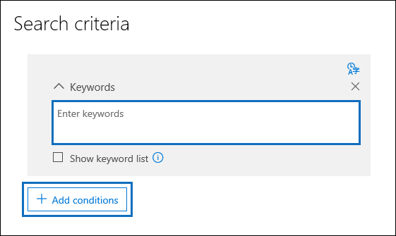

# 검색 쿼리 작성

검색 쿼리를 작성 하는 경우 키워드를 사용 하 여 검색 범위를 좁혀 조사에 가장 적합 한 항목을 반환할 수 있습니다.

## 키워드 검색

검색 쿼리의 **키워드** 상자에 키워드 쿼리를 입력 합니다. 키워드, 전자 메일 메시지 속성 (예: 보낸 날짜 및 받은 날짜가 동일) 또는 문서 속성 (예: 파일 이름 또는 문서를 마지막으로 변경한 날짜)을 지정할 수 있습니다. **and**, **OR**, **NOT**및 **NEAR**과 같은 부울 연산자를 사용 하는 보다 복잡 한 쿼리를 사용할 수 있습니다. 전자 메일 메시지에 포함 되지 않은 SharePoint 및 OneDrive의 문서에서 중요 한 정보 (예: 사회 보장 번호)를 검색 하거나 외부에서 공유한 문서를 검색할 수도 있습니다. **키워드** 상자를 비워 두면 지정 된 콘텐츠 위치에 있는 모든 콘텐츠가 검색 결과에 포함 됩니다.
    
또는 **키워드 목록 표시** 확인란을 클릭 하 고 각 행에 키워드나 키워드 구를 입력할 수 있습니다. 이 작업을 수행 하는 경우 각 행의 키워드는 생성 되는 검색 쿼리의 **OR** 연산자와 유사한 기능을 하는 논리 연산자 ( *c:s*로 표시 됨)에 의해 연결 됩니다. 즉, 모든 행에 키워드가 포함 된 항목이 검색 결과에 포함 됩니다.

키워드 목록을 사용 하는 이유 키워드 목록에서 각 키워드와 일치 하는 항목 수를 보여 주는 통계를 가져올 수 있습니다. 이를 통해 가장 (및 최소) 효율적인 키워드를 빠르게 식별할 수 있습니다. 키워드 목록에 있는 행에 괄호로 묶은 키워드 구를 사용할 수도 있습니다. 검색 통계에 대 한 자세한 내용은 [검색 통계](search-statistics.md)를 참조 하세요.

> [!NOTE]
> 큰 키워드 목록으로 인해 발생 하는 문제를 줄이기 위해 키워드 목록에는 최대 20 개의 행만 있을 수 있습니다.

## 조건
    
검색 조건을 추가 하 여 검색 범위를 좁히고 보다 구체화 된 결과 집합을 반환할 수 있습니다. 각 조건은 검색 쿼리에 검색을 시작할 때 만들어지고 실행 되는 절을 추가 합니다. 조건은 **AND** 연산자의 기능과 비슷한 논리 연산자 ( *c:c*로 표시 됨)에 의해 키워드 상자에 지정 된 키워드 쿼리에 논리적으로 연결 됩니다. 즉, 항목은 검색 결과에 포함할 키워드 쿼리와 하나 이상의 조건을 만족 해야 합니다. 조건은 이런 방식으로 결과 범위를 좁히는 데 도움이 됩니다. 검색 쿼리에 사용할 수 있는 조건에 대 한 목록 및 설명은 [키워드 쿼리 및 검색 조건의](../keyword-queries-and-search-conditions.md#search-conditions)"검색 조건" 섹션을 참조 하십시오.
