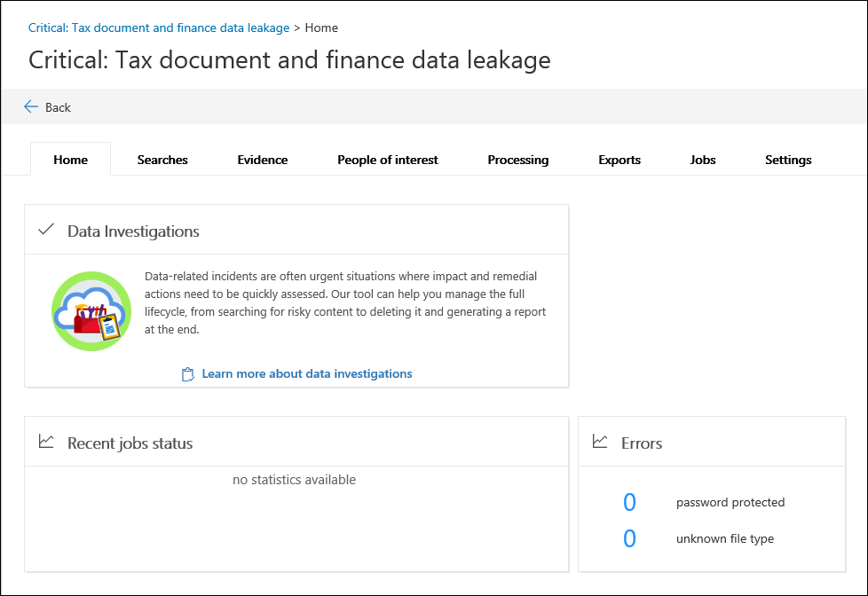

# 데이터 조사에서 새 조사 만들기 (미리 보기)

1. [https://compliance.microsoft.com](https://compliance.microsoft.com)으로 이동합니다.
    
2. 회사 또는 학교 계정을 사용 하 여 로그인 합니다.
    
3. 준수 센터에서 **데이터 조사**를 클릭 합니다.
 
4. **데이터 조사 (미리 보기)** 페이지에서 **새 조사 만들기**를 클릭 합니다.
    
5. **새 데이터 조사** 플라이 아웃 페이지에서 이름 (필수)을 확인 한 다음, 선택적 조사 번호 및 설명을 입력 합니다. 조사 이름은 조직 내에서 고유 해야 합니다.

6. **이 조사를 만든 후 추가 설정을 구성**하 시겠습니까?에서 다음 중 하나를 수행 합니다.

    - **예** 를 클릭 하 여 조사를 만들고 새 조사의 **설정** 페이지를 표시 합니다. 이를 통해 조사에 구성원을 추가할 수 있습니다.
    
    - 조사를 만들고 **데이터 조사 (미리 보기)** 페이지의 조사 목록에 표시 하려면 **아니요** 를 클릭 합니다. 이 옵션을 선택 하면 조사에 대 한 유일한 구성원으로 추가 되 고 기본 검색 및 분석 설정이 사용 됩니다. 조사가 만들어진 후 언제 든 지 구성원을 추가 하거나 설정을 변경할 수 있습니다.

7. **저장** 을 클릭 하 여 조사를 만듭니다.

    새 조사가 **데이터 조사 (미리 보기)** 페이지의 조사 목록에 표시 됩니다. 

8. 조사를 열려면 조사 이름을 클릭 합니다. 

    조사에 대 한 **홈** 탭이 표시 됩니다. 예를 들어 *중요: 세금 문서 및 재무 데이터 누출*이라는 새로운 조사가 여기에 나와 있습니다.

    
