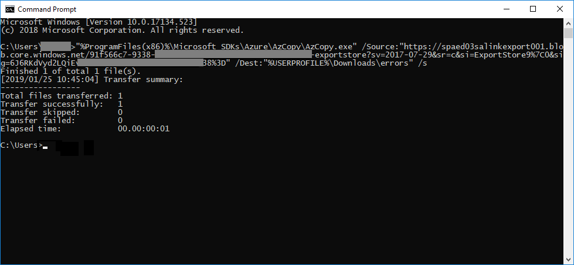

# 조사를 위해 데이터를 처리할 때의 오류 수정

오류 수정을 통해 데이터 조사 (미리 보기)가 콘텐츠를 제대로 처리 하지 않도록 하는 데이터 문제를 해결할 수 있습니다. 예를 들어 암호로 보호 된 파일은 파일을 잠그거나 암호화 한 후에 처리할 수 없습니다. 오류 수정을 사용 하 여 investigators에서 이러한 오류가 발생 한 파일을 다운로드 하 고, 암호 보호를 제거 하 고, 재구성 된 파일을 업로드할 수 있습니다.

다음 워크플로를 사용 하 여 데이터 조사 (미리 보기) 사례에서 오류가 발생 한 파일을 수정 합니다.

## 처리 오류가 발생 한 파일을 수정 하기 위한 오류 업데이트 관리 세션 만들기

>[!NOTE]
>다음 절차 중에 오류 수정 마법사를 언제 든 지 닫을 경우, **보기** 드롭다운 메뉴에서 **오류 remediations** 를 선택 하 여 **처리** 탭에서 오류 수정 세션으로 돌아갈 수 있습니다.

1. 데이터 조사 (미리 보기) 사례의 **처리** 탭에 있는 **보기** 드롭다운 메뉴에서 **오류** 를 선택 합니다.

2. 오류 유형 또는 파일 형식 옆의 라디오 단추를 클릭 하 여 수정할 오류를 선택 합니다.  다음 예제에서는 암호로 보호 된 파일을 수정 합니다.

3. **+ 새 오류 수정을**클릭 합니다.

    

    errored 파일을 다운로드 하기 위한 안전한 Azure 위치로 이동 하는 준비 단계부터 시작 하 여 오류 업데이트 관리 세션이 시작 됩니다.

    

4. 준비가 완료 되 면 **다음: 파일 다운로드** 를 클릭 하 여 다운로드를 계속 합니다.

    

5. 파일을 다운로드 하려면 **다운로드할 대상 경로**를 지정 합니다. 로컬 컴퓨터에서 파일을 다운로드 해야 하는 경로입니다.  기본 경로인%USERPROFILE%\Downloads\errors은 로그인 한 사용자의 다운로드 폴더를 가리킵니다. 이는 필요에 따라 변경할 수 있습니다.

    >[!NOTE]
    >최적의 성능을 위해 원격 네트워크 경로 대신 로컬 파일 경로를 사용 하는 것이 좋습니다.

    > [!NOTE]
    > AzCopy을 설치 하지 않은 경우 여기에서 설치할 수 있습니다.https://docs.microsoft.com/en-us/azure/storage/common/storage-use-azcopy

6. **클립보드에 복사를**클릭 하 여 미리 정의 된 명령을 복사 합니다. windows 명령 프롬프트를 시작 하 고 명령을 붙여 넣은 다음 enter 키 **** 를 누릅니다.  

    파일이 다운로드 됩니다.

    

     > [!NOTE]
     > 이 명령을 실행 하는 데 문제가 있는 경우 https://go.microsoft.com/fwlink/?linkid=2038117 문제 해결 팁을 참조 하십시오.

7. 파일을 다운로드 한 후에는 적절 한 도구를 사용 하 여 수정할 수 있습니다. 암호로 보호 된 파일의 경우에는 다양 한 암호 해독 도구를 사용할 수 있습니다. 파일에 대 한 암호를 알고 있으면 열고 암호 보호 기능을 제거할 수 있습니다.
    > [!NOTE]
    > tact에서 재구성 된 파일의 디렉터리 구조와 파일 이름은 유지 하는 것이 중요 합니다.  다운로드 한 파일 및 폴더에 사용 되는 모든 명명 규칙을 통해 remdiated 파일을 다시 원본에 연결할 수 있습니다.

8. 이제 데이터 조사 (미리 보기)로 돌아가 **다음: 파일 업로드**를 클릭 합니다.  이렇게 하면 이제 파일을 업로드할 수 있는 다음 단계로 이동 합니다.

    

9. **파일 위치 경로** 텍스트 상자에 재구성 된 파일의 위치를 지정한 다음 **clibpboard에 복사를**클릭 합니다.

10. Windows 명령 프롬프트에 명령을 붙여 넣고 enter 키를 **** 눌러 파일을 업로드 합니다.

    

11. 마지막으로 데이터 조사 (미리 보기)로 돌아가 **다음: 프로세스 파일**을 클릭 합니다.

12. 처리가 완료 되 면  작업 집합으로 돌아가 재구성 된 파일을 볼 수 있습니다.

## 파일을 수정 하는 경우 수행 되는 작업

재구성 한 파일을 업로드 하면 다음 필드를 제외 하 고 원래 메타 데이터가 보존 됩니다. 

- DocumentExtractedUrl
- ExtractedTextSize
- HasText
- IsErrorRemediate
- IsParentExtractedUrl
- ItemExtractedUrl
- LoadId
- ProcessingErrorMessage
- ProcessingStatus
- 텍스트
- WordCount
- WorkingsetId

데이터 조사 (미리 보기)의 모든 문서 메타 데이터 필드에 대 한 정의를 보려면 [문서 메타 데이터 필드](document-metadata-fields.md)를 참조 하십시오.