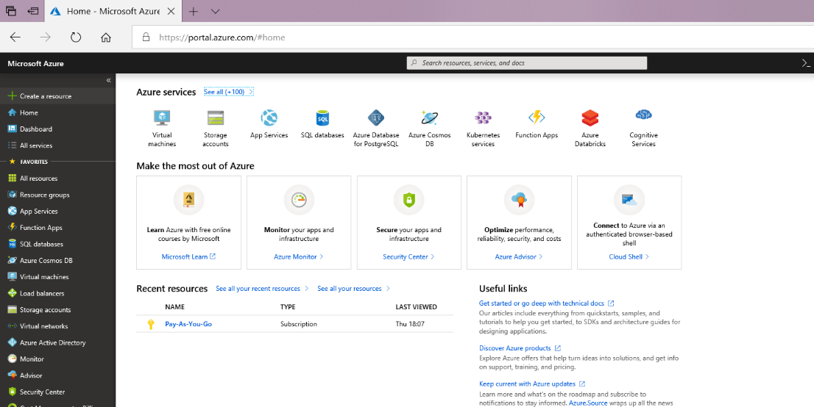
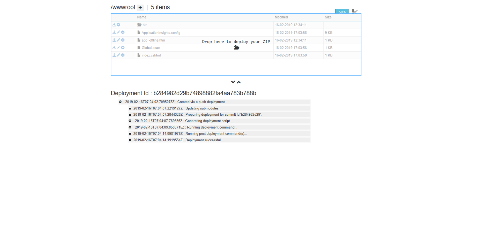
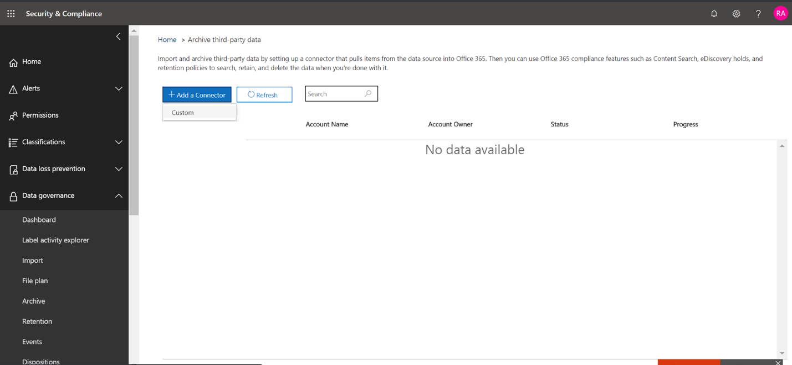
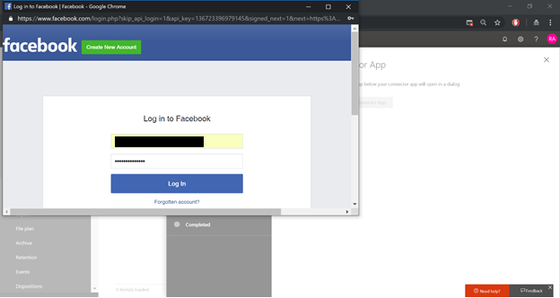

# Office 365에서 Facebook 데이터를 보관 하기 위한 커넥터 배포

이 문서에서는 office 365 가져오기 서비스를 사용 하 여 Facebook Business 페이지의 데이터를 office 365로 가져오는 커넥터를 배포 하는 단계별 프로세스를 소개 합니다. 이 프로세스에 대 한 간략 한 개요와 Facebook 커넥터를 배포 하는 데 필요한 필수 구성 요소 목록은 [Office 365에서 샘플 커넥터를 사용 하 여 타사 데이터 보관을](archive-third-party-data-with-sample-connector.md)참조 하십시오. 

## 1 단계: 패키지 다운로드

리포지토리에서 출시 섹션에서 미리 작성 된 패키지를 다운로드 <https://github.com/Microsoft/m365-sample-connector-csharp-aspnet/releases>합니다. 최신 버전의 경우 **SampleConnector**라는 zip 파일을 다운로드 합니다. 4 단계에서이 zip 파일을 Azure에 업로드 합니다.

## 2 단계: Azure Active Directory에 앱 만들기

1. 으로 이동 <https://portal.azure.com> 하 고 Office 365 전역 관리자 계정의 자격 증명을 사용 하 여 로그인 합니다.

    

2. 왼쪽 탐색 창에서 **Azure Active Directory**를 클릭 합니다.

    

3. 왼쪽 탐색 창에서 **앱 등록 (미리 보기)** 을 클릭 하 고 **새 등록**을 클릭 합니다.

    

4. 응용 프로그램을 등록 합니다. 리디렉션 uri의 응용 프로그램 형식 드롭다운 목록에서 웹을 선택한 다음 URI에 <https://portal.azure.com> 대 한 상자에 입력 합니다.

   

5. **응용 프로그램 (클라이언트) id** 및 **디렉터리 (테 넌 트) id** 를 복사한 다음 텍스트 파일 또는 기타 안전한 위치에 저장 합니다. 이러한 id는 이후 단계에서 사용 합니다.

   

6. **새 앱에 대 한 인증서 & 비밀으로 이동 합니다.**

   

7. **새 클라이언트 암호** 를 클릭 합니다.

   

8. 새 암호를 만듭니다. 설명 상자에 암호를 입력 하 고 만료 기간을 선택 합니다. 

    

9. 비밀 값을 복사 하 여 텍스트 파일 또는 기타 저장 위치에 저장 합니다. 이는 이후 단계에서 사용할 AAD 응용 프로그램 비밀입니다.

   

10. 다음 스크린샷에 표시 된 대로 **매니페스트로** 이동 하 여 identifierUris (AAD 응용 프로그램 Uri 라고도 함)를 복사 합니다. AAD 응용 프로그램 Uri를 텍스트 파일 또는 기타 저장 위치에 복사 합니다. 6 단계에서 사용 합니다.

   

## 3 단계: Azure storage 계정 만들기

1. 조직의 Azure 홈 페이지로 이동 합니다.

    

2. **리소스 만들기** 를 클릭 하 고 검색 상자에 **저장소 계정을** 입력 합니다.

    

3. **저장소**를 클릭 한 다음 **저장소 계정을**클릭 합니다.

    

4. **저장소 계정 만들기** 페이지의 구독 상자에서 사용 중인 Azure 구독 유형에 따라 **유료** 또는 **무료 평가판** 을 선택 합니다. 그런 다음 리소스 그룹을 선택 하거나 만듭니다.

    

5. 저장소 계정의 이름을 입력 합니다.

    

6. 검토 한 다음 **만들기** 를 클릭 하 여 저장소 계정을 만듭니다.

    

7. 잠시 후 **새로 고침** 을 클릭 하 고 **리소스로 이동을** 클릭 하 여 저장소 계정으로 이동 합니다.

    

8. 왼쪽 탐색 창에서 **Access 키** 를 클릭 합니다.

    

9. **연결 문자열** 을 복사 하 여 텍스트 파일 또는 기타 저장 위치에 저장 합니다. 이를 사용 하 여 웹 앱 리소스를 만들 수 있습니다.

    

## 4 단계: Azure에서 새 웹 앱 리소스 만들기

1. Azure portal의 **홈** 페이지에서 **모든 \> \> 리소스 만들기 웹 앱**을 클릭 합니다. **웹 앱** 페이지에서 **만들기**를 클릭 합니다. 

   

2. 아래와 같이 세부 정보를 입력 하 고 웹 앱을 만듭니다. **앱 이름** 상자에 입력 하는 이름은 Azure 앱 서비스 URL을 만드는 데 사용 됩니다. 예: fbconnector.azurewebsites.net.

   

3. 새로 만든 웹 앱 리소스로 이동 하 여 왼쪽 탐색 창에서 **응용 프로그램 설정을** 클릭 합니다. 응용 프로그램 설정에서 새 설정 추가를 클릭 하 고 다음 세 가지 설정을 추가 합니다. 이전 단계의 텍스트 파일에 복사한 값을 사용 합니다. 

    - **APISecretKey** – 임의의 값을 비밀로 입력할 수 있습니다. 이는 7 단계에서 커넥터 웹 앱에 액세스 하는 데 사용 됩니다.

    - **storageaccountconnectionstring** -3 단계에서 Azure storage 계정을 만든 후 복사한 연결 문자열 Uri입니다.

    - **tenantId** -2 단계에서 Azure Active Directory에 Facebook 커넥터 앱을 만든 후 복사한 Office 365 조직의 테 넌 트 ID입니다.

    

4. **일반 설정**에서 Always ( **** **켜기**) 옆의을 클릭 합니다. 페이지 맨 위에 있는 **저장** 을 클릭 하 여 applicaton 설정을 저장 합니다.

   

5. 마지막 단계에서는 1 단계에서 다운로드 한 Azure에 커넥터 응용 프로그램 소스 코드를 업로드 합니다. 웹 브라우저에서 scm.azurewebsites.net/ZipDeployUi로 이동 합니다.<AzureAppResourceName>https://. 예를 들어이 섹션의 2 단계에서 이름이 지정 된 Azure 앱 리소스의 이름이 **fbconnector**인 경우로 https://fbconnector.scm.azurewebsites.net/ZipDeployUi이동 합니다. 

6. 1 단계에서 다운로드 한 SampleConnector을이 페이지로 끌어서 놓습니다. 파일이 업로드 되 고 배포가 성공 하면 페이지는 다음 스크린샷과 유사 하 게 표시 됩니다.

   

## 5 단계: Facebook 앱 등록

1. <https://developers.facebook.com> 으로 이동 하 고 조직의 Facebook Business 페이지의 계정에 대 한 자격 증명을 사용 하 여 로그인 한 다음 **새 앱 추가**를 클릭 합니다.

   

2. 새 앱 ID를 만듭니다.

   

3. 왼쪽 탐색 창에서 **제품 추가** 를 클릭 한 다음 **Facebook 로그인** 타일에서 **설정을** 클릭 합니다.

   

4. Facebook 로그온 페이지에서 **웹**을 클릭 합니다.

   

5. Azure 앱 서비스 URL을 추가 합니다. 예를 https://fbconnector.azurewebsites.net들어

   

6. Facebook 로그인 설정의 퀵 스타트 섹션을 완료 합니다.

   

7. **Facebook 로그인**아래의 왼쪽 탐색 창에서 **설정을**클릭 하 고 **유효한 oauth 리디렉션 uri** 상자에 OAuth 리디렉션 URI를 추가 합니다. connectorserviceuri에 대 한 값이 조직의 Azure app 서비스 URL 인 ** \<connectorserviceuri>/Views/FacebookOAuth**형식을 사용 합니다. 예를 https://fbconnector.azurewebsites.net들어

   

8. 왼쪽 탐색 창에서 **제품 추가** 를 클릭 한 다음 **webhooks를 클릭 합니다.** **페이지** 풀 다운 메뉴에서 **페이지**를 클릭 합니다. 

   

9. webhooks 콜백 URL을 추가 하 고 verify token을 추가 합니다. 콜백 URL의 형식은 ** <connectorserviceuri>/api/FbPageWebhook**형식을 사용 하며, 여기서 connectorserviceuri의 값은 조직의 Azure 앱 서비스 URL입니다. 예를 https://fbconnector.azurewebsites.net들어 

    verify 토큰은 강력한 암호와 비슷해야 합니다. 텍스트 파일 또는 기타 저장소 위치에 verify 토큰을 복사 합니다.

     

10. 테스트 하 고 피드의 끝점을 구독 합니다.

    

11. 개인 정보 URL, 앱 아이콘 및 비즈니스 사용을 추가 합니다. 또한 앱 ID 및 앱 암호를 텍스트 파일 또는 기타 저장 위치에 복사 합니다.

    

12. 앱을 공용으로 설정 합니다.

    

13. 관리자 또는 테스터 역할에 사용자를 추가 합니다.

    

14. **페이지 공용 콘텐츠 액세스** 권한을 추가 합니다.

    

15. 페이지 관리 권한을 추가 합니다.

    

16. Facebook에서 검토 한 응용 프로그램을 가져옵니다.

    

## 6 단계: 커넥터 웹 응용 프로그램 구성

1. https://\<AzureAppResourceName> (여기서 AzureAppResourceName은 4 단계에서 이름이 지정 된 Azure 앱 리소스의 이름)으로 이동 합니다 (예: 이름이 **fbconnector**이면로 https://fbconnector.azurewebsites.net이동). 앱의 홈 페이지는 다음 스크린샷 처럼 표시 됩니다.

  

2. **구성을** 클릭 하 여 로그인 페이지를 표시 합니다.
 
   

3. 테 넌 트 id 상자에 2 단계에서 받은 테 넌 트 id를 입력 하거나 붙여 넣습니다. 암호 상자에 2 단계에서 구한 APISecretKey를 입력 하거나 붙여 넣은 다음 **구성 설정 설정을** 클릭 하 여 **구성 세부 정보** 페이지를 표시 합니다.

    

4. **구성 세부 정보**에서 다음 구성 설정을 입력 합니다. 

   - **facebook 응용 프로그램 id** -5 단계에서 가져온 facebook 응용 프로그램의 앱 ID입니다.
   - **facebook 응용 프로그램 비밀** -5 단계에서 얻은 facebook 응용 프로그램에 대 한 앱 비밀입니다.
   - **Facebook webhook 확인 토큰** -5 단계에서 만든 verify 토큰입니다.
   - **AAD 응용 프로그램 id** -2 단계에서 만든 Azure Active Directory 앱의 응용 프로그램 id
   - **AAD 응용 프로그램 비밀** -4 단계에서 만든 APISecretKey 암호의 값입니다.
   - **aad 응용 프로그램 uri** -2 단계에서 가져온 aad 응용 프로그램 uri 예를 https://microsoft.onmicrosoft.com/2688yu6n-12q3-23we-e3ee-121111123213들면입니다.
   - **App insights instrumentation 키** -이 상자를 비워 둡니다.

5. **저장** 을 클릭 하 여 커넥터 설정을 저장 합니다.

## 7 단계: 보안 & 준수 센터에서 사용자 지정 커넥터 설정

1. 로 이동한 <https://protection.office.com> 후 **데이터 거 버 넌 \> 스 \> 가져오기 보관 타사 데이터**를 클릭 합니다.

   

2.  **커넥터 추가** 를 클릭 한 다음 **사용자 지정**을 클릭 합니다.

    

3.  **커넥터 앱 추가** 페이지에서 다음 정보를 입력 하 고 **다음**을 클릭 합니다.

    - 첫 번째 상자에 **Facebook**과 같은 커넥터의 이름을 입력 합니다.
    - 두 번째 상자에 4 단계에서 추가한 APISecretKey의 값을 입력 하거나 붙여넣습니다.
    - 세 번째 상자에서 Azure 앱 서비스 URL에 붙여넣기를 입력 합니다. 예를 **https://fbconnector.azurewebsites.net**들어
    
    

4.  **커넥터 앱을 사용 하 여 로그인을**클릭 합니다.

    

5. APISecretKey를 다시 입력 하거나 붙여 넣은 다음 **커넥터 서비스에 로그인을**클릭 합니다.

   

6. **Facebook을 사용 하 여 로그인을 클릭 합니다.**

   

7. **facebook에 로그인** 페이지에서 조직의 Facebook Business 페이지에 대 한 계정의 자격 증명을 사용 하 여 로그인 합니다. 로그인 한 facebook 계정에 조직의 Facebook Business 페이지에 대 한 관리자 역할이 할당 되었는지 확인

   

8. **페이지 선택을** 클릭 하 여 Office 365에서 보관 하려는 조직의 비즈니스 페이지를 선택 합니다.

   

9. 로그인 한 Facebook 계정으로 관리 되는 비즈니스 페이지 목록이 표시 됩니다. 보관할 페이지를 선택 하 고 **저장**을 클릭 합니다.

    

10. **마침** 을 클릭 하 여 커넥터 서비스 앱의 설정을 종료 합니다.

    

11. **필터 설정** 페이지에서 특정 연령 인 항목을 가져오고 보관 하는 필터를 적용할 수 있습니다. **다음**을 클릭합니다.

    

12. **저장소 계정 설정** 페이지에서 이전에 선택한 Facebook 비즈니스 페이지의 항목을 가져올 Office 365 사서함을 선택 합니다.

    

13. 설정을 검토 하 고 **마침을** 클릭 하 여 Security & 준수 센터에서 커넥터 설정을 완료 합니다.

    

14. **타사 데이터 보관** 페이지로 이동 하 여 가져오기 프로세스의 진행 상황을 확인 합니다.

    
