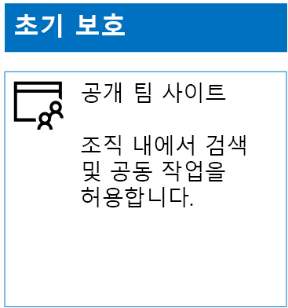
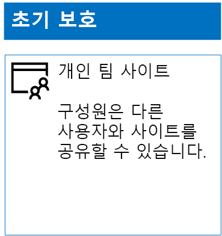
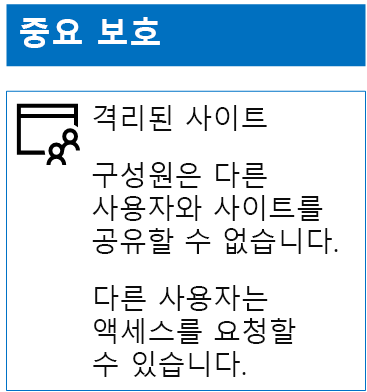
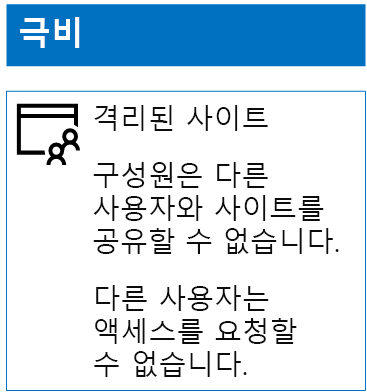

# 3단계 보호를 위한 SharePoint Online 사이트 배포Deploy SharePoint Online sites for three tiers of protection

 **요약:** 다양한 정보 보호 수준에 맞게 SharePoint Online 팀 사이트를 만들고 구성합니다.**Summary:** Create and configure SharePoint Online team sites for various levels of information protection.
  
이 문서의 단계를 사용하여 초기, 중요 및 극비 SharePoint Online 팀 사이트를 디자인하고 배포합니다. 이러한 3계층 보호에 대한 자세한 내용은 [SharePoint Online 사이트 및 파일 보호](secure-sharepoint-online-sites-and-files.md)를 참조하세요.Use the steps in this article to design and deploy baseline, sensitive, and highly confidential SharePoint Online team sites. For more information about these three tiers of protection, see [Secure SharePoint Online sites and files](secure-sharepoint-online-sites-and-files.md).
  
## 초기 SharePoint Online 팀 사이트Baseline SharePoint Online team sites

초기 보호에는 공용 및 개인 팀 사이트가 모두 포함됩니다. 공용 팀 사이트는 조직의 모든 사용자가 검색하고 액세스할 수 있습니다. 개인 사이트는 팀 사이트와 연결된 Office 365 그룹의 구성원만 검색하고 액세스할 수 있습니다. 이러한 유형의 팀 사이트 모두에서는 구성원이 다른 사용자와 사이트를 공유할 수 있습니다.Baseline protection includes both public and private team sites. Public team sites can be discovered and accessed by anybody in the organization. Private sites can only be discovered and accessed by members of the Office 365 group associated with the team site. Both of these types of team sites allow members to share the site with others.
  
### 공용Public

공용 액세스 및 권한이 있는 초기 SharePoint Online 팀 사이트를 만들려면 다음을 수행합니다.To create a baseline SharePoint Online team site with public access and permissions, do the following:
  
1. SharePoint Online 팀 사이트(SharePoint Online 관리자)를 관리하는 데에도 사용할 계정으로 Office 365 포털에 로그인합니다. 도움을 받으려면 [Office 365에 로그인하는 위치](https://support.office.com/Article/Where-to-sign-in-to-Office-365-e9eb7d51-5430-4929-91ab-6157c5a050b4)를 참조하세요.Sign in to the Office 365 portal with an account that will also be used to administer the SharePoint Online team site (a SharePoint Online administrator). For help, see [Where to sign in to Office 365](https://support.office.com/Article/Where-to-sign-in-to-Office-365-e9eb7d51-5430-4929-91ab-6157c5a050b4).
    
2. 타일 목록에서 **SharePoint**를 클릭합니다.In the list of tiles, click **SharePoint**.
    
3. 브라우저의 새 **SharePoint** 탭에서 **+ 사이트 만들기**를 클릭합니다.On the new **SharePoint** tab in your browser, click **+ Create site**.
    
4. **사이트 만들기** 페이지에서 **팀 사이트**를 클릭합니다.On the **Create a site** page, click **Team site**.
    
5. **사이트 이름**에서 공용 팀 사이트의 이름을 입력합니다.In **Site name**, type a name for the public team site. 
    
6. **팀 사이트 설명**에서 사이트의 목적에 대한 설명을 입력합니다.In **Team site description**, type a description of the purpose of the site.
    
7. **개인 정보 설정**에서 **공개 – 조직의 모든 사용자가 이 사이트에 액세스할 수 있습니다.** 를 선택하고 **다음**을 클릭합니다.In **Privacy settings**, select **Public - anyone in the organization can access this site**, and then click **Next**.
    
8. **어떤 사람을 추가하시겠습니까?** 창에서 **마침**을 클릭합니다.On the **Who do you want to add?** pane, click **Finish**.
    
구성 결과는 다음과 같습니다.Here is your resulting configuration.
  

  
### 개인Private

개인 액세스 및 권한이 있는 초기 SharePoint Online 팀 사이트를 만들려면 다음을 수행합니다.To create a baseline SharePoint Online team site with private access and permissions, do the following:
  
1. SharePoint Online 팀 사이트(SharePoint Online 관리자)를 관리하는 데에도 사용할 계정으로 Office 365 포털에 로그인합니다. 도움을 받으려면 [Office 365에 로그인하는 위치](https://support.office.com/Article/Where-to-sign-in-to-Office-365-e9eb7d51-5430-4929-91ab-6157c5a050b4)를 참조하세요.Sign in to the Office 365 portal with an account that will also be used to administer the SharePoint Online team site (a SharePoint Online administrator). For help, see [Where to sign in to Office 365](https://support.office.com/Article/Where-to-sign-in-to-Office-365-e9eb7d51-5430-4929-91ab-6157c5a050b4).
    
2. 타일 목록에서 **SharePoint**를 클릭합니다.In the list of tiles, click **SharePoint**.
    
3. 브라우저의 새 **SharePoint** 탭에서 **+ 사이트 만들기**를 클릭합니다.On the new **SharePoint** tab in your browser, click **+ Create site**.
    
4. **사이트 만들기** 페이지에서 **팀 사이트**를 클릭합니다.On the **Create a site** page, click **Team site**.
    
5. **사이트 이름**에서 개인 팀 사이트의 이름을 입력합니다.In **Site name**, type a name for the private team site. 
    
6. **팀 사이트 설명**에서 사이트의 목적에 대한 설명을 입력합니다.In **Team site description,** type a description of the purpose of the site.
    
7. **개인 정보 설정**에서 **비공개 – 구성원만 이 사이트에 액세스할 수 있습니다.** 를 선택하고 **다음**을 클릭합니다.In **Privacy settings**, select **Private - only members can access this site**, and then click **Next**.
    
8. **누구를 추가하시겠습니까?** 창의 **구성원 추가**에서 이 개인 팀 사이트에 액세스할 수 있는 사용자 계정의 이름을 입력합니다.On the **Who do you want to add?** pane, in **Add members**, type the names of user accounts that have access to this private team site.
    
9. 초기 구성원 집합을 사이트에 추가했으면 **마침**을 클릭합니다.When you are done adding the initial set of members to the site, click **Finish**
    
구성 결과는 다음과 같습니다.Here is your resulting configuration.
  

  
## 중요 SharePoint Online 팀 사이트Sensitive SharePoint Online team sites

중요 SharePoint Online 팀 사이트는 격리된 팀 사이트이며, 팀 사이트와 연결된 Office 365 그룹의 구성원 자격 대신 SharePoint 그룹의 구성원 자격을 통해 권한이 제어됩니다.A sensitive SharePoint Online team site is an isolated team site, which means that permissions are controlled through membership in SharePoint groups instead of membership in the Office 365 group associated with the team site.
  
다음 두 가지 주요 단계에 따라 격리된 팀 사이트를 만들 수 있습니다.To create an isolated team site, there are two main steps.
  
### 1단계: 고립된 사이트 디자인Step 1: Design your isolated site

격리된 팀 사이트를 디자인하려면 다음을 결정해야 합니다.To design your isolated team site, you need to determine:
  
- SharePoint 그룹 및 권한 수준Your SharePoint groups and permission levels.
    
- SharePoint 그룹의 구성원이 될 액세스 그룹 집합 -The set of access groups that will be members of your SharePoint groups.
    
     권장되는 액세스 그룹 집합은 사이트 구성원, 사이트 뷰어 및 사이트 관리자에 대해 하나씩 구성된 액세스 그룹 집합입니다.The recommended set of access groups is one for site members, one for site viewers, and one for site administrators.
    
- 액세스 그룹 내에서 중첩된 그룹을 사용할지 여부Whether you will use nested groups within your access groups.
    
예를 들어 권장되는 그룹 구조와 권한 수준은 다음과 같습니다.For example, the recommended group structure and permission levels look like this:
  
|**SharePoint 그룹****SharePoint group**|**권한 수준****Permission level**|**액세스 그룹(예제)****Access group (examples)**|
|:-----|:-----|:-----|
|[사이트 이름] 구성원[site name] Members    |편집Edit    |[사이트 이름] 구성원[site name] Members    |
|[사이트 이름] 방문자[site name] Visitors    |읽기Read    |[사이트 이름] 뷰어[site name] Viewers    |
|[사이트 이름] 소유자[site name] Owners    |모든 권한Full control    |[사이트 이름] 관리자[site name] Admins    |
   
SharePoint 그룹 및 권한 수준은 기본적으로 팀 사이트에 대해 만들어집니다. 액세스 그룹의 이름을 결정해야 합니다.The SharePoint groups and permission levels are created by default for a team site. You need to determine the names of your access groups.
  
디자인 프로세스에 대한 자세한 내용은 [격리된 SharePoint Online 팀 사이트 디자인](design-an-isolated-sharepoint-online-team-site.md)을 참조하세요.For the details of the design process, see [Design an isolated SharePoint Online team site](design-an-isolated-sharepoint-online-team-site.md).
  
### 2단계: 격리된 사이트 배포Step 2: Deploy your isolated site

격리된 사이트를 배포하려면 먼저 다음을 수행해야 합니다.To deploy your isolated site, you first need to:
  
- 각 액세스 그룹에 추가할 사용자 계정 및 그룹을 결정합니다.Determine the user accounts and groups to add to each of your access groups.
    
- 액세스 그룹을 만들고 사용자 및 그룹 구성원을 추가합니다.Create the access groups and add the user and group members.
    
자세한 단계는 [격리된 SharePoint Online 팀 사이트 배포](deploy-an-isolated-sharepoint-online-team-site.md)의 **1단계**를 참조하세요.For the detailed steps, see **Phase 1** of [Deploy an isolated SharePoint Online team site](deploy-an-isolated-sharepoint-online-team-site.md).
  
다음 단계를 사용하여 SharePoint Online 팀 사이트를 만듭니다.Next, you create the SharePoint Online team site with these steps.
  
1. SharePoint Online 팀 사이트(SharePoint Online 관리자)를 관리하는 데에도 사용할 계정으로 Office 365 포털에 로그인합니다. 도움을 받으려면 [Office 365에 로그인하는 위치](https://support.office.com/Article/Where-to-sign-in-to-Office-365-e9eb7d51-5430-4929-91ab-6157c5a050b4)를 참조하세요.Sign in to the Office 365 portal with an account that will also be used to administer the SharePoint Online team site (a SharePoint Online administrator). For help, see [Where to sign in to Office 365](https://support.office.com/Article/Where-to-sign-in-to-Office-365-e9eb7d51-5430-4929-91ab-6157c5a050b4).
    
2. 타일 목록에서 **SharePoint**를 클릭합니다.In the list of tiles, click **SharePoint**.
    
3. 브라우저의 새 **SharePoint 탭**에서 + **사이트 만들기**를 클릭합니다.In the new **SharePoint** tab of your browser, click **+ Create site**.
    
4. **사이트 만들기** 페이지에서 **팀 사이트**를 클릭합니다.On the **Create a site** page, click **Team site**.
    
5. **사이트 이름**에서 개인 팀 사이트의 이름을 입력합니다.In **Site name**, type a name for the private team site.
    
6. **팀 사이트** 설명에서 선택적 설명을 입력합니다.In **Team site description**, type an optional description.
    
7. **개인 정보 설정**에서 **비공개 – 구성원만 이 사이트에 액세스할 수 있습니다.** 를 선택하고 **다음**을 클릭합니다.In **Privacy settings**, select **Private - only members can access this site**, and then click **Next**.
    
8. **어떤 사람을 추가하시겠습니까?** 창에서 **마침**을 클릭합니다.On the **Who do you want to add?** pane, click **Finish**.
    
다음으로, 새 SharePoint Online 팀 사이트에서 다음 단계를 사용하여 권한을 구성합니다.Next, from the new SharePoint Online team site, configure permissions with these steps.
  
1. IT 관리자 또는 사이트에 대한 액세스 요청에 응답하고 처리할 책임이 있는 다른 사용자(belindan@contoso.com - UPN의 한 가지 예)의 UPN(사용자 계정 이름)을 결정합니다. 해당 UPN을 여기에 작성합니다. Determine the User Principal Name (UPN) of the IT administrator or other person who will be responsible for responding to and addressing requests for access to the site (belindan@contoso.com is an example of a UPN). Write that UPN here: .
    
2. 도구 모음에서 설정 아이콘을 클릭한 다음, **사이트 권한**을 클릭합니다.In the tool bar, click the settings icon, and then click **Site permissions**.
    
3. **사이트 권한** 창에서 **고급 권한 설정**을 클릭합니다.In the **Site permissions** pane, click **Advanced permissions settings**.
    
4. 브라우저의 새 **권한** 탭에서 **액세스 요청 설정**을 클릭합니다.On the new **Permissions** tab of your browser, click **Access Request Settings**.
    
5. **액세스 요청 설정** 대화 상자에서 다음을 수행합니다.In the **Access Requests Settings** dialog box:
    
  - **구성원이 사이트와 개별 파일 및 폴더를 공유할 수 있도록 허용합니다.** 및 **구성원이 다른 사용자들을 사이트 구성원 그룹에 초대할 수 있도록 허용합니다.** 확인란의 선택을 취소합니다.Clear the **Allow members to share the site and individual files and folders** and **Allow members to invite others to the site members group** check boxes.
    
  - **모든 액세스 요청 보내기**의 1단계에서 IT 관리자의 UPN을 입력합니다.Type the UPN of your IT administrator from step 1 in **Send all requests for access**.
    
  - **확인**을 클릭합니다.Click **OK**.
    
6. 브라우저의 **권한** 탭에서 목록의 **[사이트 이름] 구성원**을 클릭합니다.On the **Permissions** tab of your browser, click **[site name] Members** in the list.
    
7. **사용자 및 그룹**에서 **새로 만들기**를 클릭합니다.In **People and Groups**, click **New**.
    
8. **공유** 대화 상자에서 이 사이트에 대한 사이트 구성원 액세스 그룹 이름을 입력하고, 이 이름을 선택한 다음, **공유**를 클릭합니다.In the **Share** dialog box, type the name of your site members access group for this site, select it, and then click **Share**.
    
9. 브라우저에서 뒤로 단추를 클릭합니다.Click the back button on your browser.
    
10. 목록에서 **[사이트 이름] 소유자**를 클릭합니다.Click **[site name] Owners** in the list.
    
11. **사용자 및 그룹**에서 **새로 만들기**를 클릭합니다.In **People and Groups**, click **New**.
    
12. **공유** 대화 상자에서 이 사이트에 대한 사이트 관리자 액세스 그룹 이름을 입력하고, 이 이름을 선택한 다음, **공유**를 클릭합니다.In the **Share** dialog box, type the name of the site administrators access group for this site, select it, and then click **Share**.
    
13. 브라우저에서 뒤로 단추를 클릭합니다.Click the back button on your browser.
    
14. 목록에서 **[사이트 이름] 방문자**를 클릭합니다.Click **[site name] Visitors** in the list.
    
15. **사용자 및 그룹**에서 **새로 만들기**를 클릭합니다.In **People and Groups**, click **New**.
    
16. **공유** 대화 상자에서 이 사이트에 대한 사이트 뷰어 액세스 그룹 이름을 입력하고, 이 이름을 선택한 다음, **공유**를 클릭합니다.In the **Share** dialog box, type the name of the site viewers access group for this site, select it, and then click **Share**.
    
17. 브라우저의 **권한** 탭을 닫습니다.Close the **Permissions** tab of your browser.
    
이러한 권한 설정의 결과는 다음과 같습니다.The results of these permission settings are:
  
- **[사이트 이름] 소유자** SharePoint 그룹에는 모든 구성원이 **모든 권한** 수준을 갖는 사이트 관리자 액세스 그룹이 포함되어 있습니다.The **[site name] Owners** SharePoint group contains the site administrators access group, in which all the members have the **Full control** permission level.
    
- **[사이트 이름] 구성원** SharePoint 그룹에는 모든 구성원이 **편집** 권한 수준을 갖는 사이트 구성원 액세스 그룹이 포함되어 있습니다.The **[site name] Members** SharePoint group contains the site members access group, in which all the members have the **Edit** permission level.
    
- **[사이트 이름] 방문자** SharePoint 그룹에는 모든 구성원이 **읽기** 권한 수준을 갖는 사이트 뷰어 액세스 그룹이 포함되어 있습니다.The **[site name] Visitors** SharePoint group contains the site viewers access group, in which all the members have the **Read** permission level.
    
- 구성원이 다른 구성원을 초대하는 기능은 사용할 수 없습니다.The ability for members to invite other members is disabled.
    
- 구성원이 아닌 사용자가 액세스를 요청하는 기능은 사용할 수 있습니다.The ability for non-members to request access is enabled.
    
구성 결과는 다음과 같습니다.Here is your resulting configuration.
  

  
사이트 구성원은 이제 액세스 그룹 중 하나의 그룹 구성원 자격을 통해 사이트의 리소스에서 안전하게 공동 작업할 수 있습니다.The members of the site, through group membership in one of the access groups, can now securely collaborate on the resources of the site.
  
## 극비 SharePoint Online 팀 사이트Highly confidential SharePoint Online team sites

극비 SharePoint Online 팀 사이트는 격리된 팀 사이트이며, 팀 사이트와 연결된 Office 365 그룹의 구성원 자격 대신 SharePoint 그룹의 구성원 자격을 통해 권한이 제어됩니다.A highly confidential SharePoint Online team site is an isolated team site, which means that permissions are controlled through membership in SharePoint groups instead of membership in the Office 365 group associated with the team site.
  
매우 중요한 기밀에 속하는 정보와 공동 작업을 위해 격리된 팀 사이트를 만들려면 다음 두 가지 주요 단계가 있습니다.To create an isolated team site for highly confidential information and collaboration, there are two main steps.
  
### 1단계: 고립된 사이트 디자인Step 1: Design your isolated site

격리된 팀 사이트를 디자인하려면 다음을 결정해야 합니다.To design your isolated team site, you need to determine:
  
- SharePoint 그룹 및 권한 수준Your SharePoint groups and permission levels.
    
- SharePoint 그룹의 구성원이 될 액세스 그룹 집합 -The set of access groups that will be members of your SharePoint groups.
    
     권장되는 액세스 그룹 집합은 사이트 구성원, 사이트 뷰어 및 사이트 관리자에 대해 하나씩 구성된 액세스 그룹 집합입니다.The recommended set of access groups is one for site members, one for site viewers, and one for site administrators.
    
- 액세스 그룹 내에서 중첩된 그룹을 사용할지 여부Whether you will use nested groups within your access groups.
    
예를 들어 권장되는 그룹 구조와 권한 수준은 다음과 같습니다.For example, the recommended group structure and permission levels look like this:
  
|**SharePoint 그룹****SharePoint group**|**권한 수준****Permission level**|**액세스 그룹(예제)****Access group (examples)**|
|:-----|:-----|:-----|
|[사이트 이름] 구성원[site name] Members    |편집Edit    |[사이트 이름] 구성원[site name] Members    |
|[사이트 이름] 방문자[site name] Visitors    |읽기Read    |[사이트 이름] 뷰어[site name] Viewers    |
|[사이트 이름] 소유자[site name] Owners    |모든 권한Full control    |[사이트 이름] 관리자[site name] Admins    |
   
SharePoint 그룹 및 권한 수준은 기본적으로 팀 사이트에 대해 만들어집니다. 액세스 그룹의 이름을 결정해야 합니다.The SharePoint groups and permission levels are created by default for a team site. You need to determine the names of your access groups.
  
디자인 프로세스에 대한 자세한 내용은 [격리된 SharePoint Online 팀 사이트 디자인](design-an-isolated-sharepoint-online-team-site.md)을 참조하세요.For the details of the design process, see [Design an isolated SharePoint Online team site](design-an-isolated-sharepoint-online-team-site.md).
  
### 2단계: 격리된 사이트 배포Step 2: Deploy your isolated site

격리된 사이트를 배포하려면 먼저 다음을 수행해야 합니다.To deploy your isolated site, you first need to:
  
- 각 액세스 그룹의 사용자 및 그룹 구성원을 확인합니다.Determine the user and group members of each of your access groups
    
- 액세스 그룹을 만들고 사용자 및 그룹 구성원을 추가합니다.Create the access groups and add the user and group members
    
- 액세스 그룹을 사용하는 격리된 팀 사이트를 만듭니다.Create an isolated team site that uses your access groups
    
자세한 단계는 [격리된 SharePoint Online 팀 사이트 배포](deploy-an-isolated-sharepoint-online-team-site.md)를 참조하세요.For the detailed steps, see [Deploy an isolated SharePoint Online team site](deploy-an-isolated-sharepoint-online-team-site.md).
  
권한 설정의 결과는 다음과 같습니다.The results of the permission settings are:
  
- **[사이트 이름] 소유자** SharePoint 그룹에는 모든 구성원이 **모든 권한** 수준을 갖는 사이트 관리자 액세스 그룹이 포함되어 있습니다.The **[site name] Owners** SharePoint group contains the site administrators access group, in which all the members have the **Full control** permission level.
    
- **[사이트 이름] 구성원** SharePoint 그룹에는 모든 구성원이 **편집** 권한 수준을 갖는 사이트 구성원 액세스 그룹이 포함되어 있습니다.The **[site name] Members** SharePoint group contains the site members access group, in which all the members have the **Edit** permission level.
    
- **[사이트 이름] 방문자** SharePoint 그룹에는 모든 구성원이 **읽기** 권한 수준을 갖는 사이트 뷰어 액세스 그룹이 포함되어 있습니다.The **[site name] Visitors** SharePoint group contains the site viewers access group, in which all the members have the **Read** permission level.
    
- 구성원이 다른 구성원을 초대하는 기능은 사용할 수 없습니다.The ability for members to invite other members is disabled.
    
- 구성원이 아닌 사용자가 액세스를 요청하는 기능은 사용할 수 없습니다.The ability for non-members to request access is disabled.
    
구성 결과는 다음과 같습니다.Here is your resulting configuration.
  

  
사이트 구성원은 이제 액세스 그룹 중 하나의 그룹 구성원 자격을 통해 사이트의 리소스에서 안전하게 공동 작업할 수 있습니다.The members of the site, through group membership in one of the access groups, can now securely collaborate on the resources of the site.
  
## 다음 단계Next step

[Azure Information Protection을 사용한 SharePoint Online 파일 보호Protect SharePoint Online files with Azure Information Protection](protect-sharepoint-online-files-with-azure-information-protection.md)

## 참고 항목See also

[SharePoint Online 사이트 및 파일 보호Secure SharePoint Online sites and files](secure-sharepoint-online-sites-and-files.md)
  
[정치적 캠페인, 비영리 조직 및 기타 기밀 조직을 위한 Microsoft 보안 지침Microsoft Security Guidance for Political Campaigns, Nonprofits, and Other Agile Organizations](microsoft-security-guidance-for-political-campaigns-nonprofits-and-other-agile-o.md)
  
[클라우드 도입 및 하이브리드 솔루션Cloud adoption and hybrid solutions](https://docs.microsoft.com/office365/enterprise/cloud-adoption-and-hybrid-solutions)

