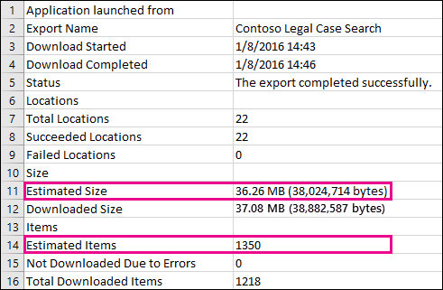

# Office 365의 예상 및 실제 eDiscovery 검색 결과 차이Differences between estimated and actual eDiscovery search results in Office 365

이 항목은 다음 Microsoft eDiscovery 도구 중 하나를 사용 하 여 실행할 수 있는 검색에 적용 됩니다.This topic applies to searches that you can run using one of the following Microsoft eDiscovery tools:     
- Office 365 보안에서 검색 콘텐츠 &amp; 준수 센터Content Search in the Office 365 Security &amp; Compliance Center     
- Exchange 관리 센터 (EAC)의 원본 위치 eDiscoveryIn-Place eDiscovery in the Exchange admin center (EAC)     
- SharePoint Onlin의 eDiscovery 센터The eDiscovery Center in SharePoint Online    
   
EDiscovery 검색을 실행 하면 사용 중인 도구에는 검색 조건을 만족 하는 항목 수 (및 해당 총 크기)의 예상을 반환 됩니다. 예, 실행할 때 검색 보안에서 &amp; 준수 센터, 예상된 검색 결과 선택한 검색에 대 한 세부 정보 창에 표시 됩니다.When you run an eDiscovery search, the tool you're using will return an estimate of the number of items (and their total size) that meet the search criteria. For example, when you run a search in the Security &amp; Compliance Center, the estimated search results are displayed in the details pane for the selected search.
  

  
동일한의 예상 전체 크기 및 ediscovery 내보내기 도구는 로컬 컴퓨터에 결과 내보낼 때 하 고 검색 결과 함께 다운로드 하는 내보내기 요약 보고서에 표시 되는 항목 수입니다.This is the same estimate of total size and number of items that is displayed in the eDiscovery Export Tool when you export results to a local computer and in the Export Summary report that's downloaded with the search results.
  
**EDiscovery 내보내기 도구에서에서 예상된 결과****Estimated results in the eDiscovery Export Tool**

  
**내보내기 요약 보고서의 예상된 결과****Estimated results in Export Summary report**

  
그러나 이전 스크린샷 내보내기 요약 보고서에서에서 보면 처럼 실제로 다운로드 되는 실제 검색 결과의 수와 크기는 예상된 검색 결과의 수와 크기와 다릅니다.However, as you'll notice in the previous screenshot of the Export Summary report, the size and number of actual search results that are actually downloaded are different than the size and number of estimated search results. 
  

  
다음과 같은 경우 이러한 차이점에 대 한 사항은 다음과 같습니다.Here are some reasons for these differences:
  
- **방식으로 결과 예상** -검색 결과 예상은 검색 쿼리 조건을 충족 하는 항목의 예상 (및 실제 횟수). Exchange 항목의 예상을 컴파일하려면 메시지 검색 조건을 만족 하는 Id의 목록이 eDiscovery 도구를 사용 하 여 Exchange 데이터베이스에서 요청 됩니다. 하지만 검색 결과 내보낼 때 검색을 다시 실행 하 고 실제 메시지 Exchange 데이터베이스에서 검색 됩니다. 따라서 이러한 차이 항목 수가 예상된 및 실제 항목 수가 결정 되는 방식으로 인해 발생할 수 있습니다.**The way results are estimated** - An estimate of the search results are just that, an estimate (and not an actual count) of the items that meet the search query criteria. To compile the estimate of Exchange items, a list of the message IDs that meet the search criteria is requested from the Exchange database by the eDiscovery tool you're using. But when you export the search results, the search is re-run and the actual messages are retrieved from the Exchange database. So these differences might result because of how the estimated number of items and the actual number of items are determined. 
    
- 모든 **변경 내용을 때 예상 및 내보내기 (영문) 검색 결과 시간 간에 발생 하는** -검색 결과 내보낼 때 검색은 검색 조건을 만족 하는 검색 인덱스에서 가장 최근의 해당 항목을 수집 다시 시작 합니다. 추가적인 수 항목이 만들어진, 예상된 검색 결과 수집 된 경우 된 검색 결과 내보낼 때 사이의 시간에 검색 조건에 맞지 않는 보내거나 받은 합니다. 항목이 검색 결과 예상 된 때와 같은 검색 인덱스에 있던 지 더이상 다음과 같은 검색 결과 내보내도록 전에 콘텐츠 위치에서 제거 된 때문에 가능한 이기도 합니다. 이 문제를 완화 하기 위해는 한 가지 방법은 eDiscovery 검색에 대 한 날짜 범위를 지정 하는 것입니다. 다른 방법은 항목 유지 되어 있고 제거할 수 없는 되도록 콘텐츠 위치에 보류를 보관 하는 것입니다.**Changes that happen between the time when estimating and exporting search results** - When you export search results, the search is re-started to collect that most recent items in the search index that meet the search criteria. It's possible there are additional items were created, sent, or received that meet the search criteria in the time between when the estimated search results were collected and when the search results were exported. It's also possible that items that were in the search index when the search results were estimated are no longer there because they were purged from the content location before the search results are exported. One way to mitigate this issue is to specify a date range for an eDiscovery search. Another way is to place a hold on content locations so that items are preserved and can't be purged. 
    
- **인덱싱되지 않은 항목** -검색을 위한 인덱싱된 아닌 항목에 예상 및 실제 검색 결과 간의 차이 일으킬 수 있습니다. 예, Exchange 및 SharePoint에서 eDiscovery 센터의 원본 위치 eDiscovery 하지 인덱싱되지 않은 항목이 포함 (검색 조건에 맞지 않는) 검색 결과 예측에 대 한 검색을 실행 하면 됩니다. 하지만 검색 결과 내보낼 때 인덱싱되지 않은 항목을 포함할 수 있습니다. 검색 결과 내보낼 때 인덱싱되지 않은 항목을 포함 하면 내보내도록 많은 항목이 있을 수 있습니다. 이렇게 하면 예상 하 고 내보낸 검색 결과는 차이가 발생 합니다.**Unindexed items** - Items that are unindexed for search can cause differences between estimated and actual search results. For example, In-Place eDiscovery in Exchange and the eDiscovery Center in SharePoint don't include unindexed items (that don't meet the search criteria) when you run a search to estimate the search results. But you can include unindexed items when you export the search results. If you include unindexed items when exporting search results, there might be more items that are exported. This will cause a difference between the estimated and exported search results. 
    
    보안에서 콘텐츠 검색 도구를 사용 하는 경우 &amp; 준수 센터 해야 검색 예측에 인덱싱되지 않은 항목을 포함 하는 옵션입니다. 검색에 의해 반환 되는 인덱싱되지 않은 항목 수는 다른 예상된 검색 결과 함께 세부 정보 창에 나열 됩니다. 인덱싱되지 않은 항목을 모두 예상된 검색 결과의 총 크기에도 포함 됩니다. 검색 결과 내보낼 때 포함 하거나 인덱싱되지 않은 항목을 포함 하지는 옵션을 해야 합니다. 차이점 초래할 수 이러한 옵션을 구성 하는 방법 간의 예상 및 실제 검색 결과 다운로드 됩니다.When using the Content Search tool in the Security &amp; Compliance Center, you have the option to include unindexed items in the search estimate. The number of unindexed items returned by the search is listed in the details pane together with the other estimated search results. Any unindexed items would also be included in the total size of the estimated search results. When you export search results, you have the option to include or not include unindexed items. How you configure these options might result in differences between estimated and the actual search results that are downloaded. 
    
- **모든 콘텐츠 위치를 포함 하는 콘텐츠 검색 결과 내보내기 (영문)** -검색 결과를 내보내려는 조직 한 다음이 포함 된 콘텐츠 위치에서 인덱싱되지 않은 항목에만 다운로드에 모든 콘텐츠 위치의 검색 한 경우 검색 조건과 일치 하는 항목을 내보냅니다. 즉, 검색 하는 결과가 없으면 사서함 이나 사이트에서 발견 되 면 다음 해당 사서함 또는 사이트에 있는 모든 인덱싱되지 않은 항목 없습니다 내보낼 수 있습니다. 그러나 인덱싱되지 않은 항목 (하더라도 해당 검색 쿼리와 일치 하는 항목을 포함 하지 않는) 모든 콘텐츠 위치에서 예상된 검색 결과에 포함 됩니다.**Exporting the results of a Content Search that includes all content locations** - If the search that you're exporting results from was a search of all content locations in your organization, then only the unindexed items from content locations that contain items that match the search criteria will be exported. In other words, if no search results are found in a mailbox or site, then any unindexed items in that mailbox or site won't be exported. However, unindexed items from all content locations (even those that don't contain items that match the search query) will be included in the estimated search results. 
    
    또는 검색 결과를 내보내려는 특정 콘텐츠 위치를 포함 하는 경우 다음 인덱싱되지 않은 항목 (검색 조건에 의해 제외 되지 않은) 검색에 지정 된 모든 콘텐츠 위치에서 내보냅니다. 이 경우 예상된 인덱싱되지 않은 항목 수 및 실제로 내보낸 인덱싱되지 않은 항목 수가 동일 해야 합니다.Alternatively, if the search that you're exporting results from included specific content locations, then unindexed items (that aren't excluded by the search criteria) from all the content locations specified in the search will be exported. In this case, the estimated number of unindexed items and the number of unindexed items actually exported should be the same.
    
    내보내기 오류의 가능성을 높이기 하 고 내보내기 및 검색 결과 다운로드 하는데 걸리는 시간을 늘릴 수 있기 때문에 나타나는 하지는 조직에서 모든 위치에서 인덱싱되지 않은 항목을 내보내기에 대 한 이유는 합니다.The reason for not exporting unindexed items from every location in the organization is because it might increase the likelihood of export errors and increase the time it takes to export and download the search results.
    
- **내보낸된 파일 형식으로 제공과 원시 파일 형식** -Exchange에 대 한 항목을 검색 결과의 예상된 크기는 원시 Exchange 메시지 크기를 사용 하 여 계산 됩니다. 그러나 PST 파일 또는 개별 메시지 (있는 EML 파일 서식이 지정 된)으로 전자 메일 메시지를 내보냅니다. 이러한 내보내기 옵션 사용 하 여 다른 파일을 모두 으로부터의 예상된 파일 크기 보다 다르게 설정 하는 총 내보낸된 파일 크기는 원시 Exchange 메시지의 서식을 지정 합니다.**Raw file formats versus exported file formats** - For Exchange items, the estimated size of the search results is calculated by using the raw Exchange message sizes. However, email messages are exported in a PST file or as individual messages (which are formatted as EML files). Both of these export options use a different file format that raw Exchange messages, which results in the total exported file size being different than the estimated file size. 
    
- **문서 버전을** -SharePoint에 대 한 문서, 여러 버전의 문서는 예상된 검색 결과에 포함 되지 않습니다. 하지만 내보낸 문서의 실제 번호 (및 총 크기)을 향상 하는 검색 결과 내보낼 때 모든 문서 버전을 포함 하는 옵션이 있습니다.**Document versions** - For SharePoint documents, multiple versions of a document aren't included in the estimated search results. But you have the option to include all document versions when you export the search results, which will increase the actual number (and total size) of the exported documents. 
    
- **중복** -Exchange에 대 한 항목, 중복 내보내도록 지정 하는 항목 수를 줄입니다. 해제 하기를 내보낼 때 검색 결과 복제 하는 옵션이 있습니다. Exchange 메시지에 대 한 따라서 메시지의 단일 인스턴스만 내보낸도 여러 사서함에 해당 메시지를 찾을 수 있습니다. 예상된 검색 결과 메시지의 모든 인스턴스를 포함 합니다. 검색 결과 내보낼 때 사용 중복 제거 옵션을 선택 하는 경우 실제 내보내도록 하는 항목 수가 항목 수가 예상된 보다 훨씬 작은 않을 수도 있습니다.**De-duplication** - For Exchange items, de-duplication reduces the number of items that are exported. You have the option to de-duplicate the search results when you export them. For Exchange messages, this means that only a single instance of a message is exported, even though that message might be found in multiple mailboxes. The estimated search results include every instance of a message. So if you choose the de-duplication option when exporting search results, the actual number of items that are exported might be considerably less than the estimated number of items. 
    
    다른 사용 중복 제거 옵션을 선택 하는 경우 염두에 점은 단일 PST 파일에 모든 Exchange 항목을 내보내도록 하 고 원본 사서함에서 폴더 구조 유지 되지 않습니다. 방금 내보낸된 PST 파일에는 전자 메일 항목이 포함 됩니다. 그러나 검색 결과 보고서 메시지가 있는 원본 사서함을 식별 하는 각 내보낸된 메시지에 대 한 항목을 포함 합니다. 이 기능을 사용 하면 중복 된 메시지를 포함 하는 모든 사서함을 식별할 수 있습니다. 중복을 사용 하도록 설정 하지는 검색에 포함 된 각 사서함에 대 한 별도 PST 파일로가 내보내집니다.Another thing to keep in mind if you choose the de-duplication option is that all Exchange items are exported in a single PST file and the folder structure from the source mailboxes isn't preserved. The exported PST file just contains the email items. However, a search results report contains an entry for each exported message that identifies the source mailbox where the message is located. This helps you identify all mailboxes that contain a duplicate message. If you don't enable de-duplication, a separate PST file is exported for each mailbox included in the search. 
    
## SharePoint Online에서 eDiscovery 센터에서 인덱싱되지 않은 항목 내보내기 (영문)Exporting unindexed items from the eDiscovery Center in SharePoint Online

Exchange 및 SharePoint) (에서 인덱싱되지 않은 콘텐츠를 포함 하는 옵션을 해야 SharePoint Online에서 eDiscovery 센터, eDiscovery 검색의 결과 내보낼 때 합니다. **항목 포함 하는 암호화 된 했거나 인식할 수 없는 형식** 옵션을 선택 하 여이 작업을 수행 합니다. 인덱싱되지 않은 항목 (라고도 함 SharePoint에서 uncrawlable)를 사용 하면 Exchange와의 일부 오류로 대 한 검색을 위해 인덱싱되 받지는 SharePoint에서 항목이 있습니다. 인덱싱되지 않은 Exchange 항목이 검색 결과 내보낼 때 포함 된 **Exchange 인덱스 오류** 보고서에 나열 됩니다. 마찬가지로, 인덱싱되지 않은 SharePoint 항목은 **SharePoint 인덱스 오류** 보고서에 나열 됩니다. 인덱싱되지 않은 항목을 내보내면 **Uncrawlable**라는 폴더에 사진을 다운로드 한 합니다. PST 파일;에 인덱싱되지 않은 Exchange 항목을 포함 하는 SharePoint에서 각 인덱싱되지 않은 문서 너무 다운로드 됩니다. (있을 경우) 인덱싱되지 않은 항목 수가 각 인덱스 오류 보고서에 나열 됩니다. 보고서의 인덱싱되지 않은 항목 수가 다운로드 되는 인덱싱되지 않은 항목 수가 일치 해야 합니다.In the eDiscovery Center in SharePoint Online, you have the option to include unindexed content (from Exchange and SharePoint) when you export the results of an eDiscovery search. You do this by selecting the **Include items that are encrypted or have an unrecognized format** option. Unindexed items (also called uncrawlable in SharePoint) are items in Exchange and SharePoint that for some reason weren't indexed for search. Unindexed Exchange items are listed in the **Exchange Index Errors** report that's included when you export search results. Similarly, unindexed SharePoint items are listed in **SharePoint Index Errors** report. When you export unindexed items, they're downloaded to a folder named **Uncrawlable**. Unindexed Exchange items are included in a PST file; each unindexed document from SharePoint is downloaded too. The number of unindexed items (if there are any) are listed in each index errors report. The number of unindexed items in the reports should match the number of unindexed items that are downloaded. 
  
 **내보낸된 인덱싱되지 않은 항목 수는 인덱스 오류 보고서의 항목 수가 일치 하지 않는 경우 일부 이유는 무엇입니까?** 앞에서 설명한 것 처럼 검색 결과 내보냈습니다 시간과 검색 estimate를 실행 하는 시간 사이의 항목 Office 365에서 제거 된가 가능한 됩니다. 인덱싱되지 않은 항목에 대 한 유사한 불일치가 발생할 수 있습니다. 예, 검색 인덱스는 검색 결과 내보낼 때 날짜 아웃 수 있습니다. 이 검색 결과 함께 내보낸 인덱싱되지 않은 항목 수에 나열 되지 인덱스 오류 보고서는 항목 검색 결과 내보낼 된 시간에 인덱싱된 되지 않은 때문에 의미 합니다. 이렇게 하면 인덱스 오류 보고서에 나열 된 것 보다 내보내기 되 고 보다 크고 인덱싱되지 않은 항목입니다. 마찬가지로, 인덱스 오류 보고서에 나열 된 인덱싱되지 않은 항목 수에서 제거 되었는지 Office 365와 같은 검색 인덱스를 업데이트 하기 전에 합니다. 이렇게 하면 인덱스 오류 보고서에 나열 된 것 보다 내보내기 되 고 더 적은 인덱싱되지 않은 항목입니다.**What are some reasons if the number of exported unindexed items don't match the number of items in the index error report?** As previously explained, it's possible that items have been purged from Office 365 between the time the search estimate was run and the time the search results were exported. A similar discrepancy can occur for unindexed items. For example, the search index might be out date when search results are exported. This would mean that an unindexed item that was exported with the search results might not be listed in the index errors report because the item wasn't indexed at the time the search results were exported. This would result in more unindexed items being export than are listed in the index error report. Similarly, an unindexed item listed in the index error report could have been purged from Office 365 before the search index was updated. This would result in fewer unindexed items being export than are listed in the index error report. 
  
> [!NOTE]
> 선택 하지 않은 경우 **항목 포함 하는 암호화 된 했거나 인식할 수 없는 형식** 옵션을 내보낼 때 검색 결과 또는 방금 보고서를 다운로드, 인덱스 오류 보고서 다운로드 되지만 항목을 모두 있지 않아도 됩니다. 이것은 인덱싱 오류가 없는 아닙니다. 방금 인덱싱되지 않은 항목은 내보내기에 포함 되지 않은 의미 합니다.If you don't select the **Include items that are encrypted or have an unrecognized format** option when you export search results or just download the reports, the index error reports are downloaded but they don't have any entries. This doesn't mean there aren't any indexing errors. It just means that unindexed items weren't included in the export. 
  

