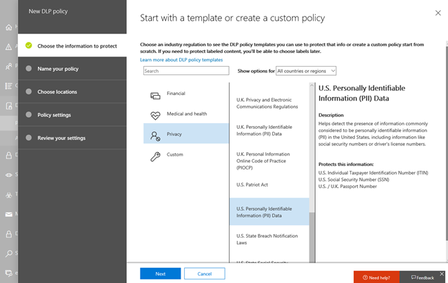

# 데이터 손실 방지 및 Microsoft 팀

> [!NOTE]
> 데이터 손실 방지 기능은 최근에 Microsoft 팀 채팅에 추가 되었으며, 독립 실행형 옵션으로 제공 되 고 Office 365 E5 및 Microsoft 365 E5 규정 준수에 포함 된 Office 365 고급 규정 준수를 위해 사용이 허가 된 사용자에 대 한 채널 메시지입니다. 라이선스 요구 사항에 대 한 자세한 내용은 [Microsoft 365 테 넌 트 수준 서비스 라이선스 지침](https://docs.microsoft.com/office365/servicedescriptions/microsoft-365-service-descriptions/microsoft-365-tenantlevel-services-licensing-guidance)을 참조 하세요.

## Microsoft 팀의 DLP 개요

최근에 DLP ( [데이터 손실 방지](data-loss-prevention-policies.md) ) 기능은 Microsoft 팀 채팅 및 채널 메시지를 포함 하도록 확장 되었습니다. 조직에 DLP가 있는 경우에는 사용자가 Microsoft 팀 채널 또는 채팅 세션에서 중요 한 정보를 공유 하지 못하도록 하는 정책을 정의할 수 있습니다. 다음은 이러한 보호의 작동 방식에 대 한 몇 가지 예입니다.

- **예 1: 메시지의 중요 한 정보 보호** 다른 사용자가 guests (외부 사용자)를 사용 하 여 팀 채팅 이나 채널에서 중요 한 정보를 공유 하려고 한다고 가정 합니다. 이를 방지 하기 위해 DLP 정책이 정의 된 경우 외부 사용자에 게 전송 되는 중요 한 정보가 포함 된 메시지가 삭제 됩니다. 이 작업은 DLP 정책이 구성 되는 방식에 따라 자동으로 몇 초 이내에 수행 됩니다.

    > [!NOTE]
    > Microsoft 팀의 DLP는 다음을 포함 하는 Microsoft 팀 사용자와 공유할 때 중요 한 콘텐츠를 차단 합니다. - 팀 및 채널에서의 [게스트 액세스](https://docs.microsoft.com/MicrosoftTeams/guest-access) 사용자나 - 모임 및 채팅 세션의 [외부 액세스](https://docs.microsoft.com/MicrosoftTeams/manage-external-access) 
외부 채팅 세션에 대 한 DLP는 보낸 사람과 받는 사람이 모두 팀 전용 모드이 고 [Microsoft 팀 전용 페더레이션을](https://docs.microsoft.com/microsoftteams/manage-external-access)사용 하는 경우에만 작동 합니다. 팀에 대 한 DLP는 비즈니스용 Skype 또는 비기본 페더레이션 채팅 세션을 사용한 [interop](https://docs.microsoft.com/microsoftteams/teams-and-skypeforbusiness-coexistence-and-interoperability#interoperability-of-teams-and-skype-for-business) 의 메시지를 차단 하지 않습니다.

- **예 2: 문서에서 중요 한 정보를 보호**하는 방법을 설명 합니다. 다른 사용자가 Microsoft 팀 채널 또는 채팅에서 게스트와 문서를 공유 하려고 하지만 문서에 중요 한 정보가 포함 되어 있다고 가정해 보겠습니다. 이를 방지 하기 위해 DLP 정책을 정의 하는 경우 해당 사용자에 대 한 문서가 열리지 않습니다. 이 경우에는 보호 기능을 적용 하기 위해 DLP 정책에 SharePoint 및 OneDrive가 포함 되어야 합니다. (이는 Microsoft 팀에 표시 되는 SharePoint 용 DLP의 예 이며, 사용자가 office 365 DLP (Office 365 E3에 포함)에 대 한 사용이 허가 되어야 하지만, 사용자에 게 Office 365 고급 규정 준수를 허가할 필요가 없습니다.)

## 사용자를 교육 하는 데 도움이 되는 정책 팁

[웹에서의 Exchange, outlook 및 outlook](data-loss-prevention-policies.md#policy-evaluation-in-exchange-online-outlook-and-outlook-on-the-web), [SharePoint 및 비즈니스용 OneDrive 사이트](data-loss-prevention-policies.md#policy-evaluation-in-onedrive-for-business-and-sharepoint-online-sites), [Office 데스크톱 클라이언트](data-loss-prevention-policies.md#policy-evaluation-in-the-office-desktop-programs)에서 dlp가 작동 하는 방식과 마찬가지로, 작업이 DLP 정책과 충돌할 때 정책 팁이 표시 됩니다. 정책 팁의 예는 다음과 같습니다.

이 경우 보낸 사람은 Microsoft 팀 채널에서 주민 등록 번호를 공유 하려고 했습니다. 어떤 작업을 **수행할 수 있나요?** link에서는이 문제를 해결 하기 위한 옵션을 제공 하는 대화 상자를 엽니다. 이 경우 보낸 사람은 정책을 재정의 하도록 선택 하거나 관리자에 게 문의 하 여 검토 하 고 해결 하도록 할 수 있습니다.

조직에서는 사용자가 DLP 정책을 재정의 하도록 허용할지 여부를 선택할 수 있습니다. 그리고 DLP 정책을 구성할 때 기본 정책 팁을 사용 하거나 조직에 대 한 [정책 팁을 사용자 지정할](#to-customize-policy-tips) 수 있습니다. 

예를 들어 보낸 사람이 팀 채널에서 주민 등록 번호를 공유 하는 경우, 받는 사람에 게 표시 되는 결과는 다음과 같습니다.

" **설명** 합니다." 링크를 선택 하면 메시지가 차단 된 이유를 설명 하는 DLP 정책에 대 한 [문서](data-loss-prevention-policies.md) 를 열 수 있습니다.

### 정책 팁을 사용자 지정 하려면

이 작업을 수행 하려면 DLP 정책을 편집할 수 있는 권한이 있는 역할을 할당 받아야 합니다. 자세한 내용은 [사용 권한을](data-loss-prevention-policies.md#permissions)참조 하십시오.

1. Office 365 Security & 준수 센터 ([https://protection.office.com](https://protection.office.com))로 이동 하 여 로그인 합니다.

2. **데이터 손실 방지** > **정책을**선택 합니다. 

3. 정책을 선택 하 고 **정책 설정**옆에서 **편집**을 선택 합니다.

4. 새 규칙을 만들거나 정책에 대 한 기존 규칙을 편집 합니다.  

5. **사용자 알림** 탭에서 **전자 메일 텍스트 사용자 지정** 및/또는 **정책 팁 텍스트 옵션 사용자 지정** 을 선택 합니다.    

6. 전자 메일 알림 및/또는 정책 팁에 사용할 텍스트를 지정 하 고 **저장**을 선택 합니다. 

7. **정책 설정** 탭에서 **저장**을 선택 합니다.

변경 내용이 데이터 센터를 통해 작동 하 고 사용자 계정과 동기화 되도록 약 1 시간을 허용 합니다.
 
## Microsoft 팀을 기존 DLP 정책에 대 한 위치로 추가

이 작업을 수행 하려면 DLP 정책을 편집할 수 있는 권한이 있는 역할을 할당 받아야 합니다. 자세한 내용은 [사용 권한을](data-loss-prevention-policies.md#permissions)참조 하십시오.

1. Office 365 Security & 준수 센터 ([https://protection.office.com](https://protection.office.com))로 이동 하 여 로그인 합니다.

2. **데이터 손실 방지** > **정책을**선택 합니다. 

3. 정책을 선택 하 고 **위치**아래의 값을 확인 합니다. **팀 채팅 및 채널 메시지가**표시 되 면 모든 설정이 완료 됩니다. 그렇지 않으면 **편집**을 클릭 합니다.  

4. **상태** 열에서 **팀 채팅 및 채널 메시지**에 대 한 정책을 설정 합니다.  

5. 모든 계정의 기본 설정을 유지 하거나 포함 하거나 제외할 계정을 지정 합니다.

6. **저장**을 클릭합니다.

변경 내용이 데이터 센터를 통해 작동 하 고 사용자 계정과 동기화 되도록 약 1 시간을 허용 합니다.

## Microsoft 팀에 대 한 새 DLP 정책 정의

이 작업을 수행 하려면 DLP 정책을 편집할 수 있는 권한이 있는 역할을 할당 받아야 합니다. 자세한 내용은 [사용 권한을](data-loss-prevention-policies.md#permissions)참조 하십시오.

1. Office 365 Security & 준수 센터 ([https://protection.office.com](https://protection.office.com))로 이동 하 여 로그인 합니다.

2. **데이터 손실 방지** > **정책** > 및**정책 만들기를**선택 합니다. 

3. [서식 파일](data-loss-prevention-policies.md#dlp-policy-templates)을 선택 하 고 **다음**을 선택 합니다. 이 예제에서는 미국 개인 식별이 가능한 정보 데이터 서식 파일을 선택 했습니다.  

4. **정책 이름** 지정 탭에서 정책의 이름과 설명을 입력 하 고 **다음**을 선택 합니다. 

5. **위치 선택** 탭에서 모든 위치의 기본 설정을 유지 하거나, **특정 위치 선택 허용**을 선택 하 고 **다음**을 선택 합니다. 특정 위치를 선택 하도록 선택한 경우 DLP 정책에 대 한 위치를 선택 하 고 **다음**을 선택 합니다.  
    > [!NOTE]
    > 중요 한 정보가 포함 된 문서가 잘못 공유 되지 않도록 하려면 **팀 채팅 및 채널 메시지**와 함께 **SharePoint 사이트** 와 **OneDrive 계정이** 설정 되어 있는지 확인 합니다.
 

6. **정책 설정** 탭의 **보호 하려는 콘텐츠 형식 사용자 지정**에서 기본 설정을 유지 하거나 **고급 설정 사용**을 선택 하 고 **다음**을 선택 합니다. 고급 설정을 선택 하는 경우 정책에 대 한 규칙을 만들거나 편집할 수 있습니다. 이에 대 한 도움말을 보려면 [단순 설정 및 고급 설정을](data-loss-prevention-policies.md#simple-settings-vs-advanced-settings)참조 하세요.

7.  **정책 설정** 탭의 **중요 한 정보를 검색 하는 경우 어떤**작업을 수행 하 시겠습니까?에서 설정을 검토 합니다. (여기에서 기본 [정책 팁과 전자 메일 알림을](use-notifications-and-policy-tips.md)유지 하거나 사용자 지정할 수 있습니다.)  설정 검토 또는 편집을 마친 후 **다음**을 선택 합니다.

8. **정책 설정** 탭의 정책을 **설정 하거나 먼저 테스트를 수행**하 시겠습니까?에서 정책을 켤 지, [먼저](data-loss-prevention-policies.md#roll-out-dlp-policies-gradually-with-test-mode)테스트를 시작할지, 지금은 해제를 선택 하 고 **다음**을 선택 합니다.  

9. **설정 검토** 탭에서 새 정책에 대 한 설정을 검토 합니다. **편집** 을 선택 하 여 변경 내용을 적용 합니다. 작업이 완료 되 면 **만들기**를 선택 합니다. 

새 정책이 데이터 센터를 통해 작동 하 고 사용자 계정과 동기화 되도록 약 1 시간을 허용 합니다.

## 관련 문서

[DLP 정책 만들기, 테스트 및 조정](create-test-tune-dlp-policy.md)

[DLP 정책에 대한 전자 메일 알림 보내기 및 정책 팁 표시](use-notifications-and-policy-tips.md)
