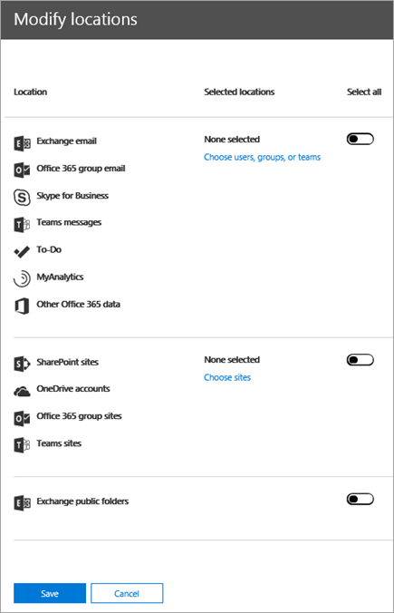
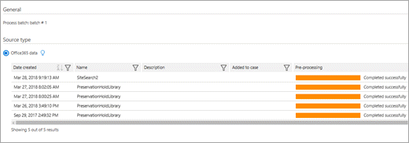

# <a name="ediscovery-cases-in-the-office-365-security-amp-compliance-center"></a><span data-ttu-id="6e93c-105">Office 365 보안에서 eDiscovery 사례 &amp; 준수 센터</span><span class="sxs-lookup"><span data-stu-id="6e93c-105">eDiscovery cases in the Office 365 Security &amp; Compliance Center</span></span>

<span data-ttu-id="6e93c-p102">Office 365 보안에서 eDiscovery 사례를 사용 하 여 &amp; 준수 센터 만들기, 액세스 및 조직에서 eDiscovery 사례를 관리할 수 있는 사람을 제어할 수 있습니다. 조직에 Office 365 E5 구독을 하는 경우에 Office 365 고급 eDiscovery를 사용 하 여 검색 결과 분석 하 eDiscovery 사례를 사용할 수 있습니다.</span><span class="sxs-lookup"><span data-stu-id="6e93c-p102">You can use eDiscovery cases in the Office 365 Security &amp; Compliance Center to control who can create, access, and manage eDiscovery cases in your organization. If your organization has an Office 365 E5 subscription, you can also use eDiscovery cases to analyze search results by using Office 365 Advanced eDiscovery.</span></span>
  
<span data-ttu-id="6e93c-p103">EDiscovery 사례를 사용 하는 경우에 구성원을 추가, 특정 사례 구성원 수를 수행, 관련 된 법적, 콘텐츠 위치에 보류를 배치 및 단일 사례와 여러 콘텐츠 검색을 연결 하는 작업의 종류를 제어할 수 있습니다. 사례와 연결 된 모든 콘텐츠 검색의 결과 내보낼 하거나 고급 eDiscovery에 대 한 분석을 위해 검색 결과 준비할 수 있습니다. eDiscovery 사례는 조직에서 특정 법률 사례에 대 한 콘텐츠를 검색 하 고 검색 결과에 대 한 액세스 권한이 있는 사람을 제한 하는 것이 좋습니다.</span><span class="sxs-lookup"><span data-stu-id="6e93c-p103">An eDiscovery case allows you to add members to a case, control what types of actions that specific case members can perform, place a hold on content locations relevant to a legal case, and associate multiple Content Searches with a single case. You can also export the results of any Content Search that is associated with a case or prepare search results for analysis in Advanced eDiscovery. eDiscovery cases are a good way to limit who has access to Content Searches and search results for a specific legal case in your organization.</span></span>
  
<span data-ttu-id="6e93c-111">다음 워크플로 사용 하 여 설정 하 고 보안에서 eDiscovery 사례를 사용 하 여 &amp; 준수 센터 및 고급 eDiscovery 합니다.</span><span class="sxs-lookup"><span data-stu-id="6e93c-111">Use the following workflow to set up and use eDiscovery cases in the Security &amp; Compliance Center and Advanced eDiscovery.</span></span>

[<span data-ttu-id="6e93c-112">1단계: 잠재적인 사례 구성원에게 eDiscovery 권한 할당</span><span class="sxs-lookup"><span data-stu-id="6e93c-112">Step 1: Assign eDiscovery permissions to potential case members</span></span>](#step-1-assign-ediscovery-permissions-to-potential-case-members)

[<span data-ttu-id="6e93c-113">2 단계: 새 사례 만들기</span><span class="sxs-lookup"><span data-stu-id="6e93c-113">Step 2: Create a new case</span></span>](#step-2-create-a-new-case)

[<span data-ttu-id="6e93c-114">3 단계: 사례에 구성원 추가</span><span class="sxs-lookup"><span data-stu-id="6e93c-114">Step 3: Add members to a case</span></span>](#step-3-add-members-to-a-case)

[<span data-ttu-id="6e93c-115">4 단계: 전체에서 콘텐츠 위치 유지</span><span class="sxs-lookup"><span data-stu-id="6e93c-115">Step 4: Place content locations on hold</span></span>](#step-4-place-content-locations-on-hold)

[<span data-ttu-id="6e93c-116">5 단계: 만들기 및 실행 하는 사례와 관련 된 콘텐츠 검색</span><span class="sxs-lookup"><span data-stu-id="6e93c-116">Step 5: Create and run a Content Search associated with a case</span></span>](#step-5-create-and-run-a-content-search-associated-with-a-case)

[<span data-ttu-id="6e93c-117">6 단계: 사례와 연결 된 콘텐츠 검색 결과 내보내기</span><span class="sxs-lookup"><span data-stu-id="6e93c-117">Step 6: Export the results of a Content Search associated with a case</span></span>](#step-6-export-the-results-of-a-content-search-associated-with-a-case)

[<span data-ttu-id="6e93c-118">7 단계: 준비 고급 eDiscovery에 대 한 결과 검색 합니다.</span><span class="sxs-lookup"><span data-stu-id="6e93c-118">Step 7: Prepare search results for Advanced eDiscovery</span></span>](#step-7-prepare-search-results-for-advanced-ediscovery)

[<span data-ttu-id="6e93c-119">8 단계: 고급 ediscovery에서 사례에 이동</span><span class="sxs-lookup"><span data-stu-id="6e93c-119">Step 8: Go to the case in Advanced eDiscovery</span></span>](#step-8-go-to-the-case-in-advanced-ediscovery)

[<span data-ttu-id="6e93c-120">(선택 사항) 단계 9: 사례를 닫을</span><span class="sxs-lookup"><span data-stu-id="6e93c-120">(Optional) Step 9: Close a case</span></span>](#optional-step-9-close-a-case)

[<span data-ttu-id="6e93c-121">(선택 사항) 단계 10: 닫힌된 사례를 다시 열</span><span class="sxs-lookup"><span data-stu-id="6e93c-121">(Optional) Step 10: Re-open a closed case</span></span>](#optional-step-10-re-open-a-closed-case)

[<span data-ttu-id="6e93c-122">추가 정보</span><span class="sxs-lookup"><span data-stu-id="6e93c-122">More information</span></span>](#more-information)
  
## <a name="step-1-assign-ediscovery-permissions-to-potential-case-members"></a><span data-ttu-id="6e93c-123">1단계: 잠재적인 사례 구성원에게 eDiscovery 권한 할당</span><span class="sxs-lookup"><span data-stu-id="6e93c-123">Step 1: Assign eDiscovery permissions to potential case members</span></span>

<span data-ttu-id="6e93c-p104">첫번째 단계 2 단계에서에서 eDiscovery 사례에 추가할 수 있도록 사람들에 게 적절 한 eDiscovery와 관련 된 사용 권한을 할당 하는 것입니다. Office 365 보안에서 조직 관리 역할 그룹의 구성원 이어야 합니다 (또는 역할 관리 역할을 할당 받을) 필요가 &amp; eDiscovery 사용 권한을 할당 하려면 준수 센터 합니다. 다음 목록에는 보안에서 eDiscovery와 관련 된 역할 그룹에 설명 &amp; 준수 센터입니다.</span><span class="sxs-lookup"><span data-stu-id="6e93c-p104">The first step is to assign the appropriate eDiscovery-related permissions to people so you can add them to an eDiscovery case in Step 2. You have to be a member of the Organization Management role group (or be assigned the Role Management role) in the Office 365 Security &amp; Compliance Center to assign eDiscovery permissions. The following list describes the eDiscovery-related role groups in the Security &amp; Compliance Center.</span></span> 
  
- <span data-ttu-id="6e93c-p105">**검토자** -이 역할 그룹에 가장 제한적인 eDiscovery 관련 사용 권한이 있습니다. 이 역할 그룹의 주요 목적은 구성원이 보기 및 액세스를 허용 하는 경우 Office 365 고급 eDiscovery의 데이터입니다. 이 그룹의 구성원 수만 참조 되는 용지의 **eDiscovery** 사례의 목록에서에서 열고 보안 &amp; 준수 센터의 멤버인입니다. 보안 및 규정 준수 센터의 사례를 액세스 하는 사용자를 한 후에 **고급 ediscovery 스위치** 액세스 하 고 고급 ediscovery에서 사례 데이터 분석을 클릭할 수 있습니다. 사례에 구성원을 추가 경우 만들 수는 없습니다, 보류 만들기, 검색, 검색 결과 미리 보기, 검색 결과 내보내기 만들거나 고급 eDiscovery에 대 한 결과 준비 합니다.</span><span class="sxs-lookup"><span data-stu-id="6e93c-p105">**Reviewer** - This role group has the most restrictive eDiscovery-related permissions. The primary purpose of this role group is to allow members to view and access case data in Office 365 Advanced eDiscovery. Members of this group can only see and open the list of the cases on the **eDiscovery** page in the Security &amp; Compliance Center that they are members of. After the user accesses a case in the Security & Compliance Center, they can click **Switch to Advanced eDiscovery** to access and analyze the case data in Advanced eDiscovery. They can't create cases, add members to a case, create holds, create searches, preview search results, export search results, or prepare results for Advanced eDiscovery.</span></span> 
    
- <span data-ttu-id="6e93c-p106">**eDiscovery 관리자** -이 역할 그룹의 구성원 만들고 eDiscovery 사례를 관리할 수 있습니다. 추가 하 고 구성원을 제거, 위치에 유지, 만들기 및 편집 사례와 연결 된 콘텐츠 검색, 콘텐츠 검색 결과 내보내기 콘텐츠를 배치 하 고 준비할 수 검색 결과 고급 eDiscovery에 대 한 분석을 위해 합니다. 이 역할 그룹에 두 하위 그룹이 있습니다. 이러한 하위 그룹 간의 차이 범위를 기반으로 합니다.</span><span class="sxs-lookup"><span data-stu-id="6e93c-p106">**eDiscovery Manager** - Members of this role group can create and manage eDiscovery cases. They can add and remove members, place content locations on hold, create and edit Content Searches associated with a case, export the results of a Content Search, and prepare search results for analysis in Advanced eDiscovery. There are two sub-groups in this role group. The difference between these subgroups is based on scope.</span></span>
    
  - <span data-ttu-id="6e93c-p107">**eDiscovery 관리자** -볼 수 있으며를 만들거나의 구성원 이어야 하는 eDiscovery 사례를 관리할 수 있습니다. 두번째 eDiscovery 관리자를 보거나 보안에서 **eDiscovery** 페이지에서 대/소문자를 열 수 없습니다 다른 eDiscovery 관리자 사례를 만듭니다. 하 고 해당 사례의 구성원으로 두번째 eDiscovery 관리자를 추가 하지는 않습니다를 &amp; 준수 센터입니다. eDiscovery 관리자 고급 ediscovery 분석 작업을 수행 하는 경우에 액세스할 수도 있습니다.</span><span class="sxs-lookup"><span data-stu-id="6e93c-p107">**eDiscovery Manager** - Can view and manage the eDiscovery cases they create or are a member of. If another eDiscovery Manager creates a case but doesn't add a second eDiscovery Manager as a member of that case, the second eDiscovery Manager won't be able to view or open the case on the **eDiscovery** page in the Security &amp; Compliance Center. eDiscovery Managers can also access their cases in Advanced eDiscovery to perform analysis tasks.</span></span> 
    
  - <span data-ttu-id="6e93c-p108">**eDiscovery 관리자** -eDiscovery 관리자 작업을 수행할 수 있는 모든 사례 관리 작업을 수행할 수 있습니다. 또한 eDiscovery 관리자가 다음과 같은 작업을 수행할 수 있습니다.</span><span class="sxs-lookup"><span data-stu-id="6e93c-p108">**eDiscovery Administrator** - Can perform all case management tasks that an eDiscovery Manager can do. Additionally, an eDiscovery Administrator can:</span></span>
    
    - <span data-ttu-id="6e93c-141">**eDiscovery** 페이지에 나열된 모든 사례를 봅니다.</span><span class="sxs-lookup"><span data-stu-id="6e93c-141">View all cases that are listed on the **eDiscovery** page.</span></span> 
    
    - <span data-ttu-id="6e93c-142">자신 대/소문자의 구성원으로 추가 후에 조직에서 모든 경우를 관리 합니다.</span><span class="sxs-lookup"><span data-stu-id="6e93c-142">Manage any case in the organization after they add themself as a member of the case.</span></span>
    
    - <span data-ttu-id="6e93c-143">조직에서 모든 사례에 대 한 고급 ediscovery 사례 데이터를 액세스 합니다.</span><span class="sxs-lookup"><span data-stu-id="6e93c-143">Access case data in Advanced eDiscovery for any case in the organization.</span></span>
    
    <span data-ttu-id="6e93c-144">사용자가 조직에서 eDiscovery 관리자가 되려고 하는 이유에 자세한 내용은 [More information](#more-information)를 참조하세요.</span><span class="sxs-lookup"><span data-stu-id="6e93c-144">See the [More information](#more-information) section for reasons why you may want an eDiscovery Administrator in your organization.</span></span> 
    
> [!IMPORTANT]
> <span data-ttu-id="6e93c-145">사용자 하나 이러한 eDiscovery와 관련 된 역할 그룹의 구성원이 아닌 검토자 역할에 할당 된 역할 그룹의 구성원이 아닌 경우에 eDiscovery 사례의 구성원으로 추가할 수 없습니다.</span><span class="sxs-lookup"><span data-stu-id="6e93c-145">If a person isn't a member of one of these eDiscovery-related role groups, or isn't a member of a role group that's assigned the Reviewer role, you can't add them as a member of an eDiscovery case.</span></span> 

<span data-ttu-id="6e93c-146">EDiscovery 사용 권한에 대 한 자세한 내용은 참조 [Office 365 보안에서 eDiscovery 사용 권한을 할당 &amp; 준수 센터](assign-ediscovery-permissions.md)합니다.</span><span class="sxs-lookup"><span data-stu-id="6e93c-146">For more information about eDiscovery permissions, see [Assign eDiscovery permissions in the Office 365 Security &amp; Compliance Center](assign-ediscovery-permissions.md).</span></span>
  
 <span data-ttu-id="6e93c-147">**eDiscovery 권한을 할당하려면**</span><span class="sxs-lookup"><span data-stu-id="6e93c-147">**To assign eDiscovery permissions:**</span></span>
  
1. <span data-ttu-id="6e93c-148">[https://protection.office.com](https://protection.office.com)으로 이동합니다.</span><span class="sxs-lookup"><span data-stu-id="6e93c-148">Go to [https://protection.office.com](https://protection.office.com).</span></span>
    
2. <span data-ttu-id="6e93c-149">회사 또는 학교 계정을 사용하여 Office 365에 로그인합니다.</span><span class="sxs-lookup"><span data-stu-id="6e93c-149">Sign in to Office 365 using your work or school account.</span></span>
    
3. <span data-ttu-id="6e93c-150">보안에서 &amp; 준수 센터 **사용 권한**, 클릭 한 다음 할당할 eDiscovery 권한에 따라 다음 중 하나를 수행 합니다.</span><span class="sxs-lookup"><span data-stu-id="6e93c-150">In the Security &amp; Compliance Center, click **Permissions**, and then do one of the following based on the eDiscovery permissions that you want to assign.</span></span>
    
    - <span data-ttu-id="6e93c-p109">검토자 권한을 할당할 **검토자** 역할 그룹을 선택한 다음 **구성원**옆에 있는 **편집**을 클릭 합니다. **Choose 구성원**을 클릭, **편집**을 클릭, 클릭  **추가**검토자 역할 그룹에 추가 하려는 사용자를 선택한 다음 **추가**클릭 합니다.</span><span class="sxs-lookup"><span data-stu-id="6e93c-p109">To assign Reviewer permissions, select the **Reviewer** role group, and then next to **Members**, click **Edit**. Click **Choose members**, click **Edit**, click  **Add**, select the user that you want to add to the Reviewer role group, and then click **Add**.</span></span>
    
    - <span data-ttu-id="6e93c-p110">EDiscovery 관리자 권한을 할당할 **eDiscovery 관리자** 역할 그룹을 선택한 다음 **eDiscovery 관리자**옆에 있는 **편집**을 클릭 합니다. **Choose eDiscovery 관리자를**클릭, **편집**을 클릭 하 고를 클릭  \* \* 추가 \* \*, eDiscovery 관리자를 추가 하려는 사용자를 선택 하 고 **추가**클릭 합니다.</span><span class="sxs-lookup"><span data-stu-id="6e93c-p110">To assign eDiscovery Manager permissions, select the **eDiscovery Manager** role group, and then next to **eDiscovery Manager**, click **Edit**. Click **Choose eDiscovery Manager**, click **Edit**, click  \*\* Add \*\*, select the user that you want to add as an eDiscovery Manager, and then click **Add**.</span></span>
    
    - <span data-ttu-id="6e93c-p111">EDiscovery 관리자 권한을 할당할 **eDiscovery 관리자** 역할 그룹을 선택한 다음 **eDiscovery 관리자**옆에 있는 **편집**을 클릭 합니다. **Choose eDiscovery 관리자를**클릭, **편집**을 클릭 하 고를 클릭  **추가**eDiscovery 관리자를 추가 하려는 사용자를 선택한 다음 **추가**클릭 합니다.</span><span class="sxs-lookup"><span data-stu-id="6e93c-p111">To assign eDiscovery Administrator permissions, select the **eDiscovery Manager** role group, and then next to **eDiscovery Administrator**, click **Edit**. Click **Choose eDiscovery Administrator**, click **Edit**, click  **Add**, select the user that you want to add as an eDiscovery Administrator, and then click **Add**.</span></span>
    
4. <span data-ttu-id="6e93c-157">모든 사용자를 추가한 후 **완료**를 클릭, 역할 그룹에 변경 내용을 저장 하려면 **저장** 을 클릭 하 고 **닫기**를 클릭 합니다.</span><span class="sxs-lookup"><span data-stu-id="6e93c-157">After you've added all the users, click **Done**, click **Save** to save the changes to the role group, and then click **Close**.</span></span>

## <a name="step-2-create-a-new-case"></a><span data-ttu-id="6e93c-158">2 단계: 새 사례 만들기</span><span class="sxs-lookup"><span data-stu-id="6e93c-158">Step 2: Create a new case</span></span>

<span data-ttu-id="6e93c-p112">다음 단계에서는 새 eDiscovery 사례를 만드는 것입니다. EDiscovery 사례를 만들 eDiscovery 관리자 역할 그룹의 구성원 이어야 합니다. 보안에서 새 사례를 만든 후 앞부분에 설명 &amp; 준수 센터, 있습니다 (및 기타 사례 멤버) 고급 ediscovery 조직 참가 하 고 있는 경우 동일한 경우 Office 365 E5 구독에 대 한 액세스 수 있게 됩니다.</span><span class="sxs-lookup"><span data-stu-id="6e93c-p112">The next step is to create a new eDiscovery case. You must be a member of the eDiscovery Managers role group to create eDiscovery cases. As previously explained, after you create a new case in the Security &amp; Compliance Center, you (and other case members) will be able to access that same case in Advanced eDiscovery if you're organization has an Office 365 E5 subscription.</span></span>
  
1. <span data-ttu-id="6e93c-162">[https://protection.office.com](https://protection.office.com)으로 이동합니다.</span><span class="sxs-lookup"><span data-stu-id="6e93c-162">Go to [https://protection.office.com](https://protection.office.com).</span></span>
    
2. <span data-ttu-id="6e93c-163">회사 또는 학교 계정을 사용하여 Office 365에 로그인합니다.</span><span class="sxs-lookup"><span data-stu-id="6e93c-163">Sign in to Office 365 using your work or school account.</span></span>
    
3. <span data-ttu-id="6e93c-164">보안에서 &amp; 준수 센터 클릭 **검색 &amp; 조사** \> **eDiscovery**및 클릭  **사례 만들기**.</span><span class="sxs-lookup"><span data-stu-id="6e93c-164">In the Security &amp; Compliance Center, click **Search &amp; investigation** \> **eDiscovery**, and then click  **Create a case**.</span></span>
    
4. <span data-ttu-id="6e93c-p113">**새 사례** 페이지에서 프로그램 이름을 지정 하는 경우, 대 한 선택적 설명을 입력 하 고 **저장**을 클릭 합니다. 참고 사례 이름을 조직 내에서 고유 이어야 합니다.</span><span class="sxs-lookup"><span data-stu-id="6e93c-p113">On the **New Case** page, give the case a name, type an optional description, and then click **Save**. Note that the case name must be unique in your organization.</span></span>
    
    
  
    <span data-ttu-id="6e93c-p114">새 사례 **eDiscovery** 페이지의 경우 목록에 표시 됩니다. 메모는 상태 ( **활성** 또는 **닫힘**), 대/소문자를 포함 하는 경우에 대 한 정보를 표시 하려면 사례 이름 위에 커서 커서를 놓고 수 있습니다 (하 여 이전 단계에서 만든)의 경우에 대 한 설명을 대/소문자를 마지막 변경 된 및 및 변경한 사람입니다.</span><span class="sxs-lookup"><span data-stu-id="6e93c-p114">The new case is displayed in the list of cases on the **eDiscovery** page. Note that you can hover the cursor over a case name to display information about the case, including the status of the case ( **Active** or **Closed**), the description of the case (that was created in the previous step), and when the case was changed last and who changed it.</span></span>
    
    > [!TIP]
    > <span data-ttu-id="6e93c-p115">새 사례를 만든 후 언제 든 지 바꿀 수 있습니다. **EDiscovery** 페이지에서 대/소문자의 이름을 클릭 합니다. **이 경우 관리** 플라이 아웃 페이지에서 **이름**아래에 있는 상자에 표시 되는 이름을 변경 하 고 변경 내용을 저장 합니다.</span><span class="sxs-lookup"><span data-stu-id="6e93c-p115">After you create a new case, you can rename it anytime. Just click the name of the case on the **eDiscovery** page. On the **Manage this case** flyout page, change the name displayed in the box under **Name**, and then save the change.</span></span> 
  
## <a name="step-3-add-members-to-a-case"></a><span data-ttu-id="6e93c-173">3 단계: 사례에 구성원 추가</span><span class="sxs-lookup"><span data-stu-id="6e93c-173">Step 3: Add members to a case</span></span>

<span data-ttu-id="6e93c-p116">새 사례를 만든 후 다음 단계에서는 대/소문자를 구성원을 추가 하는 것입니다. 검토자의 구성원 인 사용자만 같이 이전 설명 또는 대/소문자의 구성원으로 eDiscovery 관리자 역할 그룹을 추가할 수 있습니다. Note eDiscovery 사례를 만든 관리자 구성원으로 자동으로 추가 됩니다.</span><span class="sxs-lookup"><span data-stu-id="6e93c-p116">After you create a new case, the next step is to add members to the case. As previous explained, only users who are members of the Reviewer or eDiscovery Manager role groups can be added as members of the case. Note that the eDiscovery Manager who created the case is automatically added as a member.</span></span>
  
1. <span data-ttu-id="6e93c-177">보안 및 준수 센터에서 **검색 &amp; 조사** \> **eDiscovery**를 클릭하여 조직의 사례 목록을 표시합니다.</span><span class="sxs-lookup"><span data-stu-id="6e93c-177">In the Security &amp; Compliance Center, click **Search &amp; investigation** \> **eDiscovery** to display the list of cases in your organization.</span></span> 
    
2. <span data-ttu-id="6e93c-178">구성원을 추가 하려는 경우의 이름을 클릭 합니다.</span><span class="sxs-lookup"><span data-stu-id="6e93c-178">Click the name of the case that you want to add members to.</span></span>
    
    <span data-ttu-id="6e93c-179">**이 경우 관리** 플라이 아웃 페이지가 표시 됩니다.</span><span class="sxs-lookup"><span data-stu-id="6e93c-179">The **Manage this case** flyout page is displayed.</span></span> 
    
    
  
3. <span data-ttu-id="6e93c-181">**관리 구성원**아래에서 다음을 클릭  대/소문자에 구성원을 추가 하려면 **추가** 합니다.</span><span class="sxs-lookup"><span data-stu-id="6e93c-181">Under **Manage members**, click  **Add** to add members to the case.</span></span> 
    
    <span data-ttu-id="6e93c-p117">또한 대/소문자에 역할 그룹을 추가할 수 있습니다. **관리 역할 그룹**를 클릭  **추가**합니다.</span><span class="sxs-lookup"><span data-stu-id="6e93c-p117">You can also choose to add a role group to the case. Under **Manage role groups**, click  **Add**.</span></span>
    
    > [!NOTE]
    > <span data-ttu-id="6e93c-p118">EDiscovery 사례에 구성원을 할당할 수 있는 역할 그룹 제어 합니다. 즉, 사례에 소속 된 역할 그룹에만 할당할 수 있습니다.</span><span class="sxs-lookup"><span data-stu-id="6e93c-p118">Role groups control who can assign members to an eDiscovery case. That means you can only assign the role groups that you are a member of to a case.</span></span>
    
4. <span data-ttu-id="6e93c-186">대/소문자의 구성원으로 추가할 수 있는 사용자 또는 역할 그룹의 목록에서 추가 하려는 사용자 또는 역할 그룹의 이름 옆에 있는 확인란을 클릭 합니다.</span><span class="sxs-lookup"><span data-stu-id="6e93c-186">In the list of people or role groups that can be added as members of the case, click the check box next to the names of the people or role groups that you want to add.</span></span>
    
    > [!TIP]
    > <span data-ttu-id="6e93c-187">큰 목록이 구성원으로 추가 수 있는 사용자가 목록에 특정 사용자에 대 한 검색 하려면 **검색** 상자를 사용 합니다.</span><span class="sxs-lookup"><span data-stu-id="6e93c-187">If you have a large list of people who can added as members, use the **Search** box to search for a specific person in the list.</span></span> 
  
5. <span data-ttu-id="6e93c-188">그룹의 구성원으로 추가할 사용자 또는 역할 그룹을 선택한 후 **추가**클릭 합니다.</span><span class="sxs-lookup"><span data-stu-id="6e93c-188">After you've selected the people or role groups to add as members of the group, click **Add**.</span></span>
    
    <span data-ttu-id="6e93c-189">**이 경우 관리**사례 구성원의 새 목록을 저장 하려면 **저장** 을 클릭 합니다.</span><span class="sxs-lookup"><span data-stu-id="6e93c-189">In **Manage this case**, click **Save** to save the new list of case members.</span></span> 
    
6. <span data-ttu-id="6e93c-190">사례 구성원의 새 목록을 저장 하려면 **저장** 을 클릭 합니다.</span><span class="sxs-lookup"><span data-stu-id="6e93c-190">Click **Save** to save the new list of case members.</span></span> 
  
## <a name="step-4-place-content-locations-on-hold"></a><span data-ttu-id="6e93c-191">4 단계: 전체에서 콘텐츠 위치 유지</span><span class="sxs-lookup"><span data-stu-id="6e93c-191">Step 4: Place content locations on hold</span></span>

<span data-ttu-id="6e93c-p119">대/소문자와 관련이 있을 수 있는 콘텐츠를 유지 하기 위해 보류를 만들려면 eDiscovery 사례를 사용할 수 있습니다. 경우에는 custodians에 있는 사용자의 비즈니스 사이트에 대 한 사서함과 OneDrive에서 보류를 배치할 수 있습니다. Office 365 그룹에 대해 비즈니스 사이트에 대 한 그룹 사서함, SharePoint 사이트 및 OneDrive에서 보류를 배치할 수도 있습니다. 마찬가지로, 사서함 및 Microsoft 팀과 연결 된 사이트에 보류를 배치할 수 있습니다. 대기 콘텐츠 위치를 배치 하는 경우 콘텐츠 보류를 삭제할 때까지 나 콘텐츠 위치에서 보류를 제거할 때까지 유지 됩니다.</span><span class="sxs-lookup"><span data-stu-id="6e93c-p119">You can use an eDiscovery case to create holds to preserve content that might be relevant to the case. You can place a hold on the mailboxes and OneDrive for Business sites of people who are custodians in the case. You can also place a hold on the group mailbox, SharePoint site, and OneDrive for Business site for an Office 365 Group. Similarly, you can place a hold on the mailbox and site that are associated with Microsoft Teams. When you place content locations on hold, content is held until you remove the hold from the content location or until you delete the hold.</span></span>

> [!NOTE]
> <span data-ttu-id="6e93c-197">대기 콘텐츠 위치를 삽입 한 후에 적용 하려면 보류 24 시간까지 걸립니다.</span><span class="sxs-lookup"><span data-stu-id="6e93c-197">After you place a content location on hold, it takes up to 24 hours for the hold to take effect.</span></span> 
>   
<span data-ttu-id="6e93c-198">보류를 만들 때 지정 된 콘텐츠 위치에 보관 되는 콘텐츠를 범위를 지정 하는 다음 옵션 있습니다.</span><span class="sxs-lookup"><span data-stu-id="6e93c-198">When you create a hold, you have the following options to scope the content that is held in the specified content locations:</span></span>
  
- <span data-ttu-id="6e93c-p120">보류에서 모든 콘텐츠를 배치할 위치 무한 보류를 만듭니다. 또는 쿼리 기반 보류 검색 쿼리와 일치 하는 유일한 콘텐츠 보류에 배치 되는 위치를 만들 수 있습니다.</span><span class="sxs-lookup"><span data-stu-id="6e93c-p120">You create an infinite hold where all content is placed on hold. Alternatively, you can create a query-based hold where only content that matches a search query is placed on hold.</span></span>
    
- <span data-ttu-id="6e93c-p121">콘텐츠 전송, 수신, 또는 해당 날짜 범위 내에서 생성 된를 포함 하는 날짜 범위를 지정할 수 있습니다. 또는 면 전송, 수신, 또는 만든에 관계 없이 모든 콘텐츠를 보관할 수 있습니다.</span><span class="sxs-lookup"><span data-stu-id="6e93c-p121">You can specify a date range to hold only the content that was sent, received, or created within that date range. Alternatively, you can hold all content regardless of when it was sent, received, or created.</span></span>
    
> [!NOTE]
> <span data-ttu-id="6e93c-203">조직에서 모든 eDiscovery 사례 정책을 유지 하는 최대 10, 000 개를 가질 수 있습니다.</span><span class="sxs-lookup"><span data-stu-id="6e93c-203">You can have a maximum of 10,000 hold policies across all eDiscovery cases in your organization.</span></span> 
  
<span data-ttu-id="6e93c-204">EDiscovery 사례에 대 한 보류를 만들려면:</span><span class="sxs-lookup"><span data-stu-id="6e93c-204">To create a hold for an eDiscovery case:</span></span>
  
1. <span data-ttu-id="6e93c-205">보안 및 준수 센터에서 **검색 &amp; 조사** \> **eDiscovery**를 클릭하여 조직의 사례 목록을 표시합니다.</span><span class="sxs-lookup"><span data-stu-id="6e93c-205">In the Security &amp; Compliance Center, click **Search &amp; investigation** \> **eDiscovery** to display the list of cases in your organization.</span></span> 
    
2. <span data-ttu-id="6e93c-206">보류를 만들려는 경우 다음 **열기** 를 클릭 합니다.</span><span class="sxs-lookup"><span data-stu-id="6e93c-206">Click **Open** next to the case that you want to create the holds in.</span></span> 
    
3. <span data-ttu-id="6e93c-207">대/소문자에 대 한 **홈** 페이지에서 **보류** 탭을 클릭 합니다.</span><span class="sxs-lookup"><span data-stu-id="6e93c-207">On the **Home** page for the case, click the **Hold** tab.</span></span> 
    
    
  
4. <span data-ttu-id="6e93c-209">**보류** 페이지에서 다음을 클릭  **만들기**.</span><span class="sxs-lookup"><span data-stu-id="6e93c-209">On the **Hold** page, click  **Create**.</span></span>
    
5. <span data-ttu-id="6e93c-p122">**이름에 보류** 페이지에서 보류에 이름을 지정 합니다. 보류의 이름을 조직에서 고유 해야 합니다.</span><span class="sxs-lookup"><span data-stu-id="6e93c-p122">On the **Name your hold** page, give the hold a name. The name of the hold must be unique in your organization.</span></span> 
    
    
  
6. <span data-ttu-id="6e93c-213">(선택 사항) **설명** 상자에 보류에 대 한 설명을 추가 합니다.</span><span class="sxs-lookup"><span data-stu-id="6e93c-213">(Optional) In the **Description** box, add a description of the hold.</span></span> 
    
7. <span data-ttu-id="6e93c-214">**다음**을 클릭합니다.</span><span class="sxs-lookup"><span data-stu-id="6e93c-214">Click **Next**.</span></span>
    
8. <span data-ttu-id="6e93c-p123">보류에 배치 하려는 콘텐츠 위치를 선택 합니다. 보류 중인 사서함, 사이트 및 공용 폴더를 배치할 수 있습니다.</span><span class="sxs-lookup"><span data-stu-id="6e93c-p123">Choose the content locations that you want to place on hold. You can place mailboxes, sites, and public folders on hold.</span></span>
    
    
  
   <span data-ttu-id="6e93c-p124">a. **Exchange 전자 메일** - **선택 사용자, 그룹 또는 팀을** 클릭 하 고 **선택 사용자, 그룹 또는 팀을** 다시 클릭 합니다. 사서함을 보류를 지정 합니다. 검색 상자를 사용 하 여를 대기 시키려면 사용자 사서함 및 그룹 구성원의 사서함에 보류를 배치 하) (에 메일 그룹을 찾을 수 있습니다. Office 365 그룹 또는 팀이 Microsoft에 대 한 연결 된 사서함에서 보류를 배치할 수 있습니다. 사용자, 그룹, 팀 확인란을 선택 하 고 **선택**를클릭하고 **완료**를 클릭 합니다.</span><span class="sxs-lookup"><span data-stu-id="6e93c-p124">a. **Exchange email** - Click **Choose users, groups, or teams** and then click **Choose users, groups, or teams** again. to specify mailboxes to place on hold. Use the search box to find user mailboxes and distribution groups (to place a hold on the mailboxes of group members) to place on hold. You can also place a hold on the associated mailbox for an Office 365 Group or a Microsoft Team. Select the user, group, team check box, click **Choose**, and then click **Done**.</span></span>
    
    > [!NOTE]
    > <span data-ttu-id="6e93c-p125">**선택의 사용자, 그룹 또는 팀을** 지정 하려면 사서함을 보류를 클릭 하면 표시 되는 사서함 선택 비어 있습니다. 성능 향상을 위해 디자인입니다. 이 목록에 사용자를 추가할 검색 상자에 이름 (최소 3 자)를 입력 합니다.</span><span class="sxs-lookup"><span data-stu-id="6e93c-p125">When you click **Choose users, groups, or teams** to specify mailboxes to place on hold, the mailbox picker that's displayed is empty. This is by design to enhance performance. To add people to this list, type a name (a minimum of 3 characters) in the search box.</span></span> 
  
   <span data-ttu-id="6e93c-p126">b. **SharePoint 사이트** - **선택 사이트** 를 클릭 하 고에 배치 하는 SharePoint 및 비즈니스 사이트에 대 한 OneDrive 대기중 지정을 다시 **선택 사이트** 클릭 합니다. 보류에 배치 하려는 각 사이트에 대 한 URL을 입력 합니다. Office 365 그룹 또는 팀이 Microsoft에 대 한 SharePoint 사이트에 대 한 URL을 추가할 수도 있습니다. **Choose**클릭 하 고 **완료**를 클릭 합니다.</span><span class="sxs-lookup"><span data-stu-id="6e93c-p126">b. **SharePoint Sites** - Click **Choose sites** and then click **Choose sites** again to specify SharePoint and OneDrive for Business sites to place on hold. Type the URL for each site that you want to place on hold. You can also add the URL for the SharePoint site for an Office 365 Group or a Microsoft Team. Click **Choose**, and then click **Done**.</span></span>
    
    <span data-ttu-id="6e93c-232">보류에서 Office 365 그룹 및 Microsoft 팀의 배치에 대 한 팁에 대 한 [자세한 내용](#more-information) 은 섹션을 참조 하십시오.</span><span class="sxs-lookup"><span data-stu-id="6e93c-232">See the [More information](#more-information) section for tips on putting Office 365 Groups and Microsoft Teams on hold.</span></span> 
    
    > [!NOTE]
    > <span data-ttu-id="6e93c-p127">사용자의 사용자 계정 이름 (UPN) 변경 된 특수 한 경우에서 해당 OneDrive 계정에 대 한 URL 새 UPN을 통합 하기 위해 변경 됩니다. 이 경우 사용자의 새 OneDrive URL을 추가 하 고 이전 하나를 제거 하 여 보류를 수정 해야 합니다.</span><span class="sxs-lookup"><span data-stu-id="6e93c-p127">In the rare case that a person's user principal name (UPN) is changed, the URL for their OneDrive account will also be changed to incorporate the new UPN. If this happens, you'll have to modify the hold by adding the user's new OneDrive URL and removing the old one.</span></span> 
  
   <span data-ttu-id="6e93c-p128">설정/해제 스위치를 이동 하는 **Exchange 공용 폴더** -c.  대기 Exchange Online 조직에서 모든 공용 폴더를 **모든** 위치에 있습니다. 특정 공용 폴더 배치를 선택할 수는 없으며 메모를 보관 합니다. 공용 폴더에 대 한 보류를 배치 하지 않을 경우 **None** 으로 설정 하는 토글 스위치를 그대로 둡니다.</span><span class="sxs-lookup"><span data-stu-id="6e93c-p128">c. **Exchange public folders** - Move the toggle switch  to the **All** position to put all public folders in your Exchange Online organization on hold. Note that you can't choose specific public folders to put on hold. Leave the toggle switch set to **None** if you don't want to put a hold on public folders.</span></span>
    
9. <span data-ttu-id="6e93c-239">보류에 추가 콘텐츠 위치를 완료 했으면 **다음**을 클릭 합니다.</span><span class="sxs-lookup"><span data-stu-id="6e93c-239">When you're done adding content locations to the hold, click **Next**.</span></span>
    
10. <span data-ttu-id="6e93c-p129">조건을 사용 하 여 쿼리 기반 보류를 만들려면 다음 절차를 완료 합니다. 그렇지 않은 경우 **다음** 을 클릭합니다</span><span class="sxs-lookup"><span data-stu-id="6e93c-p129">To create a query-based hold with conditions, complete the following. Otherwise, just click **Next**</span></span>
    
    
  
    
       <span data-ttu-id="6e93c-p130">a. **키워드**아래 상자에 종류 상자에 검색 쿼리를 검색 조건에 맞는 콘텐츠만 상태에 있을 수 있도록 보관 합니다. 키워드, 메시지 속성 또는 파일 이름 등의 문서 속성을 지정할 수 있습니다. 예: **AND**, **OR**또는 **하지**부울 연산자를 사용 하는 보다 복잡 한 쿼리를 사용할 수 있습니다. 생략 하면 지정한 콘텐츠 위치에 있는 모든 콘텐츠에 배치 될 다음에 빈 키워드 상자를 보관 합니다.</span><span class="sxs-lookup"><span data-stu-id="6e93c-p130">a. In the box under **Keywords**, type a search query in the box so that only the content that meets the search criteria is placed on hold. You can specify keywords, message properties, or document properties, such as file names. You can also use more complex queries that use a Boolean operator, such as **AND**, **OR**, or **NOT**. If you leave the keyword box empty, then all content located in the specified content locations will be placed on hold.</span></span>
    
    <span data-ttu-id="6e93c-p131">b. 클릭  보류에 대 한 검색 쿼리 범위를 좁힐 수 있는 하나 이상의 조건을 추가 하려면 **추가 조건** 입니다. 각 조건은 만들고 보류를 만들 때 실행 되는 KQL 검색 쿼리 절을 추가 합니다. 같은 날짜 범위 내에서 만든 문서를 전자 메일 또는 사이트는 대기 상태에 놓일 수 있도록 날짜 범위를 지정할 수 있습니다. 조건 **및** 연산자에 의해 (키워드 상자에 지정 된) 키워드 쿼리를 논리적으로 연결 됩니다. 항목 모두 만족 하는 의미 키워드 쿼리 및 조건에 배치할 수를 유지 합니다.</span><span class="sxs-lookup"><span data-stu-id="6e93c-p131">b. Click  **Add conditions** to add one or more conditions to narrow the search query for the hold. Each condition adds a clause to the KQL search query that is created and run when you create the hold. For example you can specify a date range so that email or site documents that were created within the date ranged are placed on hold. A condition is logically connected to the keyword query (specified in the keyword box) by the **AND** operator. That means that items have to satisfy both the keyword query and the condition to be placed on hold.</span></span>

    <span data-ttu-id="6e93c-254">검색 쿼리 만들기 (영문) 및 조건을 사용 하는 방법에 대 한 자세한 내용은 [키워드 쿼리 및 콘텐츠 검색에 대 한 검색 조건을](keyword-queries-and-search-conditions.md)참조 하십시오.</span><span class="sxs-lookup"><span data-stu-id="6e93c-254">For more information about creating a search query and using conditions, see [Keyword queries and search conditions for Content Search](keyword-queries-and-search-conditions.md).</span></span>
    
11. <span data-ttu-id="6e93c-255">쿼리 기반 구성한 후 유지, **다음**을 클릭 합니다.</span><span class="sxs-lookup"><span data-stu-id="6e93c-255">After configuring a query-based hold, click **Next**.</span></span>
    
12. <span data-ttu-id="6e93c-256">설정을 검토 하 고 **이 보류 만들기**를 클릭 합니다.</span><span class="sxs-lookup"><span data-stu-id="6e93c-256">Review your settings, and then click **Create this hold**.</span></span>
    
### <a name="hold-statistics"></a><span data-ttu-id="6e93c-257">통계를 유지 합니다.</span><span class="sxs-lookup"><span data-stu-id="6e93c-257">Hold statistics</span></span>

<span data-ttu-id="6e93c-p132">잠시 후 새 대기 하는 방법에 대 한 정보는 선택한 보류에 대 한 **을 포함 하 고** 페이지에서 세부 정보 창에 표시 됩니다. 사서함 수를 포함 하는이 정보에는 사이트 누른 상태와 같은 항목의 크기와 총 대기 상태에 놓일 마지막 통계도 계산 된 대기 시간에 배치 된 콘텐츠에 대 한 통계 유지 합니다. 이러한 대기 통계 도움말 eDiscovery 사례와 관련 된 콘텐츠 양에 열리는지 확인 합니다.</span><span class="sxs-lookup"><span data-stu-id="6e93c-p132">After a while, information about the new hold is displayed in the details pane on the **Holds** page for the selected hold. This information includes the number of mailboxes and sites on hold and statistics about the content that was placed on hold, such as the total number and size of items placed on hold and the last time the hold statistics were calculated. These hold statistics help you identify how much content that's related to the eDiscovery case is being held.</span></span> 
  

  
<span data-ttu-id="6e93c-262">보류 통계에 대 한 염두에 다음과 같은 사항에 유의 하십시오.</span><span class="sxs-lookup"><span data-stu-id="6e93c-262">Keep the following things in mind about hold statistics:</span></span>
  
- <span data-ttu-id="6e93c-p133">보류 중인 항목의 총 수 보류에 배치 되는 모든 콘텐츠 원본에서 항목의 수를 나타냅니다. 만들었고 쿼리 기반 기다리는 경우,이 통계는 쿼리 일치 하는 항목 수를 나타냅니다.</span><span class="sxs-lookup"><span data-stu-id="6e93c-p133">The total number of items on hold indicates the number of items from all content sources that are placed on hold. If you've created a query-based hold, this statistic indicates the number of items that match the query.</span></span>
    
- <span data-ttu-id="6e93c-p134">보류 중인 항목의 수에는 콘텐츠 위치에 인덱싱되지 않은 항목이 포함 됩니다. 참고 쿼리 기반 보류를 만드는 경우 콘텐츠 위치에 있는 모든 인덱싱되지 않은 항목 보류에 배치 됩니다. 쿼리 기반 보류의 검색 조건과 일치 하지 않는 인덱싱되지 않은 항목과 인덱싱되지 않은 항목의 날짜 범위 조건을 외부 빠질 수에 포함 됩니다. 이것은 검색 결과에 포함 되지 않습니다 인덱싱되지 않은 항목을 검색 쿼리 일치 하지 않는 또는 날짜 범위 조건에 따라 제외 되는 콘텐츠 검색을 실행 하는 경우 다릅니다. 인덱싱되지 않은 항목에 대 한 자세한 내용은 [부분적으로 인덱싱된 되는 Office 365에서 콘텐츠 검색에서 항목을](partially-indexed-items-in-content-search.md)참조 하십시오.</span><span class="sxs-lookup"><span data-stu-id="6e93c-p134">The number of items on hold also includes unindexed items found in the content locations. Note that if you create a query-based hold, all unindexed items in the content locations are placed on hold. This includes unindexed items that don't match the search criteria of a query-based hold and unindexed items that might fall outside of a date range condition. This is different than what happens when you run a Content Search, in which unindexed items that don't match the search query or are excluded by a date range condition aren't included in the search results. For more information about unindexed items, see [Partially indexed items in Content Search in Office 365](partially-indexed-items-in-content-search.md).</span></span>
    
- <span data-ttu-id="6e93c-p135">최신 정보를 얻을 수 통계를 검색을 다시 실행 **통계를 업데이트** 를 클릭 하 여 현재 보류 중인 항목 수를 계산 하는 예측 유지 합니다. 필요한 경우 **새로 고칠**을 클릭 세부 정보 창에서 보류 통계를 업데이트 하려면 도구 모음에서 합니다.</span><span class="sxs-lookup"><span data-stu-id="6e93c-p135">You can get the latest hold statistics by clicking **Update statistics** to re-run a search estimate that calculates the current number of items on hold. If necessary, click **Refresh** in the toolbar to update the hold statistics in the details pane.</span></span> 
    
- <span data-ttu-id="6e93c-272">에 있는 항목의 수에 대 한 표준의 해당 사서함 이나 사이트 보류 중인 사용자는 일반적으로 또는 새 전자 메일 메시지를 받는 보내고 비즈니스 문서에 대 한 새 SharePoint와 OneDrive 만들기 때문에 시간이 지남에 따라 증가에 대해 유지 합니다.</span><span class="sxs-lookup"><span data-stu-id="6e93c-272">It's normal for the number of items on hold to increase over time because users whose mailbox or site is on hold are typically sending or receiving new email message and creating new SharePoint and OneDrive for Business documents.</span></span>
    
> [!NOTE]
> <span data-ttu-id="6e93c-p136">SharePoint 사이트 또는 OneDrive 계정 다중-지리적으로 분산 환경에서 다른 지역으로 이동 하는 경우 해당 사이트에 대 한 통계를 보류 통계에 포함 되지 않습니다. 그러나 사이트의 콘텐츠에 계속 대기 됩니다. 또한 사이트는 다른 지역으로 이동 하는 경우 보류에 표시 되는 URL 업데이트 되지 않습니다. 보류를 편집 하는 URL을 업데이트 해야 합니다.</span><span class="sxs-lookup"><span data-stu-id="6e93c-p136">If a SharePoint site or OneDrive account is moved to a different region in a multi-geo environment, the statistics for that site won't be included in the hold statistics. However, the content in the site will still be on hold. Also, if a site is moved to a different region the URL that's displayed in the hold will not be updated. You'll have to edit the hold and update the URL.</span></span> 
  
## <a name="step-5-create-and-run-a-content-search-associated-with-a-case"></a><span data-ttu-id="6e93c-277">5 단계: 만들기 및 실행 하는 사례와 관련 된 콘텐츠 검색</span><span class="sxs-lookup"><span data-stu-id="6e93c-277">Step 5: Create and run a Content Search associated with a case</span></span>

<span data-ttu-id="6e93c-p137">EDiscovery 사례를 만든 후 대/소문자와 관련 된 모든 custodians 보류에 배치 되 만들기 및 대/소문자와 연결 된 하나 이상의 콘텐츠 검색을 실행할 수 있습니다. 사례와 연결 된 검색 보안에서 **검색** 페이지에 나열 되지 않은 콘텐츠 &amp; 준수 센터입니다. 이 즉, 사례와 연결 된 콘텐츠 검색도 eDiscovery 관리자 역할 그룹의 구성원 인 경우 구성원만 액세스할 수 있습니다.</span><span class="sxs-lookup"><span data-stu-id="6e93c-p137">After an eDiscovery case is created and any custodians related to the case are placed on hold, you can create and run one or more Content Searches that are associated with the case. Content Searches associated with a case aren't listed on the **Search** page in the Security &amp; Compliance Center. This means that Content Searches associated with a case can only be accessed by case members who are also members of the eDiscovery Manager role group.</span></span> 
  
1. <span data-ttu-id="6e93c-281">보안 및 준수 센터에서 **검색 &amp; 조사** \> **eDiscovery**를 클릭하여 조직의 사례 목록을 표시합니다.</span><span class="sxs-lookup"><span data-stu-id="6e93c-281">In the Security &amp; Compliance Center, click **Search &amp; investigation** \> **eDiscovery** to display the list of cases in your organization.</span></span> 
    
2. <span data-ttu-id="6e93c-282">콘텐츠 검색을 만들려는 경우 다음 **열기** 를 클릭 합니다.</span><span class="sxs-lookup"><span data-stu-id="6e93c-282">Click **Open** next to the case that you want to create a Content Search in.</span></span> 
    
3. <span data-ttu-id="6e93c-283">대/소문자에 대 한 **홈** 페이지에서 **검색** 탭을 클릭 합니다.</span><span class="sxs-lookup"><span data-stu-id="6e93c-283">On the **Home** page for the case, click the **Search** tab.</span></span> 
    
    
  
4. <span data-ttu-id="6e93c-285">**검색** 페이지를 클릭  **새 검색**합니다.</span><span class="sxs-lookup"><span data-stu-id="6e93c-285">On the **Search** page, click  **New search**.</span></span> 
    
5. <span data-ttu-id="6e93c-286">**새 검색** 페이지에서 키워드 및 조건을 추가하여 검색 쿼리를 만들 수 있습니다.</span><span class="sxs-lookup"><span data-stu-id="6e93c-286">On the **New search** page, you can add keywords and conditions to create the search query.</span></span> 
    
    
  
1. <span data-ttu-id="6e93c-p138">키워드, 메시지 전송 및 받은 날짜 또는 파일 이름 등의 문서 속성 또는 문서를 마지막으로 변경한 날짜와 같은 속성을 지정할 수 있습니다. **AND**, **또는**, **없는**, **NEAR**또는 **ONEAR**예: 부울 연산자를 사용 하는 보다 복잡 한 쿼리를 사용할 수 있습니다. 문서 또는 외부에서 공유 된 문서에 대 한 검색에서 중요 한 정보 (예: 주민등록 번호)을 검색할 수도 있습니다. 키워드 상자에 빈을 지정 하지 않으면 검색 결과에 지정 된 콘텐츠 위치에 있는 모든 콘텐츠를 포함 합니다.</span><span class="sxs-lookup"><span data-stu-id="6e93c-p138">You can specify keywords, message properties, such as sent and received dates, or document properties, such as file names or the date that a document was last changed. You can use more complex queries that use a Boolean operator, such as **AND**, **OR**, **NOT**, **NEAR**, or **ONEAR**. You can also search for sensitive information (such as social security numbers) in documents, or search for documents that have been shared externally. If you leave the keyword box empty, all content located in the specified content locations will be included in the search results.</span></span> 
    
2. <span data-ttu-id="6e93c-p139">각 행에 있는 키워드의 **키워드 목록을 표시** 확인란 및 유형을 클릭할 수 있습니다. 이렇게 하면 각 행에 키워드 만들어지는 검색 쿼리에 **또는** 연산자로 연결 됩니다.</span><span class="sxs-lookup"><span data-stu-id="6e93c-p139">You can click the **Show keyword list** check box and the type a keyword in each row. If you do this, the keywords on each row are connected by the **OR** operator in the search query that's created.</span></span> 
    
    
  
    <span data-ttu-id="6e93c-p140">키워드 목록을 사용 하는 이유 각 키워드를 일치 하는 얼마나 많은 항목이 표시 하는 통계를 얻을 수 있습니다. 이 키워드는는 가장 (및 최소) 효과적인를 빠르게 식별할 수 있습니다. 행에서 (괄호로 묶입니다) 키워드 구의 사용할 수도 있습니다. 검색 통계에 대 한 자세한 내용은 [콘텐츠 검색 결과 대 한 키워드 통계 보기를](view-keyword-statistics-for-content-search.md)참조 하십시오.</span><span class="sxs-lookup"><span data-stu-id="6e93c-p140">Why use the keyword list? You can get statistics that show how many items match each keyword. This can help you quickly identify which keywords are the most (and least) effective. You can also use a keyword phrase (surrounded by parentheses) in a row. For more information about search statistics, see [View keyword statistics for Content Search results](view-keyword-statistics-for-content-search.md).</span></span>
    
    <span data-ttu-id="6e93c-300">키워드 목록을 사용 하는 방법에 대 한 자세한 내용은 [검색 쿼리 만들기 (영문)을](content-search.md#building-a-search-query)참조 하십시오.</span><span class="sxs-lookup"><span data-stu-id="6e93c-300">For more information about using the keywords list, see [Building a search query](content-search.md#building-a-search-query).</span></span>
    
3. <span data-ttu-id="6e93c-p141">**조건**조건을 검색 범위를 좁힐 보다 정교한 결과 집합이 반환 하는 검색 쿼리를 추가 합니다. KQL 검색 쿼리를 만들고 실행 하 여 검색을 시작 하는 경우에 절을 추가 하는 각 조건입니다. 조건 **및** 연산자에 의해 (키워드 상자에 지정 된) 키워드 쿼리를 논리적으로 연결 됩니다. 항목 키워드 쿼리 및 결과에 포함 되어야 하는 조건을 모두 충족 해야 함을 의미 합니다. 결과 범위를 좁히려면 조건 도움이 되는 방식입니다.</span><span class="sxs-lookup"><span data-stu-id="6e93c-p141">Under **Conditions**, add conditions to a search query to narrow a search and return a more refined set of results. Each condition adds a clause to the KQL search query that is created and run when you start the search. A condition is logically connected to the keyword query (specified in the keyword box) by the **AND** operator. That means that items have to satisfy both the keyword query and the condition to be included in the results. This is how conditions help to narrow your results.</span></span> 
    
    <span data-ttu-id="6e93c-306">검색 쿼리를 만들고 조건을 사용하는 방법에 대한 자세한 내용은 [Keyword queries for Content Search](keyword-queries-and-search-conditions.md)를 참조하세요.</span><span class="sxs-lookup"><span data-stu-id="6e93c-306">For more information about creating a search query and using conditions, see [Keyword queries for Content Search](keyword-queries-and-search-conditions.md).</span></span>
    
6. <span data-ttu-id="6e93c-p142">아래에서 **위치: 대기 위치**를 검색 하려는 콘텐츠 위치를 선택 합니다. 동일한 검색에서 사서함, 사이트 및 공용 폴더를 검색할 수 있습니다.</span><span class="sxs-lookup"><span data-stu-id="6e93c-p142">Under **Locations: locations on hold**, choose the content locations that you want to search. You can search mailboxes, sites, and public folders in the same search.</span></span>
    
    
  
  - <span data-ttu-id="6e93c-p143">**모든 위치** -조직에서 모든 콘텐츠 위치를 검색 하려면이 옵션을 선택 합니다. (포함 하는 사서함 모든 Office 365 그룹 및 Microsoft 팀의), 모든 Exchange 사서함을 검색 하도록 선택할 수이 옵션을 선택 하는 경우 모든 SharePoint 및 (포함 하는 사이트의 모든 Office 365 그룹 및 Microsoft 비즈니스 사이트에 대 한 OneDrive 팀) 하 고 모든 공용 폴더입니다.</span><span class="sxs-lookup"><span data-stu-id="6e93c-p143">**All locations** - Select this option to search all content locations in your organization. When you select this option, you can choose to search all Exchange mailboxes (which includes the mailboxes for all Office 365 Groups and Microsoft Teams), all SharePoint and OneDrive for Business sites (which includes the sites for all Office 365 Groups and Microsoft Teams), and all public folders.</span></span>
    
  - <span data-ttu-id="6e93c-p144">**모든 위치에 유지** -유지 (영문) 대/소문자에 배치 된 모든 콘텐츠 위치를 검색 하려면이 옵션을 선택 합니다. 여러 대/소문자를 포함 하는 경우, 해당 콘텐츠가 보관이 옵션을 선택 하는 경우 모든 보류에서 위치를 검색 합니다. 또한 콘텐츠 위치는 쿼리 기반 보존에 배치 되었는지, 하는 경우는이 단계에서 만들려는 콘텐츠 검색을 실행 하는 경우 보류에 있는 항목에만 검색 됩니다. 등 사용자가 대기 상태에 놓일 쿼리 기반 사례 전송 또는 특정 날짜 이전에 생성 된 항목을 유지 하는, 항목만 콘텐츠 검색의 검색 조건을 사용 하 여 검색 합니다. 이 작업은 사례 보류 쿼리 및 **AND** 연산자 하 여 콘텐츠 검색 쿼리를 연결 하 여 수행 됩니다. 사례 콘텐츠를 검색 하는 방법에 대 한 자세한 내용은이 문서의 끝에 [자세한 정보](ediscovery-cases.md#moreinfo_1) 섹션을 참조 하십시오.</span><span class="sxs-lookup"><span data-stu-id="6e93c-p144">**All locations on hold** - Select this option to search all the content locations that have been placed on hold in the case. If the case contains multiple holds, the content locations from all holds will be searched when you select this option. Additionally, if a content location was placed on a query-based hold, only the items that are on hold will be searched when you run the content search that you're creating in this step. For example, if a user was placed on query-based case hold that preserves items that were sent or created before a specific date, only those items would be searched by using the search criteria of the content search. This is accomplished by connecting the case hold query and the content search query by an **AND** operator. See the [More information](ediscovery-cases.md#moreinfo_1) section at the end of this article for more details about searching case content.</span></span> 
    
  - <span data-ttu-id="6e93c-p145">**특정 위치** -사서함 및 사이트를 검색 하려면를 선택 하려면이 옵션을 선택 합니다. 이 옵션을 선택 하 고 **수정**을 클릭 하는 경우에 위치 목록이 표시 됩니다. 일부 또는 모든 사용자, 그룹, 팀 또는 사이트 위치를 검색할 수 있습니다.</span><span class="sxs-lookup"><span data-stu-id="6e93c-p145">**Specific locations** - Select this option to select the mailboxes and sites that you want to search. When you select this option and click **Modify**, a list of locations appears. You can choose to search any or all users, groups, teams, or site locations.</span></span>
    
    
  
    <span data-ttu-id="6e93c-p146">조직 전체에서 모든 공용 폴더를 검색 하지만이 옵션을 선택 하 고에 있는 모든 콘텐츠 위치를 검색 하는 경우 보류를 선택할 수도 있습니다, 쿼리 기반 사례 보류에서 모든 쿼리 검색 쿼리에 적용 되지 않습니다. 즉, 위치에 모든 콘텐츠를 검색, 쿼리 기반 사례 보류 하 여 유지 하는 콘텐츠 뿐아니라 합니다.</span><span class="sxs-lookup"><span data-stu-id="6e93c-p146">You can also choose to search all public folders in your organization, but if you select this option and search any content location that's on hold, any query from a query-based case hold won't be applied to the search query. In other words, all content in a location is searched, not just the content that is preserved by a query-based case hold.</span></span>
    
    <span data-ttu-id="6e93c-p147">미리 채워진된 사례 콘텐츠 위치를 제거 하거나 새 보기를 추가할 수 있습니다. 이 옵션을 선택 하는 경우 (예: 모든 Exchange 사서함을 검색) 특정 서비스에 대 한 모든 콘텐츠 위치를 검색할 수 있는 유연성도 있는 또는 서비스에 대 한 특정 콘텐츠 위치를 검색할 수 있습니다. 또한 조직에서 공용 폴더를 검색할 것인지 여부를 선택할 수 있습니다.</span><span class="sxs-lookup"><span data-stu-id="6e93c-p147">You can remove the pre-populated case content locations or add new ones. If you choose this option, you also have flexibility to search all content locations for a specific service (such as searching all Exchange mailboxes) or you can search specific content locations for a service. You can also choose whether or not to search the public folders in your organization.</span></span>
    
    <span data-ttu-id="6e93c-327">검색할 콘텐츠 위치를 추가 하는 경우 이러한 사항에 주의 유지 합니다.</span><span class="sxs-lookup"><span data-stu-id="6e93c-327">Keep these things in mind when adding content locations to search:</span></span>
    
  - <span data-ttu-id="6e93c-p148">**Choose 사용자, 그룹 또는 팀을** 지정 하려면 사서함 검색을 클릭 하면 표시 되는 사서함 선택 비어 있습니다. 성능 향상을 위해 디자인입니다. 이 목록에 받는 사람을 추가 하려면 **선택 사용자, 그룹 또는 팀을**클릭, 검색 상자에 이름을 (최소 3 자)를 입력, 이름 옆에 있는 확인란을 선택 하 고 **선택**을 클릭 합니다.</span><span class="sxs-lookup"><span data-stu-id="6e93c-p148">When you click **Choose users, groups, or teams** to specify mailboxes to search, the mailbox picker that's displayed is empty. This is by design to enhance performance. To add recipients to this list, click **Choose users, groups, or teams**, type a name (a minimum of 3 characters) in the search box, select the check box next to the name, and then click **Choose**.</span></span> 
    
  - <span data-ttu-id="6e93c-p149">비활성 사서함, Office 365 그룹, Microsoft 팀 및 메일 그룹을 검색 하는 사서함의 목록에 추가할 수 있습니다. 동적 메일 그룹 지원 되지 않습니다. Office 365 그룹 또는 팀이 Microsoft를 추가 하는 경우 그룹 또는 팀 사서함이 검색 되지 않습니다. 그룹 구성원의 사서함 검색 되지 않습니다.</span><span class="sxs-lookup"><span data-stu-id="6e93c-p149">You can add inactive mailboxes, Office 365 Groups, Microsoft Teams, and distribution groups to the list of mailboxes to search. Dynamic distribution groups aren't supported. If you add Office 365 Groups or Microsoft Teams, the group or team mailbox is searched; the mailboxes of the group members aren't searched.</span></span>
    
  - <span data-ttu-id="6e93c-p150">추가 하려면 사이트 **선택 사이트**를 클릭 **선택 사이트를** 다시 클릭 하 고 다음을 검색 하려면 각 사이트에 대 한 URL을 입력 합니다. Office 365 그룹 및 Microsoft 팀의 SharePoint 사이트에 대 한 URL을 추가할 수도 있습니다.</span><span class="sxs-lookup"><span data-stu-id="6e93c-p150">To add sites click **Choose sites**, click **Choose sites** again, and then type the URL for each site that you want to search. You can also add the URL for the SharePoint site for Office 365 Groups and Microsoft Teams.</span></span> 
    
7. <span data-ttu-id="6e93c-336">하 고 나면 검색 **완료** 를 클릭 하 고 **저장**을 클릭 한 다음에 콘텐츠 위치를 선택 합니다.</span><span class="sxs-lookup"><span data-stu-id="6e93c-336">After you select the content locations to search, click **Done** and then click **Save**.</span></span>
    
8. <span data-ttu-id="6e93c-p151">**새 검색** 페이지에서 **저장** 을 클릭 하 고 검색에 대 한 이름을 입력 합니다. 사례와 연결 된 콘텐츠 검색에는 Office 365 조직 내에서 고유한 이름이 있어야 합니다.</span><span class="sxs-lookup"><span data-stu-id="6e93c-p151">On the **New search** page, click **Save** and then type a name for the search. Content Searches associated with a case must have names that are unique within your Office 365 organization.</span></span> 
    
9. <span data-ttu-id="6e93c-339">클릭 **저장 &amp; 실행** 검색 설정을 저장 합니다.</span><span class="sxs-lookup"><span data-stu-id="6e93c-339">Click **Save &amp; run** to save the search settings.</span></span> 
    
10. <span data-ttu-id="6e93c-340">검색에 대 한 고유 이름을 입력 하 고 검색을 시작 하려면 **저장** 을 클릭 합니다.</span><span class="sxs-lookup"><span data-stu-id="6e93c-340">Enter a unique name for the search, and click **Save** to start the search.</span></span> 
    
    <span data-ttu-id="6e93c-p152">검색을 시작 합니다. 잠시 후 검색 결과 예상 세부 정보 창에 표시 됩니다. 예상 전체 크기 및 검색 조건과 일치 하는 항목 수를 포함 합니다. 검색 estimate는 또한 검색 된 콘텐츠 위치에 인덱싱되지 않은 항목 수를 포함 합니다. 세부 정보 창에 표시 되는 검색 통계에 검색 조건을 충족 하지 않는 인덱싱되지 않은 항목 수가 포함 됩니다. 인덱싱되지 않은 항목 일치 하는 항목 검색 (하기 때문에 검색 조건을 충족 하는 다른 메시지 또는 문서 속성)를 쿼리 하는 경우 예상된 인덱싱되지 않은 항목 수에 포함 되지 않습니다. 인덱싱되지 않은 항목이 검색 조건에 의해를 제외 하는 경우 것도에 포함 되지 않습니다 인덱싱되지 않은 항목의 예상 합니다.</span><span class="sxs-lookup"><span data-stu-id="6e93c-p152">The search begins. After a while, an estimate of the search results is displayed in the details pane. The estimate includes the total size and number of items that matched the search criteria. The search estimate also includes the number of unindexed items in the content locations that were searched. The number of unindexed items that don't meet the search criteria will be included in the search statistics displayed in the details pane. If an unindexed item matches the search query (because other message or document properties meet the search criteria), it won't be included in the estimated number of unindexed items. If an unindexed item is excluded by the search criteria, it also won't be included in the estimate of unindexed items.</span></span>
    
    <span data-ttu-id="6e93c-p153">검색 완료 된 후에 검색 결과 미리볼 수 있습니다. 필요한 경우 **새로 고칠**을 클릭 세부 정보 창에 대 한 정보를 업데이트 합니다.</span><span class="sxs-lookup"><span data-stu-id="6e93c-p153">After the search is completed, you can preview the search results. If necessary, click **Refresh** to update the information in the details pane.</span></span> 
    
## <a name="step-6-export-the-results-of-a-content-search-associated-with-a-case"></a><span data-ttu-id="6e93c-350">6 단계: 사례와 연결 된 콘텐츠 검색 결과 내보내기</span><span class="sxs-lookup"><span data-stu-id="6e93c-350">Step 6: Export the results of a Content Search associated with a case</span></span>

<span data-ttu-id="6e93c-p154">검색을 성공적으로 실행 한 후에 검색 결과 내보낼 수 있습니다. 검색 결과 내보낼 때 PST 파일 또는 개별 메시지도 사서함 항목을 다운로드 됩니다. SharePoint와 OneDrive에서 비즈니스 사이트에 대 한 콘텐츠를 내보낼 때의 기본 Office 문서 및 기타 문서 복사본 내보냅니다. 모든 검색 결과 대 한 정보를 포함 하는 XML 형식으로 매니페스트 파일이 내보내집니다.</span><span class="sxs-lookup"><span data-stu-id="6e93c-p154">After a search is successfully run, you can export the search results. When you export search results, mailbox items are downloaded in PST files or as individual messages. When you export content from SharePoint and OneDrive for Business sites, copies of native Office documents and other documents are exported. A manifest file (in XML format) that contains information about every search result is also exported.</span></span>
  
<span data-ttu-id="6e93c-355">[사례와 관련 된 단일 검색 결과 내보내기](ediscovery-cases.md#singlesearch_1) 의 결과 내보낼 수 또는 [사례와 관련 된 여러 검색 결과 내보내기](ediscovery-cases.md#multiplesearches_1)의 결과 내보낼 수 있습니다.</span><span class="sxs-lookup"><span data-stu-id="6e93c-355">You can export the results of a [Export the results of a single search associated with a case](ediscovery-cases.md#singlesearch_1) or you can export the results of [Export the results of multiple searches associated with a case](ediscovery-cases.md#multiplesearches_1).</span></span>
  
### <a name="export-the-results-of-a-single-search-associated-with-a-case"></a><span data-ttu-id="6e93c-356">사례와 관련 된 단일 검색 결과 내보내기</span><span class="sxs-lookup"><span data-stu-id="6e93c-356">Export the results of a single search associated with a case</span></span>

1. <span data-ttu-id="6e93c-357">보안 및 준수 센터에서 **검색 &amp; 조사** \> **eDiscovery**를 클릭하여 조직의 사례 목록을 표시합니다.</span><span class="sxs-lookup"><span data-stu-id="6e93c-357">In the Security &amp; Compliance Center, click **Search &amp; investigation** \> **eDiscovery** to display the list of cases in your organization.</span></span> 
    
2. <span data-ttu-id="6e93c-358">내보낼에서 검색 하는 경우 다음 **열기** 를 클릭 합니다.</span><span class="sxs-lookup"><span data-stu-id="6e93c-358">Click **Open** next to the case that you want to export search from.</span></span> 
    
3. <span data-ttu-id="6e93c-359">대/소문자에 대 한 **홈** 페이지에서 **검색**을 클릭 합니다.</span><span class="sxs-lookup"><span data-stu-id="6e93c-359">On the **Home** page for the case, click **Search**.</span></span>
    
4. <span data-ttu-id="6e93c-360">대/소문자에 대 한 검색의 목록에서 검색 결과에서 내보내기, 클릭 하려는 검색을 클릭  **더 많은**, 하 고 드롭다운 목록에서 **검색 결과 내보내기 결과** 선택 합니다.</span><span class="sxs-lookup"><span data-stu-id="6e93c-360">In the list of searches for the case, click the search that you want to export search results from, click  **More**, and then select **Export results** from the drop-down list.</span></span> 
    
    <span data-ttu-id="6e93c-361">**결과 내보내기** 페이지가 표시 됩니다.</span><span class="sxs-lookup"><span data-stu-id="6e93c-361">The **Export results** page is displayed.</span></span> 
    
    
  
    <span data-ttu-id="6e93c-p155">**콘텐츠 검색** 페이지에 대 한 검색에 대 한 검색 결과 내보내기 (영문)과 동일 하는 프로그램 사례와 관련 된 워크플로를 콘텐츠 검색에서 결과 내보냅니다. 단계별 지침은 참조 [Office 365 보안에서 내보내기의 콘텐츠 검색 결과 &amp; 준수 센터](export-search-results.md)합니다.</span><span class="sxs-lookup"><span data-stu-id="6e93c-p155">The workflow to export the results from a Content Search associated with a case is that same as exporting the search results for a search on the **Content search** page. For step-by-step instructions, see [Export Content Search results from the Office 365 Security &amp; Compliance Center](export-search-results.md).</span></span>
    
    > [!NOTE]
    > <span data-ttu-id="6e93c-p156">검색 결과 내보낼 때 해야 옵션을 설정 하 여 중복 전자 메일 메시지의 복사본을 하나만 내보내는 경우에 동일한 메시지의 여러 인스턴스는 검색 된 사서함에서 찾을 수 있습니다. 자세한 내용은 대 한 중복 제거 및 방법을 중복 된 항목 식별 된 [eDiscovery 검색 결과에서 제거 사용 중복 제거](de-duplication-in-ediscovery-search-results.md)를 참조 하십시오.</span><span class="sxs-lookup"><span data-stu-id="6e93c-p156">When you export search results, you have the option to enable de-duplication so that only one copy of an email message is exported even though multiple instances of the same message might have been found in the mailboxes that were searched. For more information about de-duplication and how duplicate items are identified, see [De-duplication in eDiscovery search results](de-duplication-in-ediscovery-search-results.md).</span></span> 
  
5. <span data-ttu-id="6e93c-367">해당 사례에 대해 존재 하는 내보내기 작업의 목록을 표시 하려면 **내보내기** 탭을 클릭 합니다.</span><span class="sxs-lookup"><span data-stu-id="6e93c-367">Click the **Export** tab to display the list of export jobs that exist for that case.</span></span> 
    
    
  
    <span data-ttu-id="6e93c-p157">**새로 고침**을 클릭 해야할 방금 만든 내보내기 작업을 보여줄 수 있도록 내보내기 작업의 목록을 업데이트 합니다. Note는 내보내기 작업 이름이 같은 해당 콘텐츠로 **_Export** 검색 이름 끝에 추가 된를 사용 하 여 검색 합니다.</span><span class="sxs-lookup"><span data-stu-id="6e93c-p157">You might have to click **Refresh** to update the list of export jobs so that it shows the export job that you just created. Note that export jobs have the same name as the corresponding Content Search with **_Export** appended to the end of search name.</span></span> 
    
6. <span data-ttu-id="6e93c-p158">방금 만든 세부 정보 창에서 상태 정보를 표시 하는 내보내기 작업을 클릭 합니다. 이 정보에는 Microsoft 클라우드에서 Azure 저장소 영역으로 전송 된 항목의 백분율 포함 됩니다.</span><span class="sxs-lookup"><span data-stu-id="6e93c-p158">Click the export job that you just created to display status information in the details pane. This information includes the percentage of items that have been transferred to an Azure storage area in the Microsoft cloud.</span></span>
    
    <span data-ttu-id="6e93c-p159">모든 항목을 전송 된 후 검색 결과를 통해 로컬 컴퓨터로 다운로드 하려면 **결과 다운로드** 를 클릭 합니다. 자세한 내용은에서 2 단계를 참조 하십시오. [Office 365 보안에서 내보내기의 콘텐츠 검색 결과 &amp; 준수 센터](export-search-results.md)</span><span class="sxs-lookup"><span data-stu-id="6e93c-p159">After all items have been transferred, click **Download results** to download the search results to your local computer. For more information, see Step 2 in [Export Content Search results from the Office 365 Security &amp; Compliance Center](export-search-results.md)</span></span>
    
### <a name="export-the-results-of-multiple-searches-associated-with-a-case"></a><span data-ttu-id="6e93c-375">사례와 관련 된 여러 검색 결과 내보내기</span><span class="sxs-lookup"><span data-stu-id="6e93c-375">Export the results of multiple searches associated with a case</span></span>

<span data-ttu-id="6e93c-p160">단일 콘텐츠 검색 결과 내보내기 (영문) 하는 대신 사례와 관련 된, 단일 내보내기에 동일한 대/소문자에서 여러 검색 결과 내보낼 수 있습니다. 한번에 하나의 검색 결과 내보내기 (영문) 보다 쉽고 빠르게은 여러 검색 결과 내보내기 (영문)입니다.</span><span class="sxs-lookup"><span data-stu-id="6e93c-p160">As an alternative to exporting the results of a single Content Search associated with a case, you can export the results of multiple searches from the same case in a single export. Exporting the results of multiple searches is faster and easier than exporting the results one search at a time.</span></span>
  
> [!NOTE]
> <span data-ttu-id="6e93c-p161">모든 사례 콘텐츠를 검색 하려면 해당 검색 중 하나를 구성한 경우에 여러 검색 결과 내보낼 수 없습니다. 만 eDiscovery 사례와 연결 된 검색에 대 한 여러 검색 결과 내보냅니다. 보안에서 **콘텐츠 검색** 페이지에 나열 된 여러 검색 결과 내보낼 수는 없습니다 &amp; 준수 센터입니다.</span><span class="sxs-lookup"><span data-stu-id="6e93c-p161">You can't export the results of multiple searches if one of those searches was configured to search all case content. only export the results of multiple searches for searches that are associated with an eDiscovery case. You can't export the results of multiple searches listed on the **Content search** page in the Security &amp; Compliance Center.</span></span> 
  
1. <span data-ttu-id="6e93c-381">보안 및 준수 센터에서 **검색 &amp; 조사** \> **eDiscovery**를 클릭하여 조직의 사례 목록을 표시합니다.</span><span class="sxs-lookup"><span data-stu-id="6e93c-381">In the Security &amp; Compliance Center, click **Search &amp; investigation** \> **eDiscovery** to display the list of cases in your organization.</span></span> 
    
2. <span data-ttu-id="6e93c-382">검색 결과를 내보내려는 경우 다음 **열기** 를 클릭 합니다.</span><span class="sxs-lookup"><span data-stu-id="6e93c-382">Click **Open** next to the case that you want to export search results from.</span></span> 
    
3. <span data-ttu-id="6e93c-383">대/소문자에 대 한 **홈** 페이지에서 **검색**을 클릭 합니다.</span><span class="sxs-lookup"><span data-stu-id="6e93c-383">On the **Home** page for the case, click **Search**.</span></span>
    
4. <span data-ttu-id="6e93c-384">대/소문자에 대 한 검색의 목록에서 둘 이상의 검색에서 검색 결과 내보내려는으로 선택 합니다.</span><span class="sxs-lookup"><span data-stu-id="6e93c-384">In the list of searches for the case, select two or more searches that you want to export search results from.</span></span>
    
    > [!NOTE]
    > <span data-ttu-id="6e93c-p162">여러 검색을 선택 하려면 ctrl 키를 누른 상태 각 검색을 클릭 합니다. 또는 Shift 키를 누른 상태에서 첫번째 검색을 클릭 한 다음 마지막 검색을 클릭 하 여 여러 인접 한 검색을 선택할 수 있습니다.</span><span class="sxs-lookup"><span data-stu-id="6e93c-p162">To select multiple searches, press Ctrl as you click each search. Or you can select multiple adjacent searches by clicking the first search, holding down the Shift key, and then clicking the last search.</span></span> 
  
5. <span data-ttu-id="6e93c-387">검색을 선택한 후에 **대량 작업** 페이지가 표시 됩니다.</span><span class="sxs-lookup"><span data-stu-id="6e93c-387">After you select the searches, the **Bulk actions** page appears.</span></span> 
    
    
  
    
6. <span data-ttu-id="6e93c-389">클릭  **결과 내보냅니다**.</span><span class="sxs-lookup"><span data-stu-id="6e93c-389">Click  **Export results**.</span></span>

7. <span data-ttu-id="6e93c-p163">**결과 내보내기** 페이지에서 내보내기에 고유한 이름을 지정, 출력 옵션을 선택 하 고 콘텐츠를 내보내는 방법을 선택 합니다. **내보내기를**클릭 합니다.</span><span class="sxs-lookup"><span data-stu-id="6e93c-p163">On the **Export results** page, give the export a unique name, select output options, and choose how your content will be exported. Click **Export**.</span></span>
    
    <span data-ttu-id="6e93c-p164">워크플로 사례와 관련 된 여러 콘텐츠 검색에서 결과 내보냅니다를 하나의 검색에 대 한 검색 결과 내보내기 (영문)와 같습니다. 단계별 지침은 참조 [Office 365 보안에서 내보내기의 콘텐츠 검색 결과 &amp; 준수 센터](export-search-results.md)합니다.</span><span class="sxs-lookup"><span data-stu-id="6e93c-p164">The workflow to export the results from multiple content searches associated with a case is the same as exporting the search results for a single search. For step-by-step instructions, see [Export Content Search results from the Office 365 Security &amp; Compliance Center](export-search-results.md).</span></span>
    
    > [!NOTE]
    > <span data-ttu-id="6e93c-p165">옵션을 설정 하 여 중복 전자 메일 메시지의 복사본을 하나만 동일한 메시지의 여러 인스턴스는에서 찾을 수 있더라도 내보내집니다 권한도 사례와 관련 된 여러 검색에서 검색 결과 내보낼 때의 하나 이상의 검색에 검색 된 사서함을 선택 합니다. 자세한 내용은 대 한 중복 제거 및 방법을 중복 된 항목 식별 된 [eDiscovery 검색 결과에서 제거 사용 중복 제거](de-duplication-in-ediscovery-search-results.md)를 참조 하십시오.</span><span class="sxs-lookup"><span data-stu-id="6e93c-p165">When you export search results from multiple searches associated with a case, you also have the option to enable de-duplication so that only one copy of an email message is exported even though multiple instances of the same message might have been found in the mailboxes that were searched in one or more of the searches. For more information about de-duplication and how duplicate items are identified, see [De-duplication in eDiscovery search results](de-duplication-in-ediscovery-search-results.md).</span></span> 
  
8. <span data-ttu-id="6e93c-396">내보내기를 시작한 후 해당 사례에 대해 내보내기 작업의 목록을 표시 하려면 **내보내기** 탭을 클릭 합니다.</span><span class="sxs-lookup"><span data-stu-id="6e93c-396">After you start the export, click the **Export** tab to display the list of export jobs for that case.</span></span> 
    
    
  
    <span data-ttu-id="6e93c-p166">**새로 고침** 을 클릭 해야할  방금 만든 내보내기 작업을 표시 하려면 내보내기 작업의 목록을 업데이트 합니다. 내보내기 작업에 포함 된 검색 서비스가 **검색** 열에 표시 되는지 메모 합니다.</span><span class="sxs-lookup"><span data-stu-id="6e93c-p166">You might have to click **Refresh**  to update the list of export jobs to display the export job that you just created. Note that the searches that were included in the export job are listed in the **Searches** column.</span></span> 
    
8. <span data-ttu-id="6e93c-p167">방금 만든 세부 정보 창에서 상태 정보를 표시 하는 내보내기 작업을 클릭 합니다. 이 정보에는 Microsoft 클라우드에서 Azure 저장소 영역으로 전송 된 항목의 백분율 포함 됩니다.</span><span class="sxs-lookup"><span data-stu-id="6e93c-p167">Click the export job that you just created to display status information in the details pane. This information includes the percentage of items that have been transferred to an Azure storage area in the Microsoft cloud.</span></span>
    
9. <span data-ttu-id="6e93c-p168">모든 항목을 전송 된 후 검색 결과를 통해 로컬 컴퓨터로 다운로드 하려면 **결과 다운로드** 를 클릭 합니다. 자세한 내용은에서 2 단계를 참조 하십시오. [내보내기 검색 결과 Office 365 보안에서 &amp; 준수 센터](export-search-results.md)</span><span class="sxs-lookup"><span data-stu-id="6e93c-p168">After all items have been transferred, click **Download results** to download the search results to your local computer. For more information, see Step 2 in [Export search results from the Office 365 Security &amp; Compliance Center](export-search-results.md)</span></span>
    
#### <a name="more-information-about-exporting-the-results-of-multiple-searches"></a><span data-ttu-id="6e93c-404">여러 검색 결과 내보내기 (영문) 하는 방법에 대 한 자세한 내용</span><span class="sxs-lookup"><span data-stu-id="6e93c-404">More information about exporting the results of multiple searches</span></span>

- <span data-ttu-id="6e93c-p169">여러 검색 결과 내보낼 때 **또는** 연산자를 사용 하 여 모든 검색에서 검색 쿼리를 결합 하 고 결합 된 검색 한 다음 시작 됩니다. 결합 된 검색의 예상된 결과 선택한 내보내기 작업의 세부 정보 창에 표시 됩니다. 검색 결과 다음 Microsoft 클라우드에서 Azure 저장소 영역으로 전송 됩니다. 전송 상태 세부 정보 창에도 표시 됩니다. 앞서 설명한 것 처럼 모든 검색 결과 전송 후 다운로드할 수 있습니다를 통해 로컬 컴퓨터로 합니다.</span><span class="sxs-lookup"><span data-stu-id="6e93c-p169">When you export the results of multiple searches, the search queries from all the searches are combined by using **OR** operators, and then the combined search is started. The estimated results of the combined search are displayed in the details pane of the selected export job. The search results are then transferred to the Azure storage area in the Microsoft cloud. The status of the transfer is also displayed in the details pane. As previously stated, after all the search results have been transferred, you can download them to your local computer.</span></span> 
    
- <span data-ttu-id="6e93c-p170">내보낼 모든 검색에 대 한 검색 쿼리를 실행 하는 키워드의 최대 수는 500입니다. (단일 콘텐츠 검색에 대 한 동일한 제한 임). 내보내기 작업 **또는** 연산자를 사용 하 여 모든 검색 쿼리를 결합 때문입니다. 이 제한을 초과 하면 오류가 반환 됩니다. 이 경우 더 적은 검색에서 결과 내보내거나 내보낼 하는 검색의 검색 쿼리를 단순화 해야 합니다.</span><span class="sxs-lookup"><span data-stu-id="6e93c-p170">The maximum number of keywords from the search queries for all searches that you want to export is 500. (this is the same limit for a single Content Search). That's because the export job combines all the search queries by using the **OR** operator. If you exceed this limit, an error will be returned. In this case, you'll have to export the results from fewer searches or simplify the search queries of the searches that you want to export.</span></span> 
    
- <span data-ttu-id="6e93c-p171">내보내는 검색 결과에서 항목을 찾았는지 콘텐츠 원본에 의해 구성 됩니다. 즉, 내보내기 결과에서 콘텐츠 원본을 다른 검색에서 반환 된의 항목이 있을 수 있습니다. 예 각 사서함에 대 한 하나의 PST 파일에 전자 메일 메시지를 내보낼 선택한 경우 PST 파일 여러 검색에서 결과 포함 될 수 있습니다.</span><span class="sxs-lookup"><span data-stu-id="6e93c-p171">The search results that are exported are organized by the content source the item was found in. That means a content source in the export results might have items returned by different searches. For example, if you chose to export email messages in one PST file for each mailbox, the PST file might have results from multiple searches.</span></span>
    
- <span data-ttu-id="6e93c-418">동일한 전자 메일 항목 또는 문서 같은 콘텐츠 위치에서 내보낼 하는 검색의 하나 이상에 의해 반환 되는 항목의 복사본을 하나만 내보내집니다.</span><span class="sxs-lookup"><span data-stu-id="6e93c-418">If the same email item or document from the same content location is returned by more than one of the searches that you export, only one copy of the item will be exported.</span></span>
    
- <span data-ttu-id="6e93c-p172">만든 후에 여러 검색에 대 한 내보내기를 편집할 수 없습니다. 등 추가 하거나 내보내기에서 검색을 제거 수 없습니다. 검색 결과 내보내도록 변경 하려면 새 내보내기 작업을 만들려면 해야 합니다. 내보내기 작업을 만든 후만 결과 컴퓨터로 다운로드 한, 내보내기, 다시 시작 하거나 삭제할 수 내보내기 작업 합니다.</span><span class="sxs-lookup"><span data-stu-id="6e93c-p172">You can't edit an export for multiple searches after you create it. For example, you can't add or remove searches from the export. You'll have to create a new export job to change which search results are exported. After a export job is created, you only can download the results to a computer, restart the export, or delete the export job.</span></span>
    
- <span data-ttu-id="6e93c-p173">내보내기를 다시 시작 하면 내보내기 작업을 구성 하는 검색 쿼리를 변경 내용을 검색 될 검색 결과 적용 되지 않습니다. 내보내기를 다시 시작 하면 내보내기 작업을 만들 때 실행 된 동일한 결합 된 검색 쿼리 작업 다시 실행 됩니다.</span><span class="sxs-lookup"><span data-stu-id="6e93c-p173">If you restart the export, any changes to the queries of the searches that make up the export job won't affect the search results that will be retrieved. When you restart an export, the same combined search query job that was run when the export job was created will be run again.</span></span>
    
- <span data-ttu-id="6e93c-425">Azure 저장소 영역으로 전송 되는 검색 결과 이전 결과; 덮어쓰게 eDiscovery 사례에 **내보내기** 페이지에서 내보내기를 다시 시작 하는 경우 없었는지 이전 결과 전송 다운로드할 수를 사용할 수 없습니다.</span><span class="sxs-lookup"><span data-stu-id="6e93c-425">If you restart an export from the **Exports** page in an eDiscovery case, the search results that are transferred to the Azure storage area will overwrite the previous results; the previous results there were transferred won't be available to be downloaded.</span></span> 
    
- <span data-ttu-id="6e93c-p174">고급 eDiscovery에 대 한 분석을 위해 여러 검색 결과 준비 하 고 사용할 수 없습니다. 만 고급 eDiscovery에 대 한 분석을 위해 단일 검색의 결과 준비할 수 있습니다.</span><span class="sxs-lookup"><span data-stu-id="6e93c-p174">Preparing the results of multiple searches for analysis in Advanced eDiscovery isn't available. You can only prepare the results of a single search for analysis in Advanced eDiscovery.</span></span>

## <a name="step-7-prepare-search-results-for-advanced-ediscovery"></a><span data-ttu-id="6e93c-428">7 단계: 준비 고급 eDiscovery에 대 한 결과 검색 합니다.</span><span class="sxs-lookup"><span data-stu-id="6e93c-428">Step 7: Prepare search results for Advanced eDiscovery</span></span>

<span data-ttu-id="6e93c-p175">조직에 Office 365 E5 구독을 하는 경우에 고급 eDiscovery에 대 한 분석을 위해 사례와 관련 된 콘텐츠 검색의 결과 준비할 수 있습니다. 검색 결과 준비한 후 고급 eDiscovery로 이동할 수 있습니다 (참조 [8 단계: 고급 ediscovery에서 사례에 이동](#step-8-go-to-the-case-in-advanced-ediscovery)) 하 고 고급 eDiscovery의 추가 분석을 위해 검색 결과 데이터를 처리 합니다.</span><span class="sxs-lookup"><span data-stu-id="6e93c-p175">If your organization has an Office 365 E5 subscription, you can prepare the results of Content Searches associated with a case for analysis in Advanced eDiscovery. After you prepare search results, you can go to Advanced eDiscovery (see [Step 8: Go to the case in Advanced eDiscovery](#step-8-go-to-the-case-in-advanced-ediscovery)) and process the search result data for further analysis in Advanced eDiscovery.</span></span>
  
<span data-ttu-id="6e93c-p176">고급 ediscovery 검색 결과 준비 하는 경우 광학 문자 인식 (OCR) 기능 이미지에서 텍스트를 자동으로 추출 합니다. 메뉴 및 도구 모음을 OCR 느슨한 파일에 대 한 지원 전자 메일 첨부 파일, 이미지를 포함 합니다. 이 옵션을 사용 하면 이미지 파일에 있는 텍스트 (중복 근처, 전자 메일 스레딩, 테마 및 예측 코딩) 고급 eDiscovery의 텍스트 분석 기능을 적용할 수 있습니다.</span><span class="sxs-lookup"><span data-stu-id="6e93c-p176">When you prepare search results for Advanced eDiscovery, optical character recognition (OCR) functionality automatically extracts text from images. OCR is supported for loose files, email attachments, and embedded images. This allows you to apply the text analytic capabilities of Advanced eDiscovery (near-duplicates, email threading, themes, and predictive coding) to any text in image files.</span></span>
  
> [!NOTE]
> <span data-ttu-id="6e93c-p177">고급 eDiscovery를 사용 하 여 사용자의 데이터를 분석 하려면 (데이터의 더불어) 사용자는 Office 365 E5 라이선스를 할당 합니다. 또는 Office 365 E1 또는 E3 라이선스를 사용 하는 사용자의 고급 eDiscovery 독립 실행형 라이선스를 할당할 수 있습니다. 관리자 및 규정 준수 관리자의 경우에 할당 된 및 고급 eDiscovery를 사용 하 여 데이터를 분석 하 게 e 5 라이선스가 필요는 없습니다.</span><span class="sxs-lookup"><span data-stu-id="6e93c-p177">To analyze a user's data using Advanced eDiscovery, the user (the custodian of the data) must be assigned an Office 365 E5 license. Alternatively, users with an Office 365 E1 or E3 license can be assigned an Advanced eDiscovery standalone license. Administrators and compliance officers who are assigned to cases and use Advanced eDiscovery to analyze data don't need an E5 license.</span></span> 
  
1. <span data-ttu-id="6e93c-437">보안 및 준수 센터에서 **검색 &amp; 조사** \> **eDiscovery**를 클릭하여 조직의 사례 목록을 표시합니다.</span><span class="sxs-lookup"><span data-stu-id="6e93c-437">In the Security &amp; Compliance Center, click **Search &amp; investigation** \> **eDiscovery** to display the list of cases in your organization.</span></span> 
    
2. <span data-ttu-id="6e93c-438">고급 eDiscovery에 대 한 분석을 위해 검색 결과 준비 하려는 경우 다음 **열기** 를 클릭 합니다.</span><span class="sxs-lookup"><span data-stu-id="6e93c-438">Click **Open** next to the case that you want to prepare search results for analysis in Advanced eDiscovery.</span></span> 
    
3. <span data-ttu-id="6e93c-439">대/소문자에 대 한 **홈** 페이지에서 **검색**을 클릭 하 고 검색을 선택 합니다.</span><span class="sxs-lookup"><span data-stu-id="6e93c-439">On the **Home** page for the case, click **Search**, and then select the search.</span></span>
    
4. <span data-ttu-id="6e93c-440">세부 정보 창에서 다음을 클릭  **더 많은**한 다음 **고급 eDiscovery 준비**를 클릭 합니다.</span><span class="sxs-lookup"><span data-stu-id="6e93c-440">In the details pane, click  **More**, and then click **Prepare for Advanced eDiscovery**.</span></span>
    
    
  
5. <span data-ttu-id="6e93c-442">**고급 eDiscovery 준비** 페이지에서 다음 중 하나를 준비 하려면 선택 합니다.</span><span class="sxs-lookup"><span data-stu-id="6e93c-442">On the **Prepare for Advanced eDiscovery** page, choose to prepare one of the following:</span></span> 
    
    - <span data-ttu-id="6e93c-443">인식할 수 없는 형식과 제외 하 고 있는 모든 항목은 암호화 또는 다른 이유로 인덱싱된 받지 합니다.</span><span class="sxs-lookup"><span data-stu-id="6e93c-443">All items, excluding those with unrecognized format, are encrypted, or weren't indexed for other reasons.</span></span>
    
    - <span data-ttu-id="6e93c-444">모든 항목을 포함 하는 형식으로 인식할 수 없는 것은 암호화 또는 다른 이유로 인덱싱된 받지 합니다.</span><span class="sxs-lookup"><span data-stu-id="6e93c-444">All items, including those that have unrecognized format, are encrypted, or weren't indexed for other reasons.</span></span>
    
    - <span data-ttu-id="6e93c-445">만 있는 항목에는 인식할 수 없는 형식으로 암호화 된 또는 다른 이유로 인덱싱된 받지 합니다.</span><span class="sxs-lookup"><span data-stu-id="6e93c-445">Only items that have an unrecognizable format, are encrypted, or weren't indexed for other reasons.</span></span>
    
6. <span data-ttu-id="6e93c-446">(선택 사항) **SharePoint 파일에 대 한 포함 버전** 확인란을 클릭 합니다.</span><span class="sxs-lookup"><span data-stu-id="6e93c-446">(Optional) Click the **Include versions for SharePoint files** check box.</span></span> 
    
7. <span data-ttu-id="6e93c-447">**준비**를 클릭합니다.</span><span class="sxs-lookup"><span data-stu-id="6e93c-447">Click **Prepare**.</span></span>
    
    <span data-ttu-id="6e93c-448">검색 결과 고급 eDiscovery 사용 하 여 분석에 대 한 준비를 합니다.</span><span class="sxs-lookup"><span data-stu-id="6e93c-448">The search results are prepared for analysis with Advanced eDiscovery.</span></span>
    
8. <span data-ttu-id="6e93c-449">세부 정보 창을 닫으려면 **닫기** 를 클릭 합니다.</span><span class="sxs-lookup"><span data-stu-id="6e93c-449">Click **Close** to close the details pane.</span></span> 
    
## <a name="step-8-go-to-the-case-in-advanced-ediscovery"></a><span data-ttu-id="6e93c-450">8 단계: 고급 ediscovery에서 사례에 이동</span><span class="sxs-lookup"><span data-stu-id="6e93c-450">Step 8: Go to the case in Advanced eDiscovery</span></span>

<span data-ttu-id="6e93c-451">보안에는 대/소문자를 만든 후 &amp; 준수 센터 고급 eDiscovery의 동일한 대/소문자도 이동할 수 있습니다.</span><span class="sxs-lookup"><span data-stu-id="6e93c-451">After you create a case in the Security &amp; Compliance Center, you can go to the same case in Advanced eDiscovery.</span></span>
  
<span data-ttu-id="6e93c-452">Advanced eDiscovery에서 사례로 이동하려면</span><span class="sxs-lookup"><span data-stu-id="6e93c-452">To go to a case in Advanced eDiscovery:</span></span>
  
1. <span data-ttu-id="6e93c-453">보안 및 준수 센터에서 **검색 &amp; 조사** \> **eDiscovery**를 클릭하여 조직의 사례 목록을 표시합니다.</span><span class="sxs-lookup"><span data-stu-id="6e93c-453">In the Security &amp; Compliance Center, click **Search &amp; investigation** \> **eDiscovery** to display the list of cases in your organization.</span></span> 
    
2. <span data-ttu-id="6e93c-454">고급 eDiscovery에 이동 하려는 경우 다음 **열기** 를 클릭 합니다.</span><span class="sxs-lookup"><span data-stu-id="6e93c-454">Click **Open** next to the case that you want to go to in Advanced eDiscovery.</span></span> 
    
3. <span data-ttu-id="6e93c-455">대/소문자에 대 한 **홈** 페이지에서 **고급 eDiscovery 전환**을 클릭 합니다.</span><span class="sxs-lookup"><span data-stu-id="6e93c-455">On the **Home** page for the case, click **Switch to Advanced eDiscovery**.</span></span>
    
    
  
    <span data-ttu-id="6e93c-p178">**고급 ediscovery 연결** 진행률 표시줄이 표시 됩니다. 고급 eDiscovery에 연결 하는 경우 페이지에서 컨테이너의 목록이 표시 됩니다.</span><span class="sxs-lookup"><span data-stu-id="6e93c-p178">The **Connecting to Advanced eDiscovery** progress bar is displayed. When you're connected to Advanced eDiscovery, a list of containers is displayed on the page.</span></span> 
    
    
  
    <span data-ttu-id="6e93c-p179">이러한 컨테이너는 7 단계에서에서 고급 eDiscovery에 대 한 분석을 위해 준비 하는 검색 결과를 나타냅니다. 보안에서 대/소문자에 콘텐츠 검색 이름이 같은 미치지 않습니다 컨테이너의 이름을 &amp; 준수 센터입니다. 목록에서 컨테이너는 준비한 메시지입니다. 다른 사용자, 고급 ediscovery 검색 결과 준비 하는 경우 해당 컨테이너 목록에 포함 되지 않습니다.</span><span class="sxs-lookup"><span data-stu-id="6e93c-p179">These containers represent the search results that you prepared for analysis in Advanced eDiscovery in Step 7. Note that the name of the container has the same name as Content Search in the case in the Security &amp; Compliance Center. The containers in the list are the ones that you prepared. If a different user prepared search results for Advanced eDiscovery, the corresponding containers won't be included in the list.</span></span>
    
4. <span data-ttu-id="6e93c-464">검색 결과 데이터를 컨테이너에서 고급 eDiscovery의 대/소문자를 로드 하려면 컨테이너를 선택 하 고 **프로세스**를 클릭 합니다.</span><span class="sxs-lookup"><span data-stu-id="6e93c-464">To load the search result data from a container to the case in Advanced eDiscovery, select a container and click **Process**.</span></span>
    
    <span data-ttu-id="6e93c-465">프로세스 컨테이너 하는 방법에 대 한 정보를 [프로세스 모듈을 실행 하 고 Office 365 고급 eDiscovery의 데이터를 로드](run-the-process-module-and-load-data-in-advanced-ediscovery.md)를 참조 하십시오.</span><span class="sxs-lookup"><span data-stu-id="6e93c-465">For information about how to process containers, see [Run the Process module and load data in Office 365 Advanced eDiscovery](run-the-process-module-and-load-data-in-advanced-ediscovery.md).</span></span>
    
> [!TIP]
> <span data-ttu-id="6e93c-466">보안에서 동일한 대/소문자도 돌아가려면 **ediscovery 스위치** 클릭 &amp; 준수 센터입니다.</span><span class="sxs-lookup"><span data-stu-id="6e93c-466">Click **Switch to eDiscovery** to go back to the same case in the Security &amp; Compliance Center.</span></span> 
  
## <a name="optional-step-9-close-a-case"></a><span data-ttu-id="6e93c-467">(선택 사항) 단계 9: 사례를 닫을</span><span class="sxs-lookup"><span data-stu-id="6e93c-467">(Optional) Step 9: Close a case</span></span>

<span data-ttu-id="6e93c-p180">법률 사례 또는 조사 eDiscovery 사례에서 지 원하는 완료 되 면 대/소문자를 닫을 수 있습니다. 사례를 닫을 때 수행 하는 작업 다음과 같습니다.</span><span class="sxs-lookup"><span data-stu-id="6e93c-p180">When the legal case or investigation supported by an eDiscovery case is completed, you can close the case. Here's what happens when you close a case:</span></span>
  
- <span data-ttu-id="6e93c-p181">보류에서 모든 콘텐츠 위치를 포함 하는 경우, 해당 보류 해제 됩니다. 이 값은 영구적으로 삭제 되거나 사용자가 또는 삭제 정책 등의 자동화 된 프로세스에 의해 제거 된 콘텐츠 되 고에서 발생할 수 있습니다.</span><span class="sxs-lookup"><span data-stu-id="6e93c-p181">If the case contains any content locations on hold, those holds will be turned off. This might result in content being permanently deleted or purged, either by the user or by an automated process, such as a deletion policy.</span></span>
    
- <span data-ttu-id="6e93c-p182">닫는 경우만 해당 사례와 연결 된 보류를 해제 합니다. 다른 보류 된 콘텐츠 위치 (예: 한 소송 대기. 보존 정책 또는 다른 eDiscovery 사례에서 대기)에 위치 하는 경우 이러한 보류 계속 유지 됩니다.</span><span class="sxs-lookup"><span data-stu-id="6e93c-p182">Closing a case only turns off the holds that are associated with that case. If other holds are place on a content location (such as a Litigation Hold. a Preservation Policy, or a hold from a different eDiscovery case) those holds will still be maintained.</span></span>
    
- <span data-ttu-id="6e93c-p183">대/소문자 목록에 있는 보안에서 eDiscovery 페이지 &amp; 준수 센터입니다. 세부 정보, 보류, 검색 및 닫힌 사례의 구성원 유지 됩니다.</span><span class="sxs-lookup"><span data-stu-id="6e93c-p183">The case is still listed on the eDiscovery page in the Security &amp; Compliance Center. The details, holds, searches, and members of a closed case are retained.</span></span>
    
- <span data-ttu-id="6e93c-p184">사례를 닫은 후 편집할 수 있습니다. 예를 추가할 수 있습니다 또는 멤버를 제거, 검색, 검색 결과 내보내기 만들고 고급 eDiscovery에 대 한 분석을 위해 검색 결과 준비 합니다. 활성 상태이 고 닫힌 경우 간의 주요 차이점은 사례를 닫을 때 보류 해제 됩니다.</span><span class="sxs-lookup"><span data-stu-id="6e93c-p184">You can edit a case after it's closed. For example, you can add or removing members, create searches, export search results, and prepare search result for analysis in Advanced eDiscovery. The primary difference between active and closed cases is that holds are turned off when a case is closed.</span></span>
    
<span data-ttu-id="6e93c-480">사례를 닫습니다.</span><span class="sxs-lookup"><span data-stu-id="6e93c-480">To close a case:</span></span>
  
1. <span data-ttu-id="6e93c-481">보안 및 준수 센터에서 **검색 &amp; 조사** \> **eDiscovery**를 클릭하여 조직의 사례 목록을 표시합니다.</span><span class="sxs-lookup"><span data-stu-id="6e93c-481">In the Security &amp; Compliance Center, click **Search &amp; investigation** \> **eDiscovery** to display the list of cases in your organization.</span></span> 
    
2. <span data-ttu-id="6e93c-482">닫으려는 경우의 이름을 클릭 합니다.</span><span class="sxs-lookup"><span data-stu-id="6e93c-482">Click the name of the case that you want to close.</span></span>
    
    <span data-ttu-id="6e93c-483">**이 경우 관리** 플라이 아웃 페이지가 표시 됩니다.</span><span class="sxs-lookup"><span data-stu-id="6e93c-483">The **Manage this case** flyout page is displayed.</span></span> 
    
3. <span data-ttu-id="6e93c-484">**관리 사례 상태**클릭  **사례 닫기**합니다.</span><span class="sxs-lookup"><span data-stu-id="6e93c-484">Under **Manage case status**, click  **Close case**.</span></span>
    
    <span data-ttu-id="6e93c-485">대/소문자와 관련 된 보류 해제 되는 수 없다는 경고를 표시 합니다.</span><span class="sxs-lookup"><span data-stu-id="6e93c-485">A warning is displayed saying that the holds associated with the case will be turned off.</span></span>
    
4. <span data-ttu-id="6e93c-486">**예** 를 눌러 대/소문자를 닫습니다.</span><span class="sxs-lookup"><span data-stu-id="6e93c-486">Click **Yes** to close the case.</span></span> 
    
    <span data-ttu-id="6e93c-487">**이 경우 관리** 플라이 아웃 페이지에서 상태를 **닫는** **활성** 에서 변경 됩니다.</span><span class="sxs-lookup"><span data-stu-id="6e93c-487">The status on the **Manage this case** flyout page is changed from **Active** to **Closing**.</span></span>
    
5. <span data-ttu-id="6e93c-488">**이 경우 관리** 페이지를 닫습니다.</span><span class="sxs-lookup"><span data-stu-id="6e93c-488">Close the **Manage this case** page.</span></span> 
    
6. <span data-ttu-id="6e93c-p185">**EDiscovery** 페이지에서 다음을 클릭  **새로고침** 닫힌된 경우의 상태를 업데이트 합니다. 닫는 프로세스를 완료 하려면 최대 60 분까지 걸릴 수 있습니다.</span><span class="sxs-lookup"><span data-stu-id="6e93c-p185">On the **eDiscovery** page, click  **Refresh** to update the status of the closed case. It might take up to 60 minutes for the closing process to complete.</span></span> 
    
    <span data-ttu-id="6e93c-p186">프로세스가 완료 되 면 상태 대/소문자를 **eDiscovery** 페이지에서 **닫힘** 을로 변경 됩니다. 대/소문자를 닫았을 때에 대 한 정보를 포함 하는 **관리이 경우** 플라이 아웃 페이지를 표시를 다시 대/소문자 및 했을 닫은 사용자의 이름을 클릭 합니다.</span><span class="sxs-lookup"><span data-stu-id="6e93c-p186">When the process is complete, the status of the case is changed to **Closed** on the **eDiscovery** page. Click the name of the case again to display the **Manage this case** flyout page, which contains information about when the case was closed and who closed it.</span></span> 
     
## <a name="optional-step-10-re-open-a-closed-case"></a><span data-ttu-id="6e93c-493">(선택 사항) 단계 10: 닫힌된 사례를 다시 열</span><span class="sxs-lookup"><span data-stu-id="6e93c-493">(Optional) Step 10: Re-open a closed case</span></span>

<span data-ttu-id="6e93c-p187">사례를 다시 열 때 대/소문자를 닫았을 때 전체에 있던 모든 보류 자동으로 복원할 수 없습니다. 대/소문자를 다시 후 **보류** 페이지로 이동 하 고 이전 보류를 설정 하려면 해야 합니다. 보류를 켜려면 선택한 세부 정보 창에서 **설정** 를 클릭 합니다.</span><span class="sxs-lookup"><span data-stu-id="6e93c-p187">When you reopen a case, any holds that were in place when the case was closed won't be automatically reinstated. After the case is reopened, you'll have to go to the **Hold** page and turn on the previous holds. To turn a hold on, select it and click **Turn it on** in the details pane.</span></span> 
  
1. <span data-ttu-id="6e93c-497">보안 및 준수 센터에서 **검색 &amp; 조사** \> **eDiscovery**를 클릭하여 조직의 사례 목록을 표시합니다.</span><span class="sxs-lookup"><span data-stu-id="6e93c-497">In the Security &amp; Compliance Center, click **Search &amp; investigation** \> **eDiscovery** to display the list of cases in your organization.</span></span> 
    
2. <span data-ttu-id="6e93c-498">다시 하려는 경우의 이름을 클릭 합니다.</span><span class="sxs-lookup"><span data-stu-id="6e93c-498">Click the name of the case that you want to reopen.</span></span>
    
    <span data-ttu-id="6e93c-499">**이 경우 관리** 플라이 아웃 페이지가 표시 됩니다.</span><span class="sxs-lookup"><span data-stu-id="6e93c-499">The **Manage this case** flyout page is displayed.</span></span> 
    
3. <span data-ttu-id="6e93c-500">**Case 상태 관리**를에서 **대/소문자를 다시 열**을 클릭 합니다.</span><span class="sxs-lookup"><span data-stu-id="6e93c-500">Under **Manage case status**, click **Reopen case**.</span></span>
    
    <span data-ttu-id="6e93c-501">경고는 닫았을 때 대/소문자와 관련 된 보류 없습니다 설정 자동으로 없다는 표시 됩니다.</span><span class="sxs-lookup"><span data-stu-id="6e93c-501">A warning is displayed saying that the holds that were associated with the case when it was closed won't be turned on automatically.</span></span>
    
4. <span data-ttu-id="6e93c-502">**예** 를 대/소문자를 다시 열을 클릭 합니다.</span><span class="sxs-lookup"><span data-stu-id="6e93c-502">Click **Yes** to reopen the case.</span></span> 
    
    <span data-ttu-id="6e93c-503">**이 경우 관리** 플라이 아웃 페이지에서 상태 **닫힘** 에서 **활성**상태로 변경 됩니다.</span><span class="sxs-lookup"><span data-stu-id="6e93c-503">The status on the **Manage this case** flyout page is changed from **Closed** to **Active**.</span></span>
    
5. <span data-ttu-id="6e93c-504">**이 경우 관리** 페이지를 닫습니다.</span><span class="sxs-lookup"><span data-stu-id="6e93c-504">Close the **Manage this case** page.</span></span> 
    
6. <span data-ttu-id="6e93c-p188">**EDiscovery** 페이지에서 다음을 클릭  **새로고침** 열린된 대/소문자의 상태를 업데이트 합니다. Reopening 프로세스를 완료 하려면 최대 60 분까지 걸릴 수 있습니다.</span><span class="sxs-lookup"><span data-stu-id="6e93c-p188">On the **eDiscovery** page, click  **Refresh** to update the status of the reopened case. It might take up to 60 minutes for the reopening process to complete.</span></span> 
    
    <span data-ttu-id="6e93c-507">프로세스가 완료 되 면 상태 대/소문자를 **eDiscovery** 페이지에서 **활성** 상태로 변경 됩니다.</span><span class="sxs-lookup"><span data-stu-id="6e93c-507">When the process is complete, the status of the case is changed to **Active** on the **eDiscovery** page.</span></span> 
  
## <a name="more-information"></a><span data-ttu-id="6e93c-508">추가 정보</span><span class="sxs-lookup"><span data-stu-id="6e93c-508">More information</span></span>

- <span data-ttu-id="6e93c-p189">**EDiscovery 사례 또는 eDiscovery 사례와 관련 된 보류에 대 한 모든 제한이 있습니까?** 다음 표에 case 보류 및 eDiscovery 사례에 대 한 제한 합니다.</span><span class="sxs-lookup"><span data-stu-id="6e93c-p189">**Are there any limits for eDiscovery cases or holds associated with an eDiscovery case?** The following table lists the limits for eDiscovery cases and case holds.</span></span>
    
  |<span data-ttu-id="6e93c-511">**제한 설명**</span><span class="sxs-lookup"><span data-stu-id="6e93c-511">**Description of limit**</span></span>|<span data-ttu-id="6e93c-512">**제한 유형**</span><span class="sxs-lookup"><span data-stu-id="6e93c-512">**Limit**</span></span>|
  |:-----|:-----|
  |<span data-ttu-id="6e93c-513">조직에 대 한 사례의 최대 수</span><span class="sxs-lookup"><span data-stu-id="6e93c-513">Maximum number of cases for an organization</span></span>  <br/> |<span data-ttu-id="6e93c-514">제한 없음</span><span class="sxs-lookup"><span data-stu-id="6e93c-514">No limit</span></span>  <br/> |
  |<span data-ttu-id="6e93c-515">대/소문자의 최대 수는 조직에 대 한 포함 하</span><span class="sxs-lookup"><span data-stu-id="6e93c-515">Maximum number of case holds for an organization</span></span>  <br/> |<span data-ttu-id="6e93c-516">10,000</span><span class="sxs-lookup"><span data-stu-id="6e93c-516">10,000</span></span>  <br/> |
  |<span data-ttu-id="6e93c-517">단일 사례 보류에서 사서함의 최대 수</span><span class="sxs-lookup"><span data-stu-id="6e93c-517">Maximum number of mailboxes in a single case hold</span></span>  <br/> |<span data-ttu-id="6e93c-518">1,000</span><span class="sxs-lookup"><span data-stu-id="6e93c-518">1,000</span></span>  <br/> |
  |<span data-ttu-id="6e93c-519">단일 사례 보류에서 비즈니스 사이트에 대 한 SharePoint와 OneDrive의 최대 수</span><span class="sxs-lookup"><span data-stu-id="6e93c-519">Maximum number of SharePoint and OneDrive for Business sites in a single case hold</span></span>  <br/> |<span data-ttu-id="6e93c-520">100</span><span class="sxs-lookup"><span data-stu-id="6e93c-520">100</span></span>  <br/> |
   
- <span data-ttu-id="6e93c-p190">**고급 ediscovery에서 사례 관리 페이지에서 만든 경우는 어떻습니까?** 보안에서 **eDiscovery** 페이지 맨 아래에 링크를 클릭 하 여 오래 된 고급 eDiscovery 사례의 목록에 액세스할 수 있습니다 &amp; 준수 센터입니다. 그러나 하려면 오래 된 경우에 모든 작업을 수행 해야 Office 365 지원 서비스에 문의 하 고는 대/소문자 보안에서 새 eDiscovery 사례로 이동할 수 요청 &amp; 준수 센터입니다.</span><span class="sxs-lookup"><span data-stu-id="6e93c-p190">**What about cases that were created on the case management page in Advanced eDiscovery?** You can access a list of older Advanced eDiscovery cases by clicking the link at the bottom on the **eDiscovery** page in the Security &amp; Compliance Center. However, to do any work in an older case, you have to contact Office 365 Support and request that the case be moved to a new eDiscovery case in the Security &amp; Compliance Center.</span></span> 
    
- <span data-ttu-id="6e93c-p191">**이유 관리자가 eDiscovery 검색 만들기?** 앞부분에 설명에, eDiscovery 관리자가 확인 하 고 조직에서 모든 eDiscovery 사례에 액세스할 수 있는 eDiscovery 관리자 역할 그룹의 구성원 이어야 합니다. 모든 eDiscovery 사례에 액세스 하는이 기능은 두 중요 한 목적에 있습니다.</span><span class="sxs-lookup"><span data-stu-id="6e93c-p191">**Why create an eDiscovery Administrator?** As previously explained, an eDiscovery Administrator is member of the eDiscovery Manager role group who can view and access all eDiscovery cases in your organization. This ability to access all the eDiscovery cases has two important purposes:</span></span>
    
  - <span data-ttu-id="6e93c-p192">구성원 수 없기 때문에 해당 eDiscovery 사례 eDiscovery 사례의 유일한 구성원 인 사용자 조직에서 나가는 경우 액세스할 수 있습니다 (조직 관리 역할 그룹의 구성원 또는 eDiscovery 관리자 역할 그룹의 다른 구성원을 포함 하 여) 아무도 사례입니다. 이 이런 경우에 데이터에 액세스할 수 있는 방법이 없습니다 있을 것입니다. EDiscovery 관리자가 조직에서 모든 eDiscovery 사례에 액세스할 수 있으므로 보안에서 대/소문자를 볼 수 있도록 하지만 &amp; 준수 센터 대/소문자의 구성원으로 직접 또는 다른 eDiscovery 관리자를 추가 하 고 있습니다.</span><span class="sxs-lookup"><span data-stu-id="6e93c-p192">If a person who is the only member of an eDiscovery case leaves your organization, no one (including members of the Organization Management role group or another member of the eDiscovery Manager role group) can access that eDiscovery case because they aren't a member of a case. In this situation, there would be no way to access the data in the case. But because an eDiscovery Administrator can access all eDiscovery cases in the organization, they can view the case in the Security &amp; Compliance Center and add themselves or another eDiscovery manager as a member of the case.</span></span>
    
  - <span data-ttu-id="6e93c-p193">EDiscovery 관리자는 보고 하 고 모든 eDiscovery 사례에 액세스할 수, 때문에 감사 하 고 모든 사례와 연결 된 콘텐츠 검색 감독 수 있습니다. 이 콘텐츠 검색 또는 eDiscovery 사례의 잘못 된 사용을 방지 하기 위해 데 도움이 됩니다. 및 eDiscovery 관리자가 콘텐츠 검색 결과에서 잠재적으로 중요 한 정보에 액세스할 수 있으므로 eDiscovery 관리자가 사용자의 수를 제한 해야 합니다.</span><span class="sxs-lookup"><span data-stu-id="6e93c-p193">Because an eDiscovery Administrator can view and access all eDiscovery cases, they can audit and oversee all cases and associated Content Searches. This can help to prevent any misuse of Content Searches or eDiscovery cases. And because eDiscovery Administrators can access potentially sensitive information in the results of a Content Search, you should limit the number of people who are eDiscovery Administrators.</span></span>
    
    <span data-ttu-id="6e93c-p194">마지막으로, 같이 이전 설명, 보안에서 eDiscovery 관리자 &amp; 준수 센터 고급 eDiscovery의 관리자로 자동으로 추가 됩니다. 즉, eDiscovery 관리자 인 사용자 사용자를 설정 하 고의 경우 만들기 (영문)의 경우에 데이터 추가 (영문)와 같은 고급 eDiscovery의 관리 작업을 수행할 수 있습니다.</span><span class="sxs-lookup"><span data-stu-id="6e93c-p194">Finally, as previous explained, eDiscovery Administrators in the Security &amp; Compliance Center are automatically added as administrators in Advanced eDiscovery. That means a person who is an eDiscovery Administrator can perform administrative tasks in Advanced eDiscovery, such as setting up users, creating cases, and adding data to cases.</span></span>
    
- <span data-ttu-id="6e93c-p195">**콘텐츠 위치를 대기 시키려면 라이선스 요구 사항은 무엇입니까?** 조직에서는 Office 365 E3 구독을 필요로 하는 일반적으로 콘텐츠 위치를 대기 시키려면 이상입니다. 사서함을 대기 시키려면 대기 배치 하려는 사서함에 대 한 Exchange Online 계획 2 라이선스가 있어야 합니다.</span><span class="sxs-lookup"><span data-stu-id="6e93c-p195">**What are the licensing requirements to place content locations on hold?** In general, organizations require an Office 365 E3 subscription or higher to place content locations on hold. To place mailboxes on hold, an Exchange Online Plan 2 license is required for the mailbox you want to place on hold.</span></span>
    
- <span data-ttu-id="6e93c-p196">**다른 기능을 5 단계에서에서 모든 사례 콘텐츠를 검색 하는 방법에 대 한 알고 해야 합니까?** 앞에서 설명한 것 처럼 대/소문자에 보류에 배치 된 콘텐츠 위치를 검색할 수 있습니다. 이렇게 하면 대기 조건에 맞는 콘텐츠만 검색 됩니다. 대기 조건 없는 경우 모든 콘텐츠를 검색 합니다. 쿼리 기반에 내용이 하는 경우에를 모두 일치 하는 기준을 (4 단계에서에서 배치 보류)를 저장 하는 콘텐츠를 저장 하 고 (5 단계에서에서 검색)에서 검색 조건을 검색 결과 함께 반환 됩니다.</span><span class="sxs-lookup"><span data-stu-id="6e93c-p196">**What else should you know about searching all case content in Step 5?** As previously explained, you can search the content locations that have been placed on hold in the case. When you do this, only the content that matches the hold criteria is search. If there is no hold criteria, all content is searched. If contents are on a query-based hold, only the content that matches both hold criteria (from the hold placed in Step 4) and the search criteria (from the search in Step 5) is returned with the search results.</span></span>
    
    <span data-ttu-id="6e93c-543">모든 사례 콘텐츠를 검색할 때 주의 해야할 다른 사항도 사항은 다음과 같습니다.</span><span class="sxs-lookup"><span data-stu-id="6e93c-543">Here are some other things to keep in mind when searching all case content:</span></span>
    
  - <span data-ttu-id="6e93c-p197">콘텐츠 위치는 동일한 경우 내에서 여러 보류의 일부 이면 모든 사례 콘텐츠 옵션을 사용 하 여 해당 콘텐츠 위치를 검색 하는 경우 보류 쿼리 **또는** 연산자로 결합 됩니다. 마찬가지로, 콘텐츠 위치를 2의 일부인 경우 다른을 포함 하 고, 여기서 하나는 쿼리 기반 고 다른 하나는 무한 대기 (모든 콘텐츠를 배치할 위치 대기)는 모든 콘텐츠가 무한 보류로 인해 검색 됩니다.</span><span class="sxs-lookup"><span data-stu-id="6e93c-p197">If a content location is part of multiple holds within the same case, the hold queries are combined by an **OR** operator when you search that content location using the all case content option. Similarly, if a content location is part of two different holds, where one is query-based and the other is an infinite hold (where all content is placed on hold), then all content will be search because of the infinite hold.</span></span> 
    
  - <span data-ttu-id="6e93c-p198">콘텐츠 검색 사례에 대해 하 고 모든 사례 콘텐츠를 검색 하도록 구성 했는지 이며 다음 보류 (추가 (영문) 콘텐츠 위치를 제거 하거나 방법으로 보류 쿼리를 변경) 변경, 검색 구성 이러한 변경 내용으로 업데이트 됩니다. 그러나 검색 결과 업데이트 하는 보류 변경 된 후 검색을 다시 실행 해야 합니다.</span><span class="sxs-lookup"><span data-stu-id="6e93c-p198">If a content search is for a case and you've configured it to search all case content and then you change a hold (by adding or removing a content location or changing the hold query), the search configuration is updated with those changes. However, you have to re-run the search after the hold is changed to update the search results.</span></span>
    
  - <span data-ttu-id="6e93c-p199">여러 사례 보존 eDiscovery 사례에 콘텐츠 위치에 배치 되 모든 사례 콘텐츠 검색을 선택 하는 경우 해당 검색 쿼리에 대 한 키워드의 최대 수는 500입니다. 콘텐츠 검색 **OR** 연산자를 사용 하 여 모든 쿼리 기반 보류를 결합 때문입니다. 가 있는 500 명이 넘는 키워드에는 결합 된 쿼리 및 콘텐츠 검색 쿼리를 유지 하는 경우 쿼리 기반 사례 중 하나라도 일치 하는 콘텐츠 뿐아니라 보유 사서함의 모든 콘텐츠를 검색 합니다.</span><span class="sxs-lookup"><span data-stu-id="6e93c-p199">If multiple case holds are placed on a content location in an eDiscovery case and you select to search all case content, the maximum number of keywords for that search query is 500. That's because the content search combines all the query-based holds by using the **OR** operator. If there are more than 500 keywords in the combined hold queries and the content search query, then all content in the mailbox is searched, not just that content that matches the any of query-based case holds.</span></span> 
    
  - <span data-ttu-id="6e93c-551">사례 보류를 **켜서**상태의 있으면 보류 설정 되는 동안 계속 사례 콘텐츠 위치를 검색할 수 있습니다.</span><span class="sxs-lookup"><span data-stu-id="6e93c-551">If a case hold has a status of **Turning on**, you can still search the case content locations while the hold is being turned on.</span></span>
    
  - <span data-ttu-id="6e93c-p200">듯이 검색 구성 된 경우 모든 사례 콘텐츠 검색 다음 여러 검색 결과 내보내려는 경우에 해당 검색을 포함할 수 없습니다. 검색을 모든 사례 콘텐츠 검색을 구성 하는 경우 다음 해야 해당 단일 검색 결과를 내보냅니다.</span><span class="sxs-lookup"><span data-stu-id="6e93c-p200">As previously stated, if a search is configured to search all case content, then you can't include that search if you want to export the results of multiple searches. If a search is configured to search all case content, then you'll have to export the results of that single search.</span></span>
    
- <span data-ttu-id="6e93c-p201">**사서함, SharePoint 사이트 또는 보류 중인 OneDrive 계정 다중-지리적으로 분산 환경에서 다른 지역으로 이동 하는 경우 보류 계속 적용 됩니다?** 모든 경우에는 사서함, 사이트 또는 OneDrive 계정에 콘텐츠 계속 유지 됩니다. 그러나 보류 통계는 더이상 다른 영역으로 이동 했습니다는 않은 콘텐츠 위치에서 항목을 포함 합니다. 보류를 편집 하 여 URL을 업데이트 해야 옮겨진 있는 콘텐츠 위치에 대 한 보류 통계를 포함 하려면 (또는 사서함의 SMTP 주소) 콘텐츠 위치는 보류 통계에 포함 된 다시 한번 되도록 합니다.</span><span class="sxs-lookup"><span data-stu-id="6e93c-p201">**If a mailbox, SharePoint site, or OneDrive account that is on hold is moved to a different region in a multi-geo environment, will the hold still apply?** In all cases, the content in a mailbox, site, or OneDrive account will still be retained. However, the hold statistics will no longer include items from a content location that's been moved to a different region. To include hold statistics for a content location that's been moved, you'll have to edit the hold and update the URL (or SMTP address of a mailbox) so that the content location is once again included in the hold statistics.</span></span> 
    
- <span data-ttu-id="6e93c-p202">**Office 365 그룹 및 팀이 Microsoft에서 보류를 배치 어떻습니까?** 팀이 Microsoft Office 365 그룹 기반으로 구축 됩니다. 따라서 대기 eDiscovery 사례에 배치 하는 매우 유사 합니다. Office 365 그룹 및 Microsoft 팀에 배치할 유지 하는 경우 다음 사항에 주의 유지 합니다.</span><span class="sxs-lookup"><span data-stu-id="6e93c-p202">**What about placing a hold on Office 365 Groups and Microsoft Teams?** Microsoft Teams are built on Office 365 Groups. Therefore, placing them on hold in an eDiscovery case is very similar. Keep the following things in mind when placing Office 365 Groups and Microsoft Teams on hold.</span></span> 
    
  - <span data-ttu-id="6e93c-562">보류에서 Office 365 그룹 및 팀이 Microsoft에 있는 콘텐츠를 배치 하려면 사서함을 지정할 필요가 및 SharePoint 사이트의 그룹 또는 팀와 연결 합니다.</span><span class="sxs-lookup"><span data-stu-id="6e93c-562">To place content located in Office 365 Groups and Microsoft Teams on hold, you have to specify the mailbox and SharePoint site that associated with a group or team.</span></span>
    
  - <span data-ttu-id="6e93c-p203">Exchange Online에서 하는 Office 365 그룹 또는 Microsoft 팀에 대 한 속성을 볼 **Get UnifiedGroup** cmdlet을 실행 합니다. 이것은 Office 365 그룹 또는 팀이 Microsoft와 관련 된 사이트의 URL을 얻으려면 좋은 방법입니다. 예, 다음 수석 지도 팀 이라는 하는 Office 365 그룹에 대 한 하는 선택 된 속성을 표시 하는 다음 명령을:</span><span class="sxs-lookup"><span data-stu-id="6e93c-p203">Run the **Get-UnifiedGroup** cmdlet in Exchange Online to view properties for an Office 365 Group or Microsoft Team. This is a good way to get the URL for the site that's associated with an Office 365 Group or a Microsoft Team. For example, the following command displays selected properties for an Office 365 Group named Senior Leadership Team:</span></span> 
    
     ```
    Get-UnifiedGroup "Senior Leadership Team" | FL DisplayName,Alias,PrimarySmtpAddress,SharePointSiteUrl

     DisplayName            : Senior Leadership Team
     Alias                  : seniorleadershipteam
     PrimarySmtpAddress     : seniorleadershipteam@contoso.onmicrosoft.com
     SharePointSiteUrl      : https://contoso.sharepoint.com/sites/seniorleadershipteam
    ```

    > [!NOTE]
    > <span data-ttu-id="6e93c-566">**Get UnifiedGroup** cmdlet를 실행 하려면 역할을 할당 보기 권한만 있는 받는 사람에 게 Exchange 온라인 해야 하거나 역할 그룹의 구성원 이어야 하는 할당 보기 권한만 있는 받는 사람에 게 역할입니다.</span><span class="sxs-lookup"><span data-stu-id="6e93c-566">To run the **Get-UnifiedGroup** cmdlet, you have to be assigned the View-Only Recipients role in Exchange Online or be a member of a role group that's assigned the View-Only Recipients role.</span></span> 
  
  - <span data-ttu-id="6e93c-p204">사용자의 사서함을 검색 하는 경우 모든 Office 365 그룹 또는 Microsoft 팀의 구성원 인 사용자를 검색할 수 없습니다. 마찬가지로,는 Office 365 그룹 놓거나 Microsoft 팀 유지 그룹 사서함 및 사이트 그룹에 배치 되는 경우 보류 합니다. 보류에 명시적으로 추가 하지 않으면 사서함 및 그룹 구성원의 비즈니스 사이트에 대 한 OneDrive 보류에 추가 되지 않습니다. 따라서 고려 하는 경우에 Office 365 그룹 또는 Microsoft 팀을 배치로 해도 법적인 이유로 보류에 동일한 그룹 및 팀 구성원에 대 한 비즈니스 사이트에 대 한 사서함과 OneDrive 추가 유지 합니다.</span><span class="sxs-lookup"><span data-stu-id="6e93c-p204">When a user's mailbox is searched, any Office 365 Group or Microsoft Team that the user is a member of won't be searched. Similarly, when you place an Office 365 Group or Microsoft Team hold, only the group mailbox and group site are placed on hold; the mailboxes and OneDrive for Business sites of group members aren't placed on hold unless you explicitly add them to the hold. Therefore, if you the need to place an Office 365 Group or Microsoft Team on hold for a legal reasons, consider adding the mailboxes and OneDrive for Business sites for group and team members on the same hold.</span></span>
    
  - <span data-ttu-id="6e93c-p205">Office 365 그룹 또는 Microsoft 팀의 구성원 목록을 가져오려면,에서 속성을 볼 수 있습니다는 **홈 \> 그룹** Office 365 관리 센터의 페이지입니다. 또는 Exchange Online PowerShell에서 다음 명령을 실행할 수 있습니다.</span><span class="sxs-lookup"><span data-stu-id="6e93c-p205">To get a list of the members of a Office 365 Group or Microsoft Team, you can view the properties on the **Home \> Groups** page in the Office 365 admin center. Alternatively, you can run the following command in Exchange Online PowerShell:</span></span> 
    
      ```
      Get-UnifiedGroupLinks <group or team name> -LinkType Members | FL DisplayName,PrimarySmtpAddress 
      ```

    > [!NOTE]
    > <span data-ttu-id="6e93c-572">**Get UnifiedGroupLinks** cmdlet를 실행 하려면 역할을 할당 보기 권한만 있는 받는 사람에 게 Exchange 온라인 해야 하거나 역할 그룹의 구성원 이어야 하는 할당 보기 권한만 있는 받는 사람에 게 역할입니다.</span><span class="sxs-lookup"><span data-stu-id="6e93c-572">To run the **Get-UnifiedGroupLinks** cmdlet, you have to be assigned the View-Only Recipients role in Exchange Online or be a member of a role group that's assigned the View-Only Recipients role.</span></span> 
  
  - <span data-ttu-id="6e93c-p206">Microsoft 팀의 채널의 일부인 대화에 연결 된 Microsoft 팀의 사서함에 저장 됩니다. 마찬가지로, 채널에서 팀 구성원을 공유 하는 파일은 팀의 SharePoint 사이트에 저장 됩니다. 따라서 Microsoft 팀 사서함 시키려면 있고 대화 및 채널에서 파일을 유지 하려면 SharePoint 사이트에 유지 합니다.</span><span class="sxs-lookup"><span data-stu-id="6e93c-p206">Conversations that are part of a Microsoft Teams channel are stored in the mailbox that's associated with the Microsoft Team. Similarly, files that team members share in a channel are stored on the team's SharePoint site. Therefore, you have to place the Microsoft Team mailbox and SharePoint site on hold to retain conversations and files in a channel.</span></span>
    
    <span data-ttu-id="6e93c-p207">또는 Microsoft 팀의 채팅 목록에 포함 된 대화는 사용자의 대화방에 참가의 사서함에 저장 됩니다. 및 채팅 대화에 사용자를 공유 하는 파일의 파일 공유는 사용자의 비즈니스 사이트에 대 한 OneDrive에 저장 됩니다. 따라서 개별 사용자 사서함을 했는지와 비즈니스 사이트에 대 한 OneDrive 대화 및 채팅 목록에서 파일을 유지 하려면 유지 합니다. 따라서 대기 것이 팀 사서함 (및 사이트)을 배치 하는 것 외에도 Microsoft 팀의 구성원의 사서함을 보류 하는 것이 좋습니다.</span><span class="sxs-lookup"><span data-stu-id="6e93c-p207">Alternatively, conversations that are part of the Chat list in Microsoft Teams are stored in the mailbox of the user's who participate in the chat. And files that a user shares in Chat conversations are stored in the OneDrive for Business site of the user who shares the file. Therefore, you have to place the individual user mailboxes and OneDrive for Business sites on hold to retain conversations and files in the Chat list. That's why it's a good idea to place a hold on the mailboxes of members of a Microsoft Team in addition to placing the team mailbox (and site) on hold.</span></span>
    
    > [!IMPORTANT]
    > <span data-ttu-id="6e93c-p208">Microsoft 팀의 채팅 목록에 포함 된 대화에 참가 한 사용자의 사서함 eDiscovery 보류에 배치 될 때는 채팅 대화를 유지 하기 위해는 Exchange Online (클라우드 기반) 사서함이 있어야 합니다. 채팅 목록에 포함 된 대화 채팅 참가자의 클라우드 기반 사서함에 저장 된 때문입니다. 채팅 참가자가 없는 경우 Exchange Online 사서함, 채팅 대화를 유지할 수 없습니다. 예, Exchange 하이브리드 배포에서 온-프레미스 사서함이 있는 사용자 Microsoft 팀의 채팅 목록에 포함 된 대화에 참가할 수 있도록 수 있습니다. 그러나이 경우이 대화의 콘텐츠를 없습니다 보존할 사용자 클라우드 기반 사서함이 없기 때문에 합니다.</span><span class="sxs-lookup"><span data-stu-id="6e93c-p208">Users who participate in conversations that are part of the Chat list in Microsoft Teams must have an Exchange Online (cloud-based) mailbox in order to retain chat conversations when the mailbox is placed on an eDiscovery hold. That's because conversations that are part of the Chat list are stored in the cloud-based mailboxes of the chat participants. If a chat participant doesn't have an Exchange Online mailbox, you won't be able to retain chat conversations. For example, in an Exchange hybrid deployment, users with an on-premises mailbox might be able to participate in conversations that are part of the Chat list in Microsoft Teams. However in this case, content from these conversation can't be retained because the users don't have cloud-based mailboxes.</span></span> 
  
  - <span data-ttu-id="6e93c-p209">모든 Microsoft 팀 또는 팀 채널 노트 작성 및 공동 작업에 대 한 Wiki를 포함합니다. Wiki 콘텐츠.mht 서식 사용 하 여 파일을 자동으로 저장 됩니다. 이 파일은 팀의 SharePoint 사이트에 팀이 위 키 데이터 문서 라이브러리에 저장 됩니다. 보류에서 팀의 SharePoint 사이트를 배치 하 여 대기 Wiki의 콘텐츠를 배치할 수 있습니다.</span><span class="sxs-lookup"><span data-stu-id="6e93c-p209">Every Microsoft Team or team channel contains a Wiki for note-taking and collaboration. The Wiki content is automatically saved to a file with a .mht format. This file is stored in the Teams Wiki Data document library on the team's SharePoint site. You can place the content in the Wiki on hold by placing the team's SharePoint site on hold.</span></span>
    
    > [!NOTE]
    > <span data-ttu-id="6e93c-p210">(대기 팀의 SharePoint 사이트에 배치) 하는 경우 Microsoft 팀 또는 팀 채널에 대 한 Wiki 콘텐츠를 유지 하는 기능은 2017 년 6 월 22에 릴리스 되었습니다. 팀 사이트에는 기다리는 경우, Wiki 해당 날짜에 시작 하 여 콘텐츠를 유지 됩니다. 그러나 팀 사이트를 보류에 있고 2017 년 6 월 22, 이전 Wiki 콘텐츠 삭제 하는 경우에 Wiki 콘텐츠 보존 되지 되었습니다.</span><span class="sxs-lookup"><span data-stu-id="6e93c-p210">The capability to retain Wiki content for a Microsoft Team or team channel (when you place the team's SharePoint site on hold) was released on June 22, 2017. If a team site is on hold, the Wiki content will be retained starting on that date. However, if a team site is on hold and the Wiki content was deleted before June 22, 2017, the Wiki content was not retained.</span></span> 
  
- <span data-ttu-id="6e93c-p211">**어떻게 찾나요 URL OneDrive에 대 한 비즈니스 사이트에 대 한?** 검색 하거나 보류에 추가할 수 있도록 조직에서 비즈니스 사이트 [만들기의 조직에서 모든 OneDrive 위치 목록을](https://support.office.com/article/8e200cb2-c768-49cb-88ec-53493e8ad80a)참조는 eDiscovery 사례와 관련 된 OneDrive에 대 한 Url의 목록을 수집 합니다. 이 문서에서이 스크립트는 모든 OneDrive 사이트의 목록을 포함 하는 텍스트 파일을 만듭니다. 이 스크립트를 실행 하려면 설치 하 고 SharePoint Online 관리 셸을 사용 해야 합니다. 검색 하려는 각 OneDrive 사이트를 조직의 내 사이트 도메인에 대 한 URL을 추가 해야 합니다. 모든 OneDrive; 포함 된 도메인입니다. 예, `https://contoso-my.sharepoint.com`합니다. 다음은 사용자의 OneDrive 사이트에 대 한 URL의 한 예: `https://contoso-my.sharepoint.com/personal/sarad_contoso_onmicrosoft.com`합니다.</span><span class="sxs-lookup"><span data-stu-id="6e93c-p211">**How do I find the URL for OneDrive for Business sites?** To collect a list of the URLs for the OneDrive for Business sites in your organization so you can add them to a hold or search associated with an eDiscovery case, see [Create a list of all OneDrive locations in your organization](https://support.office.com/article/8e200cb2-c768-49cb-88ec-53493e8ad80a). This script in this article creates a text file that contains a list of all OneDrive sites. To run this script, you'll have to install and use the SharePoint Online Management Shell. Be sure to append the URL for your organization's MySite domain to each OneDrive site that you want to search. This is the domain that contains all your OneDrive; for example,  `https://contoso-my.sharepoint.com`. Here's an example of a URL for a user's OneDrive site:  `https://contoso-my.sharepoint.com/personal/sarad_contoso_onmicrosoft.com`.</span></span>
