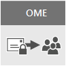

# Office 365의 전자 메일 암호화Email encryption in Office 365

이 문서에서는 OME (office 메시지 암호화), S/MIME, IRM (정보 권한 관리)을 비롯 한 office 365의 암호화 옵션을 비교 하 고 TLS (전송 계층 보안)을 소개 합니다.This article compares encryption options in Office 365 including Office Message Encryption (OME), S/MIME, Information Rights Management (IRM), and introduces Transport Layer Security (TLS).
  
Office 365는 전자 메일 보안에 대한 비즈니스 요구를 충족하는 데 도움이 되는 여러 가지 암호화 옵션을 제공합니다.Office 365 delivers multiple encryption options to help you meet your business needs for email security. 이 문서에서는 Office 365에서 전자 메일을 암호화 하는 세 가지 방법을 제공 합니다.This article presents three ways to encrypt email in Office 365. office 365의 모든 보안 기능에 대 한 자세한 내용을 보려면 [office 365 보안 센터](http://go.microsoft.com/fwlink/p/?LinkID=282470)를 방문 하세요.If you want to learn more about all security features in Office 365, visit the [Office 365 Trust Center](http://go.microsoft.com/fwlink/p/?LinkID=282470). 이 문서에서는 office 365 관리자가 office 365에서 전자 메일을 보호 하는 데 사용할 수 있는 세 가지 암호화 유형을 소개 합니다.This article introduces the three types of encryption available for Office 365 administrators to help secure email in Office 365:
  
- OME(Office 메시지 암호화)Office Message Encryption (OME).
    
- S/MIME(Secure/Multipurpose Internet Mail Extensions)Secure/Multipurpose Internet Mail Extensions (S/MIME).
    
- IRM(정보 권한 관리)Information Rights Management (IRM).
    
## 전자 메일 암호화란 무엇이며 Office 365가 그 기능을 어떻게 사용하나요?What is email encryption and how does Office 365 use it?

암호화는 인증 된 받는 사람만 정보를 디코딩하고 사용할 수 있도록 정보가 인코딩된 프로세스입니다.Encryption is the process by which information is encoded so that only an authorized recipient can decode and consume the information. Office 365에서는 두 가지 방법, 즉 서비스와 고객 컨트롤로 암호화를 사용 합니다.Office 365 uses encryption in two ways: in the service, and as a customer control. 이 서비스에서 암호화는 기본적으로 Office 365에서 사용 됩니다. 어떤 항목도 구성할 필요가 없습니다.In the service, encryption is used in Office 365 by default; you don't have to configure anything. 예를 들어 Office 365에서는 TLS (전송 계층 보안)를 사용 하 여 두 서버 간의 연결 또는 세션을 암호화 합니다.For example, Office 365 uses Transport Layer Security (TLS) to encrypt the connection, or session, between two servers. 
  
전자 메일 암호화가 일반적으로 작동 하는 방식은 다음과 같습니다.Here's how email encryption typically works:
  
- 보낸 사람의 컴퓨터에서 또는 메시지가 전송 되는 동안 중앙 서버에서 메시지가 암호화 되거나 일반 텍스트에서 읽을 수 없는 암호 텍스트로 변환 됩니다.A message is encrypted, or transformed from plain text into unreadable ciphertext, either on the sender's machine, or by a central server while the message is in transit.
    
- 메시지를 가로챌 때 메시지가 차단 되는 것을 방지 하기 위해 전송 되는 동안에는 암호화 된 상태로 유지 됩니다.The message remains in ciphertext while it's in transit in order to protect it from being read in case the message is intercepted.
    
- 받는 사람이 메시지를 받으면 다음 두 가지 방법 중 하나를 통해 메시지가 읽을 수 있는 일반 텍스트 형식으로 다시 변환됩니다.Once the message is received by the recipient, the message is transformed back into readable plain text in one of two ways:
    
  - 받는 사람의 컴퓨터에서 메시지 암호를 해독 하는 키를 사용 하거나The recipient's machine uses a key to decrypt the message, or
    
  - 중앙 서버는 받는 사람의 id를 확인 한 후 받는 사람을 대신 하 여 메시지의 암호를 해독 합니다.A central server decrypts the message on behalf of the recipient, after validating the recipient's identity.
    
office 365에서 서버 간의 통신을 보호 하는 방법에 대 한 자세한 내용은 office 365 외부에 있는 조직 간, office 365 외의 신뢰할 수 있는 비즈니스 파트너 간 연결, [Exchange Online이 TLS를 사용 하 여 전자 메일을 보호 하는 방법를 참조 하세요. Office 365의 연결](exchange-online-uses-tls-to-secure-email-connections.md)For more information on how Office 365 secures communication between servers, such as between organizations within Office 365 or between Office 365 and a trusted business partner outside of Office 365, see [How Exchange Online uses TLS to secure email connections in Office 365](exchange-online-uses-tls-to-secure-email-connections.md).
  
[Office 365의 암호화](https://www.youtube.com/watch?v=KmfxCd5ublI)에 대 한 소개를 보려면이 비디오를 시청 하세요.Watch this video for an introduction to [Encryption in Office 365](https://www.youtube.com/watch?v=KmfxCd5ublI).
  
## Office 365에서 사용할 수 있는 전자 메일 암호화 옵션 비교Comparing email encryption options available in Office 365

|||||
|:-----|:-----|:-----|:-----|
|OME(Office 365 메시지 암호화)란 무엇입니까?What is it?|OME(Office 365 메시지 암호화)는 Azure RMS(권한 관리)를 기반으로 구축된 서비스로, 대상의 전자 메일 주소(Gmail, Yahoo! Mail, Outlook.com 등)에 상관없이 사용자 조직 내부 또는 외부 사람에게 암호화된 전자 메일을 보낼 수 있습니다.Office 365 Message Encryption (OME) is a service built on Azure Rights Management (Azure RMS) that lets you send encrypted email to people inside or outside your organization, regardless of the destination email address (Gmail, Yahoo! Mail, Outlook.com, etc.).    관리자는 암호화 조건을 정의하는 전송 규칙을 설정할 수 있습니다. 사용자가 규칙에 맞는 메시지를 보내면 암호화가 자동으로 적용됩니다.As an admin, you can set up transport rules that define the conditions for encryption. When a user sends a message that matches a rule, encryption is applied automatically.    암호화된 메시지를 보려면 받는 사람이 일회용 암호를 얻어 Microsoft 계정에 로그인하거나 Office 365와 연결된 회사 또는 학교 계정을 사용하여 로그인할 수 있습니다.To view encrypted messages, recipients can either get a one-time passcode, sign in with a Microsoft account, or sign in with a work or school account associated with Office 365. 받는 사람은 암호화된 회신을 보낼 수도 있습니다.Recipients can also send encrypted replies. 암호화 된 메시지를 보거나 암호화 된 회신을 보내기 위해 Office 365 구독이 필요 하지는 않습니다.They don't need an Office 365 subscription to view encrypted messages or send encrypted replies.|IRM은 전자 메일 메시지에 사용 제한을 적용하는 암호화 솔루션입니다. 권한이 없는 사용자가 중요한 정보를 인쇄, 전달 또는 복사하는 것을 방지할 수 있습니다.IRM is an encryption solution that also applies usage restrictions to email messages. It helps prevent sensitive information from being printed, forwarded, or copied by unauthorized people.    Office 365의 IRM 기능은 Azure RMS(Azure 권한 관리)를 사용합니다.IRM capabilities in Office 365 use Azure Rights Management (Azure RMS).|S/MIME는 메시지를 암호화하고 메시지에 디지털 서명을 할 수 있는 인증서 기반의 암호화 솔루션입니다.S/MIME is a certificate-based encryption solution that allows you to both encrypt and digitally sign a message. 메시지 암호화를 사용하면 받는 사람만 메시지를 열고 읽도록 할 수 있습니다.The message encryption helps ensure that only the intended recipient can open and read the message. 디지털 서명은 받는 사람이 보낸 사람의 ID를 확인할 수 있도록 합니다.A digital signature helps the recipient validate the identity of the sender.    디지털 서명과 메시지 암호화 둘 모두는 디지털 서명을 확인하고 메시지를 암호화 또는 암호 해독하는 키가 포함된 고유한 디지털 인증서를 사용하여 가능해졌습니다.Both digital signatures and message encryption are made possible through the use of unique digital certificates that contain the keys for verifying digital signatures and encrypting or decrypting messages.    S/MIME를 사용하려면 각 받는 사람에 대해 파일에 공개 키가 있어야 합니다.To use S/MIME, you must have public keys on file for each recipient. 받는 사람은 자신의 개인 키를 반드시 안전하게 유지해야 합니다.Recipients have to maintain their own private keys, which must remain secure. 받는 사람의 개인 키가 손상 된 경우 받는 사람은 새 개인 키를 가져오고 모든 잠재적인 보낸 사람에 게 공개 키를 재배포 해야 합니다.If a recipient's private keys are compromised, the recipient needs to get a new private key and redistribute public keys to all potential senders.|
|어떤 작업을 수행하나요?What does it do?|OMEOME:     내부 또는 외부 받는 사람에게 보내는 메시지를 암호화합니다.Encrypts messages sent to internal or external recipients.     사용자가 Outlook.com, Yahoo! Mail, Gmail 등의 전자 메일 주소로 암호화된 메시지를 보낼 수 있습니다.Allows users to send encrypted messages to any email address, including Outlook.com, Yahoo! Mail, and Gmail.     관리자는 전자 메일 보기 포털을 사용자 지정 하 여 조직의 브랜드를 반영할 수 있습니다.Allows you, as an admin, to customize the email viewing portal to reflect your organization's brand.     Microsoft는 키를 안전 하 게 관리 하 고 저장 하므로 필요 하지는 않습니다.Microsoft securely manages and stores the keys, so you don't have to.     브라우저에서 암호화된 메시지(HTML 첨부 파일로 전송)를 열 수 있는 한 특별한 클라이언트 쪽 소프트웨어가 필요하지 않습니다.No special client side software is needed as long as the encrypted message (sent as an HTML attachment) can be opened in a browser.|않았다고IRM:     암호화 및 사용 제한을 사용하여 전자 메일 메시지 및 첨부 파일을 온라인/오프라인으로 보호합니다.Uses encryption and usage restrictions to provide online and offline protection for email messages and attachments.     관리자가 전송 규칙 또는 Outlook 보호 규칙을 설정할 수 있도록 함으로써 IRM을 자동으로 적용하여 메시지를 선택할 수 있습니다.Gives you, as an admin, the ability to set up transport rules or Outlook protection rules to automatically apply IRM to select messages.     사용자가 outlook 또는 웹용 outlook (이전의 outlook web App)에서 템플릿을 수동으로 적용할 수 있습니다.Lets users manually apply templates in Outlook or Outlook on the web (formerly known as Outlook Web App).|S/MIME는 디지털 서명으로 기밀성 보낸사람 인증을 확인하고 암호화로 메시지 기밀을 확인합니다.S/MIME addresses sender authentication with digital signatures, and message confidentiality with encryption.|
|어떤 작업을 하지 않나요?What does it not do?|OME에서는 메시지에 사용 제한을 적용할 수 없습니다.OME doesn't let you apply usage restrictions to messages. 예를 들어,이를 사용 하 여 받는 사람이 암호화 된 메시지를 전달 하거나 인쇄 하지 못하게 할 수는 없습니다.For example, you can't use it to stop a recipient from forwarding or printing an encrypted message.|일부 응용 프로그램은 일부 장치에서 IRM 전자 메일을 지원하지 않을 수 있습니다.Some applications may not support IRM emails on all devices. IRM 전자 메일을 지 원하는 이러한 제품과 기타 제품에 대 한 자세한 내용은 [클라이언트 장치 기능](https://technet.microsoft.com/library/dn655136.aspx#BKMK_ClientCapabilities)을 참조 하세요.For more information about these and other products that support IRM email, see [Client device capabilities](https://technet.microsoft.com/library/dn655136.aspx#BKMK_ClientCapabilities).|S/MIME에서는 암호화 된 메시지를 맬웨어, 스팸 또는 정책에 대 한 검색을 허용 하지 않습니다.S/MIME doesn't allow encrypted messages to be scanned for malware, spam, or policies.|
|권장 사항 및 예제 시나리오Recommendations and example scenarios|조직의 외부 사용자에 게 중요 한 비즈니스 정보를 전송 하려는 경우에는 소비자 또는 다른 기업이 든 OME를 사용 하는 것이 좋습니다.We recommend using OME when you want to send sensitive business information to people outside your organization, whether they're consumers or other businesses. 예를 들면 다음과 같습니다.For example:     은행 직원이 고객에게 신용 카드 청구서를 보내는 경우A bank employee sending credit card statements to customers     병원에서 환자에 게 의료 기록을 보내는 경우A doctor's office sending medical records to a patient     한 변호사가 다른 변호사에게 기밀 법적 정보를 보내는 경우An attorney sending confidential legal information to another attorney|사용 제한뿐만 아니라 암호화도 적용하려는 경우 IRM을 사용하는 것이 좋습니다. 예를 들면 다음과 같습니다.We recommend using IRM when you want to apply usage restrictions as well as encryption. For example:     팀에 새 제품에 대 한 기밀 정보를 보내는 관리자가 "전달 금지" 옵션을 적용 합니다.A manager sending confidential details to her team about a new product applies the "Do Not Forward" option.     임원이 Office 365를 사용하는 파트너의 첨부 파일이 포함된 입찰 제안서를 다른 회사와 공유해야 하는데 전자 메일과 첨부 파일이 모두 보호되어야 하는 경우An executive needs to share a bid proposal with another company, which includes an attachment from a partner who is using Office 365, and require both the email and the attachment to be protected.|조직 또는 받는 사람의 조직이 진정한 피어 투 피어 암호화를 요구 하는 경우 S/MIME을 사용 하는 것이 좋습니다.We recommend using S/MIME when either your organization or the recipient's organization requires true peer-to-peer encryption.     S/MIME는 다음과 같은 시나리오에서 가장 많이 사용됩니다.S/MIME is most commonly used in the following scenarios:     정부 기관이 다른 정부 기관과 통신하는 경우Government agencies communicating with other government agencies     기업이 정부 기관과 통신하는 경우A business communicating with a government agency|
   
## 내 Office 365 구독에 대해 사용할 수 있는 암호화 옵션은 무엇이 있나요?What encryption options are available for my Office 365 subscription?

Office 365 구독의 전자 메일 암호화 옵션에 대 한 자세한 내용은 [Exchange Online 서비스 설명을](https://technet.microsoft.com/en-us/library/exchange-online-service-description.aspx)참조 하세요.For information about email encryption options for your Office 365 subscription see the [Exchange Online service description](https://technet.microsoft.com/en-us/library/exchange-online-service-description.aspx). 여기서 다음 암호화 기능에 대한 정보를 찾을 수 있습니다.Here, you can find information about the following encryption features:
  
- IRM 기능 및 OME 모두를 비롯한 Azure RMSAzure RMS, including both IRM capabilities and OME
    
- S/MIMES/MIME
    
- TLSTLS
    
- BitLocker를 통한 보관된 데이터 암호화Encryption of data at rest (through BitLocker)
    
## 보관된 데이터의 암호화는 어떻게 하나요?What about encryption for data at rest?

"휴지 중인 데이터"는 현재 전송 중이지 않은 데이터를 참조 합니다."Data at rest" refers to data that isn't actively in transit. Office 365에서는 BitLocker 드라이브 암호화를 사용하여 보관된 전자 메일 데이터를 암호화합니다.In Office 365, email data at rest is encrypted using BitLocker Drive Encryption. BitLocker는 Office 365 데이터 센터의 하드 드라이브를 암호화하여 무단 액세스에 대한 보호를 강화합니다.BitLocker encrypts the hard drives in Office 365 datacenters to provide enhanced protection against unauthorized access. 자세한 내용을 알아보려면 [BitLocker 개요](https://go.microsoft.com/fwlink/p/?LinkId=394737)를 참조하세요.To learn more, see [BitLocker Overview](https://go.microsoft.com/fwlink/p/?LinkId=394737).
  
## Office 365의 전자 메일 암호화 옵션에 대한 자세한 내용More information about email encryption options in Office 365

이 문서와 TLS에서의 전자 메일 암호화 옵션에 대한 자세한 내용은 다음 문서를 참조하세요.For more information about the email encryption options in this article as well as TLS, see these articles:
  
 **OME****OME**
  
[Office 365 메시지 암호화 (OME)Office 365 Message Encryption (OME)](ome.md)
  
 **않았다고****IRM**
  
[Exchange Online의 정보 권한 관리Information Rights Management in Exchange Online](https://technet.microsoft.com/en-us/library/jj983436%28v=exchg.150%29.aspx)
  
[Azure 권한 관리 란?What is Azure Rights Management?](https://technet.microsoft.com/library/jj585026)
  
 **S/MIME****S/MIME**
  
[메시지 서명 및 암호화를 위한 S/MIMES/MIME for message signing and encryption](https://technet.microsoft.com/library/dn626158)
  
[S/MIME 이해Understanding S/MIME](https://technet.microsoft.com/library/aa995740%28v=exchg.65%29.aspx)
  
[공개 키 암호화 이해Understanding Public Key Cryptography](https://technet.microsoft.com/library/aa998077%28v=exchg.65%29.aspx)
  
 **ls****TLS**
  
[Office 365에서 커넥터를 사용 하 여 사용자 지정 메일 흐름 구성Configure custom mail flow by using connectors in Office 365](https://technet.microsoft.com/en-us/library/jj723138%28v=exchg.150%29.aspx)
  

