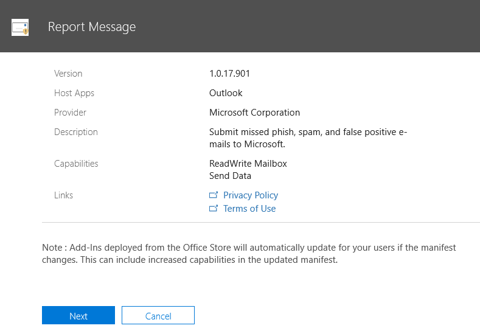

# 보고서 메시지 추가 기능을 사용하도록 설정

> [!NOTE]
> Outlook 및 웹용 outlook에 대 한 보고서 메시지 추가 기능은 [Outlook 정크 메일 필터](https://support.office.com/article/Overview-of-the-Junk-Email-Filter-5ae3ea8e-cf41-4fa0-b02a-3b96e21de089)와는 완전히 동일 하지는 않지만 전자 메일을 정크로 표시 하거나 정크 메일이 아닌 다른 것으로 표시할 수도 있습니다. 차이점은 Outlook 정크 메일 필터를 사용 하 여 사용자의 사서함에 있는 전자 메일 메시지를 구성 하는 것과는 달리, 웹용 outlook의 보고서 메시지 추가 기능에서 Microsoft에 게 스팸으로 잘못 분류 전자 메일을 알립니다. 

## 개요

Outlook 및 웹용 Outlook 용 보고서 메시지 추가 기능을 사용 하면 안전 하거나 악의적이 든 관계 없이 스팸으로 잘못 분류 전자 메일을 Microsoft 및 해당 계열사로 쉽게 보고할 수 있습니다. Microsoft는 이러한 전송을 사용 하 여 전자 메일 보호 기술의 효율성을 개선 합니다. 또한 조직에서 [Office 365 Advanced Threat Protection 계획 1](office-365-atp.md) 또는 [계획 2](office-365-ti.md)를 사용 하는 경우 보고서 메시지 추가 기능은 조직의 보안 팀에 게 보안 정책을 검토 하 고 업데이트 하는 데 사용할 수 있는 유용한 정보를 제공 합니다. 

예를 들어 사용자가 많은 양의 메시지를 피싱 메일로 보고 한다고 가정 합니다. 이 정보는 [보안 대시보드](security-dashboard.md) 및 기타 보고서에 있습니다. 조직의 보안 팀에서이 정보를 사용 하 여 피싱 방지 정책을 업데이트 해야 할 수 있습니다. 또는 사용자가 보고서 메시지 추가 기능을 사용 하 여 정크 메일로 플래그를 지정 하지 않은 많은 메시지를 보고 하는 경우 조직의 보안 팀이 [스팸 방지 정책을](configure-the-anti-spam-policies.md)조정 해야 할 수 있습니다. 

보고서 메시지 추가 기능 이란 Office 365 구독 및 다음 제품과 함께 작동 합니다.
 - 웹용 Outlook
 - Outlook 2013 SP1
 - Outlook 2016
 - Mac용 Outlook 2016
 - Office 365 ProPlus에 포함 된 Outlook

기존 웹 브라우저는 보고서 메시지 추가 기능을 사용 하기에 충분 해야 합니다. 그러나 추가 기능이 사용 가능 하지 않거나 예상 대로 작동 하지 않는 경우 다른 브라우저를 사용해 보세요.
  
개별 사용자 [의 경우에는 보고서 메시지 추가 기능을 사용 하도록 설정할](#get-the-report-message-add-in-for-yourself)수 있습니다. 
  
Office 365 전역 관리자 또는 Exchange Online 관리자이 고 Exchange가 OAuth 인증을 사용 하도록 구성 되어 있는 경우 [조직에 대 한 보고서 메시지 추가 기능을 사용 하도록 설정할](#get-and-enable-the-report-message-add-in-for-your-organization)수 있습니다. 이제 [중앙 집중식 배포](https://docs.microsoft.com/office365/admin/manage/centralized-deployment-of-add-ins)를 통해 보고서 메시지 추가 기능을 사용할 수 있습니다.
    
## 사용자를 위한 보고서 메시지 추가 기능 가져오기

1. [Microsoft AppSource](https://appsource.microsoft.com/marketplace/apps)에서 [보고서 메시지 추가 기능](https://appsource.microsoft.com/product/office/wa104381180)을 검색 합니다.
    
2. **지금 다운로드**를 선택 합니다.   
    
3. 사용 약관 및 개인 정보 보호 정책을 검토 합니다. 그런 다음 **계속**을 선택합니다. 
    
4. 회사 또는 학교 계정 (비즈니스용 사용) 또는 Microsoft 계정 (개인적으로 사용)을 사용 하 여 Office 365에 로그인 합니다.
    
추가 기능을 설치 하 고 사용 하도록 설정한 후에는 다음 아이콘이 표시 됩니다. 

- Outlook에서 아이콘은 다음과 같이 표시 됩니다.    
- 웹용 Outlook (이전의 Outlook Web App)에서는 아이콘이 다음과 같이 표시 됩니다.  

> [!TIP]
> 다음 단계에서는 [보고서 메시지 추가 기능을 사용](https://support.office.com/article/b5caa9f1-cdf3-4443-af8c-ff724ea719d2)하는 방법을 알아봅니다.
  
## 조직에 대 한 보고서 메시지 추가 기능 가져오기 및 사용

> [!IMPORTANT]
> 이 작업을 완료 하려면 Office 365 전역 관리자 또는 Exchange Online 관리자 여야 합니다. 또한 OAuth 인증을 사용 하 여 자세한 내용을 확인할 수 있도록 Exchange를 구성 해야 합니다. [exchange 요구 사항 (추가 기능의 중앙 집중식 배포)](https://docs.microsoft.com/office365/admin/manage/centralized-deployment-of-add-ins)을 참조 하세요. 

1. Microsoft 365 관리 센터의 [서비스 & 추가 기능 페이지로](https://admin.microsoft.com/AdminPortal/Home#/Settings/ServicesAndAddIns) 이동 합니다.   
    
2. **+ 배포 추가 기능**을 선택 합니다.   
    
3. **새 추가 기능** 화면에서 정보를 검토 하 고 **다음**을 선택 합니다.  
    
4. **Office 스토어에서 추가 기능을 추가**하려는 경우를 선택 하 고 **다음**을 선택 합니다.   
    
5. **보고서 메시지**를 검색 하 고 결과 목록에서 **보고서 메시지 추가 기능**옆에 있는 **추가**를 선택 합니다.  
    
6. **보고서 메시지** 화면에서 정보를 검토 하 고 **다음**을 선택 합니다.  

7. Outlook에 대 한 사용자 기본 설정을 지정 하 고 **다음**을 선택 합니다.  

8. 보고서 메시지 추가 기능을 가져오는 사용자를 지정한 다음 **저장**을 선택 합니다.   

> [!TIP]
> [사용자가 보고 하는 전자 메일 메시지의 복사본을 가져오기 위한 규칙을 설정 하는](#set-up-a-rule-to-get-a-copy-of-email-messages-reported-by-your-users)것이 좋습니다.

추가 기능을 설정할 때 선택한 사항 (위의 7-8 단계)에 따라 조직의 사용자가 [보고서 메시지 추가 기능](https://support.office.com/article/b5caa9f1-cdf3-4443-af8c-ff724ea719d2) 을 사용할 수 있습니다. 조직의 사용자에 게 다음 아이콘이 표시 됩니다. 

- Outlook에서 아이콘은 다음과 같이 표시 됩니다.    
- 웹용 Outlook에서 아이콘은 다음과 같이 표시 됩니다.  

> [!TIP]
> 사용자에 게 보고서 메시지 추가 기능에 대 한 알림을 보내는 경우 [보고서 메시지 추가 기능을 사용](https://support.office.com/article/b5caa9f1-cdf3-4443-af8c-ff724ea719d2)하는 링크를 포함 합니다.

## 사용자가 보고 하는 전자 메일 메시지의 복사본을 가져오기 위한 규칙 설정

> [!IMPORTANT]
> 이 작업을 수행 하려면 Exchange Online 관리자 여야 합니다.
  
조직의 사용자가 보고 하는 전자 메일 메시지의 복사본을 가져오기 위한 규칙을 설정할 수 있습니다. 조직에 대 한 보고서 메시지 추가 기능을 다운로드 하 고 사용 하도록 설정한 후이 작업을 수행 합니다.
  
1. Exchange 관리 센터에서 **메일 흐름** \> **규칙**을 선택 합니다. 
    
2. **+** \> **새 규칙 만들기를**선택 합니다. 
    
3. **이름** 상자에 제출을 비롯 한 이름을 입력 합니다.
    
4. 다음의 **경우이 규칙 적용** 목록에서 **받는 사람 주소에 다음 포함 ...** 을 선택 합니다. 
    
5. **단어 또는 구 지정** 화면에서을 추가 `junk@office365.microsoft.com` `phish@office365.microsoft.com`하 고 **확인**을 선택 합니다.  
  
6. **다음 작업 수행** ... 목록에서 **숨은 참조 메시지를**선택 합니다. 
    
7. 사용자가 Microsoft에 보고 하는 각 전자 메일 메시지의 복사본을 받아야 하는 전역 관리자, 보안 관리자 및/또는 보안 리더를 추가한 다음 **확인**을 선택 합니다.  
  
8. **심각도 수준으로이 규칙 감사**를 선택 하 고 **중간**을 선택 합니다. 
    
9. **이 규칙에 대 한 모드 선택**에서 **적용**을 선택 합니다.  
  
10. **저장**을 선택합니다. 
    
이 규칙을 적용 하면 조직의 누군가가 보고서 메시지 추가 기능을 사용 하 여 전자 메일 메시지를 보고할 때마다 전역 관리자, 보안 관리자 및/또는 보안 판독기가 해당 메시지의 복사본을 받게 됩니다. 이 정보를 사용 하 여 [Office 365 ATP 안전한 링크](atp-safe-links.md) 정책 또는 [스팸 방지](anti-spam-protection.md) 설정 등의 정책을 설정 하거나 조정할 수 있습니다. 

## 보고서 메시지 추가 기능을 사용 하는 방법 알아보기

[보고서 메시지 추가 기능 사용](https://support.office.com/article/b5caa9f1-cdf3-4443-af8c-ff724ea719d2)을 참조 하세요.

## 보고서 메시지 추가 기능의 설정 검토 또는 편집

[서비스 & 추가 기능 페이지](https://admin.microsoft.com/AdminPortal/Home#/Settings/ServicesAndAddIns)에서 보고서 메시지 추가 기능의 기본 설정을 검토 하 고 편집할 수 있습니다. 

> [!IMPORTANT]
> 이 작업을 완료 하려면 Office 365 전역 관리자 또는 Exchange Online 관리자 여야 합니다.
    
1. Microsoft 365 관리 센터의 [서비스 & 추가 기능 페이지로](https://admin.microsoft.com/AdminPortal/Home#/Settings/ServicesAndAddIns) 이동 합니다.  

2. 보고서 메시지 추가 기능을 찾아 선택 합니다.   
    
3. 보고서 메시지 화면에서 조직에 적합 한 설정을 검토 하 고 편집 합니다.   

## 관련 항목

[보고서 메시지 추가 기능 사용](https://support.office.com/article/b5caa9f1-cdf3-4443-af8c-ff724ea719d2)
  
[보안 &amp; 및 준수 센터의 전자 메일 보안 보고서 보기](view-email-security-reports.md)

[Office 365 Advanced Threat Protection에 대 한 보고서 보기](view-reports-for-atp.md)

[보안 &amp; 및 준수 센터에서 탐색기 사용](use-explorer-in-security-and-compliance.md)
  

