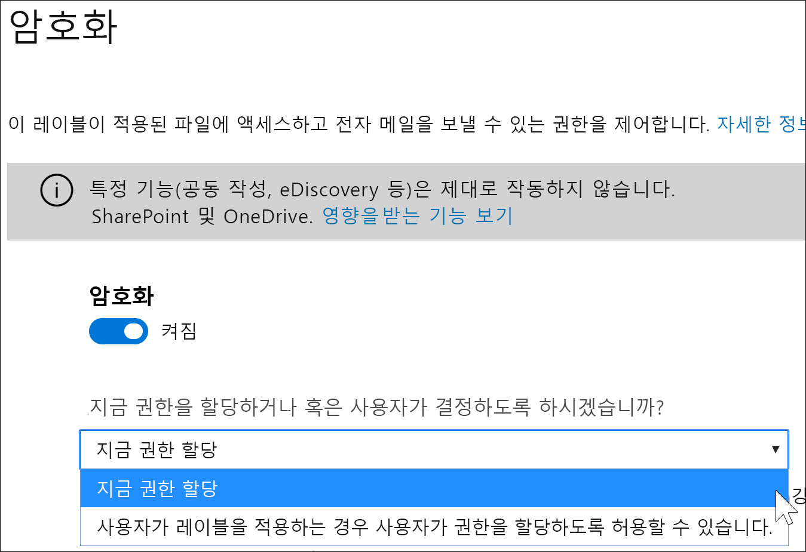
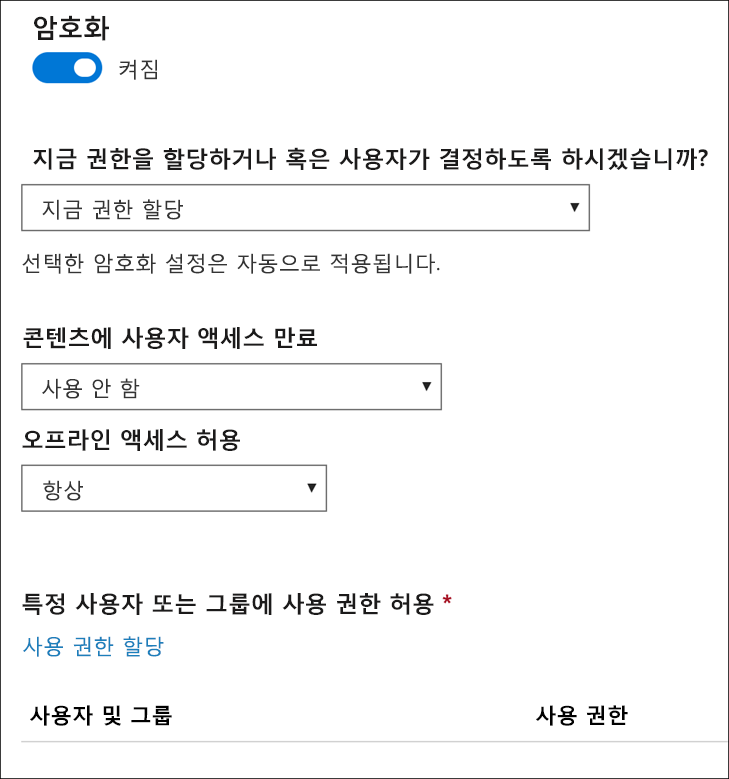
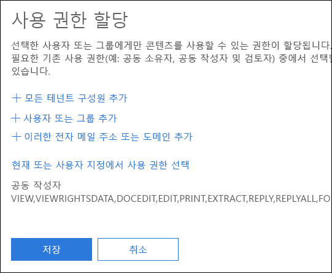
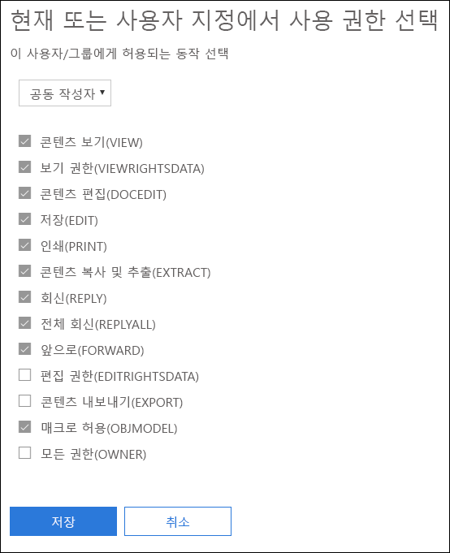
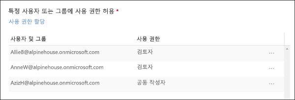
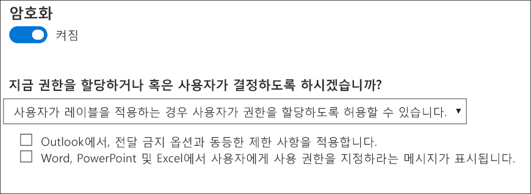
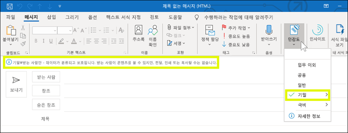
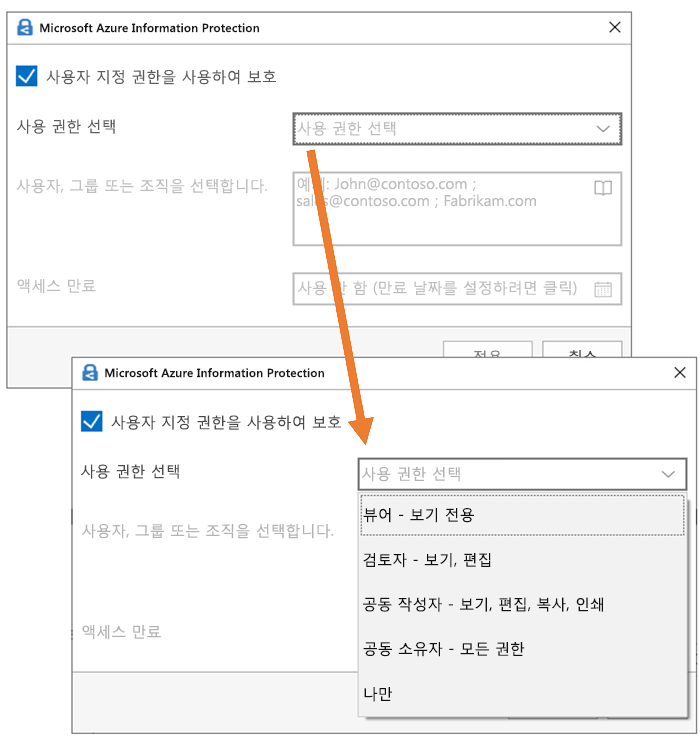

# 민감도 레이블에서 암호화를 사용하여 콘텐츠 액세스 제한

민감한 레이블을 만들면 레이블이 적용되는 콘텐츠에 대한 액세스를 제한할 수 있습니다. 예를 들어 민감도 레이블의 암호화 설정으로 다음과 같이 콘텐츠를 보호할 수 있습니다.

- 조직 내의 사용자만 기밀 문서나 전자 메일을 열 수 있습니다.
- 마케팅 부서의 사용자만 프로모션 공지 사항 문서 또는 전자 메일을 편집하고 인쇄할 수 있으며 조직의 다른 모든 사용자는 이를 읽는 것만 가능합니다.
- 사용자는 내부 재구성에 대한 소식이 포함된 전자 메일을 전달하거나 정보를 복사할 수 없습니다.
- 비즈니스 파트너에게 전송되는 현재 가격 목록은 특정 날짜 이후에 열 수 없습니다.

문서 또는 전자 메일이 암호화되면 콘텐츠에 대한 액세스가 다음과 같이 제한됩니다.

- 레이블의 암호화 설정에 따라 권한이 있는 사용자만 암호를 해독할 수 있습니다.
- 파일의 이름이 바뀌더라도 조직의 내부 또는 외부에 관계 없이 암호화된 상태로 유지됩니다.
- 작동 중단 시(예: OneDrive 계정에서) 및 전송 중(예: 보낸 전자 메일)에 모두 암호화됩니다.

마지막으로, 관리자가 민감도 레이블을 만들 때 다음 중 하나를 선택할 수 있습니다.

- 어떤 사용자에게 해당 레이블이 있는 콘텐츠에 어떤 권한을 부여할 것인지 정확하게 결정하도록 **지금 권한을 할당**합니다.
- 사용자가 콘텐츠에 레이블을 적용하는 경우 **사용자가 권한을 할당하도록** 허용할 수 있습니다. 이렇게 하면 조직의 사용자가 공동 작업과 작업 수행을 유연하게 할 수 있습니다.

암호화 설정은 Microsoft 365 규정 준수 센터, Microsoft 365 보안 센터 또는 Office 365 보안 및 규정 준수 센터에서 민감도 레이블을 만들 때 사용할 수 있습니다. 왼쪽 탐색 창에서 **분류** > **민감도 레이블** > **레이블 만들기**를 선택합니다.

## 암호화가 작동하는 방식

암호화는 Microsoft Azure AD Rights Management(Azure RMS)를 사용합니다. Azure RMS는 암호화, ID 및 권한 부여 정책을 사용합니다. 자세한 내용은 [Azure 권한 관리 정의](https://docs.microsoft.com/ko-KR/azure/information-protection/what-is-azure-rms)를 참조하세요.

## 민감도 레이블의 암호화를 설정하는 방법

시작하려면 먼저 **암호화**를 **설정**으로 전환하고 아래의 작업 여부를 선택합니다. 

- 어떤 사용자에게 해당 레이블이 있는 콘텐츠에 어떤 권한을 부여할 것인지 정확하게 결정할 수 있도록 **지금 권한을 할당**합니다. 자세한 내용은 다음 섹션 [지금 권한 할당](#assign-permissions-now) 을 참조하세요.
- 사용자가 콘텐츠에 레이블을 적용하는 경우 **사용자가 권한을 할당하도록** 허용할 수 있습니다. 이렇게 하면 조직의 사용자가 공동 작업과 작업 수행을 유연하게 할 수 있습니다. 자세한 내용은 아래 섹션 [사용자가 권한을 할당할 수 있도록 허용](#let-users-assign-permissions)을 참조하세요.

예를 들어, 가장 중요한 콘텐츠에 적용되는 **극비**라는 민감도 레이블을 사용하는 경우 해당 콘텐츠의 사용 권한 유형을 받을 사용자를 결정하는 것이 좋습니다.

또는 **비즈니스 계약서**라는 민감도 레이블을 사용하고, 사용자 조직의 워크플로에 따라 사용자가 임시로 다른 사용자와 이 콘텐츠에 대해 공동 작업해야 하는 경우, 사용자가 레이블을 지정할 때 권한을 받을 사용자를 결정할 수 있습니다. 이와 같은 유연성을 갖추어 사용자의 생산성은 향상되고 관리자가 특정 시나리오를 해결하기 위해 새 민감도 레이블을 업데이트하거나 만들어야 하는 요청은 줄일 수 있습니다.

## 지금 권한 할당

아래 옵션을 사용하여 이 레이블이 적용되는 전자 메일 또는 문서에 액세스할 수 있는 사용자를 제어합니다. 다음을 수행할 수 있습니다.

1. **전자 메일과 문서 둘 다에 암호화를 적용하거나 전자 메일에만 적용합니다.** 전자 메일만 선택하면 이 레이블이 있는 메시지가 Outlook에서 암호화되지만 이 레이블이 있는 문서는 Word 또는 PowerPoint와 같은 다른 응용 프로그램에서 암호화되지 않습니다. 
2. 특정 날짜 또는 레이블을 지정한 후 특정 일수가 지나면 **레이블을 지정한 콘텐츠에 대한 액세스가 만료**되도록 합니다. 이 기간 이후 사용자는 레이블을 지정한 항목을 열 수 없습니다. 날짜를 지정하는 경우 표준 시간대의 해당 날짜 자정에 적용됩니다. 일부 전자 메일 클라이언트의 경우 캐싱 메커니즘으로 인해 만료 기능이 적용되지 않을 수 있으며 만료 날짜가 지난 전자 메일이 표시될 수 있습니다.
3. **오프라인 액세스 허용**을 허용 안 함, 항상 허용 또는 레이블을 적용한 후 특정 일수 동안 허용합니다. 오프라인 액세스를 허용 안 함 또는 며칠로 제한하는 경우 임계값에 도달하면 사용자를 다시 인증해야 하고 액세스 권한이 기록됩니다. 자세한 내용은 권한 관리 사용 라이선스에 대한 다음 섹션을 참조하세요.

### 오프라인 액세스에 대한 권한 관리 사용 라이선스

사용자가 민감도 레이블로 보호되는 문서 또는 전자 메일을 오프라인으로 열면 사용자에게 해당 콘텐츠에 대한 Microsoft Azure AD Rights Management 사용 라이선스가 부여됩니다. 이 사용 라이선스는 문서 또는 전자 메일에 대한 사용자의 사용 권한 및 콘텐츠를 암호화하는 데 사용된 암호화 키가 포함된 인증서입니다. 사용 라이선스에는 만료 날짜가 설정된 경우 만료 날짜와 사용 라이선스가 유효한 기간이 포함되어 있습니다.

만료 날짜가 설정된 경우 테넌트에 대한 기본 사용 라이선스의 유효 기간은 30일입니다. 사용 라이센스 동안 콘텐츠에 대해 다시 인증받지 않습니다. 이를 통해 인터넷에 연결하지 않고도 보호된 문서 또는 전자 메일을 계속 열 수 있습니다. 사용 라이선스 유효 기간이 만료되면 다음에 사용자가 보호된 문서 또는 전자 메일에 액세스할 때 다시 인증받아야 합니다.

재인증 외에도 정책 및 사용자 그룹 구성원 자격이 다시 평가됩니다. 즉, 사용자가 마지막으로 콘텐츠에 액세스한 시점에서 정책이나 그룹 구성원에 변경된 사항이 있는 경우 사용자에게 동일한 문서 또는 전자 메일에 대해 다른 액세스 결과를 제공할 수 있습니다.

기본값 30일 설정을 변경하는 방법을 알아보려면 [권한 관리 사용 라이선스](https://docs.microsoft.com/ko-KR/azure/information-protection/configure-usage-rights#rights-management-use-license)를 참조하세요.

### 특정 사용자 또는 그룹에 사용 권한 할당

특정 사용자만 레이블이 지정된 콘텐츠와 상호 작용할 수 있도록 사용 권한을 부여할 수 있습니다.

다음의 2단계로 간단하게 진행할 수 있습니다.

1. 먼저 사용 권한을 할당할 사용자 또는 그룹을 레이블이 지정된 콘텐츠에 추가합니다.
2. 그런 다음 해당 사용자가 레이블이 지정된 콘텐츠에 대한 사용 권한을 선택합니다.

#### 사용자 또는 그룹 추가

권한을 할당할 때 다음을 선택할 수 있습니다.

- 조직의 모든 사용자(모든 테넌트 구성원). 이 설정에서는 게스트 계정이 제외됩니다.
- 모든 특정 사용자 또는 전자 메일 사용이 가능한 보안 그룹, 메일 그룹, Office 365 그룹 또는 동적 메일 그룹. 
- 조직 외부의 모든 이메일 주소 또는 도메인(예: gmail.com, hotmail.com 또는 outlook.com).

모든 테넌트 구성원을 선택하거나 디렉토리를 탐색할 때 사용자 또는 그룹에 전자 메일 주소가 있어야 합니다.

모범 사례로 사용자 대신 그룹을 사용할 수 있습니다. 이 전략으로 더 간단하게 구성할 수 있습니다.

#### 사용 권한 선택

해당 사용자 또는 그룹에 허용할 사용 권한을 선택하면 다음 중 하나를 선택할 수 있습니다.

- 미리 설정된 권한 그룹(예: 공동 작성 또는 검토자)이 있는 [미리 정의된 권한 수준](https://docs.microsoft.com/ko-KR/azure/information-protection/configure-usage-rights#rights-included-in-permissions-levels).
- 원하는 사용 권한을 선택해 허용할 수 있는 사용자 지정 권한 그룹.

각 특정 사용 권한에 대한 자세한 내용은 [사용 권한 및 설명](https://docs.microsoft.com/ko-KR/azure/information-protection/configure-usage-rights#usage-rights-and-descriptions)을 참조하세요.  

동일한 레이블로 다른 사용자에게 다른 권한을 부여할 수 있습니다. 예를 들어 아래 그림과 같이 단일 레이블로 일부 사용자를 검토자로 다른 사용자를 공동 작성자로 할당할 수 있습니다.

이를 위해서는 사용자 또는 그룹을 추가하고 사용 권한을 할당하고 해당 설정을 저장합니다. 그런 다음 매번 이 단계를 반복하여 사용자를 추가하고 권한을 할당하고 설정을 저장합니다. 이 작업을 필요한 만큼 수행하여 여러 사용자에게 서로 다른 권한을 정의할 수 있습니다.

#### 권한 관리 발급자(민감도 레이블을 적용한 사용자)는 항상 모든 권한을 갖습니다

민감도 레이블의 암호화는 Azure RMS를 사용합니다. 사용자가 Azure RMS를 사용하여 문서 또는 전자 메일을 보호하기 위해 중요도 레이블을 적용하면 해당 사용자는 해당 내용에 대한 권한 관리 발급자가 됩니다.

권한 관리 발급자는 문서 또는 전자 메일에 대한 모든 권한을 항상 부여받으며, 또한 다음과 같은 권한을 갖습니다.

- 보호 설정에 만료 날짜가 포함된 경우 권한 관리 발급자는 해당 날짜 이후에도 여전히 문서 또는 전자 메일을 열고 편집할 수 있습니다.
- 권한 관리 발급자는 문서 또는 전자 메일을 언제든지 오프라인으로 액세스할 수 있습니다.
- 권한 관리 발급자는 권한이 해지된 후에도 문서를 열 수 있습니다.

자세한 내용은 [권한 관리 발급자 및 권한 관리 소유자](https://docs.microsoft.com/ko-KR/azure/information-protection/configure-usage-rights#rights-management-issuer-and-rights-management-owner)를 참조하세요.

## 사용자가 권한을 할당하도록 허용

다음 옵션을 사용하여 사용자가 민감도 레이블을 콘텐츠에 수동으로 추가할 때 사용자가 권한을 할당하도록 허용할 수 있습니다.

- Outlook에서, **전달 금지** 옵션과 동등한 제한 사항을 적용할 수 있습니다. 이 옵션은 Windows용 Outlook에서 기본적으로 지원되며 Azure Information Protection 통합 레이블 지정 클라이언트를 설치할 필요가 없습니다.
- Word, PowerPoint 및 Excel의 경우, 특정 사용자, 그룹 또는 조직에 대한 권한 수준을 선택하라는 메시지가 표시됩니다. 이 옵션은 이 Office 앱에서 기본적으로 지원되지 않으므로 Azure Information Protection 통합 레이블 지정 클라이언트를 설치해야 합니다.

다음 옵션에서는 민감도 레이블이 표시될 앱을 결정합니다.

- 민감도 레이블에 Outlook 옵션만 활성화된 경우, 레이블이 Outlook에서만 사용자에게만 표시됩니다.
- 민감도 레이블에 Word, PowerPoint 및 Excel 옵션만 활성화된 경우, 레이블이 해당 앱에서만 사용자에게 표시됩니다.
- 민감도 레이블에 두 옵션이 모두 활성화된 경우, 사용 가능한 모든 앱(Outlook, Word, PowerPoint 및 Excel)에서 레이블이 사용자에게 표시됩니다.

사용자가 권한을 할당할 수 있도록 허용하는 민감도 레이블은 사용자가 수동으로만 콘텐츠에 적용할 수 있으므로, 이를 추천 레이블로 자동 적용 또는 사용할 수 없습니다.

> [!NOTE]
> 사용자가 권한을 할당하도록 허용하려면 Azure Information Protection 구독이 필요합니다. Word, PowerPoint 및 Excel에서 이 기능을 사용하려면 [Azure Information Protection 통합 레이블 지정 클라이언트](https://docs.microsoft.com/azure/information-protection/rms-client/install-unifiedlabelingclient-app)를 다운로드하여 설치해야 합니다. Office 앱에서 이 기능에 대한 기본 지원에 대해 작업하고 있으므로 Azure Information Protection 클라이언트를 사용하지 않아도 됩니다. 또한, 클라이언트는 Windows에서만 실행되므로 Mac, iOS, Android 또는 웹용 Office에서는 이 기능이 아직 지원되지 않습니다.

### Outlook 제한 사항

Outlook에서, 사용자가 메시지에 권한을 할당하도록 허용하는 민감도 레이블을 적용하는 경우 이 제한 사항은 전달 금지 옵션과 동일합니다. 사용자에게 메시지 맨 위에 레이블 이름과 설명이 표시됩니다. 이는 콘텐츠가 보호되고 있음을 나타냅니다. Word, PowerPoint 및 Excel([다음 섹션](#word-powerpoint-and-excel-permissions) 참조)과 달리, 사용자에게 특정 권한을 선택 하라는 메시지가 표시되지 않습니다.

전달 금지 옵션이 전자 메일에 적용되는 경우, 전자 메일이 암호화되므로 받는 사람을 인증해야 합니다. 그런 다음, 받는 사람이 이를 전달하거나, 인쇄하거나, 복사할 수 없습니다. 예를 들어, Outlook 클라이언트에서 전달 단추를 사용할 수 없고, 다른 이름으로 저장 및 인쇄 메뉴 옵션도 사용할 수 없으며, 받는 사람, 참조 또는 숨은 참조 상자에서 받는 사람을 추가하거나 변경할 수 없습니다.

전자 메일에 첨부된 보호되지 않는 Office 문서는 자동으로 동일한 제한 사항을 상속합니다. 이 문서에 적용되는 사용 권한은 콘텐츠 편집, 편집, 저장, 보기, 열기, 읽기, 모든 매크로입니다. 사용자가 첨부 파일에 대해 다른 권한을 요구하는 경우 또는 첨부 파일이 상속된 보호를 지원하는 Office 문서가 아닌 경우, 사용자가 파일을 전자 메일에 첨부하기 전에 파일을 보호해야 합니다.

### Word, PowerPoint 및 Excel 권한

Word, PowerPoint 및 Excel에서, 사용자가 문서에 권한을 할당하도록 허용하는 민감도 레이블을 적용하는 경우, 아래에 표시된 대로 콘텐츠를 보호하라는 메시지가 표시됩니다.

사용자는 다음을 수행할 수 있습니다.

- 뷰어(보기 전용 권한 할당) 또는 공동 작성자(보기, 편집, 복사 및 인쇄 권한 할당)와 같은 권한 수준을 선택합니다.
- 사용자, 그룹 또는 조직을 선택합니다. 여기에는 조직의 내부 또는 외부 사용자가 모두 포함될 수 있습니다.
- 선택한 사용자가 콘텐츠에 액세스할 수 없는 만료 날짜를 설정합니다. 자세한 내용은 위에 있는 섹션 [오프라인 액세스용 권한 관리 사용자 라이선스](#rights-management-use-license-for-offline-access)를 참조하세요.

## 레이블이 적용되면 기존 암호화는 어떻게 되나요?

민감도 레이블이 콘텐츠에 적용되기 전에, 일부 다른 보호 설정을 적용하여 콘텐츠를 암호화하는 것이 가능합니다. 예를 들어 다음 기능을 적용할 수 있습니다.

- **전달 금지** 옵션.
- Azure Information Protection 통합된 레이블 지정 클라이언트를 사용하여 사용자 지정 보호합니다.
- 콘텐츠를 암호화하지만 레이블과 관련이 없는 Azure RMS(Rights Management Service) 서식 파일입니다.

이 테이블에서는 민감도 레이블이 해당 콘텐츠에 적용되는 경우 기존 암호화가 어떻게 되는지에 대해 설명합니다.
 
 

| |**암호화가 해제된 민감도 레이블을 적용**|**사용자 설정 되어 암호화로 민감도 레이블을 적용**|**보호 제거를 사용하여 레이블을 적용**1|
|:-----|:-----|:-----|:-----|
|**전달 금지**|전자 메일 - 보호가 제거됨 문서 - 보호가 유지됨|레이블 보호가 적용됨|**전달 금지**가 제거됨|
|**사용자 지정 보호**1|보호가 유지됨|레이블 보호가 적용됨|사용자 지정 보호가 제거됨|
|**Azure RMS 서식 파일**|보호가 유지됨|레이블 보호가 적용됨|사용자 지정 보호가 제거됨|

1이 기능은 Azure Information Protection 레이블 지정 클라이언트에서만 지원됩니다.

## OneDrive 및 SharePoint에 암호화된 콘텐츠 저장

OneDrive 및 SharePoint에 저장된 파일에 암호화가 적용되어 있으면 이 파일의 내용을 처리할 수 없습니다. 즉 공동 작성, eDiscovery, 검색, Delve 및 기타 공동 작업 기능이 작동하지 않습니다. 또한 DLP(데이터 손실 방지) 정책은 메타데이터(Office 365 레이블 포함)에만 작동할 수 있지만 암호화된 파일의 내용(예: 파일 내의 신용 카드 번호)에는 작동할 수 없습니다.

이는 OneDrive 및 SharePoint에 저장된 콘텐츠에만 적용됩니다. Exchange Online에서 메일 흐름 규칙(전송 규칙이라고도 함)은 [수퍼 사용자 계정](https://docs.microsoft.com/ko-KR/azure/information-protection/configure-super-users)을 사용하여 암호화된 콘텐츠를 검사하고 DLP 정책을 적용할 수 있습니다.

## 중요한 필수 구성 요소

암호화를 사용하려면 먼저 이러한 작업을 수행해야 합니다.

### Microsoft Azure AD Rights Management 활성화

민감도 레이블에 암호화를 사용하려면 테넌트에서 Azure 권한 관리 서비스를 활성화해야 합니다. 최신 테넌트의 경우 기본적으로 서비스가 활성화되어 있지만 수동으로 서비스를 활성화해야 할 수 있습니다. 자세한 내용은 [Microsoft Azure AD Rights Management 활성화](https://docs.microsoft.com/ko-KR/azure/information-protection/activate-service)를 참조하세요.

### Azure Information Protection에 대한 Exchange 구성

사용자가 전자 메일을 보호하기 위해 Outlook에서 레이블을 적용하기 전에 Exchange에서 Azure 정보 보호를 구성할 필요가 없습니다. 그러나 Exchange에서 Microsoft Azure Information Protection을 구성하기 전까지 Exchange에서 Microsoft Azure AD Rights Management을 사용하는 모든 기능을 온전히 사용할 수 없습니다.
 
예를 들어 사용자는 휴대폰 또는 웹용 Outlook에서 보호된 전자 메일을 볼 수 없으며 검색 시 보호된 전자 메일이 인덱싱되지 않으며 권한 관리 보호를 위한 Exchange Online DLP를 구성할 수 없습니다. 

Exchange에서 이러한 추가 시나리오를 지원할 수 있는지 확인하려면 다음을 참조하세요.

- Exchange Online의 경우 [Exchange Online: IRM 구성](https://docs.microsoft.com/ko-KR/azure/information-protection/configure-office365#exchange-online-irm-configuration)에 대한 설명서를 참고하세요.
- Exchange 온-프레미스의 경우 [RMS 커넥터를 배포하고 Exchange 서버를 구성](https://docs.microsoft.com/ko-KR/azure/information-protection/deploy-rms-connector)해야 합니다. 
