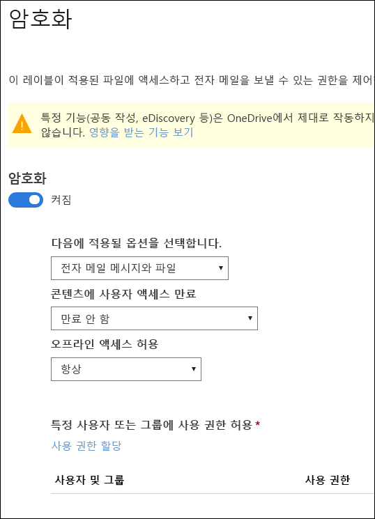
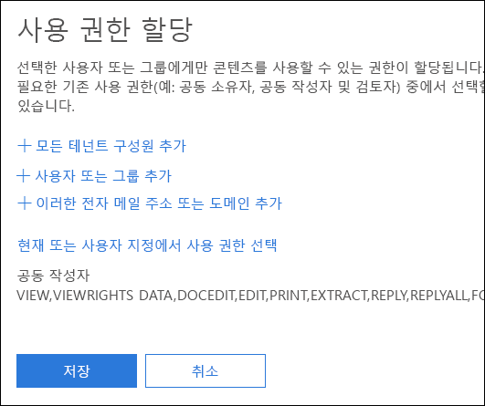
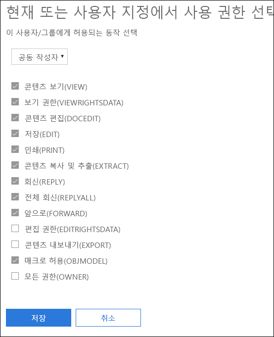
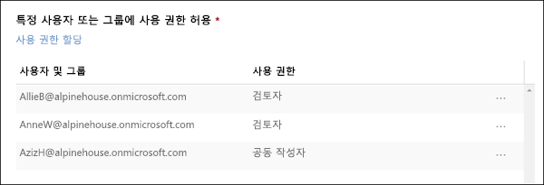

# 민감도 레이블에서 암호화를 사용하여 콘텐츠 액세스 제한Restrict access to content by using encryption in sensitivity labels

민감한 레이블을 만들면 레이블이 적용되는 콘텐츠에 대한 액세스를 제한할 수 있습니다. 예를 들어 민감도 레이블의 암호화 설정으로 다음과 같이 콘텐츠를 보호할 수 있습니다.When you create a sensitivity label, you can restrict access to content that the label will be applied to. For example, with the encryption settings for a sensitivity label, you can protect content so that:

- 조직 내의 사용자만 기밀 문서나 전자 메일을 열 수 있습니다.Only users within your organization can open a confidential document or email.
- 마케팅 부서의 사용자만 프로모션 공지 사항 문서 또는 전자 메일을 편집하고 인쇄할 수 있으며 조직의 다른 모든 사용자는 이를 읽는 것만 가능합니다.Only users in the marketing department can edit and print the promotion announcement document or email, while all other users in your organization can only read it.
- 사용자는 내부 재구성에 대한 소식이 포함된 전자 메일을 전달하거나 정보를 복사할 수 없습니다.Users cannot forward an email or copy information from it that contains news about an internal reorganization.
- 비즈니스 파트너에게 전송되는 현재 가격 목록은 특정 날짜 이후에 열 수 없습니다.The current price list that is sent to business partners cannot be opened after a specified date.

문서 또는 전자 메일이 암호화되면 콘텐츠에 대한 액세스가 다음과 같이 제한됩니다.When a document or email is encrypted, access to the content is restricted, so that it:

- 레이블의 암호화 설정에 따라 권한이 있는 사용자만 암호를 해독할 수 있습니다.Can be decrypted only by users authorized by the label’s encryption settings.
- 파일의 이름이 바뀌더라도 조직의 내부 또는 외부에 관계 없이 암호화된 상태로 유지됩니다.Remains encrypted no matter where it resides, inside or outside your organization, even if the file’s renamed.
- 작동 중단 시(예: OneDrive 계정에서) 및 전송 중(예: 보낸 전자 메일)에 모두 암호화됩니다.Is encrypted both at rest (for example, in a OneDrive account) and in transit (for example, a sent email).

암호화 설정은 Microsoft 365 규정 준수 센터, Microsoft 365 보안 센터 또는 Office 365 보안 및 규정 준수 센터에서 민감도 레이블을 만들 때 사용할 수 있습니다.The encryption settings are available when you create a sensitivity label in the Microsoft 365 compliance center, Microsoft 365 security center, or Office 365 Security & Compliance Center.

## 암호화가 작동하는 방식How encryption works

암호화는 Microsoft Azure AD Rights Management(Azure RMS)를 사용합니다. Azure RMS는 암호화, ID 및 권한 부여 정책을 사용합니다. 자세한 내용은 [Azure 권한 관리 정의](https://docs.microsoft.com/ko-KR/azure/information-protection/what-is-azure-rms)를 참조하세요.Encryption uses Azure Rights Management (Azure RMS). Azure RMS uses encryption, identity, and authorization policies. To learn more, see [What is Azure Rights Management?](https://docs.microsoft.com/ko-KR/azure/information-protection/what-is-azure-rms)

## 민감도 레이블의 암호화를 설정하는 방법How to turn on encryption for a sensitivity label

먼저 **암호화**를 **켬**으로 설정합니다. 그런 다음 아래 옵션을 사용하여 이 레이블이 적용되는 전자 메일 또는 문서에 액세스할 수 있는 사람을 관리할 수 있습니다. 다음을 수행할 수 있습니다.To begin, simply toggle **Encryption** to **On**, and then use the options below to control who can access email or documents to which this label is applied. You can:

1. **전자 메일과 문서 둘 다에 암호화를 적용하거나 전자 메일에만 적용합니다.** 전자 메일만 선택하면 이 레이블이 있는 메시지가 Outlook에서 암호화되지만 이 레이블이 있는 문서는 Word 또는 PowerPoint와 같은 다른 응용 프로그램에서 암호화되지 않습니다.**Apply encryption to both email and documents, or just email.** If you choose just email, messages with this label will be encrypted in Outlook, but documents with this label won't be encrypted in other apps, such as Word or PowerPoint. 
2. 특정 날짜 또는 레이블을 지정한 후 특정 일수가 지나면 **레이블을 지정한 콘텐츠에 대한 액세스가 만료**되도록 합니다. 이 기간 이후 사용자는 레이블을 지정한 항목을 열 수 없습니다. 날짜를 지정하는 경우 표준 시간대의 해당 날짜 자정에 적용됩니다. 일부 전자 메일 클라이언트의 경우 캐싱 메커니즘으로 인해 만료 기능이 적용되지 않을 수 있으며 만료 날짜가 지난 전자 메일이 표시될 수 있습니다.**Allow access to labeled content to expire**, either on a specific date or after a specific number of days after the label is applied. After this time, users won’t be able to open the labeled item. If you specify a date, it is effective midnight on that date in your current time zone. (Note that some email clients may not enforce expiration and show emails past their expiration date, due to their caching mechanisms.)
3. **오프라인 액세스 허용**을 허용 안 함, 항상 허용 또는 레이블을 적용한 후 특정 일수 동안 허용합니다. 오프라인 액세스를 허용 안 함 또는 며칠로 제한하는 경우 임계값에 도달하면 사용자를 다시 인증해야 하고 액세스 권한이 기록됩니다. 자세한 내용은 권한 관리 사용 라이선스에 대한 다음 섹션을 참조하세요.**Allow offline access** never, always, or for a specific number of days after the label is applied. If you restrict offline access to never or a number of days, when that threshold is reached, users must be reauthenticated and their access is logged. For more information, see the next section on the Rights Management use license.

### 오프라인 액세스에 대한 권한 관리 사용 라이선스Rights Management use license for offline access

사용자가 민감도 레이블로 보호되는 문서 또는 전자 메일을 오프라인으로 열면 사용자에게 해당 콘텐츠에 대한 Microsoft Azure AD Rights Management 사용 라이선스가 부여됩니다. 이 사용 라이선스는 문서 또는 전자 메일에 대한 사용자의 사용 권한 및 콘텐츠를 암호화하는 데 사용된 암호화 키가 포함된 인증서입니다. 사용 라이선스에는 만료 날짜가 설정된 경우 만료 날짜와 사용 라이선스가 유효한 기간이 포함되어 있습니다.When a user opens a document or email offline that’s been protected by a sensitivity label, an Azure Rights Management use license for that content is granted to the user. This use license is a certificate that contains the user's usage rights for the document or email, and the encryption key that was used to encrypt the content. The use license also contains an expiration date if this has been set, and how long the use license is valid.

만료 날짜가 설정된 경우 테넌트에 대한 기본 사용 라이선스의 유효 기간은 30일입니다. 사용 라이센스 동안 콘텐츠에 대해 다시 인증받지 않습니다. 이를 통해 인터넷에 연결하지 않고도 보호된 문서 또는 전자 메일을 계속 열 수 있습니다. 사용 라이선스 유효 기간이 만료되면 다음에 사용자가 보호된 문서 또는 전자 메일에 액세스할 때 다시 인증받아야 합니다.If no expiration date has been set, the default use license validity period for a tenant is 30 days. For the duration of the use license, the user is not reauthenticated or reauthorized for the content. This lets the user continue to open the protected document or email without an Internet connection. When the use license validity period expires, the next time the user accesses the protected document or email, the user must be reauthenticated and reauthorized.

재인증 외에도 정책 및 사용자 그룹 구성원 자격이 다시 평가됩니다. 즉, 사용자가 마지막으로 콘텐츠에 액세스한 시점에서 정책이나 그룹 구성원에 변경된 사항이 있는 경우 사용자에게 동일한 문서 또는 전자 메일에 대해 다른 액세스 결과를 제공할 수 있습니다.In addition to reauthentication, the policy and user group membership is reevaluated. This means that users could experience different access results for the same document or email if there are changes in the policy or group membership from when they last accessed the content.

기본값 30일 설정을 변경하는 방법을 알아보려면 [권한 관리 사용 라이선스](https://docs.microsoft.com/ko-KR/azure/information-protection/configure-usage-rights#rights-management-use-license)를 참조하세요.To learn how to change the default 30-day setting, see [Rights Management use license](https://docs.microsoft.com/ko-KR/azure/information-protection/configure-usage-rights#rights-management-use-license).

## 특정 사용자 또는 그룹에 사용 권한 할당Assign permissions to specific users or groups

특정 사용자만 레이블이 지정된 콘텐츠와 상호 작용할 수 있도록 사용 권한을 부여할 수 있습니다.You can grant permissions to specific people so that only they can interact with the labeled content.

다음의 2단계로 간단하게 진행할 수 있습니다.Doing so is a straightforward two-step process:

1. 먼저 사용 권한을 할당할 사용자 또는 그룹을 레이블이 지정된 콘텐츠에 추가합니다.First you add users or groups that will be assigned permissions to the labeled content.
2. 그런 다음 해당 사용자가 레이블이 지정된 콘텐츠에 대한 사용 권한을 선택합니다.Then you choose which permissions those users have for the labeled content.

### 사용자 또는 그룹 추가Add users or groups

권한을 할당할 때 다음을 선택할 수 있습니다.When you assign permissions, you can choose:

- 조직의 모든 사용자(모든 테넌트 구성원). 이 설정에서는 게스트 계정이 제외됩니다.Everyone in your organization (all tenant members). This setting excludes guest accounts.
- 모든 특정 사용자 또는 전자 메일 사용이 가능한 보안 그룹, 메일 그룹, Office 365 그룹 또는 동적 메일 그룹.Any specific user or email-enabled security group, distribution group, Office 365 group, or dynamic distribution group. 
- 조직 외부의 모든 이메일 주소 또는 도메인(예: gmail.com, hotmail.com 또는 outlook.com).Any email address or domain outside your organization, such as gmail.com, hotmail.com, or outlook.com.

모든 테넌트 구성원을 선택하거나 디렉토리를 탐색할 때 사용자 또는 그룹에 전자 메일 주소가 있어야 합니다.When you choose all tenant members or browse the directory, the users or groups must have an email address.

모범 사례로 사용자 대신 그룹을 사용할 수 있습니다. 이 전략으로 더 간단하게 구성할 수 있습니다.As a best practice, use groups rather than users. This strategy keeps your configuration simpler.

### 사용 권한 선택Choose permissions

해당 사용자 또는 그룹에 허용할 사용 권한을 선택하면 다음 중 하나를 선택할 수 있습니다.When you choose which permissions to allow for those users or groups, you can select either:

- 미리 설정된 권한 그룹(예: 공동 작성 또는 검토자)이 있는 [미리 정의된 권한 수준](https://docs.microsoft.com/ko-KR/azure/information-protection/configure-usage-rights#rights-included-in-permissions-levels).A [predefined permissions level](https://docs.microsoft.com/ko-KR/azure/information-protection/configure-usage-rights#rights-included-in-permissions-levels) with a preset group of rights, such as Co-Author or Reviewer.
- 원하는 사용 권한을 선택해 허용할 수 있는 사용자 지정 권한 그룹.A Custom group of rights, where you choose whichever permissions you want.

각 특정 사용 권한에 대한 자세한 내용은 [사용 권한 및 설명](https://docs.microsoft.com/ko-KR/azure/information-protection/configure-usage-rights#usage-rights-and-descriptions)을 참조하세요.For more information on each specific permission, see [Usage rights and descriptions](https://docs.microsoft.com/ko-KR/azure/information-protection/configure-usage-rights#usage-rights-and-descriptions).  

동일한 레이블로 다른 사용자에게 다른 권한을 부여할 수 있습니다. 예를 들어 아래 그림과 같이 단일 레이블로 일부 사용자를 검토자로 다른 사용자를 공동 작성자로 할당할 수 있습니다.Note that the same label can grant different permissions to different users. For example, a single label can assign some users as Reviewer and a different user as Co-author, as shown below.

이를 위해서는 사용자 또는 그룹을 추가하고 사용 권한을 할당하고 해당 설정을 저장합니다. 그런 다음 매번 이 단계를 반복하여 사용자를 추가하고 권한을 할당하고 설정을 저장합니다. 이 작업을 필요한 만큼 수행하여 여러 사용자에게 서로 다른 권한을 정의할 수 있습니다.To do this, add users or groups, assign them permissions, and save those settings. Then repeat these steps, adding users and assigning them permissions, saving the settings each time. You can do this as often as necessary, to define different permissions for different users.

### 권한 관리 발급자(민감도 레이블을 적용한 사용자)는 항상 모든 권한을 갖습니다Rights Management issuer (user applying the sensitivity label) always has Full Control

민감도 레이블의 암호화는 Azure RMS를 사용합니다. 사용자가 Azure RMS를 사용하여 문서 또는 전자 메일을 보호하기 위해 중요도 레이블을 적용하면 해당 사용자는 해당 내용에 대한 권한 관리 발급자가 됩니다.Encryption for a sensitivity label uses Azure RMS. When a user applies a sensitivity label to protect a document or email by using Azure RMS, that user becomes the Rights Management issuers for that content.

권한 관리 발급자는 문서 또는 전자 메일에 대한 모든 권한을 항상 부여받으며, 또한 다음과 같은 권한을 갖습니다.The Rights Management issuer is always granted Full Control permissions for the document or email, and in addition:

- 보호 설정에 만료 날짜가 포함된 경우 권한 관리 발급자는 해당 날짜 이후에도 여전히 문서 또는 전자 메일을 열고 편집할 수 있습니다.If the protection settings include an expiration date, the Rights Management issuer can still open and edit the document or email after that date.
- 권한 관리 발급자는 문서 또는 전자 메일을 언제든지 오프라인으로 액세스할 수 있습니다.The Rights Management issuer can always access the document or email offline.
- 권한 관리 발급자는 권한이 해지된 후에도 문서를 열 수 있습니다.The Rights Management issuer can still open a document after it is revoked.

자세한 내용은 [권한 관리 발급자 및 권한 관리 소유자](https://docs.microsoft.com/ko-KR/azure/information-protection/configure-usage-rights#rights-management-issuer-and-rights-management-owner)를 참조하세요.For more information, see [Rights Management issuer and Rights Management owner](https://docs.microsoft.com/ko-KR/azure/information-protection/configure-usage-rights#rights-management-issuer-and-rights-management-owner).

## OneDrive 및 SharePoint에 암호화된 콘텐츠 저장Storing encrypted content in OneDrive and SharePoint

OneDrive 및 SharePoint에 저장된 파일에 암호화가 적용되어 있으면 이 파일의 내용을 처리할 수 없습니다. 즉 공동 작성, eDiscovery, 검색, Delve 및 기타 공동 작업 기능이 작동하지 않습니다. 또한 DLP(데이터 손실 방지) 정책은 메타데이터(Office 365 레이블 포함)에만 작동할 수 있지만 암호화된 파일의 내용(예: 파일 내의 신용 카드 번호)에는 작동할 수 없습니다.Be aware that when encryption is applied to files stored in OneDrive and SharePoint, the service cannot process the contents of these files. This means that features such as co-authoring, eDiscovery, search, Delve, and other collaborative features do not work. Also, data loss prevention (DLP) policies can work only with the metadata (including Office 365 labels) but not the contents of encrypted files (such as credit card numbers within files).

이는 OneDrive 및 SharePoint에 저장된 콘텐츠에만 적용됩니다. Exchange Online에서 메일 흐름 규칙(전송 규칙이라고도 함)은 [수퍼 사용자 계정](https://docs.microsoft.com/ko-KR/azure/information-protection/configure-super-users)을 사용하여 암호화된 콘텐츠를 검사하고 DLP 정책을 적용할 수 있습니다.This applies only to content stored in OneDrive and SharePoint. In Exchange Online, mail flow rules (also known as transport rules) use the [super user account](https://docs.microsoft.com/ko-KR/azure/information-protection/configure-super-users) so that they can scan encrypted content and enforce DLP policies.

## 중요한 필수 구성 요소Important prerequisites

암호화를 사용하려면 먼저 이러한 작업을 수행해야 합니다.Before you can use encryption, you might need to perform these tasks.

### Microsoft Azure AD Rights Management 활성화Activating Azure Rights Management

민감도 레이블에 암호화를 사용하려면 테넌트에서 Azure 권한 관리 서비스를 활성화해야 합니다. 최신 테넌트의 경우 기본적으로 서비스가 활성화되어 있지만 수동으로 서비스를 활성화해야 할 수 있습니다. 자세한 내용은 [Microsoft Azure AD Rights Management 활성화](https://docs.microsoft.com/ko-KR/azure/information-protection/activate-service)를 참조하세요.To use encryption in sensitivity labels, the Azure Rights Management service needs to be activated in your tenant. In newer tenants, the service is on by default, but you might need to manually activate the service. For more information, see [Activating Azure Rights Management](https://docs.microsoft.com/ko-KR/azure/information-protection/activate-service).

### Azure Information Protection에 대한 Exchange 구성Configure Exchange for Azure Information Protection

사용자가 전자 메일을 보호하기 위해 Outlook에서 레이블을 적용하기 전에 Exchange에서 Azure 정보 보호를 구성할 필요가 없습니다. 그러나 Exchange에서 Microsoft Azure Information Protection을 구성하기 전까지 Exchange에서 Microsoft Azure AD Rights Management을 사용하는 모든 기능을 온전히 사용할 수 없습니다.Exchange does not have to be configured for Azure Information Protection before users can apply labels in Outlook to protect their emails. However, until Exchange is configured for Azure Information Protection, you do not get the full functionality of using Azure Rights Management protection with Exchange.
 
예를 들어 사용자는 휴대폰 또는 웹용 Outlook에서 보호된 전자 메일을 볼 수 없으며 검색 시 보호된 전자 메일이 인덱싱되지 않으며 권한 관리 보호를 위한 Exchange Online DLP를 구성할 수 없습니다.For example, users cannot view protected emails on mobile phones or with Outlook on the web, protected emails cannot be indexed for search, and you cannot configure Exchange Online DLP for Rights Management protection. 

Exchange에서 이러한 추가 시나리오를 지원할 수 있는지 확인하려면 다음을 참조하세요.To ensure that Exchange can support these additional scenarios, see the following:

- Exchange Online의 경우 [Exchange Online: IRM 구성](https://docs.microsoft.com/ko-KR/azure/information-protection/configure-office365#exchange-online-irm-configuration)에 대한 설명서를 참고하세요.For Exchange Online, see the instructions for [Exchange Online: IRM Configuration](https://docs.microsoft.com/ko-KR/azure/information-protection/configure-office365#exchange-online-irm-configuration).
- Exchange 온-프레미스의 경우 [RMS 커넥터를 배포하고 Exchange 서버를 구성](https://docs.microsoft.com/ko-KR/azure/information-protection/deploy-rms-connector)해야 합니다.For Exchange on-premises, you must deploy the [RMS connector and configure your Exchange servers](https://docs.microsoft.com/ko-KR/azure/information-protection/deploy-rms-connector). 
