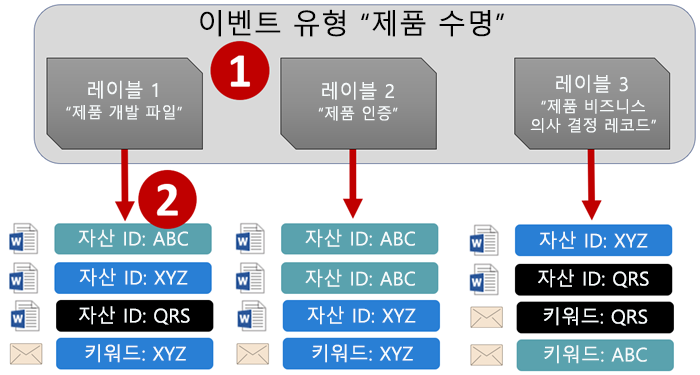
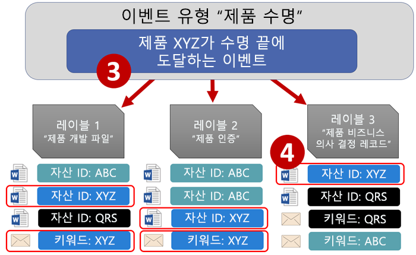
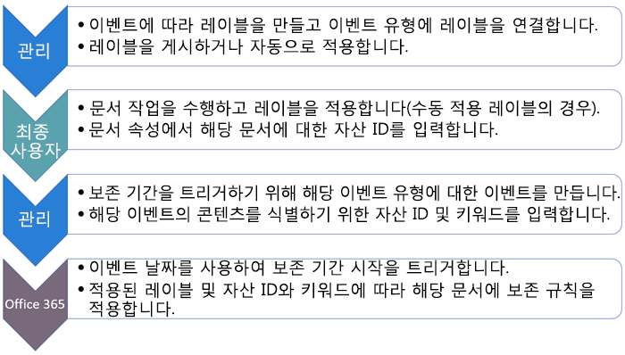
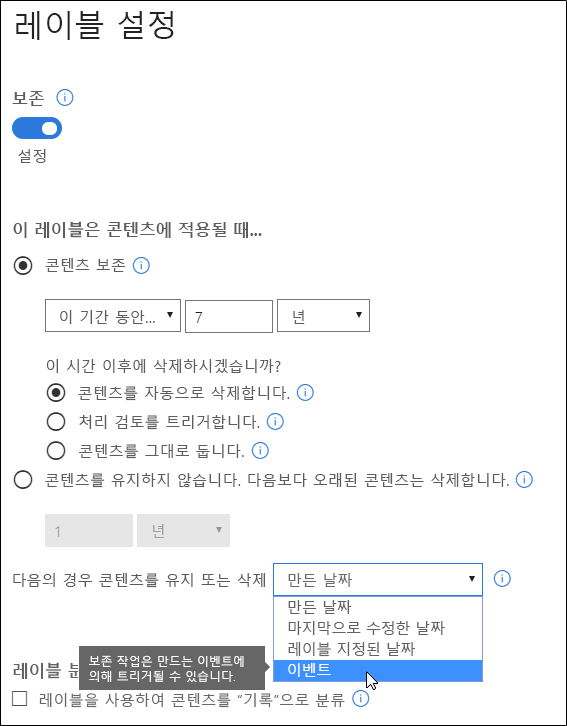
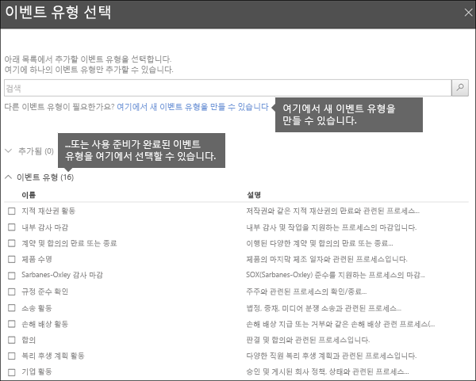
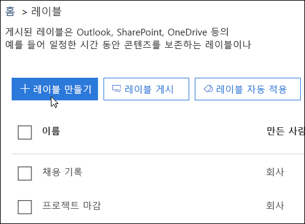
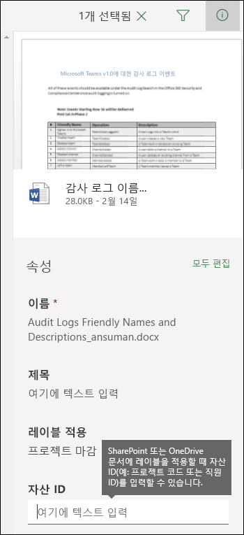
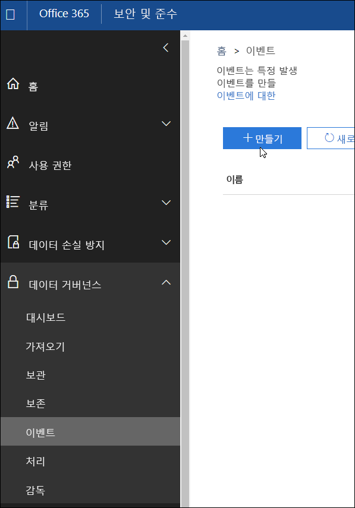
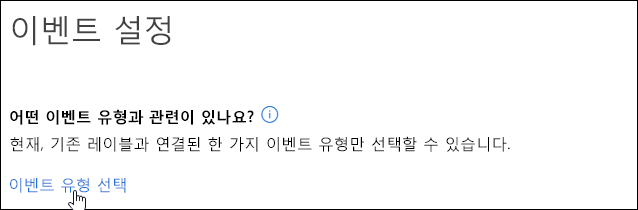
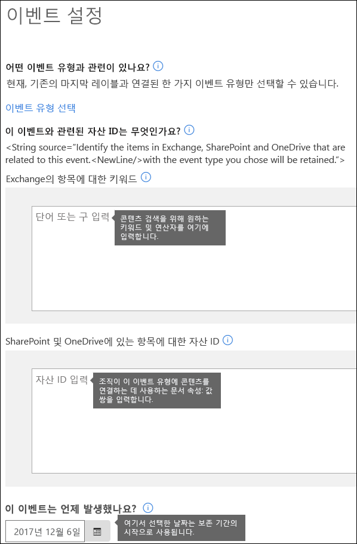

# 이벤트 구동 보존 개요Overview of event-driven retention

콘텐츠를 보존할 때 보존 기간은 대개 콘텐츠의 사용 기간을 기준으로 합니다. 예를 들어, 문서를 만들고 7년 동안 보존한 후 삭제할 수 있습니다. 그렇지만 Office 365의 레이블을 사용하여 특정 유형의 이벤트가 발생하는 경우를 기준으로 보존 기간을 지정할 수도 있습니다. 이벤트는 보존 기간의 시작을 트리거하며, 해당 유형의 이벤트에 적용된 레이블이 있는 모든 콘텐츠에 대해 레이블 보존 작업이 적용됩니다.When you retain content, the retention period is often based on the age of the content - for example, you might retain documents for seven years after they're created and then delete them. But with labels in Office 365, you can also base a retention period on when a specific type of event occurs. The event triggers the start of the retention period, and all content with a label applied for that type of event get the label's retention actions enforced on them.
  
예를 들어 다음에 대해 이벤트 구동 보존이 적용된 레이블을 사용할 수 있습니다.For example, you can use labels with event-driven retention for:
  
- **직원이 조직을 떠나는 경우** 직원 기록은 직원이 조직을 나가는 시점부터 10년 동안 보존되어야 한다고 가정합니다. 10년이 경과된 후에 해당 직원의 채용, 성과 및 퇴사와 관련된 모든 문서를 처리해야 합니다. 10년 보존 기간을 트리거하는 이벤트는 직원이 조직을 퇴사하는 것입니다.**Employees leaving the organization** Suppose that employee records must be retained for 10 years from the time an employee leaves the organization. After 10 years elapse, all documents related to the hiring, performance, and termination of that employee need to be disposed. The event that triggers the 10-year retention period is the employee leaving the organization. 
    
- **계약 만료** 게약과 관련된 모든 기록은 계약이 만료되는 시점부터 5년 동안 보존되어야 한다고 가정합니다. 5년 보존 기간을 트리거하는 이벤트는 계약 만료입니다.**Contract expiration** Suppose that all records related to contracts need to be retained for five years from the time the contract expires. The event that triggers the five-year retention period is the expiration of the contract. 
    
- **제품 수명** 조직은 기술 사양과 같은 콘텐츠에 대해 제품의 마지막 제조일과 관련된 보존 요구 사항을 유지할 수 있습니다. 이 경우 마지막 제조일이 보존 기간을 트리거하는 이벤트가 됩니다.**Product lifetime** Your organization might have retention requirements related to the last manufacturing date of products for content such as technical specifications. In this case, the last manufacturing date is the event that triggers the retention period. 
    
이벤트 구동 보존은 일반적으로 기록 관리 프로세스의 일부로 사용됩니다. 이것은 다음을 의미합니다.Event-driven retention is typically used as part of a records-management process. This means that:
  
- 이벤트를 기준으로 하는 레이블은 일반적으로 콘텐츠를 기록으로 분류하기도 합니다. 자세한 내용은 [콘텐츠 검색을 사용하여 특정 보존 레이블이 적용된 모든 콘텐츠 찾기](labels.md#using-content-search-to-find-all-content-with-a-specific-retention-label-applied-to-it)를 참조하세요.Labels based on events also usually classify content as a record. For more information, see [Using Content Search to find all content with a specific label applied to it](labels.md#using-content-search-to-find-all-content-with-a-specific-retention-label-applied-to-it).
    
- 기록으로 선언되었으나 해당 이벤트 트리거가 아직 발생하지 않은 문서는 문서의 보존 기간을 트리거하는 이벤트가 발생할 때까지 무기한 보존됩니다(기록을 영구히 삭제할 수 없음).A document that's been declared as a record but whose event trigger has not yet happened is retained indefinitely (records can't be permanently deleted), until an event triggers that document's retention period.
    
- 일반적으로 이벤트를 기준으로 하는 레이블은 보존 기간이 끝나면 처리 검토를 트리거하므로 기록 관리자는 콘텐츠를 수동으로 검토하고 처리할 수 있습니다. 자세한 내용은 [처리 검토 개요](disposition-reviews.md)를 참조하세요.Labels based on events usually trigger a disposition review at the end of the retention period, so that a records manager can manually review and dispose the content. For more information, see [Overview of disposition reviews](disposition-reviews.md).
    
이벤트를 기준으로 하는 레이블은 Office 365의 레이블과 동일한 기능을 제공합니다. 자세한 내용은 [레이블 개요](labels.md)를 참조하세요.A label based on an event has the same capabilities as any label in Office 365. To learn more, see [Overview of labels](labels.md).
    
## 이벤트 유형, 레이블, 이벤트 및 자산 ID 간 관계 이해Understanding the relationship between event types, labels, events, and asset IDs

이벤트 구동 보존을 성공적으로 사용하려면 여기에 설명된 것처럼 이벤트 유형, 레이블, 이벤트 및 자산 ID 간 관계를 이해하는 것이 중요합니다. 다이어그램 다음에 설명이 제공됩니다.To successfully use event-driven retention, it's important to understand the relationship between event types, labels, events, and asset IDs as illustrated here. An explanation follows the diagram.
  

  

  
1. 다양한 콘텐츠 형식에 대한 레이블을 만든 후 특정 이벤트 유형에 연결합니다. 예를 들어, 다양 한 유형의 제품 파일 및 기록에 대한 레이블은 해당 기록을 제품이 수명에 도달한 시점부터 10년 동안 보존해야 하므로 제품 수명이라는 이벤트 유형에 연결됩니다.You create labels for different types of content and then associate them with a type of event. For example, labels for different types of product files and records are associated with an event type named Product Lifetime because those records must be retained for 10 years from the time the product reaches its end of life.
    
2. 사용자(일반적으로 기록 관리자)는 콘텐츠에 해당 레이블을 적용하고 (SharePoint 및 OneDrive 문서의 경우) 각 항목에 대한 자산 ID를 입력합니다. 이 예제에서 자산 ID는 제품 이름 또는 조직에서 사용하는 코드입니다. 따라서 각 제품의 기록에는 레코드이 할당되고 각 기록에는 자산 ID를 포함하는 속성이 있습니다. 이 다이어그램은 조직의 모든 제품 기록에 대한 **모든 콘텐츠**를 나타내며, 각 항목은 해당 기록이 있는 제품의 자산 ID를 나타냅니다.Users (typically records managers) apply those labels to content and (for SharePoint and OneDrive documents) enter an asset ID for each item. In this example, the asset ID is a product name or code used by the organization. Thus, each product's records are assigned a label, and each record has a property that contains an asset ID. The diagram represents **all of the content** for all product records in an organization, and each item bears the asset ID of the product whose record it is. 
    
3. 제품 수명은 이벤트 유형입니다. 특정 제품이 제품 수명에 도달하는 것이 이벤트입니다. 해당 이벤트 유형의 이벤트가 발생할 때(이 경우 제품이 수명 종료에 도달) 다음을 지정하는 이벤트를 만듭니다.Product Lifetime is the event type; a specific product reaching end of life is an event. When an event of that event type occurs - in this case, when a product reaches its end of life - you create an event that specifies:
    
  - 자산 ID(SharePoint 및 OneDrive 문서 관련)An asset ID (for SharePoint and OneDrive documents)
    
  - 키워드(Exchange 항목 관련). 이 예제에서 조직은 Exchange 항목에 대한 키워드가 SharePoint 및 OneDrive 문서에 대한 자산 ID와 동일하도록 제품 레코드를 포함하는 메시지에 제품 코드를 사용 합니다.Keywords (for Exchange items). In this example, the organization uses a product code in messages containing product records, so the keyword for Exchange items is the same as the asset ID for SharePoint and OneDrive documents.
    
  - 이벤트가 발생한 날짜. 이 날짜는 보존 기간의 시작으로 사용됩니다. 이 날짜는 현재 또는 미래 날짜만 될 수 있으며 이전 날짜는 될 수 없습니다.The date when the event occurred. This date is used as the start of the retention period. This date can only be the current or a future date, not a past date.
    
4. 이벤트를 만든 후 해당 이벤트 날짜가 해당 이벤트 유형의 레이블이 지정되고 지정된 자산 ID 또는 키워드를 포함하는 모든 콘텐츠와 동기화됩니다. 다른 레이블과 마찬가지로, 이러한 동기화에는 최대 7일이 걸릴 수 있습니다. 위의 다이어그램에서 빨간색 원으로 표시된 모든 항목은 해당 보존 기간이 이 이벤트로 트리거됩니다. 즉, 이 제품의 수명이 종료되면 이벤트는 해당 제품 기록에 대한 보존 기간을 트리거합니다.After you create an event, that event date is synced to all of the content that has a label of that event type and that contains the specified asset ID or keyword. Like any label, this syncing can take up to 7 days. In the diagram above, all of the items circled in red have their retention period triggered by this event - in other words, when this product reaches its end of life, that event triggers the retention period for that product's records.
    
이벤트에 대해 자산 ID 또는 키워드를 지정하지 않으면 해당 이벤트 유형의 레이블이 지정된 **모든 콘텐츠**의 보존 기간이 해당 이벤트의 의해 트리거됩니다. 즉, 위의 다이어그램에서 모든 콘텐츠가 보존되기 시작합니다. 이것이 의도한 결과는 아닐 수도 있습니다.It's important to understand that if you don't specify an asset ID or keywords for an event, **all of the content** with a label of that event type will have its retention period triggered by the event. This means that in the diagram above, all of the content would start being retained. This may not be what you intend. 
  
마지막으로, 각 레이블에는 고유한 보존 설정이 지정되어 있습니다. 이 예제에서는 모두 10년을 지정하지만, 각 레이블이 다른 보존 기간을 갖는 경우 이벤트가 레이블을 트리거할 수 있습니다.Finally, remember that each label has its own retention settings. In this example, they all specify 10 years, but it's possible for an event to trigger labels where each label has a different retention period.
  
## 이벤트 구동 보존 설정 방법How to set up event-driven retention

이벤트 구동 보존에 대한 대략적인 워크플로는 다음과 같습니다. 보다 자세한 단계는 그 다음에 나와 있습니다.Here's the high-level workflow for event-driven retention. More detailed steps follow below.
  

  
### 1단계: 보존 기간이 이벤트에 따라 조정되는 레이블 만들기Step 1: Create a label whose retention period is based on an event

보안 및 준수 센터의 왼쪽 탐색 영역에 있는 **분류**, **레이블** \> **레이블 만들기**In the Security &amp; Compliance Center, in the left navigation, under **Classifications**, choose **Labels** \> **Create a label**.
  
레이블을 만들고, 보존을 켜고, 아래 표시된 옵션을 선택하여 이벤트에 따라 콘텐츠를 보존하거나 삭제하는 경우입니다. 이것은 5단계, **이벤트** 페이지에서 이벤트를 만들 때까지 보존 설정이 적용되지 않음을 의미합니다.When you create the label, turn on retention, and then choose the option shown below to retain or delete the content based on an event. This means that the retention settings won't go into effect until Step 5, when you create an event on the **Events** page. 
  
이벤트 구동 보존은 일반적으로 기록으로 분류된 콘텐츠에 사용됩니다. 이러한 이유로, 이벤트를 기준으로 레이블을 만들 경우 일반적으로 **레이블을 사용하여 콘텐츠를 "기록"으로 분류** 옵션을 선택합니다.Note that event-driven retention is typically used for content that's classified as a record. For this reason, when you create labels based on an event, you typically choose the option to **Use label to classify content as a "Record"**.
  
또한 이벤트 구동 보존에는 다음과 같은 보존 설정이 필요합니다.Also note that event-driven retention requires retention settings that:
  
- 콘텐츠를 보존합니다.Retain the content.
    
- 보존 기간이 끝나면 콘텐츠를 자동으로 삭제하거나 처리 검토를 트리거합니다.Delete the content automatically or trigger a disposition review at the end of the retention period.
    

  
### 2단계: 해당 레이블에 대한 이벤트 유형 선택Step 2: Choose an event type for that label

레이블 설정에서 **이벤트**를 기준으로 레이블을 지정하는 옵션을 선택하면 **이벤트 유형 선택** 옵션이 표시됩니다. 이벤트 유형은 레이블을 연결할 이벤트에 대한 일반적인 설명에 불과합니다.In the label settings, after you choose the option to base the label on **an event**, you'll see the option to **Choose an event type**. An event type is simply a general description of an event that you want to associate a label with.
  
예를 들어, 제품 수명이라는 이벤트 유형을 만드는 경우 레이블을 적용하려는 콘텐츠의 형식을 설명하는 이름(예: “제품 개발 파일” 또는 “제품 비즈니스 결정 기록”)을 사용하여 이벤트 기반 레이블을 만듭니다.For example, if you create an event type named Product Lifetime, you'll create event-based labels with names that describe what types of content you want the labels to be applied to, such as "Product development files" or "Product business decision records".
  
일단 이벤트 유형을 선택하고 레이블을 만들고 나면 이벤트 유형을 변경할 수 없습니다.Note that once you choose an event type and create the label, the event type cannot be changed.
  

  
### 3단계: 레이블 게시 또는 자동 적용Step 3: Publish or auto-apply the label

다른 레이블과 마찬가지로, 콘텐츠에 수동이나 자동으로 적용되도록 이벤트 기반 레이블을 게시하거나 자동으로 적용해야 합니다. 이 작업은 **레이블** 페이지에서 수행합니다. 콘텐츠를 기록으로 분류하는 레이블은 게시한 후 콘텐츠에 수동으로 적용할 수만 있으며 자동으로 적용할 수 없습니다.Just like any label, you need to publish or auto-apply an event-based label, so that it's manually or automatically applied to content. Do this on the **Labels** page. Note that labels that classify content as a record can only be published and manually applied to content; they can't be auto-applied to content. 
  

  
### 4단계: 자산 ID 입력Step 4: Enter an asset ID

이벤트 구동 레이블이 콘텐츠에 적용된 후에 각 항목에 대한 자산 ID를 입력할 수 있습니다. 예를 들어 조직에서는 다음을 사용할 수 있습니다.After an event-driven label is applied to content, you can enter an asset ID for each item. For example, your organization might use:
  
- 특정 제품에 대한 콘텐츠만 보존하는 데 사용할 수 있는 제품 코드Product codes that you can use to retain content for only a specific product.
    
- 특정 프로젝트에 대한 콘텐츠만 보존하는 데 사용할 수 있는 프로젝트 코드Project codes that you can use to retain content for only a specific project.
    
- 특정 사람에 대한 콘텐츠만 보존하는 데 사용할 수 있는 직원 IDEmployee IDs that you can use to retain content for only a specific person.
    
자산 ID는 SharePoint 및 비즈니스용 OneDrive에서 다른 문서 속성일 뿐입니다. 조직에서는 이미 다른 문서 속성 및 ID를 사용하여 콘텐츠를 분류하고 있을 것입니다. 이 경우 이벤트를 만들 때 해당 속성 및 값을 사용할 수도 있습니다. 아래의 6단계를 참조하세요. 중요한 사실은 조직이 해당 항목을 이벤트 유형에 연결하기 위해 문서 속성에 일부 속성:값 조합을 사용해야 한다는 것입니다.Understand that Asset ID is simply another document property in SharePoint and OneDrive for Business. Your organization may already use other document properties and IDs to classify content. If so, you can also use those properties and values when you create an event - see Step 6 below. The important point is that your organization must use some property:value combination in the document properties to associate that item with an event type.
  

  
### 5단계: 이벤트 만들기Step 5: Create an event

해당 이벤트 유형의 특정 인스턴스가 발생하면(예: 제품이 수명 종료에 도달) 보안 및 준수 센터의 이벤트 페이지로 가서 이벤트를 만듭니다. 이벤트를 만들어 수동으로 트리거해야 합니다.When a particular instance of that event type occurs - for example, a product reaches its end of life - go to the Events page in the Security &amp; Compliance Center and create an event. You need to manually trigger an event by creating it.
  

  
### 6단계: 2단계에서 레이블에 사용된 것과 동일한 이벤트 유형 선택Step 6: Choose the same event type used by the label in step 2

이벤트를 만들 때 2단계에서 레이블에 사용된 것과 동일한 이벤트 유형(예: 제품 수명)을 선택합니다. 해당 이벤트 유형의 레이블이 적용된 콘텐츠만 보존 기간이 트리거됩니다.When you create the event, choose the same event type used by the label in step 2 - for example, Product Lifetime. Only content with labels applied to it of that event type will have its retention period triggered.
  

  
### 7단계: 키워드 또는 자산 ID 입력Step 7: Enter keywords or an asset ID

이제 SharePoint 및 OneDrive 콘텐츠에 대한 자산 ID 또는 Exchange 콘텐츠에 대 한 키워드를 지정하여 콘텐츠의 범위를 좁힙니다. 자산 ID의 경우 지정된 속성:값 쌍의 콘텐츠에만 보존이 적용됩니다. 자산 ID를 입력하지 않으면 해당 이벤트 유형의 레이블이 지정된 **모든 콘텐츠**에 동일한 보존 날짜가 적용됩니다.Now you narrow the scope of the content by specifying asset IDs for SharePoint and OneDrive content or keywords for Exchange content. For asset IDs, retention will be enforced only on content with the specified property:value pair. If an asset ID is not entered, **all of the content** with labels of that event type get the same retention date applied to them. 
  
자산 ID는 SharePoint 및 비즈니스용 OneDrive에서 또 다른 문서 속성에 불과합니다. 자산 ID 속성을 사용하는 경우 아래 표시된 자산 ID에 대한 상자에 ComplianceAssetID:\<value\>를 입력합니다.Understand that Asset ID is simply another document property in SharePoint and OneDrive for Business. If you're using the Asset ID property, you would enter ComplianceAssetID:\<value\> in the box for asset IDs shown below.
  
조직이 이 이벤트 유형과 관련된 문서에 다른 속성 및 ID를 적용했을 수 있습니다. 예를 들어 특정 제품의 레코드를 검색해야 할 경우 ID는 사용자 지정 속성인 ProductID와 값 "XYZ"의 조합일 수 있습니다. 이 경우 아래에 표시된 자산 ID에 대한 상자에 ProductID:XYZ를 입력합니다.Your organization might have applied other properties and IDs to the documents related to this event type. For example, if you need to detect a specific product's records, the ID might be a combination of your custom property ProductID and the value "XYZ". In this case, you'd enter ProductID:XYZ in the box for asset IDs shown below.
  
Exchange 항목의 경우 키워드를 포함할 수 있습니다. AND, OR 및 NOT과 같은 검색 연산자를 사용하여 쿼리를 구체화할 수 있습니다. 연산자에 대한 자세한 내용은 [콘텐츠 검색에 대한 키워드 쿼리 및 검색 조건](keyword-queries-and-search-conditions.md)을 참조하세요.For Exchange items, you can include keywords. You can refine your query by using search operators like AND, OR, and NOT. For more information on operators, see [Keyword queries and search conditions for Content Search](keyword-queries-and-search-conditions.md).
  
마지막으로, 이벤트가 발생한 날짜를 선택합니다. 이 날짜는 보존 기간의 시작으로 사용됩니다. 이벤트를 만든 후 해당 이벤트 날짜가 해당 이벤트 유형의 레이블이 지정된 모든 콘텐츠( 자산 ID 및 키워드)와 동기화됩니다. 다른 모든 레이블과 마찬가지로 이 동기화에는 최대 7일이 걸릴 수 있습니다.Finally, choose the date when the event occurred; this date is used as the start of the retention period. After you create an event, that event date is synced to all of the content with a label of that event type, asset ID, and keywords. Like any label, this syncing can take up to 7 days.
  

  
## 콘텐츠 검색을 사용하여 특정 레이블 또는 자산 ID를 포함하는 모든 콘텐츠 찾기Use Content Search to find all content with a specific label or asset ID

콘텐츠에 레이블이 할당된 후에 보안 및 준수 센터의 콘텐츠 검색을 사용하여 특정 레이블로 분류되거나 특정 자산 ID를 포함하는 모든 콘텐츠를 찾을 수 있습니다.After labels are assigned to content, you can use content search in the Security &amp; Compliance Center to find all content that's classified with a specific label or that contains a specific asset ID.
  
콘텐츠 검색을 만들 경우 다음이 적용됩니다.When you create a content search:
  
- 특정 레이블이 있는 모든 콘텐츠를 찾으려면 **준수 태그** 조건을 선택하고 전체 레이블 이름 또는 레이블 이름 일부를 와일드카드를 사용합니다.To find all content with a specific label, choose the **Compliance Tag** condition, and then enter the complete label name or part of the label name and use a wildcard. 
    
- 특정 자산 ID가 있는 모든 콘텐츠를 찾으려면 **ComplianceAssetID** 속성과 값(ComplianceAssetID:\<value\>)을 입력합니다.To find all content with a specific asset ID, enter the **ComplianceAssetID** property and a value, like ComplianceAssetID:\<value\>. 
    
자세한 내용은 [콘텐츠 검색에 대한 키워드 쿼리 및 검색 조건](keyword-queries-and-search-conditions.md)을 참조하세요.For more information, see [Keyword queries and search conditions for Content Search](keyword-queries-and-search-conditions.md).
  
## 사용 권한Permissions

**이벤트** 페이지에 액세스하기 위해 검토자는 **처리 관리** 역할 및 **보기 전용 감사 로그** 역할이 있는 역할 그룹의 구성원이어야 합니다. 처리 검토자라는 새 역할 그룹을 만들고, 이러한 두 역할을 해당 역할 그룹에 추가한 후 역할 그룹에 구성원을 추가하는 것이 좋습니다.To get access to the **Events** page, reviewers must be members of a role group with the **Disposition Management** role and the **View-Only Audit Logs** role. We recommend creating a new role group called Disposition Reviewers, adding these two roles to that role group, and then adding members to the role group. 
  
자세한 내용은 [사용자에게 Office 365 보안 및 준수 센터에 대한 액세스 권한 부여](grant-access-to-the-security-and-compliance-center.md)를 참조하세요.For more information, see [Give users access to the Office 365 Security &amp; Compliance Center](grant-access-to-the-security-and-compliance-center.md).
  
## PowerShell을 사용하여 이벤트 자동화Automate events by using PowerShell

Office 365 보안 및 준수 센터에서는 이벤트를 수동으로만 만들 수 있습니다. 발생 시 이벤트를 수동으로 트리거할 수는 없습니다. 그렇지만 PowerShell 스크립트를 사용사여 비즈니스 응용 프로그램에서 이벤트 기반 보존을 자동화할 수 있습니다.In the Office 365 Security &amp; Compliance Center, you can only create events manually; it's not possible to automatically trigger an event when it occurs. However, you can use a PowerShell script to automate event-based retention from your business applications.
  
현재 API에서 작업 중인 경우 비즈니스 응용 프로그램(예: HR, CRM 또는 재무 응용 프로그램)을 이벤트 구동 보존에 연결할 수 있습니다. 예를 들어 HR 시스템을 이벤트 구독 보존에 연결할 수 있습니다. 이 경우 직원이 조직을 나가면 해당 이벤트 유형의 이벤트가 자동으로 트리거됩니다.We are currently working on APIs, so that you can connect your business applications (such as HR, CRM, or financial applications) to event-driven retention. For example, you'll be able to connect your HR system to event-driven retention, so that when an employee leaves the organization, and event of that event type is automatically triggered.
  
그때까지 이벤트 구동 보존에 다음 PowerShell cmdlet을 사용할 수 있습니다.Until then, here are the PowerShell cmdlets available for event-driven retention:
  
- [Get-ComplianceRetentionEventTypeGet-ComplianceRetentionEventType](https://go.microsoft.com/fwlink/?linkid=873002)
    
- [New-ComplianceRetentionEventTypeNew-ComplianceRetentionEventType](https://go.microsoft.com/fwlink/?linkid=873004)
    
- [Remove-ComplianceRetentionEventTypeRemove-ComplianceRetentionEventType](https://go.microsoft.com/fwlink/?linkid=873005)
    
- [Set-ComplianceRetentionEventTypeSet-ComplianceRetentionEventType](https://go.microsoft.com/fwlink/?linkid=873006)
    
- [Get-ComplianceRetentionEventGet-ComplianceRetentionEvent](https://go.microsoft.com/fwlink/?linkid=873001)
    
- [New-ComplianceRetentionEventNew-ComplianceRetentionEvent](https://go.microsoft.com/fwlink/?linkid=873003)
    

