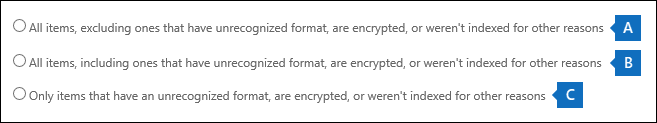

# <a name="export-content-search-results-from-the-office-365-security-amp-compliance-center"></a><span data-ttu-id="2d552-105">Office 365 보안에서 콘텐츠 검색 결과 내보낼 &amp; 준수 센터</span><span class="sxs-lookup"><span data-stu-id="2d552-105">Export Content Search results from the Office 365 Security &amp; Compliance Center</span></span>

<span data-ttu-id="2d552-p102">콘텐츠 검색을 성공적으로 실행 한 후에 로컬 컴퓨터에 검색 결과 내보낼 수 있습니다. 전자 메일 결과 내보낼 때 사진을 다운로드 한 사용자의 컴퓨터에 PST 파일로 합니다. SharePoint와 OneDrive에서 비즈니스 사이트에 대 한 콘텐츠를 내보낼 때 네이티브 Office 문서의 복사본을 내보냅니다. 추가 문서와 내보낸된 검색 결과에 포함 된 보고서 있습니다.</span><span class="sxs-lookup"><span data-stu-id="2d552-p102">After a Content Search is successfully run, you can export the search results to a local computer. When you export email results, they're downloaded to your computer as PST files. When you export content from SharePoint and OneDrive for Business sites, copies of native Office documents are exported. There are additional documents and reports that are included with the exported search results.</span></span>
  
<span data-ttu-id="2d552-p103">또한 (개별 메시지)로 내보낼 때 콘텐츠 검색의 결과에 포함 된 모든 RMS 암호화 된 전자 메일 메시지의 암호가 해독 될 됩니다. 이 암호 해독 기능 eDiscovery 관리자 역할 그룹의 구성원에 대해 기본적으로 사용 됩니다. 즉,이 역할 그룹에는 RMS 암호 해독 관리 역할 할당 됩니다. 검색 결과 내보낼 때 RMS 암호 해독 하는 방법에 대 한 세부 정보에 대 한 [자세한 내용](#more-information) 은 섹션을 참조 하십시오.</span><span class="sxs-lookup"><span data-stu-id="2d552-p103">Additionally, any RMS-encrypted email messages that are included in the results of a Content Search will be decrypted when you export them (as individual messages). This decryption capability is enabled by default for members of the eDiscovery Manager role group. This is because the RMS Decrypt management role is assigned to this role group. See the [More information](#more-information) section for details about RMS decryption when you export search results.</span></span> 
  
<span data-ttu-id="2d552-114">콘텐츠 검색 결과 내보내기 (영문)의 결과 준비 하 고 로컬 컴퓨터에 다운로드 해야 합니다.</span><span class="sxs-lookup"><span data-stu-id="2d552-114">Exporting the results of a Content Search involves preparing the results, and then downloading them to a local computer.</span></span>
  
## <a name="before-you-begin"></a><span data-ttu-id="2d552-115">시작하기 전에</span><span class="sxs-lookup"><span data-stu-id="2d552-115">Before you begin</span></span>

- <span data-ttu-id="2d552-p104">Office 365 보안에서 내보내기 관리 역할을 할당 하는 검색 결과 내보내려면 &amp; 준수 센터입니다. 이 역할은 기본 제공 eDiscovery 관리자 역할 그룹에 할당 됩니다. 조직 관리 역할 그룹에 기본적으로 할당 된 되지 않습니다. 자세한 내용은 참조 [Office 365 보안에서 eDiscovery 사용 권한을 할당 &amp; 준수 센터](assign-ediscovery-permissions.md)합니다.</span><span class="sxs-lookup"><span data-stu-id="2d552-p104">To export search results, you have to be assigned the Export management role in the Office 365 Security &amp; Compliance Center. This role is assigned to the built-in eDiscovery Manager role group. It isn't assigned by default to the Organization Management role group. For more information, see [Assign eDiscovery permissions in the Office 365 Security &amp; Compliance Center](assign-ediscovery-permissions.md).</span></span>
    
- <span data-ttu-id="2d552-120">검색 결과를 PST 파일로 내보내는 데 사용하는 컴퓨터는 다음과 같은 시스템 요구 사항을 충족해야 합니다.</span><span class="sxs-lookup"><span data-stu-id="2d552-120">The computer you use to export the search results has to meet the following system requirements:</span></span>
    
  - <span data-ttu-id="2d552-121">32비트 및 64비트 버전의 Windows 7 이상 버전


</span><span class="sxs-lookup"><span data-stu-id="2d552-121">32- or 64-bit versions of Windows 7 and later versions</span></span>
    
  - <span data-ttu-id="2d552-122">Microsoft.NET Framework 4.7</span><span class="sxs-lookup"><span data-stu-id="2d552-122">Microsoft .NET Framework 4.7</span></span>
    
  - <span data-ttu-id="2d552-123">지원되는 브라우저:</span><span class="sxs-lookup"><span data-stu-id="2d552-123">A supported browser:</span></span>
    
     - <span data-ttu-id="2d552-124">Microsoft Edge</span><span class="sxs-lookup"><span data-stu-id="2d552-124">Microsoft Edge</span></span>
    
        <span data-ttu-id="2d552-125">또는</span><span class="sxs-lookup"><span data-stu-id="2d552-125">OR</span></span>
    
     - <span data-ttu-id="2d552-126">Microsoft Internet Explorer 10 및 그 이후 버전</span><span class="sxs-lookup"><span data-stu-id="2d552-126">Microsoft Internet Explorer 10 and later versions</span></span>
    
    <span data-ttu-id="2d552-p105">**참고:** ClickOnce 응용 프로그램에 대 한 추가 기능 사용 또는 제 3 자 확장 Microsoft 제조 하지 않습니다. 제 3 자 확장 또는 추가 기능 지원 되지않는 브라우저를 사용 하 여 검색 결과 내보내기 (영문)이 지원 되지 않습니다.</span><span class="sxs-lookup"><span data-stu-id="2d552-p105">**Note:** Microsoft doesn't manufacture third-party extensions or add-ons for ClickOnce applications. Exporting search results using an unsupported browser with third-party extensions or add-ons isn't supported.</span></span> 
    
- <span data-ttu-id="2d552-p106">검색 결과 (2 단계에에서 설명 되어 있음)를 다운로드 하는 경우에 검색 결과 내보내는 데 사용 하는 컴퓨터에서 Windows 레지스트리 설정을 구성 하 여 다운로드 속도 높일 수 있습니다. 자세한 내용은 [Office 365에서 eDiscovery 검색 결과 내보낼 때 다운로드 속도 높입니다.](increase-download-speeds-when-exporting-ediscovery-results.md)을 참조 하십시오.</span><span class="sxs-lookup"><span data-stu-id="2d552-p106">When you download search results (described in Step 2), you can increase the download speed by configuring a Windows Registry setting on the computer you use to export the search results. For more information, see [Increase the download speed when exporting eDiscovery search results from Office 365](increase-download-speeds-when-exporting-ediscovery-results.md).</span></span>
    
- <span data-ttu-id="2d552-p107">검색 결과 내보낼 때 데이터를 통해 로컬 컴퓨터로 다운로드 되기 전에 일시적으로 Microsoft 클라우드 고유 Microsoft Azure 저장소 위치에 저장 됩니다. 조직은 Azure의 끝점에 연결할 수 있어야 \*\* \*. blob.core.windows.net\*\* (와일드 카드 내보내기에 대 한 고유 식별자를 나타냄). 검색 결과 데이터를 만든 후 2 주 Azure 저장 위치에서 삭제 됩니다.</span><span class="sxs-lookup"><span data-stu-id="2d552-p107">When you export search results, the data is temporarily stored in a unique Microsoft Azure storage location in the Microsoft cloud before it's downloaded to your local computer. Be sure your organization can connect to the endpoint in Azure, which is **\*.blob.core.windows.net** (the wildcard represents a unique identifier for your export). The search results data is deleted from the Azure storage location two weeks after it's created.</span></span> 
    
- <span data-ttu-id="2d552-p108">조직 프록시 서버를 사용 하 여 인터넷을 통한 통신을 하는 경우 (내보내기 도구는 프록시 서버에서 인증 될 수 있습니다) 되므로 검색 결과 내보내는 데 사용 하는 컴퓨터에서 프록시 서버 설정을 정의 해야 합니다. 이 작업을 수행 중인 Windows 버전에 일치 하는 위치에 *machine.config* 파일을 엽니다.</span><span class="sxs-lookup"><span data-stu-id="2d552-p108">If your organization uses a proxy server to communicate with the Internet, you need to define the proxy server settings on the computer that you use to export the search results (so the export tool can be authenticated by your proxy server). To do this, open the  *machine.config*  file in the location that matches your version of Windows.</span></span> 
    
  - <span data-ttu-id="2d552-136">**32 비트** - `%windir%\Microsoft.NET\Framework\[version]\Config\machine.config`</span><span class="sxs-lookup"><span data-stu-id="2d552-136">**32-bit** - `%windir%\Microsoft.NET\Framework\[version]\Config\machine.config`</span></span>
    
  - <span data-ttu-id="2d552-137">**64 비트** - `%windir%\Microsoft.NET\Framework64\[version]\Config\machine.config`</span><span class="sxs-lookup"><span data-stu-id="2d552-137">**64-bit** - `%windir%\Microsoft.NET\Framework64\[version]\Config\machine.config`</span></span>
    
    <span data-ttu-id="2d552-p109">내 임의의 위치 간의 *machine.config* 파일에 다음 줄을 추가 `<configuration>` 및 `</configuration>` 태그입니다. 바꿔야 `ProxyServer` 및 `Port` 조직에 대 한 올바른 값으로 예, `proxy01.contoso.com:80` 합니다.</span><span class="sxs-lookup"><span data-stu-id="2d552-p109">Add the following lines to the  *machine.config*  file somewhere between the  `<configuration>` and  `</configuration>` tags. Be sure to replace  `ProxyServer` and  `Port` with the correct values for your organization; for example,  `proxy01.contoso.com:80` .</span></span> 
    
    ```
    <system.net>
       <defaultProxy enabled="true" useDefaultCredentials="true">
         <proxy proxyaddress="http://ProxyServer :Port " 
                usesystemdefault="False" 
                bypassonlocal="True" 
                autoDetect="False" />
       </defaultProxy>
    </system.net>
    ```

- <span data-ttu-id="2d552-140">검색 결과 내보내기 (영문)에 대 한 제한에 대 한 설명 섹션을 참조 하십시오.</span><span class="sxs-lookup"><span data-stu-id="2d552-140">See the  section for a description of the limits for exporting search results.</span></span> 
    
- <span data-ttu-id="2d552-p110">내보낼 수 있는 PST 파일의 최대 크기는 10GB입니다. 이 기본 크기를 변경 하려는 경우에 검색 결과 내보내는 데 사용 하는 컴퓨터에서 Windows 레지스트리를 편집할 수 있습니다. [변경을 eDiscovery 검색 결과 내보낼 때 PST 파일의 크기를](change-the-size-of-pst-files-when-exporting-results.md)참조 하십시오.</span><span class="sxs-lookup"><span data-stu-id="2d552-p110">The maximum size of a PST file that can be exported is 10 GB. If you want to change this default size, you can edit the Windows Registry on the computer that you use to export the search results. See [Change the size of PST files when exporting eDiscovery search results](change-the-size-of-pst-files-when-exporting-results.md).</span></span>
    
## <a name="step-1-prepare-search-results-for-export"></a><span data-ttu-id="2d552-144">1단계: 내보내기에 대 한 검색 결과 준비 합니다.</span><span class="sxs-lookup"><span data-stu-id="2d552-144">Step 1: Prepare search results for export</span></span>

<span data-ttu-id="2d552-p111">첫번째 단계에서는 내보내기 (영문)에 대 한 검색 결과 준비 하는 것입니다. 결과 준비 하는 Microsoft 클라우드에서 Azure 저장소 위치에 업로드 됩니다. 참고 사서함 및 사이트의 콘텐츠는 시간당 2GB의 최대 속도로 업로드 됩니다.</span><span class="sxs-lookup"><span data-stu-id="2d552-p111">The first step is to prepare the search results for exporting. When you prepare results, they are uploaded to an Azure storage location in the Microsoft cloud. Note that content from mailboxes and sites is uploaded at a maximum rate of 2 GB per hour.</span></span>
  
1. <span data-ttu-id="2d552-148">이동 [https://protection.office.com](https://protection.office.com)합니다.</span><span class="sxs-lookup"><span data-stu-id="2d552-148">Go to [https://protection.office.com](https://protection.office.com).</span></span>
    
2. <span data-ttu-id="2d552-149">작업이 나 교육용 계정을 사용 하 여 Office 365에 로그인 합니다.</span><span class="sxs-lookup"><span data-stu-id="2d552-149">Sign in to Office 365 using your work or school account.</span></span>
    
3. <span data-ttu-id="2d552-150">보안 및 준수 센터의 왼쪽 창에서 **검색 및 조사** \> **콘텐츠 검색**을 클릭합니다.</span><span class="sxs-lookup"><span data-stu-id="2d552-150">In the left pane of the Security &amp; Compliance Center, click **Search &amp; investigation** \> **Content search**.</span></span>
    
4. <span data-ttu-id="2d552-151">**콘텐츠 검색** 페이지에서 검색을 선택 합니다.</span><span class="sxs-lookup"><span data-stu-id="2d552-151">On the **Content search** page, select a search.</span></span> 
    
5. <span data-ttu-id="2d552-152">세부 정보 창에서 **컴퓨터에 결과 내보내기** 아래의 **내보내기 시작**을 클릭합니다.</span><span class="sxs-lookup"><span data-stu-id="2d552-152">In the details pane, under **Export results to a computer**, click **Start export**.</span></span>
    
    > [!NOTE]
    > <span data-ttu-id="2d552-p112">검색 결과 7 일 보다 오래 된 경우 검색 결과 업데이트 하 라는 메시지가 표시. 이런 경우 내보내기를 취소 클릭 합니다 **업데이트 검색 결과** 선택한 검색 한 다음 시작 결과 후 다시 내보내기에 대 한 세부 정보 창에서 업데이트 됩니다. </span><span class="sxs-lookup"><span data-stu-id="2d552-p112">If the results for a search are older than 7 days, you are prompted to update the search results. If this happens, cancel the export, click **Update search results** in the details pane for the selected search, and then start the export again after the results are updated.</span></span> 
  
6. <span data-ttu-id="2d552-155">**검색에서 이러한 항목을 포함**하십시오 아래에서 **검색 결과 내보내기** 페이지에서 다음 옵션 중 하나를 선택 합니다.</span><span class="sxs-lookup"><span data-stu-id="2d552-155">On the **Export the search results** page, under **Include these items from the search**, choose one of the following options:</span></span>
    
    - <span data-ttu-id="2d552-156">인덱싱된 항목만 내보내기</span><span class="sxs-lookup"><span data-stu-id="2d552-156">Export only indexed items</span></span>
    
    - <span data-ttu-id="2d552-157">인덱싱된 및 부분적으로 인덱싱된 항목 내보내기</span><span class="sxs-lookup"><span data-stu-id="2d552-157">Export indexed and partially indexed items</span></span>
    
    - <span data-ttu-id="2d552-158">유일한 부분적으로 인덱싱된 항목 내보내기</span><span class="sxs-lookup"><span data-stu-id="2d552-158">Export only partially indexed items</span></span>
    
    <span data-ttu-id="2d552-p113">부분적으로 어떻게 인덱싱된 항목에 대 한 설명 내보내도록에 대 한 [자세한 내용](#more-information) 은 섹션을 참조 하십시오. 부분적으로 인덱싱된 항목에 대 한 자세한 내용은 [부분적으로 인덱싱된 콘텐츠 검색에는 항목을](partially-indexed-items-in-content-search.md)참조 하십시오.</span><span class="sxs-lookup"><span data-stu-id="2d552-p113">See the [More information](#more-information) section for a description about how partially indexed items are exported. For more information about partially indexed items, see [Partially indexed items in Content Search](partially-indexed-items-in-content-search.md).</span></span>
    
7. <span data-ttu-id="2d552-161">**내보내기 Exchange 콘텐츠**를 아래에서 다음 옵션 중 하나를 선택 합니다.</span><span class="sxs-lookup"><span data-stu-id="2d552-161">Under **Export Exchange content as**, choose one of the following options:</span></span>
    
    - <span data-ttu-id="2d552-p114">**각 사서함에 대 한 하나의 PST 파일** -검색 결과 포함 하는 각 사용자 사서함에 대해 하나의 PST 파일을 내보냅니다. 사용자의 보관 사서함의 모든 결과 동일한 PST 파일에 포함 됩니다. 이 옵션은 원본 사서함에서 사서함 폴더 구조를 재현 하는 메모 합니다.</span><span class="sxs-lookup"><span data-stu-id="2d552-p114">**One PST file for each mailbox** - Exports one PST file for each user mailbox that contains search results. Any results from the user's archive mailbox are included in the same PST file. Note that this option reproduces the mailbox folder structure from the source mailbox.</span></span> 
    
    - <span data-ttu-id="2d552-p115">**모든 메시지를 포함 하는 하나의 PST 파일** -단일 PST ( *Exchange.pst* 라는) 포함 된 파일을 검색에 포함 된 모든 원본 사서함에서 검색 결과 내보냅니다. 이 옵션 재현 각 메시지에 대 한 사서함 폴더 구조를 메모 합니다.</span><span class="sxs-lookup"><span data-stu-id="2d552-p115">**One PST file containing all messages** - Exports a single PST file (named  *Exchange.pst*  ) that contains the search results from all source mailboxes included in the search. Note that this option reproduces the mailbox folder structure for each message.</span></span> 
    
    - <span data-ttu-id="2d552-p116">**단일 폴더에 있는 모든 메시지를 포함 하는 하나의 PST 파일** -단일, 최상위 폴더에 있는 모든 메시지를 단일 PST 파일로 검색 결과 내보내기 합니다. 이 옵션을 사용 하면 검토자가 각 항목에 대 한 원래 사서함 폴더 구조를 탐색 하지 않고도 시간순 (항목이 보낸된 날짜순으로 정렬 됩니다.)의 항목을 검토 합니다.</span><span class="sxs-lookup"><span data-stu-id="2d552-p116">**One PST file containing all messages in a single folder** - Exports search results to a single PST file where all messages are located in a single, top-level folder. This option lets reviewers review items in chronological order (items are sorted by sent date) without having to navigate the original mailbox folder structure for each item.</span></span> 
    
    - <span data-ttu-id="2d552-p117">**개별 메시지** -내보내기 검색 결과 개별 전자 메일 메시지로.msg 형식을 사용 하 여 합니다. 이 옵션을 선택 하는 경우 전자 메일 검색 결과 파일 시스템의 폴더를 내보냅니다. 개별 메시지에 대 한 폴더 경로 결과를 PST 파일로 내보낸 경우 사용 되는 것과 동일 합니다.</span><span class="sxs-lookup"><span data-stu-id="2d552-p117">**Individual messages** - Exports search results as individual email messages, using the .msg format. If you select this option, email search results are exported to a folder in the file system. The folder path for individual messages is the same as the one used if you exported the results to PST files.</span></span> 
    
      > [!IMPORTANT]
      > <span data-ttu-id="2d552-p118">내보내면 RMS 암호화 된 메시지의 암호를 해독 개별 메시지도 전자 메일 검색 결과 내보내야 합니다. 암호화 된 메시지는 검색 결과 PST 파일로 내보내는 경우 암호화 된 상태로 유지 됩니다.</span><span class="sxs-lookup"><span data-stu-id="2d552-p118">To decrypt RMS-encrypted messages when they're exported, you must export email search results as individual messages. Encrypted messages will remain encrypted if you export the search results as a PST file.</span></span> 
  
8. <span data-ttu-id="2d552-p119">중복 된 메시지를 제외 하려면 **중복 사용** 확인란을 클릭 합니다. 이 옵션에는 검색의 콘텐츠 원본에 Exchange 사서함 또는 공용 폴더를 포함 하는 경우에 표시 됩니다.</span><span class="sxs-lookup"><span data-stu-id="2d552-p119">Click the **Enable de-duplication** checkbox to exclude duplicate messages. This option appears only if the content sources of the search includes Exchange mailboxes or public folders.</span></span> 
    
    <span data-ttu-id="2d552-p120">이 옵션을 선택 하는 경우 동일한 메시지의 복사본을 여러개 검색 된 사서함에서 발견 되는 경우에 메시지의 복사본을 하나만 내보낼 수 있습니다. 내보내기 결과 보고서 (Results.csv)가 들어 있는 행이 중복 된 메시지의 모든 복사본에 대 한 사서함 (또는 공용 폴더)를 식별할 수 있도록 중복 된 메시지의 복사본을 포함 하는 합니다. 자세한 내용은 대 한 중복 제거 및 방법을 중복 된 항목 식별 된 [eDiscovery 검색 결과에서 제거 사용 중복 제거](de-duplication-in-ediscovery-search-results.md)를 참조 하십시오.</span><span class="sxs-lookup"><span data-stu-id="2d552-p120">If you select this option, only one copy of a message will be exported even if multiple copies of the same message are found in the mailboxes that were searched. The export results report (Results.csv) will contain a row for every copy of a duplicate message so that you can identify the mailboxes (or public folders) that contain a copy of the duplicate message. For more information about de-duplication and how duplicate items are identified, see [De-duplication in eDiscovery search results](de-duplication-in-ediscovery-search-results.md).</span></span>
    
9. <span data-ttu-id="2d552-p121">모든 버전의 SharePoint 문서를 내보낼 **포함 버전 SharePoint 문서에 대 한** 확인란을 클릭 합니다. 이 옵션에는 검색의 콘텐츠 원본을 비즈니스 사이트에 대 한 SharePoint 또는 OneDrive를 포함 하는 경우에 표시 됩니다.</span><span class="sxs-lookup"><span data-stu-id="2d552-p121">Click the **Include versions for SharePoint documents** checkbox to export all versions of SharePoint documents. This option appears only if the content sources of the search includes SharePoint or OneDrive for Business sites.</span></span> 
    
10. <span data-ttu-id="2d552-p122">압축 된 폴더를 검색 결과 내보내려면 **압축된 (zip) 폴더에서 파일 내보내기** 확인란을 클릭 합니다. 이 옵션은 Exchange 항목을 개별 메시지로 내보낼를 선택 하는 경우에 하 고 SharePoint 또는 OneDrive 문서를 포함 하는 검색 결과 사용할 수 있습니다. 이 옵션은 항목을 내보낼 때 Windows 파일 경로 이름에 260 문자 제한을 해결을 주로 사용 됩니다. "파일 이름 내보낸된 항목의" [자세한 정보](#more-information) 섹션에서을 참조 하십시오.</span><span class="sxs-lookup"><span data-stu-id="2d552-p122">Click the **Export files in a compressed (zipped) folder** checkbox to export search results to compressed folders. This option is available only when you choose to export Exchange items as individual messages and when the search results include SharePoint or OneDrive documents. This option is primarily used to work around the 260 character limit in Windows file path names when items are exported. See the "Filenames of exported items" in the [More information](#more-information) section.</span></span> 
    
11. <span data-ttu-id="2d552-185">**내보내기 시작**을 클릭합니다.</span><span class="sxs-lookup"><span data-stu-id="2d552-185">Click **Start export**.</span></span>
    
    <span data-ttu-id="2d552-p123">검색 결과 Microsoft 클라우드에서 Azure 저장소 위치로 업로드 되는 것을 의미 하는를 다운로드 하기 위한 준비 됩니다. 검색 결과 다운로드에 대 한 준비 되 면 **다운로드 내보낸 결과** 링크 세부 정보 창에서 **컴퓨터에 대 한 결과 내보낼** 아래 표시 됩니다.</span><span class="sxs-lookup"><span data-stu-id="2d552-p123">The search results are prepared for downloading, which means they're being uploaded to the Azure storage location in the Microsoft cloud. When the search results are ready for download, the **Download exported results** link is displayed under **Export results to a computer** in the details pane.</span></span> 
  
## <a name="step-2-download-the-search-results"></a><span data-ttu-id="2d552-188">2단계: 검색 결과 다운로드</span><span class="sxs-lookup"><span data-stu-id="2d552-188">Step 2: Download the search results</span></span>

<span data-ttu-id="2d552-189">다음 단계를 통해 로컬 컴퓨터로 Azure 저장소 위치에서 검색 결과 다운로드 하는 것입니다.</span><span class="sxs-lookup"><span data-stu-id="2d552-189">The next step is to download the search results from the Azure storage location to your local computer.</span></span>
  
<span data-ttu-id="2d552-p124">앞에서 설명한 것 처럼 검색 결과 내보내는 데 사용 하는 컴퓨터에서 Windows 레지스트리 설정을 구성 하 여 다운로드 속도 높일 수 있습니다. 자세한 내용은 [Office 365에서 eDiscovery 검색 결과 내보낼 때 다운로드 속도 높입니다.](increase-download-speeds-when-exporting-ediscovery-results.md)을 참조 하십시오.</span><span class="sxs-lookup"><span data-stu-id="2d552-p124">As previously explained, you can increase the download speed by configuring a Windows Registry setting on the computer you use to export the search results. For more information, see [Increase the download speed when exporting eDiscovery search results from Office 365](increase-download-speeds-when-exporting-ediscovery-results.md).</span></span>
  
1. <span data-ttu-id="2d552-192">내보내기를 시작한 검색에 대한 세부 정보 창의 **컴퓨터에 결과 내보내기**에서 **내보낸 결과 다운로드**를 클릭합니다.</span><span class="sxs-lookup"><span data-stu-id="2d552-192">In the details pane for the search that you started the export for, under **Export results to a computer**, click **Download exported results**.</span></span>
    
    <span data-ttu-id="2d552-193">**다운로드 내보낸 결과** 창에 표시 되 고 사용자 컴퓨터로 다운로드 되는 검색 결과 대 한 다음 정보를 포함 합니다.</span><span class="sxs-lookup"><span data-stu-id="2d552-193">The **Download exported results** window is displayed and contains the following information about the search results that will be downloaded to your computer.</span></span> 
    
    - <span data-ttu-id="2d552-194">다운로드될 항목의 수</span><span class="sxs-lookup"><span data-stu-id="2d552-194">The number of items that will be downloaded.</span></span>
    
    - <span data-ttu-id="2d552-195">다운로드될 항목의 예상 총 크기</span><span class="sxs-lookup"><span data-stu-id="2d552-195">The estimated total size of the items that will be downloaded.</span></span>
    
    - <span data-ttu-id="2d552-p125">인덱싱된 항목 또는 인덱싱되지 않은 항목을 내보낼지 여부 인덱싱되지 않은 항목은 인식되는 형식을 갖거나 암호화되었거나, 다른 이유로 인덱싱되지 않은 항목입니다. 자세한 내용은 [Unindexed items in Content Search](partially-indexed-items-in-content-search.md)을 참조하세요.</span><span class="sxs-lookup"><span data-stu-id="2d552-p125">Whether indexed or unindexed will be exported. Unindexed items are items that have an recognized format, are encrypted, or weren't indexed for other reasons. For more information, see [Unindexed items in Content Search](partially-indexed-items-in-content-search.md).</span></span>
    
    - <span data-ttu-id="2d552-199">SharePoint 문서의 버전을 다운로드할지 여부</span><span class="sxs-lookup"><span data-stu-id="2d552-199">Whether or not versions of SharePoint documents will be downloaded.</span></span>
    
    - <span data-ttu-id="2d552-p126">내보내기 준비 프로세스의 상태 데이터 준비가 완료되지 않았더라도 검색 결과 다운로드를 시작할 수 있습니다.</span><span class="sxs-lookup"><span data-stu-id="2d552-p126">The status of the export preparation process. You can start downloading search results even if the preparation of the data isn't complete.</span></span>
    
2. <span data-ttu-id="2d552-p127">**내보내기 키**에서 **클립보드로 복사**를 클릭합니다. 5단계에서 이 키를 사용하여 검색 결과를 다운로드하게 됩니다.</span><span class="sxs-lookup"><span data-stu-id="2d552-p127">Under **Export key**, click **Copy to clipboard**. You will use this key in step 5 to download the search results.</span></span>
    
    > [!NOTE]
    > <span data-ttu-id="2d552-204">누구나 eDiscovery 내보내기 도구를 설치하여 시작하고 이 키를 사용하여 검색 결과를 다운로드할 수 있으므로 암호나 기타 보안 관련 정보를 보호할 때처럼 이 키를 주의해서 보호해야 합니다.</span><span class="sxs-lookup"><span data-stu-id="2d552-204">Because anyone can install and start the eDiscovery Export tool, and then use this key to download the search results, be sure to take precautions to protect this key just like you would protect passwords or other security-related information.</span></span> 
  
3. <span data-ttu-id="2d552-205">**결과 다운로드**를 클릭합니다.</span><span class="sxs-lookup"><span data-stu-id="2d552-205">Click **Download results**.</span></span>
    
4. <span data-ttu-id="2d552-206">**MicrosoftOffice 365 eDiscovery 내보내기 도구를**설치 하 라는 메시지가 표시를 하는 경우에 **설치**를 클릭 합니다.</span><span class="sxs-lookup"><span data-stu-id="2d552-206">If you're prompted to install the **MicrosoftOffice 365 eDiscovery Export Tool**, click **Install**.</span></span>
    
5. <span data-ttu-id="2d552-207">**eDiscovery 내보내기 도구**에서 5단계에서 복사한 내보내기 키를 해당 상자에 붙여 넣습니다. </span><span class="sxs-lookup"><span data-stu-id="2d552-207">In the **eDiscovery Export Tool**, paste the export key that you copied in step 2 in the appropriate box.</span></span>
    
6. <span data-ttu-id="2d552-208">**찾아보기**를 클릭하여 검색 결과 파일을 다운로드하려는 위치를 지정합니다.</span><span class="sxs-lookup"><span data-stu-id="2d552-208">Click **Browse** to specify the location where you want to download the search result files.</span></span> 
    
    > [!NOTE]
    > <span data-ttu-id="2d552-209">디스크 작업 (읽기 및 쓰기) 양의 높은으로 인해 로컬 디스크 드라이브;에 검색 결과 다운로드 해야 매핑된 네트워크 드라이브 또는 기타 네트워크 위치에는 해당 다운로드 하지 마십시오.</span><span class="sxs-lookup"><span data-stu-id="2d552-209">Due to the high amount of disk activity (reads and writes), you should download search results to a local disk drive; don't download them to a mapped network drive or other network location.</span></span> 
  
1. <span data-ttu-id="2d552-210">**시작**을 클릭하여 컴퓨터에 검색 결과를 다운로드합니다.</span><span class="sxs-lookup"><span data-stu-id="2d552-210">Click **Start** to download the search results to your computer.</span></span> 
    
    <span data-ttu-id="2d552-p128">**EDiscovery 내보내기 도구** 수 (및 크기)의 나머지 항목을 다운로드할 수 있는 예상을 포함 하는 내보내기 프로세스에 대 한 상태 정보를 표시 합니다. 내보내기 프로세스가 완료 되 면 파일 다운로드 한 있는 위치에 액세스할 수 있습니다.</span><span class="sxs-lookup"><span data-stu-id="2d552-p128">The **eDiscovery Export Tool** displays status information about the export process, including an estimate of the number (and size) of the remaining items to be downloaded. When the export process is complete, you can access the files in the location where they were downloaded.</span></span> 
    

  
## <a name="more-information"></a><span data-ttu-id="2d552-213">추가 정보</span><span class="sxs-lookup"><span data-stu-id="2d552-213">More information</span></span>
<span data-ttu-id="2d552-214"><a name="moreinfo"> </a></span><span class="sxs-lookup"><span data-stu-id="2d552-214"></span></span>

<span data-ttu-id="2d552-215">검색 결과 내보내기 (영문) 하는 방법에 대 한 자세한 내용은 다음과 같습니다.</span><span class="sxs-lookup"><span data-stu-id="2d552-215">Here's more information about exporting search results.</span></span>
  
[<span data-ttu-id="2d552-216">내보내기 제한</span><span class="sxs-lookup"><span data-stu-id="2d552-216">Export limits</span></span>](export-search-results.md#export-limits)
  
[<span data-ttu-id="2d552-217">내보내기 보고서</span><span class="sxs-lookup"><span data-stu-id="2d552-217">Export reports</span></span>](export-search-results.md#export-reports)
  
[<span data-ttu-id="2d552-218">인덱싱되지 않은 항목 내보내기</span><span class="sxs-lookup"><span data-stu-id="2d552-218">Exporting unindexed items</span></span>](export-search-results.md#exporting-unindexed-items)
  
[<span data-ttu-id="2d552-219">개별 메시지 또는 PST 파일 내보내기</span><span class="sxs-lookup"><span data-stu-id="2d552-219">Exporting individual messages or PST files</span></span>](export-search-results.md#Exporting-individual-messages-or-PST-files)
  
[<span data-ttu-id="2d552-220">RMS 암호화 된 메시지의 암호 해독</span><span class="sxs-lookup"><span data-stu-id="2d552-220">Decrypting RMS-encrypted messages</span></span>](export-search-results.md#Decrypting-RMS-encrypted-messages)
  
[<span data-ttu-id="2d552-221">내보낸된 항목의 파일 이름</span><span class="sxs-lookup"><span data-stu-id="2d552-221">Filenames of exported items</span></span>](export-search-results.md#Filenames-of-exported-items)
  
[<span data-ttu-id="2d552-222">기타</span><span class="sxs-lookup"><span data-stu-id="2d552-222">Miscellaneous</span></span>](export-search-results.md#miscellaneous)
  
 ### <a name="export-limits"></a><span data-ttu-id="2d552-223">내보내기 제한</span><span class="sxs-lookup"><span data-stu-id="2d552-223">Export limits</span></span>
  
- <span data-ttu-id="2d552-224">보안에서 검색 결과 내보내기 (영문) &amp; 준수 센터는 다음과 같은 제한이 있습니다.</span><span class="sxs-lookup"><span data-stu-id="2d552-224">Exporting search results from the Security &amp; Compliance Center has the following limits:</span></span>
    
  - <span data-ttu-id="2d552-p129">단일 콘텐츠 검색에서 최대 2TB의 데이터를 내보낼 수 있습니다. 검색 결과 2TB 보다 큰 경우에 날짜 범위 또는 다른 종류의 필터를 사용 하 여 검색 결과의 총 크기를 줄이려면 하는 것이 좋습니다.</span><span class="sxs-lookup"><span data-stu-id="2d552-p129">You can export a maximum of 2 TB of data from a single Content Search. If the search results are larger than 2 TB, consider using date ranges or other types of filters to decrease the total size of the search results.</span></span>
    
  - <span data-ttu-id="2d552-227">조직 하루 동안 최대 2TB의 데이터를 내보낼 수 있습니다.</span><span class="sxs-lookup"><span data-stu-id="2d552-227">Your organization can export a maximum of 2 TB of data during a single day.</span></span>
    
  - <span data-ttu-id="2d552-228">조직 내에서 동시에 최대 10개의 내보내기를 실행할 수 있습니다.</span><span class="sxs-lookup"><span data-stu-id="2d552-228">You can have a maximum of 10 exports running at the same time within your organization.</span></span>
    
  - <span data-ttu-id="2d552-229">단일 사용자 수 세 내보내기의 최대 동시에 실행 하는 것입니다.</span><span class="sxs-lookup"><span data-stu-id="2d552-229">A single user can run a maximum of three exports at the same time.</span></span>
    
  - <span data-ttu-id="2d552-230">콘텐츠 검색 보고서 내보내기 (영문)는 내보내기 제한 중 하나에 대해 계산 되지 않습니다.</span><span class="sxs-lookup"><span data-stu-id="2d552-230">Exporting Content Search reports doesn't count against any of the export limits.</span></span> 
    
- <span data-ttu-id="2d552-231">듯이 Azure 저장소 위치에 업로드 되는 사서함 및 사이트에서 검색 결과 (의 설명에 따라 [1 단계: 준비 검색 결과 내보내기에 대 한](export-search-results.md#step1)) 시간당 2GB의 최대 속도로 합니다.</span><span class="sxs-lookup"><span data-stu-id="2d552-231">As previously stated, search results from mailboxes and sites are uploaded to the Azure storage location (as described in [Step 1: Prepare search results for export](export-search-results.md#step1)) at a maximum rate of 2 GB per hour.</span></span>
    
- <span data-ttu-id="2d552-p130">내보낼 수 있는 PST 파일의 최대 크기는 10GB 기본적으로는 합니다. 즉, 사서함에 대 한 검색 결과 두 (또는 그 이상) 별도 PST 파일에 내보낼 수는 사용자의 사서함에서 검색 결과 10GB 보다 큰 경우. 또한 단일 PST 파일에 모든 검색 결과를 내보내려면을 선택 하는 경우 PST 파일 됩니다 수 spilt 추가 PST 파일로 검색 결과의 총 크기는 10GB 보다 큰 경우. 이 기본 크기를 변경 하려는 경우에 검색 결과 내보내는 데 사용 하는 컴퓨터에서 Windows 레지스트리를 편집할 수 있습니다. [변경을 eDiscovery 검색 결과 내보낼 때 PST 파일의 크기를](change-the-size-of-pst-files-when-exporting-results.md)참조 하십시오.</span><span class="sxs-lookup"><span data-stu-id="2d552-p130">The maximum size of a PST file that can be exported is 10 GB by default. That means if the search results from a user's mailbox are larger than 10 GB, the search results for the mailbox will be exported in two (or more) separate PST files. Additionally, if you choose to export all search results in a single PST file, the PST file will be spilt into additional PST files if the total size of the search results is larger than 10 GB. If you want to change this default size, you can edit the Windows Registry on the computer that you use to export the search results. See [Change the size of PST files when exporting eDiscovery search results](change-the-size-of-pst-files-when-exporting-results.md).</span></span>
    
    <span data-ttu-id="2d552-p131">또한 특정 사서함에서 검색 결과 없습니다으로 구분할 수 PST 파일을 여러 단일 사서함의 콘텐츠는 10GB 보다 하지 않은 경우. 검색 결과 내보낼 하도록 선택한 경우 하나의 PST에 있는 파일을 단일 폴더에 있는 모든 메시지를 포함 하 고 검색 결과 10GB 보다 큰, 항목 보낸된 d에 따라 추가 PST 파일로 spilt 수는 있으므로 여전히 시간순으로 구성 됩니다. 별도 합니다.</span><span class="sxs-lookup"><span data-stu-id="2d552-p131">Additionally, the search results from a specific mailbox won't be divided among multiple PST files unless the content from a single mailbox is more than 10 GB. If you chose to export the search results in one PST file for that contains all messages in a single folder and the search results are larger than 10 GB, the items are still organized in chronological order, so they will be spilt into additional PST files based on the sent date.</span></span>
     
 ### <a name="export-reports"></a><span data-ttu-id="2d552-239">내보내기 보고서</span><span class="sxs-lookup"><span data-stu-id="2d552-239">Export reports</span></span>
  
- <span data-ttu-id="2d552-240">검색 결과 내보낼 때 다음과 같은 보고서는 검색 결과 외에도 포함 합니다.</span><span class="sxs-lookup"><span data-stu-id="2d552-240">When you export search results, the following reports are included in addition to the search results.</span></span>
    
  - <span data-ttu-id="2d552-p132">**요약 내보내기** 내보내기의 요약을 포함 하는 Excel 문서입니다. 이 검색 된 콘텐츠 원본 수, 검색 결과 및 내보냈습니다 항목의 예상 하 고 다운로드 한 수의 예상 하 고 다운로드 한 크기와 같은 정보를 포함 합니다.</span><span class="sxs-lookup"><span data-stu-id="2d552-p132">**Export Summary** An Excel document that contains a summary of the export. This includes information such as the number of content sources that were searched, the estimated and downloaded sizes of the search results, and the estimated and downloaded number of items that were exported.</span></span> 
    
  - <span data-ttu-id="2d552-243">**매니페스트** 검색 결과에 포함 된 각 항목에 대 한 정보를 포함 하는 XML 형식으로 매니페스트 파일입니다.</span><span class="sxs-lookup"><span data-stu-id="2d552-243">**Manifest** A manifest file (in XML format) that contains information about each item included in the search results.</span></span> 
    
  - <span data-ttu-id="2d552-p133">**결과** 검색 결과 다운로드 하는 각 항목에 대 한 정보를 포함 하는 Excel 문서입니다. 전자 메일, 결과 로그 각 메시지에 대 한 정보가 들어 포함 합니다.</span><span class="sxs-lookup"><span data-stu-id="2d552-p133">**Results** An Excel document that contains information about each item that is download as a search result. For email, the result log contains information about each message, including:</span></span> 
    
      - <span data-ttu-id="2d552-246">원본 사서함에 있는 메시지의 위치 (포함 여부는 주 메시지는 보관 사서함 또는).</span><span class="sxs-lookup"><span data-stu-id="2d552-246">The location of the message in the source mailbox (including whether the message is in the primary or archive mailbox).</span></span>
        
      - <span data-ttu-id="2d552-247">메시지가 전송된 날짜</span><span class="sxs-lookup"><span data-stu-id="2d552-247">The date the message was sent or received.</span></span>
        
      - <span data-ttu-id="2d552-248">메시지의 제목 줄입니다.</span><span class="sxs-lookup"><span data-stu-id="2d552-248">The Subject line from the message.</span></span>
        
      - <span data-ttu-id="2d552-249">보낸 사람 및 메시지 받는 사람입니다.</span><span class="sxs-lookup"><span data-stu-id="2d552-249">The sender and recipients of the message.</span></span>
        
      - <span data-ttu-id="2d552-p134">있는지 여부는 메시지 검색 결과 내보낼 때 사용 중복 제거 옵션을 사용 하는 경우 중복 된 메시지입니다. 중복 된 메시지는 중복 된 것으로 메시지를 식별 하는 **항목에 중복 된** 열에서 값을 갖게 됩니다. 내보낸 메시지의 항목 id를 포함 하는 **항목에 중복 된** 열에 있는 값입니다. 자세한 내용은 [eDiscovery 검색 결과에 중복](de-duplication-in-ediscovery-search-results.md)을 참조 하십시오.</span><span class="sxs-lookup"><span data-stu-id="2d552-p134">Whether the message is a duplicate message if you enabled the de-duplication option when exporting the search results. Duplicate messages will have a value in the **Duplicate to Item** column that identifies the message as a duplicate. The value in the **Duplicate to Item** column contains the item identity of the message that was exported. For more information, see [De-duplication in eDiscovery search results](de-duplication-in-ediscovery-search-results.md).</span></span>
        
      <span data-ttu-id="2d552-254">SharePoint와 OneDrive에서 비즈니스 사이트에 대 한 문서에 대 한 결과 로그는 각 문서에 대 한 정보를 포함 포함 합니다.</span><span class="sxs-lookup"><span data-stu-id="2d552-254">For documents from SharePoint and OneDrive for Business sites, the result log contains information about each document, including:</span></span>
        
      - <span data-ttu-id="2d552-255">문서에 대 한 URL입니다.</span><span class="sxs-lookup"><span data-stu-id="2d552-255">The URL for the document.</span></span>
        
      - <span data-ttu-id="2d552-256">문서가 있는 사이트 모음의 URL입니다.</span><span class="sxs-lookup"><span data-stu-id="2d552-256">The URL for the site collection where the document is located.</span></span>
        
      - <span data-ttu-id="2d552-257">문서를 마지막으로 수정한 날짜입니다.</span><span class="sxs-lookup"><span data-stu-id="2d552-257">The date that the document was last modified.</span></span>
        
      - <span data-ttu-id="2d552-258">이름 (에 있는 제목 열 결과 로그에서) 문서입니다.</span><span class="sxs-lookup"><span data-stu-id="2d552-258">The name of the document (which is located in the Subject column in the result log).</span></span>
    
  - <span data-ttu-id="2d552-p135">**인덱싱되지 않은 항목** 검색 결과에 포함 될 하는 부분적으로 인덱싱된 항목에 대 한 정보를 포함 하는 Excel 문서입니다. 검색 결과 보고서를 생성 하는 경우에 부분적으로 인덱싱된 항목을 포함 하지 않으면 하는 경우이 보고서 다운로드 여전히 됩니다 있지만 비어 있게 됩니다.</span><span class="sxs-lookup"><span data-stu-id="2d552-p135">**Unindexed Items** An Excel document that contains information about any partially indexed items that would be included in the search results. If you don't include partially indexed items when you generate the search results report, this report will still be downloaded, but will be empty.</span></span> 
    
  - <span data-ttu-id="2d552-p136">**오류 및 경고** 오류 및 내보내기 중에 발생 한 파일에 대 한 경고를 포함 합니다. 오류 세부 정보 열을 각 개별 오류 또는 경고에 대 한 정보를 참조 하십시오.</span><span class="sxs-lookup"><span data-stu-id="2d552-p136">**Errors and Warnings** Contains errors and warnings for files encountered during export. See the Error Details column for information specific to each individual error or warning.</span></span> 
    
  - <span data-ttu-id="2d552-p137">**건너뛴 항목** SharePoint와 OneDrive에서 비즈니스 사이트에 대 한 검색 결과 내보낼 때 내보내기 건너뛴된 항목 보고서 (SkippedItems.csv)를 일반적으로 포함 됩니다. 이 보고서에 인용 된 항목은 일반적으로 폴더 또는 문서 등 다운로드 되지 않음 항목을 설정 합니다. 이 유형의 항목을 내보내지으로 설계입니다. 건너뛴 다른 항목에 대 한 ' 오류 유형: ' 및 ' 오류 세부 정보 ' 필드 건너뛴된 항목 보고서에 표시 이유는 항목을 건너뛰었습니다 및 다른 검색 결과 함께 다운로드 되지 않은 합니다.</span><span class="sxs-lookup"><span data-stu-id="2d552-p137">**Skipped Items** When you export search results from SharePoint and OneDrive for Business sites, the export will usually include a skipped items report (SkippedItems.csv). The items cited in this report are typically items that won't be downloaded, such as a folder or a document set. Not exporting this types of items is by design. For other items that were skipped, the 'Error Type' and 'Error Details' field in the skipped items report show the reason the item was skipped and wasn't download with the other search results.</span></span> 
    
  - <span data-ttu-id="2d552-267">**추적 로그** 내보내기 프로세스에 대 한 자세한 로깅 정보를 포함 하 고 문제를 내보내는 동안 당기기 도움이 될 수 있습니다.</span><span class="sxs-lookup"><span data-stu-id="2d552-267">**Trace Log** Contains detailed logging information about the export process and can help uncover issues during export.</span></span> 
    
    > [!NOTE]
    > <span data-ttu-id="2d552-p138">방금 실제 검색 결과를 내보내려면 하지 않고도 이러한 문서를 내보낼 수 있습니다. [콘텐츠 검색 보고서 내보내기](export-a-content-search-report.md)를 참조 합니다.</span><span class="sxs-lookup"><span data-stu-id="2d552-p138">You can just export these documents without having to export the actual search results. See [Export a Content Search report](export-a-content-search-report.md).</span></span> 
  
 ### <a name="exporting-partially-indexed-items"></a><span data-ttu-id="2d552-270">부분적으로 인덱싱된 항목 내보내기 (영문)</span><span class="sxs-lookup"><span data-stu-id="2d552-270">Exporting partially indexed items</span></span>
  
- <span data-ttu-id="2d552-p139">검색 결과에서 모든 사서함 항목을 반환 하는 콘텐츠 검색에서 사서함 항목을 내보내는 경우 (때문에 없는 키워드 검색 쿼리에 포함 하는 경우), 부분적으로 인덱싱된 항목 인덱싱되지 않은 항목을 포함 하 여 PST 파일에 복사 되지 않습니다. 즉, 모든 부분적으로 인덱싱된 항목을 포함 하 여 모든 항목을 자동으로 일반 검색 결과에 포함 됩니다. 즉, 부분적으로 인덱싱된 항목에 포함 되는 반면, 인덱싱된 항목에 포함 된 PST 파일에 (또는 개별 메시지).</span><span class="sxs-lookup"><span data-stu-id="2d552-p139">If you're exporting mailbox items from a content search that returns all mailbox items in the search results (because no keywords where included in the search query), partially indexed items won't be copied to the PST file that contains the unindexed items. This is because all items, including any partially indexed items, are automatically included in the regular search results. This means that partially indexed items will be included in a PST file (or as individual messages) that contains the other, indexed items.</span></span>
    
    <span data-ttu-id="2d552-p140">또한 인덱싱된 및 부분적으로 인덱싱된 항목을 내보내면 또는 모든 항목을 반환 하는 콘텐츠 검색에서 인덱싱된 항목에만 내보내는 경우 동일한 수의 항목이 다운로드 됩니다. 콘텐츠 검색에 대 한 예상된 검색 결과도 이러한 상황이 발생 (보안에서 검색 통계에 표시 된 &amp; 준수 센터) 부분적으로 인덱싱된 항목 수에 대 한 별도 예상 포함 계속 됩니다. 예, 1, 000 항목이 발견 된 및 200 부분적으로 인덱싱된 항목을 찾을 수도 모든 항목 (검색 쿼리에 키워드 없음)을 포함 하는 검색에 대 한 예상 값이 표시 되는지 가정해 보겠습니다. 이 경우에 1000 개 이상의 항목 검색 모든 항목을 반환 하기 때문에 부분적으로 인덱싱된 항목을 포함 합니다. 즉, 1, 000 총 항목 (짐작할 수)는 검색 하 고 1, 200 항목이 아닌 반환한 있습니다. 이 검색의 결과 내보내고를 선택 하는 경우 내보내기 인덱싱되고 항목 (또는 방금 인덱싱된 항목), 부분적으로 인덱싱된 다음 1000 개 이상의 항목을 다운로드 됩니다. 다시 빈 검색 쿼리를 사용 하 여 모든 항목을 반환할 부분적으로 인덱싱된 항목은 일반 (인덱싱된) 결과 포함 때문입니다. 동일한이 예제에서는 유일한 부분적으로 인덱싱된 항목을 내보내는 데 선택 하는 경우 다음는 200 인덱싱되지 않은 항목에만 적용 하는 것 다운로드할 수 있습니다.</span><span class="sxs-lookup"><span data-stu-id="2d552-p140">Additionally, if you export both the indexed and partially indexed items or if you export only the indexed items from a content search that returns all items, the same number of items will be downloaded. This happens even though the estimated search results for the content search (displayed in the search statistics in the Security &amp; Compliance Center) will still include a separate estimate for the number of partially indexed items. For example, let's say that the estimate for a search that includes all items (no keywords in the search query) shows that 1,000 items were found and that 200 partially indexed items were also found. In this case, the 1,000 items include the partially indexed items because the search returns all items. In other words, there are 1,000 total items returned by the search, and not 1,200 items (as you might expect). If you export the results of this search and choose to export indexed and partially indexed items (or just indexed items), then 1,000 items will be downloaded. Again, that's because partially indexed items are included with the regular (indexed) results when you use a blank search query to return all items. In this same example, if you choose to export only partially indexed items, then only the 200 unindexed items would be downloaded.</span></span>
    
    <span data-ttu-id="2d552-282">또한는 앞의 예에서 (때 인덱싱된 및 부분적으로 인덱싱된 항목 내보내기 또는 유일한 인덱싱된 항목을 내보내면)에서 내보낸된 검색 결과 포함 된 **내보내기 요약** 보고서는 목록 1000 개 이상의 항목 예상된 항목 및 다운로드 1, 000 개를 note합니다 앞에서 설명한 대로 같은 이유로 항목입니다.</span><span class="sxs-lookup"><span data-stu-id="2d552-282">Also note that in the previous example (when you export indexed and partially indexed items or you export only indexed items) , the **Export Summary** report included with the exported search results would list 1,000 items estimated items and 1,000 downloaded items for the same reasons as previously described.</span></span> 
    
- <span data-ttu-id="2d552-p141">검색 결과를 내보내려는 특정 콘텐츠 위치 또는 조직에서 모든 콘텐츠 위치 검색 했으므로, 부분적으로 항목만 검색 조건과 일치 하는 항목이 들어 있는 콘텐츠 위치에서 내보냅니다. 즉, 검색 하는 결과가 없으면 사서함 이나 사이트에서 발견 되 면 모든 부분적으로 인덱싱되어 해당 사서함에 있는 항목 또는 사이트를 내보낼 수 없습니다. 이 대 한 설명 위치는 조직에서 많은에서 부분적으로 인덱싱된 항목 내보내기 (영문) 될 수 있습니다 내보내기 오류가 발생할 가능성을 증가 되 고 되 내보내기 및 검색 결과 다운로드 하는데 걸리는 시간을 늘립니다.</span><span class="sxs-lookup"><span data-stu-id="2d552-p141">If the search that you're exporting results from was a search of specific content locations or all content locations in your organization, only the partially items from content locations that contain items that match the search criteria will be exported. In other words, if no search results are found in a mailbox or site, then any partially indexed items in that mailbox or site won't be exported. The reason for this is that exporting partially indexed items from lots of locations in the organization might increase the likelihood of export errors and increase the time it takes to export and download the search results.</span></span>
    
    <span data-ttu-id="2d552-286">부분적으로 인덱싱된 항목 검색에 대 한 모든 콘텐츠 위치에서 내보내려는 (검색 쿼리에서 모든 키워드를 제거) 하 여 모든 항목을 반환 하려면 검색을 구성 하 고 검색 결과 내보낼 때만 부분적으로 인덱싱된 항목을 내보냅니다.</span><span class="sxs-lookup"><span data-stu-id="2d552-286">To export partially indexed items from all content locations for a search, configure the search to return all items (by removing any keywords from the search query) and then export only partially indexed items when you export the search results.</span></span>
    
    
  
- <span data-ttu-id="2d552-p142">검색 결과에서 SharePoint 또는 OneDrive 비즈니스 사이트에 대 한를 내보낼 때 인덱싱되지 않은 항목을 내보낼 수 있는 기능도 내보내기 옵션을 선택 하 고 검색 된 사이트에서 검색 조건과 일치 하는 인덱싱된 항목을 포함 하는 여부에 따라 다릅니다. 예, 비즈니스 사이트에 대 한 특정 SharePoint 또는 OneDrive를 검색 하는 경우 검색 결과 찾지 다음 해당 사이트에서 인덱싱되지 않은 항목이 없는 내보낼 인덱싱된 및 인덱싱되지 않은 항목을 내보내는 데 두번째 내보내기 옵션을 선택 하는 경우. 사이트에서 인덱싱된 항목은 검색 조건과 일치 하 고, 하는 경우 다음 해당 사이트의 인덱싱되지 않은 항목을 모두 내보낼 인덱싱된 및 인덱싱되지 않은 항목을 내보낼 때 합니다. 다음 그림에서는 사이트에서 검색 조건과 일치 하는 인덱싱된 항목을 포함 하는 여부에 따라 내보내기 옵션에 설명 합니다.</span><span class="sxs-lookup"><span data-stu-id="2d552-p142">When exporting search results from SharePoint or OneDrive for Business sites, the ability to export unindexed items also depends on the export option that you select and whether a site that was searched contains an indexed item that matches the search criteria. For example, if you search specific SharePoint or OneDrive for Business sites and no search results are found, then no unindexed items from those sites will be exported if you choose the second export option to export both indexed and unindexed items. If an indexed item from a site does match the search criteria, then all unindexed items from that site will be exported when exporting both indexed and unindexed items. The following illustration describes the export options based on whether or not a site contains an indexed item that matches the search criteria.</span></span>
    
    

    
    <span data-ttu-id="2d552-p143">A-검색 조건과 일치 하는 인덱싱된 항목만 내보냅니다. 부분적으로 인덱싱된 항목이 없는 내보냅니다.</span><span class="sxs-lookup"><span data-stu-id="2d552-p143">A - Only indexed items that matches the search criteria are exported. No partially indexed items are exported.</span></span>
    
    <span data-ttu-id="2d552-p144">B-검색 조건과 일치 하는 사이트에서 인덱싱된 항목이 없는 경우에 동일한 사이트에서 부분적으로 인덱싱된 항목 내보냅니다 되지 않습니다. 사이트에서 인덱싱된 항목 검색 결과에 반환 되 면 해당 사이트에서 부분적으로 인덱싱된 항목 내보내집니다. 즉, 검색 조건과 일치 하는 항목이 포함 된 사이트에서 부분적으로 인덱싱된 항목만 내보냅니다.</span><span class="sxs-lookup"><span data-stu-id="2d552-p144">B - If no indexed items from a site match the search criteria, then partially indexed items from that same site aren't exported. If indexed items from a site are returned in the search results, then the partially indexed items from that site are exported. In other words, only the partially indexed items from sites that contain items that match the search criteria are exported.</span></span>
    
    <span data-ttu-id="2d552-298">C-모든 부분적으로 인덱싱된 항목 검색에 있는 모든 사이트에서 사이트 검색 조건과 일치 하는 항목을 포함 하는 여부에 관계 없이 내보내집니다.</span><span class="sxs-lookup"><span data-stu-id="2d552-298">C - All partially indexed items from all sites in the search are exported, regardless of whether a site contains items that match the search criteria.</span></span>
    
    <span data-ttu-id="2d552-299">부분적으로 인덱싱된 항목을 내보낼 하려는 경우 **내보내기 Exchange 콘텐츠를**아래에서 선택 하는 옵션에 관계 없이 별도 PST 파일에 부분적으로 인덱싱된 사서함 항목을 내보냅니다.</span><span class="sxs-lookup"><span data-stu-id="2d552-299">If you choose to export partially indexed items, partially indexed mailbox items are exported in a separate PST file regardless of the option that you choose under **Export Exchange content as**.</span></span>
    
 ### <a name="exporting-individual-messages-or-pst-files"></a><span data-ttu-id="2d552-300">개별 메시지 또는 PST 파일 내보내기</span><span class="sxs-lookup"><span data-stu-id="2d552-300">Exporting individual messages or PST files</span></span>
  
- <span data-ttu-id="2d552-p145">Windows에 대 한 최대 문자 수 제한을 초과 하는 메시지의 파일 경로 이름, 파일 경로 이름이 잘립니다. 하지만 원래 파일 경로 이름을 매니페스트 및 ResultsLog에 나열 됩니다.</span><span class="sxs-lookup"><span data-stu-id="2d552-p145">If the file path name of a message exceeds the maximum character limit for Windows, the file path name is truncated. But the original file path name will be listed in the Manifest and ResultsLog.</span></span>
    
- <span data-ttu-id="2d552-p146">앞에서 설명한 것 처럼 검색을 결과 파일 시스템의 폴더를 내보냅니다를 전자 메일로 보냅니다. 개별 메시지에 대 한 폴더 경로 사용자의 사서함의 폴더 경로 복제 합니다. 예, "ContosoCase101" 이라는 검색에 대 한 사용자의 받은 편지함의 메시지 있을 것 폴더 경로에 `~ContosoCase101\\<date of export\Exchange\user@contoso.com (Primary)\Top of Information Store\Inbox`합니다.</span><span class="sxs-lookup"><span data-stu-id="2d552-p146">As previously explained, email search results are exported to a folder in the file system. The folder path for individual messages would replicate the folder path in the user's mailbox. For example, for a search named "ContosoCase101" messages in a user's inbox would be located in the folder path  `~ContosoCase101\\<date of export\Exchange\user@contoso.com (Primary)\Top of Information Store\Inbox`.</span></span> 
    
- <span data-ttu-id="2d552-p147">단일 폴더에 있는 모든 메시지를 포함 하는 하나의 PST 파일에 전자 메일 메시지를 내보냅니다를 선택 하면 **지운 편지함** 폴더 및 **검색 폴더** 폴더 PST 폴더의 최상위 수준에 포함 됩니다. 이러한 폴더는 비어 있게 됩니다.</span><span class="sxs-lookup"><span data-stu-id="2d552-p147">If you choose to export email messages in one PST file containing all messages in a single folder, a **Deleted Items** folder and a **Search Folders** folder are included in the top level of the PST folder. These folders will be empty.</span></span> 
  
 ### <a name="decrypting-rms-encrypted-messages"></a><span data-ttu-id="2d552-308">RMS 암호화 된 메시지의 암호 해독</span><span class="sxs-lookup"><span data-stu-id="2d552-308">Decrypting RMS-encrypted messages</span></span>
  
- <span data-ttu-id="2d552-p148">앞에서 설명한 것 처럼 RMS 암호화 된 메시지를 내보낼 때 암호를 해독 하 해야 개별 메시지도 검색 결과 내보냅니다. 검색 결과 PST 파일로 내보내려면 RMS 암호화 된 메시지 암호화 된 상태로 유지 됩니다.</span><span class="sxs-lookup"><span data-stu-id="2d552-p148">As previously explained, to decrypt RMS-encrypted messages when you export them, you have to export the search results as individual messages. If you export search results to a PST file, RMS-encrypted messages will remain encrypted.</span></span>
    
- <span data-ttu-id="2d552-p149">콘텐츠 검색에 RMS 암호 해독 기능 검색 결과 내보낼 때 Office 365 메시지 암호화 (OME)와 암호화 된 메시지 암호를 해독 하지 않습니다. 그러나 OME로 암호화 된 메시지는 조직에서 사용자에 의해 전달 되 면 사용자의 Sent 폴더에 메시지의 복사본 암호화 되지 않습니다 및 내보내집니다 후를 볼 수 있습니다. 그러나 OME로 암호화 된 메시지를 조직에서 사용자가 수신 하는 되지 않음 수 암호를 해독 하는 내보낸 후 합니다. OME 하는 방법에 대 한 자세한 내용은 [Office 365 메시지 암호화](https://go.microsoft.com/fwlink/p/?linkid=844966)를 참조 하십시오.</span><span class="sxs-lookup"><span data-stu-id="2d552-p149">The RMS decryption feature in Content Search doesn't decrypt messages encrypted with Office 365 Message Encryption (OME) when you export search results. However, if a message encrypted with OME is sent by a user in your organization, the copy of the message in the user's Sent folder isn't encrypted and will be viewable after it's exported. However, if messages encrypted with OME are received by users in your organization, they won't be decrypted after they're exported. For more information about OME, see [Office 365 Message Encryption](https://go.microsoft.com/fwlink/p/?linkid=844966).</span></span>
    
- <span data-ttu-id="2d552-p150">암호 해독 된 메시지는 **ResultsLog** 보고서에서 식별 됩니다. 이 보고서를 **디코딩할 상태**라는 열을 포함 하 고 **Decoded** 이 열에 값을 식별 하는 메시지의 암호를 해독 했습니다.</span><span class="sxs-lookup"><span data-stu-id="2d552-p150">Messages that are decrypted are identified in the **ResultsLog** report. This report contains a column named **Decode Status**, and a value of **Decoded** in this column identifies the messages the were decrypted.</span></span> 
    
- <span data-ttu-id="2d552-p151">현재이 암호 해독 기능 비즈니스 사이트에 대 한 SharePoint 및 OneDrive에서 암호화 된 콘텐츠를 포함 되지 않습니다. RMS 암호화 된 전자 메일 메시지에만 해당를 내보낼 때 암호가 해독 되도록 합니다.</span><span class="sxs-lookup"><span data-stu-id="2d552-p151">Currently, this decryption capability doesn't include encrypted content from SharePoint and OneDrive for Business sites. Only RMS-encrypted email messages will be decrypted when you export them.</span></span>
    
- <span data-ttu-id="2d552-319">RMS 암호화 된 전자 메일 메시지에도 암호화 됩니다 (예: 문서 또는 다른 전자 메일 메시지) 첨부 파일, 최상위 전자 메일 메시지에만 암호가 해독 되도록 합니다.</span><span class="sxs-lookup"><span data-stu-id="2d552-319">If an RMS-encrypted email message has an attachment (such as a document or another email message) that's also encrypted, only the top-level email message will be decrypted.</span></span>
    
- <span data-ttu-id="2d552-p152">RMS 암호화 된 전자 메일 메시지를 미리 볼 수 없습니다. 암호화 된 메시지를 보려면 인증서를 내보내려는 해야 합니다.</span><span class="sxs-lookup"><span data-stu-id="2d552-p152">You can't preview an RMS-encrypted email message. To view an encrypted message, you have to export it.</span></span>
    
- <span data-ttu-id="2d552-p153">다른 사용자와 암호를 해독 RMS 암호화 된 메시지를 방지 하기 위해 필요한 경우 (기본 제공 eDiscovery 관리자 역할 그룹을 복사 하는) 하 여 사용자 지정 역할 그룹을 만들고 다음 사용자 지정 역할 그룹에서 RMS 암호 해독 관리 역할을 제거 해야 합니다. 사용자 지정 역할 그룹의 구성원으로 메시지를 암호 해독 하려면 사용자를 추가 합니다.</span><span class="sxs-lookup"><span data-stu-id="2d552-p153">If you need to prevent someone from decrypting RMS-encrypted messages, you'll have to create a custom role group (by copying the built-in eDiscovery Manager role group) and then remove the RMS Decrypt management role from the custom role group. Then add the person who you don't want to decrypt messages as a member of the custom role group.</span></span>
  
 ### <a name="filenames-of-exported-items"></a><span data-ttu-id="2d552-324">내보낸된 항목의 파일 이름</span><span class="sxs-lookup"><span data-stu-id="2d552-324">Filenames of exported items</span></span>
  
- <span data-ttu-id="2d552-p154">로컬 컴퓨터에 내보낸 사이트 문서 및 전자 메일 메시지에 대 한 전체 경로 이름에 대 한 (운영 체제에 의해 적용) 260 문자 제한 됩니다. 내보낸된 항목에 대 한 전체 경로 이름에는 항목의 원래 위치와 검색 결과 다운로드는 로컬 컴퓨터의 폴더 위치 포함 됩니다. 예: 검색 결과를 다운로드 하려면 지정 하는 경우 `C:\Users\Admin\Desktop\SearchResults` eDiscovery 내보내기 도구에서 다음 다운로드 한 전자 메일 항목에 대 한 전체 경로 이름을 것 `C:\Users\Admin\Desktop\SearchResults\ContentSearch1\03.15.2017-1242PM\Exchange\sarad@contoso.com (Primary)\Top of Information Store\Inbox\Insider trading investigation.msg`합니다.</span><span class="sxs-lookup"><span data-stu-id="2d552-p154">There is a 260-character limit (imposed by the operating system) for the full path name for email messages and site documents exported to your local computer. The full path name for exported items includes the item's original location and the folder location on the local computer where the search results are downloaded to. For example, if you specify to download the search results to  `C:\Users\Admin\Desktop\SearchResults` in the eDiscovery Export tool, then the full pathname for a downloaded email item would be  `C:\Users\Admin\Desktop\SearchResults\ContentSearch1\03.15.2017-1242PM\Exchange\sarad@contoso.com (Primary)\Top of Information Store\Inbox\Insider trading investigation.msg`.</span></span>
    
    <span data-ttu-id="2d552-328">260 자 제한을 초과 하는 경우 항목에 대 한 전체 경로 이름이 잘립니다.</span><span class="sxs-lookup"><span data-stu-id="2d552-328">If the 260-character limit is exceeded, the full path name for an item will be truncated.</span></span>
    
  - <span data-ttu-id="2d552-329">제한; 아래에서 가져올 파일 이름은 줄여서 사용의 전체 경로 이름이 260 자 보다 긴 경우 메모 (파일 확장명은 제외) 잘린된 filename 8 자 미만 수 없습니다.</span><span class="sxs-lookup"><span data-stu-id="2d552-329">If the full path name is longer than 260 characters, the file name will be shortened to get under the limit; note that the truncated filename (excluding the file extension) won't be less than 8 characters.</span></span>
    
  - <span data-ttu-id="2d552-p155">전체 경로 이름이 인 경우 여전히 너무 긴 파일 이름을 단축 후 항목을 상위 폴더의 현재 위치에서 이동 됩니다. 경로 이름이 여전히 너무 긴 경우이 프로세스가 반복 됩니다: 파일 이름, 단축 하 고 필요한 상위 폴더를 다시 이동 하는 경우. 이 과정은 260 자까지 가능에서 전체 경로 이름이 될 때까지 반복 됩니다.</span><span class="sxs-lookup"><span data-stu-id="2d552-p155">If the full path name is still too long after shortening the file name, the item is moved from its current location to the parent folder. If the pathname is still too long, then the process is repeated: shorten the filename, and if necessary move again to the parent folder. This process is repeated until the full pathname is under the 260-character limit.</span></span>
    
  - <span data-ttu-id="2d552-333">버전 번호는 filename;의 끝에 추가 됩니다 잘린된 전체 경로 이름이 이미 존재 하는 경우 예, `statusmessage(2).msg`합니다.</span><span class="sxs-lookup"><span data-stu-id="2d552-333">If a truncated full path name already exists, a version number will be added to the end of the filename; for example,  `statusmessage(2).msg`.</span></span>
    
    <span data-ttu-id="2d552-334">이 문제를 완화할 짧은 경로 이름의 위치에 다운로드 하는 검색 결과 고려 라는 폴더를 검색 결과 다운로드 하는 등 `C:\Results` 라는 폴더를 다운로드 하기 보다는 내보낸 항목 경로 이름에 더 적은 문자를 추가 하는 `C:\Users\Admin\Desktop\Results`합니다.</span><span class="sxs-lookup"><span data-stu-id="2d552-334">To help mitigate this issue, consider downloading search results to a location with a short path name; for example, downloading search results to a folder named  `C:\Results` would add fewer characters to the path names of exported items than downloading them to a folder named  `C:\Users\Admin\Desktop\Results`.</span></span>
    
- <span data-ttu-id="2d552-p156">사이트 문서를 내보낼 때 문서의 원래 파일 이름을 수정할 수는 가능한 이기도 합니다. 이 보류에 배치 되는 비즈니스 사이트에 대 한 SharePoint 또는 OneDrive에서 삭제 된 문서에만 발생 합니다. 보류 중인 사이트에 있는 문서 삭제 된 후 삭제 된 문서는 자동으로 이동 보존 대기 라이브러리로 (만들어진 사이트 대기 했을 때) 사이트에 대 한. 자료 보존 라이브러리에서 삭제 된 문서를 이동 하는 경우 임의로 생성 하 고 고유 ID는 문서의 원래 파일 이름에 추가 됩니다. 예: 문서에 대 한 filename이 `FY2017Budget.xlsx` 해당 문서를 나중에 삭제 하 고 보존 대기 라이브러리로 이동 하는 문서의 파일 이름에 다음과 같이 수정 보존 대기 라이브러리로 이동 하 고 `FY2017Budget_DEAF727D-0478-4A7F-87DE-5487F033C81A2000-07-05T10-37-55.xlsx`합니다. 내보낸된 파일의 수정 된 filename; 갖습니다 보존 대기 라이브러리에서 문서 콘텐츠 검색 쿼리와 일치 하는 경우 해당 검색의 결과 내보내려면 이 예제에서는 내보내는 문서의 파일 이름 수 `FY2017Budget_DEAF727D-0478-4A7F-87DE-5487F033C81A2000-07-05T10-37-55.xlsx`합니다.</span><span class="sxs-lookup"><span data-stu-id="2d552-p156">When you export site documents, it's also possible that the original file name of a document will be modified. This happens specifically for documents that have been deleted from a SharePoint or OneDrive for Business site that's been placed on hold. After a document that's located on a site that's on hold is deleted, the deleted document is automatically moved to the Preservation Hold library for the site (which was created when the site was placed on hold). When the deleted document is moved to the Preservation Hold library, a randomly-generated and unique ID is appended to the original filename of the document. For example, if the filename for a document is  `FY2017Budget.xlsx` and that document is later deleted and moved to the Preservation Hold library, the filename of the document that is moved to the Preservation Hold library is modified to something like  `FY2017Budget_DEAF727D-0478-4A7F-87DE-5487F033C81A2000-07-05T10-37-55.xlsx`. If a document in the Preservation Hold library matches the query of a Content Search and you export the results of that search, the exported file will have the modified filename; in this example, the filename of the exported document would be  `FY2017Budget_DEAF727D-0478-4A7F-87DE-5487F033C81A2000-07-05T10-37-55.xlsx`.</span></span>
    
    <span data-ttu-id="2d552-p157">또한 보류 중인 사이트에 있는 문서를 수정 합니다 (및 사이트의 문서 라이브러리에 대해 버전 관리를 사용 하도록 설정 된), 파일의 복사본을 보존 대기 라이브러리에 자동으로 만들어집니다 됩니다. 이 경우 임의로 생성 하 고 고유 ID는 보존 대기 라이브러리로 복사 된 문서의 파일 이름에도 추가 됩니다.</span><span class="sxs-lookup"><span data-stu-id="2d552-p157">Additionally, when a document located on a site that's on hold is modified (and versioning for the document library in the site has been enabled), a copy of the file is automatically created in the Preservation Hold library. In this case, a randomly-generated and unique ID is also appended to the filename of the document that's copied to the Preservation Hold library.</span></span>
    
    <span data-ttu-id="2d552-p158">된 이유를 파일 이름 충돌을 방지 하기 위해 이동 되거나 보존 대기 라이브러리에 복사 하는 문서의 파일 이름입니다. 사이트 및 보존 대기 라이브러리에서 보류를 배치 하는 방법에 대 한 자세한 내용은 [유지 (영문) SharePoint Server 2016 전체 개요를](https://support.office.com/article/5e400d68-cd51-444a-8fe6-e4df1d20aa95)참조 하십시오.</span><span class="sxs-lookup"><span data-stu-id="2d552-p158">The reason why filenames of documents that are moved or copied to the Preservation Hold library is to prevent conflicting filenames. For more information about placing a hold on sites and the Preservation Hold library, see [Overview of in-place hold in SharePoint Server 2016](https://support.office.com/article/5e400d68-cd51-444a-8fe6-e4df1d20aa95).</span></span>
    
 ### <a name="miscellaneous"></a><span data-ttu-id="2d552-345">기타</span><span class="sxs-lookup"><span data-stu-id="2d552-345">Miscellaneous</span></span>
  
- <span data-ttu-id="2d552-p159">모든 결과 검색 하 고 내보내기 보고서 콘텐츠 검색 이름이 같은 폴더에 포함 됩니다. 내보내는 된 전자 메일 메시지를 **Exchange**라는 폴더에 있습니다. 문서는 **SharePoint**라는 폴더에 있음</span><span class="sxs-lookup"><span data-stu-id="2d552-p159">All search results and the export reports are included in a folder that has the same name as the Content Search. The email messages that were exported are located in a folder named **Exchange**. Documents are located in a folder named **SharePoint**.</span></span> 
    
- <span data-ttu-id="2d552-p160">로컬 컴퓨터에 문서를 내보낼 때 비즈니스 사이트에 대 한 SharePoint OneDrive에 있는 문서에 대 한 파일 시스템 메타 데이터를 유지 합니다. 문서 속성을 의미, 같은 만든 및 시작 날짜를 마지막으로 수정한, 문서를 내보낼 때 변경 되지 않습니다.</span><span class="sxs-lookup"><span data-stu-id="2d552-p160">The file system metadata for documents on SharePoint and OneDrive for Business sites is maintained when documents are exported to your local computer. That means document properties, such as created and last modified dates, aren't changed when documents are exported.</span></span>