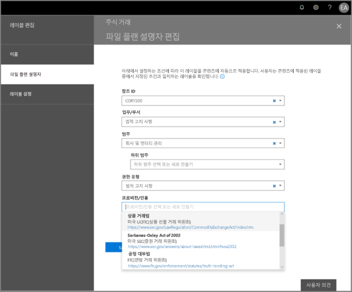
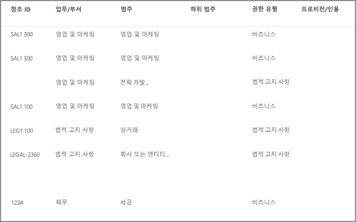
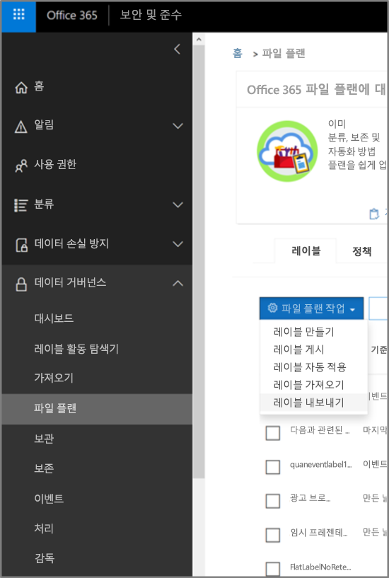
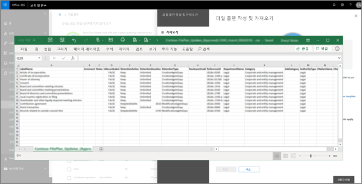
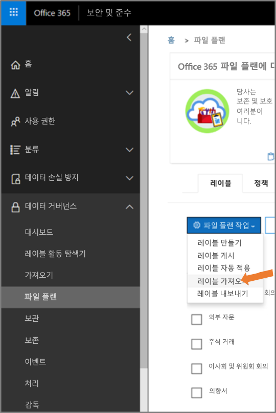
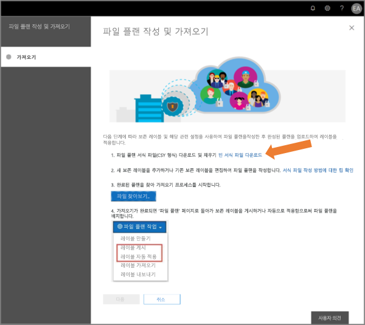
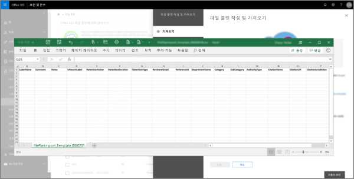
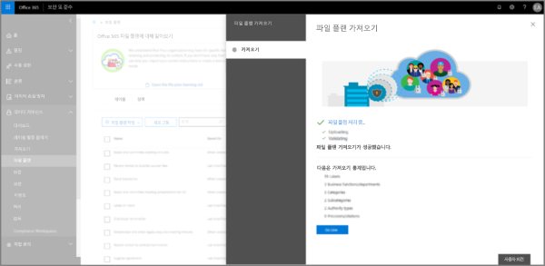
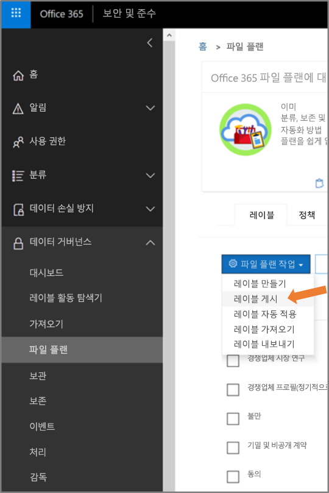

# 파일 계획 관리자 개요Overview of file plan manager

파일 계획 관리자는 보존 레이블 및 보존 레이블 정책에 대한 고급 관리 기능을 제공하고, 생성부터 공동 작업, 레코드 선언, 보존 및 최종 처리에 이르는 전체 콘텐츠 수명 주기 동안 레이블 및 레이블-콘텐츠 간 활동을 트래버스하는 통합 방법을 제공합니다.File plan manager provides advanced management capabilities for retention labels and policies, and provides an integrated way to traverse label and label-to-content activity for your entire content lifecycle – from creation, through collaboration, record declaration, retention, and finally disposition.

## 파일 계획 관리자 액세스Accessing file plan manager

파일 계획 관리자에 액세스하려면 다음 두 가지 요구 사항이 충족되어야 합니다.There are two requirements to access file plan manager, they are:
- Office 365 Enterprise E5 구독An Office 365 Enterprise E5 subscription.
- 사용자에게 보안 및 준수 센터의 다음 역할 중 하나가 할당되어야 합니다.The user has been in assigned one of the following roles of the Security &amp; Compliance Center:
    - 보존 관리자Retention Manager
    - 보기 전용 보존 관리자View-only Retention Manager

## 기본 보존 레이블 및 레이블 정책Default retention labels and label policy

보안 및 규정 준수 센터에 보존 레이블이 없는 경우, 왼쪽 탐색에서 **파일 계획**을 처음 선택하면 **Default Data Governance Publishing Policy**라는 레이블 정책이 생성됩니다.If there are no retention labels in the Security & Compliance Center, the first time you choose **File plan** in the left nav, this creates a label policy called **Default Data Governance Publishing Policy**. 

이 레이블 정책에는 세 가지 보존 레이블이 있습니다.This label policy contains three retention labels:

- **운영 프로시저****Operational procedure**
- **비즈니스 일반****Business general**
- **계약****Contract agreement**

이 보존 레이블은 콘텐츠를 삭제하지 않고 보존하도록 구성됩니다.These retention labels are configured only to retain content, not delete content. 이 레이블 정책은 전체 조직에 게시되고 비활성화하거나 제거할 수 있습니다.This label policy will be published to the entire organization and can be disabled or removed. 

**보존 정책을 만들었습니다** 및 **보존 정책에 대한 보존 구성을 만들었습니다**와 같은 활동에 대한 감사 로그를 검토하여 파일 계획 관리자를 열고 첫 번째 실행 환경을 시작한 사용자를 판별할 수 있습니다.You can determine who opened file plan manager and kicked off the first-run experience by reviewing the audit log for the activities **Created retention policy** and **Created retention configuration for a retention policy**.

> [!NOTE]
> 고객 피드백으로 인해, 위에 언급된 기본 보존 레이블과 보존 레이블 정책을 만드는 이 기능을 제거했습니다.Due to customer feedback, we have removed this feature that creates the default retention labels and label policy mentioned above. 2019년 4월 11일 이전에 파일 계획 관리자를 연 경우에만 이러한 보존 레이블과 보존 레이블 정책을 볼 수 있습니다.You will only see this policy and labels if you used file plan manager before April 11, 2019.

## 파일 계획 탐색Navigating your file plan

파일 계획 관리자를 사용하면 하나의 보기에서 모든 보존 레이블 및 정책의 설정을 보다 쉽게 검토할 수 있습니다.File plan manager makes it easier see into and across the settings of all your retention labels and policies from one view.

파일 계획 외부에서 만들어진 보존 레이블도 파일 계획에서 사용할 수 있고 그 반대의 경우도 가능합니다.Note that retention labels created outside of the file plan will be available in the file plan and vice versa.

**파일 계획 레이블** 탭에서 다음과 같은 추가 정보 및 기능을 사용할 수 있습니다.On the **file plan labels** tab, the following additional information and capabilities are available:

### 레이블 설정 열Label settings columns

- **기준**은 보존 기간을 시작할 트리거 유형을 식별합니다. 유효한 값은 다음과 같습니다.**Based on** identifies the type of trigger that will start the retention period. Valid values are:
    - 이벤트Event
    - 만든 날짜When created
    - 마지막으로 수정한 날짜When last modified
    - 레이블을 지정한 날짜When labeled
- **레코드**는 레이블이 적용될 때 항목이 선언된 레코드가 될지를 식별합니다. 유효한 값은 다음과 같습니다.**Record** identifies if the item will become a declared record when the label is applied. Valid values are:
    - 아니요No
    - 예Yes
    - 예(규정)Yes(Regulatory)
- **보존**은 보존 유형을 식별합니다. 유효한 값은 다음과 같습니다.**Retention** identifies the retention type. Valid values are:
    - 유지Keep
    - 유지 및 삭제Keep and delete
    - 삭제Delete
- **처리**는 보존 기간이 끝날 때 콘텐츠에 대해 수행할 작업을 식별합니다. 유효한 값은 다음과 같습니다.**Disposition** identifies what will happen to the content at the end of the retention period. Valid values are:
    - nullnull
    - 작업 없음No action
    - 자동 삭제Auto-delete
    - 검토 필요(즉, 처리 검토)Review required (aka Disposition review)

### 보존 레이블 파일 계획 설명자 열Label file plan descriptors columns

이제 보존 레이블 구성에 더 많은 정보를 포함할 수 있습니다. 보존 레이블에 파일 계획 설명자를 삽입하면 파일 계획의 관리 효율성과 구성이 개선됩니다.You can now include more information in the configuration of your retention labels. Inserting file plan descriptors into labels will improve the manageability and organization of your file plan.

시작하기 위해 파일 계획 관리자에서는 직무/부서, 범주, 권한 유형 및 프로비저닝/인용에 대한 기본 제공 값을 제공합니다. 보존 레이블을 만들거나 편집할 때 새 파일 계획 설명자 값을 추가할 수 있습니다.To get you started, file plan manager provides some out-of-box values for: Function/department, Category, Authority type and Provision/citation. You can add new file plan descriptor values when creating or editing a retention label.

보존 레이블을 만들거나 편집할 때의 파일 계획 설명자 단계 보기는 다음과 같습니다.Here's a view of the file plan descriptors step when creating or editing a retention label.

파일 계획 관리자의 레이블 탭에 표시되는 파일 계획 설명자 열 보기는 다음과 같습니다.Here's a view of the file plan descriptors columns on the labels tab of file plan manager.

## 모든 기존 보존 레이블을 내보내어 오프라인 검토를 분석 및/또는 수행Export all existing retention labels to analyze and/or perform offline reviews

파일 계획 관리자에서 모든 보존 레이블의 세부 정보를 .csv 파일로 내보내 조직의 데이터 거버넌스 이해 관계자와 함께 정기적인 검토를 편리하게 수행할 수 있습니다.From file plan manager, you can export the details of all retention labels into a .csv file to assist you in facilitating periodic compliance reviews with data governance stakeholders in your organization.

모든 보존 레이블의 내보내려면 **파일 계획 관리자** \> **파일 계획 작업** \> **레이블 내보내기**로 이동합니다.To export all retention labels, go to **file plan manager** \> **file plan actions** \> **export labels**.

모든 기존 보존 레이블을 포함하는 \*.csv 파일이 열립니다.A \*.csv file containing all existing retention labels will open.

## 파일 계획에 보존 레이블 가져오기Import labels into your file plan

파일 계획 관리자에서 기존 보존 레이블을 수정할 수 있을 뿐만 아니라 새 보존 레이블을 대량으로 가져올 수 있습니다.From file plan manager, you can bulk import new labels as well as modify existing retention labels.

새 보존 레이블이 가져오고 기존 보존 레이블을 업데이트하려면 **파일 계획 관리자** \> **파일 계획 작업** \> **레이블 가져오기**로 이동합니다.To import new retention labels and make updates existing retention labels, go to **file plan manager** \> **file plan actions** \> **import labels**.

빈 서식 파일을 다운로드합니다(또는 현재 파일 계획의 내보내기 기능을 통해 시작).Download a blank template (or start from an export of your current file plan).

서식 파일 채우기Fill-out the template. 이 표에서는 유효한 값을 제공합니다.This table provides valid values.

|**속성****Property**|**유형****Type**|**유효한 값****Valid values**|
|:-----|:-----|:-----|
|LabelNameLabelName|문자열String|값에 공백이 포함되어 있으면 값을 큰따옴표(")로 묶습니다.If the value contains spaces, enclose the value in quotation marks (").|
|설명Comment|문자열String|값에 공백이 포함되어 있으면 값을 큰따옴표(")로 묶습니다.If the value contains spaces, enclose the value in quotation marks ("). |
|참고Notes|문자열String|사용자 지정Custom|
|IsRecordLabelIsRecordLabel|문자열String|$true: 레이블이 레코드 레이블입니다.$true: The label is a record label. $false: 레이블이 레코드 레이블이 아닙니다.$false: The label isn't a record label. 이 값은 기본값입니다.This is the default value.|
|RetentionActionRetentionAction|문자열String|삭제Delete 유지Keep KeepAndDeleteKeepAndDelete |
|RetentionDurationRetentionDuration|문자열String|이 속성은 콘텐츠를 보관할 일 수를 지정합니다.The RetentionDuration parameter specifies the number of days to retain the content. 사용할 수 있는 값은 다음과 같습니다.Valid values are: 양의 정수A positive integer. 값은 제한이 없습니다.The default value is unlimited.|
|RetentionTypeRetentionType|문자열String|이 속성은 콘텐츠 작성 날짜, 레이블이(태그가) 지정된 날짜 또는 마지막으로 수정한 날짜에서 보존 기간을 계산하는지 여부를 지정합니다.This property specifies whether the retention duration is calculated from the content creation date, labeled (tagged) date, or last modified date. 유효한 값은 다음과 같습니다.Valid values are: CreationAgeInDaysCreationAgeInDays EventAgeInDaysEventAgeInDays ModificationAgeInDaysModificationAgeInDays TaggedAgeInDaysTaggedAgeInDays |
|ReviewerEmailReviewerEmail|SmtpAddress[]PARAMVALUE: SmtpAddress[]|이 속성은 삭제와 KeepAndDelete 보존 작업에 대한 검토자의 전자 메일 주소를 지정합니다.This property specifies the email address of a reviewer for Delete and KeepAndDelete retention actions. 전자 메일 주소가 여러 개인 경우 각 주소를 쉼표로 구분하여 지정할 수 있습니다.You can specify multiple email addresses separated by commas.|
|ReferenceIdReferenceId|문자열String|사용자 지정Custom|
|DepartmentnameDepartmentName|문자열String|사용자 지정Custom|
|범주Category|문자열String|사용자 지정Custom|
|하위 범주SubCategory|문자열String|사용자 지정Custom|
|AuthorityTypeAuthorityType|문자열String|사용자 지정Custom|
|CitationNameCitationName|문자열String|사용자 지정Custom|
|CitationUrlCitationUrl|문자열String|사용자 지정Custom|
|CitationJurisdictionCitationJurisdiction|문자열String|사용자 지정Custom|
|규정Regulatory|문자열String|사용자 지정Custom|
|EventTypeEventType|문자열String|이 속성은 레이블과 연결된 보존 규칙을 지정합니다.This property specifies the retention rule that's associated with the label. 규칙을 고유하게 식별하는 모든 값을 사용할 수 있습니다.You can use any value that uniquely identifies the rule. 예:For example: 이름Name DN(고유 이름)Distinguished name (DN) GUIDGUID  [Get-RetentionComplianceRule](https://docs.microsoft.com/ko-KR/powershell/module/exchange/policy-and-compliance-retention/get-retentioncompliancerule?view=exchange-ps) cmdlet를 사용하여 사용 가능한 보존 규칙을 볼 수 있습니다.You can use the [Get-DataEncryptionPolicy](https://docs.microsoft.com/en-us/powershell/module/exchange/policy-and-compliance-retention/get-retentioncompliancerule?view=exchange-ps) cmdlet to view the available policies.|

채운 서식 파일을 업로드하면 파일 계획 관리자에서 항목의 유효성을 검사하고 가져오기 통계를 표시합니다.Upload the filled-out template, and file plan manager will validate the entries and display import statistics.

유효성 검사 오류가 발생하면 파일 계획 가져오기가 가져오기 파일로 돌아가서 해당 오류를 손쉽게 수정할 수 있도록 계속해서 가져오기 파일의 모든 항목에 대한 유효성 검사를 수행하고 가져오기 파일의 줄/행 번호를 참조하는 모든 오류를 표시하며, 표시된 오류 결과를 복사합니다.In the event there is a validation error, file plan import will continue to validate every entry in the import file and display all errors referencing line/row numbers in the import file, copy the displayed error results so that you can easilly return to the import file and correct the errors. 

가져오기가 완료되면 파일 계획 관리자로 돌아가서 새 보존 레이블을 새 보존 레이블 및 기존 보존 레이블 정책과 연결합니다.When the import is complete, return to file plan manager to assign new labels to new or existing policies.

