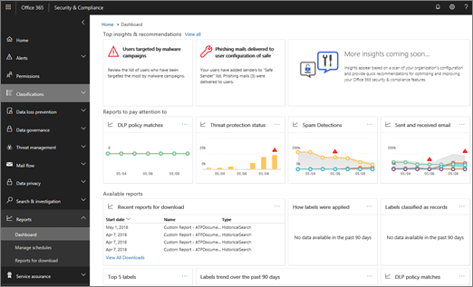

# 연습 - 통찰력에서 자세한 보고서Walkthrough - From an insight to a detailed report

[Office 365 보안 &amp; 및 준수 센터의 보고서 및 통찰력](reports-and-insights-in-security-and-compliance.md)을 처음 사용할 경우 자세한 보고서에 대해 자세히 알아볼 수 있는 방법을 확인 하는 데 도움이 될 수 있습니다.If you're new to [reports and insights in the Office 365 Security &amp; Compliance Center](reports-and-insights-in-security-and-compliance.md), it might help to see how you can easily navigate from an insight to a detailed report. 
  
다음은 [ &amp; 보안 및 준수 센터](https://protection.office.com)에 대 한 몇 가지 연습 중 하나입니다.This is one of several walkthroughs for the [Security &amp; Compliance Center](https://protection.office.com). 추가 연습을 보려면 [관련 항목](#related-topics) 섹션을 참조 하십시오.To see additional walkthroughs, see the [Related topics](#related-topics) section. 
  
## 자세한 보고서에 대 한 통찰력From an insight to a detailed report

대시보드에서 데이터 탐색에 대 한 자세한 보고서를 파악 하기 위한 흐름을 살펴보겠습니다.Let's walk through the flow from the dashboard to an insight to a detailed report for data exploration. 이는 간단한 [데이터 손실 방지](data-loss-prevention-policies.md) 예제입니다.(This is a brief [data loss prevention](data-loss-prevention-policies.md) example.) 
  
1. [ &amp; 보안 및 준수 센터](https://protection.office.com)의 대시보드로 시작 합니다.We begin with a dashboard in the [Security &amp; Compliance Center](https://protection.office.com). ( **보고서** \> **대시보드로**이동 합니다.)(Go to **Reports** \> **Dashboard**.) 
  
2. 대시보드의 왼쪽 위 모서리에서 **톱 insights &amp; 추천**항목 옆에 링크가 있습니다.In the upper left corner of the dashboard, next to **Top insights &amp; recommendations**, we have a link. ( **모두 보기**를 클릭 합니다.)(Click **View all**.)  이를 통해 조직에 대 한 정보 목록이 표시 됩니다.This takes us to a list of insights for our organization. 
  
3. 목록에서 항목을 선택 하면 해당 항목에 대 한 자세한 정보를 볼 수 있는 창이 열립니다.Selecting an item in the list opens a pane where we can view more details about that item. (항목을 클릭 합니다.)(Click an item.)  정책 검토와 같이 권장 조치를 고려해 야 합니다.We see recommended actions we should consider, such as reviewing policies. ([데이터 손실 방지 정책에 대해 자세히 알아보세요](data-loss-prevention-policies.md).)([Learn more about data loss prevention policies](data-loss-prevention-policies.md).)
    
4. 자세한 정보를 볼 수 있는 링크도 제공 됩니다.We also have a link to view more details. ( **탐색기에서 관련 활동 보기**를 클릭 합니다.)(Click **See related activity in Explorer**.) 이 경우에는 [위협 탐색기 (및 실시간 검색)](threat-explorer.md)라는 보고서 유형을 사용 하 여 필터를 적용 하 고 특정 세부 정보로 드릴 수 있습니다.This takes us to a report type called [Threat Explorer (and real-time detections)](threat-explorer.md), where we can apply filters and drill into specific details. 
  
이러한 방식으로는 정보를 기반으로 쉽게 이동할 수 있으며 조직에 대 한 데이터 손실 방지에 대 한 결정 사항에 대 한 보다 자세한 정보를 제공 합니다.In this way, we can move easily from an insight into its underlying details, and make more informed decisions about data loss prevention for an organization.
  
## 관련 항목Related topics

[연습: 자세한 보고서에서 통찰력에 이르기까지Walkthrough: From a detailed report to an insight](from-a-detailed-report-to-an-insight.md)
  
[연습: 대시보드에서 통찰력에 이르기까지Walkthrough: From a dashboard to an insight](from-a-dashboard-to-an-insight.md)
  

