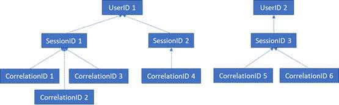

# Office Web Apps Server 및 Office Online Server GDPR

Office Online Server 및 Office Web Apps Server 원격 분석 데이터는 ULS 로그의 형식으로 저장됩니다. [ULS 뷰어](https://www.microsoft.com/en-us/download/details.aspx?id=44020)를 사용하여 온-프레미스 테넌트에서 ULS 로그를 볼 수 있습니다.

모든 로그 줄에는 CorrelationID가 있습니다. 관련된 로그 줄은 동일한 CorrelationID를 공유합니다. 각 CorrelationID는 단일 SessionID에 연결되고, 한 개의 SessionID는 많은 CorrelationID에 관련되어 있을 수 있습니다. 각 SessionID는 단일 UserID에 연결되어 있을 수 있지만 일부 세션은 익명으로 만들어져 연결된 UserID가 없을 수 있습니다. 그러므로 특정 사용자와 연결된 데이터를 확인하려면 단일 UserID에서 해당 사용자와 연결된 SessionID로 매핑하고, 이러한 SessionID에서 연결된 CorrelationID로 매핑하고, 이러한 CorrelationID에서 이러한 상관 관계에 있는 모든 로그로 매핑할 수 있습니다. 여러 ID 간의 관계는 아래 다이어그램을 참조하세요.

## 로그 수집

예를 들어 UserID 1과 연결된 모든 로그를 수집하기 위한 첫 번째 단계로 UserID 1과 연결된 모든 세션(즉, SessionID 1 및 SessionID 2)을 수집합니다. 다음 단계로는 SessionID 1(즉, CorrelationID 1, 2, 3) 및 SessionID 2(즉, CorrelationID 4)와 연결된 모든 상관 관계를 수집합니다. 마지막으로 목록의 각 상관 관계와 연결된 모든 로그를 수집합니다.

1.  UlsViewer를 시작합니다.

2.  의도한 시간 프레임에 해당하는 uls 로그를 엽니다. ULS 로그는 %PROGRAMDATA%\\Microsoft\\OfficeWebApps\\데이터\\로그\\ULS에 저장됩니다.

3.  편집 | 필터 수정을 수행합니다.

4.  다음과 같은 필터를 적용합니다.

    -   EventID가 apr3y와 같음 또는

    -   EventID가 bp2d6과 같음

5.  해시된 UserId는 이러한 두 이벤트 중 하나의 Message에 있습니다.

6.  apr3y의 경우 Message에는 UserID 값과 PUID 값이 포함됩니다.

7.  bp2d6의 경우 Message에는 여러 정보가 포함됩니다. LoggableUserId 값 필드는 해시된 UserID입니다.

8.  해시된 UserId를 이러한 두 태그 중 하나에서 가져오면 ULSViewer에서 해당 행의 WacSessionId 값에는 해당 사용자와 연결된 WacSessionId가 포함됩니다.

9.  해당 사용자와 연결된 모든 WacSessionId 값을 수집합니다.

10. 모든 EventId의 필터가 "xmnv"와 같습니다. Message는 목록에서 첫 번째 WacSessionId의 "UserSessionId=\<WacSessionId\>"와 같습니다(필터의 \<WacSessionId\>를 사용자의 WacSessionId로 바꿈).

11. 해당 WacSessionId와 일치하는 모든 Correlation 값을 수집합니다.

12. 해당 사용자에 대해 목록에 있는 모든 WacSessionId 값에 10~11단계를 반복합니다.

13. 모든 Correlation의 필터가 목록의 첫 번째 Correlation과 같게 합니다.

14. 해당 Correlation과 일치하는 모든 로그를 수집합니다.

15. 해당 사용자에 대해 목록에 있는 모든 Correlation 값에 13~14단계를 반복합니다.

## 데이터 형식

Office Online 로그는 다양한 형식의 데이터를 포함합니다. 다음은 ULS 로그에 포함될 수 있는 데이터의 예입니다.

-   제품을 사용하는 동안 발생한 문제의 오류 코드

-   단추 클릭 및 앱 사용에 대한 다른 데이터들

-   앱 및/또는 앱 내의 특정 기능에 대한 성능 데이터

-   사용자의 컴퓨터 위치에 대한 일반적인 위치 정보(예: IP 주소에서 파생된 국가/지역, 시/도), 하지만 정확한 지리적 위치는 배제

-   브라우저(예: 브라우저 이름 및 버전) 및 컴퓨터(예: 데이터 OS 유형 및 버전)에 대한 기본 메타데이터

-   문서 호스트(예: OneDrive, SharePoint, Exchange)에서 보낸 오류 메시지

-   사용자가 수행한 작업과 관련 없는, 앱 내부 프로세스에 대한 정보
