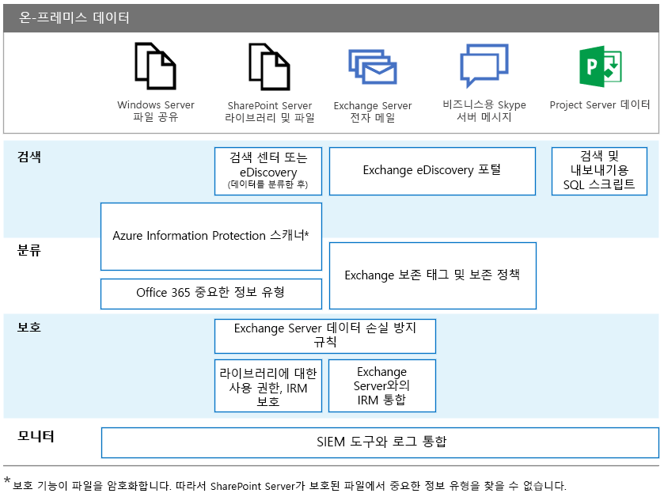

# Office 온-프레미스 Server GDPRGDPR for Office on-premises Servers

GDPR(일반 데이터 보호 규정)은 조직에 요구 사항을 소개하여 개인 데이터를 보호하고 데이터 주체 요청에 적절하게 응답합니다. 이 일련의 문서는 온-프레미스 작업에 권장되는 접근 방식을 제공합니다.The General Data Protection Regulation (GDPR) introduces requirements for organizations to protect personal data and respond appropriately to data subject requests. This series of articles provides recommended approaches for on-premises workloads:

-   [SharePoint ServerSharePoint Server](gdpr-for-sharepoint-server.md)

-   [Exchange ServerExchange Server](gdpr-for-exchange-server.md)

-   [비즈니스용 Skype 서버Skype for Business Server](gdpr-for-skype-for-business-server.md)

-   [Project ServerProject Server](gdpr-for-project-server.md)

-   [Office Web Apps Server 및 Office Online ServerOffice Web Apps Server and Office Online Server](gdpr-for-office-online-server.md)

-   [온-프레미스 파일 공유On-premises file shares](gdpr-for-on-premises-file-shares.md)

GDPR 및 Microsoft가 지원하는 방법에 대한 자세한 내용은 [Microsoft 보안 센터](https://www.microsoft.com/en-us/TrustCenter/Privacy/gdpr/default.aspx)를 참조하세요.For more information about the GDPR and how Microsoft can help you, see the [Microsoft Trust Center](https://www.microsoft.com/en-us/TrustCenter/Privacy/gdpr/default.aspx).

온-프레미스 데이터로 작업을 수행하기 전에 먼저 법률 및 규정 준수 팀에 문의하여 안내를 받고 개인 데이터를 사용하여 작업하는 접근 방식 및 기존 분류 스키마에 대해 알아보세요. 수 및 기존 분류에 대한 자세한 내용은  스키마 및 개인 데이터 작업을 위한 접근 방식을합니다. Microsoft는 [http://aka.ms/gdprpartners](<http://aka.ms/gdprpartners>)에서 Microsoft GDPR 데이터 검색 도구 키트의 분류 스키마를 개발하고 확장하는 권장 사항을 제공합니다. 또한, 이 도구 키트는 원하는 경우 더 정교한 데이터 거버넌스 기능을 사용할 수 있는 클라우드로 온-프레미스 데이터를 이동하는 접근 방식을 설명합니다. 이 섹션에 나와 있는 문서는 온-프레미스로 유지하기 위한 데이터 권장 사항을 제공합니다.Before doing any work with on-premises data, consult with your legal and compliance teams to seek guidance and to learn about existing classification schemas and approaches to working with personal data. Microsoft provides recommendations for developing and extending classifications schemas in the Microsoft GDPR Data Discovery Toolkit at [http://aka.ms/gdprpartners](<http://aka.ms/gdprpartners>). This toolkit also describes approaches for moving on-premises data to the cloud where you can use more sophisticated data governance capabilities, if this is desired. The articles in this section provide recommendations for data that is intended to remain on premises.

다음 그림은 이러한 각 작업에 사용하여 개인 데이터를 검색, 분류, 보호, 모니터링할 수 있는 권장 기능을 나열합니다. 자세한 내용은 이 섹션의 문서를 참조하세요.The following illustration lists recommended capabilities to use across each of these workloads to discover, classify, protect, and monitor personal data. See the articles in this section for more information.

## 그림 설명Illustration description

다음 표에서는 이해를 돕기 위해 그림과 동일한 예제를 제공합니다.For accessibility, the following table provides the same examples in the illustration.

|             |Windows Server 파일 공유Windows Server file shares|SharePoint ServerSharePoint Server|Exchange ServerExchange Server|비즈니스용 SkypeSkype for Business|Project ServerProject Server|
|:------------|:-------------------------|:----------------|:--------------|:-----------------|:-------------|
|검색Discover|Azure Information Protection 스캐너\*Azure Information Protection scanner\*|검색 센터 또는 eDiscovery(데이터 분류 후), Azure Information Protection 스캐너\*Search Center or eDiscovery (after data is classified); Azure Information Protection scanner\*|Exchange eDiscovery 포털Exchange eDiscovery Portal|Exchange eDiscovery 포털Exchange eDiscovery portal|검색 및 내보내기용 SQL 스크립트SQL scripts for discovery and exporting|
|분류Classify|Azure Information Protection 스캐너\*, Office 365 중요한 정보 유형Azure Information Protection scanner\*; Office 365 sensitive information types|Azure Information Protection 스캐너\*, Office 365 중요한 정보 유형Azure Information Protection scanner\*; Office 365 sensitive information types|Exchange 보존 태그 및 보존 정책Exchange retention tags and retention policies|Exchange 보존 태그 및 보존 정책Exchange retention tags and retention policies||
|보호Protect||Exchange Server 데이터 손실 방지 규칙, 권한, 라이브러리의 IRM 보호Exchange Server data loss prevention rules; Permissions, IRM-protection for libraries|Exchange Server 데이터 손실 방지 규칙, Exchange Server와 IRM 통합Exchange Server data loss prevention rules; IRM integration with Exchange Server|||
|모니터링Monitor|SIEM 도구와 로그 통합Integrate logs with SIEM tools|SIEM 도구와 로그 통합Integrate logs with SIEM tools|SIEM 도구와 로그 통합Integrate logs with SIEM tools|SIEM 도구와 로그 통합Integrate logs with SIEM tools|SIEM 도구와 로그 통합Integrate logs with SIEM tools|

\*보호는 파일을 암호화합니다. 따라서 SharePoint Server가 보호된 파일에서 중요한 정보 유형을 찾을 수 없습니다.\*Note that protection encrypts the file. Consequently, SharePoint Server can’t find the sensitive information types in protected files.
