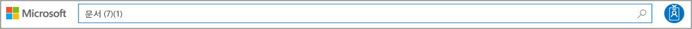
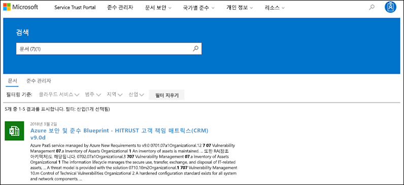
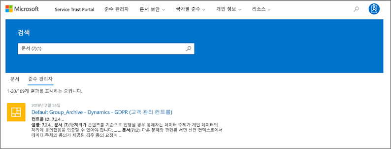
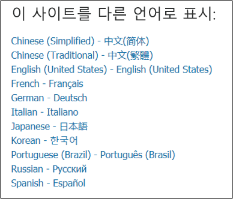

# Microsoft Service Trust Portal 시작Get started with the Microsoft Service Trust Portal

microsoft Service Trust Portal은 microsoft 보안, 개인 정보 및 규정 준수 모범 사례에 대 한 다양 한 콘텐츠, 도구 및 기타 리소스를 제공 합니다.The Microsoft Service Trust Portal provides a variety of content, tools, and other resources about Microsoft security, privacy and compliance practices.
  
## 서비스 보안 포털 액세스Accessing the Service Trust Portal

서비스 트러스트 포털에는 Microsoft의 클라우드 서비스 및 고객 데이터를 보호 하는 제어 및 프로세스에 대 한 자세한 정보가 포함 되어 있습니다.The Service Trust Portal contains details about Microsoft's implementation of controls and processes that protect our cloud services and the customer data therein. 서비스 보안 포털의 일부 리소스에 액세스 하려면 microsoft 클라우드 서비스 계정 (Azure Active Directory 조직 계정 또는 Microsoft 계정)을 사용 하 여 인증 된 사용자로 로그인 하 고 microsoft에 검토 및 동의 해야 합니다. 규정 준수 자료에 대 한 비밀 유지 계약To access some of the resources on the Service Trust Portal, you must log in as an authenticated user with your Microsoft cloud services account (either an Azure Active Directory organization account or a Microsoft Account) and review and accept the Microsoft Non-Disclosure Agreement for Compliance Materials.
  
기존 고객은 다음 온라인 구독 (평가판 또는 [https://aka.ms/STP](https://aka.ms/STP) 유료) 중 하나를 사용 하 여 **서비스 신뢰 포털에 액세스할 수 있습니다** .**Existing customers can access the Service Trust Portal** at [https://aka.ms/STP](https://aka.ms/STP) with one of the following online subscriptions (trial or paid): 
  
- Office 365Office 365

- Dynamics 365Dynamics 365

- AzureAzure
    
 > [!NOTE]
 > 조직과 연결 된 Azure Active Directory 계정은 준수 관리자와 같은 모든 범위의 문서 및 기능에 액세스할 수 있습니다.Azure Active Directory accounts associated with organizations have access to the full range of documents and features like Compliance Manager. 개인적인 사용을 위해 만든 Microsoft 계정은 서비스 신뢰 포털 콘텐츠에 대 한 액세스가 제한 됩니다.Microsoft accounts created for personal use have limited access to Service Trust Portal content. 
  
**Microsoft online services를 평가 하는 신규 고객 및 고객****New customers and customers evaluating Microsoft online services**
  
새 계정을 만들거나 평가판 계정을 만들려면 평가판 계정에도 사용 되는 다음 등록 양식 중 하나를 사용 하 여 STP에 대 한 액세스 권한을 얻습니다.To create a new account or to create a trial account, use one of the following sign-up forms (also used for trial accounts) to get access to the STP.
  
- 새 [office 365 비즈니스 평가판 계정](https://go.microsoft.com/fwlink/p/?LinkID=507653) 또는 새 [office 365 Enterprise 평가판 계정](https://go.microsoft.com/fwlink/p/?LinkID=698279) 등록Sign up for a new [Office 365 Business trial account](https://go.microsoft.com/fwlink/p/?LinkID=507653) or a new [Office 365 Enterprise trial account](https://go.microsoft.com/fwlink/p/?LinkID=698279)

- 새 [Dynamics 365 평가판 계정](https://go.microsoft.com/fwlink/?LinkId=252780) 등록Sign up for a new [Dynamics 365 trial account](https://go.microsoft.com/fwlink/?LinkId=252780)

- 새 [Azure 평가판 계정](https://go.microsoft.com/fwlink/?LinkId=722737)에 등록 합니다.Sign up for a new [Azure trial account](https://go.microsoft.com/fwlink/?LinkId=722737). 
    
무료 평가판 또는 구독에 등록할 때는 STP에 대 한 액세스를 지원 하기 위해 Azure Active Directory를 사용 하도록 설정 해야 합니다.When you sign up for either a free trial, or a subscription, you must enable Azure Active Directory to support your access to the STP.
  
## 서비스 보안 포털 사용Using the Service Trust Portal

서비스 신뢰 포털 기능 및 콘텐츠는 주 메뉴에서 액세스할 수 있습니다.The Service Trust Portal features and content are accessible from the main menu.
  

다음 섹션에서는 주 메뉴의 각 항목에 대해 설명 합니다.The following sections describe each item in the main menu.
  
### 서비스 보안 포털Service Trust Portal

**서비스 신뢰 포털** 링크에 홈 페이지가 표시 됩니다.The **Service Trust Portal** link displays the home page. 이를 통해 홈 페이지로 빠르게 다시 이동할 수 있습니다.It provides a quick way to get back to the home page.

### 규정 준수Compliance

에서는 다음과 같은 준수 관련 도구와 리소스를 제공 합니다.Provides the following compliance-related tools and resources:

- **감사 보고서** -Microsoft의 클라우드 서비스에 대 한 독립적인 감사 및 평가 보고서 목록이 표시 됩니다.**Audit reports** - A list of independent audit and assessment reports on Microsoft's Cloud services is displayed. 이러한 보고서는 다음과 같은 데이터 보호 표준 및 규정 요구 사항에 따라 Microsoft 클라우드 서비스 준수에 대 한 정보를 제공 합니다.These reports provide information about Microsoft Cloud services compliance with data protection standards and regulatory requirements, such as:
  
    - 국제 표준화 기구 (ISO)International Organization for Standardization (ISO)
    - SOC (서비스 조직 컨트롤)Service Organization Controls (SOC)
    - 국내 표준 협회 및 기술 (NIST)National Institute of Standards and Technology (NIST)
    - 연방 위험 및 권한 부여 관리 프로그램 (FedRAMP)Federal Risk and Authorization Management Program (FedRAMP)
    - gdpr (일반 데이터 보호 규정)General Data Protection Regulation (GDPR)

  감사 보고서 및 **감사 보고서** 의 링크에 대 한 정보는 Service Trust Portal 홈 페이지에도 표시 됩니다.Information about audit reports and a link to the **Audit reports** page is also displayed on the Service Trust Portal home page. 
  
- **준수** 관리자-준수 관리자는 Office 365, Dynamics 365와 같은 Microsoft 클라우드 서비스와 관련 된 조직의 규정 준수 활동을 추적, 할당 및 확인 하는 데 도움이 되는 워크플로 기반 위험 평가 도구입니다. microsoft.**Compliance Manager** - Compliance Manager is a workflow-based risk assessment tool that helps you track, assign, and verify your organization's regulatory compliance activities related to Microsoft Cloud services, such as Office 365, Dynamics 365, and Azure. 준수 관리자를 사용 하 여 클라우드의 공유 책임 모델 내에서 규정 준수를 관리 합니다.Use Compliance Manager to manage regulatory compliance within the shared responsibility model of the cloud. 자세한 내용은 [Microsoft 클라우드 서비스를 사용 하는 경우 준수 관리자를 사용 하 여 데이터 보호 및 규정 요구 사항을 충족](meet-data-protection-and-regulatory-reqs-using-microsoft-cloud.md)합니다 .를 참조 하세요.For more information, see [Use Compliance Manager to help meet data protection and regulatory requirements when using Microsoft cloud services](meet-data-protection-and-regulatory-reqs-using-microsoft-cloud.md).

### 산업 & 지역Industries & Regions

Microsoft 클라우드 서비스에 대 한 업계 및 지역별 규정 준수 정보를 제공 합니다.Provides industry- and region-specific compliance information about Microsoft Cloud services.

- **산업** -산업 관련 랜딩 페이지 정보를 제공 하 고 Microsoft 클라우드 서비스가 다음 업계의 표준과 규정을 준수 하는 데 도움을 주는 방법에 대해 알아봅니다.**Industries** - Provides industry-specific landing pages for information and about how Microsoft Cloud services help your organization's be compliant with standards and regulations for these industries:

    - EducationEducation
    - 금융 서비스Financial Services
    - 주민Government
    - 상태Health
    - 제조Manufacturing
    - 판매점Retail

- **지역** -Microsoft 클라우드 서비스에서 다양 한 국가의 다양 한 법칙을 준수 하는 법적 의견을 제공 합니다.**Regions** - Provides legal opinions on Microsoft Cloud services compliance with various the laws of various countries. 특정 국가에는 오스트레일리아, 체코 공화국, 독일, 폴란드, 루마니아, 스페인, 영국 등이 있습니다.Specific countries include Australia, Czech Republic, Germany, Poland, Romania, Spain, and the United Kingdom.
  
### 문서 & 리소스Documents & Resources

Microsoft 클라우드 서비스가 데이터를 안전 하 게 유지 하는 방법을 이해 하 여 규정 준수 목표를 보다 쉽게 이해할 수 있도록 하는 다양 한 보안 구현 및 디자인 정보를 제공 합니다.Provides a wealth of security implementation and design information with the goal of making it easier for you to meet regulatory compliance objectives by understanding how Microsoft Cloud services keep your data secure. 콘텐츠를 검토 하려면 **문서 & 자원** 페이지의 옵션 중 하나를 선택 합니다.To review content, select one of the options on the **Documents & Resources** page.

- 백서, faq 및 방법 문서White papers, FAQs, and How-to-articles
- 준수 가이드Compliance guides
- 펜 테스트 및 보안 평가Pen Tests and Security Assessments
- 보안 점수Secure Score
- Azure 보안 및 규정 준수 청사진Azure Security and Compliance Blueprints
- 감사 되는 컨트롤Audited Controls
  
### 보안 센터Trust Center

microsoft 클라우드에서 보안, 규정 준수 및 개인 정보 보호에 대 한 자세한 정보를 제공 하는 [microsoft 보안 센터](https://www.microsoft.com/trustcenter)에 대 한 링크입니다.Links to the [Microsoft Trust Center](https://www.microsoft.com/trustcenter), which provides more information about security, compliance, and privacy in the Microsoft Cloud. 여기에는 gdpr에 대 한 특정 요구 사항을 해결 하는 데 사용할 수 있는 Microsoft 클라우드 서비스의 기능에 대 한 정보 및 기술 및 조직의 책임에 대 한 이해를 제공 합니다. Microsoft는 gdpr을 지원 하기 위해 수행 했습니다.This includes information about the capabilities in Microsoft Cloud services that you can use to address specific requirements of the GDPR, documentation helpful to your GDPR accountability and to your understanding of the technical and organizational measures Microsoft has taken to support the GDPR.
  
### 내 라이브러리My Library

이 새로운 기능을 사용 하면 문서를 저장 하거나 *고정*하 여 내 라이브러리 페이지에서 빠르게 액세스할 수 있습니다.This new feature lets you save (or *pin*) documents so that you can quickly access them on your My Library page. 내 라이브러리의 문서가 업데이트 되 면 Microsoft에서 전자 메일 메시지를 보내도록 알림을 설정할 수도 있습니다.You can also set up notifications so that Microsoft sends you an email message when documents in your My Library are updated. 자세한 내용은이 문서의 [My Library (내 라이브러리](#my-library-1) ) 섹션을 참조 하십시오.For more information, see the [My Library](#my-library-1) section in this article.

### 관리Admin

전역 관리자 계정 에서만 사용할 수 있는 관리 기능입니다.Administrative functions that are only available to the global administrator account. 이 옵션은 전역 관리자로 로그인 한 경우에만 표시 됩니다.This option is visible only when you are signed in as a global administrator.
  
 **설정** 페이지에서는 준수 관리자에 게 역할 기반 액세스를 할당할 수 있습니다.The **Settings** page lets you to assign role-based access to Compliance Manager. 자세한 내용은 using 준수 관리자의 "권한 및 역할 기반 액세스 제어" 섹션에서 [Microsoft 클라우드 서비스를 사용할 때의 데이터 보호 및 규정 요구 사항을 충족 하는 데 도움을](meet-data-protection-and-regulatory-reqs-using-microsoft-cloud.md#permissions-and-role-based-access-control)참조 하세요.For more information, see the "Permissions and role-based access control" section in [Use Compliance Manager to help meet data protection and regulatory requirements when using Microsoft cloud services](meet-data-protection-and-regulatory-reqs-using-microsoft-cloud.md#permissions-and-role-based-access-control).
  
### 검색Search

서비스 트러스트 포털 페이지의 오른쪽 위에 있는 돋보기를 클릭 하 여 상자를 확장 하 고 검색 용어를 입력 한 다음 enter 키를 누릅니다. \*\*\*\*Click the magnifying glass in the upper right-hand corner of the Service Trust Portal page to expand the box, enter your search terms, and press **Enter**.

  
 검색 상자에 검색 용어가 표시 되 고 아래 나열 된 검색 결과가 포함 된 **검색** 페이지가 표시 됩니다.The **Search** page is displayed, with the search term displayed in the search box and the search results listed below.
  

기본적으로 검색 시 문서 결과가 반환 됩니다.By default, Search returns document results. 드롭다운 목록을 사용 하 여 표시 되는 문서 목록을 구체화 하 여 결과를 얻을 수 있습니다.You can the results by using dropdown lists to refine the list of documents displayed. 여러 필터를 사용 하 여 문서 목록의 범위를 좁힐 수 있습니다.You can use multiple filters to narrow the list of documents. 필터에는 특정 클라우드 서비스, 준수 범주 또는 보안 관행, 지역 및 산업이 포함 됩니다.Filters include the specific cloud services, categories of compliance or security practices, regions, and industries. 문서 이름 링크를 클릭 하 여 문서를 다운로드 합니다.Click the document name link to download the document.
  
준수 관리자에서 검색 용어와 관련 된 평가의 제어를 나열 하려면 **준수 관리자**를 클릭 합니다.To list controls from Assessments in Compliance Manager related your search terms, click **Compliance Manager**. 검색 결과에는 평가를 만든 날짜, 평가 그룹의 이름, 적용 가능한 microsoft 클라우드 서비스 및 해당 컨트롤이 Microsoft 또는 고객의 관리 인지 여부가 표시 됩니다.The search results show the date the assessment was created, the name of the assessment grouping, the applicable Microsoft Cloud service, and whether the control is Microsoft or Customer Managed. 준수 관리자의 평가에서 컨트롤을 보려면 컨트롤의 이름을 클릭 합니다.Click the name of the control to view the control in the Assessment in Compliance Manager.
  

  
> [!NOTE]
> 서비스 신뢰 포털 보고서 및 문서는 게시 후 12 개월 이상 동안 또는 새 버전의 문서가 사용 가능 해질 때까지 다운로드할 수 있습니다.Service Trust Portal reports and documents are available to download for at least 12 months after publishing or until a new version of document becomes available.
  
## 내 라이브러리My Library

내 라이브러리 기능을 사용 하 여 서비스 신뢰 포털의 문서 및 리소스를 내 라이브러리 페이지에 추가 합니다.Use the My Library feature to add documents and resources on the Service Trust Portal to your My Library page. 이렇게 하면 한 곳에서 사용자와 관련 된 문서에 액세스할 수 있습니다.This lets you access documents that are relevant to you in a single place.  내 라이브러리에 문서를 추가 하려면 문서 오른쪽의 **...** 메뉴를 클릭 하 고 **라이브러리에 저장**을 선택 합니다.To add a document to your My Library, click the **...** menu to the right of a document and then select **Save to library**. 하나 이상의 문서 옆에 있는 확인란을 클릭 한 다음 페이지 맨 위에 있는 **라이브러리에 저장** 을 클릭 하 여 내 라이브러리에 문서를 여러 개 추가할 수 있습니다.You can add multiple documents to your My Library by clicking the checkbox next to one or more documents, and then clicking **Save to library** at the top of the page.

또한 알림 기능을 사용 하면 Microsoft에서 내 라이브러리에 추가한 문서를 업데이트할 때마다 전자 메일 메시지가 전송 되도록 내 라이브러리를 구성할 수 있습니다.Additionally, the notifications feature lets you configure your My Library so that an email message is sent to you whenever Microsoft updates a document that you've added to your My Library. 알림을 설정 하려면 내 라이브러리로 이동 하 여 **알림 설정을**클릭 합니다.To set up notifications, go to your My Library and click **Notification Settings**. 알림의 빈도를 선택 하 고 조직의 전자 메일 주소를 지정 하 여 알림을 보낼 수 있습니다.You can choose the frequency of notifications and specify an email address in your organization to send notifications to. 전자 메일 알림에는 업데이트 된 문서에 대 한 링크 및 업데이트에 대 한 간략 한 설명이 포함 됩니다.Email notifications include links to the documents that have been updated and a brief description of the update.

또한 알림 설정 여부에 관계 없이 지난 30 일 이내에 업데이트 된 내 라이브러리의 문서를 식별 합니다.Also note that we identify any documents in your My Library that have been updated within the last 30 days, regardless of whether or not you turn on notifications. 업데이트에 대 한 간략 한 설명이 도구 설명에도 표시 됩니다.A brief description of the update is also displayed in a tool tip. 

## 스타터 팩Starter packs

스타터 팩은 특정 업계의 microsoft 클라우드 서비스에 대 한 microsoft 맞게 조정 된 설명서 집합입니다.Starter packs are a Microsoft-curated set of documentation about Microsoft Cloud services for specific industries. 현재 서비스 신뢰 포털은 금융 서비스 조직에 대해 다음과 같은 세 가지 시작 팩을 제공 합니다.Currently, the Service Trust Portal offers the following three starter packs for financial services organizations. 이러한 스타터 팩은 조직에서 microsoft 클라우드의 보안, 규정 준수 및 개인 정보를 평가 및 평가 하 고, 높은 규제 금융 서비스 업계에서 microsoft 클라우드 서비스를 구현 하는 데 도움이 되는 지침을 제공 합니다.These starter packs help organizations evaluate and assess security, compliance, and privacy in the Microsoft Cloud and provide guidance to help implement Microsoft Cloud services in the highly regulated financial services industry.

- **Evaluation Starter Pack** -Microsoft cloud for 금융 서비스 조직을 조기에 평가 하는 데 사용 됩니다.**Evaluation Starter Pack** - Use for early evaluation of the Microsoft cloud for financial services organizations.

- **평가 시작 팩** -평가 후이 시작 팩의 검사 목록 및 기타 지침을 사용 하 여 조직에서 보안, 규정 준수 및 개인 정보 보호와 관련 된 위험을 평가 하는 데 도움을 받을 수 있습니다.**Assessment Starter Pack** - After evaluation, use the checklists and other guidance in this starter pack to help your organization assess risks related to security, compliance, and privacy.

- **Audit starter pack** -User이 스타터 pack은 감사 제어 및 기타 도구를 사용 하 여 조직의 위험에 대 한 노출을 줄이는 방식으로 Microsoft 클라우드 서비스 구현을 안내할 수 있는 지침을 제공 합니다.**Audit Starter Pack** - User this starter pack for guidance on using auditing controls and other tool to help guide your implementation of Microsoft Cloud services in a way that helps reduce your organization's exposure to risk.

이러한 시작 팩에 액세스 하려면 **서비스 신뢰 포털 > 산업별 & Regions > Solutions > 금융 서비스**로 이동 합니다.To access these starter packs, go to **Service Trust Portal > Industries & Regions > Industry Solutions > Financial Services**. 시작 팩에서 문서를 열거나 내 라이브러리에 저장할 수 있습니다.You can open or a download documents from a starter pack or save them to your My Library.

## 지역화 지원Localization support

서비스 신뢰 포털을 사용 하면 다양 한 언어로 페이지 콘텐츠를 볼 수 있습니다.The Service Trust Portal enables you to view the page content in different languages. 페이지 언어를 변경 하려면 페이지 왼쪽 아래 모서리에 있는 지구 아이콘을 클릭 하 고 원하는 언어를 선택 하면 됩니다.To change the page language, simply click on the globe icon in the lower left corner of the page and select the language of your choice. 
  

  
## 사용자 의견Feedback

서비스 신뢰 포털에 대 한 질문이 나 포털을 사용할 때 발생 하는 오류에 대해 도움을 얻을 수 있습니다.We can help with questions about the Service Trust Portal, or errors you experience when you use the portal. 또한 STP 페이지 아래쪽에 있는 피드백 링크를 사용 하 여 서비스 신뢰 포털 준수 보고서 및 신뢰 리소스에 대 한 질문과 대답 및 의견을 문의할 수 있습니다.You can also contact us with questions and feedback about Service Trust Portal compliance reports and trust resources by using the Feedback link on the bottom of the STP pages.
  
여러분의 의견은 매우 중요 합니다.Your feedback is very important to us. 페이지 아래쪽에 있는 사용자 의견 단추를 클릭 하 여 사용자가 수행 하거나 선호 하지 않는 사항에 대 한 의견을 보내거나, 제품 또는 제품 기능을 개선 하는 데 필요한 제안을 제공 합니다.Click on the Feedback button at the bottom of the page to send us comments about what you did or did not like, or suggestions you may have for improving our products or product features.
  

