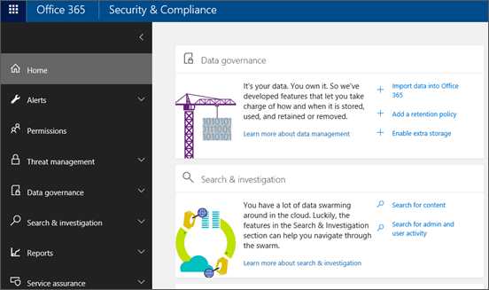

# Go to the Office 365 Security &amp; Compliance Center

Before you can use the Security &amp; Compliance Center, you need the right permissions. 회사 또는 학교 계정에 Office 365 전역 관리자 역할을 할당 하거나 전역 관리자가 하나 이상의 보안 &amp; 및 준수 센터 역할 그룹에 할당 해야 합니다.
  
- Office 365 전역 관리자 역할에 대 한 자세한 내용은 [office 365 관리자 역할 정보](https://support.office.com/article/da585eea-f576-4f55-a1e0-87090b6aaa9d)를 참조 하세요. 
    
- 보안 &amp; 준수 센터 역할을 다른 사용자에 게 할당 하는 방법에 대 한 자세한 내용은 사용자에 게 [보안 &amp; 및 준수 센터에 대 한 액세스 권한을 부여](grant-access-to-the-security-and-compliance-center.md)
    
다음은 보안 &amp; 및 준수 센터에 대 한 가장 직접적인 방법입니다.
  
1. [https://protection.office.com](https://protection.office.com)으로 이동합니다.
    
2. 회사 또는 학교 계정을 사용하여 Office 365에 로그인합니다.
    

  

