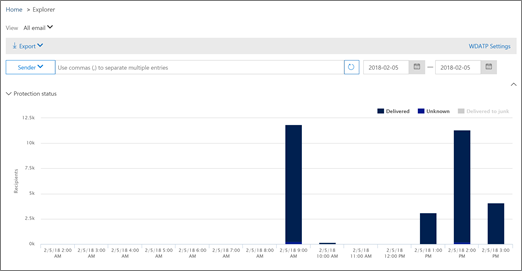

# Office 365에서 제공 된 악성 전자 메일 찾기 및 조사

[Office 365 Advanced Threat Protection](office-365-atp.md) 을 사용 하면 사용자에 게 위험을 주는 작업을 조사 하 고 조직을 보호 하기 위한 조치를 취할 수 있습니다. 예를 들어 조직의 보안 팀에 속한 경우 사용자에 게 배달 된 의심 스러운 전자 메일 메시지를 찾아서 조사할 수 있습니다. [위협 탐색기 (또는 실시간 검색)](threat-explorer.md)를 사용 하 여이 작업을 수행할 수 있습니다.
  
## 시작 하기 전에

다음 조건이 충족되었는지 확인하세요.
  
- 조직에 [Office 365 Advanced Threat Protection](office-365-atp.md) 이 있고 [라이선스가 사용자에 게 할당 되어](https://docs.microsoft.com/en-us/office365/admin/subscriptions-and-billing/assign-licenses-to-users)있습니다.
    
- [Office 365](turn-audit-log-search-on-or-off.md) 조직에 대해 감사 로깅이 설정 됩니다. 
    
- 조직에 스팸 방지, 맬웨어 방지, 피싱 방지 등을 위한 정책이 정의 되어 있습니다. [Office 365에서 위협 으로부터 보호를](protect-against-threats.md)참조 하세요.
    
- Office 365 전역 관리자 이거나 보안 관리자 또는 보안 &amp; 및 준수 센터에서 할당 된 검색 및 제거 역할 중 하나를 사용할 수 있습니다. [Office 365 보안 &amp; 및 준수 센터의 사용 권한을](permissions-in-the-security-and-compliance-center.md)참조 하세요.
    
## 의심 스러운 전자 메일 처리

악의적인 공격자가 사용자에 게 메일을 보내 자격 증명을 피싱 회사 비밀에 대 한 액세스를 시도할 수 있습니다. 이를 방지 하려면 [Exchange Online protection](eop/exchange-online-protection-overview.md) 및 [Advanced threat protection](office-365-atp.md)을 포함 하 여 Office 365의 위협 보호 서비스를 사용 해야 합니다. 그러나 공격자가 URL을 포함 하는 사용자에 게 메일을 보낼 수 있으며 나중에 해당 URL이 악성 콘텐츠를 가리키도록 설정 합니다 (맬웨어 등). 또는 조직의 사용자가 손상 된 경우, 해당 사용자가 손상 된 경우 공격자가 해당 계정을 사용 하 여 회사의 다른 사용자에 게 전자 메일을 보내는 것을 너무 늦 었을 수 있습니다. 이러한 두 시나리오를 정리 하는 과정에서 사용자의 받은 편지함에서 전자 메일 메시지를 제거할 수 있습니다. 이러한 경우 이러한 전자 메일 메시지를 검색 하 고 제거 하려면 [위협 탐색기 (또는 실시간 검색)](threat-explorer.md) 를 활용할 수 있습니다.

## 다시 라우팅된 전자 메일은 작업을 수행한 후의 위치

위협 탐색기 실시간 검색이 배달 상태 대신 배달 작업 및 배달 위치 필드를 추가 했습니다. 이로 인해 전자 메일이 위치 하는 위치가 더 완벽 하 게 향상 됩니다. 이러한 변경 목표의 일환으로는 보안 Ops 사용자에 게 더 쉽게 사냥을 사용할 수 있지만,이는 네트워크 결과에서 문제 전자 메일의 위치를 한눈에 파악 하는 것입니다.

배달 상태는 이제 다음과 같은 두 개의 열로 나뉩니다.

- **배달 작업** -이 전자 메일의 상태는 무엇입니까?
- **배달 위치** -이 전자 메일의 경로가 어떻게 설정 되었습니까?

배달 작업은 기존 정책 또는 검색으로 인해 전자 메일에 대해 수행 되는 작업입니다. 다음은 전자 메일에 사용할 수 있는 작업입니다.

- **배달** 됨-전자 메일이 사용자의 받은 편지함 또는 폴더에 배달 되어 사용자가 직접 액세스할 수 있습니다.
- **Junked** -사용자의 정크 메일 폴더 또는 지운 편지함에 전자 메일이 전송 되 고 사용자가 정크 또는 삭제 된 폴더의 전자 메일에 액세스할 수 있습니다.
- **차단 됨** -격리 됨, 실패 또는 삭제 된 전자 메일입니다. 사용자가이를 완전히 액세스할 수 없습니다.
- **대체** 됨-첨부 파일이 악성 인 .txt 파일로 악성 첨부 파일이 교체 되는 모든 전자 메일입니다.
 
배달 위치는 배달 후 실행 되는 정책 및 검색의 결과를 표시 합니다. 배달 작업에 연결 됩니다. 이 필드는 문제 메일을 찾은 경우 수행 되는 작업에 대 한 통찰력을 제공 하기 위해 추가 되었습니다. 배달 위치의 가능한 값은 다음과 같습니다.

- **받은 편지함 또는 폴더** -전자 메일이 받은 편지함 또는 폴더 (전자 메일 규칙에 따라 다름)에 있습니다.
- **온-프레미스 또는 external** -사서함이 클라우드에는 없지만 온-프레미스에 있는 경우
- **정크 폴더** -사용자의 정크 폴더에 있는 전자 메일입니다.
- **지운 편지함 폴더** -사용자의 지운 편지함 폴더에 있는 전자 메일입니다.
- **격리** -전자 메일을 격리 하 고 사용자의 사서함에 있지 않습니다.
- **Failed** – 전자 메일이 사서함에 연결 하지 못했습니다.
- **삭제** 됨-전자 메일이 메일 흐름의 어딘가에 손실 됩니다.
  
## 배달 된 의심 스러운 전자 메일 찾기 및 삭제

> [!TIP]
> Explorer 라고도 하는 위협 탐색기는 메시지 찾기 및 삭제, 악의적인 전자 메일 보낸 사람에 대 한 IP 주소 식별, 추가 조사를 위해 인시던트 시작 등의 여러 용도로 사용할 수 있는 강력한 보고서입니다. 다음 절차에서는 Explorer를 사용 하 여 받는 사람 사서함에서 악성 전자 메일을 찾아서 삭제 하는 방법에 대해 중점적으로 설명 합니다

이전 배달 상태 필드의 변경 내용을 확인 하려면 (현재 배달 작업 및 배달 위치) 다음을 수행 합니다. 

1. [https://protection.office.com](https://protection.office.com) 으로 이동 하 여 Office 365에 대 한 회사 또는 학교 계정을 사용 하 여 로그인 합니다. 이렇게 하면 보안 &amp; 및 준수 센터로 이동 합니다. 
    
2. 왼쪽 탐색 영역에서 **Threat management** \> **Explorer**를 선택 합니다.

이 그래픽에는 새로운 ' 특수 작업 ' 열이 표시 될 수 있습니다. 이 기능은 관리자에 게 전자 메일 처리 결과를 알려 주는 것을 목표로 합니다. 위협 탐색기의 *전자 메일 시간 표시 막대*끝에서 특수 작업을 업데이트할 수 있으며,이는 관리자에 게 더 적합 한 사냥 환경을 구현 하기 위한 새로운 기능입니다.

전자 메일이 도착 한 이후 발생 한 이벤트를 이해 하기 위해 다른 위치를 확인 하는 데 소요 되는 시간이 더 낮기 때문에 전자 메일 시간 표시 막대는 임의 변경에 따라 하향 합니다 전자 메일에서 여러 이벤트가 발생 하거나 같은 시간에 발생할 경우 해당 이벤트가 시간 표시 막대 보기에 표시 됩니다. 메일에 대 한 배달이 후 발생 하는 일부 이벤트는 ' 특수 작업 ' 열에 캡처됩니다. 해당 메일의 *전자 메일 일정* 의 정보를 메일 발송에 대해 수행 된 *특수 작업과* 함께 사용 하면 관리자에 게 정책이 작동 하는 방식, 메일을 최종적으로 라우팅된 위치 및 경우에 따라 최종 평가는입니다. 특수 작업 열은 배달 작업 및 배달 위치와 같은 위치에서 액세스할 수 있지만 전자 메일 일정을 보려면 다음과 같이 합니다.

1. 전자 메일의 제목을 클릭 합니다.
2. 패널이 나타나면 *전자 메일 시간 표시 막대*를 클릭 합니다. ' 요약 ' 또는 ' 세부 정보 ', et cetera와 같은 패널의 다른 제목 사이에 표시 됩니다.

전자 메일 시간 표시 막대를 연 후에는 해당 메일에 대 한 배달 후 이벤트를 알려 주는 테이블이 표시 되거나, 전자 메일에 대 한 추가 이벤트가 없는 경우 원래 배달에 대해 *차단* 된 것과 같은 결과를 나타내는 단일 이벤트가 표시 됩니다. 결과 like *피싱*을 사용 합니다. 또한이 탭에는 전체 전자 메일 시간 표시 막대를 내보낼 수 있는 옵션도 있으며,이를 통해 탭의 모든 세부 정보와 전자 메일에 대 한 세부 정보 (제목, 보낸 사람, 받는 사람, 네트워크 및 메시지 ID 등)가 모두 내보냅니다.

3. 보기 메뉴에서 **모든 전자 메일**을 선택 합니다. 
  
4. **배달**하거나 **알 수**없거나 **정크 메일에 배달**된 것과 같이 보고서에 표시 되는 레이블을 확인 합니다.  조직에 대 한 전자 메일 메시지에 대해 수행 된 작업에 따라 추가 레이블 (예: **차단** 또는 **교체**)이 표시 될 수 있습니다.
    
5. 사용자의 받은 편지 함으로 끝난 전자 메일만 표시 되도록 보고서에 **배달** 을 선택 합니다. 
  
6. 차트 아래에서 차트 아래에 있는 **전자 메일** 목록을 검토 합니다. 
  
7. 목록에서 항목을 선택 하 여 해당 전자 메일 메시지에 대 한 세부 정보를 확인 합니다. 예를 들어 제목 줄을 클릭 하 여 보낸 사람, 받는 사람, 첨부 파일 및 기타 유사한 전자 메일 메시지에 대 한 정보를 볼 수 있습니다. 
  
8. 전자 메일 메시지에 대 한 정보를 확인 한 후에는 목록에서 하나 이상의 항목을 선택 하 여 **+ 작업**을 활성화 합니다.
    
9. **+ 작업** 목록을 사용 하 여 **지운 편지함으로 이동** 등의 작업을 적용 합니다. 이 경우 선택한 메시지가 받는 사람의 사서함에서 삭제 됩니다. 
  
## 관련 항목

[Office 365 Advanced Threat Protection 계획 2](office-365-ti.md)
  
[Office 365에서 위협 으로부터 보호](protect-against-threats.md)
  
[Office 365 Advanced Threat Protection에 대 한 보고서 보기](view-reports-for-atp.md)
  

