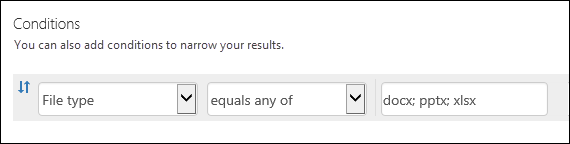

# 콘텐츠 검색에 대한 키워드 쿼리 및 검색 조건

이 항목에서는 Exchange Online 및 SharePoint에 저장 된 문서에서 전자 메일 항목에서 검색할 수 있는 전자 메일 및 문서 속성을 설명 하 고 비즈니스용 Office 365 보안에서 콘텐츠 검색 기능을 사용 하 여 사이트 &amp; 규정 준수 가운데 사용할 수 있습니다는 ** \*-ComplianceSearch** 보안의 cmdlet &amp; 준수 센터 PowerShell 이러한 속성에 대 한 검색 합니다. 항목에 설명 합니다. 
  
- 부울 검색 연산자, 검색 조건 및 기타 검색 쿼리 기법을 사용 하 여 검색 결과 구체화할 수 있습니다.
    
- 중요 한 데이터 형식 및 SharePoint와 비즈니스용 OneDrive의 사용자 지정 중요 한 데이터 형식에 대 한 검색 합니다.
    
- 조직 외부의 사용자와 공유 되는 사이트 콘텐츠에 대 한 검색
    
콘텐츠 검색을 만드는 방법에 대 한 단계별 지침에 대 한 [Office 365에서 콘텐츠 검색](content-search.md)을 참조 하십시오. |

  
> [!NOTE]
> 콘텐츠 보안에서 검색 &amp; 준수 센터 및 해당 ** \*-ComplianceSearch** 보안의 cmdlet &amp; 준수 센터 PowerShell (KQL (키워드 쿼리 언어)을 사용 합니다. 자세한 내용을된 보려면 [키워드 쿼리 언어 구문 참조 (영문)을](https://go.microsoft.com/fwlink/?LinkId=269603)참조 하십시오. 
  
## 검색 가능한 전자 메일 속성

다음 표에서 보안에서 콘텐츠 검색 기능을 사용 하 여 검색할 수 있는 전자 메일 메시지 속성 &amp; 준수 센터 또는 **새로 ComplianceSearch** 또는 **집합 ComplianceSearch** cmdlet을 사용 하 여 합니다. 표에 각 속성에 대 한 설명이 예제에서 반환 된 검색 결과 대 한 _속성: 값_ 구문의 예를 포함 합니다. 이러한 입력할 수 `property:value` 콘텐츠 검색에 대 한 키워드에 지정 된 쌍 상자입니다. 
  
|**속성**|**속성 설명**|**예제**|**예제에서 반환된 검색 결과**|
|:-----|:-----|:-----|:-----|
|AttachmentNames    |전자 메일 메시지에 첨부되는 파일의 이름입니다.    |`attachmentnames:annualreport.ppt`    `attachmentnames:annual\*`    |annualreport.ppt라는 파일이 첨부된 메시지입니다. 두 번째 예제에서는 와일드카드를 사용하여 첨부 파일의 파일 이름에 "annual"이라는 단어가 있는 메시지를 반환합니다.    |
|Bcc    |전자 메일 메시지의 숨은 참조 필드입니다.1   |`bcc:pilarp@contoso.com`    `bcc:pilarp`    `bcc:"Pilar Pinilla"`    |모든 예제는 숨은 참조 필드에 Pilar Pinilla가 포함된 메시지를 반환합니다.    |
|Category    | 검색할 범주입니다. Outlook 또는 Outlook Web App을 사용하여 범주를 정의할 수 있습니다. 가능한 값은 다음과 같습니다.      blue     green     orange     purple     red     yellow    |`category:"Red Category"`    |원본 사서함에서 red 범주가 지정된 메시지입니다.     |
|Cc    |전자 메일 메시지의 참조 필드입니다.1   |`cc:pilarp@contoso.com`    `cc:"Pilar Pinilla"`    |두 예제 모두에서 참조 필드에 Pilar Pinilla가 지정된 메시지입니다.    |
|Folderid    |폴더의 특정 사서함 폴더 ID (GUID)입니다. 이 속성을 사용 하는 경우에 지정된 된 폴더에 있는 사서함을 검색 해야 합니다. 참고 지정한 폴더에만 검색 합니다. 폴더의 모든 하위 폴더를 검색할 수 없습니다. 하위 폴더를 검색 하려면 검색 하려면 하위 폴더에 대 한 폴더 Id 속성을 사용 해야 합니다.  폴더 Id 속성에 대 한 검색 및 특정 사서함에 대 한 폴더 Id를 가져올 스크립트를 사용 하는 방법에 대 한 자세한 내용은 [대상된 컬렉션에 대 한 Office 365에서 사용 하 여 콘텐츠 검색](use-content-search-for-targeted-collections.md)을 참조 하십시오.    |`folderid:4D6DD7F943C29041A65787E30F02AD1F00000000013A0000`    `folderid:2370FB455F82FC44BE31397F47B632A70000000001160000 AND participants:garthf@contoso.com`    |첫번째 예제에서는 지정 된 사서함 폴더에 있는 모든 항목을 반환 합니다. 두번째 예제 보내거나 받은 garthf@contoso.com 하 여 지정 된 사서함 폴더에 모든 항목을 반환 합니다.    |
|From    |전자 메일 메시지의 보낸 사람입니다.1   |`from:pilarp@contoso.com`    `from:contoso.com`    |지정된 사용자가 보냈거나 지정된 도메인에서 보낸 메시지입니다.    |
|HasAttachment    |메시지에 첨부 파일이 있는지 여부를 나타냅니다. 값이 **true** 또는 **false**를 사용 합니다.  |`from:pilar@contoso.com AND hasattachment:true`    |사용자가 보낸 메시지는 지정 된 첨부 파일이 있는 합니다.    |
|Importance    |보낸 사람이 메시지를 보낼 때 지정할 수 있는 전자 메일 메시지의 중요도입니다. 기본적으로 보낸 사람이 중요도를 **높음** 또는 **낮음**으로 설정하지 않았다면 메시지는 보통 중요도로 전송됩니다.  |`importance:high`    `importance:medium`    `importance:low`    |높음 중요도, 보통 중요도 또는 낮은 중요도로 표시된 메시지입니다.    |
|IsRead    |메시지를 읽었는지 여부를 나타냅니다. 값이 **true** 또는 **false**를 사용 합니다.  |`isread:true`    `isread:false`    |**True**로 설정 하는 메시지와 메시지를 반환 하는 첫번째 예제입니다. **False**로 설정 하는 메시지와 메시지를 반환 하는 두번째 예제입니다.  |
|ItemClass    |이 속성을 사용 하 여 조직의 Office 365로 가져온 특정 타사 데이터 형식을 검색 합니다. 이 속성에 대 한 다음 구문을 사용 하십시오.`itemclass:ipm.externaldata.<third-party data type>*`   |`itemclass:ipm.externaldata.Facebook\* AND subject:contoso`    `itemclass:ipm.externaldata.Twitter\* AND from:"Ann Beebe" AND "Northwind Traders"`    |첫번째 예제에서는 Subject 속성에는 단어가 포함 된 Facebook 항목 "contoso"를 반환 합니다. 두번째 예제에서는 Ann Beebe 하 여 게시 된 하 고 "Northwind Traders" 키워드 구를 포함 하는 Twitter 항목을 반환 합니다.  ItemClass 속성에 대 한 타사 데이터 형식에 대해 사용 하 여 값을 전체 목록은 [Office 365로 가져온 타사 데이터 검색을 사용 하 여 콘텐츠 검색](use-content-search-to-search-third-party-data-that-was-imported.md)을 참조 하십시오.    |
|Kind    | 검색에 대 한 전자 메일 메시지의 형식입니다. 가능한 값:     contacts     docs     email     externaldata     faxes     im     journals     meetings     microsoftteams (채팅, 모임 및 통화를 팀이 Microsoft에서 항목을 반환 합니다.)     notes     posts     rssfeeds     작업     Voicemail    |`kind:email`    `kind:email OR kind:im OR kind:voicemail`    `kind:externaldata`    |첫번째 예제에서는 검색 조건을 만족 하는 전자 메일 메시지를 반환 합니다. 두번째 예제에서는 전자 메일 메시지, 인스턴트 메시징 대화 및 검색 조건을 만족 하는 음성 메시지를 반환 합니다. Office 365에서 사서함 검색 조건을 만족 하는 Twitter, Facebook, 및 Cisco Jabber와 같은 타사 데이터 원본에서 가져온 항목을 반환 하는 세번째 예제입니다. 자세한 내용은 [Office 365의 보관 제 3 자 데이터](https://go.microsoft.com/fwlink/p/?linkid=716918)를 참조 하십시오.  |
|Participants    |전자 메일 메시지의 모든 사용자 필드로, 보낸 사람, 받는 사람, 참조 및 숨은 참조가 여기에 해당됩니다.1   |`participants:garthf@contoso.com`    `participants:contoso.com`    |garthf@contoso.com에서 보냈거나 이 사이트로 보낸 메시지입니다. 두 번째 예제에서는 contoso.com 도메인의 사용자가 보냈거나 이 사용자에게로 보낸 모든 메시지를 반환합니다.    |
|Received    |받는 사람이 전자 메일 메시지를 받은 날짜입니다.    |`received:04/15/2016`    `received\>=01/01/2016 AND received\<=03/31/2016`    |2016 년 4 월 15 일에 받은 메시지입니다. 2016 년 1 월 1 일 2016 년 3 월 31 일 사이의 받은 모든 메시지를 반환 하는 두번째 예제입니다.    |
|받는 사람    |전자 메일 메시지의 모든 받는 사람 필드로, 받는 사람, 참조 및 숨은 참조가 여기에 해당됩니다.1   |`recipients:garthf@contoso.com`    `recipients:contoso.com`    |garthf@contoso.com으로 보낸 메시지입니다. 두 번째 예제에서는 contoso.com 도메인에 있는 모든 받는 사람에게 전송된 메시지를 반환합니다.    |
|Sent    |보낸 사람이 전자 메일 메시지를 보낸 날짜입니다.    |`sent:07/01/2016`    `sent\>=06/01/2016 AND sent\<=07/01/2016`    |지정된 날짜 또는 지정된 날짜 범위 내에서 전송된 메시지입니다.    |
|Size    |항목의 크기(바이트)입니다.    |`size\>26214400`    `size:1..1048567`    |25 보다 큰 메시지는?? MB입니다. 두번째 예제 1의 크기가 1,048,567 바이트 (1MB)를 통해 메시지를 반환합니다.    |
|Subject    |전자 메일 메시지 제목 줄의 텍스트입니다.    **참고:** Subject 속성을 사용 하 여 쿼리에서 ???the 검색 제목줄에 대 한 검색 하는 텍스트를 포함 하는 모든 메시지를 반환 합니다. 즉, 쿼리 정확 하 게 일치 하는 메시지에만 반환 하지 않습니다. 예:에 대 한 검색 하는 경우 `subject:"Quarterly Financials"`, 결과 제목이 "분기별 Financials 2018" 메시지에 포함 됩니다.  |`subject:"Quarterly Financials"`    `subject:northwind`    |제목 줄의 텍스트에 "Quarterly Financials" 이라는 구가 포함 된 메시지입니다. 두번째 예제에서는 word northwind 제목줄에 포함 된 모든 메시지를 반환 합니다.    |
|To    |전자 메일 메시지의 받는 사람 필드입니다.1   |`to:annb@contoso.com`    `to:annb `   `to:"Ann Beebe"`    |모든 예제에서 받는 사람: 줄에 Ann Beebe가 지정된 메시지를 반환합니다.    |
   
> [!NOTE]
> 1 받는 사람 속성 값에 대 한 있습니다 수 (도 호출된 된 *사용자 계정 이름* 또는 UPN) 전자 메일 주소를 사용 하 여, 표시 이름 또는 사용자 지정에 대 한 별칭입니다. 예, Ann Beebe 사용자 지정 하려면 annb@contoso.com, annb, 또는 "Ann Beebe"를 사용할 수 있습니다.  모든 검색 하는 경우 받는 사람 속성 (에서 받는 사람, 참조, 숨은 참조, 참가자 및 받는 사람), Office 365를 검토 하 여 각 사용자의 id를 확장 하려고 Azure Active Directory를 지정할 합니다.  사용자가 있으면 Azure Active Directory에서 사용자의 전자 메일 주소 (또는 포함 UPN), 별칭, 표시 이름 및 LegacyExchangeDN을 쿼리 확장 됩니다.  예:와 같은 쿼리 `participants:ronnie@contoso.com` 확장 하 여 `participants:ronnie@contoso.com OR participants:ronnie OR participants:"Ronald Nelson" OR participants:"<LegacyExchangeDN>"`합니다.

## 검색 가능한 사이트 속성

다음 표에 일부 SharePoint와 OneDrive 보안에서 콘텐츠 검색 기능을 사용 하 여 검색할 수 있는 비즈니스 속성에 대 한 &amp; 준수 센터 또는 **새로 ComplianceSearch** 또는 **를 사용 하 여 집합 ComplianceSearch** cmdlet입니다. 표에 각 속성에 대 한 설명이 예제에서 반환 된 검색 결과 대 한 _속성: 값_ 구문의 예를 포함 합니다. 
  
검색할 수 있는 전체 목록은 SharePoint 속성에 대 한 [크롤링 속성 및 관리 SharePoint에서 속성의 개요를](https://go.microsoft.com/fwlink/p/?LinkId=331599)참조 하십시오. **Yes** **쿼리 가능** 열에 표시 되는 속성을 검색할 수 있습니다. 
  
|**속성**|**속성 설명**|**예제**|**예제에서 반환된 검색 결과**|
|:-----|:-----|:-----|:-----|
|만든 이    |다음은 문서를 복사 하는 경우을 유지 하는 Office 문서에서 작성자 필드입니다. 등 사용자가 문서 및 전자 메일을 만들 경우 다음 SharePoint, 문서를 업로드 하 게 다른 사람에 게 계속 유지 됩니다 원래 만든이입니다. 이 속성에 대 한 사용자의 표시 이름을 사용 해야 합니다.    |`author:"Garth Fort"`    |Garth Fort가 만든 모든 문서입니다.    |
|ContentType    |항목, 항목, 문서, 비디오 등의 SharePoint 콘텐츠 형식입니다.    |`contenttype:document`    |모든 문서가 반환됩니다.    |
|Created    |항목을 만든 날짜입니다.    |`created\>=06/01/2016`    |모든 항목을 2016 년 6 월 1 일 이후인를 만들었습니다.    |
|CreatedBy    |만들거나 항목을 업로드 하는 사람입니다. 이 속성에 대 한 사용자의 표시 이름을 사용 해야 합니다.    |`createdby:"Garth Fort"`    |Garth Fort가 만들었거나 업로드한 모든 항목입니다.    |
|DetectedLanguage    |항목의 언어입니다.    |`detectedlanguage:english`    |영어로된 모든 항목입니다.    |
|FileExtension    |파일의 확장명 예, docx, 1, pptx, 또는 xlsx 합니다.    |`fileextension:xlsx`    |모든 Excel 파일 (Excel 2007 이상)    |
|FileName    |파일의 이름입니다.    |`filename:"marketing plan"`    `filename:estimate`    |첫 번째 예제에서는 제목에 "marketing plan"이 정확히 포함된 제목을 반환합니다. 두 번째 예제에서는 파일 이름에 "estimate"라는 단어가 들어 있는 파일을 반환합니다.    |
|마지막 수정한 시간    |항목을 마지막으로 변경한 날짜입니다.    |`lastmodifiedtime\>=05/01/2016`    `lastmodifiedtime\>=05/10/2016 AND lastmodifiedtime\<=06/1/2016`    |첫번째 예제에서는 2016 년 5 월 1 일 이후인 변경 된 항목을 반환 합니다. 두번째 예제 2016 년 5 월 1 일 및 2016 년 6 월 1 일 사이 변경 하는 항목을 반환 합니다.    |
|ModifiedBy    |항목을 마지막으로 변경한 사람입니다. 이 속성에 대 한 사용자의 표시 이름을 사용 해야 합니다.    |`modifiedby:"Garth Fort"`    |Garth Fort가 마지막으로 변경한 모든 항목입니다.    |
|경로    |비즈니스 사이트에 대 한 SharePoint 또는 OneDrive에 특정 폴더의 경로 (URL)입니다. 이 속성을 사용 하는 경우에 지정된 된 폴더에 있는 사이트를 검색 해야 합니다.  Path 속성에 대 한 지정 된 폴더에 하위 폴더에 있는 항목을 반환 하려면 추가 해야할 /\* ; 지정된 된 폴더의 url 예, `path: https://contoso.sharepoint.com/Shared Documents/*`합니다.      **참고:** 사용 하 여 `Path` 속성 OneDrive 위치를 검색 하려면 검색 결과에서.png,.tiff, 또는.wav 파일을 등의 미디어 파일을 반환 하지 않습니다. OneDrive 폴더의 미디어 파일을 검색 하려면 검색 쿼리에 다른 사이트 속성을 사용 합니다.    Path 속성에 대 한 검색 및 특정 사이트에 있는 폴더에 대 한 경로 Url 토 스크립트를 사용 하는 방법에 대 한 자세한 내용은 [대상된 컬렉션에 대 한 Office 365에서 사용 하 여 콘텐츠 검색](use-content-search-for-targeted-collections.md)을 참조 하십시오.    |`path:https://contoso-my.sharepoint.com/personal/garthf_contoso_com/Documents/Private`    `path:"https://contoso-my.sharepoint.com/personal/garthf_contoso_com/Documents/Shared with Everyone/\*" AND filename:confidential`    |첫번째 예제에서는 비즈니스 폴더에 대 한 지정한 OneDrive에서 모든 항목을 반환 합니다. 두번째 예제에서는 지정 된 사이트 폴더 (및 모든 하위 폴더)에서 파일 이름에 "confidential" 라는 단어를 포함 하는 문서를 반환 합니다.    |
|SharedWithUsersOWSUser    |지정된 된 사용자와 공유 및 비즈니스 사이트에 대 한 사용자의 OneDrive에서 **공유 나에 게 대상** 페이지에 표시 된 문서입니다. 이 명시적으로 사용자와 공유 된 지정된 된 사용자는 다른 사람이 조직에 있는 문서입니다. SharedWithUsersOWSUser 속성을 사용 하는 검색 쿼리와 일치 하는 문서를 내보낼 때 문서에서 지정 된 사용자는 문서를 공유 하는 사람의 원래 콘텐츠 위치에서 내보냅니다. 자세한 내용은 [사이트 콘텐츠를 검색 하면 조직 내에서 공유](keyword-queries-and-search-conditions.md#internal)를 참조 하십시오.  |`sharedwithusersowsuser:garthf`    `sharedwithusersowsuser:"garthf@contoso.com"`    |Garth Fort 사용자와 명시적으로 공유 된 하 고 Garth Fort에서 **공유 나에 게 대상** 페이지에 표시 하는 모든 내부 문서를 반환 하는 두 예제 비즈니스 계정에 대 한 OneDrive 합니다.    |
|Site    |조직의 사이트 또는 사이트 그룹의 URL입니다.    |`site:https://contoso-my.sharepoint.com`    `site:https://contoso.sharepoint.com/sites/teams`    |첫번째 예제에서는 조직에서 모든 사용자에 대 한 비즈니스 사이트에 대 한 OneDrive에서 항목을 반환합니다. 두번째 예제에서는 모든 팀 사이트에서 항목을 반환합니다.    |
|Size    |항목의 크기(바이트)입니다.    |`size\>=1`    `size:1..10000`    |첫 번째 예제에서는 1바이트 보다 큰 항목을 반환합니다. 두 번째 예제에서는 1부터 10,000바이트 크기의 항목을 반환합니다.    |
|Title    |다음은 문서의 제목입니다. Title 속성은 Microsoft Office 문서에 지정 된 메타 데이터입니다. 다음은 문서의 파일 이름에서 차이가 있습니다.    |`title:"communication plan"`    |Office 문서의 Title 메타데이터 속성에 "communication plan"이 포함된 문서입니다.    |
   
## 검색 가능한 연락처 속성

다음 표에 인덱싱되는 연락처 속성 및 콘텐츠 검색을 사용 하 여 검색할 수 있습니다. 다음은 사용자가 사용자의 사서함의 개인 주소록에 있는 연락처 (개인 연락처 라고도 함)에 대 한 구성 하는데 사용할 수 있는 속성입니다. 대화 상대를 검색 하려면 검색 하 고 다음 하나 이상의 연락처 속성을 사용 하 여 키워드 쿼리에서 사서함을 선택할 수 있습니다.
  
> [!TIP]
> 공백을 포함 하는 값을 검색 하려면 큰따옴표 ("??"); 이라는 구가 포함을 사용 하 여 예, `businessaddress:"123 Main Street"`합니다. 
  
|**속성**|**속성 설명**|
|:-----|:-----|
|BusinessAddress    |**근무처 주소** 속성의 주소입니다. 연락처 속성 페이지에서 속성은 **작업** 주소를 라고도 합니다.  |
|BusinessPhone    |**근무처 전화** 중 하나에 전화 번호 번호 매기기 속성입니다.    |
|회사 이름    |**회사** 속성의 이름입니다.    |
|부서    |**부서** 속성의 이름입니다.    |
|DisplayName    |연락처의 표시 이름입니다. 연락처의 **전체 이름** 속성의 이름입니다.  |
|EmailAddress    |대화 상대에 대 한 모든 전자 메일 주소 속성에 대 한 주소입니다. 참고 사용자가 대화 상대에 대 한 여러 전자 메일 주소를 추가할 수 있습니다. 이 속성을 사용 하 여 대화 상대의 전자 메일 주소 중 하 나와 일치 하는 연락처를 반환 합니다.    |
|FileAs    |**파일을로** 속성입니다. 이 속성은 사용자의 대화 상대 목록에는 연락처가 나열 하는 방법을 지정 하는데 사용 됩니다. 예, 대화 상대 *FirstName, LastName* 또는 *LastName, FirstName로* 나열 될 수 있습니다.  |
|GivenName    |**이름** 속성의 이름입니다.    |
|HomeAddress    |**집** 주소 속성 중 하나에서 주소입니다.    |
|HomePhone    |**홈** 전화 중 하나에 전화 번호 번호 매기기 속성입니다.    |
|IMAddress    |IM 주소 속성은 일반적으로 인스턴트 메시징에 사용 되는 전자 메일 주소입니다.    |
|MiddleName    |**중간** 이름 속성의 이름입니다.    |
|MobilePhone    |**휴대폰에서** 전화 번호 번호 매기기 속성입니다.    |
|Nickname    |**애칭** 속성의 이름입니다.    |
|사무실 위치    |**사무실** 또는 **사무실 위치** 속성의 값입니다.    |
|OtherAddress    |**기타** 주소 속성에 대 한 값입니다.    |
|Surname    |**마지막** name 속성의 이름입니다.    |
|제목    |**직함** 속성의 제목입니다.    |
   

## 검색 가능한 중요한 데이터 형식

보안에서 콘텐츠 검색 기능을 사용할 수 &amp; 준수 센터 신용 카드 번호 또는 비즈니스 사이트에 대 한 SharePoint OneDrive에 있는 문서에 저장 된 주민등록 번호와 같은 중요 한 데이터를 검색할 수 있습니다. 사용 하 여 수행할 수 있는 작업은 `SensitiveType` 키워드 쿼리에 속성 및 중요 한 정보를의 이름을 입력 합니다. 예: 쿼리 `SensitiveType:"Credit Card Number"` 신용 카드 번호를 포함 하는 문서를 반환 합니다. 쿼리 `SensitiveType:"U.S. Social Security Number (SSN)"` 는 미국 사회보장 번호를 포함 하는 문서를 반환 합니다. 검색할 수 있는 중요 한 데이터 형식의 목록을 보려면, **분류** 로 이동 \> 보안에서 **중요 한 정보 유형** &amp; 준수 센터입니다. **Get DlpSensitiveInformationType** cmdlet을 사용 하 여 보안에서 수 또는 &amp; 준수 센터 PowerShell 중요 한 정보 유형의 목록을 표시 합니다. 
  
사용할 수 있습니다는 `SensitiveType` 속성을 만든 사용자 (또는 다른 관리자) 조직에 대 한 중요 한 정보를 사용자 지정 형식의 이름에 대 한 검색 합니다. 참고 보안에서 **중요 한 정보 유형** 페이지에서 **Publisher** 열을 사용할 수 있는 &amp; 자체는 기본 제공 및 사용자 지정을 구분 하기 위해 준수 센터 (또는 PowerShell에서 **Publisher** 속성) 정보 유형입니다. 자세한 내용은 [사용자 지정 중요 한 정보 유형 만들기](create-a-custom-sensitive-information-type.md)를 참조 하십시오.
  
사용 하 여 쿼리를 작성 하는 방법에 대 한 자세한 내용은 `SensitiveType` 속성을 [양식 사이트에 저장 된 중요 한 데이터를 찾는 쿼리를](form-a-query-to-find-sensitive-data-stored-on-sites.md)참조 하십시오.
  
## 검색 연산자

예: **AND**, **OR**및 **하지**, 부울 검색 연산자를 포함 하거나 검색 쿼리에 특정 단어를 제외 하 여 더 정확한 검색을 정의 하는데 도움이 됩니다. 속성 연산자를 사용 하 여 등의 기타 기술을 (같은 \>= 또는..), 따옴표, 괄호 및 와일드 카드를 사용 하는 데 도움이 검색 쿼리를 구체화 합니다. 다음 표에서 범위를 좁힐 또는 검색 결과 확장 하는데 사용할 수 있는 연산자를 보여줍니다. 
  
|**연산자**|**Usage**|**설명**|
|:-----|:-----|:-----|
|AND    |keyword1 AND keyword2    |지정 된 키워드를 포함 하는 항목을 반환 하거나 `property:value` 식입니다. 예, `from:"Ann Beebe" AND subject:northwind` Ann Beebe의 제목줄에 word northwind를 포함 하 여 보낸 모든 메시지를 반환 합니다. 2   |
|+    |keyword1?? + keyword2?? + keyword3    |*중 하나* 를 포함 하는 항목을 반환`keyword2` 또는 `keyword3` *하 고* 도 포함 된 `keyword1`합니다. 따라서이 예제는 쿼리 `(keyword2 OR keyword3) AND keyword1`합니다.    사항에 유의 쿼리 `keyword1 + keyword2` (후 공백을 사용 하 여는 **+** 기호)를 사용 하 여와 같지 않습니다는 * * AND * * 연산자입니다. 이 쿼리는 해당 것 `"keyword1 + keyword2"` 정확한 단계를 사용 하는 항목을 반환 하 고 `"keyword1 + keyword2"`합니다.  |
|OR    |keyword1 OR keyword2    |지정된 된 키워드 중 하나 이상을 포함 하는 항목을 반환 하거나 `property:value` 식입니다. 2   |
|NOT    |keyword1 NOT keyword2    NOT from:"Ann Beebe"    종류: im 하지    |키워드에 지정 된 항목을 제외 또는 `property:value` 식입니다. 두번째 예제 Ann Beebe가 보낸 메시지를 제외 합니다. 예제 3의 대화 내용 사서함 폴더에 저장 된 비즈니스 대화에 대 한 Skype와 같은 모든 인스턴트 메시징 대화를 제외 합니다. 2   |
|-    |keyword1 -keyword2    |동일 **NOT** 연산자입니다. 이 쿼리를 포함 하는 항목을 반환 하도록 `keyword1` 포함 된 항목에서 제외 되 게 하 고 `keyword2`합니다.  |
|NEAR    |keyword1 NEAR(n) keyword2    |여기서 n은 구분 단어의 개수를 서로 가까이 있는 단어를 사용 하는 항목을 반환 합니다. 예, `best NEAR(5) worst` "최고"의 다섯 개의 단어 내에 단어 "최하위 값"이 있는 모든 항목을 반환 합니다. 없는 번호를 지정 하는 경우 기본 간격은 8 개의 단어입니다. 2   |
|ONEAR    |keyword1 ONEAR(n) keyword2    |**근처**, 하지만 반환 하며 읽기 전용 항목에 지정 된 순서 대로 서로 가까이 있는 단어와 비슷합니다. 예, `best ONEAR(5) worst` 여기에서 "최고" 라는 단어 "최악의" 라는 단어 앞 발생 하 고 다른 사용자의 5 개의 단어 내 단어 두 곳에 있는 모든 항목을 반환 합니다. 없는 번호를 지정 하는 경우 기본 간격은 8 개의 단어입니다. 2   > [!NOTE]> **ONEAR** 연산자; 사서함을 검색 하는 경우 지원 되지 않습니다. 비즈니스 사이트에 대 한 SharePoint와 OneDrive를 검색 하는 경우에 작동 합니다. 동일한 검색에서 사서함 및 사이트를 검색 하는 쿼리 **ONEAR** 연산자가 포함 하는 경우에 검색 **NEAR** 연산자를 사용 하 던 하는 경우에 따라 사서함 항목에 반환 됩니다. 즉, 검색에는 지정 된 단어가 서로 가까이 단어 발생 하는 순서에 관계 없이 항목을 반환 합니다.           |
|:    |property:value    |에 콜론 (:)는 `property:value` 구문에 대 한 검색 중인 속성의 값 지정된 된 값을 포함 되도록 지정 합니다. 예, `recipients:garthf@contoso.com` garthf@contoso.com가 보낸 모든 메시지를 반환 합니다.  |
|=    |property=value    |동일 **:** 연산자입니다.    |
|\<    |속성\<값    |검색 중인 속성이 지정된 값보다 작음을 나타냅니다. 1   |
|\>    |속성\>값    |검색 중인 속성이 지정된 값보다 큼을 나타냅니다.1   |
|\<=    |속성\<= 값    |검색 중인 속성이 특정 값보다 작거나 같음을 나타냅니다.1   |
|\>=    |속성\>= 값    |검색 중인 속성을 특정 값보다 크거나 같음을 나타냅니다.1   |
|..    |속성: value1. value2    |검색 중인 속성을 value1보다 크거나 같고 value2보다 작거나 같음을 나타냅니다.1   |
|"  "    |"fair value"    subject:"Quarterly Financials"    |큰따옴표를 사용 하 여 ("")는 구가 정확 하 게 또는 키워드의 용어를 검색 하 고 `property:value` 검색 쿼리 합니다.    |
|\*    |고양이\*    제목: 설정\*    |키워드에 0 개 이상의 문자에 대 한 접두사 와일드 카드 검색 (별표 배치 되는 위치는 단어의 끝에)과 일치 하거나 `property:value` 쿼리 합니다. 예, `title:set*` 문서 제목에 있는 단어 집합, 설정 및 설정 (및 "설정"로 시작 하는 다른 단어)을 포함 하는 문서를 반환 합니다.   **참고:** 접두사 와일드 카드 검색만;를 사용할 수 있습니다. 예, **고양이\* ** 또는 **설정\*** 합니다. 검색 접미사 ( ** \*고양이** ), 검색 중 위 ( **c\*t** ), 검색 하위 문자열 및 ( ** \*고양이\* ** )는 지원 되지 않습니다.           |
|(  )    | (fair OR free) AND (from:contoso.com)     (IPO OR initial) AND (stock OR shares)     (quarterly financials)    |괄호를 함께 그룹화 부울 구 `property:value` 항목 및 키워드입니다. 예, `(quarterly financials)` 하 고 financials 분기별 단어를 포함 하는 항목을 반환 합니다.  |
   
> [!NOTE]
> 1??????Use 날짜 또는 숫자 값이 있는 속성에 대 한이 연산자입니다. > 2??????Boolean 검색 연산자는 대문자; 여야 합니다. 예, **AND**합니다. 예: **하 고**, 소문자 연산자를 사용 하는 경우 검색 쿼리에 키워드도 처리 됩니다. 
  
## 검색 조건

검색 범위를 좁힐 보다 정교한 결과 집합이 반환 하는 검색 쿼리를 조건을 추가할 수 있습니다. KQL 검색 쿼리를 만들고 실행 하 여 검색을 시작 하는 경우에 절을 추가 하는 각 조건입니다.
  
[공용 속성에 대한 조건 ](#conditions-for-common-properties)

[메일 속성에 대한 조건](#conditions-for-mail-properties)

[문서 속성에 대한 조건](#conditions-for-document-properties)

[조건과 함께 사용되는 연산자](#operators-used-with-conditions)

[조건 사용에 대한 지침](#guidelines-for-using-conditions)

[예제](#examples-of-using-conditions-in-search-queries)
  
### 공용 속성에 대한 조건 

동일한 검색에서 사서함 및 사이트를 검색 하는 경우 일반 속성을 사용 하는 조건을 만듭니다. 다음 표에서 조건을 추가 하는 경우를 사용 하 여 사용할 수 있는 속성을 나열 합니다.
  
|**조건**|**설명**|
|:-----|:-----|
|날짜    |전자 메일에 대 한 메시지가 날짜는 받는 사람이 받거나 보낸 사람이 보낸 합니다. 문서, 문서를 마지막으로 수정한 날짜입니다.    |
|Sender/Author    |전자 메일 메시지를 보낸 사람의 합니다. 문서, Office 문서에서 만든이 필드에 인용 된 사람입니다. 쉼표로 구분 하 여 둘 이상의 이름을 입력할 수 있습니다. 둘 이상의 값 **또는** 연산자에서 논리적으로 연결 됩니다.  |
|크기 (바이트)    |전자 메일 및 문서의 경우 항목의 크기(바이트)입니다.    |
|Subject/Title    |전자 메일 메시지의 제목줄 텍스트입니다. 문서, 문서의 제목입니다. 앞에서 설명한 것 처럼 제목 속성이 Microsoft Office 문서에 지정 된 메타 데이터입니다. 둘 이상의/제목, 쉼표로 구분 하 여의 이름을 입력할 수 있습니다. 둘 이상의 값 **또는** 연산자에서 논리적으로 연결 됩니다.  |
|준수 태그    |전자 메일 및 문서 모두에 할당 된 메시지와 문서를 자동으로 레이블 정책에 의해 또는 레이블을 지정 하는 레이블은 수동으로 할당 된 사용자가 합니다. 레이블은은 레이블으로 정의 된 분류에 따라 보존 규칙을 적용 하 고 전자 메일 및 데이터 관리 방식에 대 한 문서를 분류에 사용 됩니다. 레이블 이름의 일부를 입력 하 고 와일드 카드를 사용 하 여 하거나 전체 레이블 이름을 입력할 수 있습니다. 자세한 내용은 [Office 365의 레이블 개요](labels.md)를 참고 하십시오.  |
  
### 메일 속성에 대한 조건

사서함 또는 공용 폴더를 검색할 때 메일 속성을 사용하여 조건을 만듭니다. 다음 표에서 조건을 사용할 수 있는 전자 메일 속성을 나열 합니다. 이러한 속성은 이전에 제공한 전자 메일 속성에 대한 설명과 일부 중복되며 편의를 위해 반복해서 제공됩니다.
  
|**조건**|**설명**|
|:-----|:-----|
|메시지 종류    | 검색할 메시지 형식입니다. Kind 전자 메일 속성과 동일한 속성입니다. 가능한 값:      contacts     docs     email     externaldata     faxes     im     journals     meetings     microsoftteams     notes     posts     rssfeeds     작업     Voicemail    |
|Participants    |전자 메일 메시지의 모든 사용자 필드로, 보낸 사람, 받는 사람, 참조 및 숨은 참조가 여기에 해당됩니다.    |
|유    |전자 메일 항목에 대 한 메시지 클래스 속성입니다. ItemClass 전자 메일 속성과 동일한 속성입니다. 여러 값 조건 이기도합니다. 여러 메시지 클래스를 선택 하 고 **CTRL** 키를 누른 다음 조건에 추가 하려면 드롭다운 목록에 두 명 이상의 메시지 클래스를 클릭를 못하도록 합니다. 목록에서 선택 하는 각 메시지 클래스에 해당 하는 검색 쿼리 **또는** 연산자가 논리적으로 연결 됩니다.  **메시지 클래스** 목록에서 선택할 수 있고 Exchange에서 사용 되는 메시지 클래스 (및 해당 메시지 클래스 ID)의 목록 [항목 형식 및 메시지 클래스를](https://go.microsoft.com/fwlink/?linkid=848143)참조 하십시오.    |
|Received    |받는 사람이 전자 메일 메시지를 받은 날짜입니다. Received 전자 메일 속성과 같은 속성입니다.    |
|받는 사람    |전자 메일 메시지를 사용자에 게 보냈습니다. 받는 전자 메일 속성과 동일한 속성입니다.    |
|Sender    |전자 메일 메시지의 보낸 사람입니다.    |
|Sent    |전자 메일 메시지를 보낸 사람이 보낸 날짜입니다. 보낸 전자 메일 속성과 동일한 속성입니다.    |
|Subject    |전자 메일 메시지 제목 줄의 텍스트입니다.    |
|To    |전자 메일 메시지의 받는 사람입니다.    |
  
### 문서 속성에 대한 조건

비즈니스 사이트에 대 한 SharePoint OneDrive에 있는 문서를 검색할 때 문서 속성을 사용 하는 조건을 만듭니다. 다음 표에서 특정 조건에 사용할 수 있는 문서 속성을 나열 합니다. 이러한 속성은 이전에 설명 된; 사이트 속성의 하위 집합을 note 이 설명은 사용자 편의 위해 반복 됩니다.
  
|**조건**|**설명**|
|:-----|:-----|
|만든 이    |다음은 문서를 복사 하는 경우을 유지 하는 Office 문서에서 작성자 필드입니다. 등 사용자가 문서 및 전자 메일을 만들 경우 다음 SharePoint, 문서를 업로드 하 게 다른 사람에 게 계속 유지 됩니다 원래 만든이입니다.    |
|제목    |다음은 문서의 제목입니다. Title 속성은 Office 문서에 지정 된 메타 데이터입니다. 다음은 문서의 파일 이름 보다 차이가 있습니다.    |
|Created    |문서를 만든 날짜입니다.    |
|마지막으로 수정한 날짜    |문서를 마지막으로 변경한 날짜입니다.    |
|파일 형식    |파일의 확장명 예, docx, 1, pptx, 또는 xlsx 합니다. (: Fileextension) 사이트 속성과 동일한 속성입니다.    |
  
### 조건과 함께 사용되는 연산자

조건을 추가할 때 조건에 대한 속성 유형과 관련된 연산자를 선택할 수 있습니다. 다음 표에서는 조건과 함께 사용되는 연산자를 설명하고 검색 쿼리에 사용되는 것과 동일한 연산자를 제공합니다.
  
|**연산자**|**연산자와 동일한 쿼리**|**설명**|
|:-----|:-----|:-----|
|After    |`property\>date`    |날짜 조건과 함께 사용됩니다. 지정된 날짜 이후에 전송, 수신 또는 수정된 항목을 반환합니다.     |
|Before    |`property\<date`    |날짜 조건과 함께 사용됩니다. 지정된 날짜 이전에 전송, 수신 또는 수정된 항목을 반환합니다.    |
|Between    |`date..date`    |날짜 및 크기 조건을 사용 하 여 사용 합니다. 날짜 조건에서 사용 되는 경우 다음과 같은 항목 반환 된 전송를 받은 또는 지정된 된 날짜 범위 내에 수정 된 합니다. 크기 조건에서 사용 되는 경우 크기가 지정된 된 범위 내에서 해당 항목을 반환 합니다.    |
|Contains any of    |`(property:value) OR (property:value)`    |String 값을 지정 하는 속성에 대 한 조건을 사용 하 여 사용 합니다. 하나 이상의 지정 된 문자열 값의 어떤 부분을 포함 하는 항목을 반환 합니다.    |
|Doesn't contain any of    |`-property:value`    `NOT property:value`    |문자열 값을 지정하는 속성에 대한 조건과 함께 사용됩니다. 지정된 문자열 값의 어떤 부분도 포함하지 않는 항목을 반환합니다.    |
|Doesn't equal any of
    |`-property=value`    `NOT property=value`    |문자열 값을 지정하는 속성에 대한 조건과 함께 사용됩니다. 특정 문자열을 포함하지 않는 항목을 반환합니다.    |
|Equals    |`size=value`    |지정된 크기의 항목을 반환합니다.1   |
|Equals any of    |`(property=value) OR (property=value)`    |문자열 값을 지정하는 속성에 대한 조건과 함께 사용됩니다. 하나 이상의 지정된 문자열 값과 정확히 일치하는 항목을 반환합니다.    |
|Greater    |`size>value`    |지정된 속성이 지정한 값보다 큰 항목을 반환합니다.1   |
|Greater or equal    |`size>=value`    |지정된 속성이 지정한 값보다 크거나 같은 항목을 반환합니다.1   |
|Less    |`size<value`    |특정 값보다 크거나 같은 항목을 반환합니다.1   |
|Less or equal    |`size<=value`    |특정 값보다 크거나 같은 항목을 반환합니다.1   |
|Not equal    |`size<>value`    | 지정된 크기와 다른 항목을 반환합니다.1   |
   
> [!NOTE]
> 1 이 연산자는 Size 속성을 사용 하는 조건에만 사용할 수 있습니다. 
  
### 조건 사용에 대한 지침

검색 조건을 사용할 때 다음에 유의하세요.
  
- 조건 **및** 연산자에 의해 (키워드 상자에 지정 된) 키워드 쿼리를 논리적으로 연결 됩니다. 항목 키워드 쿼리 및 결과에 포함 되어야 하는 조건을 모두 충족 해야 함을 의미 합니다. 결과 범위를 좁히려면 조건 도움이 되는 방식입니다. 
    
- 검색 쿼리 (서로 다른 속성을 지정 하는 조건)에 둘 이상의 고유한 조건을 추가 하는 경우 이러한 조건은 **AND** 연산자에서 논리적으로 연결 됩니다. 즉, (키워드 쿼리) 외에도 모든 조건에 맞는 항목만 반환 됩니다. 
    
- 동일한 속성에 대 한 개 이상의 조건을 추가 하는 경우 이러한 조건 **또는** 연산자에서 논리적으로 연결 됩니다. 즉, 키워드 쿼리 및 조건 중 하나를 만족 하는 항목이 반환 됩니다. 그렇다면 같은 조건 중 그룹 **또는** 운영자가 서로 게 연결 되어 있고 하 고 고유한 조건 집합 **및** 연산자에 의해 연결 된 다음 합니다. 
    
- 단일 조건에 여러 값 (쉼표 또는 세미콜론으로 구분)를 추가 하는 경우 해당 값 **또는** 연산자로 연결 됩니다. 즉, 조건에는 속성에 지정 된 값 중 하나를 포함 하는 경우 항목이 반환 됩니다. 
    
- 키워드 상자와 조건을 사용 하 여 만든 검색 쿼리는 선택한 검색에 대 한 세부 정보 창에서 **검색** 페이지에 표시 됩니다. 쿼리를 표기법의 오른쪽에 있는 모든 항목에서 `(c:c)` 쿼리에 추가 되는 조건을 나타냅니다. 
    
- 조건에서 검색 쿼리;에 속성을만 추가 연산자를 추가 하지 마십시오. 이 때문에 세부 정보 창에 표시 되는 쿼리 연산자의 오른쪽에 표시 되지 않으면는 `(c:c)` 표기 합니다. KQL (앞에서 설명한 것된 규칙)에 따라 논리 연산자를 때 추가 쿼리를 실행 합니다. 
    
- 끌어서를 사용할 수 있으며 조건 순서 다시 차례 대로 나열 하는 컨트롤을 놓습니다. 조건에 대 한 컨트롤을 클릭 하 고 위로 또는 아래로 이동 합니다.
    
- 앞에서 설명한 것 처럼 일부 조건 속성을 사용 여러 값을 입력할 수 있습니다. 각 값 **또는** 연산자에서 논리적으로 연결 됩니다. 이 단일 값을 각각 동일한 조건의 여러 인스턴스에 있는 것으로 동일한 논리에서 만들어집니다. 다음 그림은 값이 여러 개인 단일 조건의 예제와 단일 값을 가진 (동일한 속성)에 대 한 여러 조건에의 한 예를 보여줍니다. 두 예제 모두 동일한 쿼리에서 결과:`(filetype="docx") OR (filetype="pptx") OR (filetype="xlsx")`
    
    
  
    
  
> [!TIP]
> 조건이 여러 값을 허용하는 경우 단일 조건을 사용하고 여러 값(쉼표나 세미콜론으로 구분)을 지정하는 것이 좋습니다. 이렇게 하면 적용되는 쿼리 논리가 사용자의 의도와 맞는지 확인하는 데 도움이 됩니다. 
  
### 예제

다음 예제에서는 표시 조건, (반환 하는 또한 **Get ComplianceSearch** cmdlet에 의해)는 선택한 검색, 세부 정보 창에 표시 되는 검색 쿼리 구문 사용 하 여 검색 쿼리 GUI 기반 버전 및의 논리는 해당 KQL 쿼리 합니다. 
  
#### 예 1

신용 카드 번호를 포함 하 고 2016 년 1 월 1 일 전에 마지막으로 수정한 하는 비즈니스 사이트에 대 한 SharePoint와 OneDrive에서 문서를 반환 하는이 예제입니다.
  
 **GUI**
  

  
 **검색 쿼리 구문**
  
 `SensitiveType:"Credit Card Number(c:c)(lastmodifiedtime<2016-01-01)`
  
 **검색 쿼리 논리**
  
 `SensitiveType:"Credit Card Number" AND (lastmodifiedtime<2016-01-01)`
  
#### 예제 2

이 예제에서는 키워드 "report"를 포함하고, 2015년 4월 1일 이전에 전송되었거나 생성되었고, 전자 메일 메시지의 제목 필드나 문서의 제목 속성에 단어 "northwind"가 포함된 전자 메일 항목 또는 문서를 반환합니다. 이 쿼리는 다른 검색 조건에 맞는 웹 페이지를 제외합니다. 
  
 **GUI**
  

  
 **검색 쿼리 구문**
  
 `report???(c:c)??????(date<2016-04-01)??????(subjecttitle:"northwind")??????(-filetype="aspx")???`
  
 **검색 쿼리 논리**
  
 `report AND (date<2016-04-01) AND (subjecttitle:"northwind") NOT (filetype="aspx")`
  
#### 예 3

전자 메일 메시지 또는 12/1/2016 및 11/30/2016 간에 보낸 하 고 "전화" 또는 "smartphone"로 시작 하는 단어를 포함 하는 일정 모임 반환 하는이 예제입니다.
  
 **GUI**
  

  
 **검색 쿼리 구문**
  
 `phone* OR smartphone*(c:c)(sent=2016-12-01..2016-11-30)(kind="email")(kind="meetings")`
  
 **검색 쿼리 논리**
  
 `phone* OR smartphone* AND (sent=2016-12-01..2016-11-30) AND ((kind="email") OR (kind="meetings"))`
  
## 외부 사용자와 공유되는 사이트 콘텐츠 검색

보안에서 콘텐츠 검색 기능을 사용할 수도 있습니다 &amp; 준수 센터 조직 외부의 사용자와 공유 되는 비즈니스 사이트에 대 한 SharePoint와 OneDrive에 저장 된 문서를 검색할 수 있습니다. 이 조직 외부에 공유 되는 중요 한 내용 또는 독점 정보를 확인할 수 있습니다. 사용 하 여 수행할 수 있는 작업은 `ViewableByExternalUsers` 키워드 쿼리에 속성입니다. 이 속성은 문서 또는 사이트는 다음 공유 방법 중 하나를 사용 하 여 외부 사용자와 공유 된 반환 됩니다. 
  
- 인증 된 사용자 조직에 로그인 하려면 사용자가 필요로 하는 공유 초대 합니다.
    
- 익명 게스트 링크를이 링크를 인증 하지 않고도 리소스에 액세스할 수 있는 모든 사용자 수 있도록 해줍니다.
    
아래에 몇 가지 예가 나와 있습니다.
  
- 쿼리 `ViewableByExternalUsers:true AND SensitiveType:"Credit Card Number"` 조직 외부의 사용자와 공유 된 및 신용 카드 번호를 포함 하는 모든 항목을 반환 합니다. 
    
- 쿼리 `ViewableByExternalUsers:true AND ContentType:document AND Site:https://contoso.sharepoint.com/Sites/Teams` 조직에서 외부 사용자와 공유 되는 모든 팀 사이트에서 문서 목록이 반환 됩니다. 
    
> [!TIP]
> 와 같은 검색 쿼리를 `ViewableByExternalUsers:true AND ContentType:document` 검색 결과에서.aspx 파일의 위치를 반환할 수 있습니다. 이러한 (또는 다른 형식의 파일)을 제거 하기 위해 사용할 수는 `FileExtension` 특정 파일 형식, 제외할 속성 예 `ViewableByExternalUsers:true AND ContentType:document NOT FileExtension:aspx`합니다. 
  
조직 외부의 사용자와 공유 되는 콘텐츠 간주 되는 내용을? 공유 초대를 보내 공유 되는 웹 응용 프로그램과 공용 위치에 공유 되는 비즈니스 사이트에 대 한 조직의 SharePoint 및 OneDrive 문서입니다. 예, 다음과 같은 사용자 작업을 초래할 외부 사용자가 볼 수 있는 콘텐츠:
  
- 사용자가 조직 외부의 사람과 파일 또는 폴더를 공유합니다.

    
- 사용자를 만들고 조직 외부 사람에 게 공유 파일에 대 한 링크를 보냅니다. 이 링크 (보거나 편집) 파일을 외부 사용자를 허용 합니다.
    
- 사용자가 조직 외부의 사람에게 공유 파일을 보거나 편집할 수 있는 공유 초대 메일 또는 게스트 링크를 보냅니다.
    
### ViewableByExternalUsers 속성을 사용 하는 문제

하는 동안은 `ViewableByExternalUsers` 속성은 외부 사용자와 문서 또는 사이트를 공유 하는 여부의 상태를 나타냅니다, 사항을이 속성에서 수행 하는 작업을 일부 주의 및 doesn???t를 반영 합니다. 다음과 같은 경우 값은 `ViewableByExternalUsers` 속성을 업데이트 되지 않음, 하 고이 속성을 사용 하는 콘텐츠 검색 쿼리의 결과 정확 하지 않을 수 있습니다. 
  
- 공유 정책을 조직 또는 사이트에 대 한 외부 공유 해제 하는 등의 변경 내용 속성은 이전에 공유 문서 외부 액세스 해지 하는 경우에 외부에서 액세스할 수 있는 것으로 표시 계속 됩니다.
    
- 외부 사용자를 Office 365 그룹 또는 Office 365 보안 그룹 추가 또는 제거와 같은 그룹 구성원 자격을 변경 합니다. 속성 그룹에 액세스할 수 있는 항목에 대 한 자동으로 업데이트 되지 않습니다.
    
- 받는 사람 초대를 수락 하지 않은 장소와 아직 하지 않으므로 외부 사용자에 게 공유 초대를 보내는 콘텐츠에 액세스할 수 있습니다.
    
이러한 시나리오에는 `ViewableByExternalUsers` 속성은 사이트 될 때까지 현재 공유 상태를 반영 되지 않습니다 또는 문서 라이브러리는 다시 크롤링된 하 고 다시 인덱싱됩니다. 

## 조직 내에서 공유 하는 사이트 콘텐츠에 대 한 검색

앞에서 설명한 것 처럼 사용할 수 있습니다는 `SharedWithUsersOWSUser` 속성 따라서 조직의 사용자 간에 공유 되는 문서를 검색 합니다. 조직 내 다른 사용자와 파일 (또는 폴더)를 공유 하는 사용자, 공유 파일에 대 한 링크와 파일을 공유 하는 사람의 비즈니스 계정에 대 한 OneDrive에서 **공유 나에 게 대상** 페이지에 나타납니다. 예, Sara Davis 사용자와 공유 된 문서를 검색 하려면 부록의 쿼리 `SharedWithUsersOWSUser:"sarad@contoso.com"`합니다. 이 검색의 결과 내보내는 경우 (Sara와 문서를 공유 하는 사용자의 콘텐츠 위치에 있음) 원래 문서 다운로드 됩니다.
  
문서를 사용 하는 경우 검색 결과에 반환 될 특정 사용자와 명시적으로 공유 해야 참고는 `SharedWithUsersOWSUser` 속성입니다. 예, 자신의 OneDrive 계정에서 문서를 공유 하는 사용자를 갖게 (내부 또는 조직 외부의) 모든 사용자와 공유, 조직 내 사용자와만 공유 하거나 특정 사용자와 공유할 수 있는 옵션입니다. 세 공유 옵션을 표시 하는 OneDrive에서 **공유** 창 스크린샷 다음과 같습니다. 
  

  
세번째 옵션 ( **특정 사용자**와 공유)을 사용 하 여 공유 되는 문서에만 사용 하는 검색 쿼리에 의해 반환 됩니다는 `SharedWithUsersOWSUser` 속성입니다. 

## 검색 팁과 트릭

- 키워드 검색은 대/소문자를 구분하지 않습니다. 예를 들어 **cat** 및 **CAT**은 같은 결과를 반환합니다.  
    
- 부울 연산자 **AND**, **또는**, **하지**, **NEAR**및 **ONEAR** 대문자 여야 합니다. 
    
- 두 키워드 또는 2 사이 공백을 `property:value` 식 **AND**를 사용 하는 것과 같습니다. 예, `from:"Sara Davis" subject:reorganization` word 재구성 제목줄에 포함 된 Sara Davis에서 보낸 모든 메시지를 반환 합니다. 
    
- 일치 하는 구문을 사용 하는 `property:value` 형식입니다. 값은 대/소문자를 구분 하지 하 고 연산자 뒤 공간을 가질 수 없습니다. 공백이 있으면 사용자가 의도 한 값은 방금 전체 텍스트 검색 됩니다. 예 `to: pilarp` 키워드와 "pilarp"에 대 한 아니라 pilarp 전송 된 메시지를 검색 합니다. 
    
- 받는 사람 속성(예: To, From, Cc 또는 Recipients)을 검색하는 경우 SMTP 주소, 별칭 또는 표시 이름을 사용하여 받는 사람을 나타낼 수 있습니다. 예를 들어, pilarp@contoso.com, pilarp, 또는 "Pilar Pinilla"를 사용할 수 있습니다.
    
- 접두사 와일드 카드 검색만;를 사용할 수 있습니다. 예, **고양이\* ** 또는 **설정\*** 합니다. 검색 접미사 ( ** \*고양이** ), 검색 중 위 ( **c\*t** ), 검색 하위 문자열 및 ( ** \*고양이\* ** )는 지원 되지 않습니다. 
    
- 속성을 검색할 때 사용 큰따옴표 ("") 여러 단어 검색 값으로 구성 된 경우. 예 `subject:budget Q1` **예산** 에 포함 된 메시지를 반환의 제목줄 하 고 있는 포함 **Q1** 아무곳 이나 메시지 또는 메시지 속성 중 하나입니다. 사용 하 여 `subject:"budget Q1"` **예산 Q1** 제목줄에 포함 된 모든 메시지를 반환 합니다. 
    
- 검색 결과에서 특정 속성 값으로 표시 하는 콘텐츠를 제외 하려면 속성의 이름 앞에 빼기 기호 (-)를 배치 합니다. 예, `-from:"Sara Davis"` Sara Davis가 보낸 모든 메시지를 제외 됩니다. 
